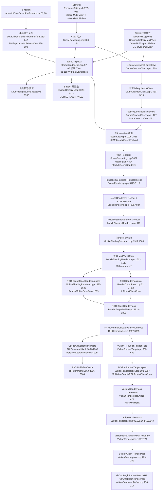

# Mobile MultiView 自顶向下调用链路

## 主链路

1. 开关入口：`Source/Runtime/Engine/Classes/Engine/RendererSettings.h:977` 将项目设置 `Mobile Multi-View` 绑定到 `vr.MobileMultiView`，`SceneRendering.cpp:220` 定义同名 CVar。
2. 平台声明：`Config/Android/DataDrivenPlatformInfo.ini:63`、`Config/Android/DataDrivenPlatformInfo.ini:80` 声明 Android GLES/Vulkan 支持 Mobile MultiView。
3. 平台能力查询：`Source/Runtime/RHI/Public/DataDrivenShaderPlatformInfo.h:239` 读取 `bSupportsMobileMultiView`，`Source/Runtime/RHI/Public/DataDrivenShaderPlatformInfo.h:988` 暴露为 `RHISupportsMobileMultiView()`。
4. RHI 运行时能力：Vulkan 在 `Source/Runtime/VulkanRHI/Private/VulkanRHI.cpp:943` 用 `HasKHRMultiview` 设置 `GSupportsMobileMultiView`；OpenGL ES 在 `Source/Runtime/OpenGLDrv/Private/OpenGLES.cpp:292` 检测 `GL_OVR_multiview*` 扩展并在 `OpenGLES.cpp:299` 设置支持标记。
5. Stereo Aspects 判定：`Source/Runtime/RenderCore/Private/StereoRenderUtils.cpp:57` 读取 `vr.MobileMultiView`，`StereoRenderUtils.cpp:81` 判断 mobile + cvar，`StereoRenderUtils.cpp:87` 走 native MMV，`StereoRenderUtils.cpp:91` 起尝试 ISR fallback，最终在 `StereoRenderUtils.cpp:118` 设置 `bMobileMultiViewEnabled`。
6. 启动验证：`Source/Runtime/Launch/Private/LaunchEngineLoop.cpp:6992` 构造 `FStereoShaderAspects`，`LaunchEngineLoop.cpp:6994` 记录日志，`LaunchEngineLoop.cpp:6995` 验证配置。
7. Shader 编译宏：`Source/Runtime/Engine/Private/ShaderCompiler/ShaderCompiler.cpp:8023` 构造 `FStereoShaderAspects`，`ShaderCompiler.cpp:8027` 写入 `MOBILE_MULTI_VIEW`。
8. Game Viewport 决定本帧是否要求 MMV：`Source/Runtime/Engine/Private/GameViewportClient.cpp:1369` 进入 `UGameViewportClient::Draw()`，`GameViewportClient.cpp:1417` 获取 `vr.MobileMultiView`，`GameViewportClient.cpp:1419` 计算 `bRequireMultiView`，`GameViewportClient.cpp:1427` 调用 `SetRequireMobileMultiView()`。
9. ViewFamily 保存要求：`Source/Runtime/Engine/Public/SceneView.h:2080` 说明该标记会让 SceneColor/Depth 按 multiview 分配，`SceneView.h:2081` 将值写入 `bRequireMultiView`。
10. View 实例启用 MMV：`Source/Runtime/Engine/Private/SceneView.cpp:1005` 构造 `FStereoShaderAspects`，`SceneView.cpp:1008` 检查 ViewFamily 要求但 RHI 不支持时 Fatal，`SceneView.cpp:1016` 设置 `View.bIsMobileMultiViewEnabled`。
11. Renderer 创建与调度：`Source/Runtime/Renderer/Private/SceneRendering.cpp:5087` 创建 SceneRenderer，`SceneRendering.cpp:4304` mobile shading path 创建 `FMobileSceneRenderer`，`SceneRendering.cpp:5113` 将渲染命令入队，`SceneRendering.cpp:4829` 调用 `SceneRenderer->Render()`，`SceneRendering.cpp:4834` 执行 RDG。
12. Mobile Renderer 设置 RenderTarget 的 MultiViewCount：`Source/Runtime/Renderer/Private/MobileShadingRenderer.cpp:910` 进入 `FMobileSceneRenderer::Render()`，`MobileShadingRenderer.cpp:1317` 进入 `RenderForward()`，`MobileShadingRenderer.cpp:1517` 根据 `MainView.bIsMobileMultiViewEnabled` 设置 `BasePassRenderTargets.MultiViewCount = 2`。
13. RDG Raster Pass：`MobileShadingRenderer.cpp:1590` 添加 `SceneColorRendering` raster pass，`MobileShadingRenderer.cpp:1609` 在该 pass 内绘制 `RenderMobileBasePass()`。
14. RDG 转 RHI RenderPass：`Source/Runtime/RenderCore/Private/RenderGraphBuilder.cpp:2922` 调用 `FRHICommandList::BeginRenderPass(Pass->GetParameters().GetRenderPassInfo())`；`Source/Runtime/RenderCore/Private/RenderGraphPass.cpp:32` 构建 `FRHIRenderPassInfo`，`RenderGraphPass.cpp:92` 复制 `RenderTargets.MultiViewCount`。
15. RHI 缓存 RenderTarget 状态：`Source/Runtime/RHI/Public/RHICommandList.h:3837` 进入 `BeginRenderPass()`，`RHICommandList.h:3854` 缓存 RenderTargets，`RHICommandList.h:1067` 保存 `PersistentState.MultiViewCount`，`RHICommandList.h:3664` 后续写入 `GraphicsPSOInit.MultiViewCount`。
16. Vulkan RHI 创建 RenderPass/Layout：`Source/Runtime/VulkanRHI/Private/VulkanRenderTarget.cpp:582` 进入 `FVulkanCommandListContext::RHIBeginRenderPass()`，`VulkanRenderTarget.cpp:680` 构造 `FVulkanRenderTargetLayout`，`VulkanRenderTarget.cpp:1006` 从 `RPInfo.MultiViewCount` 初始化 layout，`VulkanRenderTarget.cpp:683` 获取/创建 Vulkan RenderPass，`VulkanRenderTarget.cpp:687` 获取/创建 Framebuffer，`VulkanRenderTarget.cpp:689` 开始 RenderPass。
17. Vulkan Multiview mask：`Source/Runtime/VulkanRHI/Private/VulkanRenderpass.h:418` 构建 RenderPass create info，`VulkanRenderpass.h:424` 由 `RTLayout.GetMultiViewCount()` 生成 `MultiviewMask`，`VulkanRenderpass.h:505` 等处写入 subpass view mask，`VulkanRenderpass.h:707` 检测 multiview layout，`VulkanRenderpass.h:715` 检查 `KHR_multiview`，`VulkanRenderpass.h:716` 到 `VulkanRenderpass.h:724` 写入 `VkRenderPassMultiviewCreateInfo`。
18. Vulkan 命令提交：`Source/Runtime/VulkanRHI/Private/VulkanRenderpass.cpp:129` 进入 `FVulkanRenderPassManager::BeginRenderPass()`，`VulkanRenderpass.cpp:209` 调用 `CmdBuffer->BeginRenderPass()`；`Source/Runtime/VulkanRHI/Private/VulkanCommandBuffer.cpp:178` 组装 `VkRenderPassBeginInfo`，`VulkanCommandBuffer.cpp:212` 调用 `vkCmdBeginRenderPass2KHR()` 或 `VulkanCommandBuffer.cpp:216` 调用 `vkCmdBeginRenderPass()`。

## Mermaid

## 关键判定条件

- `vr.MobileMultiView != 0`：项目设置或 CVar 必须开启，入口见 `RendererSettings.h:977`、运行时读取见 `GameViewportClient.cpp:1417` 和 `StereoRenderUtils.cpp:59`。
- Mobile shading path：`GameViewportClient.cpp:1418` 要求当前 feature level 的 shading path 为 `EShadingPath::Mobile`。
- 立体渲染：`GameViewportClient.cpp:1415` 要求 `GEngine->IsStereoscopic3D()`。
- RHI/平台支持：`GameViewportClient.cpp:1419` 要求 `GSupportsMobileMultiView || GRHISupportsArrayIndexFromAnyShader`；shader aspect 侧还会通过 `RHISupportsMobileMultiView()` 或 vertex-layer fallback 判定。
- 非 SceneCapture 单视图：`SceneView.cpp:1013` 到 `SceneView.cpp:1016` 会排除普通 scene capture/reflection capture。
---
  在 Mobile MultiView 下，CPU 侧只渲染“主眼/左眼”一次：

    - 筛选位置：Source/Runtime/Renderer/Private/SceneRendering.h:1749，             
      注释明确写着 Instanced stereo and multi-view only need to render the left     
      eye
    - 判断逻辑：SceneRendering.h:1760，MMV 开启时只让非 secondary pass 的 view      
      进入渲染
    - 执行位置：Source/Runtime/Renderer/Private/MobileShadingRenderer.cpp:1522      
      收集要渲染的 view，MobileShadingRenderer.cpp:1524 循环渲染
    - 真正画 base pass：MobileShadingRenderer.cpp:1609 调 RenderMobileBasePass()

  右眼不是 CPU 再走一遍；是在 MobileShadingRenderer.cpp:1517 设置                 
  MultiViewCount = 2 后，由 Vulkan multiview / shader ViewIndex 在一次 draw       
  中广播到左右眼 layer。  