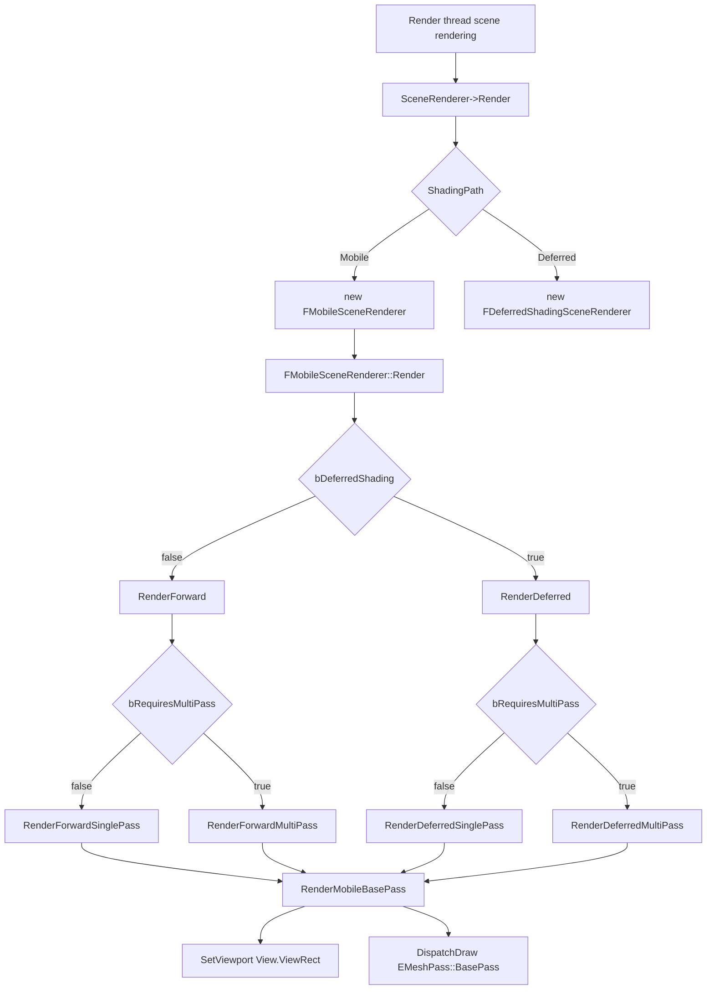
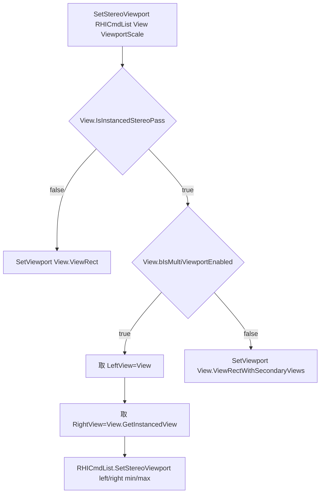
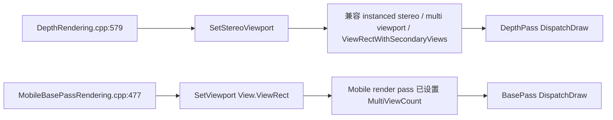
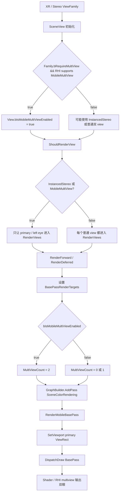

# Mobile VR 渲染与 RenderMobileBasePass 调用链说明

## 结论

移动端 VR 没有单独的 `VRBasePass`。移动端 VR 仍然走 `FMobileSceneRenderer` 的 mobile base pass 路径，最终进入：

- `Engine/Source/Runtime/Renderer/Private/MobileBasePassRendering.cpp:470`
- `FMobileSceneRenderer::RenderMobileBasePass(...)`

VR / 双眼渲染能力主要由 `FViewInfo` 上的 stereo / multiview 标记、RenderTarget 的 `MultiViewCount`、shader view uniform buffer、instance culling 共同控制，而不是由 `RenderMobileBasePass` 这个函数名区分。

## 关键源码位置

| 功能 | 文件位置 |
| --- | --- |
| 创建 mobile renderer | `Engine/Source/Runtime/Renderer/Private/SceneRendering.cpp:4275` |
| 根据 ShadingPath 创建 `FMobileSceneRenderer` | `Engine/Source/Runtime/Renderer/Private/SceneRendering.cpp:4296-4305` |
| 主渲染入口调用 `SceneRenderer->Render()` | `Engine/Source/Runtime/Renderer/Private/SceneRendering.cpp:4827-4829` |
| `FMobileSceneRenderer::Render()` | `Engine/Source/Runtime/Renderer/Private/MobileShadingRenderer.cpp:910` |
| mobile forward / deferred 分支 | `Engine/Source/Runtime/Renderer/Private/MobileShadingRenderer.cpp:1311-1318` |
| mobile forward base pass 调用 | `Engine/Source/Runtime/Renderer/Private/MobileShadingRenderer.cpp:1609`、`1682` |
| mobile deferred base pass 调用 | `Engine/Source/Runtime/Renderer/Private/MobileShadingRenderer.cpp:1968`、`2011` |
| `RenderMobileBasePass` 实现 | `Engine/Source/Runtime/Renderer/Private/MobileBasePassRendering.cpp:470-491` |
| mobile VR / multiview view flag 初始化 | `Engine/Source/Runtime/Engine/Private/SceneView.cpp:1001-1016` |
| Instanced Stereo / Mobile MultiView 只渲染 primary view | `Engine/Source/Runtime/Renderer/Private/SceneRendering.h:1749-1768` |
| `SetStereoViewport` 实现 | `Engine/Source/Runtime/Renderer/Private/SceneRendering.cpp:5690-5717` |
| Deferred depth pass 使用 `SetStereoViewport` | `Engine/Source/Runtime/Renderer/Private/DepthRendering.cpp:579` |
| Mobile prepass 使用 `SetStereoViewport` | `Engine/Source/Runtime/Renderer/Private/DepthRendering.cpp:666-679` |

## 总体调用链



对应代码：

1. `SceneRendering.cpp:4275-4305` 根据 `GetFeatureLevelShadingPath()` 创建 `FMobileSceneRenderer`。
2. `SceneRendering.cpp:4827-4829` 调用 `SceneRenderer->Render(GraphBuilder)`。
3. `MobileShadingRenderer.cpp:910` 进入 `FMobileSceneRenderer::Render()`。
4. `MobileShadingRenderer.cpp:1311-1318` 选择 `RenderDeferred()` 或 `RenderForward()`。
5. `MobileShadingRenderer.cpp:1609`、`1682`、`1968`、`2011` 调用 `RenderMobileBasePass()`。
6. `MobileBasePassRendering.cpp:477-478` 设置 viewport 并 dispatch base pass mesh draw command。

## 移动端 VR / Mobile MultiView 如何接入

移动端 VR 的关键不是 `RenderMobileBasePass` 自身判断 VR，而是 view 初始化和 render target 设置。

### 1. View 初始化 stereo / multiview 标记

`SceneView.cpp:1001-1016` 中初始化：

- `bShouldBindInstancedViewUB`
- `bIsInstancedStereoEnabled`
- `bIsMultiViewportEnabled`
- `bIsMobileMultiViewEnabled`

其中 mobile multiview 的核心条件是：

```cpp
bIsMobileMultiViewEnabled = !bIsSingleViewCapture && Family && Family->bRequireMultiView && Aspects.IsMobileMultiViewEnabled();
```

含义：

- 当前不是普通 scene capture / reflection capture；
- `ViewFamily` 要求 multiview；
- 当前 RHI / shader platform 支持 mobile multiview。

### 2. Mobile MultiView / Instanced Stereo 只提交 primary view

`SceneRendering.h:1749-1768`：

```cpp
/** Instanced stereo and multi-view only need to render the left eye. */
bool ShouldRenderView() const
```

逻辑是：

- 没有 visible primitive：不渲染；
- 非 instanced stereo 且非 mobile multiview：渲染该 view；
- instanced stereo 或 mobile multiview：只渲染非 secondary pass，也就是 primary / left eye；
- secondary eye 不单独进入常规 draw 提交流程。

### 3. Mobile renderer 只遍历 ShouldRenderView 的 view

`MobileShadingRenderer.cpp:264-285`：

```cpp
static void GetRenderViews(TArrayView<FViewInfo> InViews, FRenderViewContextArray& RenderViews)
```

它只把 `View.ShouldRenderView()` 为 true 的 view 放进 `RenderViews`。

因此移动端 VR 在 mobile multiview / instanced stereo 模式下，通常只会让 primary view 进入 `RenderForward()` / `RenderDeferred()` 的 base pass 调用链。

### 4. BasePass RenderTarget 设置 MultiViewCount

`MobileShadingRenderer.cpp:1513-1518`：

```cpp
BasePassRenderTargets.MultiViewCount = MainView.bIsMobileMultiViewEnabled ? 2 : (bIsMultiViewApplication ? 1 : 0);
```

含义：

- `MainView.bIsMobileMultiViewEnabled == true`：base pass render target 以 2 层 multiview 方式渲染，代表双眼；
- 不是实际 multiview view，但 app 开了 `vr.MobileMultiView`：可能用 single-view multiview 兼容 shader 变体；
- 非 multiview：`MultiViewCount = 0`。

### 5. Instance culling / draw command 也知道 stereo

`MobileShadingRenderer.cpp:392-400`：

```cpp
EInstanceCullingMode InstanceCullingMode = View.IsInstancedStereoPass() ? EInstanceCullingMode::Stereo : EInstanceCullingMode::Normal;
```

如果是 instanced stereo pass，会把 primary view 和 instanced view 的 `GPUSceneViewId` 都加入 `ViewIds`，让后续 instance culling / draw command 能按 stereo 模式处理。

## MobileBasePassRendering.cpp:470 和移动 VR 的关系

`RenderMobileBasePass` 本身逻辑很薄：

```cpp
void FMobileSceneRenderer::RenderMobileBasePass(FRHICommandList& RHICmdList, const FViewInfo& View, const FInstanceCullingDrawParams* InstanceCullingDrawParams)
{
    RHICmdList.SetViewport(View.ViewRect.Min.X, View.ViewRect.Min.Y, 0, View.ViewRect.Max.X, View.ViewRect.Max.Y, 1);
    View.ParallelMeshDrawCommandPasses[EMeshPass::BasePass].DispatchDraw(nullptr, RHICmdList, InstanceCullingDrawParams);
    ...
}
```

它不直接判断 `bIsMobileMultiViewEnabled`，原因是 mobile multiview 的双眼语义已经在更外层完成：

1. `View` 是否被渲染由 `ShouldRenderView()` 决定；
2. RenderTarget 是否是 multiview 由 `BasePassRenderTargets.MultiViewCount` 决定；
3. shader 通过 `View.GetShaderParameters()` 同时持有 `View` 和 `InstancedView`；
4. draw command / instance culling 通过 stereo instance factor 或 stereo culling mode 处理双眼实例。

所以 `RenderMobileBasePass` 的 `SetViewport(View.ViewRect...)` 是设置 primary view 的逻辑 viewport；在 mobile multiview 下，双眼输出不是靠这里设置两个 viewport，而是靠 multiview render pass / shader / RHI 层处理。

## 为什么 DepthRendering.cpp 用 SetStereoViewport

`DepthRendering.cpp:579` 在 deferred depth pass 中使用：

```cpp
SetStereoViewport(RHICmdList, View, 1.0f);
View.ParallelMeshDrawCommandPasses[DepthMeshPass].DispatchDraw(...);
```

`DepthRendering.cpp:666-679` 的 mobile prepass 也使用：

```cpp
SetStereoViewport(RHICmdList, View);
View.ParallelMeshDrawCommandPasses[EMeshPass::DepthPass].DispatchDraw(...);
```

核心原因：depth pass / prepass 是通用的 stereo-aware 绘制阶段，需要兼容：

- 普通单眼 / 非 stereo；
- instanced stereo；
- multi-viewport stereo；
- side-by-side / secondary view rect union 这类布局。

`SetStereoViewport` 的实现位于 `SceneRendering.cpp:5690-5717`。

## SetStereoViewport 逻辑



具体逻辑：

### 非 instanced stereo

`SceneRendering.cpp:5713-5716`：

```cpp
RHICmdList.SetViewport(View.ViewRect.Min.X * ViewportScale, ... View.ViewRect.Max.Y * ViewportScale, 1.0f);
```

这和普通 `SetViewport(View.ViewRect)` 基本一致。

### Instanced stereo + multi viewport

`SceneRendering.cpp:5692-5707`：

```cpp
if (View.IsInstancedStereoPass())
{
    if (View.bIsMultiViewportEnabled)
    {
        const FViewInfo& LeftView = View;
        const FViewInfo& RightView = static_cast<const FViewInfo&>(*View.GetInstancedView());
        RHICmdList.SetStereoViewport(LeftMinX, RightMinX, 0, 0, 0.0f, LeftMaxX, RightMaxX, LeftMaxY, RightMaxY, 1.0f);
    }
}
```

这里会同时把左右眼 viewport 信息提交给 RHI。

### Instanced stereo 但不是 multi viewport

`SceneRendering.cpp:5708-5711`：

```cpp
RHICmdList.SetViewport(View.ViewRectWithSecondaryViews.Min.X, ... View.ViewRectWithSecondaryViews.Max.Y, 1.0f);
```

这种情况下不是分别设置左右眼 viewport，而是设置覆盖 primary + secondary 的合并 rect。

## SetViewport vs SetStereoViewport 对比

| 函数 | 作用 | 典型使用场景 |
| --- | --- | --- |
| `RHICmdList.SetViewport(...)` | 设置单个 viewport | 非 stereo，或外层 render pass 已经处理 multiview 层语义 |
| `FSceneRenderer::SetStereoViewport(...)` | 根据 `View` 自动选择单 viewport、合并 viewport 或 RHI stereo viewport | depth pass、base pass、translucency 等需要显式兼容 instanced stereo / multi viewport 的路径 |
| `RHICmdList.SetStereoViewport(...)` | RHI 层设置左右眼 viewport | `View.bIsMultiViewportEnabled == true` 的 instanced stereo |

## MobileBasePass 为什么不用 SetStereoViewport

`MobileBasePassRendering.cpp:477` 使用：

```cpp
RHICmdList.SetViewport(View.ViewRect.Min.X, View.ViewRect.Min.Y, 0, View.ViewRect.Max.X, View.ViewRect.Max.Y, 1);
```

从当前代码结构看，mobile base pass 依赖的是 mobile render pass 的 multiview 设置，而不是在 base pass 函数里显式调用 `SetStereoViewport`：

- `RenderForward()` 初始化 `BasePassRenderTargets.MultiViewCount`：`MobileShadingRenderer.cpp:1513-1518`；
- `GetRenderViews()` 只提交 primary view：`MobileShadingRenderer.cpp:264-285`；
- `ShouldRenderView()` 说明 instanced stereo / multiview 只需要渲染左眼：`SceneRendering.h:1749-1768`；
- `RenderMobileBasePass()` 用当前 primary view rect 设置 viewport 并 dispatch draw：`MobileBasePassRendering.cpp:477-478`。

因此移动 VR 的双眼输出不是靠 `RenderMobileBasePass()` 里调用 `SetStereoViewport()` 实现，而是靠 mobile multiview render target、shader view 参数和 RHI multiview 机制实现。

## DepthRendering.cpp:579 和 MobileBasePassRendering.cpp:477 的差异



差异总结：

1. `DepthRendering.cpp:579` 属于 depth pass 的 stereo-aware 通用路径，显式调用 `SetStereoViewport()`，保证不同 stereo viewport 布局都能覆盖正确区域。
2. `MobileBasePassRendering.cpp:477` 属于 mobile base pass，当前函数只设置传入 `View` 的 `ViewRect`。
3. mobile VR / mobile multiview 的双眼语义在 `RenderForward()` 的 render target、`ShouldRenderView()`、shader view 参数和 RHI multiview 层完成。
4. 所以 `RenderMobileBasePass()` 是移动 VR 会经过的 base pass 绘制函数，但它本身不是 VR 专用函数，也不负责决定左右眼 viewport。

## 移动 VR BasePass 逻辑图



## 结论补充

- `RenderMobileBasePass` 是移动端 VR base pass 的实际绘制入口之一。
- `RenderMobileBasePass` 不是 VR 专用函数，普通 mobile 渲染也走它。
- mobile multiview 下通常只提交 primary view，secondary eye 由 multiview / instancing 机制生成。
- `DepthRendering.cpp` 的 `SetStereoViewport` 是更通用的 stereo viewport 适配函数，处理 instanced stereo / multi viewport / 合并 view rect。
- `MobileBasePassRendering.cpp` 的 `SetViewport` 不代表它不是 VR 路径，而是 mobile VR 的双眼处理不在这个函数里完成。
