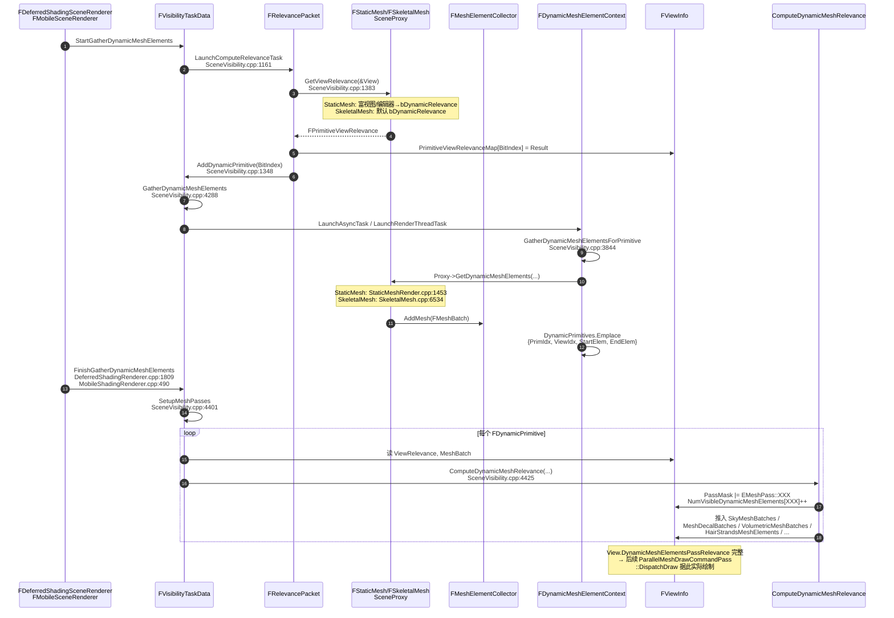

# `ComputeDynamicMeshRelevance` 调用链分析 — StaticMesh & SkeletalMesh

> 目标函数：`ComputeDynamicMeshRelevance`
> 位置：`Engine/Source/Runtime/Renderer/Private/SceneVisibility.cpp:2186`（文件作用域 `static` 函数）
> 关注范围：**仅** `FStaticMeshSceneProxy` 与 `FSkeletalMeshSceneProxy` 的动态批走法
> 引擎版本：UE 5.4（MR01_DaNaoTianGong_Main）

---

## 0. 一句话总结

`ComputeDynamicMeshRelevance` 是 **动态 mesh element 的 pass 路由器**：拿 `FRelevancePacket::ComputeRelevance` 算出的 `FPrimitiveViewRelevance` 与 `Proxy::GetDynamicMeshElements` 收集到的 `FMeshBatchAndRelevance`，把它派发到 `EMeshPass::*` 各通道（BasePass / DepthPass / Velocity / Translucency / SkyPass / CustomDepth / SingleLayerWater / Distortion / Decal / Hair / VolumetricMesh / Lightmap / Editor 等），并累加 `View.NumVisibleDynamicMeshElements[Pass]`、设置 `FMeshPassMask`、把 batch 收集到 `View` 的各种 `*MeshBatches` 数组。

它的"上游"是 §1 的 `FVisibilityTaskData::SetupMeshPasses`；"下游"是 `FParallelMeshDrawCommandPass::DispatchDraw` / `MeshDrawCommands` 实际渲染。

---

## 1. 调用栈：谁会调到 `ComputeDynamicMeshRelevance`？

### 1.1 唯一调用点

文件：`Engine/Source/Runtime/Renderer/Private/SceneVisibility.cpp:4425`（`FVisibilityTaskData::SetupMeshPasses` 内）

```cpp
void FVisibilityTaskData::SetupMeshPasses(FExclusiveDepthStencil::Type BasePassDepthStencilAccess,
                                          FInstanceCullingManager& InstanceCullingManager)
{
    DynamicMeshElements.ContextContainer.MergeContexts(DynamicMeshElements.DynamicPrimitives);

    {
        SCOPED_NAMED_EVENT(DynamicRelevance, FColor::Magenta);

        for (FViewInfo* View : Views)
        {
            View->DynamicMeshElementsPassRelevance.SetNum(View->DynamicMeshElements.Num());
        }

        for (FDynamicPrimitive DynamicPrimitive : DynamicMeshElements.DynamicPrimitives)   // ← (★)
        {
            FPrimitiveSceneInfo* PrimitiveSceneInfo = Scene.Primitives[DynamicPrimitive.PrimitiveIndex];
            const FPrimitiveBounds& Bounds          = Scene.PrimitiveBounds[DynamicPrimitive.PrimitiveIndex];
            FViewInfo& View                         = *Views[DynamicPrimitive.ViewIndex];
            const FPrimitiveViewRelevance& ViewRelevance =
                View.PrimitiveViewRelevanceMap[DynamicPrimitive.PrimitiveIndex];

            for (int32 ElementIndex = DynamicPrimitive.StartElementIndex;
                       ElementIndex < DynamicPrimitive.EndElementIndex; ++ElementIndex)
            {
                const FMeshBatchAndRelevance& MeshBatch = View.DynamicMeshElements[ElementIndex];
                FMeshPassMask& PassRelevance            = View.DynamicMeshElementsPassRelevance[ElementIndex];

                ComputeDynamicMeshRelevance(ShadingPath, bAddLightmapDensityCommands,    // ← (★★)
                                            ViewRelevance, MeshBatch, View,
                                            PassRelevance, PrimitiveSceneInfo, Bounds);
            }
        }
    }
    // ...
}
```

### 1.2 上游：从 Renderer Render() 到 SetupMeshPasses

```
FDeferredShadingSceneRenderer::Render(...)                       DeferredShadingRenderer.cpp
   └─ ... (FrustumCull → ComputeRelevance 见前文档 §A.2) ...
   └─ InitViewTaskDatas.VisibilityTaskData
         ->FinishGatherDynamicMeshElements(...)                  DeferredShadingRenderer.cpp:1809

FMobileSceneRenderer::Render(...)                                MobileShadingRenderer.cpp
   └─ TaskDatas.VisibilityTaskData
         ->FinishGatherDynamicMeshElements(...)                  MobileShadingRenderer.cpp:490

FSceneHitProxyRenderer::Render(...)                              SceneHitProxyRendering.cpp
   └─ InitViewTaskDatas.VisibilityTaskData
         ->FinishGatherDynamicMeshElements(...)                  SceneHitProxyRendering.cpp:639

         ↓

FVisibilityTaskData::FinishGatherDynamicMeshElements             SceneVisibility.cpp:4581
   ├─ (并发处理动态 mesh elements gather 收尾)
   └─ SetupMeshPasses(...)                                       SceneVisibility.cpp:4593
         └─ for each FDynamicPrimitive in DynamicMeshElements.DynamicPrimitives:
              for each MeshBatch in [StartElementIndex, EndElementIndex):
                 ComputeDynamicMeshRelevance(...)                SceneVisibility.cpp:4425  ★
```

### 1.3 入口数据来自哪里？—— `DynamicMeshElements.DynamicPrimitives` 的填充

`FDynamicPrimitive` 是一个轻量结构：
```cpp
struct FDynamicPrimitive {
    int32 PrimitiveIndex;     // 索引到 Scene.Primitives
    int32 ViewIndex;
    int32 StartElementIndex;  // View.DynamicMeshElements 的区间
    int32 EndElementIndex;
};
```

它在 **`FDynamicMeshElementContext::GatherDynamicMeshElementsForPrimitive`**（`SceneVisibility.cpp:3844`）中被填：

```cpp
void FDynamicMeshElementContext::GatherDynamicMeshElementsForPrimitive(FPrimitiveSceneInfo* Primitive, uint8 ViewMask)
{
    TArray<int32, TInlineAllocator<4>> MeshBatchCountBefore;
    MeshBatchCountBefore.SetNumUninitialized(Views.Num());
    for (int32 ViewIndex = 0; ViewIndex < Views.Num(); ViewIndex++)
        MeshBatchCountBefore[ViewIndex] = MeshCollector.GetMeshBatchCount(ViewIndex);

    MeshCollector.SetPrimitive(Primitive->Proxy, Primitive->DefaultDynamicHitProxyId);
    Primitive->Proxy->GetDynamicMeshElements(ViewFamily.AllViews, ViewFamily, ViewMask, MeshCollector);  // ← (★★★)

    for (int32 ViewIndex = 0; ViewIndex < Views.Num(); ViewIndex++)
    {
        if (ViewMask & (1 << ViewIndex))
        {
            FDynamicPrimitive& DynamicPrimitive = DynamicPrimitives.Emplace_GetRef();
            DynamicPrimitive.PrimitiveIndex    = Primitive->GetIndex();
            DynamicPrimitive.ViewIndex         = ViewIndex;
            DynamicPrimitive.StartElementIndex = MeshBatchCountBefore[ViewIndex];
            DynamicPrimitive.EndElementIndex   = MeshCollector.GetMeshBatchCount(ViewIndex);
        }
    }
}
```

**关键虚函数 `Proxy->GetDynamicMeshElements(...)`** 派发到：

| Proxy | 实现位置 |
|-------|----------|
| `FStaticMeshSceneProxy::GetDynamicMeshElements` | `StaticMeshRender.cpp:1453` |
| `FSkeletalMeshSceneProxy::GetDynamicMeshElements` | `SkeletalMesh.cpp:6534`（再委托 `GetMeshElementsConditionallySelectable`） |

### 1.4 这些 primitive 怎么变成 "dynamic" 的？

回到 `FRelevancePacket::ComputeRelevance`（`SceneVisibility.cpp:1299`，前置文档 §A.2 已分析），其中有这么几个分支（`SceneVisibility.cpp:1840-1858`）：

```cpp
if (bEditorVisualizeLevelInstanceRelevance)      AddEditorDynamicPrimitive(BitIndex);
else if (bDynamicRelevance)                       AddDynamicPrimitive(BitIndex);       // ← (★)
else if (bHairStrandsRelevance)                   AddDynamicPrimitive(BitIndex);
```

`AddDynamicPrimitive` lambda（`SceneVisibility.cpp:1347`）会把 `BitIndex` 写入 `DynamicPrimitiveIndexList.Primitives`，最终：

```
FRelevancePacket::ComputeRelevance        SceneVisibility.cpp:1299
   └─ AddDynamicPrimitive(BitIndex)        SceneVisibility.cpp:1348
        → DynamicPrimitiveIndexList.Primitives.Add({BitIndex, ViewBit})
         ↓
FVisibilityTaskData::GatherDynamicMeshElements  SceneVisibility.cpp:4288 / :4341
   └─ (按 SupportsParallelGDME 拆并发/RT 队列)
   └─ FDynamicMeshElementContext::LaunchAsyncTask / LaunchRenderThreadTask
         → GatherDynamicMeshElementsForPrimitive (§1.3)
            → Proxy->GetDynamicMeshElements(...) (§1.3 ★★★)
            → DynamicPrimitives 数组追加 FDynamicPrimitive
         ↓
FVisibilityTaskData::SetupMeshPasses      SceneVisibility.cpp:4401
   └─ ComputeDynamicMeshRelevance(...)    SceneVisibility.cpp:4425
```

---

## 2. StaticMesh 何时走"动态批"？

`FStaticMeshSceneProxy::GetViewRelevance`（`StaticMeshRender.cpp:2055`）中决定走静态/动态：

```cpp
if (
#if !(UE_BUILD_SHIPPING) || WITH_EDITOR
    IsRichView(*View->Family) ||
    View->Family->EngineShowFlags.Collision ||
    bInCollisionView ||
    View->Family->EngineShowFlags.Bounds ||
    View->Family->EngineShowFlags.VisualizeInstanceUpdates ||
#endif
#if WITH_EDITOR
    (IsSelected() && View->Family->EngineShowFlags.VertexColors) ||
    (IsSelected() && View->Family->EngineShowFlags.PhysicalMaterialMasks) ||
#endif
#if STATICMESH_ENABLE_DEBUG_RENDERING
    bDrawMeshCollisionIfComplex ||
    bDrawMeshCollisionIfSimple ||
#endif
    (bAllowStaticLighting && HasStaticLighting() && !HasValidSettingsForStaticLighting()) ||
    HasViewDependentDPG()
   )
{
    Result.bDynamicRelevance = true;     // ← 走动态批 → ComputeDynamicMeshRelevance
}
else
{
    Result.bStaticRelevance = true;      // ← 走静态批 → SceneVisibility.cpp:1402+ 内联处理
}
```

**StaticMesh 走 `ComputeDynamicMeshRelevance` 的典型场景：**

- 富视图（`IsRichView`：编辑器视口、调试视图、可见性 visualization 等）
- ShowFlag 触发：`Collision` / `Bounds` / `VisualizeInstanceUpdates`
- 编辑器选中 + 顶点色 / 物理材质 mask 可视化
- 调试碰撞绘制（`STATICMESH_ENABLE_DEBUG_RENDERING`）
- 静态光照设置无效（错误回退路径，会用 error material 走 dynamic）
- 视图相关深度优先级组（`HasViewDependentDPG`）

> 正常运行时（PIE/Standalone）绝大多数 StaticMesh **不走** `ComputeDynamicMeshRelevance`，走静态批分支。

---

## 3. SkeletalMesh 何时走"动态批"？—— 默认就是

`FSkeletalMeshSceneProxy::GetViewRelevance`（`SkeletalMesh.cpp:7107`）：

```cpp
Result.bStaticRelevance  = bRenderStatic && !IsRichView(*View->Family);
Result.bDynamicRelevance = !Result.bStaticRelevance;
```

也就是说：

| `bRenderStatic` | `IsRichView` | 结果 |
|-----------------|--------------|------|
| `false`（默认） | — | **动态批** ← 绝大多数 SkeletalMesh |
| `true` | `false` | 静态批 |
| `true` | `true` | 动态批 |

`bRenderStatic` 是 `USkeletalMeshComponent` 的可选优化（"Static Pose"，骨骼不动时缓存为静态批），默认 `false`。所以 **SkeletalMesh 在游戏中绝大多数情况下都会走 `ComputeDynamicMeshRelevance` 这条路径**——这是它和 StaticMesh 最显著的差异。

---

## 4. `ComputeDynamicMeshRelevance` 内部逻辑分块详解

参数：
- `EShadingPath ShadingPath` —— Mobile / Deferred 渲染路径
- `bool bAddLightmapDensityCommands` —— 是否处于 lightmap density visualization 模式
- `const FPrimitiveViewRelevance& ViewRelevance` —— 由 §A.2 写入 `View.PrimitiveViewRelevanceMap[BitIndex]`
- `const FMeshBatchAndRelevance& MeshBatch` —— 由 §1.3 中 `Proxy->GetDynamicMeshElements` 通过 `MeshCollector` 收集
- `FViewInfo& View` —— 输出端
- `FMeshPassMask& PassMask` —— 输出位掩码，标记该 batch 进入哪些 EMeshPass
- `FPrimitiveSceneInfo* PrimitiveSceneInfo`
- `const FPrimitiveBounds& Bounds`

### 4.1 不透明/Masked 几何块（line 2198-2286）

总闸门：`bDrawRelevance && (bRenderInMainPass || bRenderCustomDepth || bRenderInDepthPass)`

| 子条件 | 输出 EMeshPass | 行号 |
|--------|----------------|------|
| `bRenderInSecondStageDepthPass && ShadingPath != Mobile` | `SecondStageDepthPass` | 2202 |
| 否则 | `DepthPass` | 2207 |
| `bRenderInMainPass \|\| bRenderCustomDepth`（进入子块） | — | 2211 |
| ↳ 默认 | `BasePass` | 2213 |
| ↳ `bUsesSkyMaterial` | `SkyPass` | 2218 |
| ↳ `bUsesAnisotropy` | `AnisotropyPass` | 2224 |
| ↳ `ShadingPath == Mobile` | `MobileBasePassCSM` | 2230 |
| ↳ `bRenderCustomDepth` | `CustomDepth` | 2236 |
| ↳ `bAddLightmapDensityCommands` | `LightmapDensity` | 2242 |
| ↳ 非 Shipping/Test + DebugViewPS | `DebugViewMode` | 2248 |
| ↳ WITH_EDITOR + `bAllowTranslucentPrimitivesInHitProxy` | `HitProxy` | 2256 |
| ↳ WITH_EDITOR + 否则 | `HitProxyOpaqueOnly` | 2261 |
| ↳ `bVelocityRelevance` | `Velocity` | 2268 |
| ↳ `bOutputsTranslucentVelocity` | `TranslucentVelocity` | 2274 |
| ↳ `bUsesSingleLayerWaterMaterial` | `SingleLayerWaterPass` + `SingleLayerWaterDepthPrepass` | 2280/2282 |

### 4.2 半透明几何块（line 2288-2344）

总闸门：`HasTranslucency() && !bEditorPrimitiveRelevance && bRenderInMainPass`

- `View.Family->AllowTranslucencyAfterDOF()` 为真时（桌面默认）：分别按 `bNormalTranslucency` / `bSeparateTranslucency` / `bTranslucencyModulate` / `bPostMotionBlurTranslucency` 派发到：
  - `TranslucencyStandard` / `TranslucencyStandardModulate`
  - `TranslucencyAfterDOF` / `TranslucencyAfterDOFModulate`
  - `TranslucencyAfterMotionBlur`
- 否则（mobile 简化路径）：统一进 `TranslucencyAll`
- 附加：
  - `bTranslucentSurfaceLighting` → `LumenTranslucencyRadianceCacheMark` + `LumenFrontLayerTranslucencyGBuffer`
  - `bDistortion` → `Distortion`

### 4.3 编辑器 / Hair 选择块（line 2346-2364，WITH_EDITOR）

- `bDrawRelevance` → `EditorSelection` + `EditorLevelInstance`
- `bHairStrands`（hair strands 不进 BasePass，但允许选中）→ `HitProxy` 或 `HitProxyOpaqueOnly`

### 4.4 特殊 batch 数组收集（line 2366-2429）

不进 `PassMask`，而是直接把 `MeshBatch` 推到 `View` 的命名数组：

| 条件 | 目标数组 | 行号 |
|------|---------|------|
| `bHasVolumeMaterialDomain` + heterogeneous volumes | `View.HeterogeneousVolumesMeshBatches` | 2370 |
| `bHasVolumeMaterialDomain` 其它 | `View.VolumetricMeshBatches` | 2377 |
| `bUsesSkyMaterial` | `View.SkyMeshBatches` | 2386 |
| `HasTranslucency() && SupportsSortedTriangles()` | `View.SortedTrianglesMeshBatches` | 2396 |
| `bRenderInMainPass && bDecal` | `View.MeshDecalBatches` | 2404 |
| Hair 兼容 + `IsHairStrandsVF` + `IsHairVisible` | `View.HairStrandsMeshElements` | 2418 |
| Hair 兼容 + `IsHairCardsVF` + `bRenderInMainPass` | `View.HairCardsMeshElements` | 2425 |

---

## 5. 端到端时间线

```
[T0] 渲染线程进入 InitViews
     FDeferredShadingSceneRenderer::Render / FMobileSceneRenderer::Render

[T1] Visibility 任务系统启动
     StartGatherDynamicMeshElements
        ├─ FrustumCull 任务
        └─ ComputeRelevance 任务 (前文档 §A.2)
              └─ FRelevancePacket::ComputeRelevance     SceneVisibility.cpp:1299
                    ├─ ViewRelevance = Proxy->GetViewRelevance(&View)  @1383
                    │     ├─ FStaticMeshSceneProxy::GetViewRelevance   StaticMeshRender.cpp:2055
                    │     │   → 视情况 bDynamicRelevance = true
                    │     └─ FSkeletalMeshSceneProxy::GetViewRelevance SkeletalMesh.cpp:7107
                    │         → 通常 bDynamicRelevance = true
                    └─ if (bDynamicRelevance) AddDynamicPrimitive(BitIndex)  @1348

[T2] Visibility 任务收尾
     FVisibilityTaskData::GatherDynamicMeshElements      SceneVisibility.cpp:4288
        ├─ 按 SupportsParallelGDME 拆为 async / render-thread 队列
        ├─ FDynamicMeshElementContext::LaunchAsyncTask / LaunchRenderThreadTask
        └─ 每个 primitive:
              GatherDynamicMeshElementsForPrimitive       SceneVisibility.cpp:3844
                  ├─ MeshCollector.SetPrimitive(Proxy, ...)
                  ├─ Proxy->GetDynamicMeshElements(...)
                  │     ├─ FStaticMeshSceneProxy::GetDynamicMeshElements   StaticMeshRender.cpp:1453
                  │     └─ FSkeletalMeshSceneProxy::GetDynamicMeshElements SkeletalMesh.cpp:6534
                  │            (Proxy 把当前帧需要画的 MeshBatch 推到 MeshCollector)
                  └─ DynamicPrimitives.Emplace(FDynamicPrimitive{
                            PrimitiveIndex, ViewIndex,
                            StartElementIndex, EndElementIndex });

[T3] FinishGatherDynamicMeshElements
     FVisibilityTaskData::FinishGatherDynamicMeshElements   SceneVisibility.cpp:4581
        └─ SetupMeshPasses(BasePassDepthStencilAccess, ICM) SceneVisibility.cpp:4401
              ├─ ContextContainer.MergeContexts(DynamicPrimitives)
              ├─ for each View:
              │     View->DynamicMeshElementsPassRelevance.SetNum(...)
              └─ for each FDynamicPrimitive DP:
                    SceneInfo = Scene.Primitives[DP.PrimitiveIndex]
                    View      = Views[DP.ViewIndex]
                    ViewRelevance = View.PrimitiveViewRelevanceMap[DP.PrimitiveIndex]   ← (来自 T1)
                    for ElementIndex in [DP.Start, DP.End):
                        MeshBatch     = View.DynamicMeshElements[ElementIndex]          ← (来自 T2)
                        PassRelevance = View.DynamicMeshElementsPassRelevance[ElementIndex]
                        ComputeDynamicMeshRelevance(
                            ShadingPath, bAddLightmapDensityCommands,
                            ViewRelevance, MeshBatch, View,
                            PassRelevance, SceneInfo, Bounds);                          ← (本文重点 ★)

[T4] ComputeDynamicMeshRelevance 内部：分块派发（§4）
     → PassRelevance |= EMeshPass::BasePass / DepthPass / SkyPass / Anisotropy /
                        CustomDepth / Velocity / TranslucentVelocity /
                        SingleLayerWater(+DepthPrepass) / MobileBasePassCSM /
                        Translucency 系列 / Lumen 系列 / Distortion /
                        Editor / HitProxy / LightmapDensity / DebugViewMode
     → View.NumVisibleDynamicMeshElements[Pass] 累加
     → View.SkyMeshBatches / MeshDecalBatches / VolumetricMeshBatches /
        HairStrandsMeshElements / HairCardsMeshElements / SortedTrianglesMeshBatches /
        HeterogeneousVolumesMeshBatches 收集

[T5] 后续渲染
     View.DynamicMeshElementsPassRelevance 被 ParallelMeshDrawCommandPass
     在各 EMeshPass 实际 DispatchDraw 时读取，知道每个 dynamic batch 在哪些 pass 绘制。
```

---

## 6. Mermaid 图

### 6.1 端到端 sequenceDiagram



### 6.2 入口决策树（StaticMesh vs SkeletalMesh 各自是否进 `ComputeDynamicMeshRelevance`）

```mermaid
flowchart TD
    A["Proxy->GetViewRelevance(&View)<br/>SceneVisibility.cpp:1383"] --> B{Proxy 类型?}
    B -->|StaticMesh| SM["FStaticMeshSceneProxy::GetViewRelevance<br/>StaticMeshRender.cpp:2055"]
    B -->|SkeletalMesh| SK["FSkeletalMeshSceneProxy::GetViewRelevance<br/>SkeletalMesh.cpp:7107"]

    SM --> SM_Q{IsRichView /<br/>Collision / Bounds /<br/>STATICMESH_DEBUG /<br/>静态光照错误 /<br/>HasViewDependentDPG ?}
    SM_Q -->|否| SM_S["bStaticRelevance = true<br/>→ 静态批分支<br/>SceneVisibility.cpp:1402+<br/>(不调用 ComputeDynamicMeshRelevance)"]
    SM_Q -->|是| SM_D["bDynamicRelevance = true"]

    SK --> SK_Q{bRenderStatic &&<br/>!IsRichView ?}
    SK_Q -->|是 (罕见)| SK_S["bStaticRelevance = true<br/>→ 静态批分支"]
    SK_Q -->|否 (默认)| SK_D["bDynamicRelevance = true"]

    SM_D --> AD["AddDynamicPrimitive(BitIndex)<br/>SceneVisibility.cpp:1348"]
    SK_D --> AD
    AD --> GD["FVisibilityTaskData::GatherDynamicMeshElements<br/>SceneVisibility.cpp:4288"]
    GD --> GDFP["FDynamicMeshElementContext::<br/>GatherDynamicMeshElementsForPrimitive<br/>SceneVisibility.cpp:3844"]
    GDFP --> GDM["Proxy->GetDynamicMeshElements(...)"]
    GDM --> SM_GDM["FStaticMeshSceneProxy::GetDynamicMeshElements<br/>StaticMeshRender.cpp:1453"]
    GDM --> SK_GDM["FSkeletalMeshSceneProxy::GetDynamicMeshElements<br/>SkeletalMesh.cpp:6534"]
    SM_GDM --> DP["DynamicPrimitives 数组追加<br/>FDynamicPrimitive{PrimIdx, ViewIdx, Start, End}"]
    SK_GDM --> DP
    DP --> SMP["FVisibilityTaskData::SetupMeshPasses<br/>SceneVisibility.cpp:4401"]
    SMP --> COMP["ComputeDynamicMeshRelevance(...)<br/>SceneVisibility.cpp:4425"]
```

### 6.3 `ComputeDynamicMeshRelevance` 内部分发

```mermaid
flowchart TD
    IN["ComputeDynamicMeshRelevance<br/>(ViewRelevance, MeshBatch, View, PassMask, ...)<br/>SceneVisibility.cpp:2186"] --> G1{bDrawRelevance &&<br/>(bRenderInMainPass \|\|<br/>bRenderCustomDepth \|\|<br/>bRenderInDepthPass)?}
    G1 -->|是| D1{bRenderInSecondStageDepthPass &&<br/>!Mobile?}
    D1 -->|是| D1Y["EMeshPass::SecondStageDepthPass"]
    D1 -->|否| D1N["EMeshPass::DepthPass"]

    G1 -->|是| G2{bRenderInMainPass \|\|<br/>bRenderCustomDepth?}
    G2 -->|是| MP1["EMeshPass::BasePass"]
    G2 -->|是| MP2["bUsesSkyMaterial → SkyPass"]
    G2 -->|是| MP3["bUsesAnisotropy → AnisotropyPass"]
    G2 -->|是| MP4["ShadingPath==Mobile → MobileBasePassCSM"]
    G2 -->|是| MP5["bRenderCustomDepth → CustomDepth"]
    G2 -->|是| MP6["bAddLightmapDensityCommands → LightmapDensity"]
    G2 -->|是| MP7["DebugViewPS → DebugViewMode (非Shipping)"]
    G2 -->|是| MP8["WITH_EDITOR → HitProxy / HitProxyOpaqueOnly"]
    G2 -->|是| MP9["bVelocityRelevance → Velocity"]
    G2 -->|是| MP10["bOutputsTranslucentVelocity → TranslucentVelocity"]
    G2 -->|是| MP11["bUsesSingleLayerWaterMaterial →<br/>SingleLayerWaterPass + SingleLayerWaterDepthPrepass"]

    IN --> G3{HasTranslucency() &&<br/>!bEditorPrimitiveRelevance &&<br/>bRenderInMainPass?}
    G3 -->|是| T1{AllowTranslucencyAfterDOF?}
    T1 -->|是| T2["TranslucencyStandard<br/>TranslucencyStandardModulate<br/>TranslucencyAfterDOF<br/>TranslucencyAfterDOFModulate<br/>TranslucencyAfterMotionBlur"]
    T1 -->|否| T3["TranslucencyAll"]
    G3 -->|是| T4["bTranslucentSurfaceLighting →<br/>LumenTranslucencyRadianceCacheMark<br/>LumenFrontLayerTranslucencyGBuffer"]
    G3 -->|是| T5["bDistortion → Distortion"]

    IN --> E1{WITH_EDITOR &&<br/>bDrawRelevance?}
    E1 -->|是| E2["EditorSelection + EditorLevelInstance"]
    IN --> E3{WITH_EDITOR &&<br/>bHairStrands?}
    E3 -->|是| E4["HitProxy / HitProxyOpaqueOnly<br/>(hair selection)"]

    IN --> S1{bHasVolumeMaterialDomain?}
    S1 -->|是| S2["View.HeterogeneousVolumesMeshBatches<br/>或 View.VolumetricMeshBatches"]

    IN --> S3{bUsesSkyMaterial?}
    S3 -->|是| S4["View.SkyMeshBatches<br/>(bVisibleInMainPass = bRenderInMainPass)"]

    IN --> S5{HasTranslucency() &&<br/>SupportsSortedTriangles?}
    S5 -->|是| S6["View.SortedTrianglesMeshBatches"]

    IN --> S7{bRenderInMainPass && bDecal?}
    S7 -->|是| S8["View.MeshDecalBatches"]

    IN --> S9{bHairStrands?}
    S9 -->|是| S10["View.HairStrandsMeshElements /<br/>HairCardsMeshElements"]

    classDef passNode fill:#fff3cd,stroke:#ffc107,color:#000
    classDef batchNode fill:#d1ecf1,stroke:#17a2b8,color:#000
    class D1Y,D1N,MP1,MP2,MP3,MP4,MP5,MP6,MP7,MP8,MP9,MP10,MP11,T2,T3,T4,T5,E2,E4 passNode
    class S2,S4,S6,S8,S10 batchNode
```

---

## 7. StaticMesh vs SkeletalMesh —— 同函数下的差异

| 维度 | StaticMesh | SkeletalMesh |
|------|-----------|--------------|
| 进入 `ComputeDynamicMeshRelevance` 的条件 | `GetViewRelevance` 中 `bDynamicRelevance = true`（富视图/编辑器/调试，**少数场景**） | `GetViewRelevance` 中默认 `bDynamicRelevance = true`（**绝大多数场景**） |
| `GetDynamicMeshElements` 实现 | `StaticMeshRender.cpp:1453` | `SkeletalMesh.cpp:6534`（委托 `GetMeshElementsConditionallySelectable`） |
| 典型每帧 MeshBatch 数 | 0（多数走静态批）→ 较少 | 每个 LOD section 一个，按 bone 动画每帧重生成 |
| 静态批 cache | 通过 `Proxy->DrawStaticElements` 一次性生成 `StaticMeshRelevances` | `bRenderStatic` 模式才有；否则无 |
| 在 4.1 BasePass 子块的 `bVelocityRelevance` | 默认 false（除非 WPO 等触发） | **`bVelocityRelevance = DrawsVelocity() && bOpaque && bRenderInMainPass`**（`SkeletalMesh.cpp:7136`）—— 几乎所有 opaque 骨骼网格都进 `Velocity` pass |
| 半透明块路由 | 视材质（Anim 顶点色等） | 视材质 |
| Translucent velocity | 仅特定材质 | 同样视材质 |
| 阴影 | 走 §A 静态批 + ShadowSetup receiver mask | 主要走动态批，shadow depth 由 `EMeshPass::CSMShadowDepth` 等单独收集（不在本函数内） |

---

## 8. 函数作用总结

`ComputeDynamicMeshRelevance` 是 **UE 渲染管线中"动态可见性 → mesh pass 路由"的唯一中央分发节点**。它的职责可以归纳为四件事：

1. **从 ViewRelevance 解码"该 batch 进哪些 pass"**
   把 `FPrimitiveViewRelevance`（每 primitive、每 view、每帧）和 `FMeshBatchAndRelevance`（单个 mesh batch 的元信息）合在一起，按层层布尔条件（`bRenderInMainPass` / `bRenderCustomDepth` / `bRenderInDepthPass` / `HasTranslucency()` / `bUsesSkyMaterial` / `bUsesAnisotropy` / `bUsesSingleLayerWaterMaterial` / `bDecal` / `bHairStrands` / ...）把 batch 路由到约 **20+ 个 `EMeshPass`**。

2. **填充输出位掩码 `FMeshPassMask`**
   写入 `View.DynamicMeshElementsPassRelevance[ElementIndex]`，供后续 `FParallelMeshDrawCommandPass::DispatchDraw` 决定每个 pass 处理哪些 mesh batch。

3. **累加各 pass 的可见元素计数**
   `View.NumVisibleDynamicMeshElements[Pass] += NumElements;` —— 用于分配 command buffer / 统计 stat。

4. **收集"非通用 pass"型 batch 到 View 的命名数组**
   `View.SkyMeshBatches` / `MeshDecalBatches` / `VolumetricMeshBatches` / `HeterogeneousVolumesMeshBatches` / `SortedTrianglesMeshBatches` / `HairStrandsMeshElements` / `HairCardsMeshElements` —— 这些是后续特定子系统（如天空、解算贴花、毛发、半透明排序）单独遍历的入口。

**为什么需要这个函数？** 因为"静态批"在场景加载时一次性 cache 了 `FStaticMeshBatchRelevance`，可以直接在 `SceneVisibility.cpp:1500+` 内联展开；而"动态批"每帧 `GetDynamicMeshElements` 重新产出 `FMeshBatch`，必须用一个通用、按 ViewRelevance + MeshBatch 协议运行的派发函数来统一路由。本函数与 §A.1 中静态批分支（line 1500-1860）的逻辑**高度同构**——可以理解为静态批分支的"动态版"。

**StaticMesh 进来是少数派**（仅在编辑器/调试/特殊视图）；**SkeletalMesh 进来是默认行为**——这是两者最显著的差异。修改本函数时应当意识到：对 SkeletalMesh 的影响远大于 StaticMesh。

---

## 9. 参考文件索引

| 文件 | 角色 |
|------|------|
| `Engine/Source/Runtime/Renderer/Private/SceneVisibility.cpp:2186` | **本文目标函数定义** |
| `Engine/Source/Runtime/Renderer/Private/SceneVisibility.cpp:4401-4425` | 唯一调用点 `FVisibilityTaskData::SetupMeshPasses` |
| `Engine/Source/Runtime/Renderer/Private/SceneVisibility.cpp:4581` | `FinishGatherDynamicMeshElements` 调度入口 |
| `Engine/Source/Runtime/Renderer/Private/SceneVisibility.cpp:4288` | `GatherDynamicMeshElements` 任务拆分 |
| `Engine/Source/Runtime/Renderer/Private/SceneVisibility.cpp:3844` | `FDynamicMeshElementContext::GatherDynamicMeshElementsForPrimitive`，调用 `Proxy->GetDynamicMeshElements` |
| `Engine/Source/Runtime/Renderer/Private/SceneVisibility.cpp:1347/1348` | `AddDynamicPrimitive` lambda，把可见 primitive 加入动态列表 |
| `Engine/Source/Runtime/Renderer/Private/DeferredShadingRenderer.cpp:1809` | Deferred 路径调用 `FinishGatherDynamicMeshElements` |
| `Engine/Source/Runtime/Renderer/Private/MobileShadingRenderer.cpp:490` | Mobile 路径调用 `FinishGatherDynamicMeshElements` |
| `Engine/Source/Runtime/Renderer/Private/SceneHitProxyRendering.cpp:639` | HitProxy 路径调用 `FinishGatherDynamicMeshElements` |
| `Engine/Source/Runtime/Engine/Private/StaticMeshRender.cpp:1453` | `FStaticMeshSceneProxy::GetDynamicMeshElements` 实现 |
| `Engine/Source/Runtime/Engine/Private/StaticMeshRender.cpp:2055` | `FStaticMeshSceneProxy::GetViewRelevance`，决定走静态/动态 |
| `Engine/Source/Runtime/Engine/Private/SkeletalMesh.cpp:6534` | `FSkeletalMeshSceneProxy::GetDynamicMeshElements` 实现 |
| `Engine/Source/Runtime/Engine/Private/SkeletalMesh.cpp:7107-7136` | `FSkeletalMeshSceneProxy::GetViewRelevance`，默认走动态 |
| `Engine/Source/Runtime/Renderer/Public/MeshPassProcessor.h:32-78` | `EMeshPass::Type` 枚举（本函数 PassMask 输出目标） |
