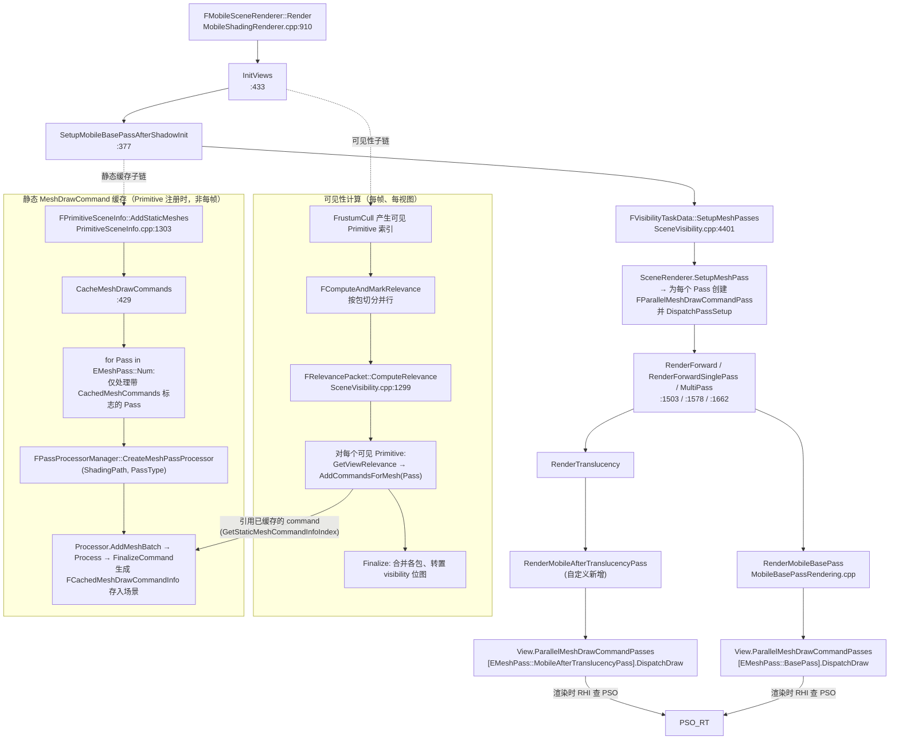
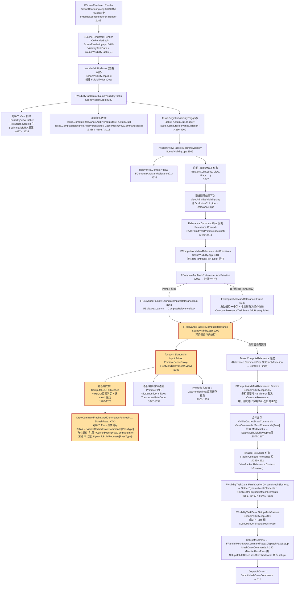
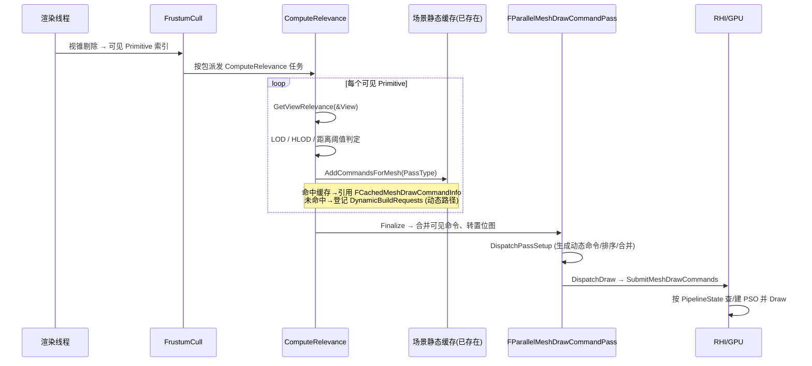
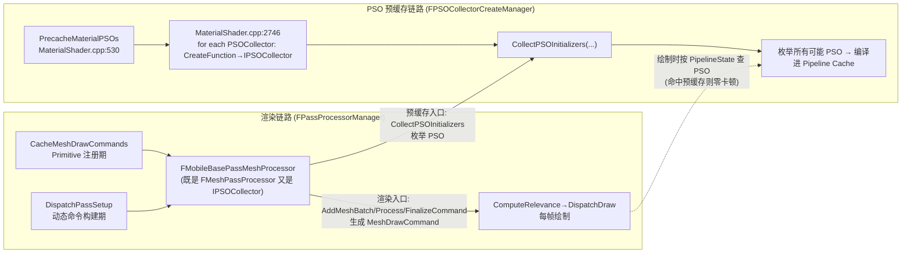
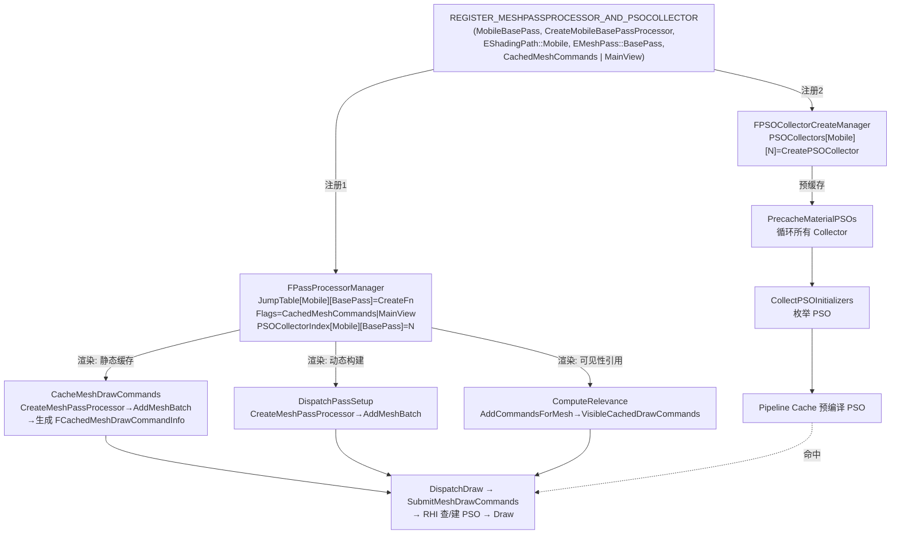
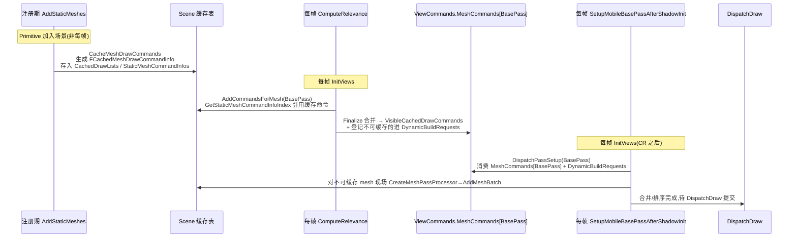

# ComputeRelevance 与 MobileRender 完整调用链 & PSO 相关性梳理

> 源码版本：UE 5.4
> 涉及文件：
> - `Engine/Source/Runtime/Renderer/Private/SceneVisibility.cpp`（ComputeRelevance / SetupMeshPass）
> - `Engine/Source/Runtime/Renderer/Private/MeshPassProcessor.cpp`（FPassProcessorManager / FMeshPassProcessor）
> - `Engine/Source/Runtime/Renderer/Public/MeshPassProcessor.h`（REGISTER_MESHPASSPROCESSOR_AND_PSOCOLLECTOR / EMeshPassFlags / IPSOCollector）
> - `Engine/Source/Runtime/Engine/Public/PSOPrecacheMaterial.h`（FPSOCollectorCreateManager）
> - `Engine/Source/Runtime/Engine/Private/Materials/MaterialShader.cpp`（PSO 预缓存运行时循环）
> - `Engine/Source/Runtime/Renderer/Private/PrimitiveSceneInfo.cpp`（CacheMeshDrawCommands）
> - `Engine/Source/Runtime/Renderer/Private/MeshDrawCommands.h`（FParallelMeshDrawCommandPass）
> - `Engine/Source/Runtime/Renderer/Private/MobileBasePass.cpp` / `MobileShadingRenderer.cpp`（移动端渲染）

---

## 一、核心结论先行

`REGISTER_MESHPASSPROCESSOR_AND_PSOCOLLECTOR` 这个宏注册的是**同一份 MeshPassProcessor 类**，但它把该类挂到了**两套互相独立、但共享同一处理逻辑**的运行时子系统上：

| 子系统 | 注册表 | 运行时机 | 干的事 |
|---|---|---|---|
| **渲染链路**（FPassProcessorManager） | `JumpTable[ShadingPath][PassType]` + `Flags[...]` | 场景注册 + 每帧可见性 + 绘制 | 生成 / 引用 / 提交真正的 MeshDrawCommand |
| **PSO 预缓存**（FPSOCollectorCreateManager） | `PSOCollectors[ShadingPath][Index]` | 材质编译 / 注册期、与渲染异步 | 提前把所有可能用到的 PSO 编译进 Pipeline Cache |

所以回答你的疑问：**这些处理不“只跟 PSO 相关”，它关系的是整个渲染链路**。“PSOCOLLECTOR”后缀只是说**额外**把这个处理器登记为 PSO 采集器，让它的 `CollectPSOInitializers` 在预缓存阶段被调用。真正的渲染（命令生成 + 绘制）走的是 `FPassProcessorManager` 这条线，跟 PSO 预缓存是两条并行链路，但**共用同一个 processor 类与同一个 `AddMeshBatch/Process/FinalizeCommand` 逻辑**。

> 一句话：宏名字里的 `PSO` 描述的是“顺带把 PSO 也预缓存了”，而 `MESHPASSPROCESSOR` 才是渲染主链路。两个一起注册，是为了让“预编译出的 PSO”和“实际绘制时查到的 PSO”是同一套、可命中。

---

## 二、`REGISTER_MESHPASSPROCESSOR_AND_PSOCOLLECTOR` 到底注册了什么

宏展开（`MeshPassProcessor.h:2266-2272`）：

```cpp
#define REGISTER_MESHPASSPROCESSOR_AND_PSOCOLLECTOR(Name, CreateFn, ShadingPath, MeshPass, MeshPassFlags) \
    /* 1) 生成一个 PSOCollector 创建函数 */                                          \
    IPSOCollector* CreatePSOCollector##Name(ERHIFeatureLevel::Type FL) {            \
        return CreateFn(FL, nullptr, nullptr, nullptr);                             \
    }                                                                               \
    /* 2) 把它登记进 FPSOCollectorCreateManager（PSO 预缓存用） */                   \
    FRegisterPSOCollectorCreateFunction RegisterPSOCollector##Name(                 \
        &CreatePSOCollector##Name, ShadingPath, GetMeshPassName(MeshPass));         \
    /* 3) 把渲染用创建函数登记进 FPassProcessorManager，并带上 PSOCollectorIndex */  \
    FRegisterPassProcessorCreateFunction RegisterMeshPassProcesser##Name(           \
        &CreateFn, ShadingPath, MeshPass, MeshPassFlags,                            \
        RegisterPSOCollector##Name.GetIndex());
```

它一次性写入了三张表（`FRegisterPassProcessorCreateFunction` 构造，`MeshPassProcessor.h:2242-2250`）：

```cpp
JumpTable[ShadingPath][PassType]        = CreateFn;        // 渲染时按 (ShadingPath, EMeshPass) 查
Flags[ShadingPath][PassType]            = MeshPassFlags;   // CachedMeshCommands? MainView?
PSOCollectorIndex[ShadingPath][PassType]= CollectorIndex;  // 渲染表 ↔ PSO表 的桥
```

外加 `FPSOCollectorCreateManager` 侧：

```cpp
PSOCollectors[ShadingPath][Index].CreateFunction = CreatePSOCollector##Name;
PSOCollectors[ShadingPath][Index].Name           = GetMeshPassName(MeshPass);
```

`PSOCollectorIndex` 就是这两套系统之间的**桥接键**：渲染侧的 `(ShadingPath, PassType)` 能映射到 PSO 侧的 `Index`，反之亦然。

### `EMeshPassFlags` 决定渲染侧怎么用

```cpp
enum class EMeshPassFlags { None=0, CachedMeshCommands=1<<0, MainView=1<<1 };
```

- `CachedMeshCommands`：该 Pass 的 MeshDrawCommand 可被**预缓存**到场景静态结构里（`CacheMeshDrawCommands` 会遍历带此标志的 Pass）。
- `MainView`：该 Pass 属于主视图渲染（影响可见性统计/某些裁剪判定）。

`MobileBasePass` 注册时是 `CachedMeshCommands | MainView`，所以它既能进静态缓存表，又能在 `ComputeRelevance` 里被引用、在主渲染管线里被 `DispatchDraw`。

---

## 三、渲染链路完整调用链（MobileRender）

下面是从“帧渲染入口”到“像素上屏”的完整链路，重点标出 `ComputeRelevance` 所在位置与 PSO 的交汇点。



### 关键节点的代码定位

| 节点 | 位置 |
|---|---|
| 帧入口 | `FMobileSceneRenderer::Render` `MobileShadingRenderer.cpp:910` |
| InitViews | `:433` → 内部触发 FrustumCull + Relevance 任务 |
| 静态缓存 | `FPrimitiveSceneInfo::CacheMeshDrawCommands` `PrimitiveSceneInfo.cpp:429`，循环 `:476` |
| 处理器分发 | `FPassProcessorManager::CreateMeshPassProcessor` `MeshPassProcessor.h:2194` |
| ComputeRelevance | `FRelevancePacket::ComputeRelevance` `SceneVisibility.cpp:1299` |
| 引用缓存命令 | `FDrawCommandRelevancePacket::AddCommandsForMesh` `SceneVisibility.cpp:1074` |
| 每 Pass 提交 | `FParallelMeshDrawCommandPass::DispatchPassSetup` / `DispatchDraw` `MeshDrawCommands.h:130/165` |
| MobileBasePass 绘制 | `RenderMobileBasePass` `MobileBasePassRendering.cpp` |
| Translucency 绘制 | `RenderTranslucency` |

---

## 三.5、`ComputeRelevance` 自顶向下完整调用链

下面是从**帧渲染入口**到 **`ComputeRelevance` 包级执行**的每一步调用（含代码定位），按自顶向下列出。注意 ComputeRelevance 本身是异步任务，触发点（`LaunchVisibilityTasks` / `Tasks.ComputeRelevance.Trigger()`）与执行点（`FRelevancePacket::ComputeRelevance`）之间隔着任务图。

### 调用链 Mermaid



### 每一步详解（按序号对应上图）

| 步 | 函数 / 位置 | 说明 |
|---|---|---|
| F1 | `FSceneRenderer::Render` / `FMobileSceneRenderer::Render` `MobileShadingRenderer.cpp:910` | 帧渲染入口 |
| F2 | `SceneRendering.cpp:3649` | `VisibilityTaskData = LaunchVisibilityTasks(...)`，可见性任务图从这里启动 |
| L1 | `LaunchVisibilityTasks` 自由函数 `SceneVisibility.cpp:383` | 创建 `FVisibilityTaskData` 并转交 |
| L2 | `FVisibilityTaskData::LaunchVisibilityTasks` `:4089` | 构建每视图 packet + 连接任务依赖 |
| L3 | `FVisibilityViewPacket` 构造 `:4097`；`Relevance.Context` 在 `:3533` 建（`new FComputeAndMarkRelevance`） | 每视图可见性状态容器 |
| L4 | `:3388` / `:4103` / `:4113` | `ComputeRelevance` 依赖 `FrustumCull` 与 `CacheMeshDrawCommandsTask` |
| L5 | `:4256-4260` | `Trigger()` 各任务事件 |
| B1 | `FVisibilityViewPacket::BeginInitVisibility` `:3506` | 分配 visibility map、建相关性上下文、启动视锥剔除 |
| B2 | `:3533` | `Relevance.Context = new FComputeAndMarkRelevance(TaskData, Scene, View, ViewIndex)` |
| B3 | `FrustumCull(...)` `:3647` | 视锥剔除，写 `View.PrimitiveVisibilityMap` |
| B4 | `:3470-3472` | 剔除后经 `OcclusionCull` pipe → `Relevance` pipe 回调 `AddPrimitives` |
| R1 | `Relevance.CommandPipe` 回调 `:3470` | 把可见 Primitive 索引喂给相关性上下文 |
| C1 | `FComputeAndMarkRelevance::AddPrimitives` `:1981` | 按包切分 |
| C2 | `FComputeAndMarkRelevance::AddPrimitive` `:2021` | 装满一个 `FRelevancePacket` |
| C3 | `FRelevancePacket::LaunchComputeRelevanceTask` `:1161` | Parallel 调度：`UE::Tasks::Launch` 派发，体内调 `ComputeRelevance` |
| C3b | `FComputeAndMarkRelevance::Finish` `:2035` | 启动最后一个包 + 汇集所有包任务到 `ComputeRelevanceTaskEvent` |
| P1 | **`FRelevancePacket::ComputeRelevance` `:1299`** | **核心：遍历 `Input.Prims` 计算每 Primitive 每视图相关性** |
| P2 | `GetViewRelevance(&View)` `:1383` | 取该 Primitive 在本视图下的相关性标志 |
| P3 | `:1402-1751` | 静态相关性：LOD/HLOD/距离判定，逐 mesh 决定进哪些 Pass |
| P4 | `AddCommandsForMesh(..., EMeshPass::XXX)` `:1074` | 引用缓存命令进 `VisibleCachedDrawCommands[Pass]`，或登记 `DynamicBuildRequests[Pass]` |
| P5 | `:1842-1899` | 动态/编辑器/半透明 Primitive 登记与计数 |
| P6 | `:1901-1953` | 视图级标志累加 + `LastRenderTime` / 反射捕获更新 |
| FIN1 | `Relevance.CommandPipe.SetEmptyFunction` `:3489` | 所有包任务完成 → `Context->Finish` |
| FIN2 | `FComputeAndMarkRelevance::Finalize` `:2055` | 串行调度在此 `ParallelFor` 跑各包；并行调度此步已由任务完成 |
| FIN3 | `:2077-2217` | 合并可见命令到 `ViewCommands.MeshCommands[Pass]`，转置 `MarkMasks` 成 `StaticMeshVisibilityMap` |
| FIN4 | `FinalizeRelevance` 任务 `:4243` | 依赖 `Tasks.ComputeRelevance`，调 `Context->Finalize()` |
| G1 | `FinishGatherDynamicMeshElements` `:4581` 等 | 收集动态 mesh elements（`InitViews` 末段 `:5469/:5546/:5636`） |
| S1 | `FVisibilityTaskData::SetupMeshPasses` `:4401` | 为每个 Pass 调 `SetupMeshPass` |
| S2 | `DispatchPassSetup` `MeshDrawCommands.h:130` | 消费 `MeshCommands[Pass]` + 动态构建，排序合并 |
| S3 | `DispatchDraw → SubmitMeshDrawCommands → RHI` | 真正提交绘制 |

### 两条调度路径（Parallel vs 串行）

`ComputeRelevance` 的执行入口因 `TaskConfig.Schedule` 不同而分叉：

- **`EVisibilityTaskSchedule::Parallel`**：`AddPrimitive` 装满一个包就 `LaunchComputeRelevanceTask` 立即派发（`:2029`），任务体内调 `ComputeRelevance`；`Finalize()` 此时跳过执行（`:2060` 判断）。
- **串行（如 Mobile 某些路径）**：`AddPrimitive` 只装包不派发；在 `Finish()` 汇集后，`Finalize()` 用 `ParallelFor(Packets.Num(), …)` 统一执行 `ComputeRelevance`（`:2062-2069`）。

两条路径最终都进入同一个 `FRelevancePacket::ComputeRelevance`，区别仅在于“何时跑”。

---

## 四、`ComputeRelevance` 在链路中的精确角色



**要点**：

1. `ComputeRelevance` **不生成** MeshDrawCommand 的具体内容，它只做“引用”：把已缓存命令的索引搬进 `VisibleCachedDrawCommands[PassType]`（`SceneVisibility.cpp:1098-1122`）。
2. 它对 Pass 是**显式逐个枚举**的（`AddCommandsForMesh(..., EMeshPass::BasePass)` 等手写调用），不存在自动遍历——这就是为什么自定义 `MobileAfterTranslucencyPass` 必须在这里显式加一行调用，否则 `DispatchDraw` 空跑。
3. 对动态（不可缓存）物体，它登记 `DynamicBuildRequests[PassType]`，后续在 `DispatchPassSetup` 里**临时创建 processor** 调 `AddMeshBatch`/`Process` 现场构建命令。
4. 因此同一个 processor 类被**两条路径**实例化：静态缓存期（`CacheMeshDrawCommands`，无 View）与动态构建期（`DispatchPassSetup`，带 View）。

---

## 五、PSO 相关性：两条链路如何共用一个 Processor

`FMeshPassProcessor` 同时继承自 `IPSOCollector`（`MeshPassProcessor.h:2042`、`PSOPrecacheMaterial.h:22`）。构造时就把 `PSOCollectorIndex` 记下来（`MeshPassProcessor.cpp:1890-1891`）：

```cpp
FMeshPassProcessor::FMeshPassProcessor(EMeshPass::Type InMeshPassType, ...)
    : IPSOCollector(FPassProcessorManager::GetPSOCollectorIndex(
          GetFeatureLevelShadingPath(InFeatureLevel), InMeshPassType))
    , ...
```

于是同一个类暴露**两套入口**：



### 5.1 渲染链路怎么用到 PSO

渲染时并不调用 `CollectPSOInitializers`。它在 `SubmitMeshDrawCommands` 阶段拿 `MeshDrawCommand` 里的 `FGraphicsMinimalPipelineState` 去 RHI 层 `GetAndOrCreateGraphicsPipelineState` 查/建 PSO。`PSOCollectorIndex` 在这条链路里主要用于：
- **Debug/统计**：`MeshDrawCommand.DebugData.PSOCollectorIndex`（`MeshPassProcessor.cpp:1685`），`PSOCollectorStats::CheckFullPipelineStateInCache` 做 PSO 命中/缺失日志（`MeshPassProcessor.cpp:2387-2417`）。
- **验证**：`PSOPrecacheValidation.cpp:198` 校验某个 collector 是否登记。

### 5.2 PSO 预缓存链路（与渲染解耦）

```cpp
// MaterialShader.cpp:2746
for (int32 Index = 0; Index < FPSOCollectorCreateManager::GetPSOCollectorCount(ShadingPath); ++Index)
{
    auto CreateFn = FPSOCollectorCreateManager::GetCreateFunction(ShadingPath, Index);
    if (CreateFn) {
        IPSOCollector* Collector = CreateFn(FeatureLevel);   // ← 就是你的 CreateMobileBasePassProcessor
        Collector->CollectPSOInitializers(SceneTexturesConfig, Material, VFData, Params, OutPSOs);
        delete Collector;
    }
}
```

- 触发时机：材质编译完成 / Primitive 注册 / 显式 `PrecacheMaterialPSOs`，**与是否真的绘制无关**。
- 它遍历**所有已登记的 PSOCollector**（不管该材质当前是否被任何物体使用），把每个 Pass 下该材质可能产生的 PSO 都枚举出来提前编译。
- 这就是 `MobileBasePass.cpp:1056 CollectPSOInitializers` 的用途——它和 `AddMeshBatch`/`Process` 用的是同一套 shader 选择逻辑（`CollectPSOInitializersForLMPolicy`），保证“预编译的 PSO”与“绘制时实际需要的 PSO”一一对应、能命中。

### 5.3 为什么必须 `AND_PSOCOLLECTOR`

如果只注册 processor（`FRegisterPassProcessorCreateFunction`）而不注册 PSOCollector：
- ✅ 渲染照常工作（JumpTable 在，`CacheMeshDrawCommands` + `ComputeRelevance` + `DispatchDraw` 都能跑）。
- ❌ 该 Pass 的 PSO **不会被预缓存**：`MaterialShader.cpp:2746` 的循环不会枚举到它，第一次绘制时 RHI 现场同步编译 PSO → **卡顿**。
- ❌ PSO 预缓存验证 / 缺失统计不会覆盖这个 Pass（调试盲区）。

反过来，把 processor 也注册成 PSOCollector，就是为了让“绘制时查到的 PSO”在材质阶段就已被编译好——这是 `AND_PSOCOLLECTOR` 的全部意义。

---

## 六、用一张图收束：Processor 类与两条链路的对应



---

## 七、`SetupMobileBasePassAfterShadowInit` 与 `FPrimitiveSceneInfo::AddStaticMeshes` 的关系

### 7.1 核心结论

**`SetupMobileBasePassAfterShadowInit` 根本不调用 `FPrimitiveSceneInfo::AddStaticMeshes`。** 它们处于完全不同的生命周期阶段，之间是**间接的数据依赖关系**，没有任何直接调用链。两者唯一的共享实体是 `FPassProcessorManager` 注册表（同一个 processor 创建函数）和 Scene 的缓存命令表——而不是调用关系。

### 7.2 各自的生命周期

#### `AddStaticMeshes` —— 注册期（非每帧）

在 Primitive 加入场景 / Transform 更新 / `UpdateStaticDrawLists` 时触发：

```
FScene::AddPrimitive (RendererScene.cpp:1832)
  → AddToScene → AddStaticMeshesTask (RendererScene.cpp:6479-6487)
     FPrimitiveSceneInfo::AddStaticMeshes(..., bCacheMeshDrawCommands=true)   ← :6487

FScene::UpdateStaticDrawLists_RT (RendererScene.cpp:4530)
  → FPrimitiveSceneInfo::AddStaticMeshes(RHICmdList, this, Primitives)        ← :4542
```

`AddStaticMeshes` 内部（`PrimitiveSceneInfo.cpp:1303`）：
1. `Proxy->DrawStaticElements` 收集静态 mesh batch → `StaticMeshes` / `StaticMeshRelevances`。
2. 把 mesh 登记进 `Scene->StaticMeshes`。
3. `bCacheMeshDrawCommands` 为 true 时调用 `CacheMeshDrawCommands`（`:1355`）→ 遍历所有带 `CachedMeshCommands` 标志的 Pass，用 `CreateMeshPassProcessor` 建处理器，生成 `FCachedMeshDrawCommandInfo` 存进 `Scene->CachedDrawLists` / `SceneInfo->StaticMeshCommandInfos`。

**产物**：场景里**预先缓存好**的 MeshDrawCommand（每个 Pass 一份），常驻到 Primitive 被移除。

#### `SetupMobileBasePassAfterShadowInit` —— 每帧（InitViews 内）

`MobileShadingRenderer.cpp:377`，每帧每视图调用 `Pass.DispatchPassSetup(...)`（`:410`），输入是：

- `View.DynamicMeshElements` + `View.NumVisibleDynamicMeshElements[BasePass]` —— 动态 mesh
- `ViewCommands.DynamicMeshCommandBuildRequests[BasePass]` —— ComputeRelevance 登记的不可缓存 mesh
- `ViewCommands.MeshCommands[BasePass]` —— **ComputeRelevance 已经引用好的可见缓存命令**

`DispatchPassSetup` 的工作：对动态/不可缓存 mesh 现场创建 processor 调 `AddMeshBatch`/`Process` 构建，然后把缓存可见命令 + 动态构建命令**合并/排序**，供后续 `DispatchDraw` 提交。

### 7.3 通过 ComputeRelevance 的数据桥衔接

两段时序通过**共享数据**衔接，不是调用：



### 7.4 时序对照表

| | 时机 | 主体 | 产物/消费 |
|---|---|---|---|
| `AddStaticMeshes` | **注册期**（Primitive 进场景） | `FPrimitiveSceneInfo` | 生产 `FCachedMeshDrawCommandInfo` 存入 Scene |
| `ComputeRelevance` | **每帧** | `FRelevancePacket` | 引用上述缓存命令 → `ViewCommands.MeshCommands[Pass]` |
| `SetupMobileBasePassAfterShadowInit` | **每帧**（ComputeRelevance 之后） | `FMobileSceneRenderer` | 消费 `MeshCommands[BasePass]` + 动态构建 → `DispatchPassSetup` |

### 7.5 一句话总结

`SetupMobileBasePassAfterShadowInit` 每帧**间接消费** `AddStaticMeshes` 在注册期**预先产出**的缓存命令，中间的桥梁是 `ComputeRelevance`（引用）和 `ViewCommands.MeshCommands[Pass]`（容器）。注册期 `CacheMeshDrawCommands` 把命令生产出来，每帧 `ComputeRelevance` 引用进可见列表，`SetupMobileBasePassAfterShadowInit`/`DispatchPassSetup` 再消费这个可见列表并补齐动态命令。

> 对自定义 Pass 的启示：`SetupMobileBasePassAfterShadowInit` 只为 `EMeshPass::BasePass` 调用了 `DispatchPassSetup`（`:403`/`:410`），**你的 `MobileAfterTranslucencyPass` 不会在这里被 setup**。它依赖通用路径 `FVisibilityTaskData::SetupMeshPasses`（`SceneVisibility.cpp:4401`）遍历各 Pass 各自调用 `DispatchPassSetup`。需确认 `MobileAfterTranslucencyPass` 走的是通用 SetupMeshPass 路径（带 `MainView` 标志即可），而非指望 MobileBasePass 的特殊 setup。

---

## 八、回到你的 `MobileAfterTranslucencyPass` 计划

基于以上链路，对你的自定义 Pass 做对照检查：

| 链路环节 | 你的 Plan 是否覆盖 | 说明 |
|---|---|---|
| **① 注册 processor**（渲染侧 JumpTable） | ✅ Plan 第 4 步 `REGISTER_MESHPASSPROCESSOR_AND_PSOCOLLECTOR(MobileAfterTranslucencyPass, ...)` | 一次宏调用同时登记渲染侧 + PSO 侧，正确 |
| **② 注册 PSOCollector**（预缓存侧） | ✅ 同上宏自动完成 | 该 Pass 的 PSO 会被 `MaterialShader.cpp:2746` 循环枚举预编译 |
| **③ 静态缓存生成**（`CacheMeshDrawCommands` 自动遍历带 `CachedMeshCommands` 的 Pass） | ✅ 只要枚举位置正确（必须在 `EMeshPass::Num` **之前**）+ Flags 带 `CachedMeshCommands` | Plan 当前把枚举放在 `Num` 之后 → ❌ 不会被缓存循环命中，**致命** |
| **④ ComputeRelevance 引用**（每帧把可见命令搬进 VisibleCachedDrawCommands） | ❌ **完全遗漏** | 必须在 `ComputeRelevance` Mobile 分支显式 `AddCommandsForMesh(..., EMeshPass::MobileAfterTranslucencyPass)`，否则 `DispatchDraw` 空跑，**致命** |
| **⑤ 动态路径**（不可缓存物体） | ⚠️ 同 ④ | `AddCommandsForMesh` 动态分支会登记 `DynamicBuildRequests[MobileAfterTranslucencyPass]`，但前提仍是 ④ 调用它 |
| **⑥ DispatchDraw** | ✅ Plan 第 5 步 `RenderMobileAfterTranslucencyPass` 里 `DispatchDraw` | 正确，但依赖 ③④ 才有命令可画 |
| **⑦ PSO 命中** | ⚠️ 依赖 ③ | 若 ③ 失败，PSO 仍会被预缓存（②），但绘制时无命令；若 ③ 成功，绘制查 PSO 能命中预缓存，零卡顿 |

**结论**：`REGISTER_MESHPASSPROCESSOR_AND_PSOCOLLECTOR` 解决的是 ①②（渲染注册 + PSO 预缓存登记），它**保证不了** ③④（每帧可见性引用）。PSO 预缓存与渲染是两条独立链路——PSO 准备好了不代表渲染会去画；渲染要画，还必须经过 `CacheMeshDrawCommands`（③，自动）和 `ComputeRelevance`（④，**手写**）这两道关。这就是为什么你必须在 `ComputeRelevance` 里补一行 `AddCommandsForMesh`。

---

## 九、术语速查

| 术语 | 含义 |
|---|---|
| `EMeshPass` | 枚举所有渲染 Pass 类型，是渲染侧的索引键 |
| `EMeshPassFlags` | 每个 Pass 的属性位：`CachedMeshCommands`（可静态缓存）、`MainView`（主视图） |
| `FPassProcessorManager` | 渲染侧注册表，按 `(ShadingPath, EMeshPass)` 存 processor 创建函数 / Flags / PSOCollectorIndex |
| `FPSOCollectorCreateManager` | PSO 预缓存侧注册表，按 `(ShadingPath, Index)` 存 IPSOCollector 创建函数 |
| `IPSOCollector` | 接口，唯一方法 `CollectPSOInitializers` —— 枚举某材质在某 Pass 下所有可能 PSO |
| `FMeshPassProcessor` | 渲染侧处理器基类，**继承 IPSOCollector**；提供 `AddMeshBatch/Process/FinalizeCommand` 生成 MeshDrawCommand |
| `PSOCollectorIndex` | 连接两套系统的桥接键：渲染侧 `(ShadingPath, PassType)` ↔ PSO 侧 `Index` |
| `FCachedMeshDrawCommandInfo` | 静态缓存条目，存命令在场景缓存表里的位置；`ComputeRelevance` 通过它引用命令 |
| `FParallelMeshDrawCommandPass` | 每 Pass 一个，负责 `DispatchPassSetup`（生成/排序/合并）+ `DispatchDraw`（提交 RHI） |
