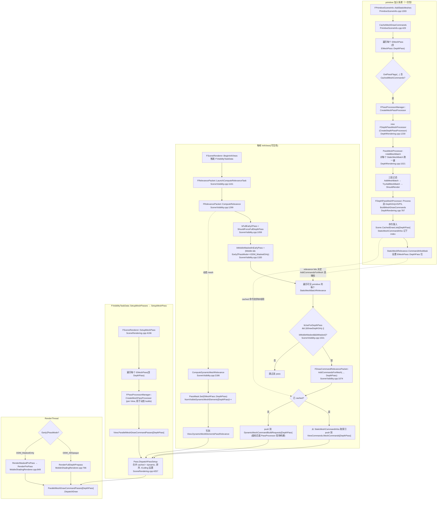

# Mobile AfterTranslucencyPass 深度读写分析

> 分析对象：`FMobileSceneRenderer::RenderForwardSinglePass` 中新增的 `RenderMobileAfterTranslucencyPass`，以及对应的 `CreateMobileAfterTranslucencyPassProcessor` / `FMobileBasePassMeshProcessor` 创建逻辑。
> 涉及文件：`Source/Runtime/Renderer/Private/MobileShadingRenderer.cpp`、`MobileBasePass.cpp`、`MobileBasePassRendering.h`、`Source/Runtime/Renderer/Private/RendererScene.cpp`、`Source/Runtime/VulkanRHI/Private/VulkanRenderpass.h`、`Source/Runtime/RHI/Public/RHIResources.h`。

---

## 1. “scene depth is read only” 到底是什么原因？

**结论：与 `RHICmdList.SetCurrentStat(GET_STATID(STAT_CLMM_Translucency));` 完全无关。**

`SetCurrentStat` 只是把当前 CPU 计时统计计数器切换到 `STAT_CLMM_Translucency` 这个分组，纯粹是性能统计用途，对深度缓冲的读/写权限没有任何影响。

真正让 depth 变成 read-only 的是**子通道（subpass）结构**。`RenderForwardSinglePass` 的整体结构是：

```cpp
// 子通道 0：BasePass —— 写 Color + 写 Depth
RenderMaskedPrePass(...);
RenderMobileBasePass(...);
PostRenderBasePass(...);

// scene depth is read only and can be fetched   <-- 注释说明的是下面这次 NextSubpass 之后的状态
RHICmdList.NextSubpass();                          // 切到子通道 1（depth read subpass）

// 子通道 1：Translucency —— Color 可读写（blend 半透明），Depth 只读
RenderDecals(...);
RenderModulatedShadowProjections(...);
RenderFog(...);
RenderTranslucency(...);
RenderMobileAfterTranslucencyPass(...);   // <-- 你新增的 pass，也跑在子通道 1 里
```

注释 `// scene depth is read only and can be fetched` 的位置紧挨在 `NextSubpass()` 之前，描述的是**进入下一个子通道后**深度的状态。这个状态由渲染目标的 `SubpassHint` 决定：

```cpp
// MobileShadingRenderer.cpp:1586
PassParameters->RenderTargets.SubpassHint =
    bTonemapSubpassInline ? ESubpassHint::CustomResolveSubpass
                          : ESubpassHint::DepthReadSubpass;
```

`ESubpassHint::DepthReadSubpass` 告诉 RHI：第二个子通道里 depth 是只读的。在 Vulkan RHI 中，这个 hint 会被翻译成 subpass 1 的深度附件布局为 **`VK_IMAGE_LAYOUT_DEPTH_READ_ONLY_STENCIL_ATTACHMENT_OPTIMAL`**（见 `VulkanRenderpass.h:467-486`）：

```cpp
if (bDepthReadSubpass || bDeferredShadingSubpass)
{
    // lights write to stencil for culling, so stencil is expected to be writeable while depth is read-only
    DepthStencilAttachment.layout = VK_IMAGE_LAYOUT_DEPTH_READ_ONLY_STENCIL_ATTACHMENT_OPTIMAL;
    DepthInputAttachment = DepthStencilAttachment.attachment;   // depth 同时作为 input attachment 可被采样
    ...
}
```

**关键含义：**
- **Depth：只读**（layout 是 READ_ONLY，硬件层面无法写入，写入会被 validation layer 报错或静默丢弃）。
- **Stencil：可写**（lights 会写 stencil 做剔除）。
- Depth 同时作为 input attachment 暴露，可以在像素着色器里被采样（“can be fetched”）。

所以 “depth read only” 的根因是 `ESubpassHint::DepthReadSubpass` + `NextSubpass()` 触发的子通道布局切换，**不是** `SetCurrentStat`。

---

## 2. 把 `RenderMobileAfterTranslucencyPass` 放在 `RenderTranslucency` 之后，会影响深度读写吗？

**会，而且是决定性的影响。**

你的 pass 调用位置仍在 `RHICmdList.NextSubpass()` 之后、整个渲染通道结束之前，即**子通道 1（depth read subpass）内部**。因此：

| 操作 | 是否可用 | 原因 |
|------|----------|------|
| 读取 depth（采样/比较） | ✅ 可用 | depth 在子通道 1 中是只读 input attachment，可被 fetch |
| 写入 depth | ❌ 不可用 | subpass 1 的 depth 布局为 `DEPTH_READ_ONLY`，硬件/RHI 层面禁止写入 |
| 写入 color | ✅ 可用 | color 附件在子通道 1 中仍是可读写的 |
| 写入 stencil | ✅ 可用 | stencil 在子通道 1 中可写 |

**所以你的 `RenderMobileAfterTranslucencyPass` 只能读深度，不能写深度。** 即使你在 PassProcessor 里把 depth-stencil state 设成“写深度”，在子通道 1 中也不会生效（见第 3 节）。

> 注意：在非 subpass 的 RHI（如 D3D11 / OpenGL ES，子通道是被模拟的）上，depth 在技术上可能仍可写，但**设计意图和 Vulkan/移动端真实路径下 depth 是只读的**。如果你的目标平台包含 Vulkan/Android，必须按只读处理。

如果你确实需要在该 pass **写深度**，就不能放在子通道 1 里，而要：
- 另起一个独立 render pass（参考 `RenderForwardMultiPass` 的拆分思路，或 `MobileSeparateTranslucencyPass` 用独立 pass 的做法），让该 pass 的 depth 附件可写；或者
- 把该 pass 移到 `NextSubpass()` 之前（即子通道 0，BasePass 内），那时 depth 可写——但这会改变与半透明的遮挡关系，通常不是你想要的“after translucency”语义。

---

## 3. PassProcessor 创建逻辑对读写的影响

```cpp
FMeshPassProcessor* CreateMobileAfterTranslucencyPassProcessor(...)
{
    FMeshPassProcessorRenderState PassDrawRenderState;
    PassDrawRenderState.SetBlendState(TStaticBlendStateWriteMask<CW_RGBA>::GetRHI());

    const FExclusiveDepthStencil::Type DefaultBasePassDepthStencilAccess =
        FScene::GetDefaultBasePassDepthStencilAccess(FeatureLevel);
    PassDrawRenderState.SetDepthStencilAccess(DefaultBasePassDepthStencilAccess);
    PassDrawRenderState.SetDepthStencilState(TStaticDepthStencilState<true, CF_DepthNearOrEqual>::GetRHI());

    const FMobileBasePassMeshProcessor::EFlags Flags =
        FMobileBasePassMeshProcessor::EFlags::CanUseDepthStencil | (... CSM ...);

    return new FMobileBasePassMeshProcessor(
        EMeshPass::MobileAfterTranslucencyPass, Scene, InViewIfDynamicMeshCommand,
        PassDrawRenderState, InDrawListContext, Flags, true);   // <-- 最后一个参数有问题，见 3.4
}
```

### 3.1 BlendState：`TStaticBlendStateWriteMask<CW_RGBA>`
- 写入 R/G/B/A 全部通道，**不开启混合（replace）**。
- 含义：该 pass 画到的像素会**直接覆盖** color buffer 上半透明/fog 已写入的颜色（不会与半透明结果做 alpha 混合），除非材质本身在 shader 里输出 alpha=0 等手段。

### 3.2 DepthStencilAccess：`DefaultBasePassDepthStencilAccess`
查 `RendererScene.cpp:4648`：

```cpp
FExclusiveDepthStencil::Type FScene::GetDefaultBasePassDepthStencilAccess(ERHIFeatureLevel::Type InFeatureLevel)
{
    FExclusiveDepthStencil::Type BasePassDepthStencilAccess = FExclusiveDepthStencil::DepthWrite_StencilWrite; // 默认可写
    if (GetFeatureLevelShadingPath(InFeatureLevel) == EShadingPath::Deferred) // 只有延迟路径才会改成只读
    {
        ... BasePassDepthStencilAccess = FExclusiveDepthStencil::DepthRead_StencilWrite;
    }
    return BasePassDepthStencilAccess;
}
```

移动端是 **Forward** 路径，所以返回的是 **`DepthWrite_StencilWrite`**——即 PassDrawRenderState 声明“我想写深度”。

**这与子通道 1 的只读深度产生冲突。** PSO 创建时 `GraphicsPipelineRenderTargetsInfo.DepthStencilAccess` 需要与 render pass 实际附件访问权限兼容；render pass 的 subpass 1 实际只允许 depth 读，PSO 却请求 depth 写。在 Vulkan 上，真正起决定作用的是 render pass 的 attachment layout（只读），所以**深度写依然不会发生**，而这个不匹配的 access 声明是冗余/矛盾的，建议改成与子通道一致的 `DepthRead_StencilWrite`。

### 3.3 DepthStencilState：`TStaticDepthStencilState<true, CF_DepthNearOrEqual>`
- `true` = `bDepthWriteEnable = true`（请求写深度）。
- `CF_DepthNearOrEqual` = 深度测试：片元深度 ≤ 已存深度（带容差）即通过。

在子通道 1 中，由于 depth 是只读 layout，`bDepthWriteEnable=true` **不生效**——即使测试通过也不会更新深度。深度测试本身仍会执行（用 base pass 写入的深度做比较），可以用来做遮挡剔除（只画通过 NearOrEqual 测试的像素）。

### 3.4 ⚠️ 关键问题：构造函数最后一个参数 `true`

`FMobileBasePassMeshProcessor` 的构造函数签名（`MobileBasePassRendering.h:480`）：

```cpp
FMobileBasePassMeshProcessor(
    EMeshPass::Type InMeshPassType,
    const FScene* InScene,
    const FSceneView* InViewIfDynamicMeshCommand,
    const FMeshPassProcessorRenderState& InDrawRenderState,
    FMeshPassDrawListContext* InDrawListContext,
    EFlags Flags,
    ETranslucencyPass::Type InTranslucencyPassType = ETranslucencyPass::TPT_MAX);  // 默认 TPT_MAX
```

`ETranslucencyPass::Type` 的取值（`TranslucentPassResource.h:12`）：

```cpp
TPT_TranslucencyStandard,         // 0
TPT_TranslucencyStandardModulate, // 1
TPT_TranslucencyAfterDOF,         // 2
TPT_TranslucencyAfterDOFModulate, // 3
TPT_TranslucencyAfterMotionBlur,  // 4
TPT_AllTranslucency,              // 5
TPT_MAX                           // 6
```

你传的 `true` 会被隐式转成 `int = 1`，即 **`TPT_TranslucencyStandardModulate`**，而不是默认的 `TPT_MAX`。

构造函数体内（`MobileBasePass.cpp:810`）：

```cpp
, bTranslucentBasePass(InTranslucencyPassType != ETranslucencyPass::TPT_MAX)   // = (1 != 6) = true
, bDeferredShading(...)
, bPassUsesDeferredShading(bDeferredShading && !bTranslucentBasePass)          // = false
```

于是 `bTranslucentBasePass = true`。再看 `ShouldDraw`（`MobileBasePass.cpp:828`）：

```cpp
bool FMobileBasePassMeshProcessor::ShouldDraw(const FMaterial& Material) const
{
    const bool bIsTranslucent = IsTranslucentBlendMode(...) || ...;
    if (bTranslucentBasePass)
    {
        // 只接受 translucent 材质，且根据 TranslucencyPassType 进一步过滤
        bool bShouldDraw = bIsTranslucent && !Material.IsDeferredDecal() &&
            (TranslucencyPassType == TPT_AllTranslucency
             || (TranslucencyPassType == TPT_TranslucencyStandard && !Material.IsMobileSeparateTranslucencyEnabled())
             || (TranslucencyPassType == TPT_TranslucencyAfterDOF && ...));
        check(!bShouldDraw || bCanReceiveCSM == false);
        return bShouldDraw;
    }
    else
    {
        return !bIsTranslucent;   // 只接受不透明材质
    }
}
```

**后果：**
- 因为 `bTranslucentBasePass=true` 且 `TranslucencyPassType=TPT_TranslucencyStandardModulate`，`ShouldDraw` 的三个分支都不命中 `TPT_TranslucencyStandardModulate`，所以**几乎所有材质都会被剔除——该 pass 实际上几乎不画任何东西**。
- 即便侥幸画出，画出的也只是 translucent 材质，与你“写深度/在半透明之后再叠加”的预期相反。

**修复建议：** 把 `true` 改成显式的 `ETranslucencyPass::TPT_MAX`（或直接省略，用默认参数）。这样 `bTranslucentBasePass=false`，`ShouldDraw` 走 `!bIsTranslucent` 分支，只收集不透明网格——这才符合“AfterTranslucency 里画不透明/写遮挡”的语义。

```cpp
return new FMobileBasePassMeshProcessor(
    EMeshPass::MobileAfterTranslucencyPass, Scene, InViewIfDynamicMeshCommand,
    PassDrawRenderState, InDrawListContext, Flags,
    ETranslucencyPass::TPT_MAX);   // 不要传 true
```

---

## 4. 执行先后顺序与“谁覆盖谁”

在 `RenderForwardSinglePass` 子通道 1 内，按调用顺序依次执行：

1. `RenderDecals`
2. `RenderModulatedShadowProjections`
3. `RenderFog`
4. `RenderTranslucency`
5. **`RenderMobileAfterTranslucencyPass`（你新增）**

### 4.1 Depth：无人覆盖 BasePass 深度
- 子通道 1 中 depth 是只读的，**Decals / Shadows / Fog / Translucency / 你的 AfterTranslucency 都无法写深度**。
- 你 PSO 里 `bDepthWriteEnable=true` 不生效，所以**不会覆盖** BasePass 写入的深度。BasePass 深度完整保留到通道结束。
- 深度测试 `CF_DepthNearOrEqual` 仍会用 BasePass 深度对你的片元做比较，决定像素是否被绘制（可用于遮挡剔除）。

### 4.2 Color：后执行者覆盖先执行者
- 子通道 1 中 color 可读写。各 pass 按顺序向同一 color buffer 写/混合。
- `RenderTranslucency` 通常用半透明混合（alpha blend）叠加在已渲染的不透明结果上。
- 你的 `RenderMobileAfterTranslucencyPass` 的 PassDrawRenderState 用的是 `TStaticBlendStateWriteMask<CW_RGBA>`（**replace，不开 blend**）。因此对于你画到的像素，会**直接覆盖**之前 Translucency/Fog 写入的颜色，半透明结果会被你盖掉。
- 如果你想在半透明之上“叠加”而不是“覆盖”，需要在材质/blend state 上改用合适的混合模式（如 alpha blend / additive）。

### 4.3 Stencil：可写，注意互相干扰
- 子通道 1 中 stencil 可写（lights 会写 stencil）。如果你的 pass 也写 stencil（当前 `TStaticDepthStencilState<true, CF_DepthNearOrEqual>` 默认 stencil 为只读/不写，暂无冲突），需确认不与光照剔除用的 stencil 位冲突。

### 4.4 覆盖关系总表

| 资源 | BasePass(子通道0) | Decals | Shadows | Fog | Translucency | AfterTranslucency(你的) | 最终归属 |
|------|-------------------|--------|---------|-----|--------------|--------------------------|----------|
| Depth | 写 ✅ | 只读 | 只读 | 只读 | 只读 | 只读（写不生效） | **BasePass 保留** |
| Color | 写 | 写/混合 | 写/混合 | 写/混合 | 混合叠加 | **replace 覆盖** | **AfterTranslucency 覆盖重叠像素** |
| Stencil | 视配置 | — | 写(光照剔除) | — | — | 当前不写 | 受 Shadows 等影响 |

---

## 5. 结论与建议

1. **“depth read only” 来自子通道结构**（`DepthReadSubpass` + `NextSubpass()`），与 `SetCurrentStat` 无关。
2. **你的 `RenderMobileAfterTranslucencyPass` 在子通道 1 内，只能读深度、不能写深度**。无论 PSO 怎么设 `bDepthWriteEnable`，写深度都不会生效。
3. **PassProcessor 存在两个矛盾点：**
   - `SetDepthStencilAccess(DepthWrite_StencilWrite)` 与只读子通道冲突 → 建议改为 `DepthRead_StencilWrite`。
   - 构造函数最后一个参数传了 `true`（=`TPT_TranslucencyStandardModulate`）→ 导致 `bTranslucentBasePass=true`，`ShouldDraw` 几乎剔除所有材质，且语义错误 → **必须改为 `ETranslucencyPass::TPT_MAX`**。
4. **覆盖关系：** Depth 不会被任何子通道 1 内的 pass 覆盖（BasePass 保留）；Color 按 Decals→Shadows→Fog→Translucency→AfterTranslucency 顺序，你的 pass 用 replace blend 会覆盖重叠像素的半透明结果。
5. **若必须写深度**，需把该 pass 移出子通道 1（独立 render pass，depth 可写），代价是失去与主通道的 subpass input attachment 共享。

---

# 补充：移动端 Forward 路径完整深度渲染链路

## 6. 深度到底在哪里被渲染？

移动端 Forward 路径下，深度有 **两种可能的写入位置**，由 `Scene->EarlyZPassMode` 决定（在 `FMobileSceneRenderer` 构造时计算 `bIsFullDepthPrepassEnabled`，见 `MobileShadingRenderer.cpp:302`）：

| `EarlyZPassMode` | `bIsFullDepthPrepassEnabled` | `bIsMaskedOnlyDepthPrepassEnabled` | 深度写入发生在哪里 |
|---|---|---|---|
| `DDM_None`（默认）| false | false | **只在 BasePass 中写**（BasePass 渲染时同时写 depth + color） |
| `DDM_MaskedOnly` | false | true | **MaskedPrePass 写 masked 物体深度** + **BasePass 写所有不透明物体深度** |
| `DDM_AllOpaque`（全 prepass）| **true** | false | **FullDepthPrepass 写所有不透明物体深度** + BasePass 中 depth 是 read-only |

`EarlyZPassMode` 的决策见 `RendererScene.cpp:4694` 的 `FScene::GetEarlyZPassMode`：

```cpp
else if (GetFeatureLevelShadingPath(InFeatureLevel) == EShadingPath::Mobile)
{
    OutZPassMode = DDM_None;
    const bool bMaskedOnlyPrePass = FReadOnlyCVARCache::MobileEarlyZPass(ShaderPlatform) == 2;
    if (bMaskedOnlyPrePass) { OutZPassMode = DDM_MaskedOnly; }
    if (MobileUsesFullDepthPrepass(ShaderPlatform)) { OutZPassMode = DDM_AllOpaque; }   // 全 prepass
}
```

而 `MobileUsesFullDepthPrepass`（`RenderUtils.cpp:616`）触发条件：

```cpp
return MobileUsesShadowMaskTexture(Platform)
    || IsMobileAmbientOcclusionEnabled(Platform)
    || IsUsingDBuffers(Platform)
    || FReadOnlyCVARCache::MobileEarlyZPass(Platform) == 1;
```

只要项目启用了 **MobileShadowMaskTexture / Mobile AO / DBuffer Decals / r.Mobile.EarlyZPass=1** 中任一项，就会进入 `DDM_AllOpaque` 全深度 prepass 路径。

---

## 7. 为什么 BasePass 还需要写入深度？

取决于路径：

- **`DDM_None` / `DDM_MaskedOnly`**：BasePass 前面没有 full prepass，**只有 masked 物体可能预先写过深度**（DDM_MaskedOnly 时）。绝大多数不透明物体的深度**必须在 BasePass 中写出**，否则后面 Translucency / Decal / Fog / SSR / 软粒子等任何依赖深度的 pass 都会得到错误结果。
- **`DDM_AllOpaque`**：所有不透明物体的深度已经在 FullDepthPrepass 中完整写好。此时 BasePass 的 DepthStencilAccess 会被**改成 `DepthRead_StencilWrite`**（`MobileShadingRenderer.cpp:1494-1496`、`1540`）：

```cpp
BasePassRenderTargets.DepthStencil = bIsFullDepthPrepassEnabled
    ? FDepthStencilBinding(SceneDepth, ELoad, ELoad, FExclusiveDepthStencil::DepthRead_StencilWrite)
    : FDepthStencilBinding(SceneDepth, EClear, EClear, FExclusiveDepthStencil::DepthWrite_StencilWrite);
```

也就是说：**只要开启了 full prepass，BasePass 实际上就不再写深度了，只读深度做 Equal/NearOrEqual 测试**。如果没开 full prepass，BasePass 才需要承担"既写深度又写颜色"的双重职责。

`PassProcessor` 创建时调用的 `FScene::GetDefaultBasePassDepthStencilAccess`（`RendererScene.cpp:4648`）返回的是 PSO 期望的访问权限（mobile 是 `DepthWrite_StencilWrite`，与 PSO 兼容性相关），并不会强制 render pass 真的写深度——真正决定权在 render pass binding 上。

---

## 8. 移动端 Forward 路径深度渲染调用链路（完整、可自顶向下追溯）

> 入口：`FMobileSceneRenderer::Render` → 中段调用 `RenderForward` → 进入单/多 pass。
> 下面的链路覆盖深度产生、深度被读取、深度对你的 AfterTranslucency 的影响。所有节点都对应到文件:行号。

```mermaid
flowchart TD
    A["FMobileSceneRenderer::Render<br/>MobileShadingRenderer.cpp:~1100"] --> A1["计算 bIsFullDepthPrepassEnabled<br/>= Scene->EarlyZPassMode == DDM_AllOpaque<br/>MobileShadingRenderer.cpp:302"]
    A1 --> A2["计算 bIsMaskedOnlyDepthPrepassEnabled<br/>= EarlyZPassMode == DDM_MaskedOnly<br/>MobileShadingRenderer.cpp:303"]
    A2 --> A3{"EarlyZPassMode?<br/>FScene::GetEarlyZPassMode<br/>RendererScene.cpp:4694"}
    A3 -->|"DDM_AllOpaque<br/>(MobileUsesFullDepthPrepass=true)"| B1["RenderFullDepthPrepass<br/>MobileShadingRenderer.cpp:796"]
    A3 -->|"DDM_MaskedOnly 或 DDM_None"| Cgate["跳过 FullDepthPrepass"]

    %% ---- Full Depth Prepass 分支 ----
    B1 --> B1a["创建独立 RT 绑定<br/>DepthStencil = (Clear, Clear, DepthWrite_StencilWrite)<br/>MobileShadingRenderer.cpp:799"]
    B1a --> B1b["BuildRenderingCommands<br/>EMeshPass::DepthPass<br/>MobileShadingRenderer.cpp:824"]
    B1b --> B1c["GraphBuilder.AddPass<br/>名称: 'FullDepthPrepass'<br/>MobileShadingRenderer.cpp:830-844"]
    B1c --> B1d["FMobileSceneRenderer::RenderPrePass<br/>DepthRendering.cpp:666"]
    B1d --> B1e["ParallelMeshDrawCommandPasses[DepthPass]<br/>.DispatchDraw<br/>DepthRendering.cpp:678"]
    B1e --> B1f["FDepthPassMeshProcessor 渲染<br/>EarlyZPassMode 决定收哪些材质<br/>DepthRendering.cpp:920+"]
    B1f --> B1g["✅ 完整不透明深度已写入 SceneDepth"]
    B1g --> B1h["可选: AddResolveSceneDepthPass<br/>MobileShadingRenderer.cpp:1252"]
    B1h --> B1i["RenderMobileShadowProjections / HZB / AO<br/>MobileShadingRenderer.cpp:1259-1276<br/>这些都读 SceneDepth"]
    B1i --> D

    Cgate --> D

    %% ---- 进入 Forward ----
    D["RenderForward<br/>MobileShadingRenderer.cpp:1503"] --> D1["InitRenderTargetBindings_Forward<br/>MobileShadingRenderer.cpp:1438"]
    D1 --> D2{"bIsFullDepthPrepassEnabled?"}
    D2 -->|"true"| D2y["DepthStencil = (Load, Load,<br/>DepthRead_StencilWrite)<br/>MobileShadingRenderer.cpp:1494"]
    D2 -->|"false"| D2n["DepthStencil = (Clear, Clear,<br/>DepthWrite_StencilWrite)<br/>MobileShadingRenderer.cpp:1496"]
    D2y --> D3
    D2n --> D3
    D3["SubpassHint = None (此时)<br/>MobileShadingRenderer.cpp:1497"] --> D4{"bRequiresMultiPass?"}

    D4 -->|"false"| E1["RenderForwardSinglePass<br/>MobileShadingRenderer.cpp:1578"]
    D4 -->|"true"| F1["RenderForwardMultiPass<br/>MobileShadingRenderer.cpp:~1670"]

    %% ---- Single Pass 子通道 ----
    E1 --> E1a["SubpassHint = DepthReadSubpass<br/>(或 CustomResolveSubpass)<br/>MobileShadingRenderer.cpp:1586"]
    E1a --> E1b["GraphBuilder.AddPass<br/>'SceneColorRendering'<br/>MobileShadingRenderer.cpp:1590"]
    E1b --> E1c["[Subpass 0]<br/>BasePass 子通道<br/>Depth 可写 或 可读 (取决于 prepass)"]
    E1c --> E1d{"bIsMaskedOnlyDepthPrepassEnabled?"}
    E1d -->|"true"| E1e["RenderMaskedPrePass<br/>MobileShadingRenderer.cpp:849"]
    E1e --> E1e2["RenderPrePass (只画 Masked 物体)<br/>DepthRendering.cpp:666<br/>写 masked 物体深度"]
    E1e2 --> E1f
    E1d -->|"false"| E1f["跳过 MaskedPrePass"]
    E1f --> E1g["RenderMobileBasePass<br/>MobileBasePassRendering.cpp:470"]
    E1g --> E1g1["ParallelMeshDrawCommandPasses[BasePass]<br/>.DispatchDraw 收 PSO 写 color + (可写) depth<br/>MobileBasePassRendering.cpp:478"]
    E1g1 --> E1g2["SkyPass / EditorPrimitives<br/>MobileBasePassRendering.cpp:482-490"]
    E1g2 --> E1h["RenderMobileDebugView / PollOcclusionQueries / PostRenderBasePass<br/>MobileShadingRenderer.cpp:1610-1612"]

    E1h --> E1nxt["RHICmdList.NextSubpass()<br/>// scene depth is read only and can be fetched<br/>MobileShadingRenderer.cpp:1614"]
    E1nxt --> E1S1["[Subpass 1]<br/>Depth Read Subpass<br/>Depth layout = DEPTH_READ_ONLY_STENCIL_ATTACHMENT_OPTIMAL<br/>VulkanRenderpass.h:482"]
    E1S1 --> E1i["RenderDecals (读深度)<br/>MobileShadingRenderer.cpp:1616"]
    E1i --> E1j["RenderModulatedShadowProjections<br/>MobileShadingRenderer.cpp:1617"]
    E1j --> E1k["RenderFog (读深度)<br/>MobileShadingRenderer.cpp:1620"]
    E1k --> E1l["RenderTranslucency (读深度做软粒子/混合)<br/>MobileShadingRenderer.cpp:1623"]
    E1l --> E1m["✨ RenderMobileAfterTranslucencyPass<br/>(你新增, MobileShadingRenderer.cpp:1624)"]
    E1m --> E1m1["MeshPass:<br/>EMeshPass::MobileAfterTranslucencyPass<br/>DispatchDraw"]
    E1m1 --> E1n["RenderMobileDebugPrimitives (if LDR)<br/>EndRender / EndOcclusionQueries"]

    %% ---- Multi Pass ----
    F1 --> F1a["BasePass 独立 RenderPass:<br/>Clear/Load + DepthWrite/DepthRead<br/>MobileShadingRenderer.cpp:1875-1911"]
    F1a --> F1b["RenderMaskedPrePass + RenderMobileBasePass<br/>(同 single pass 流程)"]
    F1b --> F1c["RenderPostBasePass (resolve depth/color)"]
    F1c --> F1d["独立 Translucency RenderPass:<br/>load depth as READ, load color<br/>MobileSeparateTranslucencyPass.cpp:50"]
    F1d --> F1e["RenderTranslucency + (你的) AfterTranslucency<br/>同样 depth 只读"]
```



> 备注：上图把 "Decals / Shadows / Fog / Translucency / AfterTranslucency" 都画在 Subpass 1 中——这是 SinglePass + `ESubpassHint::DepthReadSubpass` 的真实形态，由 RHI 的 render pass description 强制保证 depth 在 Subpass 1 内是只读 layout。

---

## 9. 关键问题再回答

### Q1. 深度渲染是在什么地方？这里(AfterTranslucency)和深度渲染应该没有关系了吧？深度应该在这之前就已经渲染完成了吧？

**正确**——到 `RenderMobileAfterTranslucencyPass` 被调用时，全场景不透明深度**已全部完成**：
- 走 FullDepthPrepass 路径：深度在 `RenderFullDepthPrepass` 中已经全部写入。
- 不走 FullDepthPrepass 路径：深度在 `RenderMobileBasePass`（subpass 0）中已经全部写入。

两种情况下，到 subpass 1（也就是你的 pass 所在子通道）开始时，**`SceneDepth` 都已经是"最终的全场景不透明深度图"**。你的 pass 不再参与深度的"生产"，只负责"消费"。

### Q2. `RenderMobileBasePass` 这里为什么还需要写入深度？

**只在没开 FullDepthPrepass 的情况下才写深度**。具体地：
- `bIsFullDepthPrepassEnabled = false` → BasePass 的 RT 绑定是 `(Clear, Clear, DepthWrite_StencilWrite)`，BasePass **承担所有不透明深度的写入**（参考 `MobileShadingRenderer.cpp:1496`）。这是移动端最常见、最便宜的路径（TBDR 上 HSR 可以让"颜色+深度合一"的 BasePass 仍然高效）。
- `bIsFullDepthPrepassEnabled = true` → BasePass 的 RT 绑定改成 `(Load, Load, DepthRead_StencilWrite)`（`MobileShadingRenderer.cpp:1494`），**BasePass 不再写深度**，只做颜色 + 深度 equal test。

`PassProcessor` 里硬编码的 `DepthWrite_StencilWrite` 是 PSO 期望，最终是否真写深度由 render pass 的 DepthStencilBinding 决定。

### Q3. `RenderMobileAfterTranslucencyPass` 渲染的如果都是不透明物体，这些物体的深度应该会和 BasePass 中的一起渲染深度吧？

**不会，也不需要。** 关键原因有两个：

1. **物理上不能写。** 你的 pass 处于 subpass 1，`ESubpassHint::DepthReadSubpass` 已经把深度附件的 Vulkan layout 锁成 `VK_IMAGE_LAYOUT_DEPTH_READ_ONLY_STENCIL_ATTACHMENT_OPTIMAL`，render pass 描述里 subpass 1 的 DepthStencilAttachment 就是只读，硬件层面阻止写入。
2. **逻辑上不需要写。** 如果你 AfterTranslucency 画的物体的深度需要参与"全场景不透明深度"，那它们就应该在 `EMeshPass::BasePass` 或 `EMeshPass::DepthPass`（FullDepthPrepass）中就已经被收过 —— 而不应该专门跑一个 AfterTranslucency。

**所以归属问题：**
- 这些物体在 **`EMeshPass::BasePass`** 中已经写过一次深度（或在 prepass 中写过），它们的"权威深度"已经在 SceneDepth 里了。
- 你的 AfterTranslucency 阶段**只是再用相同几何"补绘"一次颜色**（带某种特殊处理：覆盖半透明、写额外 alpha、贴一个 overlay 之类）。深度本身不需要也无法重复写。

### Q4. 我在 AfterTranslucency 是可以读到这个 Pass 中物体的深度的吧？我也不需要在这里写入深度吧？

**是的，两件事都成立：**

- **可以读**：subpass 1 中 SceneDepth 既是 read-only depth attachment 也是 input attachment（`VulkanRenderpass.h:483-485` 把它绑成 input attachment）。你既可以用 hardware depth test（`CF_DepthNearOrEqual`），也可以在 PS 里通过 `SceneDepthTextureFetch` / input attachment 采样得到精确深度。同一物体在 BasePass 写下的深度可以在 AfterTranslucency 被读到，做 occlusion test 通过的像素才被绘制。
- **不需要写**：物体深度已在 BasePass 写过，PassProcessor 里 `bDepthWriteEnable=true` 是冗余的（硬件会忽略），保留写权限只会让 PSO 描述与 render pass 不匹配，存在 validation warning 风险。**正确做法是把 PassProcessor 的 DepthStencilState 改成 `TStaticDepthStencilState<false, CF_DepthNearOrEqual>`**（与 `CreateMobileTranslucencyStandardPassProcessor` 一致），并把 `SetDepthStencilAccess` 改成 `DepthRead_StencilRead`（或 `DepthRead_StencilWrite`，取决于你是否要写 stencil）。

### 建议改法（综合 §3 与本节）：

```cpp
FMeshPassProcessor* CreateMobileAfterTranslucencyPassProcessor(...)
{
    FMeshPassProcessorRenderState PassDrawRenderState;
    PassDrawRenderState.SetBlendState(TStaticBlendStateWriteMask<CW_RGBA>::GetRHI());

    // 与 subpass 1 的 depth-read-only 对齐
    PassDrawRenderState.SetDepthStencilAccess(FExclusiveDepthStencil::DepthRead_StencilRead);
    PassDrawRenderState.SetDepthStencilState(
        TStaticDepthStencilState<false /*bDepthWrite=false*/, CF_DepthNearOrEqual>::GetRHI());

    const FMobileBasePassMeshProcessor::EFlags Flags = FMobileBasePassMeshProcessor::EFlags::CanUseDepthStencil
        | (MobileBasePassAlwaysUsesCSM(GShaderPlatformForFeatureLevel[FeatureLevel])
              ? FMobileBasePassMeshProcessor::EFlags::CanReceiveCSM
              : FMobileBasePassMeshProcessor::EFlags::None);

    // ⚠️ 关键修正: 不要传 true (=TPT_TranslucencyStandardModulate)，要传 TPT_MAX 才会收不透明材质
    return new FMobileBasePassMeshProcessor(
        EMeshPass::MobileAfterTranslucencyPass,
        Scene, InViewIfDynamicMeshCommand,
        PassDrawRenderState, InDrawListContext,
        Flags,
        ETranslucencyPass::TPT_MAX);
}
```

---

## 10. 一句话总结

> 在 Forward 路径的 SinglePass 模式下，深度的"生产者"是 **FullDepthPrepass**（若启用）或 **BasePass**（默认）；`NextSubpass()` 之后所有 pass —— 包括 Decals / Shadows / Fog / Translucency / 你的 **AfterTranslucency** —— 都只是深度的"消费者"。你的 pass **能读、不能写、也不需要写**；要做的是把 PassProcessor 改成 depth-read-only 以保持一致，并把构造函数的 `true` 改成 `TPT_MAX` 让它真正能画到不透明材质。

---

# 补充 2：EMeshPass::DepthPass 的 MeshPassProcessor 与 SceneVisibility 的关系

> 涉及文件：`Source/Runtime/Renderer/Private/DepthRendering.h/.cpp`、`SceneVisibility.cpp`、`SceneRendering.cpp`、`PrimitiveSceneInfo.cpp`、`MeshDrawCommands.cpp`。

## 11. DepthPass 有自己的 MeshPassProcessor 吗？—— 有，`FDepthPassMeshProcessor`

声明在 `DepthRendering.h:176`，实现在 `DepthRendering.cpp`。它**同时被 Deferred 和 Mobile 两条 ShadingPath 共用**，但走的是各自的注册项：

```cpp
// DepthRendering.cpp:1242-1243
REGISTER_MESHPASSPROCESSOR_AND_PSOCOLLECTOR(DepthPass,       CreateDepthPassProcessor, EShadingPath::Deferred, EMeshPass::DepthPass, EMeshPassFlags::CachedMeshCommands | EMeshPassFlags::MainView);
REGISTER_MESHPASSPROCESSOR_AND_PSOCOLLECTOR(MobileDepthPass, CreateDepthPassProcessor, EShadingPath::Mobile,   EMeshPass::DepthPass, EMeshPassFlags::CachedMeshCommands | EMeshPassFlags::MainView);
```

Pass flags 关键两位：
- `EMeshPassFlags::CachedMeshCommands` —— 该 pass 的 MeshDrawCommand **可被缓存到 `FScene::CachedDrawLists[EMeshPass::DepthPass]`**，新 primitive 加入场景时由 `FPrimitiveSceneInfo::CacheMeshDrawCommands`（`PrimitiveSceneInfo.cpp:429`）一次性构建。
- `EMeshPassFlags::MainView` —— 该 pass 在 `FSceneRenderer::SetupMeshPass`（`SceneRendering.cpp:4196`）中会**每帧每 View 创建一份 `FParallelMeshDrawCommandPass`**（即 `View.ParallelMeshDrawCommandPasses[EMeshPass::DepthPass]`），后续 `RenderPrePass`、`RenderFullDepthPrepass` 都通过它 DispatchDraw。

### 11.1 创建工厂 `CreateDepthPassProcessor`（DepthRendering.cpp:1230）

```cpp
FMeshPassProcessor* CreateDepthPassProcessor(ERHIFeatureLevel::Type FeatureLevel, const FScene* Scene, ...)
{
    EDepthDrawingMode EarlyZPassMode; bool bEarlyZPassMovable;
    FScene::GetEarlyZPassMode(FeatureLevel, EarlyZPassMode, bEarlyZPassMovable);  // 读项目设置 + 平台条件

    FMeshPassProcessorRenderState DepthPassState;
    SetupDepthPassState(DepthPassState);   // 见下

    return new FDepthPassMeshProcessor(EMeshPass::DepthPass, Scene, FeatureLevel,
        InViewIfDynamicMeshCommand, DepthPassState,
        /*bRespectUseAsOccluderFlag*/ true,
        EarlyZPassMode, bEarlyZPassMovable,
        /*bDitheredLODFadingOutMaskPass*/ false,
        InDrawListContext);
}
```

`SetupDepthPassState`（`DepthRendering.cpp:486`）：

```cpp
void SetupDepthPassState(FMeshPassProcessorRenderState& DrawRenderState)
{
    // Disable color writes, enable depth tests and writes.
    DrawRenderState.SetBlendState(TStaticBlendState<CW_NONE>::GetRHI());
    DrawRenderState.SetDepthStencilState(TStaticDepthStencilState<true, CF_DepthNearOrEqual>::GetRHI());
}
```

—— **不写 color、写 depth、Z 测试 NearOrEqual**。这就是 prepass / FullDepthPrepass 的标准 state。

### 11.2 收材质的核心逻辑 `FDepthPassMeshProcessor`

整个过滤分三层，自上而下：

1. **`AddMeshBatch`**（`DepthRendering.cpp:1021`）—— 入口，做粗粒度过滤：
   - `MeshBatch.bUseForDepthPass`（来自 `FStaticMeshBatch::bUseForDepthPass`，在 `StaticMeshBatch.cpp:41` 初始化时透传）必须为 true。
   - `bRespectUseAsOccluderFlag && !MeshBatch.bUseAsOccluder && EarlyZPassMode < DDM_AllOpaque` 时，进一步要求 `PrimitiveSceneProxy->ShouldUseAsOccluder()` 且静态/允许 movable；动态命令还要满足 `GMinScreenRadiusForDepthPrepass` 屏幕半径阈值。
   - `EarlyZPassMode == DDM_AllOpaqueNoVelocity` 时跳过会写 velocity 的物体。

2. **`TryAddMeshBatch`**（`DepthRendering.cpp:974`）—— 中粒度过滤：
   - 不透明（非 translucent）。
   - `PrimitiveSceneProxy->ShouldRenderInDepthPass()`（`PrimitiveSceneProxy.h:701`：`return bRenderInMainPass || bRenderInDepthPass;`）。
   - 材质 domain 通过 `ShouldIncludeDomainInMeshPass` / `ShouldIncludeMaterialInDefaultOpaquePass` 检查。

3. **`ShouldRender`**（`DepthRendering.cpp:939`）—— 细粒度过滤，决定**用真材质还是默认材质 + PositionOnly Stream**：
   - 完全不透明 + 不修改 WPO + 写每个像素 → 用 `DefaultMaterial + bPositionOnly=true`（极快、PSO 复用）。
   - Masked 材质 → 真材质 + 完整 VS/PS（需要走 PS 做 clip）；且 `EarlyZPassMode != DDM_NonMaskedOnly` 才会画。
   - 非 masked、`EarlyZPassMode == DDM_MaskedOnly` → **跳过**（move 路径才会收 masked-only）。

4. **`Process<bPositionOnly>`**（`DepthRendering.cpp:787`）—— 真正构建 MeshDrawCommand：
   - `GetDepthPassShaders` 选择 `TDepthOnlyVS<bPositionOnly>` + `FDepthOnlyPS`。
   - `SetDepthPassDitheredLODTransitionState`、`SetMobileDepthPassRenderState`（mobile decal stencil）应用最终 render state。
   - `BuildMeshDrawCommands` 把命令 Finalize 进 `FCachedPassMeshDrawListContext`，最终存到 `FScene::CachedDrawLists[EMeshPass::DepthPass]` 或 View 的 dynamic list。

### 11.3 EarlyZPassMode 对 DepthPass 收什么的影响

| `EarlyZPassMode` | DepthPass 收什么 | DepthPass 实际被调用吗 |
|---|---|---|
| `DDM_None` | `ShouldRenderPrePass()=false`，不画 | 不会调用 RenderPrePass |
| `DDM_MaskedOnly` | 只收 masked 不透明 | `RenderMaskedPrePass` 调用 |
| `DDM_NonMaskedOnly`（仅 Deferred 默认） | 只收非 masked 不透明 + occluder | RenderPrePass 调用 |
| `DDM_AllOpaque` | 全部不透明 | `RenderFullDepthPrepass` 调用 |
| `DDM_AllOccluders` | 全部 occluder | RenderPrePass 调用 |
| `DDM_AllOpaqueNoVelocity` | 全部不透明，但 velocity 物体放到 velocity pass | RenderPrePass 调用 |

注意：**Mobile 路径下，`ShouldRenderPrePass`（`DepthRendering.cpp:660`）只接受 `DDM_MaskedOnly` 和 `DDM_AllOpaque`**——其它模式根本不会跑 prepass。

---

## 12. 与 SceneVisibility 的关系？—— 强相关，整条链路如下

`FDepthPassMeshProcessor` 本身**只负责"把一个 MeshBatch 转成一个 MeshDrawCommand"**，至于"这一帧 / 这个 View 要画哪些 Mesh"——完全交给 `SceneVisibility.cpp` 中的可见性系统。两者通过**三个数据通道**对接：

```
┌─────────────────────┐       ┌─────────────────────────┐       ┌──────────────────────────┐
│ FScene 加 primitive │ ───▶ │ FPrimitiveSceneInfo::     │ ───▶ │ Scene.CachedDrawLists      │
│ (AddStaticMeshes)   │       │ CacheMeshDrawCommands      │       │ [EMeshPass::DepthPass]    │
└─────────────────────┘       │ (调 PassProcessor 一次)    │       │ (静态网格 cached commands) │
                              └─────────────────────────┘       └──────────────────────────┘

┌─────────────────────┐       ┌─────────────────────────┐       ┌──────────────────────────┐
│ 每帧 InitViews      │ ───▶ │ FRelevancePacket::        │ ───▶ │ View.StaticMeshVisibility │
│ (BeginInitViews)    │       │ ComputeRelevance          │       │ Map + DrawCommandPacket   │
└─────────────────────┘       │ + AddCommandsForMesh      │       │ + DynamicMeshElementsPass │
                              └─────────────────────────┘       │ Relevance                 │
                                                                └──────────────────────────┘

┌─────────────────────┐       ┌─────────────────────────┐       ┌──────────────────────────┐
│ FSceneRenderer::    │ ───▶ │ ParallelMeshDrawCommand   │ ───▶ │ RenderPrePass /            │
│ SetupMeshPass       │       │ Passes[DepthPass]         │       │ RenderFullDepthPrepass     │
│ (per-View 创建      │       │ .DispatchPassSetup        │       │ .DispatchDraw              │
│  Processor 实例)    │       │ (排序+IC+绑定)             │       │                            │
└─────────────────────┘       └─────────────────────────┘       └──────────────────────────┘
```

### 12.1 通道 A：静态网格的 Cached Commands（场景加 primitive 时一次性建好）

`FPrimitiveSceneInfo::CacheMeshDrawCommands`（`PrimitiveSceneInfo.cpp:429`）：

```cpp
for (int32 PassIndex = 0; PassIndex < EMeshPass::Num; PassIndex++)
{
    if ((FPassProcessorManager::GetPassFlags(ShadingPath, PassType) & EMeshPassFlags::CachedMeshCommands) != None)
    {
        FMeshPassProcessor* PassMeshProcessor = FPassProcessorManager::CreateMeshPassProcessor(
            ShadingPath, PassType, FeatureLevel, Scene, /*View*/nullptr, &DrawListContext);

        for (auto& MeshAndInfo : MeshBatches)
        {
            // 调 FDepthPassMeshProcessor::AddMeshBatch，跑完三层过滤，命令进 Scene.CachedDrawLists
            PassMeshProcessor->AddMeshBatch(Mesh, ~0ull, SceneInfo->Proxy);
            FCachedMeshDrawCommandInfo CommandInfo = DrawListContext.GetCommandInfoAndReset();
            // 记到 StaticMeshRelevance.CommandInfosMask（哪些 pass 已经为该 mesh cache 过命令）
            MeshRelevance.CommandInfosMask.Set(PassType);
            SceneInfo->StaticMeshCommandInfos[MeshIndex * EMeshPass::Num + PassType] = CommandInfo;
        }
    }
}
```

因为 DepthPass 带 `CachedMeshCommands` flag，静态网格的 DepthOnly DrawCommand 只在加入场景时构建一次，后面每帧直接复用——这是 prepass 高效的关键。

### 12.2 通道 B：每帧可见性 → 哪些已 cache 的命令"被点亮"

`FRelevancePacket::ComputeRelevance`（`SceneVisibility.cpp:1299`）针对 view 内每个可见 primitive 的每个 static mesh，调用 `FDrawCommandRelevancePacket::AddCommandsForMesh`（`SceneVisibility.cpp:1074`），决定该 mesh 这一帧出现在哪些 pass：

```cpp
// SceneVisibility.cpp:1531
if (StaticMeshRelevance.bUseForDepthPass
    && (bDrawDepthOnly || (bMobileMaskedInEarlyPass && ViewRelevance.bMasked)))
{
    DrawCommandPacket.AddCommandsForMesh(..., EMeshPass::DepthPass);
}
```

其中：
- `bDrawDepthOnly = ViewData.bFullEarlyZPass || (Deferred 且 screen radius 足够)`，`bFullEarlyZPass = ShouldForceFullDepthPass(ShaderPlatform)`（`SceneVisibility.cpp:1059`）。
- `bMobileMaskedInEarlyPass = (ShadingPath==Mobile && Scene.EarlyZPassMode==DDM_MaskedOnly)`（`SceneVisibility.cpp:1320`）—— Mobile 时**只有 masked 物体**进 DepthPass。

`AddCommandsForMesh` 内部（`SceneVisibility.cpp:1074-1108`）：
- 优先路径：从 `InPrimitiveSceneInfo->StaticMeshCommandInfos[StaticMeshCommandInfoIndex]` 取到已 cache 的命令，直接 push 进 `View.ViewCommands.MeshCommands[EMeshPass::DepthPass]`。
- Fallback（不可 cache 或动态 batch）：把 `FStaticMeshBatch` 推进 `ViewCommands.DynamicMeshCommandBuildRequests[DepthPass]`，等 `DispatchPassSetup` 时再由 PassProcessor 现场 `AddMeshBatch` 构建命令。

**动态 mesh 的 relevance** 由 `ComputeDynamicMeshRelevance`（`SceneVisibility.cpp:2186`）负责：

```cpp
if (ViewRelevance.bDrawRelevance && (bRenderInMainPass || bRenderCustomDepth || bRenderInDepthPass))
{
    PassMask.Set(EMeshPass::DepthPass);   // 写到 View.DynamicMeshElementsPassRelevance[ElementIndex]
    View.NumVisibleDynamicMeshElements[EMeshPass::DepthPass] += NumElements;
}
```

### 12.3 通道 C：每帧每 View 建 `FParallelMeshDrawCommandPass`

`FSceneRenderer::SetupMeshPass`（`SceneRendering.cpp:4196`，被 `FVisibilityTaskData::SetupMeshPasses` 调用 ——`SceneVisibility.cpp:4468`）遍历所有 `MainView` pass，对包括 `EMeshPass::DepthPass` 在内的每个 pass 都：

```cpp
FMeshPassProcessor* MeshPassProcessor = FPassProcessorManager::CreateMeshPassProcessor(
    ShadingPath, PassType, FeatureLevel, Scene, &View, /*DrawListContext*/nullptr);

FParallelMeshDrawCommandPass& Pass = View.ParallelMeshDrawCommandPasses[PassIndex];
Pass.DispatchPassSetup(
    Scene, View,
    FInstanceCullingContext(...),
    PassType,
    BasePassDepthStencilAccess,
    MeshPassProcessor,                       // 用来处理动态 build requests
    View.DynamicMeshElements,
    &View.DynamicMeshElementsPassRelevance,  // 通道 B 写入的 mask
    View.NumVisibleDynamicMeshElements[PassType],
    ViewCommands.DynamicMeshCommandBuildRequests[PassType],   // 通道 B 推入的静态 fallback
    ViewCommands.DynamicMeshCommandBuildFlags[PassType],
    ViewCommands.NumDynamicMeshCommandBuildRequestElements[PassType],
    ViewCommands.MeshCommands[PassIndex]);   // 通道 B 收集的 cached commands
```

`DispatchPassSetup` 会启动并发任务：
1. 把 `MeshCommands[PassIndex]`（cached）和动态 build requests（通过 PassProcessor 当场 AddMeshBatch 构建）合并成一份完整命令数组。
2. 排序（按 sort key、front-to-back 等）。
3. 创建/合并 InstanceCullingContext，做 GPU-side culling 设置。
4. 注册到 RDG 等待 DispatchDraw。

最终调用点（深度链）：
- `FMobileSceneRenderer::RenderPrePass`（`DepthRendering.cpp:666`）和 `RenderFullDepthPrepass`（`MobileShadingRenderer.cpp:796`）都通过：

```cpp
View.ParallelMeshDrawCommandPasses[EMeshPass::DepthPass]
    .DispatchDraw(nullptr, RHICmdList, InstanceCullingDrawParams);
```

把这一帧的命令真正提交到 GPU。

---

## 13. 完整链路图：SceneVisibility 与 DepthPassProcessor 的协作



---

## 14. 直接回答你的问题

### Q: EMeshPass::DepthPass 有自己的 MeshPassProcessor 吗？

**有，叫 `FDepthPassMeshProcessor`（`DepthRendering.h:176`、`DepthRendering.cpp:1206`）**。它**同时被 Deferred 和 Mobile 注册**（`DepthRendering.cpp:1242-1243`），工厂函数 `CreateDepthPassProcessor` 共用。

### Q: 它的逻辑是什么？

**核心职责**：把"一个静态/动态 MeshBatch"翻译成"一条 DepthOnly MeshDrawCommand"。
**核心 state**：`SetupDepthPassState` —— color write off、depth write/test on、`CF_DepthNearOrEqual`。
**过滤层次**：
1. **`AddMeshBatch`**：MeshBatch 必须 `bUseForDepthPass`；按 occluder flag、movable、屏幕半径、`DDM_AllOpaqueNoVelocity` 过滤。
2. **`TryAddMeshBatch`**：不透明、`Proxy->ShouldRenderInDepthPass()`、材质 domain 合法。
3. **`ShouldRender`**：依 `EarlyZPassMode` + 材质是否 masked + 是否修改 WPO 决定走 default + position-only 快路径还是真材质完整路径。
4. **`Process<bPositionOnly>`**：选 `TDepthOnlyVS<>` + `FDepthOnlyPS`，构建 MeshDrawCommand。

### Q: 跟 SceneVisibility 有关系吗？

**关系非常紧密，分三个层次**：

1. **Cache 阶段（场景级）**：`FPrimitiveSceneInfo::CacheMeshDrawCommands` 在 primitive 加进场景时调用 `FDepthPassMeshProcessor::AddMeshBatch`，把静态网格的 DepthOnly 命令一次性 cache 到 `Scene.CachedDrawLists[DepthPass]`。`bUseForDepthPass`、`CommandInfosMask` 写到 `FStaticMeshBatchRelevance`，**这是日后 SceneVisibility 判断"这个 mesh 是否曾经为 DepthPass 准备好命令"的依据**。
2. **Visibility 阶段（View 级，每帧）**：`FRelevancePacket::ComputeRelevance`（`SceneVisibility.cpp:1299`）读 `StaticMeshRelevance.bUseForDepthPass` + view 的 `bDrawDepthOnly` / `bMobileMaskedInEarlyPass`，调用 `AddCommandsForMesh(..., EMeshPass::DepthPass)`，把已 cached 的命令"点亮"或将动态 batch 作为 build request 推到 `ViewCommands`。`ComputeDynamicMeshRelevance` 对动态 mesh 做同样动作（设置 `PassMask`）。
3. **Pass Setup 阶段（每 View 每帧）**：`FSceneRenderer::SetupMeshPass`（`SceneRendering.cpp:4196`）会**再次创建一份 `FDepthPassMeshProcessor`**（带 View，用于处理动态 build requests），交给 `View.ParallelMeshDrawCommandPasses[DepthPass].DispatchPassSetup`，将 cached + dynamic 合并、排序、做 instance culling 准备。

最后由 `RenderPrePass` / `RenderFullDepthPrepass` 调 `ParallelMeshDrawCommandPasses[DepthPass].DispatchDraw` 真正提交 GPU。

### 关键耦合数据

| 数据 | 写者 | 读者 |
|---|---|---|
| `Scene.CachedDrawLists[DepthPass]` | `CacheMeshDrawCommands` (调 PassProcessor) | `AddCommandsForMesh` |
| `StaticMeshRelevance.CommandInfosMask` | `CacheMeshDrawCommands` | `AddCommandsForMesh` 通过 `GetStaticMeshCommandInfoIndex` |
| `View.PrimitiveViewRelevanceMap` | `ComputeRelevance` (调 `Proxy->GetViewRelevance`) | 决定 `bRenderInDepthPass`、`bMasked` 等 |
| `View.DynamicMeshElementsPassRelevance` | `ComputeDynamicMeshRelevance` | `DispatchPassSetup` 收集动态命令 |
| `ViewCommands.MeshCommands[DepthPass]` | `AddCommandsForMesh` | `DispatchPassSetup` |
| `View.ParallelMeshDrawCommandPasses[DepthPass]` | `SetupMeshPass.DispatchPassSetup` | `RenderPrePass` / `RenderFullDepthPrepass`.DispatchDraw |

### Mobile 路径关键差异（与 Deferred 对比）

- Mobile 下 DepthPass **不会执行 `SecondStageDepthPass`**（`SceneVisibility.cpp:2200`、`1535`、`4209`）。
- Mobile 下 `bDrawDepthOnly` **只由 `bFullEarlyZPass` 控制**（没有 Deferred 的 screen-radius 分支，`SceneVisibility.cpp:1423`）—— 要么全收要么不收。
- Mobile 下若 `EarlyZPassMode == DDM_MaskedOnly`，还会额外用 `bMobileMaskedInEarlyPass && ViewRelevance.bMasked` 让 masked 物体进 DepthPass。
- Mobile 的 `BasePass`/`MobileBasePassCSM` 命令在 `SetupMeshPass` 中**会被跳过**（`SceneRendering.cpp:4209`），改在 `SetupMobileBasePassAfterShadowInit` 中合并 CSM/非 CSM 列表后再建——但 DepthPass 走标准路径，无此特殊处理。
- `FDepthPassMeshProcessor::Process` 在 `FeatureLevel==ES3_1` 时会额外调 `SetMobileDepthPassRenderState`（`DepthRendering.cpp:825-828`），用于 mobile decal 的 stencil mask。

---

## 15. 一句话总结

> **`FDepthPassMeshProcessor` 是工厂，决定"如何把一个 mesh 变成 DepthOnly 命令"；SceneVisibility 是调度，决定"哪些 mesh 这一帧需要 DepthOnly 命令"。两者通过 `StaticMeshCommandInfos` + `CachedDrawLists` 的 cache，和 `ViewCommands` + `ParallelMeshDrawCommandPasses` 的每帧调度协作，最终被 `RenderPrePass` / `RenderFullDepthPrepass` 一并消费。** 你的 AfterTranslucency 之所以"不需要也不能写深度"，正是因为这一整套系统已经在 BasePass / FullDepthPrepass 中把不透明物体的深度准备好了，且通过 cache + relevance 保证了 DepthPass 与 BasePass 看到的是同一批不透明 mesh。
