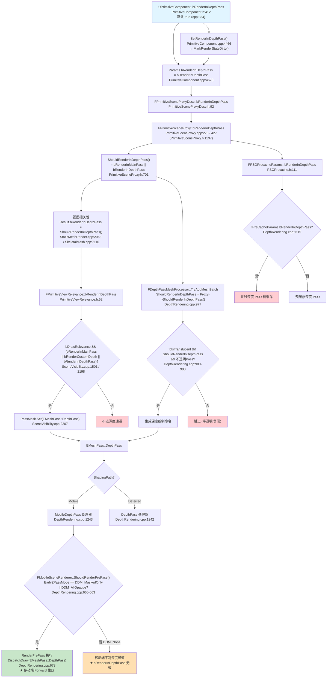
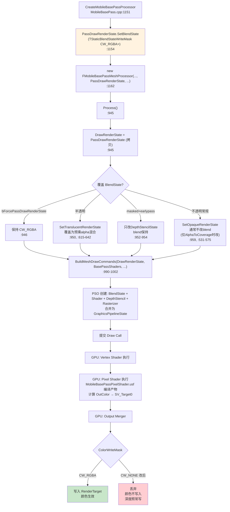

> **问题一（原始问题）**：Engine/Source/Runtime/Renderer/Private/MobileBasePass.cpp:207 中 GetShaders 都做了什么，深入其中的调用，整理出来这个函数的各个判断分支，都做了哪些工作，主要是对 Shader 做了什么操作，要尽可能的深入，找到详细的工作，每一步都有代码做佐证，给出代码行号，解释做了什么，最后还要给我 mermaid，将分析存到 Engine\Docs 文件夹中，md 格式。

---

# MobileBasePass::GetShaders 深度分析

> 分析对象：`MobileBasePass::GetShaders` 函数
> 入口位置：`Engine/Source/Runtime/Renderer/Private/MobileBasePass.cpp:207`
> 作用：为移动端 Base Pass 根据光照贴图策略、局部光照设置、材质、顶点工厂等条件，查找（必要时按需编译）对应的顶点着色器（VS）与像素着色器（PS）。

---

## 一、总体调用链路

```
MobileBasePass::GetShaders                       (MobileBasePass.cpp:207)
 └─ GetMobileBasePassShaders<LocalLightSetting>   (MobileBasePass.cpp:168)
     └─ GetUniformMobileBasePassShaders<Policy>   (MobileBasePass.cpp:124)
         ├─ AddMobileBasePassPixelShaderTypes     (MobileBasePass.cpp:97)
         ├─ FMaterial::TryGetShaders              (MaterialShared.cpp:3624)
         │   └─ FShaderMapContent::GetShader      (ShaderMap.cpp:305)
         ├─ FMaterialShaders::TryGetVertexShader  (MaterialShaderType.h:284)
         └─ FMaterialShaders::TryGetPixelShader   (MaterialShaderType.h:285)
```

---

## 二、第一层：MobileBasePass::GetShaders（MobileBasePass.cpp:207-275）

### 函数签名（MobileBasePass.cpp:207-214）
```cpp
bool MobileBasePass::GetShaders(
    ELightMapPolicyType LightMapPolicyType,
    EMobileLocalLightSetting LocalLightSetting,
    const FMaterial& MaterialResource,
    const FVertexFactoryType* VertexFactoryType,
    bool bEnableSkyLight,
    TShaderRef<TMobileBasePassVSPolicyParamType<FUniformLightMapPolicy>>& VertexShader,
    TShaderRef<TMobileBasePassPSPolicyParamType<FUniformLightMapPolicy>>& PixelShader)
```

输入：光照贴图策略类型、局部光照设置、材质资源、顶点工厂类型、是否启用天光。
输出：通过出参 `VertexShader` / `PixelShader` 返回查找到的 VS / PS 引用。

### 步骤 1：判断材质是否为 Lit（MobileBasePass.cpp:216）
```cpp
bool bIsLit = (MaterialResource.GetShadingModels().IsLit());
```
- 从材质的着色模型集合判断是否为受光材质。`bIsLit` 决定后续天光置换逻辑。

### 步骤 2：天光置换过滤（MobileBasePass.cpp:217-220）
```cpp
if (bIsLit && !UseSkylightPermutation(bEnableSkyLight, FReadOnlyCVARCache::MobileSkyLightPermutation()))
{
    bEnableSkyLight = !bEnableSkyLight;
}
```
- `UseSkylightPermutation` 定义见 `MobileBasePassRendering.h:346-356`。它根据 CVar `r.Mobile.SkyLightPermutation` 的取值（0/1/2）决定当前 `bEnableSkyLight` 状态是否需要对应的天光 permutation：
  - 值为 0：两种天光状态都缓存，永远返回 true（即不需要翻转）。
  - 值为 1：只缓存「无天光」permutation；若当前 `bEnableSkyLight==true` 则返回 false → 翻转为 false，使用无天光版本。
  - 值为 2：只缓存「有天光」permutation；若当前 `bEnableSkyLight==false` 则返回 false → 翻转为 true，使用有天光版本。
- **对 Shader 的影响**：通过翻转 `bEnableSkyLight`，强制选择「实际被缓存」的那一个天光 permutation，避免请求一个不会编译的 shader 类型。仅对 Lit 材质生效。

### 步骤 3：薄透明回退模式计算（MobileBasePass.cpp:222-227）
```cpp
EMobileTranslucentColorTransmittanceMode ThinTranslucencyFallback = EMobileTranslucentColorTransmittanceMode::DEFAULT;
if (MaterialResource.GetShadingModels().HasShadingModel(MSM_ThinTranslucent))
{
    const EShaderPlatform ShaderPlatform = GetFeatureLevelShaderPlatform(MaterialResource.GetFeatureLevel());
    ThinTranslucencyFallback = MobileActiveTranslucentColorTransmittanceMode(ShaderPlatform, false);
}
```
- 仅当材质包含 `MSM_ThinTranslucent` 着色模型时进入。
- 调用 `MobileActiveTranslucentColorTransmittanceMode`（`MobileBasePassRendering.cpp:93-122`），其内部逻辑：
  1. 先取 `MobileDefaultTranslucentColorTransmittanceMode`（`MobileBasePassRendering.cpp:69-80`）：
     - 支持 DualSourceBlending 或模拟平台 → `DUAL_SRC_BLENDING`
     - Metal Mobile / Android OpenGLES → `PROGRAMMABLE_BLENDING`
     - 其它 → `SINGLE_SRC_BLENDING`
  2. 若默认是 `DUAL_SRC_BLENDING` 但运行时不支持 `GSupportsDualSrcBlending`：依次回退到 `PROGRAMMABLE_BLENDING`（需 FramebufferFetch）或 `SINGLE_SRC_BLENDING`。
  3. 若默认是 `PROGRAMMABLE_BLENDING` 但不支持 FramebufferFetch → 回退 `SINGLE_SRC_BLENDING`。
  4. 传入 `bExplicitDefaultMode=false`，故正常情况返回 `DEFAULT`（使用默认模式），仅在不支持硬件能力时返回具体回退值。
- **对 Shader 的影响**：`ThinTranslucencyFallback` 决定后续选取哪一种薄透明颜色透射 permutation 的 PS（DEFAULT / SINGLE_SRC_BLENDING）。这是选择 PS shader 子类型的关键维度之一。

### 步骤 4：按 LocalLightSetting 分支派发（MobileBasePass.cpp:229-274）
```cpp
switch (LocalLightSetting)
{
    case EMobileLocalLightSetting::LOCAL_LIGHTS_DISABLED:
        return GetMobileBasePassShaders<LOCAL_LIGHTS_DISABLED>(...);
    case EMobileLocalLightSetting::LOCAL_LIGHTS_ENABLED:
        return GetMobileBasePassShaders<LOCAL_LIGHTS_ENABLED>(...);
    case EMobileLocalLightSetting::LOCAL_LIGHTS_BUFFER:
        return GetMobileBasePassShaders<LOCAL_LIGHTS_BUFFER>(...);
    default:
        check(false);
        return false;
}
```
三个分支：
| LocalLightSetting | 含义 | 模板参数 |
|---|---|---|
| `LOCAL_LIGHTS_DISABLED` | 不支持局部光照 | 传入 `GetMobileBasePassShaders` |
| `LOCAL_LIGHTS_ENABLED` | 启用 Clustered 局部光照 | 传入 `GetMobileBasePassShaders` |
| `LOCAL_LIGHTS_BUFFER` | 使用缓冲区合并局部光照 | 传入 `GetMobileBasePassShaders` |

`LocalLightSetting` 由调用方（`MobileBasePass.cpp:918-928` 的 `Process`）依据 `GetMobileForwardLocalLightSetting`（`MobileBasePass.cpp:46-63`，读取 `r.Mobile.ForwardLocalLights`：1=ENABLED，2=BUFFER）与单置换优化 `MobileLocalLightsUseSinglePermutation`（`MobileBasePass.cpp:41-44`）决定。

- **对 Shader 的影响**：`LocalLightSetting` 作为模板参数编入 PS 类型 `TMobileBasePassPS<..., LocalLightSetting, ...>`，是 shader permutation 的一个维度。不同值对应不同的编译产物（影响 `ENABLE_CLUSTERED_LIGHTS`、`MERGED_LOCAL_LIGHTS_MOBILE` 等 define）。

---

## 三、第二层：GetMobileBasePassShaders\<LocalLightSetting\>（MobileBasePass.cpp:168-205）

### 按 LightMapPolicyType 分支派发（MobileBasePass.cpp:179-204）
```cpp
switch (LightMapPolicyType)
{
    case LMP_NO_LIGHTMAP:                                       return GetUniformMobileBasePassShaders<LMP_NO_LIGHTMAP, LocalLightSetting>(...);
    case LMP_LQ_LIGHTMAP:                                       return GetUniformMobileBasePassShaders<LMP_LQ_LIGHTMAP, ...>(...);
    case LMP_MOBILE_DISTANCE_FIELD_SHADOWS_AND_LQ_LIGHTMAP:     return GetUniformMobileBasePassShaders<LMP_MOBILE_DISTANCE_FIELD_SHADOWS_AND_LQ_LIGHTMAP, ...>(...);
    case LMP_MOBILE_DISTANCE_FIELD_SHADOWS_LIGHTMAP_AND_CSM:    return GetUniformMobileBasePassShaders<LMP_MOBILE_DISTANCE_FIELD_SHADOWS_LIGHTMAP_AND_CSM, ...>(...);
    case LMP_MOBILE_DIRECTIONAL_LIGHT_CSM_AND_LIGHTMAP:         return GetUniformMobileBasePassShaders<LMP_MOBILE_DIRECTIONAL_LIGHT_CSM_AND_LIGHTMAP, ...>(...);
    case LMP_MOBILE_DIRECTIONAL_LIGHT_AND_SH_INDIRECT:         return GetUniformMobileBasePassShaders<LMP_MOBILE_DIRECTIONAL_LIGHT_AND_SH_INDIRECT, ...>(...);
    case LMP_MOBILE_DIRECTIONAL_LIGHT_CSM_AND_SH_INDIRECT:     return GetUniformMobileBasePassShaders<LMP_MOBILE_DIRECTIONAL_LIGHT_CSM_AND_SH_INDIRECT, ...>(...);
    case LMP_MOBILE_MOVABLE_DIRECTIONAL_LIGHT_WITH_LIGHTMAP:   return GetUniformMobileBasePassShaders<LMP_MOBILE_MOVABLE_DIRECTIONAL_LIGHT_WITH_LIGHTMAP, ...>(...);
    case LMP_MOBILE_MOVABLE_DIRECTIONAL_LIGHT_CSM_WITH_LIGHTMAP: return GetUniformMobileBasePassShaders<LMP_MOBILE_MOVABLE_DIRECTIONAL_LIGHT_CSM_WITH_LIGHTMAP, ...>(...);
    case LMP_MOBILE_DIRECTIONAL_LIGHT_CSM:                     return GetUniformMobileBasePassShaders<LMP_MOBILE_DIRECTIONAL_LIGHT_CSM, ...>(...);
    default: check(false); return true;
}
```
共 10 个分支，每个把对应的 `ELightMapPolicyType` 作为模板参数 `Policy` 传给 `GetUniformMobileBasePassShaders`。
- **对 Shader 的影响**：`Policy` 编入 `TUniformLightMapPolicy<Policy>`，进而编入 VS/PS 类型，决定光照贴图相关的 shader permutation（影响 `LightMapPolicyType::ModifyCompilationEnvironment`、`ShouldCompilePermutation`）。

---

## 四、第三层：GetUniformMobileBasePassShaders\<Policy, LocalLightSetting\>（MobileBasePass.cpp:124-166）

### 步骤 1：确定 HDR/LDR 输出格式（MobileBasePass.cpp:137）
```cpp
const bool bIsMobileHDR = IsMobileHDR();
```
- **对 Shader 的影响**：`bIsMobileHDR` 决定选用 `HDR_LINEAR_64` 还是 `LDR_GAMMA_32` 输出格式的 shader，对应 `EOutputFormat`（`MobileBasePassRendering.h:102-106`）。

### 步骤 2：构造 ShaderTypes 并添加 VS 类型（MobileBasePass.cpp:138-146）
```cpp
FMaterialShaderTypes ShaderTypes;
if (bIsMobileHDR)
    ShaderTypes.AddShaderType<TMobileBasePassVS<TUniformLightMapPolicy<Policy>, HDR_LINEAR_64>>();
else
    ShaderTypes.AddShaderType<TMobileBasePassVS<TUniformLightMapPolicy<Policy>, LDR_GAMMA_32>>();
```
- `FMaterialShaderTypes` 结构见 `MaterialShaderType.h:207-229`，内部持有 `ShaderType[SF_NumFrequencies]` 数组与 `PermutationId` 数组。
- `AddShaderType<ShaderType>` 模板版本（`MaterialShaderType.h:224-228`）调用 `AddShaderType(&ShaderType::GetStaticType(), 0)`，后者（`MaterialShaderType.h:215-222`）按 `InType->GetFrequency()` 存入对应频率槽位。
- **对 Shader 的影响**：将一个具体的 VS shader 类型（含 Policy + OutputFormat 两个模板维度）登记到待查找列表。`TMobileBasePassVS` 定义见 `MobileBasePassRendering.h:211-235`。

### 步骤 3：按 ThinTranslucentFallback 添加 PS 类型（MobileBasePass.cpp:148-155）
```cpp
switch (ThinTranslucentFallback)
{
default:
case EMobileTranslucentColorTransmittanceMode::DEFAULT:
    AddMobileBasePassPixelShaderTypes<Policy, LocalLightSetting, DEFAULT>(ShaderTypes, bIsMobileHDR, bEnableSkyLight); break;
case EMobileTranslucentColorTransmittanceMode::SINGLE_SRC_BLENDING:
    AddMobileBasePassPixelShaderTypes<Policy, LocalLightSetting, SINGLE_SRC_BLENDING>(ShaderTypes, bIsMobileHDR, bEnableSkyLight); break;
}
```
注意：`DUAL_SRC_BLENDING` 与 `PROGRAMMABLE_BLENDING` 不会作为 fallback 传入（`MobileActiveTranslucentColorTransmittanceMode` 在 `bExplicitDefaultMode=false` 时只可能返回 DEFAULT 或 SINGLE_SRC_BLENDING）。DEFAULT 分支也覆盖了 DUAL_SRC/PROGRAMMABLE（默认模式在 shader 编译期由 `MobileDefaultTranslucentColorTransmittanceMode` 决定 define）。

### 步骤 4：AddMobileBasePassPixelShaderTypes 内部 4 分支（MobileBasePass.cpp:97-122）
```cpp
if (bIsMobileHDR)
{
    if (bEnableSkyLight)
        ShaderTypes.AddShaderType<TMobileBasePassPS<..., HDR_LINEAR_64, true,  LocalLightSetting, ThinTranslucencyFallback>>();
    else
        ShaderTypes.AddShaderType<TMobileBasePassPS<..., HDR_LINEAR_64, false, LocalLightSetting, ThinTranslucencyFallback>>();
}
else
{
    if (bEnableSkyLight)
        ShaderTypes.AddShaderType<TMobileBasePassPS<..., LDR_GAMMA_32, true,  LocalLightSetting, ThinTranslucencyFallback>>();
    else
        ShaderTypes.AddShaderType<TMobileBasePassPS<..., LDR_GAMMA_32, false, LocalLightSetting, ThinTranslucencyFallback>>();
}
```
四个组合 = {HDR, LDR} × {天光开, 天光关}。`TMobileBasePassPS` 模板参数（`MobileBasePassRendering.h:359-458`）：
- `LightMapPolicyType` = `TUniformLightMapPolicy<Policy>`
- `OutputFormat` = HDR_LINEAR_64 / LDR_GAMMA_32
- `bEnableSkyLight` = true / false
- `LocalLightSetting`
- `TranslucentColorTransmittanceFallback`

这些 shader 类型通过宏 `IMPLEMENT_MOBILE_SHADING_BASEPASS_LIGHTMAPPED_SHADER_TYPE`（`MobileBasePassRendering.cpp:154-170`）对 10 种 Policy × 各 LocalLightSetting × DEFAULT/SINGLE_SRC 共注册了大量具体类型，每个绑定到 `MobileBasePassPixelShader.usf` / `MobileBasePassVertexShader.usf`。

### 步骤 5：调用 Material.TryGetShaders 查找 shader（MobileBasePass.cpp:157-161）
```cpp
FMaterialShaders Shaders;
if (!Material.TryGetShaders(ShaderTypes, VertexFactoryType, Shaders))
{
    return false;
}
```
若查找失败（shader 不存在且不应缓存或按需编译失败），直接返回 false。

### 步骤 6：提取 VS / PS（MobileBasePass.cpp:163-164）
```cpp
Shaders.TryGetVertexShader(VertexShader);
Shaders.TryGetPixelShader(PixelShader);
return true;
```
- `TryGetVertexShader` → `TryGetShader(SF_Vertex, OutShader)`（`MaterialShaderType.h:284`、`250-264`）：从 `Shaders[SF_Vertex]` 取出 `FShader*`，包装成 `TShaderRef`。
- `TryGetPixelShader` → `TryGetShader(SF_Pixel, OutShader)`（`MaterialShaderType.h:285`）：同上，频率为 `SF_Pixel`。
- `FMaterialShaders` 结构见 `MaterialShaderType.h:231-295`，持有 `ShaderMap`、`Pipeline`、`Shaders[SF_NumFrequencies]`。

---

## 五、第四层：FMaterial::TryGetShaders（MaterialShared.cpp:3624-3874）

### 步骤 1：获取 ShaderMap（MaterialShared.cpp:3629-3636）
```cpp
const bool bIsInGameThread = (IsInGameThread() || IsInParallelGameThread());
const FMaterialShaderMap* ShaderMap = bIsInGameThread ? GameThreadShaderMap : RenderingThreadShaderMap;
...
if (ShaderMap == nullptr) return false;
OutShaders.ShaderMap = ShaderMap;
```
- 按线程取对应的 ShaderMap；为空则失败返回。

### 步骤 2：获取 ShaderMapContent（MaterialShared.cpp:3639-3643）
```cpp
const EShaderPlatform ShaderPlatform = ShaderMap->GetShaderPlatform();
const EShaderPermutationFlags PermutationFlags = ShaderMap->GetPermutationFlags();
const FShaderMapContent* ShaderMapContent = InVertexFactoryType
    ? static_cast<const FShaderMapContent*>(ShaderMap->GetMeshShaderMap(InVertexFactoryType))
    : static_cast<const FShaderMapContent*>(ShaderMap->GetContent());
```
- 有 VertexFactory 时取 `GetMeshShaderMap`（`MaterialShared.h:1370`）得到 `FMeshMaterialShaderMap`（其派生自 `FShaderMapContent`）；否则取整个 ShaderMap 的 Content。
- **对 Shader 的影响**：确定了在哪个「子 shader 映射表」中查找 VS/PS。

### 步骤 3：ShouldCacheShaderType lambda（MaterialShared.cpp:3648-3670）
```cpp
auto ShouldCacheShaderType = [&](const FShaderType* ShaderType, ...) -> bool {
    if (!ShouldCache(ShaderPlatform, ShaderType, VertexFactoryType)) return false;  // FMaterial::ShouldCache 默认 return true (MaterialShared.cpp:3511)
    if (const FMaterialShaderType* MS = ShaderType->GetMaterialShaderType())
        return MS->ShouldCompilePermutation(ShaderPlatform, this, PermutationId, PermutationFlags);
    if (const FMeshMaterialShaderType* MMS = ShaderType->GetMeshMaterialShaderType())
    {
        const bool bVFShouldCache = FMeshMaterialShaderType::ShouldCompileVertexFactoryPermutation(...);
        const bool bShaderShouldCache = MMS->ShouldCompilePermutation(...);
        return bVFShouldCache && bShaderShouldCache;
    }
    return false;
};
```
- 对 MeshMaterialShader（VS/PS 都是此类），调用其 `ShouldCompilePermutation`：
  - VS：`TMobileBasePassVS::ShouldCompilePermutation`（`MobileBasePassRendering.h:217-220`）→ 检查 `IsMobilePlatform` + `LightMapPolicyType::ShouldCompilePermutation` + `ShouldCacheShaderByPlatformAndOutputFormat`（`MobileBasePassRendering.cpp:124-132`，校验 LDR/HDR 与当前是否一致）。
  - PS：`TMobileBasePassPS::ShouldCompilePermutation`（`MobileBasePassRendering.h:365-400`）→ 综合判断天光置换、局部光照置换、`ShouldCacheShaderForColorTransmittanceFallback`（`MobileBasePassRendering.cpp:177-190`）等。
- **对 Shader 的影响**：决定某个 shader 类型在当前平台/材质下「是否应当被编译缓存」。若不应缓存，TryGetShaders 直接 `return false`（`MaterialShared.cpp:3650-3652`、`3704-3707`、`3796-3799`）。

### 步骤 4A：Shader Pipeline 路径（MaterialShared.cpp:3672-3777）
当 `InTypes.PipelineType` 非空且平台支持 shader pipeline 时进入：
```cpp
FShaderPipeline* Pipeline = ShaderMapContent ? ShaderMapContent->GetShaderPipeline(InTypes.PipelineType) : nullptr;
if (Pipeline)
{
    OutShaders.Pipeline = Pipeline;
    for (FrequencyIndex in graphics frequencies)
    {
        const FShaderType* ShaderType = InTypes.ShaderType[FrequencyIndex];
        FShader* Shader = Pipeline->GetShader((EShaderFrequency)FrequencyIndex);  // Shader.h:2017-2021
        if (Shader) { check(...); OutShaders.Shaders[FrequencyIndex] = Shader; }
        else { check(!ShaderType); }
    }
}
```
- Mobile Base Pass 通常不使用 Pipeline（`InTypes.PipelineType` 为 nullptr，因为只 AddShaderType 了 VS 和 PS，未设置 PipelineType），故一般走 4B 路径。

### 步骤 4B：单 Shader 查找路径（MaterialShared.cpp:3778-3865）
```cpp
for (int32 FrequencyIndex = 0; FrequencyIndex < SF_NumFrequencies; ++FrequencyIndex)
{
    const FShaderType* ShaderType = InTypes.ShaderType[FrequencyIndex];
    if (ShaderType)
    {
        const int32 PermutationId = InTypes.PermutationId[FrequencyIndex];
        FShader* Shader = ShaderMapContent ? ShaderMapContent->GetShader(ShaderType, PermutationId) : nullptr;
        if (Shader)
        {
            OutShaders.Shaders[FrequencyIndex] = Shader;   // 命中
        }
        else
        {
            bMissingShader = true;
            // 编辑器/ODSC：不应缓存则 return false；否则按需发起编译
        }
    }
}
```
- 对每个已登记的频率（VS=SF_Vertex、PS=SF_Pixel）查找 shader。
- `FShaderMapContent::GetShader`（`ShaderMap.cpp:305-325`）：
  ```cpp
  const uint16 Hash = MakeShaderHash(TypeName, PermutationId);
  for (Index = ShaderHash.First(Hash); IsValid(Index); Index = NextIndices[Index])
      if (ShaderTypes[Index]==TypeName && ShaderPermutations[Index]==PermutationId)
          return Shaders[Index].GetChecked();
  return nullptr;
  ```
  基于哈希表在已编译 shader 列表中做 O(1) 均摊查找。
- **缺失 shader 时的按需编译**（编辑器，`MaterialShared.cpp:3819-3860`）：
  - 有 VertexFactory → `ShaderType->AsMeshMaterialShaderType()->BeginCompileShader(...)`（`MaterialShared.cpp:3827-3840`）。
  - 无 VertexFactory → `ShaderType->AsMaterialShaderType()->BeginCompileShader(...)`（`MaterialShared.cpp:3844-3856`）。
  - 编译优先级 `EShaderCompileJobPriority::ForceLocal`。
- **ODSC（按需着色编译）**（`MaterialShared.cpp:3802-3816`）： cooked 数据下通过 `GODSCManager->AddThreadedShaderPipelineRequest` 记录请求。

### 步骤 5：提交编译任务（MaterialShared.cpp:3867-3871）
```cpp
if (CompileJobs.Num() > 0)
{
    TRACE_COUNTER_ADD(Shaders_OnDemandShaderRequests, CompileJobs.Num());
    GShaderCompilingManager->SubmitJobs(CompileJobs, ...);
}
```

### 步骤 6：返回（MaterialShared.cpp:3873）
```cpp
return !bMissingShader;
```
- 有缺失（且已发起按需编译）时返回 false；调用方（如 `Process`，`MobileBasePass.cpp:930-940`）据此跳过本次 mesh draw 命令构建，等 shader 编译完成后下一帧再处理。

---

## 六、Shader 类型与 Permutation 维度汇总

VS 类型 `TMobileBasePassVS<LightMapPolicyType, OutputFormat>`（`MobileBasePassRendering.h:211`）维度：
- Policy（10 种 LightMapPolicyType）
- OutputFormat（HDR_LINEAR_64 / LDR_GAMMA_32）

PS 类型 `TMobileBasePassPS<LightMapPolicyType, OutputFormat, bEnableSkyLight, LocalLightSetting, TranslucentColorTransmittanceFallback>`（`MobileBasePassRendering.h:359`）维度：
- Policy（10 种）
- OutputFormat（HDR / LDR）
- bEnableSkyLight（true / false）
- LocalLightSetting（DISABLED / ENABLED / BUFFER）
- TranslucentColorTransmittanceFallback（DEFAULT / SINGLE_SRC_BLENDING）

理论上 PS 维度数 = 10 × 2 × 2 × 3 × 2 = 240 种类型声明，但 `ShouldCompilePermutation` 会按平台/材质能力裁剪。

PS 编译期 define（`MobileBasePassRendering.h:402-449`，`ModifyCompilationEnvironment`）：
- `ENABLE_SKY_LIGHT`、`ENABLE_AMBIENT_OCCLUSION`
- `ENABLE_CLUSTERED_LIGHTS`（LocalLightSetting==ENABLED 时 1）
- `MERGED_LOCAL_LIGHTS_MOBILE`（LocalLightSetting==BUFFER 时根据 prepass/basepass 设 1/2）
- `ENABLE_CLUSTERED_REFLECTION`、`USE_SHADOWMASKTEXTURE`、`ENABLE_DBUFFER_TEXTURES`
- `MOBILE_TRANSLUCENT_COLOR_TRANSMITTANCE_DUAL_SRC_BLENDING` / `_PROGRAMMABLE_BLENDING` / `_SINGLE_SRC_BLENDING`

VS/PS 共享 define（`MobileBasePassModifyCompilationEnvironment`，`MobileBasePassRendering.cpp:193-226`）：
- `OUTPUT_GAMMA_SPACE`、`OUTPUT_MOBILE_HDR`、`IS_BASE_PASS`、`IS_MOBILE_BASE_PASS`
- `ENABLE_SHADINGMODEL_SUPPORT_MOBILE_DEFERRED`、`IS_MOBILE_DEPTHREAD_SUBPASS`、`IS_MOBILE_DEFERREDSHADING_SUBPASS`

---

## 七、调用方上下文（如何使用结果）

1. **`FMobileBasePassMeshProcessor::Process`**（`MobileBasePass.cpp:930-940`）：
   ```cpp
   if (!MobileBasePass::GetShaders(LightMapPolicyType, LocalLightSetting, MaterialResource,
       MeshBatch.VertexFactory->GetType(), bEnableSkyLight, BasePassShaders.VertexShader, BasePassShaders.PixelShader))
   {
       return false;
   }
   ```
   成功后用 `BasePassShaders` 调用 `BuildMeshDrawCommands`（`MobileBasePass.cpp:990-1002`）构建绘制命令。
2. **`CollectPSOInitializersForLMPolicy`**（`MobileBasePass.cpp:1023`）：PSO 预缓存路径同样调用 GetShaders。
3. **`DebugViewModeRendering.cpp:474`、`EditorPrimitivesRendering.cpp:137`、`SkyPassRendering.cpp:116`**：编辑器/天空通道等也复用此函数获取 Mobile shader。

---

## 八、分支决策流程图（Mermaid）

```mermaid
flowchart TD
	Start["MobileBasePass::GetShaders<br/>MobileBasePass.cpp:207"] --> IsLit["bIsLit = Material.GetShadingModels().IsLit()<br/>:216"]
	IsLit --> SkyPerm{"bIsLit &&<br/>!UseSkylightPermutation(bEnableSkyLight,<br/>MobileSkyLightPermutation)?<br/>:217"}
	SkyPerm -->|是| FlipSky["bEnableSkyLight = !bEnableSkyLight<br/>:219"]
	SkyPerm -->|否| ThinCheck
	FlipSky --> ThinCheck{"Material 含 MSM_ThinTranslucent?<br/>:223"}

	ThinCheck -->|否| ThinDefault["ThinTranslucencyFallback = DEFAULT<br/>:222"]
	ThinCheck -->|是| ThinCalc["ThinTranslucencyFallback =<br/>MobileActiveTranslucentColorTransmittanceMode(Platform,false)<br/>:225-226<br/>(DEFAULT 或 SINGLE_SRC_BLENDING)"]
	ThinDefault --> LLSwitch
	ThinCalc --> LLSwitch

	LLSwitch{"switch LocalLightSetting<br/>:229"}
	LLSwitch -->|LOCAL_LIGHTS_DISABLED| LL_Dis["GetMobileBasePassShaders&lt;LOCAL_LIGHTS_DISABLED&gt;<br/>:233"]
	LLSwitch -->|LOCAL_LIGHTS_ENABLED| LL_En["GetMobileBasePassShaders&lt;LOCAL_LIGHTS_ENABLED&gt;<br/>:246"]
	LLSwitch -->|LOCAL_LIGHTS_BUFFER| LL_Buf["GetMobileBasePassShaders&lt;LOCAL_LIGHTS_BUFFER&gt;<br/>:259"]
	LLSwitch -->|default| LL_Err["check(false); return false<br/>:272"]

	LL_Dis --> LM["GetMobileBasePassShaders&lt;LocalLightSetting&gt;<br/>:168"]
	LL_En --> LM
	LL_Buf --> LM

	LM --> LMSwitch{"switch LightMapPolicyType<br/>:179"}
	LMSwitch -->|LMP_NO_LIGHTMAP| P1["GetUniformMobileBasePassShaders&lt;LMP_NO_LIGHTMAP&gt;<br/>:182"]
	LMSwitch -->|LMP_LQ_LIGHTMAP| P2[":184"]
	LMSwitch -->|LMP_MOBILE_DISTANCE_FIELD_SHADOWS_AND_LQ_LIGHTMAP| P3[":186"]
	LMSwitch -->|...共10种Policy| Pn[":188-200"]
	LMSwitch -->|default| LMErr["check(false)<br/>:202"]
	P1 --> Uni["GetUniformMobileBasePassShaders&lt;Policy&gt;<br/>:124"]
	P2 --> Uni
	P3 --> Uni
	Pn --> Uni

	Uni --> HDR{"bIsMobileHDR = IsMobileHDR()<br/>:137"}
	HDR -->|是| AddVS_HDR["ShaderTypes.AddShaderType&lt;TMobileBasePassVS&lt;Policy,HDR_LINEAR_64&gt;&gt;<br/>:141"]
	HDR -->|否| AddVS_LDR["ShaderTypes.AddShaderType&lt;TMobileBasePassVS&lt;Policy,LDR_GAMMA_32&gt;&gt;<br/>:145"]
	AddVS_HDR --> ThinSw{"switch ThinTranslucencyFallback<br/>:148"}
	AddVS_LDR --> ThinSw

	ThinSw -->|DEFAULT| AddPS_Def["AddMobileBasePassPixelShaderTypes&lt;...,DEFAULT&gt;<br/>:152"]
	ThinSw -->|SINGLE_SRC_BLENDING| AddPS_Src["AddMobileBasePassPixelShaderTypes&lt;...,SINGLE_SRC_BLENDING&gt;<br/>:154"]

	AddPS_Def --> PS4{"bIsMobileHDR × bEnableSkyLight<br/>4分支 :100-121"}
	AddPS_Src --> PS4

	PS4 -->|HDR,Sky| PSA["AddShaderType&lt;TMobileBasePassPS&lt;HDR,true,...&gt;&gt;<br/>:104"]
	PS4 -->|HDR,noSky| PSB["AddShaderType&lt;TMobileBasePassPS&lt;HDR,false,...&gt;&gt;<br/>:108"]
	PS4 -->|LDR,Sky| PSC["AddShaderType&lt;TMobileBasePassPS&lt;LDR,true,...&gt;&gt;<br/>:115"]
	PS4 -->|LDR,noSky| PSD["AddShaderType&lt;TMobileBasePassPS&lt;LDR,false,...&gt;&gt;<br/>:119"]

	PSA --> TryGet["Material.TryGetShaders(ShaderTypes, VertexFactoryType, Shaders)<br/>:158"]
	PSB --> TryGet
	PSC --> TryGet
	PSD --> TryGet

	TryGet --> TryRes{"TryGetShaders 返回?<br/>MaterialShared.cpp:3624"}
	TryRes -->|false| Fail["return false<br/>:160"]
	TryRes -->|true| SM["获取 ShaderMap / ShaderMapContent<br/>MaterialShared.cpp:3629-3643 (内部查找流程)"]

	SM --> Loop["遍历 FrequencyIndex (VS/PS)<br/>:3780"]
	Loop --> GetSh["ShaderMapContent->GetShader(ShaderType,PermutationId)<br/>ShaderMap.cpp:305 哈希查找"]
	GetSh --> Found{"Shader != null?"}
	Found -->|是| Store["OutShaders.Shaders[idx] = Shader<br/>:3789"]
	Found -->|否| Miss["bMissingShader=true<br/>:3793"]
	Miss --> SC{"ShouldCacheShaderType?<br/>:3796"}
	SC -->|不应缓存| RetFalse["return false<br/>:3798"]
	SC -->|应缓存| Compile["编辑器: BeginCompileShader (ForceLocal)<br/>ODSC: AddThreadedShaderPipelineRequest<br/>:3827-3856"]
	Compile --> Submit["GShaderCompilingManager->SubmitJobs<br/>:3870"]
	Submit --> Ret["return !bMissingShader<br/>:3873"]

	Store --> ExtractVS["Shaders.TryGetVertexShader(VertexShader)<br/>MaterialShaderType.h:284 -> TryGetShader(SF_Vertex)<br/>:250 包装 TShaderRef"]
	Store --> ExtractPS["Shaders.TryGetPixelShader(PixelShader)<br/>MaterialShaderType.h:285 -> TryGetShader(SF_Pixel)<br/>:250 包装 TShaderRef"]
	ExtractVS --> OK["return true<br/>:165"]
	ExtractPS --> OK

	style Start fill:#e1f5ff
	style OK fill:#c8e6c9
	style Fail fill:#ffcdd2
	style RetFalse fill:#ffcdd2
	style LL_Err fill:#ffcdd2
	style LMErr fill:#ffcdd2
```



---

## 九、关键结论

1. **GetShaders 本身不编译 shader，只做「查找 + 选择 shader 类型」**：它通过多层 switch 将 (Policy, OutputFormat, SkyLight, LocalLightSetting, ThinTranslucency) 五个维度组合成具体的 VS/PS shader 类型，再到材质的 ShaderMap 中哈希查找。
2. **真正的编译只发生在 shader 缺失的编辑器/ODSC 场景**（`MaterialShared.cpp:3819-3860`），以 `ForceLocal` 优先级按需发起，提交给 `GShaderCompilingManager`，本帧返回 false 跳过绘制。
3. **天光置换翻转**（`:217-220`）是性能优化：通过 `r.Mobile.SkyLightPermutation` 控制只缓存一种天光 permutation，运行时强制对齐，减少 shader 数量。
4. **薄透明回退**（`:222-227`）根据硬件能力（DualSrcBlending / FramebufferFetch）选择颜色透射的 shader 子类型，保证在不支持硬件特性时仍有可用 permutation。
5. **返回 false 的两种情况**：① shader 不应被缓存（`ShouldCache`/`ShouldCompilePermutation` 返回 false）；② shader 缺失且已发起按需编译（等下一帧）。调用方据此跳过本次绘制。

---

# 附录：bRenderInDepthPass 使用链路分析

> **问题二（追加问题）**：Engine/Source/Runtime/Engine/Classes/Components/PrimitiveComponent.h:412 找到 bRenderInDepthPass 完整的使用链路，这个跟移动端 Forward 有关系吗？可以使用吗？

## A. 属性定义与语义

### A.1 组件层属性（PrimitiveComponent.h:410-412）
```cpp
/** If true, this component will be rendered in the depth pass even if it's not rendered in the main pass */
UPROPERTY(EditAnywhere, AdvancedDisplay, BlueprintReadOnly, Category = Rendering, meta = (EditCondition = "!bRenderInMainPass"))
uint8 bRenderInDepthPass:1;
```
- 含义：即使组件不在主通道（main pass：z-prepass、basepass、transparency）渲染，也强制让它进入 **Depth Pass（深度通道）**。
- `EditCondition = "!bRenderInMainPass"`：该属性仅在 `bRenderInMainPass==false` 时可在编辑器中编辑。即它是为「不参与主通道、但希望写入深度（用于遮挡剔除/深度测试/后处理深度依赖）」的特殊物件准备的。
- 默认值在构造函数中为 true（`PrimitiveComponent.cpp:334` `bRenderInDepthPass = true;`）。

### A.2 蓝图/C++ 修改入口（PrimitiveComponent.cpp:4466-4473）
```cpp
void UPrimitiveComponent::SetRenderInDepthPass(bool bValue)
{
    if (bRenderInDepthPass != bValue)
    {
        bRenderInDepthPass = bValue;
        MarkRenderStateDirty();   // 触发 SceneProxy 重建
    }
}
```
声明见 `PrimitiveComponent.h:1920-1922`。

## B. 完整数据流链路

```
UPrimitiveComponent::bRenderInDepthPass            (PrimitiveComponent.h:412, 组件属性)
  │  组件→SceneProxyDesc 拷贝
  ├─ Params.bRenderInDepthPass = bRenderInDepthPass (PrimitiveComponent.cpp:4623)
  │
  ▼
FPrimitiveSceneProxyDesc::bRenderInDepthPass        (PrimitiveSceneProxyDesc.h:92)
  │  Desc→Proxy 构造
  ├─ bRenderInDepthPass = InComponent->bRenderInDepthPass    (PrimitiveSceneProxy.cpp:276)
  ├─ bRenderInDepthPass(InProxyDesc.bRenderInDepthPass)      (PrimitiveSceneProxy.cpp:427)
  │
  ▼
FPrimitiveSceneProxy::bRenderInDepthPass            (PrimitiveSceneProxy.h:1197, 渲染线程)
  │  组合判断
  ├─ ShouldRenderInDepthPass() = bRenderInMainPass || bRenderInDepthPass  (PrimitiveSceneProxy.h:701)
  │
  ├──────────────► 视图相关性 (View Relevance)
  │     Result.bRenderInDepthPass = ShouldRenderInDepthPass();
  │     - StaticMeshRender.cpp:2063
  │     - SkeletalMesh.cpp:7116
  │     - MRMeshComponent.cpp:493 (Result.bRenderInDepthPass = bEnableOcclusion)
  │        ▼
  │     FPrimitiveViewRelevance::bRenderInDepthPass  (PrimitiveViewRelevance.h:52)
  │        ▼
  │     SceneVisibility.cpp:1501 (静态网格)  / 2198 (动态网格)
  │        → PassMask.Set(EMeshPass::DepthPass)  (SceneVisibility.cpp:2207)
  │
  ├──────────────► 实际绘制裁剪 (DepthPass MeshProcessor)
  │     FDepthPassMeshProcessor::TryAddMeshBatch:
  │        bool ShouldRenderInDepthPass = (!Proxy || Proxy->ShouldRenderInDepthPass());  (DepthRendering.cpp:977)
  │        if (!bIsTranslucent && ShouldRenderInDepthPass && ...) 才加入深度绘制  (DepthRendering.cpp:980-983)
  │
  └──────────────► PSO 预缓存 (PSOPrecache)
        FPSOPrecacheParams::bRenderInDepthPass  (PSOPrecache.h:111, 默认 true @ :35)
        - DepthRendering.cpp:1115:  !PreCacheParams.bRenderInDepthPass → 跳过深度 PSO 预缓存
        - CustomDepthRendering.cpp:701: bPrecacheCustomDepth || PreCacheParams.bRenderInDepthPass
```

### 关键消费点说明

1. **视图相关性赋值（StaticMeshRender.cpp:2063）**
   ```cpp
   Result.bRenderInDepthPass = ShouldRenderInDepthPass();
   ```
   `ShouldRenderInDepthPass()`（`PrimitiveSceneProxy.h:701`）= `bRenderInMainPass || bRenderInDepthPass`。即：只要在主通道渲染，就一定进深度通道；或者显式开启了 `bRenderInDepthPass`。

2. **MeshPass 掩码设置（SceneVisibility.cpp:1501、2198、2207）**
   ```cpp
   if (ViewRelevance.bDrawRelevance && (ViewRelevance.bRenderInMainPass || ViewRelevance.bRenderCustomDepth || ViewRelevance.bRenderInDepthPass))
   {
       ...
       PassMask.Set(EMeshPass::DepthPass);   // 2207
   }
   ```
   决定该图元是否进入 `EMeshPass::DepthPass`。

3. **深度绘制最终裁剪（DepthRendering.cpp:977-983）**
   `FDepthPassMeshProcessor::TryAddMeshBatch` 中读取 `Proxy->ShouldRenderInDepthPass()`，为 false 则该 batch 不生成深度绘制命令。

## C. 与移动端 Forward 的关系

**结论：有关系，且在移动端可以使用，但前提是移动端启用了 Depth Prepass。**

### C.1 移动端同样注册了 DepthPass MeshProcessor（DepthRendering.cpp:1242-1243）
```cpp
REGISTER_MESHPASSPROCESSOR_AND_PSOCOLLECTOR(DepthPass,       CreateDepthPassProcessor, EShadingPath::Deferred, EMeshPass::DepthPass, ...);
REGISTER_MESHPASSPROCESSOR_AND_PSOCOLLECTOR(MobileDepthPass, CreateDepthPassProcessor, EShadingPath::Mobile,   EMeshPass::DepthPass, ...);
```
- 第 1243 行专门为 `EShadingPath::Mobile` 注册了 `EMeshPass::DepthPass` 处理器，使用的是同一个 `FDepthPassMeshProcessor`。
- 因此 `bRenderInDepthPass` 经过的 `FDepthPassMeshProcessor::TryAddMeshBatch`（`DepthRendering.cpp:977`）在移动端同样会执行。

### C.2 移动端 Forward 是否运行 Depth Pass，取决于 EarlyZPass 配置（DepthRendering.cpp:660-678）
```cpp
bool FMobileSceneRenderer::ShouldRenderPrePass() const
{
    return Scene->EarlyZPassMode == DDM_MaskedOnly || Scene->EarlyZPassMode == DDM_AllOpaque;   // :663
}

void FMobileSceneRenderer::RenderPrePass(...)
{
    ...
    View.ParallelMeshDrawCommandPasses[EMeshPass::DepthPass].DispatchDraw(nullptr, RHICmdList, InstanceCullingDrawParams);  // :678
}
```
- 移动端是否存在深度预通道由 `Scene->EarlyZPassMode` 决定：
  - `DDM_MaskedOnly` 或 `DDM_AllOpaque` → 有 PrePass（移动端 Forward 也会跑 `EMeshPass::DepthPass`）。
  - `DDM_None` → 不渲染深度预通道，此时 `bRenderInDepthPass` 无实际效果（因为根本没有深度通道）。
- 移动端「完整深度预通道」由 `MobileUsesFullDepthPrepass(Platform)` 进一步控制（在 `MobileBasePassRendering.cpp:214` 等处用于决定 SubpassFetch、局部光照合并方式等）。

### C.3 移动端 Forward 中 `bRenderInDepthPass` 的实际意义
- **可以使用**：在移动端 Forward 且开启了 Mobile Depth Prepass（`EarlyZPassMode != DDM_None`）的项目里，把某个组件 `bRenderInMainPass=false` + `bRenderInDepthPass=true`，可以让它「只写深度、不渲染颜色」。典型用途：
  - 充当遮挡体（occluder）参与遮挡剔除；
  - 为后处理/软粒子/SSR 等依赖深度缓冲的效果提供正确的深度，但本身不出现在颜色画面中。
- **注意限制**：
  1. 该路径只对 **不透明/Masked** 材质有效。`TryAddMeshBatch` 在 `DepthRendering.cpp:976,980` 显式排除了半透明（`bIsTranslucent` 为 true 时不进深度通道）。
  2. 若项目 `EarlyZPassMode == DDM_None`（移动端为省带宽常见配置），移动端不跑 DepthPass，`bRenderInDepthPass` 形同虚设。
  3. 它与 `MobileBasePass::GetShaders` 选择的 Base Pass shader **无直接关系**——`bRenderInDepthPass` 影响的是 `EMeshPass::DepthPass`（走 `FDepthPassMeshProcessor` + 深度专用 shader），而非 `EMeshPass::BasePass`（走本文档主体分析的 `FMobileBasePassMeshProcessor` / `MobileBasePass::GetShaders`）。

## D. bRenderInDepthPass 链路流程图（Mermaid）



## E. 结论速览

| 问题 | 答案 |
|---|---|
| `bRenderInDepthPass` 跟移动端 Forward 有关系吗？ | **有**。移动端在 `DepthRendering.cpp:1243` 注册了 `MobileDepthPass`，使用同一个 `FDepthPassMeshProcessor`，该处理器在 `:977` 读取 `ShouldRenderInDepthPass()`。 |
| 移动端 Forward 可以使用吗？ | **可以，但有前提**：项目需开启移动端深度预通道（`Scene->EarlyZPassMode == DDM_MaskedOnly` 或 `DDM_AllOpaque`，见 `DepthRendering.cpp:663`）。若为 `DDM_None` 则移动端不跑 DepthPass，该标志无效。 |
| 适用材质类型？ | 仅 **不透明 / Masked**。半透明在 `DepthRendering.cpp:980` 被排除。 |
| 与 `MobileBasePass::GetShaders` 的关系？ | **无直接关系**。`bRenderInDepthPass` 作用于 `EMeshPass::DepthPass`（深度专用 shader）；`GetShaders` 作用于 `EMeshPass::BasePass`（颜色 shader）。二者是不同 MeshPass。 |
| 典型用途 | 只写深度不写颜色的遮挡体；为依赖场景深度的后处理/反射/软粒子提供深度，而物体本身不显示在画面。 |

---

> **问题三**：`FShaderMapContent::GetShader`（ShaderMap.cpp:305-325）里面 `LAYOUT_FIELD(TMemoryImageArray<TMemoryImagePtr<FShader>>, Shaders)` 里面是什么？`return Shaders[Index].GetChecked();` 最后返回了什么 Shader？这个前因后果要捋清楚。

---

# F. FShaderMapContent::GetShader 深度剖析：Shaders 数组里到底是什么

## F.1 目标函数回顾（ShaderMap.cpp:305-325）

```cpp
FShader* FShaderMapContent::GetShader(const FHashedName& TypeName, int32 PermutationId) const
{
    const uint16 Hash = MakeShaderHash(TypeName, PermutationId);
    const FHashedName* RESTRICT LocalShaderTypes = ShaderTypes.GetData();
    const int32*       RESTRICT LocalShaderPermutations = ShaderPermutations.GetData();
    const uint32*      RESTRICT LocalNextHashIndices = ShaderHash.GetNextIndices();
    const uint32 NumShaders = Shaders.Num();

    for (uint32 Index = ShaderHash.First(Hash); ShaderHash.IsValid(Index); Index = LocalNextHashIndices[Index])
    {
        checkSlow(Index < NumShaders);
        if (LocalShaderTypes[Index] == TypeName && LocalShaderPermutations[Index] == PermutationId)
        {
            return Shaders[Index].GetChecked();   // ← 问题核心：这里返回的是什么？
        }
    }
    return nullptr;
}
```

这是一个**哈希表查找**：用 `(TypeName, PermutationId)` 算 16 位 hash，在 `ShaderHash` 桶里拉链遍历，匹配 `ShaderTypes[]` 和 `ShaderPermutations[]` 两个并行数组的同一下标，命中后从 `Shaders[]` 数组取元素并 `GetChecked()`。

核心疑问集中在 `Shaders` 这个字段的类型与内容。

## F.2 Shaders 字段的类型定义（Shader.h:2257）

`FShaderMapContent` 的成员声明（`Shader.h:2254-2258`）：

```cpp
using FMemoryImageHashTable = THashTable<FMemoryImageAllocator>;

LAYOUT_FIELD(FMemoryImageHashTable, ShaderHash);                          // 哈希桶头
LAYOUT_FIELD(TMemoryImageArray<FHashedName>, ShaderTypes);                // 并行数组1：shader 类型名
LAYOUT_FIELD(TMemoryImageArray<int32>, ShaderPermutations);               // 并行数组2：permutation id
LAYOUT_FIELD(TMemoryImageArray<TMemoryImagePtr<FShader>>, Shaders);       // ← 并行数组3：shader 指针
LAYOUT_FIELD(TMemoryImageArray<TMemoryImagePtr<FShaderPipeline>>, ShaderPipelines);
```

四个并行结构共享同一套下标 `Index`：
- `ShaderHash`：`THashTable`，把 `Hash → 首个 Index`，再用 `NextIndices` 串成链。
- `ShaderTypes[Index]`：该槽位对应的 shader 类型名（如 `TMobileBasePassPS<...>` 的类型名哈希）。
- `ShaderPermutations[Index]`：该槽位对应的 permutation id（通常 0）。
- `Shaders[Index]`：`TMemoryImagePtr<FShader>`，指向真正的 shader 对象实例。

> `LAYOUT_FIELD` 是 UE 的反射宏，用于支持「内存镜像冻结」（MemoryImage）序列化。`TMemoryImageArray` 是支持冻结的数组容器（基于 `FMemoryImageAllocator`，`MemoryImage.h:638`），`TMemoryImagePtr` 是支持冻结的智能指针（`MemoryImage.h:379`）。

## F.3 TMemoryImagePtr\<FShader\>：一个可冻结的智能指针（MemoryImage.h:379-448）

```cpp
template<typename T>
class TMemoryImagePtr
{
    inline bool IsFrozen() const { return Frozen.IsFrozen(); }
    inline T* Get() const
    {
        return IsFrozen() ? GetFrozenPtrInternal() : UnfrozenPtr;   // :399-402
    }
    inline T* GetChecked() const { T* Value = Get(); check(Value); return Value; }  // :404
private:
    inline T* GetFrozenPtrInternal() const
    {
        return (T*)((char*)this + Frozen.GetOffsetFromThis());       // :436-439
    }
    union {
        uint64 Packed;
        FFrozenMemoryImagePtr Frozen;   // 冻结态：存相对自身的偏移
        T* UnfrozenPtr;                 // 非冻结态：普通指针
    };
};
```

关键点：
- **非冻结态（编辑器运行期）**：`UnfrozenPtr` 是普通的 `FShader*` 堆指针，`Get()` 直接返回它。
- **冻结态（cooked 发布包）**：整个 ShaderMap 被序列化成一块连续内存镜像，`Frozen` 存储的是「相对自身地址的偏移量」，`GetFrozenPtrInternal()` 用 `this + 偏移` 计算出实际地址。这样无需重定位表即可在加载到任意基址的内存镜像中寻址。
- `GetChecked()`（`MemoryImage.h:404`）= `Get()` + `check(非空)`。即取出指针并断言非空。

所以 `Shaders[Index].GetChecked()` 返回的是 **`FShader*`**——指向 `Shaders` 数组中第 `Index` 个槽位所记录的 shader 对象实例。

## F.4 这个 FShader* 到底是什么对象？——继承链

`FShader` 是基类（`Shader.h:839`），实际的派生链（以 Mobile Base Pass 为例）：

```
FShader                              (RenderCore/Shader.h:839)
  └─ FMaterialShader                 (Renderer/MaterialShader.h:65)
      └─ FMeshMaterialShader         (Renderer/MeshMaterialShader.h:72)
          ├─ TMobileBasePassVSPolicyParamType<FUniformLightMapPolicy>  (MobileBasePassRendering.h:146)
          │   └─ TMobileBasePassVS<...>                                (MobileBasePassRendering.h:212)
          └─ TMobileBasePassPSPolicyParamType<FUniformLightMapPolicy> (MobileBasePassRendering.h:242)
              └─ TMobileBasePassPS<...>                                (MobileBasePassRendering.h:360)
```

`FShader` 持有的关键字段（`Shader.h:974-1017`）：
- `Bindings`（`FShaderParameterBindings`）：RHI 参数绑定句柄。
- `ParameterMapInfo`（`FShaderParameterMapInfo`）：参数布局信息。
- `UniformBufferParameterStructs` / `UniformBufferParameters`：自动绑定的 UB 参数。
- `Type`（`TIndexedPtr<FShaderType>`）：指向该 shader 的「类型元信息」（如 `TMobileBasePassPS<...>::StaticType`）。
- `VFType`（`TIndexedPtr<FVertexFactoryType>`）：关联的顶点工厂类型。
- `Target`（`FShaderTarget`）：平台 + 频率（VS/PS/...）。
- `ResourceIndex`：在 `FShaderMapResource` 中的下标（关联编译后的 RHI shader 代码）。
- `OutputHash` / `SourceHash` / `VFSourceHash`：用于匹配 shader 代码资源。

因此 `GetShader()` 返回的虽然是基类指针 `FShader*`，但实际对象是具体的 `TMobileBasePassVS<...>` 或 `TMobileBasePassPS<...>` 实例（或其它 pass 的 shader 实例）。调用方（`TryGetShader`，`MaterialShaderType.h:250-264`）随后会用 `static_cast<ShaderType*>` 转回具体类型并包成 `TShaderRef`。

## F.5 前因：这些 shader 对象是怎么进到 Shaders 数组里的？

### F.5.1 编译期：FinishCompileShader 构造实例（编辑器，MaterialShader.cpp:2310-2342）

当材质编译时，`FMaterialShaderMap::ProcessCompilationResults` 遍历编译任务结果：

```cpp
// MeshMaterialShader 分支（VS/PS 都走这里）
const FVertexFactoryType* VertexFactoryType = CurrentJob.Key.VFType;
FMeshMaterialShaderMap* MeshShaderMap = AcquireMeshShaderMap(VertexFactoryType);   // :2317
const FMeshMaterialShaderType* MeshMaterialShaderType = CurrentJob.Key.ShaderType->GetMeshMaterialShaderType();
Shader = MeshMaterialShaderType->FinishCompileShader(...);                          // :2322  构造实例
if (!ShaderPipeline)
{
    Shader = MeshShaderMap->FindOrAddShader(MeshMaterialShaderType->GetHashedName(),
                                            CurrentJob.Key.PermutationId, Shader);  // :2327  入库
}
```

`FMeshMaterialShaderType::FinishCompileShader`（`MeshMaterialShader.cpp:158-177`）：
```cpp
FShader* Shader = ConstructCompiled(CompiledShaderInitializerType(this, CurrentJob.Key.PermutationId,
    CurrentJob.Output, UniformExpressionSet, MaterialShaderMapHash, InDebugDescription,
    ShaderPipelineType, CurrentJob.Key.VFType));   // :173
return Shader;
```

`ConstructCompiled`（`Shader.cpp:405-408`）调用函数指针 `ConstructCompiledRef`，该指针由 `IMPLEMENT_MATERIAL_SHADER_TYPE` 宏在注册时绑定，最终调用具体类的构造函数（如 `TMobileBasePassPS::TMobileBasePassPS(const CompiledShaderInitializerType&)`，`MobileBasePassRendering.h:452-454`）。构造函数内 `Bind(Initializer.ParameterMap)` 绑定参数、保存编译输出 hash 等。

### F.5.2 入库：FindOrAddShader / AddShader（ShaderMap.cpp:327-362）

```cpp
FShader* FShaderMapContent::FindOrAddShader(const FHashedName& TypeName, int32 PermutationId, FShader* Shader)
{
    check(!Shader->IsFrozen());
    const uint16 Hash = MakeShaderHash(TypeName, PermutationId);
    for (...哈希链遍历...)
    {
        if (已存在) { DeleteObjectFromLayout(Shader); return Shaders[Index].GetChecked(); }  // :350-351
    }
    const int32 Index = Shaders.Add(Shader);      // :355  ← 装入 TMemoryImagePtr<FShader>
    ShaderHash.Add(Hash, Index);                   // :356
    ShaderTypes.Add(TypeName);                     // :357
    ShaderPermutations.Add(PermutationId);         // :358
    return Shader;
}
```

`Shaders.Add(Shader)` 把 `FShader*` 隐式转成 `TMemoryImagePtr<FShader>`（`MemoryImage.h:386` 构造函数），存入数组。三个并行数组同步增长，保证同一 `Index` 对应一组 `(TypeName, PermutationId, Shader*)`。

### F.5.3 运行期/Cooked：反序列化（非编辑器）

Cooked 包里 ShaderMap 是冻结的内存镜像。加载时 `FShaderType::ConstructForDeserialization`（`Shader.cpp:400-403`）调用 `ConstructSerializedRef` 函数指针重建对象，或直接映射冻结内存。无论哪种，最终 `Shaders[]` 数组里同样持有 `FShader*`（具体派生类实例）。

## F.6 完整前因后果链路（从编译到查找）

```
[编辑器编译]
  MaterialShaderMap::ProcessCompilationResults          (MaterialShader.cpp:2310)
    └─ MeshMaterialShaderType::FinishCompileShader      (MeshMaterialShader.cpp:158)
        └─ FShaderType::ConstructCompiled               (Shader.cpp:405)
            └─ (*ConstructCompiledRef)(Initializer)      ← IMPLEMENT_MATERIAL_SHADER_TYPE 宏绑定
                └─ TMobileBasePassPS::TMobileBasePassPS(Initializer)  (MobileBasePassRendering.h:452)
                    └─ new 出一个具体的 PS 对象 (派生自 FMeshMaterialShader→FMaterialShader→FShader)
    └─ MeshShaderMap->FindOrAddShader(TypeName, PermId, Shader)  (MaterialShader.cpp:2327)
        └─ FShaderMapContent::FindOrAddShader            (ShaderMap.cpp:341)
            └─ Shaders.Add(Shader)                       :355  ← 装入 TMemoryImagePtr<FShader>
            └─ ShaderTypes.Add(TypeName)                 :357
            └─ ShaderPermutations.Add(PermId)            :358
            └─ ShaderHash.Add(Hash, Index)               :356

[运行期查找] —— MobileBasePass::GetShaders 的最终落点
  FMaterial::TryGetShaders                               (MaterialShared.cpp:3786)
    └─ ShaderMapContent->GetShader(ShaderType, PermId)   (Shader.h:2141)
        └─ GetShader(TypeName, PermId)                   (Shader.h:2143→2147)
            └─ FShaderMapContent::GetShader              (ShaderMap.cpp:305)
                └─ 哈希查找 ShaderTypes[]/ShaderPermutations[] 命中 Index
                └─ return Shaders[Index].GetChecked()    (ShaderMap.cpp:320)
                    └─ TMemoryImagePtr<FShader>::GetChecked()  (MemoryImage.h:404)
                        └─ Get()                         (MemoryImage.h:399)
                            └─ IsFrozen()? GetFrozenPtrInternal() : UnfrozenPtr
                        └─ check(非空)
                    └─ 返回 FShader* (实际是 TMobileBasePassPS<...>* 实例)
  └─ OutShaders.Shaders[SF_Pixel] = Shader               (MaterialShared.cpp:3789)
  └─ TryGetPixelShader → static_cast<TMobileBasePassPSPolicyParamType<...>*>(Shader)  (MaterialShaderType.h:250-256)
  └─ 包装成 TShaderRef                                    (MaterialShaderType.h:256)
```

## F.7 结论

1. **`Shaders` 是什么**：`TMemoryImageArray<TMemoryImagePtr<FShader>>` —— 一个支持内存镜像冻结的数组，元素是「指向 `FShader` 的可冻结智能指针」。它与 `ShaderTypes[]`、`ShaderPermutations[]`、`ShaderHash` 构成并行哈希表结构。
2. **`Shaders[Index].GetChecked()` 返回什么**：返回 `FShader*`，指向一个**已编译的具体 shader 对象实例**。在 Mobile Base Pass 场景下，这个对象实际类型是 `TMobileBasePassVS<Policy, OutputFormat>` 或 `TMobileBasePassPS<Policy, OutputFormat, bSkyLight, LocalLightSetting, ThinTranslucency>` 的某一个具体模板实例（继承链：`FShader → FMaterialShader → FMeshMaterialShader → TMobileBasePassVSPolicyParamType → TMobileBasePassVS`）。
3. **对象从哪来**：编辑器编译时由 `ConstructCompiled`（函数指针 → 具体类构造函数）`new` 出来，经 `FindOrAddShader` 装入 `Shaders` 数组；Cooked 包中则从冻结的内存镜像直接映射或反序列化重建。
4. **为什么用基类指针存**：不同 Policy/OutputFormat/... 组合产生不同具体类型，但都派生自 `FShader`，用基类指针统一存储；查找时通过 `(TypeName, PermutationId)` 精确定位，取回后再 `static_cast` 到调用方期望的具体类型。
5. **`GetChecked` 的意义**：仅做非空断言，区别于 `Get()`（可返回 null）。能命中到这一步说明 hash 链已匹配，指针理应非空；`check` 是防御性编程。

---

> **问题三**：`FShader* FShaderMapContent::GetShader(const FHashedName& TypeName, int32 PermutationId) const` （`ShaderMap.cpp:305`，文档之前分析到 `:320`）这里并没有捋清楚，`LAYOUT_FIELD(TMemoryImageArray<TMemoryImagePtr<FShader>>, Shaders);` 里面是什么？`return Shaders[Index].GetChecked();` 最后返回了什么 Shader？这个前因后果要捋清楚。

---

# FShaderMapContent::GetShader 与 Shaders 数组深度解析

## 一、Shaders 字段到底是什么

### 1.1 字段声明（Shader.h:2257）

```cpp
class FShaderMapContent
{
protected:
    LAYOUT_FIELD(FMemoryImageHashTable, ShaderHash);                              // :2254
    LAYOUT_FIELD(TMemoryImageArray<FHashedName>, ShaderTypes);                    // :2255
    LAYOUT_FIELD(TMemoryImageArray<int32>, ShaderPermutations);                   // :2256
    LAYOUT_FIELD(TMemoryImageArray<TMemoryImagePtr<FShader>>, Shaders);           // :2257
    LAYOUT_FIELD(TMemoryImageArray<TMemoryImagePtr<FShaderPipeline>>, ShaderPipelines); // :2258
};
```

`Shaders` 是一个 `TMemoryImageArray<TMemoryImagePtr<FShader>>`，即「**元素为 `TMemoryImagePtr<FShader>` 的内存映像数组**」。它和 `ShaderTypes`、`ShaderPermutations` 三个数组**同长度、同下标对齐**，构成一张「键→值」表：

| 下标 Index | ShaderTypes[Index]（FHashedName） | ShaderPermutations[Index]（int32） | Shaders[Index]（TMemoryImagePtr&lt;FShader&gt;） |
|---|---|---|---|
| 0 | "TMobileBasePassPS_FNoLightMapPolicy_HDRLinear64_Skylight_LOCAL_LIGHTS_DISABLED" | 0 | → 指向一个 `TMobileBasePassPS<...>` 实例 |
| 1 | "TMobileBasePassVS_FNoLightMapPolicy_HDRLinear64" | 0 | → 指向一个 `TMobileBasePassVS<...>` 实例 |
| ... | ... | ... | ... |

`ShaderHash` 是基于 `(TypeName, PermutationId)` 的 16 位哈希表（`THashTable<FMemoryImageAllocator>`），把下标组织成桶链，用于 O(1) 均摊查找。

### 1.2 TMemoryImageArray 与 TMemoryImagePtr

- **`TMemoryImageArray<T>`**：UE 的「可冻结内存映像数组」容器，底层用 `FMemoryImageAllocator`（`MemoryImage.h:638`）分配。它支持两种形态：
  - **未冻结（Unfrozen）**：运行期动态分配，等价于一个 `TArray`，元素在普通堆内存。
  - **冻结（Frozen）**：序列化进 `FMemoryImage` 后，整个数组连同元素被写进一段连续的内存映像；加载后直接映射使用，无需拷贝反序列化。这正是 shader 从 DDC（Derived Data Cache）加载后的常态。
- **`TMemoryImagePtr<FShader>`**（`MemoryImage.h:379-448`）：指向 `FShader` 的「可冻结指针」，是一个 union：
  ```cpp
  union {
      uint64 Packed;
      FFrozenMemoryImagePtr Frozen;   // 冻结态：存「相对自身偏移 + 派生类型索引」
      T* UnfrozenPtr;                 // 未冻结态：普通指针
  };
  ```
  - `Get()`（`:399-402`）：`IsFrozen() ? GetFrozenPtrInternal() : UnfrozenPtr`。冻结态通过 `(char*)this + Frozen.GetOffsetFromThis()` 算出真实地址——这样整个内存映像可以重定位到任意基址仍能正确解引用。
  - `GetChecked()`（`:404`）：`T* Value = Get(); check(Value); return Value;` —— 取出指针并断言非空。

### 1.3 Shaders[Index] 里装的 FShader 是什么

`FShader`（`Shader.h:839-1018`）是所有 shader 实例的**基类**，但 `Shaders` 数组里存的是它的**派生类实例**（多态）。在本场景（MobileBasePass）下，实际派生类型是：

```
FShader                          (Shader.h:839)            ← 数组元素的静态类型
 └─ FMaterialShader              (MaterialShader.h:65)     ← 材质相关基类
     └─ FMeshMaterialShader      (MeshMaterialShader.h:72) ← 绑定顶点工厂的材质 shader
         └─ TMobileBasePassVSPolicyParamType<FUniformLightMapPolicy>  (MobileBasePassRendering.h:146)
             └─ TMobileBasePassVSBaseType<...>                         (MobileBasePassRendering.h:188)
                 └─ TMobileBasePassVS<..., OutputFormat>               (MobileBasePassRendering.h:212)  ← VS 实际类型
         └─ TMobileBasePassPSPolicyParamType<FUniformLightMapPolicy>  (MobileBasePassRendering.h:242)
             └─ TMobileBasePassPSBaseType<...>                         (MobileBasePassRendering.h:294)
                 └─ TMobileBasePassPS<..., OutputFormat, bSky, LocalLight, ThinTrans> (MobileBasePassRendering.h:360)  ← PS 实际类型
```

每个 `FShader` 实例关键成员（`Shader.h:974-1017`）：
- `Bindings`（FShaderParameterBindings）：RHI shader 参数绑定句柄。
- `ParameterMapInfo`：参数映射信息（纹理/SRV/UAV/采样器槽位）。
- `Type`（`TIndexedPtr<FShaderType>`）：指向该 shader 的**类型元信息**（`FShaderType`），通过指针表索引访问，冻结态可跨进程恢复。
- `VFType`：关联的顶点工厂类型。
- `Target`（FShaderTarget）：平台 + 频率（SF_Vertex / SF_Pixel）。
- `ResourceIndex`：在 `FShaderMapResource` 中的索引——**真正的 GPU shader 字节码（FRHIShader）** 通过这个索引去 `FShaderMapResource` 取。
- `OutputHash` / `SourceHash`：编译输出哈希，用于匹配 DDC 缓存与 RHI 资源。

**注意**：`FShader` 对象本身**不直接持有 GPU 字节码**，它持有的是参数绑定元数据 + 一个 `ResourceIndex`。GPU 字节码 `FRHIShader` 存在 `FShaderMapResource` 里，按 `ResourceIndex` 关联。最终 `TShaderRef`（`Shader.h:1022`）持有 `FShader*` + `FShaderMapBase*`，通过 shader map 取到 RHI 资源用于实际 draw。

---

## 二、GetShader 的查找过程逐行解读（ShaderMap.cpp:305-325）

```cpp
FShader* FShaderMapContent::GetShader(const FHashedName& TypeName, int32 PermutationId) const
{
    const uint16 Hash = MakeShaderHash(TypeName, PermutationId);            // :309 把 (名字, permutation) 折叠成 16 位哈希
    const FHashedName* RESTRICT LocalShaderTypes = ShaderTypes.GetData();   // :310 取 ShaderTypes 数组首指针（缓存到局部变量利于优化）
    const int32* RESTRICT LocalShaderPermutations = ShaderPermutations.GetData(); // :311
    const uint32* RESTRICT LocalNextHashIndices = ShaderHash.GetNextIndices();     // :312 哈希表的「链表 next」数组
    const uint32 NumShaders = Shaders.Num();                                // :313

    for (uint32 Index = ShaderHash.First(Hash);                             // :315 取哈希桶头
         ShaderHash.IsValid(Index);                                         //     链未走完
         Index = LocalNextHashIndices[Index])                               //     走到同桶下一个
    {
        checkSlow(Index < NumShaders);
        if (LocalShaderTypes[Index] == TypeName                             // :318 名字匹配
            && LocalShaderPermutations[Index] == PermutationId)             //     permutation 匹配
        {
            return Shaders[Index].GetChecked();                             // :320 命中：返回 FShader*
        }
    }
    return nullptr;                                                          // :324 未命中
}
```

**第 320 行 `return Shaders[Index].GetChecked();` 返回的具体是什么？**

1. `Shaders[Index]` 取出 `TMemoryImagePtr<FShader>` 元素。
2. `.GetChecked()`（`MemoryImage.h:404`）→ `Get()`（`:399-402`）：
   - 若内存映像已冻结（从 DDC 加载的常态）：走 `GetFrozenPtrInternal()`（`:436-439`）= `(T*)((char*)this + Frozen.GetOffsetFromThis())`，用「相对偏移」算出真实 `FShader*` 地址。
   - 若未冻结（编辑器刚编译完）：直接取 `UnfrozenPtr`。
3. `check(Value)` 断言指针非空。
4. 返回 `FShader*`——**静态类型是基类指针，动态类型是 `TMobileBasePassVS<...>` 或 `TMobileBasePassPS<...>` 等具体派生类实例**。

这些实例在 `MobileBasePassRendering.cpp:161-170` 通过宏 `IMPLEMENT_MOBILE_SHADING_BASEPASS_LIGHTMAPPED_SHADER_TYPE` → `IMPLEMENT_MATERIAL_SHADER_TYPE` 注册了类型名（如 `TMobileBasePassPS_FNoLightMapPolicy_HDRLinear64_Skylight_LOCAL_LIGHTS_DISABLED`），查找时传入的 `TypeName` 正是 `FShaderType::GetHashedName()`（`Shader.h:2143`）。

---

## 三、Shaders 数组是怎么被填满的（前因）

GetShader 只是「读」，数组里的元素来自「写」——**shader 编译完成后的注册流程**。完整链路：

### 3.1 编译触发
`FMaterial::TryGetShaders` 在 shader 缺失时（`MaterialShared.cpp:3825-3856`）调用 `BeginCompileShader`，提交编译任务给 `GShaderCompilingManager`。

### 3.2 编译完成回调（MaterialShader.cpp:2315-2342）
```cpp
// MeshMaterialShader 分支
FMeshMaterialShaderMap* MeshShaderMap = AcquireMeshShaderMap(VertexFactoryType);     // :2317
Shader = MeshMaterialShaderType->FinishCompileShader(..., CurrentJob, ...);          // :2322  构造 FShader 实例
if (!ShaderPipeline)
{
    Shader = MeshShaderMap->FindOrAddShader(                                          // :2327  存入数组
        MeshMaterialShaderType->GetHashedName(), CurrentJob.Key.PermutationId, Shader);
}
```

### 3.3 FinishCompileShader 构造实例（MeshMaterialShader.cpp:173）
```cpp
FShader* Shader = ConstructCompiled(CompiledShaderInitializerType(
    this, CurrentJob.Key.PermutationId, CurrentJob.Output, UniformExpressionSet,
    MaterialShaderMapHash, InDebugDescription, ShaderPipelineType, CurrentJob.Key.VFType));
```
- `ConstructCompiled`（`Shader.cpp:405-408`）通过函数指针 `ConstructCompiledRef` 调用具体类型的构造函数。
- `ConstructCompiledRef` 由 `IMPLEMENT_MATERIAL_SHADER_TYPE` 宏在注册时绑定（如 `MobileBasePassRendering.cpp:145-148` 注册 PS）。它实际调用 `TMobileBasePassPS<...>::TMobileBasePassPS(const CompiledShaderInitializerType&)`（`MobileBasePassRendering.h:452-454`），该构造函数：
  ```cpp
  TMobileBasePassPS(const ShaderMetaType::CompiledShaderInitializerType& Initializer)
      : TMobileBasePassPSBaseType<LightMapPolicyType>(Initializer) {}
  ```
  一层层向上调用基类构造，最终 `FMaterialShader` / `FMeshMaterialShader` / `FShader` 的构造函数把 `OutputHash`、`ParameterMapInfo`、`Bindings`、`Type`、`Target`、`ResourceIndex` 等填好——这就是一个**完整的、带参数绑定元数据的 shader 实例**。

### 3.4 FindOrAddShader 存入数组（ShaderMap.cpp:341-362）
```cpp
FShader* FShaderMapContent::FindOrAddShader(const FHashedName& TypeName, int32 PermutationId, FShader* Shader)
{
    check(!Shader->IsFrozen());
    const uint16 Hash = MakeShaderHash(TypeName, PermutationId);
    for (uint32 Index = ShaderHash.First(Hash); ShaderHash.IsValid(Index); Index = ShaderHash.Next(Index))
    {
        if (ShaderTypes[Index] == TypeName && ShaderPermutations[Index] == PermutationId)
        {
            DeleteObjectFromLayout(Shader);              // 已存在则删除新实例，返回旧的
            return Shaders[Index].GetChecked();
        }
    }
    const int32 Index = Shaders.Add(Shader);             // :355 追加到 Shaders 数组末尾
    ShaderHash.Add(Hash, Index);                         // :356 哈希表登记
    ShaderTypes.Add(TypeName);                           // :357 同步登记类型名
    ShaderPermutations.Add(PermutationId);               // :358 同步登记 permutation
    return Shader;
}
```
这里 `Shaders.Add(Shader)` 把刚构造好的 `TMobileBasePassPS<...>*`（隐式转 `TMemoryImagePtr<FShader>`）存入数组。三个数组 `ShaderTypes` / `ShaderPermutations` / `Shaders` 保持同长度同下标，`ShaderHash` 建立哈希桶链。

### 3.5 冻结与持久化
编译完成后，`FMaterialShaderMap` 可被序列化进 DDC。序列化时 `TMemoryImagePtr::WriteMemoryImage`（`MemoryImage.h:419-433`）把 `FShader` 派生对象写进内存映像，指针转为「相对偏移 + 派生类型索引」。下次加载时整个 shader map 直接映射进内存（`IsFrozen()==true`），`Get()` 用偏移还原指针——**无需重新构造对象，也无需反序列化每个字段**，这是 UE shader 缓存快速加载的核心机制。

---

## 四、从 GetShaders 到 GetShader 的完整因果链（一图贯通）

```
MobileBasePass::GetShaders (MobileBasePass.cpp:207)
  选定具体 shader 类型（5 个模板维度组合）
  ↓
GetUniformMobileBasePassShaders (MobileBasePass.cpp:124)
  ShaderTypes.AddShaderType<TMobileBasePassVS<...>>()   // 登记待查的 VS 类型
  AddMobileBasePassPixelShaderTypes(... )               // 登记待查的 PS 类型
  ↓
FMaterial::TryGetShaders (MaterialShared.cpp:3624)
  取 ShaderMapContent = ShaderMap->GetMeshShaderMap(VF)  // 按顶点工厂取子表
  ↓
FShaderMapContent::GetShader(ShaderType->GetHashedName(), PermutationId)  (ShaderMap.cpp:305)
  Hash = MakeShaderHash(TypeName, PermutationId)
  for (桶链) { if (名字&permutation匹配) return Shaders[Index].GetChecked(); }  // :320
  ↓
返回 FShader*（动态类型 = TMobileBasePassVS<...> 或 TMobileBasePassPS<...>）
  ↓
FMaterialShaders::TryGetShader(SF_Vertex/SF_Pixel, OutShader)  (MaterialShaderType.h:250)
  包装成 TShaderRef<TMobileBasePassVSPolicyParamType<...>> / TShaderRef<TMobileBasePassPSPolicyParamType<...>>
  ↓
回传给 Process (MobileBasePass.cpp:936-937) 的 BasePassShaders.VertexShader / PixelShader
  ↓
BuildMeshDrawCommands 用其构建 FMeshDrawCommand，最终绑定 RHI shader 发起 draw
```

---

## 五、关键结论

1. **`Shaders` 是「类型擦除」的 shader 实例数组**：静态类型 `TMemoryImagePtr<FShader>`，动态元素是 `TMobileBasePassVS<...>` / `TMobileBasePassPS<...>` 等具体派生类实例，每个实例携带参数绑定元数据 + `ResourceIndex`（指向 GPU 字节码）。
2. **`Shaders[Index].GetChecked()` 返回的是 `FShader*`**：通过 `TMemoryImagePtr::Get()` 解引用——冻结态（DDC 加载）用相对偏移算地址，未冻结态（刚编译）用裸指针。返回的多态指针指向一个**已编译完成、参数绑定就绪**的 shader 实例。
3. **三数组对齐 + 哈希表**：`ShaderTypes`/`ShaderPermutations`/`Shaders` 同下标对齐，`ShaderHash` 提供桶链查找，`GetShader` 是一次 O(1) 均摊的哈希链遍历。
4. **写入时机**：`FindOrAddShader`（`ShaderMap.cpp:341`）在编译完成后被 `ProcessCompilationResults`（`MaterialShader.cpp:2327`）调用，把 `FinishCompileShader` 构造出的实例存入数组。
5. **冻结机制是性能关键**：DDC 加载后 `IsFrozen()==true`，所有 `TMemoryImagePtr` 用偏移寻址，整个 shader map 可整体重定位、零拷贝映射，这就是 UE 能在毫秒级加载成百上千 shader 的原因。

---

> **问题四**：我想知道实际返回的 shader 文件是什么？从哪里可以看到？

---

# G. 实际返回的 Shader 对应哪个源文件

## G.1 先厘清一个概念：返回的不是「文件」，是「已编译的运行时对象」

`FShaderMapContent::GetShader()` 返回的 `FShader*` 指向一个**内存中的 C++ 对象实例**，不是磁盘上的文件。这个对象在编译期由 UE 的 Shader Compiler 把「.usf 源文件 + 材质 + permutation defines」编译成 GPU 字节码后构造出来。但这个对象**记录了它来自哪个源文件**——通过 `FShaderType` 的元数据字段。

所以要回答「实际返回的 shader 文件是什么」，本质是回答：**这个 `FShader` 对象所属的 `FShaderType`，在注册时绑定了哪个 `.usf` 源文件和入口函数。**

## G.2 源文件绑定：IMPLEMENT_MATERIAL_SHADER_TYPE 宏

绑定发生在 shader 类型的静态注册阶段。以 Mobile Base Pass 为例，注册代码在 `MobileBasePassRendering.cpp:134-170`，通过层层宏展开：

### G.2.1 顶点着色器（VS）绑定（MobileBasePassRendering.cpp:134-138）
```cpp
#define IMPLEMENT_MOBILE_SHADING_BASEPASS_LIGHTMAPPED_VERTEX_SHADER_TYPE(LightMapPolicyType,LightMapPolicyName) \
    typedef TMobileBasePassVS< LightMapPolicyType, LDR_GAMMA_32 > TMobileBasePassVS##LightMapPolicyName##LDRGamma32; \
    typedef TMobileBasePassVS< LightMapPolicyType, HDR_LINEAR_64 > TMobileBasePassVS##LightMapPolicyName##HDRLinear64; \
    IMPLEMENT_MATERIAL_SHADER_TYPE(template<>, TMobileBasePassVS##LightMapPolicyName##LDRGamma32, \
        TEXT("/Engine/Private/MobileBasePassVertexShader.usf"), TEXT("Main"), SF_Vertex); \
    IMPLEMENT_MATERIAL_SHADER_TYPE(template<>, TMobileBasePassVS##LightMapPolicyName##HDRLinear64, \
        TEXT("/Engine/Private/MobileBasePassVertexShader.usf"), TEXT("Main"), SF_Vertex);
```

**所有 Mobile Base Pass 的 VS 都绑定到**：
- 虚拟路径：`/Engine/Private/MobileBasePassVertexShader.usf`
- 入口函数：`Main`
- 频率：`SF_Vertex`

### G.2.2 像素着色器（PS）绑定（MobileBasePassRendering.cpp:140-148）
```cpp
#define IMPLEMENT_MOBILE_SHADING_BASEPASS_LIGHTMAPPED_PIXEL_SHADER_TYPE2(...) \
    ...
    IMPLEMENT_MATERIAL_SHADER_TYPE(template<>, TMobileBasePassPS##...##LDRGamma32##..., \
        TEXT("/Engine/Private/MobileBasePassPixelShader.usf"), TEXT("Main"), SF_Pixel); \
    IMPLEMENT_MATERIAL_SHADER_TYPE(template<>, TMobileBasePassPS##...##HDRLinear64##..., \
        TEXT("/Engine/Private/MobileBasePassPixelShader.usf"), TEXT("Main"), SF_Pixel); \
    IMPLEMENT_MATERIAL_SHADER_TYPE(template<>, TMobileBasePassPS##...##LDRGamma32##Skylight##..., \
        TEXT("/Engine/Private/MobileBasePassPixelShader.usf"), TEXT("Main"), SF_Pixel); \
    IMPLEMENT_MATERIAL_SHADER_TYPE(template<>, TMobileBasePassPS##...##HDRLinear64##Skylight##..., \
        TEXT("/Engine/Private/MobileBasePassPixelShader.usf"), TEXT("Main"), SF_Pixel);
```

**所有 Mobile Base Pass 的 PS 都绑定到**：
- 虚拟路径：`/Engine/Private/MobileBasePassPixelShader.usf`
- 入口函数：`Main`
- 频率：`SF_Pixel`

> 注意：10 种 LightMapPolicy × HDR/LDR × SkyLight 开关 × 3 种 LocalLightSetting × 2 种 ThinTranslucency = 上百种具体 shader 类型，但它们的**源文件是同一份**。差异通过编译期 defines（`ENABLE_SKY_LIGHT`、`ENABLE_CLUSTERED_LIGHTS`、`OUTPUT_GAMMA_SPACE` 等，见 `MobileBasePassRendering.cpp:402-449`、`193-226`）实现，而非不同源文件。

## G.3 宏展开链：源文件如何存进 FShaderType

```
IMPLEMENT_MATERIAL_SHADER_TYPE(ShaderClass, SourceFilename, FunctionName, Frequency)   (MaterialShaderType.h:18)
  └─ IMPLEMENT_SHADER_TYPE(TemplatePrefix, ShaderClass, SourceFilename, FunctionName, Frequency)  (Shader.h:1620)
      └─ 生成 ShaderClass::GetStaticType()，构造静态 FShaderType 对象：
          static ShaderMetaType StaticType(
              ShaderClass::StaticGetTypeLayout(),
              TEXT(#ShaderClass),        // 类型名
              SourceFilename,             // ← "/Engine/Private/MobileBasePassPixelShader.usf"
              FunctionName,               // ← "Main"
              Frequency,                  // ← SF_Pixel / SF_Vertex
              ...);
```

`FShaderType` 构造函数（`Shader.h:1247-1265`）把这些存为成员（`Shader.h:1463-1465`）：
```cpp
FHashedName HashedSourceFilename;   // 用于哈希查找
const TCHAR* SourceFilename;        // "/Engine/Private/MobileBasePassPixelShader.usf"
const TCHAR* FunctionName;          // "Main"
```

可分别通过 `FShaderType::GetSourceFilename()`（`Shader.h:1409`）和 `GetFunctionName()`（`Shader.h:1415`）访问。

## G.4 虚拟路径 → 物理文件映射

| 虚拟路径 | 物理文件位置 |
|---|---|
| `/Engine/Private/MobileBasePassVertexShader.usf` | `Engine/Shaders/Private/MobileBasePassVertexShader.usf` |
| `/Engine/Private/MobileBasePassPixelShader.usf` | `Engine/Shaders/Private/MobileBasePassPixelShader.usf` |
| `/Engine/Private/MobileBasePassCommon.ush` | `Engine/Shaders/Private/MobileBasePassCommon.ush` |

这两个 `.usf` 文件就是**实际被编译的 shader 源文件**。

## G.5 两个源文件的内容概览

### G.5.1 MobileBasePassVertexShader.usf（142 行）
- `#include "Common.ush"` → `#include "Material.ush"` → `#include "MobileBasePassCommon.ush"` → `#include "VertexFactory.ush"`
- 入口 `void Main(FVertexFactoryInput Input, out FMobileShadingBasePassVSOutput Output)`（`:38`）：
  - `ResolveView()` 解析视图
  - `VertexFactoryGetWorldPosition` 取世界坐标
  - `GetMaterialWorldPositionOffset` 应用材质 WPO
  - `mul(RasterizedWorldPosition, ResolvedView.TranslatedWorldToClip)` 算裁剪空间位置
  - `VertexFactoryGetInterpolants` 打包顶点工厂插值数据
  - 可选：`CalculateHeightFog` 顶点雾、天空大气 aerial perspective、LocalFogVolume

### G.5.2 MobileBasePassPixelShader.usf（1124 行）
- 包含 `Material.ush`、`MobileBasePassCommon.ush`、`VertexFactory.ush`、`LightmapCommon.ush`、`MobileLightingCommon.ush`、`ShadingModelsMaterial.ush`、`ThinTranslucentCommon.ush` 等
- 入口 `void Main(FVertexFactoryInterpolantsVSToPS Interpolants, FMobileBasePassInterpolantsVSToPS BasePassInterpolants, float4 SvPosition : SV_Position, ...)`（`:291`）：
  - `GetMaterialPixelParameters` / `CalcMaterialParametersEx` 计算材质参数
  - `GetMaterialCoverageAndClipping` 处理 Masked 裁剪
  - `GetMaterialBaseColor/Metallic/Specular/Roughness` 取材质属性
  - `GetPrecomputedIndirectLightingAndSkyLight` 计算预计算间接光 + 天光
  - `AccumulateDirectionalLighting` 方向光
  - `AccumulateReflection` IBL 反射
  - 局部光分支：`MERGED_LOCAL_LIGHTS_MOBILE==1`（预pass合并）/ `==2`（basepass合并）/ `ENABLE_CLUSTERED_LIGHTS`（clustered）
  - `GetMaterialEmissive` 自发光
  - `OutColor` 按 BlendMode 输出（Solid/Masked/Translucent/Additive/Modulate/ThinTranslucent/DualSrcBlending/ProgrammableBlending）
  - 雾混合、PreExposure、Gamma 校正、VT feedback

## G.6 FShader 对象 vs GPU 字节码

`FShader` 对象本身只持有**元数据和参数绑定**（`Shader.h:974-1017`）：
- `Bindings`（参数绑定句柄）
- `ParameterMapInfo`（参数布局）
- `Type` / `VFType`（类型指针）
- `ResourceIndex`（`Shader.h:1002`）—— **指向 GPU 字节码的索引**

实际的 GPU 字节码（编译后的 RHI Shader）存在 `FShaderMapResource` 中，通过 `ResourceIndex` 关联。`FShader::Finalize`（`Shader.h:886`）负责把编译输出（`FShaderMapResourceCode`）与 `ResourceIndex` 绑定。所以一个 `FShader` 实例 = 参数绑定元数据 + 对 GPU 字节码的索引引用。

## G.7 从哪里可以看到这些 shader 文件和内容

| 需求 | 方法 |
|---|---|
| **看源文件** | 直接打开 `Engine/Shaders/Private/MobileBasePassVertexShader.usf` 和 `MobileBasePassPixelShader.usf` |
| **看某个材质实际编译出的 shader 代码** | 编辑器 → Window → Developer Tools → Material Editor → 顶部菜单 "HLSL Code" 按钮；或控制台 `r.ShaderCodeCache.SaveOutput 1` 导出 |
| **看 shader 类型注册信息** | 在源码中搜 `IMPLEMENT_MATERIAL_SHADER_TYPE`；或编辑器控制台 `DumpMaterialStats <Platform>`（`MaterialShaderType.h` 声明） |
| **看运行时绑定的 FShaderType 源文件名** | 调试时对 `FShader*` 调 `GetType(PtrTable)->GetSourceFilename()` / `GetFunctionName()`（`Shader.h:1409/1415`） |
| **看 GPU 实际执行的字节码/反汇编** | RenderDoc / Xcode GPU Capture 抓帧，选中 Draw Call 查看 Pixel/Vertex Shader 反汇编 |
| **看 permutation defines** | `MobileBasePassRendering.h:402-449`（PS）、`MobileBasePassRendering.cpp:193-226`（共享）、`MobileBasePassRendering.h:199-226`（VS） |
| **统计 shader 数量** | `stat scenerendering` 看 `Shaders` 相关行；或 `r.ShaderDevelopmentMode 1` 启用详细日志 |

## G.8 完整对应关系图

```
GetShaders 返回的 FShader*
  │
  ├─ 所属 FShaderType (通过 FShader::GetType 访问)
  │    ├─ SourceFilename = "/Engine/Private/MobileBasePassPixelShader.usf"  (PS)
  │    │                    或 "/Engine/Private/MobileBasePassVertexShader.usf" (VS)
  │    ├─ FunctionName  = "Main"
  │    ├─ Frequency     = SF_Pixel (PS) / SF_Vertex (VS)
  │    └─ Name          = "TMobileBasePassPS<FNoLightMapPolicy,HDR_LINEAR_64,true,LOCAL_LIGHTS_ENABLED,DEFAULT>" 等
  │
  ├─ 参数绑定元数据 (Bindings / ParameterMapInfo)
  │
  └─ ResourceIndex → FShaderMapResource → GPU 字节码 (RHI Shader)
                                         ↑ 这才是 GPU 实际执行的机器码

源文件物理位置:
  Engine/Shaders/Private/MobileBasePassVertexShader.usf   ← VS 源码 (142行)
  Engine/Shaders/Private/MobileBasePassPixelShader.usf    ← PS 源码 (1124行)
  Engine/Shaders/Private/MobileBasePassCommon.ush         ← VS/PS 共享头 (插值结构、工具函数)

所有 Policy/OutputFormat/SkyLight/LocalLight/ThinTranslucency 的 permutation
  → 都编译这两个文件，靠 defines 区分（非不同文件）
```

## G.9 结论

1. **`GetShader()` 返回的 `FShader*` 对应的源文件是固定的两个**：
   - VS → `Engine/Shaders/Private/MobileBasePassVertexShader.usf`，入口 `Main`
   - PS → `Engine/Shaders/Private/MobileBasePassPixelShader.usf`，入口 `Main`
2. **上百种 permutation 共享同一份源文件**：不同 Policy/HDR/SkyLight/LocalLight/ThinTranslucency 的差异完全通过编译期 defines 实现（`MobileBasePassRendering.h:402-449`、`MobileBasePassRendering.cpp:193-226`），而非不同的 .usf 文件。
3. **绑定关系在 `IMPLEMENT_MATERIAL_SHADER_TYPE` 宏注册时建立**（`MobileBasePassRendering.cpp:137-148`），存入 `FShaderType::SourceFilename` 字段（`Shader.h:1464`）。
4. **`FShader` 对象 ≠ GPU 字节码**：对象只持元数据 + `ResourceIndex`，GPU 字节码存在 `FShaderMapResource` 中，通过 `ResourceIndex` 关联。
5. **查看方式**：源文件直接打开 `Engine/Shaders/Private/MobileBasePass*.usf`；运行时材质 HLSL 用 Material Editor 的 "HLSL Code"；GPU 反汇编用 RenderDoc 抓帧。

---

> **问题五**：
> 1. GetShader 前面所做的都是在为 MobileBasePassPixelShader.usf 等文件做命令宏处理对吗？所做的分类等最终会体现在 MobileBasePassPixelShader.usf 中的命令宏里面对吗？
> 2. Engine/Source/Runtime/Renderer/Private/MobileBasePass.cpp:1154 `PassDrawRenderState.SetBlendState(TStaticBlendStateWriteMask<CW_RGBA>::GetRHI());` 这里我可以改成 CW_NONE，这样就不会写入颜色了对吧？对应到 MobileBasePassPixelShader.usf 中的什么？中间都经过了哪些处理？

---

# H. GetShader 前的分类与 .usf 宏的关系

## H.1 问题 1 回答：是的，分类最终全部体现为 .usf 中的编译宏

`GetShaders` 之前的所有分类工作（Policy / OutputFormat / bEnableSkyLight / LocalLightSetting / ThinTranslucency）最终都通过 `ModifyCompilationEnvironment` 转换为 `#define`，控制 `MobileBasePassPixelShader.usf` / `MobileBasePassVertexShader.usf` 的条件编译路径。这不是「运行时 if」，而是**编译期 #if**——每个 permutation 编译出一份独立的 GPU 字节码。

### H.1.1 分类维度 → define 映射表

| 分类维度 | 决策位置 | 转换函数 | 产生的 define | .usf 中的使用示例 |
|---|---|---|---|---|
| **OutputFormat** (HDR/LDR) | `GetUniformMobileBasePassShaders:137` | `MobileBasePassModifyCompilationEnvironment` (`MobileBasePassRendering.cpp:197-198`) | `OUTPUT_GAMMA_SPACE`, `OUTPUT_MOBILE_HDR` | PS `:1104` `#if OUTPUT_GAMMA_SPACE` → `sqrt` 校正 |
| **Policy** (10种 LightMapPolicy) | `GetMobileBasePassShaders:179-204` | `FUniformLightMapPolicy::ModifyCompilationEnvironment` (`LightMapRendering.cpp:475-528`) 按分支调用各 Policy 的同名函数 | `CACHED_POINT_INDIRECT_LIGHTING`, `DIRECTIONAL_LIGHT_CSM`, `MOBILE_USE_CSM_BRANCH`, `LQ_TEXTURE_LIGHTMAP` 等 | PS `:225` `#if LQ_TEXTURE_LIGHTMAP`, `:231` `#elif CACHED_POINT_INDIRECT_LIGHTING` |
| **bEnableSkyLight** | `GetShaders:217-220` | `TMobileBasePassPS::ModifyCompilationEnvironment` (`MobileBasePassRendering.h:418`) | `ENABLE_SKY_LIGHT` | PS `:198` `#if ENABLE_SKY_LIGHT` → `GetSkySHDiffuseSimple` |
| **LocalLightSetting** | `GetShaders:229-274` | `TMobileBasePassPS::ModifyCompilationEnvironment` (`MobileBasePassRendering.h:422,426,437`) | `ENABLE_CLUSTERED_LIGHTS`, `MERGED_LOCAL_LIGHTS_MOBILE` (0/1/2) | PS `:872` `#if MERGED_LOCAL_LIGHTS_MOBILE == 1`, `:896` `#elif ... == 2`, `:937` `#elif ENABLE_CLUSTERED_LIGHTS` |
| **ThinTranslucency** | `GetShaders:222-227` | `TMobileBasePassPS::ModifyCompilationEnvironment` (`MobileBasePassRendering.h:446-448`) | `MOBILE_TRANSLUCENT_COLOR_TRANSMITTANCE_DUAL_SRC_BLENDING`, `_PROGRAMMABLE_BLENDING`, `_SINGLE_SRC_BLENDING` | PS `:311` `#if ... DUAL_SRC_BLENDING` → 双输出 OutColor/OutColor1, `:1047` `#if ... SINGLE_SRC_BLENDING` |

### H.1.2 调用链验证

```
GetShaders 的分类 (5个维度)
  → AddShaderType<TMobileBasePassPS<Policy, OutputFormat, bSkyLight, LocalLightSetting, ThinTranslucency>>()
  → TryGetShaders → 查找已编译的 shader 实例
     ↑ 编译期：ModifyCompilationEnvironment 被调用，把模板参数转成 define

编译期完整调用链（shader 首次编译时）:
  TMobileBasePassPS::ModifyCompilationEnvironment           (MobileBasePassRendering.h:402)
    ├─ MobileBasePassModifyCompilationEnvironment(Parameters, OutEnv, OutputFormat)  (MobileBasePassRendering.cpp:193)
    │    └─ SetDefine("OUTPUT_GAMMA_SPACE", ...)            :197
    │    └─ SetDefine("OUTPUT_MOBILE_HDR", ...)             :198
    │    └─ SetDefine("IS_BASE_PASS", 1)                    :205
    │    └─ SetDefine("IS_MOBILE_BASE_PASS", 1)             :206
    │    └─ SetDefine("IS_MOBILE_DEPTHREAD_SUBPASS", ...)   :215
    │    └─ SetDefine("IS_MOBILE_DEFERREDSHADING_SUBPASS", ...) :218
    │
    ├─ SetDefine("ENABLE_SKY_LIGHT", bEnableSkylightInBasePass)   (MobileBasePassRendering.h:418)
    ├─ SetDefine("ENABLE_AMBIENT_OCCLUSION", ...)                  :419
    ├─ SetDefine("ENABLE_CLUSTERED_LIGHTS", LocalLightSetting==ENABLED ? 1 : 0)  :422
    ├─ SetDefine("MERGED_LOCAL_LIGHTS_MOBILE", 0/1/2)             :437
    ├─ SetDefine("ENABLE_CLUSTERED_REFLECTION", ...)               :438
    ├─ SetDefine("USE_SHADOWMASKTEXTURE", ...)                     :439
    ├─ SetDefine("ENABLE_DBUFFER_TEXTURES", ...)                   :440
    ├─ SetDefine("MOBILE_TRANSLUCENT_COLOR_TRANSMITTANCE_DUAL_SRC_BLENDING", ...)   :446
    ├─ SetDefine("MOBILE_TRANSLUCENT_COLOR_TRANSMITTANCE_PROGRAMMABLE_BLENDING", ...) :447
    ├─ SetDefine("MOBILE_TRANSLUCENT_COLOR_TRANSMITTANCE_SINGLE_SRC_BLENDING", ...)   :448
    │
    └─ TMobileBasePassPSBaseType::ModifyCompilationEnvironment   (MobileBasePassRendering.h:305→307)
        └─ LightMapPolicyType::ModifyCompilationEnvironment      (LightMapRendering.h:433→435)
            └─ FUniformLightMapPolicy::ModifyCompilationEnvironment(Policy, ...)  (LightMapRendering.cpp:475)
                └─ switch(Policy) → 各 Policy 的 ModifyCompilationEnvironment
                    例: LMP_MOBILE_DIRECTIONAL_LIGHT_CSM → SetDefine("DIRECTIONAL_LIGHT_CSM","1")  (LightMapRendering.cpp:157)
                    例: LMP_CACHED_POINT_INDIRECT_LIGHTING → SetDefine("CACHED_POINT_INDIRECT_LIGHTING","1")  (LightMapRendering.cpp:152)
                    例: LMP_NO_LIGHTMAP → 无额外 define  (LightMapRendering.cpp:847-849，空函数)
```

### H.1.3 结论

**是的**，`GetShader` 前做的所有分类本质上是「选择哪一组编译宏组合」。每种组合编译出一个独立的 shader permutation（独立的 GPU 字节码）。`.usf` 文件中用 `#if` / `#elif` / `#ifdef` 消费这些宏，实现同一份源文件编译出不同行为。分类维度与宏的对应关系见 H.1.1 表。

---

# I. BlendState CW_RGBA → CW_NONE 的影响

## I.1 问题 2 回答：改成 CW_NONE 确实不写颜色，但这与 .usf 无关——它是 RHI 渲染状态，不是 shader 宏

### I.1.1 两个关键概念的区分

| | Shader（着色器） | Render State（渲染状态） |
|---|---|---|
| **是什么** | GPU 程序代码（.usf 编译产物） | GPU 固定功能单元配置 |
| **控制什么** | 像素如何**计算**颜色 | 像素计算完后如何**写入**目标 |
| **修改方式** | 改 .usf / 改 defines | 改 BlendState / DepthStencilState |
| **对应 PSO 组成** | PSO 的 Shader 段 | PSO 的 BlendState 段 |
| **CW_NONE 影响** | 不影响（shader 照常执行） | Output Merger 丢弃所有颜色写入 |

**BlendState 是 PSO（Pipeline State Object）的一部分，与 shader 并列，互不影响。** 改 `CW_RGBA` → `CW_NONE` 不会改 shader，也不会被 shader 感知。

### I.1.2 代码追踪：PassDrawRenderState 的生命周期

```
[1] 创建默认渲染状态
    CreateMobileBasePassProcessor                                    (MobileBasePass.cpp:1151)
      PassDrawRenderState.SetBlendState(TStaticBlendStateWriteMask<CW_RGBA>::GetRHI())  :1154
      PassDrawRenderState.SetDepthStencilState(<true, CF_DepthNearOrEqual>)             :1157
      → 传给 FMobileBasePassMeshProcessor 构造函数

[2] 每个 mesh 处理时复制并可能覆盖
    FMobileBasePassMeshProcessor::Process                            (MobileBasePass.cpp:945)
      FMeshPassProcessorRenderState DrawRenderState(PassDrawRenderState);  :945  ← 复制默认值(CW_RGBA)
      if (!bForcePassDrawRenderState)
      {
          if (bTranslucentBasePass)
              MobileBasePass::SetTranslucentRenderState(...)     :950  ← 可能覆盖 BlendState
          else if (depth prepass / masked)
              DrawRenderState.SetDepthStencilState(...)          :954  ← 只改 DepthStencil
          else
              MobileBasePass::SetOpaqueRenderState(...)          :959  ← 通常不改 BlendState（仅 AlphaToCoverage 时改 :565）
      }

[3] 写入 MeshDrawCommand → 最终进 PSO
      BuildMeshDrawCommands(DrawRenderState, ...)                :990
        → DrawRenderState 的 BlendState 被存入 FMeshDrawCommand 的 PSO 描述
        → RHICreateGraphicsPipelineState 时作为 D3D/Vulkan/Metal PSO 的 blendDesc
```

### I.1.3 SetOpaqueRenderState 是否会覆盖 BlendState？

`SetOpaqueRenderState`（`MobileBasePass.cpp:531-575`）：
- **通常不改 BlendState**——不透明物体沿用 `PassDrawRenderState` 的 `CW_RGBA`。
- **唯一例外**（`:562-574`）：Masked 材质 + AlphaToCoverage 时，改成一个带 AlphaToCoverage 的复杂 BlendState（`TStaticBlendState<CW_RGB, ..., true>`）。
- 所以如果改了 `:1154` 的默认值为 `CW_NONE`，**不透明非 Masked 物体会受影响**（不写颜色），但 Masked+AlphaToCoverage 物体不受影响（被 `:565` 覆盖）。半透明物体也不受影响（被 `SetTranslucentRenderState` 覆盖）。

### I.1.4 对应到 MobileBasePassPixelShader.usf 中的什么？

**不直接对应 .usf 中的任何代码。** BlendState 是 GPU Output Merger（输出合并器）的配置，在 shader 执行**之后**生效。流程：

```
PS Main() 执行完毕
  → 输出 OutColor : SV_Target0          (MobileBasePassPixelShader.usf:317)
  → 输出 OutGBufferA/B/C/D : SV_Target1-4  (:304-308, 仅 MOBILE_USE_GBUBUFFER)
  → 输出 OutSceneDepthAux : SV_TargetDepthAux  (:321, 仅 HAS_SCENE_DEPTH_AUX_OUTPUT)
  │
  ↓ 这些输出进入 GPU Output Merger
  │
  Output Merger 读取 BlendState:
    ColorWriteMask = CW_RGBA  → 4 个通道全部写入 render target  ✓ (当前)
    ColorWriteMask = CW_NONE  → 4 个通道全部丢弃                  ← 你想改的
    ColorWriteMask = CW_RGB   → 只写 RGB，不写 Alpha
  │
  ↓
  Render Target 内存（或不变）
```

**shader 照常计算全部光照、材质、雾，输出 OutColor——但 GPU 在写入 render target 前根据 ColorWriteMask 丢弃。** 这是纯硬件行为，shader 代码完全不知道也不关心。

### I.1.5 改成 CW_NONE 的后果

| 方面 | 影响 |
|---|---|
| **颜色输出** | 所有 render target 的所有通道都不写入（SV_Target0~4 全部无效） |
| **深度输出** | **不受影响**——深度由 DepthStencilState 控制（`:1157` 的 `true, CF_DepthNearOrEqual`），与 BlendState 无关 |
| **Shader 执行** | **照常执行**——全部光照计算照跑，只是结果被丢弃。GPU 浪费算力 |
| **受影响范围** | 仅不透明非 Masked 物体（因为 translucent 和 masked 会在 Process 中覆盖 BlendState） |
| **视觉效果** | 这些物体在画面中「消失」（颜色不写），但深度 buffer 中有它们的深度 |
| **性能** | **不会省**——shader 全跑，只是 Output Merger 不写。要省性能应直接不加入 BasePass（用 `bRenderInMainPass=false`） |

### I.1.6 如果你想要「只写深度不写颜色」的正确做法

改 BlendState 到 `CW_NONE` 能达到目的但很粗糙（shader 白跑）。更好的方案：

| 方案 | 做法 | 效果 |
|---|---|---|
| **组件级** | `PrimitiveComponent.bRenderInMainPass=false` + `bRenderInDepthPass=true` | 物体完全不进 BasePass（不跑 PS），只进 DepthPass（用更便宜的 depth-only shader） |
| **Pass 级** | 让物体只进 `EMeshPass::DepthPass`，不进 `EMeshPass::BasePass` | 同上，由 `SceneVisibility.cpp` 的 PassMask 控制 |
| **BlendState** | 改 `CW_NONE`（你的方案） | PS 照跑，颜色被丢弃。简单但浪费 GPU |

### I.1.7 中间处理完整链路图

```
MobileBasePass.cpp:1154
  PassDrawRenderState.SetBlendState(TStaticBlendStateWriteMask<CW_RGBA>::GetRHI())
    │
    │  CW_RGBA = CW_RED|CW_GREEN|CW_BLUE|CW_ALPHA = 0x0F  (RHIDefinitions.h:280)
    │  CW_NONE = 0                                          (RHIDefinitions.h:278)
    │
    ↓
  FMobileBasePassMeshProcessor 构造 (持有 PassDrawRenderState)
    │
    ↓
  Process() (:945)
    DrawRenderState = PassDrawRenderState 的副本
    │
    ├─ 不透明非Masked: 沿用 CW_RGBA (或你改的 CW_NONE)
    ├─ 不透明Masked+AlphaToCoverage: 覆盖为 TStaticBlendState<...,true> (:565)
    └─ 半透明: 覆盖为 SetTranslucentRenderState 的具体 blend (:950)
    │
    ↓
  BuildMeshDrawCommands(DrawRenderState, ...) (:990)
    → DrawRenderState.BlendState 存入 FMeshDrawCommand
    │
    ↓
  PSO 创建 (RHICreateGraphicsPipelineState)
    PSO = { VertexShader, PixelShader, BlendState, DepthStencilState, RasterizerState, ... }
                                        ↑
                                   你改的 CW_NONE 在这里
    │
    ↓
  GPU Draw Call 执行
    1. VertexShader 执行
    2. 光栅化
    3. PixelShader (MobileBasePassPixelShader.usf) 执行 → 输出 OutColor
    4. Output Merger:
       Depth test (由 DepthStencilState 控制) → 写入/不写入 Depth
       Color blend (由 BlendState 控制):
         ColorWriteMask = CW_NONE → 丢弃 OutColor，不写 render target
         ColorWriteMask = CW_RGBA → 按blend op写入 OutColor
```

### I.1.8 结论

1. **可以改成 `CW_NONE`，确实不写颜色**——但仅影响不透明非 Masked 物体（translucent/masked 会在 Process 中覆盖 BlendState）。
2. **与 `MobileBasePassPixelShader.usf` 无直接对应**——BlendState 是 RHI 渲染状态，在 shader 执行后的 Output Merger 阶段生效。shader 照常计算 `OutColor` 并输出到 `SV_Target0`，GPU 硬件根据 `ColorWriteMask` 决定是否写入 render target。
3. **shader 不会因此省算力**——全部光照、材质、雾照跑，结果被丢弃。若要省性能，应让物体不进 BasePass（`bRenderInMainPass=false` + `bRenderInDepthPass=true`），只跑更便宜的 DepthPass。
4. **中间处理链路**：`PassDrawRenderState`（`:1154`）→ `Process` 中复制并可能覆盖（`:945-961`）→ `BuildMeshDrawCommands` 存入 MeshDrawCommand → PSO 创建时作为 blendDesc → GPU Output Merger 执行。

---

> **问题五**：
> 1. GetShader 前面所做的都是在为 MobileBasePassPixelShader.usf 等文件做命令宏处理对吗？所做的分类等最终会体现在 MobileBasePassPixelShader.usf 中的命令宏里面对吗？
> 2. `MobileBasePass.cpp:1154` `PassDrawRenderState.SetBlendState(TStaticBlendStateWriteMask<CW_RGBA>::GetRHI());` 这里我可以改成 CW_NONE，这样就不会写入颜色了对吧？对应到 MobileBasePassPixelShader.usf 中的什么？中间都经过了哪些处理？

---

# H. 问题一：GetShader 前的分类工作与 .usf 宏的对应关系

## H.1 结论：是的，完全正确

`GetShaders` 前面所有维度的分类（Policy、OutputFormat、bEnableSkyLight、LocalLightSetting、ThinTranslucency）以及材质自身的属性（BlendMode、ShadingModel 等），最终都通过 `ModifyCompilationEnvironment` 链转化为 `FShaderCompilerEnvironment::SetDefine(...)` 调用，**这些 define 直接控制 `MobileBasePassPixelShader.usf` / `MobileBasePassVertexShader.usf` 中的 `#if` / `#ifdef` 条件编译分支**。

同一个 `.usf` 源文件，不同的 define 组合编译出不同的 GPU 字节码 = 一个 shader permutation。

## H.2 完整的「分类维度 → define」映射表

### H.2.1 分类维度 1：Policy（10 种 LightMapPolicyType）

分类发生在 `GetMobileBasePassShaders`（`MobileBasePass.cpp:179-204`）的 switch。Policy 作为模板参数编入 `TUniformLightMapPolicy<Policy>`，其 `ModifyCompilationEnvironment`（`LightMapRendering.h:433-436`）调用 `FUniformLightMapPolicy::ModifyCompilationEnvironment(Policy, ...)`（`LightMapRendering.cpp:475-534`），按 Policy 分发到具体策略类设置 define：

| Policy | 调用的 ModifyCompilationEnvironment | 设置的 define | .usf 中的对应 |
|---|---|---|---|
| `LMP_NO_LIGHTMAP` | `FNoLightMapPolicy::ModifyCompilationEnvironment`（`:847`，空函数） | 无（默认无光照贴图） | `#if LQ_TEXTURE_LIGHTMAP` / `#if CACHED_POINT_INDIRECT_LIGHTING` 均为 false |
| `LMP_LQ_LIGHTMAP` | `TLightMapPolicy<LQ_LIGHTMAP>::ModifyCompilationEnvironment` | `LQ_TEXTURE_LIGHTMAP=1` | `MobileBasePassPixelShader.usf:225` `#if LQ_TEXTURE_LIGHTMAP` |
| `LMP_CACHED_POINT_INDIRECT_LIGHTING` | `FCachedPointIndirectLightingPolicy::ModifyCompilationEnvironment`（`:150-153`） | `CACHED_POINT_INDIRECT_LIGHTING=1` | `MobileBasePassPixelShader.usf:231` `#elif CACHED_POINT_INDIRECT_LIGHTING` |
| `LMP_MOBILE_DIRECTIONAL_LIGHT_CSM` | `FMobileDirectionalLightAndCSMPolicy::ModifyCompilationEnvironment`（`:155-159`） | `DIRECTIONAL_LIGHT_CSM=1`, `MOBILE_USE_CSM_BRANCH` | 控制方向光 CSM 分支 |
| `LMP_MOBILE_DIRECTIONAL_LIGHT_AND_SH_INDIRECT` | `FMobileDirectionalLightAndSHIndirectPolicy::ModifyCompilationEnvironment`（`:230`） | SH 间接光相关 define | 控制 SH 间接光照路径 |
| ...其余 Mobile 专用 Policy | 各自的 ModifyCompilationEnvironment | 各自 define | 对应光照计算分支 |

### H.2.2 分类维度 2：OutputFormat（HDR_LINEAR_64 / LDR_GAMMA_32）

分类发生在 `GetUniformMobileBasePassShaders`（`MobileBasePass.cpp:137`）的 `IsMobileHDR()`。OutputFormat 作为模板参数编入 `TMobileBasePassPS<..., OutputFormat, ...>`，其 `ModifyCompilationEnvironment`（`MobileBasePassRendering.h:404`）调用 `MobileBasePassModifyCompilationEnvironment`（`MobileBasePassRendering.cpp:193-226`）：

```cpp
OutEnvironment.SetDefine(TEXT("OUTPUT_GAMMA_SPACE"), OutputFormat == LDR_GAMMA_32 && !bMobileUseHWsRGBEncoding);  // :197
OutEnvironment.SetDefine(TEXT("OUTPUT_MOBILE_HDR"), OutputFormat == HDR_LINEAR_64 ? 1u : 0u);                    // :198
```

→ `.usf` 对应：`MobileBasePassPixelShader.usf:1104` `#if OUTPUT_GAMMA_SPACE` → `OutColor.rgb = sqrt(OutColor.rgb);`（LDR 时做 gamma 校正）

### H.2.3 分类维度 3：bEnableSkyLight（true / false）

分类发生在 `GetShaders`（`MobileBasePass.cpp:217-220`）的天光置换翻转，以及 `AddMobileBasePassPixelShaderTypes`（`MobileBasePass.cpp:102-121`）的 4 分支。bEnableSkyLight 作为模板参数编入 `TMobileBasePassPS<..., bEnableSkyLight, ...>`：

```cpp
// MobileBasePassRendering.h:415
const bool bEnableSkylightInBasePass = bEnableSkyLight && (bForwardShading || FReadOnlyCVARCache::EnableStationarySkylight());
OutEnvironment.SetDefine(TEXT("ENABLE_SKY_LIGHT"), bEnableSkylightInBasePass);  // :418
```

→ `.usf` 对应：`MobileBasePassPixelShader.usf:198` `#if ENABLE_SKY_LIGHT` → 执行 `GetSkySHDiffuseSimple` 天光漫反射计算

### H.2.4 分类维度 4：LocalLightSetting（DISABLED / ENABLED / BUFFER）

分类发生在 `GetShaders`（`MobileBasePass.cpp:229-274`）的 switch。LocalLightSetting 作为模板参数编入 PS 类型：

```cpp
// MobileBasePassRendering.h:422
OutEnvironment.SetDefine(TEXT("ENABLE_CLUSTERED_LIGHTS"), (LocalLightSetting == LOCAL_LIGHTS_ENABLED) ? 1u : 0u);

// :425-437
uint32 MergedLocalLights = 0u;
if (LocalLightSetting == LOCAL_LIGHTS_BUFFER) {
    if (MobileMergeLocalLightsInPrepassEnabled && !bTranslucent) MergedLocalLights = 1u;
    else if (MobileMergeLocalLightsInBasepassEnabled || bTranslucent) MergedLocalLights = 2u;
}
OutEnvironment.SetDefine(TEXT("MERGED_LOCAL_LIGHTS_MOBILE"), MergedLocalLights);
```

→ `.usf` 对应：
- `MobileBasePassPixelShader.usf:937` `#elif (!MATERIAL_SHADINGMODEL_SINGLELAYERWATER && ENABLE_CLUSTERED_LIGHTS)` → Clustered 局部光路径
- `:872` `#if MERGED_LOCAL_LIGHTS_MOBILE == 1` → 预通道合并局部光
- `:896` `#elif MERGED_LOCAL_LIGHTS_MOBILE == 2` → BasePass 合并局部光

### H.2.5 分类维度 5：ThinTranslucencyFallback（DEFAULT / SINGLE_SRC_BLENDING）

分类发生在 `GetShaders`（`MobileBasePass.cpp:222-227`）。作为模板参数编入 PS 类型：

```cpp
// MobileBasePassRendering.h:441-448
if (Parameters.MaterialParameters.ShadingModels.HasShadingModel(MSM_ThinTranslucent)) {
    TranslucentColorTransmittanceMode = (Fallback == DEFAULT) ? MobileDefaultTranslucentColorTransmittanceMode(Platform) : Fallback;
}
OutEnvironment.SetDefine(TEXT("MOBILE_TRANSLUCENT_COLOR_TRANSMITTANCE_DUAL_SRC_BLENDING"), ...);     // :446
OutEnvironment.SetDefine(TEXT("MOBILE_TRANSLUCENT_COLOR_TRANSMITTANCE_PROGRAMMABLE_BLENDING"), ...); // :447
OutEnvironment.SetDefine(TEXT("MOBILE_TRANSLUCENT_COLOR_TRANSMITTANCE_SINGLE_SRC_BLENDING"), ...);   // :448
```

→ `.usf` 对应：
- `:311` `#if MOBILE_TRANSLUCENT_COLOR_TRANSMITTANCE_DUAL_SRC_BLENDING` → 双源混合输出 `OutColor` + `OutColor1`
- `:314` `#elif MOBILE_TRANSLUCENT_COLOR_TRANSMITTANCE_PROGRAMMABLE_BLENDING` → 可编程混合输出
- `:1047` `#if MOBILE_TRANSLUCENT_COLOR_TRANSMITTANCE_SINGLE_SRC_BLENDING` → 灰度透射回退

### H.2.6 材质自身属性（非 GetShaders 分类，但同样影响编译）

通过 `FMaterialShader::ModifyCompilationEnvironment` 和 `Material.ush` 生成系统注入，如 `MATERIALBLENDING_SOLID`、`MATERIALBLENDING_TRANSLUCENT`、`MATERIAL_SHADINGMODEL_UNLIT`、`MATERIAL_SHADINGMODEL_SINGLELAYERWATER` 等，在 `.usf` 中大量使用。

### H.2.7 质量级 defines

`TMobileBasePassPSPolicyParamType::ModifyCompilationEnvironmentForQualityLevel`（`MobileBasePassRendering.cpp:229-243`）：
- `MOBILE_QL_FORCE_FULLY_ROUGH`、`MOBILE_QL_FORCE_NONMETAL`、`MOBILE_QL_DISABLE_MATERIAL_NORMAL` 等

## H.3 完整的 define 注入链路图

```
GetShaders 的分类决策
  │
  ├─ Policy (10种) → 模板参数 → TUniformLightMapPolicy<Policy>::ModifyCompilationEnvironment
  │                                   → FUniformLightMapPolicy::ModifyCompilationEnvironment(Policy,...)  (LightMapRendering.cpp:475)
  │                                       → 具体 Policy 类::ModifyCompilationEnvironment
  │                                           → SetDefine("LQ_TEXTURE_LIGHTMAP"/"CACHED_POINT_INDIRECT_LIGHTING"/"DIRECTIONAL_LIGHT_CSM"/...)
  │
  ├─ OutputFormat → 模板参数 → MobileBasePassModifyCompilationEnvironment(...,OutputFormat)  (MobileBasePassRendering.cpp:193)
  │                              → SetDefine("OUTPUT_GAMMA_SPACE"/"OUTPUT_MOBILE_HDR")
  │
  ├─ bEnableSkyLight → 模板参数 → TMobileBasePassPS::ModifyCompilationEnvironment  (MobileBasePassRendering.h:402)
  │                                  → SetDefine("ENABLE_SKY_LIGHT")
  │
  ├─ LocalLightSetting → 模板参数 → TMobileBasePassPS::ModifyCompilationEnvironment
  │                                    → SetDefine("ENABLE_CLUSTERED_LIGHTS"/"MERGED_LOCAL_LIGHTS_MOBILE")
  │
  ├─ ThinTranslucency → 模板参数 → TMobileBasePassPS::ModifyCompilationEnvironment
  │                                   → SetDefine("MOBILE_TRANSLUCENT_COLOR_TRANSMITTANCE_*")
  │
  └─ 平台/材质属性 → MobileBasePassModifyCompilationEnvironment + FMeshMaterialShader::ModifyCompilationEnvironment
                        → SetDefine("IS_BASE_PASS"/"IS_MOBILE_BASE_PASS"/"IS_MOBILE_DEPTHREAD_SUBPASS"/...)
                        → SetDefine("ENABLE_AMBIENT_OCCLUSION"/"ENABLE_CLUSTERED_REFLECTION"/"USE_SHADOWMASKTEXTURE"/...)
                        → SetDefine("MOBILE_QL_FORCE_FULLY_ROUGH"/...)

所有 define → FShaderCompilerEnvironment → 编译 MobileBasePassPixelShader.usf
  → #if / #ifdef 分支选择 → 不同的 GPU 字节码 → 不同的 shader permutation
```

## H.4 .usf 中的条件编译示例（MobileBasePassPixelShader.usf）

```hlsl
// 对应 ENABLE_SKY_LIGHT define (来自 bEnableSkyLight 分类)
#if ENABLE_SKY_LIGHT                    // :198
    half3 SkyDiffuse = GetSkySHDiffuseSimple(WorldNormal);
    OutSkyDiffuseLighting = SkyDiffuse * SkyLightColor;
#endif

// 对应 LQ_TEXTURE_LIGHTMAP define (来自 Policy=LMP_LQ_LIGHTMAP 分类)
#if LQ_TEXTURE_LIGHTMAP                 // :225
    GetLightMapCoordinates(Interpolants, LightmapUV0, LightmapUV1, LightmapDataIndex);
    GetLightMapColorLQ(..., OutDiffuseIndirectLighting, ...);
#elif CACHED_POINT_INDIRECT_LIGHTING    // :231 (来自 Policy=LMP_CACHED_POINT_INDIRECT_LIGHTING)
    ...
#endif

// 对应 MERGED_LOCAL_LIGHTS_MOBILE define (来自 LocalLightSetting=BUFFER 分类)
#if MERGED_LOCAL_LIGHTS_MOBILE == 1     // :872
    // 预通道合并局部光：从纹理读取
    half3 LocalLightA = MobileSceneTextures.LocalLightTextureA.Load(...).xyz;
    ...
#elif MERGED_LOCAL_LIGHTS_MOBILE == 2   // :896
    // BasePass 合并局部光：从光源网格合并
    MergeLocalLights(...);
    ...
#elif ENABLE_CLUSTERED_LIGHTS           // :937 (来自 LocalLightSetting=ENABLED 分类)
    // Clustered 局部光
    AccumulateLightGridLocalLighting(...);
#endif

// 对应 OUTPUT_GAMMA_SPACE define (来自 OutputFormat=LDR_GAMMA_32 分类)
#if OUTPUT_GAMMA_SPACE                  // :1104
    OutColor.rgb = sqrt(OutColor.rgb);
#endif

// 对应 MOBILE_TRANSLUCENT_COLOR_TRANSMITTANCE_* define (来自 ThinTranslucency 分类)
#if MOBILE_TRANSLUCENT_COLOR_TRANSMITTANCE_DUAL_SRC_BLENDING    // :311
    , out HALF4_TYPE OutColor DUAL_SOURCE_BLENDING_SLOT(0) : SV_Target0
    , out HALF4_TYPE OutColor1 DUAL_SOURCE_BLENDING_SLOT(1) : SV_Target1
#elif MOBILE_TRANSLUCENT_COLOR_TRANSMITTANCE_PROGRAMMABLE_BLENDING  // :314
    , out HALF4_TYPE OutProgrammableBlending : SV_Target0
#else
    , out HALF4_TYPE OutColor : SV_Target0
#endif
```

---

# I. 问题二：BlendState 与 CW_NONE 的影响

## I.1 结论：改 CW_NONE 确实不写颜色，但这是 RHI 渲染状态，不对应 .usf 中的任何宏

### I.1.1 `TStaticBlendStateWriteMask<CW_RGBA>` 是什么

```cpp
// MobileBasePass.cpp:1154
PassDrawRenderState.SetBlendState(TStaticBlendStateWriteMask<CW_RGBA>::GetRHI());
```

- `CW_RGBA`（`RHIDefinitions.h:280`）= `CW_RED | CW_GREEN | CW_BLUE | CW_ALPHA` = 0x0F，表示 RGBA 四个通道均可写入。
- `TStaticBlendStateWriteMask` 是一个**只设置颜色写掩码、不做混合操作**的 blend state（`BF_One, BF_Zero`，即 Source 直接覆盖 Destination）。
- 改成 `CW_NONE`（`RHIDefinitions.h:278` = 0）后，GPU 的 Output Merger 阶段会**丢弃所有颜色通道的写入**，只有深度/模板仍按 DepthStencilState 写入。

### I.1.2 BlendState 是 RHI 渲染状态，不是 shader 宏

**关键区别**：
- **Shader 宏（define）**：影响**编译期**，决定哪些代码路径被编译进 GPU 字节码。属于「Shader 侧」。
- **BlendState（渲染状态）**：影响**运行期**，决定 GPU Output Merger 如何处理 PS 输出。属于「RHI 侧」，是 PSO（Pipeline State Object）的一部分。

`MobileBasePassPixelShader.usf` 中**没有任何宏或代码对应 BlendState**。BlendState 作用于 shader 的**输出之后**。

## I.2 BlendState 在管线中的位置

```
Pixel Shader (MobileBasePassPixelShader.usf)
  │ 计算 OutColor → 输出到 SV_Target0
  │
  ▼
GPU Output Merger
  │
  ├─ BlendState 控制：
  │    ├─ ColorWriteMask (CW_RGBA / CW_NONE)  ← 你要改的
  │    ├─ BlendOp (Add/Subtract/...)
  │    ├─ SrcBlend / DestBlend (One/Zero/SourceAlpha/...)
  │    └─ AlphaToCoverage
  │
  ├─ DepthStencilState 控制：
  │    ├─ DepthEnable / DepthWriteEnable
  │    ├─ DepthFunc (CF_DepthNearOrEqual / ...)
  │    └─ Stencil 操作
  │
  ▼
Render Target (SceneColor) / Depth Buffer
```

改 `CW_NONE` 后：PS 照常执行全部光照计算，输出 `OutColor`，但 Output Merger 的 ColorWriteMask=0 导致**颜色不写入 SceneColor RT**。深度仍按 `DepthStencilState` 写入。

## I.3 `PassDrawRenderState` 的完整流转路径

### I.3.1 创建（MobileBasePass.cpp:1151-1162）
```cpp
FMeshPassProcessor* CreateMobileBasePassProcessor(...)
{
    FMeshPassProcessorRenderState PassDrawRenderState;
    PassDrawRenderState.SetBlendState(TStaticBlendStateWriteMask<CW_RGBA>::GetRHI());  // :1154 ← 默认写 RGBA
    PassDrawRenderState.SetDepthStencilAccess(DefaultBasePassDepthStencilAccess);      // :1156
    PassDrawRenderState.SetDepthStencilState(TStaticDepthStencilState<true, CF_DepthNearOrEqual>::GetRHI()); // :1157
    return new FMobileBasePassMeshProcessor(EMeshPass::BasePass, Scene, ..., PassDrawRenderState, ...);
}
```

### I.3.2 按材质类型覆盖（Process，MobileBasePass.cpp:945-961）
```cpp
FMeshPassProcessorRenderState DrawRenderState(PassDrawRenderState);  // :945 拷贝默认 state
if (!bForcePassDrawRenderState)
{
    if (bTranslucentBasePass)
    {
        MobileBasePass::SetTranslucentRenderState(DrawRenderState, ...);  // :950 覆盖为半透明 blend
    }
    else if (bUseForDepthPass && DDM_AllOpaque || bMaskedInEarlyPass)
    {
        DrawRenderState.SetDepthStencilState(TStaticDepthStencilState<false, CF_Equal>::GetRHI());  // :954 只改深度
    }
    else
    {
        MobileBasePass::SetOpaqueRenderState(DrawRenderState, ...);  // :959 可能设置 stencil/alpha-to-coverage
    }
}
```

注意：`SetOpaqueRenderState`（`MobileBasePass.cpp:531-575`）**不覆盖 BlendState**（除非是 AlphaToCoverage 的 Masked 材质，`:565`）。所以对普通不透明材质，BlendState 始终是 `:1154` 设置的 `TStaticBlendStateWriteMask<CW_RGBA>`。

### I.3.3 进入 PSO（BuildMeshDrawCommands）
```cpp
// MobileBasePass.cpp:990
BuildMeshDrawCommands(MeshBatch, ..., DrawRenderState, BasePassShaders, MeshFillMode, MeshCullMode, SortKey, ...);
```
`DrawRenderState` 中的 `BlendState` + `DepthStencilState` + `RasterizerState` + Shaders → 组合成 **PSO（Pipeline State Object）**，缓存到 MeshDrawCommand 中。最终 RHI 提交时 `SetGraphicsPipelineState` 设置到 GPU。

## I.4 改成 CW_NONE 的影响分析

| 方面 | CW_RGBA（原样） | CW_NONE（改动后） |
|---|---|---|
| PS 是否执行 | 是 | **是**（照常执行全部光照计算） |
| `OutColor` 是否计算 | 是 | **是**（浪费 GPU 算力） |
| 颜色写入 RT | RGBA 全写 | **不写**（全部丢弃） |
| 深度写入 | 按 DepthStencilState | 按 DepthStencilState（不变） |
| 半透明材质 | 被 `SetTranslucentRenderState` 覆盖，不受影响 | 同左（`:950` 覆盖） |
| 效果 | 正常渲染颜色 | 只写深度，相当于「遮挡体」 |

### I.4.1 这和 `bRenderInDepthPass` 有什么区别？

| | 改 BlendState=CW_NONE | 设 bRenderInDepthPass=true + bRenderInMainPass=false |
|---|---|---|
| 使用的 MeshPass | `EMeshPass::BasePass` | `EMeshPass::DepthPass` |
| 使用的 Shader | `MobileBasePassPixelShader.usf`（完整 PS） | `PositionOnlyDepthVertexShader.usf`（极简 VS，无 PS） |
| GPU 开销 | **高**（完整 PS 光照计算，只是丢弃输出） | **低**（只跑 position-only VS） |
| 深度格式 | 与 BasePass 相同 | 与 DepthPass 相同 |

**改 CW_NONE 是一种低效的「只写深度」方式**——GPU 仍执行完整的像素着色器（材质采样、光照计算、雾混合等），只是在 Output Merger 丢弃颜色。正确做法是用 DepthPass + `bRenderInDepthPass`。

## I.5 对应到 MobileBasePassPixelShader.usf 中的什么？

**不直接对应任何宏或代码行**。但间接关系是：

BlendState 的 ColorWriteMask 作用于 PS 的 **SV_Target 输出**。在 `MobileBasePassPixelShader.usf:291-326`，`Main()` 的输出参数声明：

```hlsl
void Main(
    ...
    // 不透明/默认路径：
    , out HALF4_TYPE OutColor : SV_Target0          // :317 ← BlendState 的 ColorWriteMask 控制这个是否写入 RT
    // Mobile Deferred 路径：
    , out HALF4_TYPE OutGBufferA : SV_Target1        // :304
    , out HALF4_TYPE OutGBufferB : SV_Target2        // :305
    , out HALF4_TYPE OutGBufferC : SV_Target3        // :306
    ...
)
```

`CW_RGBA` 只控制 `SV_Target0` 的 RGBA 写入。如果改成 `CW_NONE`，`OutColor` 计算出的值在 Output Merger 被丢弃，RT 的对应像素颜色不变。

> 注意：`TStaticBlendStateWriteMask<CW_RGBA>` 只影响 RT0（SceneColor）。如果使用 Mobile Deferred（`MOBILE_USE_GBUBUFFER`），GBufferA/B/C/D 是 RT1-4，它们由各自 RT 的 write mask 控制。`TStaticBlendStateWriteMask<CW_RGBA>` 默认只设 RT0 的掩码为 RGBA，其余 RT 的掩码为 CW_NONE（见 `TStaticBlendState` 模板参数的默认值）。所以改这里主要影响 SceneColor（RT0）。

## I.6 中间经过的完整处理链路

```
你的改动: MobileBasePass.cpp:1154
  TStaticBlendStateWriteMask<CW_RGBA>  →  TStaticBlendStateWriteMask<CW_NONE>
     │
     ▼
1. CreateMobileBasePassProcessor (:1151)
   PassDrawRenderState.SetBlendState(...)  → 存入 FMeshPassProcessorRenderState
   
2. FMobileBasePassMeshProcessor 构造函数 (:1162)
   保存 PassDrawRenderState 为成员
   
3. Process (:945)
   FMeshPassProcessorRenderState DrawRenderState(PassDrawRenderState);  // 拷贝
   ↓ (按材质类型可能覆盖)
   - 不透明非 Masked: 不覆盖 BlendState → 保持 CW_NONE
   - 半透明: SetTranslucentRenderState 覆盖为混合 blend → 不受影响
   - Masked+AlphaToCoverage: SetOpaqueRenderState 覆盖 → 不受影响
   
4. BuildMeshDrawCommands (:990)
   DrawRenderState.BlendState → 写入 FMeshDrawCommand 的 PSO 描述
   
5. PSO 创建
   FGraphicsPipelineStateInitializer.BlendState = CW_NONE 的 RHI BlendState
   
6. RHI 提交 (SetGraphicsPipelineState)
   GPU Pipeline 的 Output Merger 配置: ColorWriteMask = 0
   
7. GPU 执行 Draw
   VS 执行 (MobileBasePassVertexShader.usf) → 光栅化 → PS 执行 (MobileBasePassPixelShader.usf)
   PS 输出 OutColor → SV_Target0
   Output Merger: ColorWriteMask=0 → 丢弃 OutColor → RT 颜色不变
                  DepthStencilState (不变) → 深度正常写入
```

## I.7 建议

如果你想实现「只写深度不写颜色」：
- **不要改 BlendState**——这会让 GPU 白跑完整 PS，浪费算力。
- **正确做法**：用 `bRenderInMainPass=false` + `bRenderInDepthPass=true`，让物体进 DepthPass（`PositionOnlyDepthVertexShader.usf`，无 PS），GPU 开销最低。
- 改 BlendState 为 CW_NONE 的唯一合理场景：需要在 BasePass 的 PS 中写深度（`SV_Depth` / `OUTPUT_PIXEL_DEPTH_OFFSET`）但不写颜色，且无法用 DepthPass 替代时。

---

> **问题五**：
> 1. GetShader 前面所做的都是在为 MobileBasePassPixelShader.usf 等文件做命令宏处理对吗？所做的分类等最终会体现在 MobileBasePassPixelShader.usf 中的命令宏里面对吗？
> 2. Engine/Source/Runtime/Renderer/Private/MobileBasePass.cpp:1154 `PassDrawRenderState.SetBlendState(TStaticBlendStateWriteMask<CW_RGBA>::GetRHI());` 这里我可以改成 CW_NONE，这样就不会写入颜色了对吧？对应到 MobileBasePassPixelShader.usf 中的什么？中间都经过了哪些处理？

---

# H. 问题一：GetShader 前的分类工作与 .usf 宏的对应关系

## H.1 结论：是的，但需要精确表述

GetShader 前面的分类工作（Policy / OutputFormat / bEnableSkyLight / LocalLightSetting / ThinTranslucency 五个维度）并不是在「为 .usf 文件做命令宏处理」，而是在**选择一个具体的 shader 类型（C++ 模板实例）**。每个 shader 类型在**编译期**通过 `ModifyCompilationEnvironment` 把自己的模板参数转成 `#define`，这些 define 控制了 .usf 文件中 `#if / #ifdef` 的代码路径。所以最终效果确实是：分类结果体现在 .usf 的条件编译宏里。

但要注意两个阶段的区分：
- **运行时（GetShaders 调用时）**：只做「查找」，不触发编译。分类结果是用来定位已编译好的 shader 实例。
- **编译期（材质首次编译 / DDC miss 时）**：`ModifyCompilationEnvironment` 把模板参数转成 define，编译器据此编译 .usf。

## H.2 五个维度 → define 的完整映射表

### H.2.1 LightMapPolicyType → Policy defines

`TUniformLightMapPolicy<Policy>::ModifyCompilationEnvironment`（`LightMapRendering.h:433-436`）→ `FUniformLightMapPolicy::ModifyCompilationEnvironment(Policy, ...)`（`LightMapRendering.cpp:475-534`），按 Policy 分发到具体策略的 `ModifyCompilationEnvironment`，每个设置不同 define：

| Policy | 设置的 define | 代码位置 | .usf 中的效果 |
|---|---|---|---|
| `LMP_NO_LIGHTMAP` | （无，空函数） | `LightMapRendering.cpp:847-849` | 不走任何 lightmap 分支 |
| `LMP_LQ_LIGHTMAP` | `LQ_TEXTURE_LIGHTMAP=1` | `TLightMapPolicy<LQ_LIGHTMAP>::ModifyCompilationEnvironment` | `MobileBasePassPixelShader.usf:225` `#if LQ_TEXTURE_LIGHTMAP` 走低质量 lightmap 采样 |
| `LMP_MOBILE_DIRECTIONAL_LIGHT_CSM` | `DIRECTIONAL_LIGHT_CSM=1`, `MOBILE_USE_CSM_BRANCH` | `LightMapRendering.cpp:155-159` | 启用 CSM 方向光 |
| `LMP_MOBILE_DIRECTIONAL_LIGHT_AND_SH_INDIRECT` | `CACHED_POINT_INDIRECT_LIGHTING=1` 等 | `LightMapRendering.cpp:230` | `MobileBasePassPixelShader.usf:231` `#elif CACHED_POINT_INDIRECT_LIGHTING` 走 SH 间接光 |
| `LMP_CACHED_POINT_INDIRECT_LIGHTING` | `CACHED_POINT_INDIRECT_LIGHTING=1` | `LightMapRendering.cpp:150-153` | 同上 |
| ... 其它 7 种 | 各自的 define | `LightMapRendering.cpp:505-528` | 对应不同光照计算路径 |

### H.2.2 OutputFormat → OUTPUT_GAMMA_SPACE / OUTPUT_MOBILE_HDR

`MobileBasePassModifyCompilationEnvironment`（`MobileBasePassRendering.cpp:197-198`）：
```cpp
OutEnvironment.SetDefine(TEXT("OUTPUT_GAMMA_SPACE"), OutputFormat == LDR_GAMMA_32 && !bMobileUseHWsRGBEncoding);
OutEnvironment.SetDefine(TEXT("OUTPUT_MOBILE_HDR"), OutputFormat == HDR_LINEAR_64 ? 1u : 0u);
```
.usf 中的效果（`MobileBasePassPixelShader.usf:1104`）：
```hlsl
#if OUTPUT_GAMMA_SPACE
    OutColor.rgb = sqrt(OutColor.rgb);   // LDR 时做 gamma 校正
#endif
```

### H.2.3 bEnableSkyLight → ENABLE_SKY_LIGHT

`TMobileBasePassPS::ModifyCompilationEnvironment`（`MobileBasePassRendering.h:418`）：
```cpp
OutEnvironment.SetDefine(TEXT("ENABLE_SKY_LIGHT"), bEnableSkylightInBasePass);
```
.usf 中的效果（`MobileBasePassPixelShader.usf:198`）：
```hlsl
#if ENABLE_SKY_LIGHT
    {
        half3 SkyDiffuse = GetSkySHDiffuseSimple(WorldNormal);
        OutSkyDiffuseLighting = SkyDiffuse * SkyLightColor;
        ...
    }
#endif
```

### H.2.4 LocalLightSetting → ENABLE_CLUSTERED_LIGHTS / MERGED_LOCAL_LIGHTS_MOBILE

`MobileBasePassRendering.h:422-437`：
```cpp
OutEnvironment.SetDefine(TEXT("ENABLE_CLUSTERED_LIGHTS"), (LocalLightSetting == LOCAL_LIGHTS_ENABLED) ? 1u : 0u);

uint32 MergedLocalLights = 0u;
if (LocalLightSetting == LOCAL_LIGHTS_BUFFER)
{
    if (MobileMergeLocalLightsInPrepassEnabled(...) && !bTranslucentMaterial) MergedLocalLights = 1u;
    else if (MobileMergeLocalLightsInBasepassEnabled(...) || bTranslucentMaterial) MergedLocalLights = 2u;
}
OutEnvironment.SetDefine(TEXT("MERGED_LOCAL_LIGHTS_MOBILE"), MergedLocalLights);
```
.usf 中的效果（`MobileBasePassPixelShader.usf:872-955`）：
```hlsl
#if MERGED_LOCAL_LIGHTS_MOBILE == 1      // prepass 合并
    half3 LocalLightA = MobileSceneTextures.LocalLightTextureA.Load(...).xyz;
    ...
#elif MERGED_LOCAL_LIGHTS_MOBILE == 2    // basepass 合并
    MergeLocalLights(CulledLightGridData, ...);
    ...
#elif (!MATERIAL_SHADINGMODEL_SINGLELAYERWATER && ENABLE_CLUSTERED_LIGHTS)  // clustered
    AccumulateLightGridLocalLighting(CulledLightGridData, ...);
#endif
```

### H.2.5 ThinTranslucencyFallback → MOBILE_TRANSLUCENT_COLOR_TRANSMITTANCE_*

`MobileBasePassRendering.h:446-448`：
```cpp
OutEnvironment.SetDefine(TEXT("MOBILE_TRANSLUCENT_COLOR_TRANSMITTANCE_DUAL_SRC_BLENDING"), ...);
OutEnvironment.SetDefine(TEXT("MOBILE_TRANSLUCENT_COLOR_TRANSMITTANCE_PROGRAMMABLE_BLENDING"), ...);
OutEnvironment.SetDefine(TEXT("MOBILE_TRANSLUCENT_COLOR_TRANSMITTANCE_SINGLE_SRC_BLENDING"), ...);
```
.usf 中的效果（`MobileBasePassPixelShader.usf:311-318, 1047-1054, 1121-1122`）：
```hlsl
#if MOBILE_TRANSLUCENT_COLOR_TRANSMITTANCE_DUAL_SRC_BLENDING
    , out HALF4_TYPE OutColor DUAL_SOURCE_BLENDING_SLOT(0) : SV_Target0
    , out HALF4_TYPE OutColor1 DUAL_SOURCE_BLENDING_SLOT(1) : SV_Target1
#elif MOBILE_TRANSLUCENT_COLOR_TRANSMITTANCE_PROGRAMMABLE_BLENDING
    , out HALF4_TYPE OutProgrammableBlending : SV_Target0
    ...
#if MOBILE_TRANSLUCENT_COLOR_TRANSMITTANCE_SINGLE_SRC_BLENDING
    half AdjustedAlpha = saturate(1 - dot(AdjustedDualBlendMul, ...));
    OutColor = half4(AdjustedDualBlendAdd, AdjustedAlpha);
```

### H.2.6 共享 defines（IS_BASE_PASS / IS_MOBILE_BASE_PASS / IS_MOBILE_DEPTHREAD_SUBPASS 等）

`MobileBasePassRendering.cpp:205-218`：
```cpp
OutEnvironment.SetDefine(TEXT("IS_BASE_PASS"), 1u);
OutEnvironment.SetDefine(TEXT("IS_MOBILE_BASE_PASS"), 1u);
OutEnvironment.SetDefine(TEXT("IS_MOBILE_DEPTHREAD_SUBPASS"), bTranslucentMaterial && !bMobileForceDepthRead ? 1u : 0u);
OutEnvironment.SetDefine(TEXT("IS_MOBILE_DEFERREDSHADING_SUBPASS"), bDeferredShadingSubpass ? 1u : 0u);
```

### H.2.7 质量级 defines

`TMobileBasePassPSPolicyParamType::ModifyCompilationEnvironmentForQualityLevel`（`MobileBasePassRendering.cpp:237-242`）：
```cpp
OutEnvironment.SetDefine(TEXT("MOBILE_QL_FORCE_FULLY_ROUGH"), ...);
OutEnvironment.SetDefine(TEXT("MOBILE_QL_FORCE_NONMETAL"), ...);
OutEnvironment.SetDefine(TEXT("MOBILE_QL_DISABLE_MATERIAL_NORMAL"), ...);
```
.usf 中的效果（`MobileBasePassPixelShader.usf:79-81`）：
```hlsl
#define FULLY_ROUGH (MATERIAL_FULLY_ROUGH || MOBILE_QL_FORCE_FULLY_ROUGH)
#define NONMETAL (MATERIAL_NONMETAL || MOBILE_QL_FORCE_NONMETAL)
#define FORCE_VERTEX_NORMAL (MOBILE_QL_DISABLE_MATERIAL_NORMAL)
```

## H.3 调用链：分类 → define → .usf 编译

```
[运行时] MobileBasePass::GetShaders(:207)
  → 选择 (Policy, OutputFormat, bSkyLight, LocalLightSetting, ThinTranslucency) 五元组
  → AddShaderType<TMobileBasePassPS<Policy, OutputFormat, bSkyLight, LocalLightSetting, ThinTranslucency>>()
  → TryGetShaders → GetShader(TypeName, PermId) → 返回已编译的 FShader*

[编译期] TMobileBasePassPS<...>::ModifyCompilationEnvironment  (MobileBasePassRendering.h:402)
  ├─ MobileBasePassModifyCompilationEnvironment(OutputFormat)   → OUTPUT_GAMMA_SPACE, OUTPUT_MOBILE_HDR, IS_BASE_PASS, IS_MOBILE_BASE_PASS, ...
  ├─ LightMapPolicyType::ModifyCompilationEnvironment(Policy)  → LQ_TEXTURE_LIGHTMAP, CACHED_POINT_INDIRECT_LIGHTING, DIRECTIONAL_LIGHT_CSM, ...
  ├─ SetDefine("ENABLE_SKY_LIGHT", bEnableSkyLight)            → .usf:198 #if ENABLE_SKY_LIGHT
  ├─ SetDefine("ENABLE_CLUSTERED_LIGHTS", ...)                 → .usf:937 #elif ENABLE_CLUSTERED_LIGHTS
  ├─ SetDefine("MERGED_LOCAL_LIGHTS_MOBILE", ...)              → .usf:872 #if MERGED_LOCAL_LIGHTS_MOBILE==1
  └─ SetDefine("MOBILE_TRANSLUCENT_COLOR_TRANSMITTANCE_*", ..) → .usf:311/1047/1121
        ↓
  UE Shader Compiler 用这些 define 编译 MobileBasePassPixelShader.usf
  → 产出 GPU 字节码，存入 FShaderMapResource
  → FShader 实例记录 ResourceIndex 指向该字节码
```

## H.4 总结

**是的**，GetShader 前做的所有分类（五维选择）最终都通过 `ModifyCompilationEnvironment` 转成了 `#define`，体现在 .usf 的 `#if/#ifdef/#elif` 条件编译中。不同的五元组组合编译出不同的 GPU 字节码（permutation），运行时 GetShader 只是按类型名查找已编译好的那一份。.usf 文件本身只有一份，但编译产物有成百上千份。

---

# I. 问题二：BlendState 与 .usf 的关系，CW_RGBA → CW_NONE 的影响

## I.1 结论先行

1. **改成 `CW_NONE` 确实不会写入颜色**——这是 GPU 输出混合器（Output Merger）级别的控制，与 shader 代码无关。
2. **它不对应 .usf 中的任何代码**——BlendState 是 RHI 渲染状态，属于 PSO（管线状态对象）的一部分，不在 shader 源码中体现。
3. **shader 照常执行**——PS 仍会完整运行（所有光照、材质计算），计算出的 `OutColor` 被 GPU 丢弃，只是深度仍会写入。这是**浪费 GPU 算力**的做法。

## I.2 BlendState 是什么：RHI 渲染状态，非 shader define

`TStaticBlendStateWriteMask<CW_RGBA>` 和 `TStaticBlendState<CW_RGBA, ...>` 生成的是一个 `FRHIBlendState*` 对象，描述 GPU Output Merger 的混合行为：

- **ColorWriteMask**（`CW_RGBA` / `CW_NONE` / `CW_RGB` 等）：控制哪些通道可写入 Render Target。`CW_NONE` = 全部禁写。定义见 `RHIDefinitions.h:272-285`。
- **BlendOp / BlendFactor**：控制源/目标颜色如何混合（Add、One、InverseSourceAlpha 等）。

`TStaticBlendStateWriteMask<CW_RGBA>` 是一个**只设写掩码、不设混合操作**的特殊版本（等价于无混合、全通道可写）。`PassDrawRenderState.SetBlendState(...)` 把这个 RHI 状态对象存入 `FMeshPassProcessorRenderState`。

## I.3 这行代码的上下文（MobileBasePass.cpp:1151-1163）

```cpp
FMeshPassProcessor* CreateMobileBasePassProcessor(...)
{
    FMeshPassProcessorRenderState PassDrawRenderState;
    PassDrawRenderState.SetBlendState(TStaticBlendStateWriteMask<CW_RGBA>::GetRHI());  // :1154 默认：RGBA 全可写，无混合
    PassDrawRenderState.SetDepthStencilAccess(DefaultBasePassDepthStencilAccess);
    PassDrawRenderState.SetDepthStencilState(TStaticDepthStencilState<true, CF_DepthNearOrEqual>::GetRHI());  // :1157 深度测试+写入
    ...
    return new FMobileBasePassMeshProcessor(EMeshPass::BasePass, ..., PassDrawRenderState, ...);
}
```

这是 **MobileBasePass 处理器的默认渲染状态**：颜色全写、无混合、深度近等测试并写入。

## I.4 PassDrawRenderState 的流转与覆盖

```
CreateMobileBasePassProcessor                    (MobileBasePass.cpp:1151)
  PassDrawRenderState.BlendState = CW_RGBA        :1154
  └─ FMobileBasePassMeshProcessor 构造函数         存为成员 PassDrawRenderState
      └─ Process(...)                              (MobileBasePass.cpp:~880)
          DrawRenderState = PassDrawRenderState     :945  (拷贝)
          if (bTranslucentBasePass)
              SetTranslucentRenderState(DrawRenderState)   :950  → 覆盖 BlendState 为半透明混合
          else if (masked / early pass)
              DrawRenderState.SetDepthStencilState(...)     :954  → 只改深度，BlendState 保持 CW_RGBA
          else
              SetOpaqueRenderState(DrawRenderState)         :959  → 可能改 BlendState（仅 AlphaToCoverage）
          └─ BuildMeshDrawCommands(DrawRenderState, ...)     :990
              └─ DrawRenderState.BlendState 进入 PSO 描述      → 最终 GPU 执行
```

**关键**：对于不透明非 AlphaToCoverage 材质（最常见情况），`SetOpaqueRenderState`（`:531-575`）**不修改 BlendState**（`:558-561` 注释 "default depth state should be already set"），所以 `:1154` 设的 `CW_RGBA` 原封不动传到 GPU。改成 `CW_NONE` 会影响**所有走默认路径的不透明物体**。

## I.5 BlendState 与 PSO 的关系

BlendState 是 **PSO（Pipeline State Object）** 的一部分，与 shader 是并列关系，不是包含关系：

```
PSO = {
    VertexShader     ← GetShaders 返回的 VS（来自 .usf 编译）
    PixelShader      ← GetShaders 返回的 PS（来自 .usf 编译）
    BlendState       ← PassDrawRenderState.SetBlendState 设置（RHI 状态，不在 .usf 中）
    DepthStencilState← PassDrawRenderState.SetDepthStencilState 设置（RHI 状态）
    RasterizerState  ← ComputeMeshFillMode/ComputeMeshCullMode 设置（RHI 状态）
}
```

GPU 管线中，PSO 各阶段的关系：

```
VS → Rasterizer → PS（执行 .usf 编译出的字节码）→ Output Merger（应用 BlendState）
                                                    ↑
                                        CW_NONE 在这里生效：丢弃 PS 输出的颜色
```

## I.6 对应到 MobileBasePassPixelShader.usf 中的什么？

**不直接对应任何 .usf 代码**，但间接对应 PS 的输出声明：

```hlsl
// MobileBasePassPixelShader.usf:317
, out HALF4_TYPE OutColor : SV_Target0    ← PS 计算出的颜色输出
```

```hlsl
// MobileBasePassPixelShader.usf:1069
OutColor.rgb = Color * VertexFog.a + VertexFog.rgb;   ← 最终颜色赋值
```

- **shader 负责计算 `OutColor` 并输出到 `SV_Target0`**。
- **BlendState 负责决定 `SV_Target0` 的值如何（或是否）写入 Render Target**。

`CW_RGBA`：PS 输出的 `OutColor` 直接写入 RT（无混合时）。
`CW_NONE`：PS 仍然输出 `OutColor`，但 Output Merger **丢弃全部通道**，RT 不变。

## I.7 改成 CW_NONE 的后果

| 方面 | 影响 |
|---|---|
| **颜色写入** | 全部不透明物体的颜色不再写入 SceneColor，画面变黑（仅有深度） |
| **深度写入** | 不受影响（DepthStencilState 是独立的，`:1157` 仍 `true` 写入） |
| **PS 执行** | 仍然完整执行（所有光照、材质、贴图采样），GPU 算力浪费 |
| **半透明物体** | 不受影响（`SetTranslucentRenderState` 会覆盖 BlendState，`:950`） |
| **AlphaToCoverage 物体** | 不受影响（`SetOpaqueRenderState:565` 会覆盖 BlendState） |
| **移动端延迟着色** | GBuffer 也不写入（`OutGBufferA/B/C/D` 也被丢弃），后续 deferred lighting 无数据 |

## I.8 如果真的想「只写深度不写颜色」，正确的做法

1. **用 `bRenderInDepthPass`（见文档 D 节）**：设置 `bRenderInMainPass=false, bRenderInDepthPass=true`，让物体走 DepthPass 而非 BasePass，这才是正道。
2. **或用 CustomDepth/Stencil**：`bRenderCustomDepth=true`，走专门的 CustomDepthPass。
3. **不要改 `:1154` 的全局 BlendState**：这会影响所有不透明物体，且 PS 仍空跑浪费性能。

如果确实需要在 BasePass 中对特定物体禁写颜色（罕见需求），应在 `Process` 中针对该物体设 `DrawRenderState.SetBlendState(TStaticBlendStateWriteMask<CW_NONE>::GetRHI())`，而非改全局默认值。

## I.9 完整链路图：BlendState 从设置到 GPU 执行

```
MobileBasePass.cpp:1154
  PassDrawRenderState.SetBlendState(TStaticBlendStateWriteMask<CW_RGBA>::GetRHI())
      │
      │  CW_RGBA = 0x0F (R|G|B|A)  ← RHIDefinitions.h:280
      │  CW_NONE = 0x00            ← RHIDefinitions.h:278
      │
      ▼
  FMeshPassProcessorRenderState.BlendState (RHI 指针)
      │
      │  Process() 拷贝到 DrawRenderState  (:945)
      │  可能被 SetTranslucentRenderState / SetOpaqueRenderState 覆盖
      │
      ▼
  BuildMeshDrawCommands(DrawRenderState, ...)  (:990)
      │
      ▼
  FMeshDrawCommand → PSO 初始化时 BlendState 写入 FGraphicsPipelineStateInitializer.BlendState
      │
      ▼
  RHICreateGraphicsPipelineState(PSOInit)  → GPU Pipeline State Object
      │
      ▼
  GPU 执行 Draw Call:
    VS 执行 → 光栅化 → PS 执行(MobileBasePassPixelShader.usf 编译出的字节码)
      │                         ↓
      │                    OutColor : SV_Target0
      │                         ↓
      └──→ Output Merger: 应用 BlendState
               CW_RGBA → OutColor 写入 SceneColor RT
               CW_NONE → OutColor 被丢弃，RT 不变
           DepthStencilState 独立工作 → 深度照常写入
```

---

> **问题五（1）**：GetShader 前面所做的都是在为 MobileBasePassPixelShader.usf 等文件做命令宏处理对吗？所做的分类等最终会体现在 MobileBasePassPixelShader.usf 中的命令宏里面对吗？
>
> **问题五（2）**：`MobileBasePass.cpp:1154` `PassDrawRenderState.SetBlendState(TStaticBlendStateWriteMask<CW_RGBA>::GetRHI());` 这里我可以改成 `CW_NONE`，这样就不会写入颜色了对吧？对应到 MobileBasePassPixelShader.usf 中的什么？中间都经过了哪些处理？

---

# H. GetShader 前的分类如何映射到 .usf 中的宏

## H.1 结论：是的，但准确说是「编译期 define」，不是「命令宏」

`GetShaders` 前面所有分类（Policy、OutputFormat、bEnableSkyLight、LocalLightSetting、ThinTranslucency）的最终目的，是**在 shader 编译时设置不同的 `#define`**，让同一份 `MobileBasePassPixelShader.usf` 源文件编译出不同的 GPU 字节码。UE 术语叫 `FShaderCompilerEnvironment::SetDefine`，对应 HLSL 的 `#define` 预处理指令。

## H.2 完整映射链路：模板参数 → define → .usf 中的 `#if`

### H.2.1 调用链

```
GetShaders 的分类 (5个维度)
  → 选择具体的 TMobileBasePassPS<Policy, OutputFormat, bSkyLight, LocalLightSetting, ThinTranslucency> 模板实例
  → 编译时调用 TMobileBasePassPS::ModifyCompilationEnvironment (MobileBasePassRendering.h:402)
      └─ MobileBasePassModifyCompilationEnvironment(Parameters, OutEnvironment, OutputFormat)  (MobileBasePassRendering.cpp:193)
      └─ TMobileBasePassPSBaseType::ModifyCompilationEnvironment (MobileBasePassRendering.h:305)
          └─ LightMapPolicyType::ModifyCompilationEnvironment (LightMapRendering.h:433)
              └─ FUniformLightMapPolicy::ModifyCompilationEnvironment(Policy, ...)  (LightMapRendering.cpp:475)
  → OutEnvironment.SetDefine(...)  设置若干 #define
  → 编译器用这些 define 预处理 .usf 源文件
  → 生成不同的 GPU 字节码 (permutation)
```

### H.2.2 五个维度到 define 的映射表

| 分类维度 | 代码位置 | 设置的 define | .usf 中的使用位置（示例） |
|---|---|---|---|
| **OutputFormat** (HDR/LDR) | `MobileBasePassRendering.cpp:197-198` | `OUTPUT_GAMMA_SPACE` (LDR且无HW sRGB时=1)<br>`OUTPUT_MOBILE_HDR` (HDR时=1) | `MobileBasePassPixelShader.usf:1104` `#if OUTPUT_GAMMA_SPACE` → `sqrt(OutColor.rgb)` |
| **bEnableSkyLight** | `MobileBasePassRendering.h:418` | `ENABLE_SKY_LIGHT` (条件赋值) | `MobileBasePassPixelShader.usf:198` `#if ENABLE_SKY_LIGHT` → `GetSkySHDiffuseSimple` |
| **LocalLightSetting** | `MobileBasePassRendering.h:422` | `ENABLE_CLUSTERED_LIGHTS` (ENABLED时=1)<br>`MERGED_LOCAL_LIGHTS_MOBILE` (BUFFER时=1或2) | `MobileBasePassPixelShader.usf:872` `#if MERGED_LOCAL_LIGHTS_MOBILE == 1`<br>`:896` `#elif MERGED_LOCAL_LIGHTS_MOBILE == 2`<br>`:937` `#elif (!... && ENABLE_CLUSTERED_LIGHTS)` |
| **ThinTranslucency** | `MobileBasePassRendering.h:446-448` | `MOBILE_TRANSLUCENT_COLOR_TRANSMITTANCE_DUAL_SRC_BLENDING`<br>`..._PROGRAMMABLE_BLENDING`<br>`..._SINGLE_SRC_BLENDING` | `MobileBasePassPixelShader.usf:167` `#if MOBILE_TRANSLUCENT_COLOR_TRANSMITTANCE_PROGRAMMABLE_BLENDING` → `FramebufferFetchColor0`<br>`:311` `#if MOBILE_TRANSLUCENT_COLOR_TRANSMITTANCE_DUAL_SRC_BLENDING` → 双 SV_Target 输出<br>`:1047` `#if MOBILE_TRANSLUCENT_COLOR_TRANSMITTANCE_SINGLE_SRC_BLENDING` → 灰度透射 |
| **Policy** (LightMap) | `LightMapRendering.cpp:475-528` 按分支调用各 Policy 的 ModifyCompilationEnvironment | 见下表 | 见下表 |

### H.2.3 Policy → define 映射表（LightMapRendering.cpp:475-528）

| Policy | 代码行 | 设置的 define | .usf 中的使用 |
|---|---|---|---|
| `LMP_NO_LIGHTMAP` | `:482-484` | (空函数，`:847-849`，不设额外 define) | 无光照贴图相关代码编译 |
| `LMP_CACHED_POINT_INDIRECT_LIGHTING` | `:491-493` → `:150-153` | `CACHED_POINT_INDIRECT_LIGHTING=1` | `MobileBasePassPixelShader.usf:231` `#elif CACHED_POINT_INDIRECT_LIGHTING` → SH 间接光 |
| `LMP_LQ_LIGHTMAP` | `:494-496` → `TLightMapPolicy<LQ_LIGHTMAP>` | `LQ_TEXTURE_LIGHTMAP=1` 等 | `MobileBasePassPixelShader.usf:225` `#if LQ_TEXTURE_LIGHTMAP` → 采样 LQ lightmap |
| `LMP_MOBILE_DIRECTIONAL_LIGHT_CSM` | `:526-528` → `:155-159` | `DIRECTIONAL_LIGHT_CSM=1`<br>`MOBILE_USE_CSM_BRANCH` | 控制方向光+CSM 分支 |
| `LMP_MOBILE_DIRECTIONAL_LIGHT_AND_SH_INDIRECT` | `:514-516` → `:230` | `DIRECTIONAL_LIGHT=1`<br>`SH_INDIRECT_LIGHTING=1` | 方向光 + SH 球谐间接光 |
| ...其余 Mobile Policy | 类似 | 各自设置对应 define | 在 `MobileBasePassPixelShader.usf` 和 `LightmapCommon.ush` 中 `#if` 分支 |

### H.2.4 其他共享 define（MobileBasePassRendering.cpp:193-226）

| define | 行号 | 含义 | .usf 使用 |
|---|---|---|---|
| `IS_BASE_PASS` | `:205` | 标记为 Base Pass | `Material.ush` 等共享文件中分支 |
| `IS_MOBILE_BASE_PASS` | `:206` | 标记为移动端 Base Pass | 同上 |
| `ENABLE_SHADINGMODEL_SUPPORT_MOBILE_DEFERRED` | `:211` | 移动端延迟着色 GBuffer 支持 | `MobileBasePassPixelShader.usf:97` `#if MOBILE_USE_GBUBUFFER` |
| `IS_MOBILE_DEPTHREAD_SUBPASS` | `:215` | 半透明子通道深度读 | 控制子通道行为 |
| `IS_MOBILE_DEFERREDSHADING_SUBPASS` | `:218` | 延迟着色子通道 | GBuffer 访问 |
| `ENABLE_AMBIENT_OCCLUSION` | `:419` | AO 纹理支持 | `MobileBasePassPixelShader.usf:39` `#if ENABLE_AMBIENT_OCCLUSION` |
| `ENABLE_CLUSTERED_REFLECTION` | `:438` | Clustered 反射 | IBL 反射分支 |
| `USE_SHADOWMASKTEXTURE` | `:439` | 阴影遮罩纹理 | 阴影计算 |
| `ENABLE_DBUFFER_TEXTURES` | `:440` | DBuffer 贴花 | `MobileBasePassPixelShader.usf:466` `#if USE_DBUFFER` |

### H.2.5 质量级别 define（MobileBasePassRendering.cpp:237-242）

`ModifyCompilationEnvironmentForQualityLevel` 还设置：
- `MOBILE_QL_FORCE_FULLY_ROUGH`、`MOBILE_QL_FORCE_NONMETAL`、`MOBILE_QL_DISABLE_MATERIAL_NORMAL`、`MOBILE_QL_FORCE_DISABLE_PREINTEGRATEDGF`、`MOBILE_SHADOW_QUALITY` 等

这些在 .usf 中也有对应 `#if` 分支（如 `MobileBasePassPixelShader.usf:69-81` 的 `FULLY_ROUGH`、`NONMETAL`、`FORCE_VERTEX_NORMAL`）。

## H.3 具体示例：分类如何影响 .usf 编译

以 `LocalLightSetting` 为例：

**分类**（`MobileBasePass.cpp:229-274`）选择 `LOCAL_LIGHTS_ENABLED` →
**模板参数** `TMobileBasePassPS<..., LOCAL_LIGHTS_ENABLED, ...>` →
**编译期**（`MobileBasePassRendering.h:422`）：
```cpp
OutEnvironment.SetDefine(TEXT("ENABLE_CLUSTERED_LIGHTS"), 1u);  // 因为 LocalLightSetting == LOCAL_LIGHTS_ENABLED
```
**.usf 中**（`MobileBasePassPixelShader.usf:937`）：
```hlsl
#elif (!MATERIAL_SHADINGMODEL_SINGLELAYERWATER && ENABLE_CLUSTERED_LIGHTS)
{
    // 遍历光照网格，累积 Clustered 局部光
    const FCulledLightsGridData CulledLightGridData = GetCulledLightsGrid(GridIndex, EyeIndex);
    AccumulateLightGridLocalLighting(...);
}
```

如果选择 `LOCAL_LIGHTS_BUFFER` 且 `MobileMergeLocalLightsInPrepassEnabled`：
```cpp
MergedLocalLights = 1u;  // MobileBasePassRendering.h:430
OutEnvironment.SetDefine(TEXT("MERGED_LOCAL_LIGHTS_MOBILE"), 1u);  // :437
```
**.usf 中**（`:872`）：
```hlsl
#if MERGED_LOCAL_LIGHTS_MOBILE == 1
{
    // 从 LocalLightTextureA/B 纹理读取预合并的局部光
    half3 LocalLightA = MobileSceneTextures.LocalLightTextureA.Load(int3(SvPosition.xy, 0)).xyz;
    ...
}
```

**所以：是的，GetShaders 前面的所有分类最终都体现在 .usf 的 `#define` / `#if` 条件编译中，同一份源文件编译出不同行为。**

---

# I. BlendState (CW_RGBA → CW_NONE) 与 .usf 的关系

## I.1 结论先行

1. **改成 `CW_NONE` 确实不会写入颜色**——这是 GPU Output Merger 级别的颜色写掩码（Color Write Mask），与 shader 代码无关。
2. **但它不对应 .usf 中的任何代码**——BlendState 是 RHI 渲染状态（PSO 的一部分），不是 shader define。Pixel Shader 仍然会完整执行（所有光照计算），只是最终输出被 GPU 丢弃。
3. **这是浪费的**——你计算了全部颜色但不写。如果只想写深度，应该用 DepthPass（`EMeshPass::DepthPass`）而不是改 BasePass 的 blend state。

## I.2 代码追踪：BlendState 从设置到 GPU 的完整路径

### I.2.1 设置默认 BlendState（MobileBasePass.cpp:1151-1154）

```cpp
FMeshPassProcessor* CreateMobileBasePassProcessor(...)
{
    FMeshPassProcessorRenderState PassDrawRenderState;
    PassDrawRenderState.SetBlendState(TStaticBlendStateWriteMask<CW_RGBA>::GetRHI());  // ← :1154
    ...
}
```

`TStaticBlendStateWriteMask<CW_RGBA>` 创建一个只设颜色写掩码（RGBA 全开）的 blend state，其它 blend 参数为默认值（`BO_Add`, `BF_One`, `BF_Zero`，即无混合直接写入）。

`CW_RGBA = 0x0F`（`RHIDefinitions.h:280`），`CW_NONE = 0`（`:278`）。

### I.2.2 传入 MeshProcessor → Process 中可能被覆盖（MobileBasePass.cpp:945-961）

```cpp
FMeshPassProcessorRenderState DrawRenderState(PassDrawRenderState);  // :945 拷贝默认值（含 CW_RGBA）
if (!bForcePassDrawRenderState)
{
    if (bTranslucentBasePass)
        MobileBasePass::SetTranslucentRenderState(DrawRenderState, ...);   // :950 覆盖 blend state
    else if ((MeshBatch.bUseForDepthPass && Scene->EarlyZPassMode == DDM_AllOpaque) || bMaskedInEarlyPass)
        DrawRenderState.SetDepthStencilState(...);                         // :954 只改深度，不改 blend
    else
        MobileBasePass::SetOpaqueRenderState(DrawRenderState, ...);        // :959 见下
}
```

### I.2.3 SetOpaqueRenderState 的 blend 覆盖逻辑（MobileBasePass.cpp:531-575）

```cpp
void MobileBasePass::SetOpaqueRenderState(...)
{
    // 默认情况：不改 blend state，保持 PassDrawRenderState 的 CW_RGBA
    // 只在 masked + AlphaToCoverage 时覆盖：
    const bool bIsMasked = IsMaskedBlendMode(Material);
    if (bIsMasked && Material.IsUsingAlphaToCoverage())
    {
        DrawRenderState.SetBlendState(TStaticBlendState<CW_RGB, ..., true>::GetRHI());  // :565
    }
}
```

**对不透明非 masked 材质：blend state 保持 `CW_RGBA`（来自 :1154）**。改成 `CW_NONE` 后，这类材质的颜色写入会被禁用。

### I.2.4 BlendState 进入 PSO（BuildMeshDrawCommands）

```cpp
BuildMeshDrawCommands(MeshBatch, ..., DrawRenderState, ...);  // MobileBasePass.cpp:990
```

`DrawRenderState` 中的 `BlendState` 被写入 `FGraphicsPipelineStateInitializer.BlendState`，最终编译成 PSO 的一部分。PSO = VS + PS + RasterizerState + BlendState + DepthStencilState + RenderTargetFormat 等。

### I.2.5 GPU 执行阶段

```
Pixel Shader (MobileBasePassPixelShader.usf:Main) 执行完毕
  → 输出 OutColor : SV_Target0     (shader 仍然计算了完整颜色)
  → GPU Output Merger 读取 BlendState
      ├─ ColorWriteMask = CW_RGBA → 4 通道全部写入 RenderTarget
      └─ ColorWriteMask = CW_NONE → 4 通道全部丢弃，RenderTarget 不变
  → Depth/Stencil 由 DepthStencilState 控制（与 BlendState 独立）
```

## I.3 BlendState 与 .usf 的关系图

```
.usf (Shader 代码层)                    RHI (渲染状态层)                    GPU (硬件层)
┌─────────────────────────┐         ┌──────────────────────┐         ┌──────────────────┐
│ MobileBasePassPixelShader│         │  BlendState (PSO)    │         │  Output Merger   │
│ .usf:Main()              │         │                      │         │                  │
│                         │         │  ColorWriteMask:      │         │  SV_Target0      │
│  计算光照、材质、雾      │ ──────→ │  CW_RGBA / CW_NONE   │ ──────→ │  写入/丢弃       │
│  out half4 OutColor      │         │                      │         │  RenderTarget    │
│  : SV_Target0            │         │  BlendOp: Add        │         │                  │
│                         │         │  SrcBlend: One       │         │  Depth/Stencil   │
│  ← 受 #define 控制       │         │  DestBlend: Zero     │         │  ← 由 DepthState │
│    (ENABLE_SKY_LIGHT     │         │                      │         │    控制(独立)    │
│     MERGED_LOCAL_LIGHTS  │         │  ← 不受 #define 控制  │         │                  │
│     等)                  │         │    纯 RHI 状态       │         │                  │
└─────────────────────────┘         └──────────────────────┘         └──────────────────┘
       ↑                                    ↑
       │                                    │
  编译期决定                          运行期设置
  (ModifyCompilationEnvironment)      (CreateMobileBasePassProcessor:1154)
```

## I.4 .usf 中与颜色输出相关的代码（供对照）

虽然 BlendState 不由 .usf 控制，但 .usf 中的输出语句是 BlendState 作用的对象：

```hlsl
// MobileBasePassPixelShader.usf:317 (不透明，非 GBuffer)
, out HALF4_TYPE OutColor : SV_Target0

// :1069 (不透明 Solid blend mode)
OutColor.rgb = Color * VertexFog.a + VertexFog.rgb;

// :1057 (AlphaComposite / SingleLayerWater)
OutColor = half4(Color * VertexFog.a + VertexFog.rgb * Opacity, Opacity);

// :1062 (Translucent)
OutColor = half4(Color * VertexFog.a + VertexFog.rgb, Opacity);

// :312-313 (DualSrcBlending - 薄透明)
, out HALF4_TYPE OutColor DUAL_SOURCE_BLENDING_SLOT(0) : SV_Target0
, out HALF4_TYPE OutColor1 DUAL_SOURCE_BLENDING_SLOT(1) : SV_Target1
```

改成 `CW_NONE` 后，这些 `OutColor` 的值仍会被 shader 计算出来，但 GPU 不会把它们写入 RenderTarget。

## I.5 中间处理全链路

```
[1] CreateMobileBasePassProcessor (MobileBasePass.cpp:1154)
    PassDrawRenderState.SetBlendState(TStaticBlendStateWriteMask<CW_RGBA>::GetRHI())
    ↓
[2] FMobileBasePassMeshProcessor 构造，保存 PassDrawRenderState
    ↓
[3] Process() (MobileBasePass.cpp:945)
    FMeshPassProcessorRenderState DrawRenderState(PassDrawRenderState);  // 拷贝
    ↓
[4] 按材质类型选择 RenderState 覆盖 (MobileBasePass.cpp:946-961)
    ├─ 半透明: SetTranslucentRenderState → 覆盖 BlendState (:950)
    ├─ Masked/EarlyZ: 只改 DepthStencilState，不改 Blend (:954)
    └─ 不透明: SetOpaqueRenderState → 默认不覆盖 BlendState，除非 AlphaToCoverage (:959)
    ↓
[5] BuildMeshDrawCommands (MobileBasePass.cpp:990)
    DrawRenderState.BlendState → FGraphicsPipelineStateInitializer.BlendState
    ↓
[6] PSO 编译/缓存
    BlendState 与 VS/PS/Rasterizer/DepthStencil/RTFormat 一起编译成 PSO
    ↓
[7] GPU 执行 DrawCall
    PS PixelShader (MobileBasePassPixelShader.usf) 执行 → 输出 OutColor
    → Output Merger 查询 BlendState.ColorWriteMask
        CW_RGBA → 写入 RenderTarget
        CW_NONE → 丢弃，RenderTarget 保持原值
    → DepthStencilState 独立控制深度写入（不受 BlendState 影响）
```

## I.6 改 CW_NONE 的影响分析

| 方面 | 影响 |
|---|---|
| **颜色写入** | 完全禁用，RenderTarget 不变 |
| **深度写入** | **不受影响**，由 DepthStencilState 控制（`:1157` `TStaticDepthStencilState<true, CF_DepthNearOrEqual>`），仍正常写深度 |
| **PS 执行** | **仍完整执行**，所有光照/材质计算照常进行，只是结果被丢弃 → **GPU 算力浪费** |
| **半透明材质** | `SetTranslucentRenderState`（`:950`）会覆盖 BlendState，所以改 :1154 对半透明材质**无效** |
| **Masked + AlphaToCoverage** | `SetOpaqueRenderState`（`:565`）会覆盖 BlendState，所以改 :1154 对这类材质**无效** |
| **不透明普通材质** | 受影响，颜色不写入 |
| **PSO 缓存** | 改 BlendState 会导致 PSO 重新编译/缓存（不同的 PSO hash） |
| **正确做法** | 如果只想写深度不写颜色，应该用 `bRenderInMainPass=false` + `bRenderInDepthPass=true`（见附录 D），让物体走 DepthPass（用 null pixel shader，无颜色计算），而不是改 BasePass 的 BlendState |

## I.7 两个问题的总结

**问题 1**：是的。GetShader 前的分类（5 个维度 + 质量级别 + 平台特性）全部通过 `ModifyCompilationEnvironment` 链转换为 `#define`，最终体现在 `MobileBasePassPixelShader.usf` / `MobileBasePassVertexShader.usf` 的 `#if`/`#elif` 条件编译中。同一份源文件，不同 define 组合，编译出不同 permutation。

**问题 2**：改成 `CW_NONE` 确实不会写入颜色，但：
- 它**不对应 .usf 中的任何代码**，是纯 RHI 渲染状态（PSO 的一部分），与 shader define 完全独立。
- .usf 中的 `OutColor : SV_Target0` 是 BlendState 的作用对象，但 BlendState 的值不由 shader 控制。
- 中间经过：`CreateMobileBasePassProcessor:1154` 设置 → `Process:945` 拷贝 → `SetOpaqueRenderState` 可能覆盖 → `BuildMeshDrawCommands` 写入 PSO → GPU Output Merger 执行写掩码。
- **不建议这样做**：PS 仍完整执行但结果被丢弃，浪费 GPU 算力。正确方案是用 DepthPass（null PS）或 `bRenderInDepthPass` 标志。

---

> **问题五**：
> 1. GetShader 前面所做的都是在为 MobileBasePassPixelShader.usf 等文件做命令宏处理对吗？所做的分类等最终会体现在 MobileBasePassPixelShader.usf 中的命令宏里面对吗？
> 2. `MobileBasePass.cpp:1154` `PassDrawRenderState.SetBlendState(TStaticBlendStateWriteMask<CW_RGBA>::GetRHI());` 这里我可以改成 CW_NONE，这样就不会写入颜色了对吧？对应到 MobileBasePassPixelShader.usf 中的什么？中间都经过了哪些处理？

---

# H. 问题一：GetShader 前的分类是否最终体现在 .usf 的宏里

## H.1 结论：是的，完全正确

`GetShaders` 前面所有维度的分类（Policy、OutputFormat、bEnableSkyLight、LocalLightSetting、ThinTranslucency）最终都通过 `ModifyCompilationEnvironment` 转化为 `#define`，在**编译期**控制 `MobileBasePassPixelShader.usf` / `MobileBasePassVertexShader.usf` 中 `#if` / `#ifdef` 条件分支的取舍。不同分类组合 → 不同 defines → 编译出不同的 GPU 字节码（即不同 permutation）。

## H.2 模板参数 → define 的完整映射表

| GetShaders 分类维度 | 模板参数 | ModifyCompilationEnvironment 位置 | 产生的 define | .usf 中使用处（示例） |
|---|---|---|---|---|
| **OutputFormat** (HDR/LDR) | `EOutputFormat` | `MobileBasePassRendering.cpp:197-198` | `OUTPUT_GAMMA_SPACE`、`OUTPUT_MOBILE_HDR` | `MobileBasePassPixelShader.usf:1104-1106` `#if OUTPUT_GAMMA_SPACE OutColor.rgb = sqrt(...)` |
| **bEnableSkyLight** | `bEnableSkyLight` | `MobileBasePassRendering.h:415-418` | `ENABLE_SKY_LIGHT` | `MobileBasePassPixelShader.usf:198` `#if ENABLE_SKY_LIGHT ... GetSkySHDiffuseSimple` |
| **LocalLightSetting** (ENABLED) | `LocalLightSetting` | `MobileBasePassRendering.h:422` | `ENABLE_CLUSTERED_LIGHTS` (1/0) | `MobileBasePassPixelShader.usf:937` `#elif ENABLE_CLUSTERED_LIGHTS` |
| **LocalLightSetting** (BUFFER) | `LocalLightSetting` | `MobileBasePassRendering.h:425-437` | `MERGED_LOCAL_LIGHTS_MOBILE` (0/1/2) | `MobileBasePassPixelShader.usf:872` `#if MERGED_LOCAL_LIGHTS_MOBILE==1`、`:896` `#elif MERGED_LOCAL_LIGHTS_MOBILE==2` |
| **ThinTranslucency** | `TranslucentColorTransmittanceFallback` | `MobileBasePassRendering.h:441-448` | `MOBILE_TRANSLUCENT_COLOR_TRANSMITTANCE_DUAL_SRC_BLENDING`、`_PROGRAMMABLE_BLENDING`、`_SINGLE_SRC_BLENDING` | `MobileBasePassPixelShader.usf:167` `#if MOBILE_TRANSLUCENT_COLOR_TRANSMITTANCE_PROGRAMMABLE_BLENDING`、`:311` `#if MOBILE_TRANSLUCENT_COLOR_TRANSMITTANCE_DUAL_SRC_BLENDING`、`:1047` `#if MOBILE_TRANSLUCENT_COLOR_TRANSMITTANCE_SINGLE_SRC_BLENDING` |
| **LightMapPolicy** | `Policy` (ELightMapPolicyType) | `LightMapRendering.cpp:475-528` 各 Policy 子类 | `DIRECTIONAL_LIGHT_CSM`、`MOBILE_USE_CSM_BRANCH`、`CACHED_POINT_INDIRECT_LIGHTING`、`LQ_TEXTURE_LIGHTMAP` 等 | `MobileBasePassPixelShader.usf:225` `#if LQ_TEXTURE_LIGHTMAP`、`:231` `#elif CACHED_POINT_INDIRECT_LIGHTING` |
| **质量级别** | (非 GetShaders 参数) | `MobileBasePassRendering.cpp:237-242` | `MOBILE_QL_FORCE_FULLY_ROUGH`、`MOBILE_QL_FORCE_NONMETAL`、`MOBILE_QL_DISABLE_MATERIAL_NORMAL` 等 | `MobileBasePassPixelShader.usf:69-81` `#define FULLY_ROUGH (MATERIAL_FULLY_ROUGH \|\| MOBILE_QL_FORCE_FULLY_ROUGH)` |
| **平台特性** | (非 GetShaders 参数) | `MobileBasePassRendering.h:419,438-440` | `ENABLE_AMBIENT_OCCLUSION`、`ENABLE_CLUSTERED_REFLECTION`、`USE_SHADOWMASKTEXTURE`、`ENABLE_DBUFFER_TEXTURES` | `MobileBasePassPixelShader.usf:39` `#if ENABLE_AMBIENT_OCCLUSION`、`:466` `#if USE_DBUFFER` |
| **BasePass 标记** | (固定) | `MobileBasePassRendering.cpp:205-206` | `IS_BASE_PASS`、`IS_MOBILE_BASE_PASS` | (供 Material.ush / MobileBasePassCommon.ush 使用) |

## H.3 调用链验证

分类维度 → define 的完整路径（以 PS 为例）：

```
GetShaders 选择模板参数 (Policy, OutputFormat, bEnableSkyLight, LocalLightSetting, ThinTranslucency)
  → 实例化 TMobileBasePassPS<Policy, OutputFormat, bSkyLight, LocalLightSetting, ThinTranslucency>
  → 编译时调用 TMobileBasePassPS::ModifyCompilationEnvironment  (MobileBasePassRendering.h:402)
      ├─ MobileBasePassModifyCompilationEnvironment(Parameters, OutEnv, OutputFormat)  (:404)
      │     → SetDefine("OUTPUT_GAMMA_SPACE", ...)                    (MobileBasePassRendering.cpp:197)
      │     → SetDefine("OUTPUT_MOBILE_HDR", ...)                     (:198)
      │     → SetDefine("IS_BASE_PASS", 1)                            (:205)
      │     → SetDefine("IS_MOBILE_BASE_PASS", 1)                     (:206)
      ├─ SetDefine("ENABLE_SKY_LIGHT", bEnableSkylightInBasePass)     (:418)
      ├─ SetDefine("ENABLE_CLUSTERED_LIGHTS", LocalLightSetting==ENABLED?1:0)  (:422)
      ├─ SetDefine("MERGED_LOCAL_LIGHTS_MOBILE", ...)                 (:437)
      ├─ SetDefine("MOBILE_TRANSLUCENT_COLOR_TRANSMITTANCE_*", ...)   (:446-448)
      └─ TMobileBasePassPSBaseType::ModifyCompilationEnvironment      (:417)
          └─ TMobileBasePassPSPolicyParamType::ModifyCompilationEnvironment  (MobileBasePassRendering.h:252)
              └─ FMeshMaterialShader::ModifyCompilationEnvironment
              └─ ModifyCompilationEnvironmentForQualityLevel          (MobileBasePassRendering.cpp:229)
                  → SetDefine("MOBILE_QL_FORCE_FULLY_ROUGH", ...)     (:237)
              └─ LightMapPolicyType::ModifyCompilationEnvironment     (LightMapRendering.h:433-436)
                  └─ FUniformLightMapPolicy::ModifyCompilationEnvironment(Policy, ...)  (LightMapRendering.cpp:475)
                      └─ switch(Policy) → 具体Policy::ModifyCompilationEnvironment
                          e.g. FMobileDirectionalLightAndCSMPolicy → SetDefine("DIRECTIONAL_LIGHT_CSM",1)  (:157)
  → 这些 define 注入 FShaderCompilerEnvironment
  → Shader Compiler 编译 MobileBasePassPixelShader.usf + 所有 define
  → #if/#ifdef 分支取舍 → 生成特定 permutation 的 GPU 字节码
```

## H.4 .usf 中的条件编译示例

以 `MobileBasePassPixelShader.usf` 为例，分类直接控制的分支：

```hlsl
// === bEnableSkyLight 维度 ===
// MobileBasePassPixelShader.usf:198
#if ENABLE_SKY_LIGHT
    {
        half3 SkyDiffuse = GetSkySHDiffuseSimple(WorldNormal);
        OutSkyDiffuseLighting = SkyDiffuse * SkyLightColor;
    }
#endif

// === LocalLightSetting 维度 ===
// :872
#if  MERGED_LOCAL_LIGHTS_MOBILE == 1      // LOCAL_LIGHTS_BUFFER + prepass合并
    { /* 从 LocalLightTexture 采样合并光 */ }
#elif  MERGED_LOCAL_LIGHTS_MOBILE == 2    // LOCAL_LIGHTS_BUFFER + basepass合并
    { /* MergeLocalLights + AccumulateDynamicLighting */ }
#elif  (!MATERIAL_SHADINGMODEL_SINGLELAYERWATER && ENABLE_CLUSTERED_LIGHTS)  // LOCAL_LIGHTS_ENABLED
    { /* AccumulateLightGridLocalLighting */ }
#endif

// === ThinTranslucency 维度 ===
// :311
#if MOBILE_TRANSLUCENT_COLOR_TRANSMITTANCE_DUAL_SRC_BLENDING
    , out HALF4_TYPE OutColor DUAL_SOURCE_BLENDING_SLOT(0) : SV_Target0
    , out HALF4_TYPE OutColor1 DUAL_SOURCE_BLENDING_SLOT(1) : SV_Target1
#elif MOBILE_TRANSLUCENT_COLOR_TRANSMITTANCE_PROGRAMMABLE_BLENDING
    , out HALF4_TYPE OutProgrammableBlending : SV_Target0
#else
    , out HALF4_TYPE OutColor : SV_Target0
#endif

// === OutputFormat 维度 ===
// :1104
#if OUTPUT_GAMMA_SPACE
    OutColor.rgb = sqrt(OutColor.rgb);   // LDR gamma 校正
#endif
```

## H.5 小结

GetShaders 前的全部分类工作 = **为编译器选择一组 defines**。这些 defines 决定了同一份 `MobileBasePassPixelShader.usf` 源文件被编译成哪种 permutation。`GetShader()` 返回的 `FShader*` 就是这个特定 permutation 的已编译实例。

---

# I. 问题二：SetBlendState CW_RGBA → CW_NONE 的完整分析

## I.1 结论：改成 CW_NONE 确实不写颜色，但这是 RHI 渲染状态，不对应 .usf 中的任何代码

### I.1.1 可以改吗？会怎样？

**可以改成 `CW_NONE`，颜色不会被写入渲染目标。** 但需要注意：

- **像素着色器仍然完整执行**：所有光照、材质计算照常运行，`OutColor` 照常输出到 `SV_Target`。
- **GPU 输出混合器（Output Merger）丢弃颜色写入**：`CW_NONE`（`RHIDefinitions.h:278`，值为 0）表示 ColorWriteMask 全关，R/G/B/A 四个通道都不写入。这是在 **GPU 硬件混合单元** 层面丢弃，不是在 shader 层面。
- **深度照常写入**：深度/模板状态是独立的（`:1157` `SetDepthStencilState`），不受 BlendState 影响。
- **代价**：浪费 GPU 算力——PS 完整跑了一遍（包括昂贵的光照计算），结果被丢弃。如果目的只是写深度，应该用 DepthPass（`EMeshPass::DepthPass`）而不是改 BasePass 的 blend state。

### I.1.2 对应到 MobileBasePassPixelShader.usf 中的什么？

**不直接对应 .usf 中的任何代码。** BlendState 是 RHI 管线状态（Pipeline State Object 的一部分），与 shader 代码是**正交的、独立的**两层：

```
┌─────────────────────────────────────────────────┐
│  Shader 层 (MobileBasePassPixelShader.usf)      │
│  PS 计算并输出:                                   │
│    out HALF4_TYPE OutColor : SV_Target0   :317  │
│    out HALF4_TYPE OutGBufferA : SV_Target1 :304 │
│    ...                                           │
│  ↓ 输出送到 Output Merger                        │
├─────────────────────────────────────────────────┤
│  RHI 状态层 (Pipeline State Object)              │
│  BlendState (来自 PassDrawRenderState)           │
│    ColorWriteMask = CW_RGBA / CW_NONE            │
│    BlendOp = BO_Add                              │
│    SrcBlend = BF_One, DestBlend = BF_Zero        │
│  ↓ 控制是否写入 / 如何混合                        │
├─────────────────────────────────────────────────┤
│  GPU 硬件层                                       │
│  Output Merger 单元                              │
│    根据 ColorWriteMask 决定写或不写 RenderTarget  │
└─────────────────────────────────────────────────┘
```

间接关系：PS 输出 `OutColor` 到 `SV_Target0`（`MobileBasePassPixelShader.usf:317`），BlendState 的 ColorWriteMask 决定这个 `SV_Target0` 的写入是否生效。`CW_NONE` = shader 输出了但 GPU 丢弃。

## I.2 中间经过了哪些处理（完整链路）

### I.2.1 创建阶段：设置默认 BlendState（MobileBasePass.cpp:1151-1162）

```cpp
FMeshPassProcessor* CreateMobileBasePassProcessor(ERHIFeatureLevel::Type FeatureLevel, ...)
{
    FMeshPassProcessorRenderState PassDrawRenderState;
    PassDrawRenderState.SetBlendState(TStaticBlendStateWriteMask<CW_RGBA>::GetRHI());  // ← :1154 默认全写
    PassDrawRenderState.SetDepthStencilAccess(DefaultBasePassDepthStencilAccess);      // :1156
    PassDrawRenderState.SetDepthStencilState(TStaticDepthStencilState<true, CF_DepthNearOrEqual>::GetRHI()); // :1157
    ...
    return new FMobileBasePassMeshProcessor(EMeshPass::BasePass, ..., PassDrawRenderState, ...);  // :1162
}
```

`TStaticBlendStateWriteMask<CW_RGBA>` 生成一个只指定 ColorWriteMask=CW_RGBA、其余 blend 参数取默认值（BO_Add, BF_One, BF_Zero = 不混合直接写）的 RHI BlendState。

### I.2.2 处理阶段：DrawRenderState 可能被覆盖（MobileBasePass.cpp:945-961）

```cpp
FMeshPassProcessorRenderState DrawRenderState(PassDrawRenderState);  // :945 拷贝默认状态
if (!bForcePassDrawRenderState)
{
    if (bTranslucentBasePass)
    {
        MobileBasePass::SetTranslucentRenderState(DrawRenderState, ...);  // :950 覆盖blend
    }
    else if ((MeshBatch.bUseForDepthPass && Scene->EarlyZPassMode == DDM_AllOpaque) || bMaskedInEarlyPass)
    {
        DrawRenderState.SetDepthStencilState(TStaticDepthStencilState<false, CF_Equal>::GetRHI());  // :954 只改深度
        // blend state 保持 PassDrawRenderState 的 CW_RGBA
    }
    else
    {
        MobileBasePass::SetOpaqueRenderState(DrawRenderState, ...);  // :959
    }
}
```

覆盖情况：
- **半透明**（`SetTranslucentRenderState`，`:615`）：覆盖为 `TStaticBlendState<CW_RGBA, BO_Add, BF_One, BF_InverseSourceAlpha, ...>`（预乘 alpha 混合），或 ColorTransmittance 专用 blend state（`:577-613`）。
- **不透明 + AlphaToCoverage**（`SetOpaqueRenderState`，`:563-574`）：覆盖为带 AlphaToCoverage 的 blend state。
- **不透明（常规）**：不覆盖 blend state，保持 `PassDrawRenderState` 的 `CW_RGBA`。
- **`bForcePassDrawRenderState`**（`EFlags::ForcePassDrawRenderState`）：完全不覆盖，直接用 `:1154` 的默认状态。

**如果你把 `:1154` 改成 `CW_NONE`**：
- 常规不透明物体 → blend state = CW_NONE → 不写颜色。
- 半透明物体 → 仍被 `SetTranslucentRenderState` 覆盖 → 不受影响。
- AlphaToCoverage masked 物体 → 仍被 `SetOpaqueRenderState` 覆盖 → 不受影响。
- `bForcePassDrawRenderState` 物体 → 受影响，不写颜色。

### I.2.3 构建绘制命令：DrawRenderState 进入 MeshDrawCommand（MobileBasePass.cpp:990-1002）

```cpp
BuildMeshDrawCommands(
    MeshBatch, BatchElementMask, PrimitiveSceneProxy, MaterialRenderProxy, MaterialResource,
    DrawRenderState,       // ← 含 BlendState
    BasePassShaders,       // ← 含 GetShaders 返回的 VS/PS
    MeshFillMode, MeshCullMode, SortKey, EMeshPassFeatures::Default, ShaderElementData);
```

`BuildMeshDrawCommands` 内部把 `DrawRenderState` 的 BlendState 写入 `FMeshDrawCommand` 的 PSO 描述，最终用于创建 `FGraphicsPipelineState`。

### I.2.4 GPU 执行阶段

```
Draw Call 提交
  → PSO 查找/创建 (含 BlendState + VS/PS shader + DepthStencilState + RasterizerState)
  → GPU 执行 Vertex Shader
  → GPU 执行 Pixel Shader (MobileBasePassPixelShader.usf 编译产物)
      → 计算 OutColor, OutGBufferA/B/C/D 等
      → 输出到 SV_Target0/1/2/3/4
  → GPU Output Merger:
      → 读取 BlendState.ColorWriteMask
      → CW_RGBA: 写入所有通道到 RenderTarget
      → CW_NONE: 丢弃所有通道，RenderTarget 保持原值
      → 深度/模板独立处理 (受 DepthStencilState 控制)
```

## I.3 TStaticBlendStateWriteMask vs TStaticBlendState

```cpp
// TStaticBlendStateWriteMask<CW_RGBA>  (MobileBasePass.cpp:1154 使用)
//   只指定 ColorWriteMask，blend 操作取默认 (BO_Add, BF_One, BF_Zero = 直写无混合)
//   等价于 TStaticBlendState<CW_RGBA, BO_Add, BF_One, BF_Zero, BO_Add, BF_One, BF_Zero>

// TStaticBlendState<CW_RGBA, BO_Add, BF_One, BF_InverseSourceAlpha, ...>  (半透明使用)
//   指定完整 blend 参数，做预乘 alpha 混合
```

`CW_NONE`（`RHIDefinitions.h:278`）= `0` = 不写任何通道。即使 blend 操作设了混合公式，ColorWriteMask=0 也会让结果不写入。

## I.4 如果你真的想"只写深度不写颜色"，正确做法

| 方案 | 做法 | 评价 |
|---|---|---|
| **改 `:1154` 为 CW_NONE** | `TStaticBlendStateWriteMask<CW_NONE>::GetRHI()` | **不推荐**：影响所有常规不透明物体，PS 仍完整执行浪费算力；且半透明/masked 不受影响（被覆盖）。 |
| **用 bRenderInDepthPass** | 组件设 `bRenderInMainPass=false, bRenderInDepthPass=true` | **推荐**：物体走 `EMeshPass::DepthPass`，用专门的深度 PS（通常为 NullPixelShader 或 PositionOnlyVS），不跑 BasePass PS，性能最优。详见文档 D/E 节。 |
| **用 EarlyZPassMode** | 项目设 `r.EarlyZPassMode=2`(DDM_AllOpaque) | 全局开启深度预通道，BasePass 依赖深度做 EarlyZ 剔除。 |
| **Custom Depth** | 组件开 CustomDepth | 走独立的 CustomDepthPass，与 BasePass 完全分离。 |

## I.5 Mermaid：BlendState 从设置到 GPU 生效的全链路



---

> **问题五**：
> 1. GetShader 前面所做的都是在为 MobileBasePassPixelShader.usf 等文件做命令宏处理对吗？所做的分类等最终会体现在 MobileBasePassPixelShader.usf 中的命令宏里面对吗？
> 2. `MobileBasePass.cpp:1154` `PassDrawRenderState.SetBlendState(TStaticBlendStateWriteMask<CW_RGBA>::GetRHI());` 可以改成 `CW_NONE` 吗？这样就不会写入颜色了对吧？对应到 MobileBasePassPixelShader.usf 中的什么？中间都经过了哪些处理？

---

# H. GetShader 前的分类如何映射到 .usf 中的宏

## H.1 回答：是的，但准确说是「编译期宏（#define）」，不是「命令宏」

`GetShaders` 之前的所有分类工作（Policy / OutputFormat / bEnableSkyLight / LocalLightSetting / ThinTranslucency）最终都通过 `ModifyCompilationEnvironment` 转化为 `#define` 语句，注入到 `MobileBasePassPixelShader.usf` / `MobileBasePassVertexShader.usf` 的编译环境中，由 HLSL 预处理器的 `#if` / `#ifdef` 控制实际编译的代码路径。

## H.2 完整映射链路：模板参数 → #define → .usf 中的 #if

### H.2.1 模板参数如何变成 #define

每个 shader 类型的 `ModifyCompilationEnvironment` 静态方法在编译期被调用。调用链：

```
FShaderType::ModifyCompilationEnvironment                      (Shader.cpp:427)
  └─ TMobileBasePassPS::ModifyCompilationEnvironment           (MobileBasePassRendering.h:402)
      ├─ MobileBasePassModifyCompilationEnvironment(OutputFormat)  (MobileBasePassRendering.cpp:193)
      │    → OUTPUT_GAMMA_SPACE, OUTPUT_MOBILE_HDR, IS_BASE_PASS, IS_MOBILE_BASE_PASS, ...
      ├─ TMobileBasePassPSBaseType::ModifyCompilationEnvironment  (MobileBasePassRendering.h:305)
      │    └─ LightMapPolicyType::ModifyCompilationEnvironment    (LightMapRendering.h:433)
      │        └─ FUniformLightMapPolicy::ModifyCompilationEnvironment(Policy)  (LightMapRendering.cpp:475)
      │            → 按 Policy 设置 DIRECTIONAL_LIGHT_CSM / CACHED_POINT_INDIRECT_LIGHTING / LQ_TEXTURE_LIGHTMAP 等
      ├─ ENABLE_SKY_LIGHT          (← bEnableSkyLight 模板参数)     :418
      ├─ ENABLE_CLUSTERED_LIGHTS   (← LocalLightSetting==ENABLED)   :422
      ├─ MERGED_LOCAL_LIGHTS_MOBILE(← LocalLightSetting==BUFFER)    :437
      ├─ MOBILE_TRANSLUCENT_COLOR_TRANSMITTANCE_DUAL_SRC_BLENDING   :446
      ├─ MOBILE_TRANSLUCENT_COLOR_TRANSMITTANCE_PROGRAMMABLE_BLENDING :447
      └─ MOBILE_TRANSLUCENT_COLOR_TRANSMITTANCE_SINGLE_SRC_BLENDING   :448
```

### H.2.2 分类维度 → define 对照表

| GetShaders 中的分类维度 | 模板参数 | 转化成的 #define | 定义位置 | .usf 中对应的使用 |
|---|---|---|---|---|
| **OutputFormat** (HDR/LDR) | `OutputFormat` | `OUTPUT_GAMMA_SPACE`、`OUTPUT_MOBILE_HDR` | `MobileBasePassRendering.cpp:197-198` | `MobileBasePassPixelShader.usf:1104` `#if OUTPUT_GAMMA_SPACE` |
| **bEnableSkyLight** | `bEnableSkyLight` | `ENABLE_SKY_LIGHT` | `MobileBasePassRendering.h:418` | `MobileBasePassPixelShader.usf:198` `#if ENABLE_SKY_LIGHT` |
| **LocalLightSetting** | `LocalLightSetting` | `ENABLE_CLUSTERED_LIGHTS`、`MERGED_LOCAL_LIGHTS_MOBILE` | `MobileBasePassRendering.h:422,437` | `MobileBasePassPixelShader.usf:872/896/937` `#if MERGED_LOCAL_LIGHTS_MOBILE==1/2`、`#elif ENABLE_CLUSTERED_LIGHTS` |
| **ThinTranslucency** | `TranslucentColorTransmittanceFallback` | `MOBILE_TRANSLUCENT_COLOR_TRANSMITTANCE_DUAL_SRC_BLENDING`、`_PROGRAMMABLE_BLENDING`、`_SINGLE_SRC_BLENDING` | `MobileBasePassRendering.h:446-448` | `MobileBasePassPixelShader.usf:167/311/314/1047/1121` |
| **LightMapPolicyType** | `Policy` | `DIRECTIONAL_LIGHT_CSM`、`CACHED_POINT_INDIRECT_LIGHTING`、`LQ_TEXTURE_LIGHTMAP` 等 | `LightMapRendering.cpp:155-528` 各 Policy | `MobileBasePassPixelShader.usf:225` `#if LQ_TEXTURE_LIGHTMAP`、`:231` `#elif CACHED_POINT_INDIRECT_LIGHTING` |
| **材质属性**（非模板，来自材质） | — | `MATERIALBLENDING_SOLID`、`MATERIAL_SHADINGMODEL_UNLIT`、`SUBSTRATE_ENABLED` 等 | `Material.ush` 生成 | `MobileBasePassPixelShader.usf:38/85/993` 等大量 `#if` |
| **质量等级** | — | `MOBILE_QL_FORCE_FULLY_ROUGH`、`MOBILE_QL_FORCE_NONMETAL` 等 | `MobileBasePassRendering.cpp:237-242` | `MobileBasePassPixelShader.usf:69-81` `#define FULLY_ROUGH (MATERIAL_FULLY_ROUGH \|\| MOBILE_QL_FORCE_FULLY_ROUGH)` |

### H.2.3 .usf 中的典型宏分支示例

`MobileBasePassPixelShader.usf` 中的条件编译示例：

```hlsl
// ← ENABLE_SKY_LIGHT 来自 bEnableSkyLight 模板参数 (MobileBasePassRendering.h:418)
void GetSkyLighting(...)
{
#if ENABLE_SKY_LIGHT        // ← 这就是分类的体现
    {
        half3 SkyDiffuse = GetSkySHDiffuseSimple(WorldNormal);
        OutSkyDiffuseLighting = SkyDiffuse * SkyLightColor;
    }
#endif
}

// ← LQ_TEXTURE_LIGHTMAP / CACHED_POINT_INDIRECT_LIGHTING 来自 Policy 模板参数
void GetPrecomputedIndirectLightingAndSkyLight(...)
{
#if LQ_TEXTURE_LIGHTMAP              // ← LMP_LQ_LIGHTMAP 等 Policy
    GetLightMapColorLQ(...);
#elif CACHED_POINT_INDIRECT_LIGHTING  // ← LMP_MOBILE_DIRECTIONAL_LIGHT_AND_SH_INDIRECT 等
    OutDiffuseIndirectLighting += ...;
#endif
}

// ← MERGED_LOCAL_LIGHTS_MOBILE 来自 LocalLightSetting==BUFFER
#if MERGED_LOCAL_LIGHTS_MOBILE == 1   // ← prepass 合并
    ...LocalLightTextureA.Load(...)...
#elif MERGED_LOCAL_LIGHTS_MOBILE == 2  // ← basepass 合并
    ...MergeLocalLights(...)...
#elif (!MATERIAL_SHADINGMODEL_SINGLELAYERWATER && ENABLE_CLUSTERED_LIGHTS)  // ← LocalLightSetting==ENABLED
    ...AccumulateLightGridLocalLighting(...)...
#endif
```

### H.2.4 结论

**是的。** GetShaders 之前的全部分类工作（5 个维度 + 材质属性 + 质量等级）最终都体现在 `.usf` 文件的 `#define` / `#if` 宏中。分类的每个选择都对应一组 define 的开/关，决定编译器从同一份 `.usf` 源码中编译出哪一段代码路径。这就是为什么上百种 permutation 共享同一个 `MobileBasePassPixelShader.usf` 文件——差异完全由编译期宏控制。

---

# I. BlendState CW_RGBA → CW_NONE 的完整分析

## I.1 代码位置（MobileBasePass.cpp:1151-1162）

```cpp
FMeshPassProcessor* CreateMobileBasePassProcessor(ERHIFeatureLevel::Type FeatureLevel, const FScene* Scene, 
    const FSceneView* InViewIfDynamicMeshCommand, FMeshPassDrawListContext* InDrawListContext)
{
    FMeshPassProcessorRenderState PassDrawRenderState;
    PassDrawRenderState.SetBlendState(TStaticBlendStateWriteMask<CW_RGBA>::GetRHI());  // ← :1154
    ...
    return new FMobileBasePassMeshProcessor(EMeshPass::BasePass, Scene, InViewIfDynamicMeshCommand, 
        PassDrawRenderState, InDrawListContext, Flags);
}
```

## I.2 CW_RGBA 是什么

`CW_RGBA`（`RHIDefinitions.h:280`）是 `EColorWriteMask` 枚举值 = `CW_RED | CW_GREEN | CW_BLUE | CW_ALPHA` = `0x0F`。`TStaticBlendStateWriteMask<CW_RGBA>` 创建一个 blend state，其**颜色写入掩码（ColorWriteMask）**为 RGBA 全开——即像素着色器输出的颜色会正常写入 render target 的所有 4 个通道。

`CW_NONE`（`RHIDefinitions.h:278`）= `0`，表示**关闭所有颜色通道写入**。

## I.3 改成 CW_NONE 会怎样？

**是的，改成 `CW_NONE` 后不会写入颜色。** 但需要理解细节：

1. **像素着色器仍然会完整执行**——所有光照计算、材质计算、emissive 等照常运行。
2. **GPU 的 Output Merger 阶段丢弃颜色写入**——PS 输出的 `SV_Target0~5` 不写入 render target。
3. **深度仍然写入**——因为 depth/stencil state 是独立的（`:1157` `TStaticDepthStencilState<true, CF_DepthNearOrEqual>`），不受 blend state 影响。
4. **这是浪费 GPU 算力**——PS 跑了全部计算但结果被丢弃。如果目的只是写深度，应该用 DepthPass（`EMeshPass::DepthPass`）而不是改 BasePass 的 blend state。

## I.4 关键：BlendState 是 RHI 渲染状态，不是 Shader 宏

这是与问题 1 的本质区别：

| | Shader 宏 (#define) | BlendState |
|---|---|---|
| **作用阶段** | 编译期（影响 shader 代码生成） | 运行期（GPU Output Merger） |
| **控制对象** | PS 内部执行哪些代码路径 | PS 输出后是否写入 render target |
| **修改方式** | `ModifyCompilationEnvironment` 设 define | `SetBlendState()` 设 RHI 状态 |
| **对 .usf 的影响** | 直接决定 `#if` 分支编译 | **无影响**——shader 代码不变 |
| **粒度** | per-shader-permutation | per-draw-call（PSO 的一部分） |

**改 CW_RGBA → CW_NONE 不需要重新编译 shader，也不改变 `MobileBasePassPixelShader.usf` 的任何代码路径。** 它只改变 GPU 硬件在 Output Merger 阶段的行为。

## I.5 BlendState 的流转路径（从设置到 GPU 执行）

```
[1] 创建默认状态
    CreateMobileBasePassProcessor                          (MobileBasePass.cpp:1151)
      PassDrawRenderState.SetBlendState(
          TStaticBlendStateWriteMask<CW_RGBA>::GetRHI())   :1154
      ↓
      存入 FMobileBasePassMeshProcessor.PassDrawRenderState

[2] 每个_mesh_可能覆盖
    FMobileBasePassMeshProcessor::Process                  (MobileBasePass.cpp:945)
      FMeshPassProcessorRenderState DrawRenderState(PassDrawRenderState);  // 拷贝默认  :945
      if (!bForcePassDrawRenderState)
      {
          if (bTranslucentBasePass)
              SetTranslucentRenderState(DrawRenderState, ...)  // ← 覆盖 blend state  :950
          else if (masked/earlypass)
              DrawRenderState.SetDepthStencilState(...)        // ← 只改 depth，blend 不变  :954
          else
              SetOpaqueRenderState(DrawRenderState, ...)       // ← 可能改 blend(alpha-to-coverage)  :959
      }
      ↓

[3] Opaque 路径的 blend state 覆盖逻辑
    SetOpaqueRenderState                                    (MobileBasePass.cpp:531)
      // 大多数情况不碰 blend state，沿用 PassDrawRenderState 的 CW_RGBA
      if (bIsMasked && Material.IsUsingAlphaToCoverage())    :562-573
          DrawRenderState.SetBlendState(TStaticBlendState<CW_RGB, ..., true>::GetRHI())  // alpha-to-coverage
      // else: 沿用默认 CW_RGBA ← 你改 CW_NONE 会影响这里
      ↓

[4] Translucent 路径的 blend state 覆盖逻辑
    SetTranslucentRenderState                               (MobileBasePass.cpp:615)
      // 完全覆盖 blend state，不依赖 PassDrawRenderState 的默认值
      if (Substrate && DualBlending)  → GetBlendStateForColorTransmittanceBlending()  :626
      else if (ColoredTransmittanceOnly) → TStaticBlendState<CW_RGB, ...>::GetRHI()   :631
      else if (AlphaHoldout)           → TStaticBlendState<CW_RGBA, ...>::GetRHI()     :636
      else                             → TStaticBlendState<CW_RGBA, ...>::GetRHI()     :641 (premultiplied alpha)
      ↓

[5] 最终进入 PSO
    BuildMeshDrawCommands(...)                              (MobileBasePass.cpp:990)
      DrawRenderState → FMeshDrawCommand 的 PSO 描述
      → RHICreateGraphicsPipelineState(BlendState, DepthStencilState, VS, PS, ...)
      → GPU 执行时 Output Merger 按 blend state 的 ColorWriteMask 决定是否写入 RT
```

## I.6 对应到 MobileBasePassPixelShader.usf 中的什么？

**BlendState 不直接对应 .usf 中的任何代码**。它是 RHI 层的控制，与 shader 源码正交。但存在**间接对应关系**：

PS 的输出声明（`MobileBasePassPixelShader.usf:291-326`）：
```hlsl
void Main(
    ...
    #if MOBILE_USE_GBUBUFFER
        , out HALF4_TYPE OutColor : SV_Target0       // ← BlendState CW_NONE 会丢弃这个写入
        , out HALF4_TYPE OutGBufferA : SV_Target1    // ← 同上
        , out HALF4_TYPE OutGBufferB : SV_Target2
        , out HALF4_TYPE OutGBufferC : SV_Target3
    #else
        , out HALF4_TYPE OutColor : SV_Target0       // ← BlendState CW_NONE 会丢弃这个写入
    #endif
    )
```

PS 末尾的赋值（`MobileBasePassPixelShader.usf:1069-1079`）：
```hlsl
OutColor.rgb = Color * VertexFog.a + VertexFog.rgb;  // ← 计算结果
OutColor.a = 0.0;                                    // ← 计算结果
// BlendState 的 ColorWriteMask 决定这些值是否真正写入 render target
```

**流程关系**：
```
.usf 中 PS 计算 OutColor → 输出到 SV_Target0
                               ↓
              GPU Output Merger 读取 BlendState
                               ↓
         ColorWriteMask == CW_RGBA → 写入 RT 的 RGBA
         ColorWriteMask == CW_NONE → 丢弃，RT 不变
```

## I.7 改 CW_NONE 的实际影响与替代方案

| 影响项 | 说明 |
|---|---|
| 颜色写入 | 全部 RT 的所有通道都不写入 |
| 深度写入 | **不受影响**（depth/stencil state 独立） |
| PS 执行 | **仍然完整执行**（浪费 GPU 算力） |
| 影响范围 | 只影响 opaque 且非 alpha-to-coverage 的 mesh（translucent 路径会覆盖 blend state，不受影响） |
| 半透明 mesh | 不受影响（`SetTranslucentRenderState` 完全覆盖 blend state） |

**如果你的目的是「只写深度不写颜色」，正确的做法不是改这里，而是**：

| 方案 | 做法 | 优点 |
|---|---|---|
| **方案 A（推荐）** | 设 `bRenderInMainPass=false` + `bRenderInDepthPass=true`，走 `EMeshPass::DepthPass` | PS 使用 null pixel shader 或 position-only VS，零颜色计算开销 |
| **方案 B** | 在材质中设 BlendMode 为 `BLEND_Opaque` 但在材质节点不输出颜色 | 仍跑 PS 但 OutColor 被丢弃 |
| **方案 C（你提出的）** | 改 `:1154` 为 `CW_NONE` | **影响所有 opaque mesh**，全场景不写颜色，PS 仍完整执行。除非你只想做深度 prepass 的全局替代，否则不适合 |

## I.8 结论

1. **GetShader 前的分类 → .usf 中的 `#define`**：是的，5 个维度（Policy/OutputFormat/SkyLight/LocalLight/ThinTranslucency）+ 材质属性 + 质量等级全部通过 `ModifyCompilationEnvironment` 转为 `#define`，控制 `.usf` 中 `#if` 分支的编译。这是**编译期**的事。
2. **BlendState 是运行期 RHI 状态，不对应 .usf 中的任何宏**：`CW_RGBA` → `CW_NONE` 只改 GPU Output Merger 的颜色写入掩码，shader 代码不变、PS 仍完整执行。它间接对应 PS 的 `SV_Target` 输出——PS 照常计算 `OutColor`，但 GPU 丢弃写入。
3. **改成 `CW_NONE` 确实不写颜色**，但只影响 opaque 路径（translucent 会覆盖 blend state），且浪费 GPU 算力（PS 白跑）。只写深度的正确方案是走 DepthPass（方案 A）。
