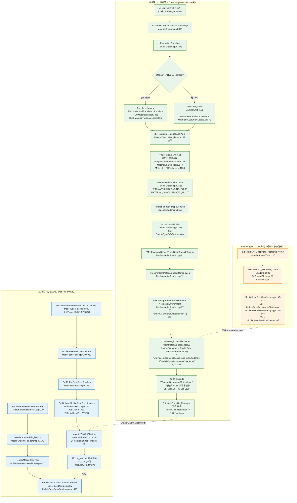

# 移动端 Forward 渲染路径：Shader 获取与材质编译分析

> **引用问题：** `Engine/Source/Runtime/Renderer/Private/MobileBasePass.cpp:207:GetShader` 中获取的具体是什么 Shader？都是 `MobileBasePassPixelShader.usf` 中的或者 `MobileBasePassVertexShader.usf` 的吗？我自定义创建的材质是怎么被获取的呢？怎么被编译的呢？

---

## 一、直接结论

**是的**，`MobileBasePass::GetShaders`（`MobileBasePass.cpp:207`）获取的就是 `MobileBasePassVertexShader.usf` 的 VS 和 `MobileBasePassPixelShader.usf` 的 PS，但这只是"Shader 框架代码"。你自定义材质的节点图会被翻译成 HLSL 代码，以虚拟文件 `/Engine/Generated/Material.ush` 的形式被这两个 usf `#include` 进去，一起编译成最终的 Shader。

---

## 二、GetShaders 获取的具体 Shader

### 2.1 函数签名与位置q
```
Engine/Source/Runtime/Renderer/Private/MobileBasePass.cpp:207
bool MobileBasePass::GetShaders(
    ELightMapPolicyType LightMapPolicyType,
    EMobileLocalLightSetting LocalLightSetting,
    const FMaterial& MaterialResource,
    const FVertexFactoryType* VertexFactoryType,
    bool bEnableSkyLight,
    TShaderRef<TMobileBasePassVSPolicyParamType<FUniformLightMapPolicy>>& VertexShader,
    TShaderRef<TMobileBasePassPSPolicyParamType<FUniformLightMapPolicy>>& PixelShader)
```

### 2.2 获取的 Shader 类型

获取的是 `TMobileBasePassVS` 和 `TMobileBasePassPS` 两个模板类实例化的 Shader，它们继承自 `FMeshMaterialShader`（不是 GlobalShader），定义在：

```
Engine/Source/Runtime/Renderer/Private/MobileBasePassRendering.h
  L212: class TMobileBasePassVS    : public TMobileBasePassVSBaseType<LightMapPolicyType>
  L360: class TMobileBasePassPS    : public TMobileBasePassPSBaseType<LightMapPolicyType>
```

模板参数（排列维度）：

| 维度 | 可选值 |
|------|--------|
| LightMapPolicyType | `TUniformLightMapPolicy<LMP_XXX>`，如 LMP_NO_LIGHTMAP、LMP_MOBILE_DIRECTIONAL_LIGHT_CSM 等 10 种 |
| OutputFormat | LDR_GAMMA_32 / HDR_LINEAR_64 |
| bEnableSkyLight | true / false |
| LocalLightSetting | LOCAL_LIGHTS_DISABLED / LOCAL_LIGHTS_ENABLED / LOCAL_LIGHTS_BUFFER |
| ThinTranslucencyFallback | DEFAULT / SINGLE_SRC_BLENDING 等 |

### 2.3 Shader 与 .usf 文件的绑定关系（关键）

绑定通过 `IMPLEMENT_MATERIAL_SHADER_TYPE` 宏完成，位于：

```
Engine/Source/Runtime/Renderer/Private/MobileBasePassRendering.cpp:134-148
```

宏展开示例：
```cpp
#define IMPLEMENT_MOBILE_SHADING_BASEPASS_LIGHTMAPPED_VERTEX_SHADER_TYPE(LightMapPolicyType, LightMapPolicyName) \
    typedef TMobileBasePassVS<LightMapPolicyType, LDR_GAMMA_32> TMobileBasePassVS##LightMapPolicyName##LDRGamma32; \
    typedef TMobileBasePassVS<LightMapPolicyType, HDR_LINEAR_64> TMobileBasePassVS##LightMapPolicyName##HDRLinear64; \
    IMPLEMENT_MATERIAL_SHADER_TYPE(template<>, TMobileBasePassVS##LightMapPolicyName##LDRGamma32, \
        TEXT("/Engine/Private/MobileBasePassVertexShader.usf"), TEXT("Main"), SF_Vertex); \
    IMPLEMENT_MATERIAL_SHADER_TYPE(template<>, TMobileBasePassVS##LightMapPolicyName##HDRLinear64, \
        TEXT("/Engine/Private/MobileBasePassVertexShader.usf"), TEXT("Main"), SF_Vertex);
```

PS 的宏类似（`MobileBasePassRendering.cpp:140-148`），指向 `MobileBasePassPixelShader.usf`，入口函数均为 `Main`。

**结论确认**：所有 MobileBasePass 的 VS 都绑定到 `MobileBasePassVertexShader.usf`，所有 PS 都绑定到 `MobileBasePassPixelShader.usf`，入口都是 `Main`。在 `MobileBasePassRendering.cpp:161-170` 为 10 种 LightMapPolicy 各调用一次宏，生成数十个具体 Shader 类型。

### 2.4 获取流程（运行时查找）

```
MobileBasePass::GetShaders                         (MobileBasePass.cpp:207)
  └─ GetMobileBasePassShaders<LocalLightSetting>   (MobileBasePass.cpp:168)
       └─ GetUniformMobileBasePassShaders<Policy>  (MobileBasePass.cpp:125)
            ├─ ShaderTypes.AddShaderType<TMobileBasePassVS<...>>()    // L141/L145 填充期望的VS类型
            ├─ AddMobileBasePassPixelShaderTypes<...>(...)            // L98 填充期望的PS类型
            └─ Material.TryGetShaders(ShaderTypes, VFType, Shaders)  // L158 从材质ShaderMap查找
                 ├─ Shaders.TryGetVertexShader(VertexShader)
                 └─ Shaders.TryGetPixelShader(PixelShader)
```

`Material.TryGetShaders` 实现于 `Engine/Source/Runtime/Engine/Private/Materials/MaterialShared.cpp:3624`，它从材质的 `FMaterialShaderMap` 中按 ShaderType 查找已编译好的 `FShader` 实例。

---

## 三、自定义材质如何被"获取"

### 3.1 调用链（移动端 Forward 路径）

```
FMobileSceneRenderer::Render                              (MobileShadingRenderer.cpp:910)
  └─ RenderForwardSinglePass / RenderForwardMultiPass      (MobileShadingRenderer.cpp:1578)
       └─ RenderMobileBasePass(RHICmdList, View, ...)      (MobileBasePassRendering.cpp:470)
            └─ View.ParallelMeshDrawCommandPasses[EMeshPass::BasePass].DispatchDraw(...)
                 ↑ 命令在此前由 FMobileBasePassMeshProcessor 生成
       
FMobileBasePassMeshProcessor::AddMeshBatch                 (MobileBasePass.cpp:867)
  └─ TryAddMeshBatch                                       (MobileBasePass.cpp:851)
       └─ Process                                          (MobileBasePass.cpp:892)
            └─ MobileBasePass::GetShaders(...)             (MobileBasePass.cpp:930)  ← 获取VS/PS
            └─ BuildMeshDrawCommands(...)                  (MobileBasePass.cpp:990)  生成MeshDrawCommand
```

### 3.2 MeshProcessor 的创建

```
CreateMobileBasePassProcessor                             (MobileBasePass.cpp:1151)
  └─ new FMobileBasePassMeshProcessor(EMeshPass::BasePass, ...)
```

`FMobileBasePassMeshProcessor` 构造时固定 `FeatureLevel = ERHIFeatureLevel::ES3_1`（`MobileBasePass.cpp:818`），即移动端。

### 3.3 材质如何匹配到 Shader

`Process` 函数（`MobileBasePass.cpp:892`）依据：
- 材质的 `ShadingModels.IsLit()` → 决定 `LocalLightSetting`
- `Scene->SkyLight` → 决定 `bEnableSkyLight`
- `MobileBasePass::SelectMeshLightmapPolicy(...)` → 决定 `LightMapPolicyType`
- `MeshBatch.VertexFactory->GetType()` → 顶点工厂类型（如 `FLocalVertexFactory`）

把这些参数传给 `MobileBasePass::GetShaders`，从而在该材质的 ShaderMap 中定位到唯一一个编译好的 Shader 实例。

---

## 四、自定义材质如何被编译

### 4.1 编译总流程

```
FMaterial::BeginCompileShaderMap                         (MaterialShared.cpp:3398)
  ├─ Translate(ShaderMapId, ...)                         (MaterialShared.cpp:3373)
  │    ├─ Translate_Legacy → FHLSLMaterialTranslator::Translate + GetMaterialShaderCode
  │    │    （HLSLMaterialTranslator.cpp:2865，旧版生成器）
  │    └─ Translate_New → MaterialEmitHLSL
  │         （MaterialHLSLEmitter.cpp，新版生成器）
  ├─ SetupMaterialEnvironment(...)                       (MaterialShared.cpp:2551) 设置MATERIALBLENDING_*等宏
  └─ NewShaderMap->Compile(this, ...)                    (MaterialShared.cpp:3450)
       └─ FMaterialShaderMap::Compile                    (MaterialShader.cpp:2110)
            └─ SubmitCompileJobs                          (MaterialShader.cpp:1858)
                 └─ 对每个 (ShaderType, VertexFactoryType, PermutationId):
                    FMeshMaterialShaderType::BeginCompileShader   (MeshMaterialShader.cpp:81)
                      └─ PrepareMeshMaterialShaderCompileJob       (MeshMaterialShader.cpp:12)
                           └─ GlobalBeginCompileShader(...ShaderType->GetShaderFilename()...)  (L64)
```

### 4.2 材质 HLSL 代码的生成与注入（关键）

材质节点图翻译成 HLSL 字符串后，存入虚拟路径 `/Engine/Generated/Material.ush`：

**旧版生成器（Legacy）：**
```cpp
// MaterialShared.cpp:3355-3357
const FString MaterialShaderCode = MaterialTranslator.GetMaterialShaderCode();
OutMaterialEnvironment->IncludeVirtualPathToContentsMap.Add(
    TEXT("/Engine/Generated/Material.ush"), MaterialShaderCode);
```

**新版生成器（New HLSL Generator）：**
```cpp
// MaterialHLSLEmitter.cpp:1056
OutMaterialEnvironment->IncludeVirtualPathToContentsMap.Add(
    TEXT("/Engine/Generated/Material.ush"), MoveTemp(MaterialTemplateSource));
```

其中 `MaterialTemplateSource` 由 `GenerateMaterialTemplateHLSL(...)`（`MaterialHLSLEmitter.cpp:1031`）基于 `MaterialTemplate.ush` 模板填充参数生成。模板加载自 `/Engine/Private/MaterialTemplate.ush`（`MaterialSourceTemplate.cpp:59`）。

### 4.3 编译时的文件包含关系

`MobileBasePassPixelShader.usf:109` 与 `MobileBasePassVertexShader.usf:14` 均包含：
```hlsl
#include "/Engine/Generated/Material.ush"
```

编译时该虚拟路径被替换为材质生成的 HLSL 代码。错误回溯时（`ShaderCompiler.cpp:3327-3333`）会将 `/Engine/Generated/Material.ush` 重映射回 `/Engine/Private/MaterialTemplate.ush` 便于定位。

完整的 include 链（以 PS 为例）：
```
MobileBasePassPixelShader.usf
  ├─ Common.ush
  ├─ /Engine/Generated/Material.ush        ← 你的自定义材质HLSL代码注入点
  │    └─ (基于 MaterialTemplate.ush 填充)
  ├─ MobileBasePassCommon.ush
  ├─ /Engine/Generated/VertexFactory.ush   ← 顶点工厂代码注入点
  ├─ LightmapCommon.ush
  ├─ MobileLightingCommon.ush
  ├─ ShadingModelsMaterial.ush
  └─ ...
```

### 4.4 Shader 排列的筛选

并非所有排列都会编译，通过 `ShouldCompilePermutation` 过滤：
- `TMobileBasePassVS::ShouldCompilePermutation`（`MobileBasePassRendering.h:217`）：检查 `IsMobilePlatform` + LightMapPolicy
- `TMobileBasePassPS::ShouldCompilePermutation`（`MobileBasePassRendering.h:365`）：综合判断 skylight、local light、deferred shading、translucent 等
- `FMaterial::ShouldCache`（`MaterialShared.cpp:3511`）：材质层级的过滤

### 4.5 编译环境的设置

每个 Shader 类的 `ModifyCompilationEnvironment` 设置 #define：
- `TMobileBasePassPS::ModifyCompilationEnvironment`（`MobileBasePassRendering.h:402`）：设置 `ENABLE_SKY_LIGHT`、`ENABLE_CLUSTERED_LIGHTS`、`MERGED_LOCAL_LIGHTS_MOBILE`、`USE_SHADOWMASKTEXTURE` 等
- `FMaterial::SetupMaterialEnvironment`（`MaterialShared.cpp:2551`）：设置 `MATERIALBLENDING_SOLID/MASKED/TRANSLUCENT` 等
- `MobileBasePassModifyCompilationEnvironment`（`MobileBasePassRendering.cpp:193`）：设置 `IS_BASE_PASS`、`IS_MOBILE_BASE_PASS`、`OUTPUT_MOBILE_HDR` 等

### 4.6 编译结果存储

编译完成后通过 `FMeshMaterialShaderType::FinishCompileShader`（`MeshMaterialShader.cpp:157`）构造 `FShader` 实例，存入 `FMeshMaterialShaderMap`（按 VertexFactoryType 分组），最终挂在 `FMaterialShaderMap` 上。运行时 `TryGetShaders` 即从这里按 ShaderType 查找。

---

## 五、移动端 Forward 渲染路径完整调用链

```
FMobileSceneRenderer::Render                                     (MobileShadingRenderer.cpp:910)
  ├─ InitViews                                                   (MobileShadingRenderer.cpp:1033)
  │    └─ 生成 ParallelMeshDrawCommandPasses[EMeshPass::BasePass]
  │         └─ FMobileBasePassMeshProcessor::AddMeshBatch        (MobileBasePass.cpp:867)
  │              └─ TryAddMeshBatch → Process                    (MobileBasePass.cpp:851/892)
  │                   └─ MobileBasePass::GetShaders              (MobileBasePass.cpp:930 → 207)
  │                        └─ Material.TryGetShaders             (MaterialShared.cpp:3624)
  │                   └─ BuildMeshDrawCommands                   (MobileBasePass.cpp:990)
  ├─ RenderForwardSinglePass                                     (MobileShadingRenderer.cpp:1578)
  │    └─ RenderMobileBasePass                                   (MobileBasePassRendering.cpp:470)
  │         └─ ParallelMeshDrawCommandPasses[BasePass].DispatchDraw  (L478)
  └─ ... (translucency, fog, postprocess)
```

材质编译期（独立于渲染帧）：
```
UMaterial::RecompileShaders / 资源加载触发
  └─ FMaterial::BeginCompileShaderMap                           (MaterialShared.cpp:3398)
       └─ Translate → 生成 /Engine/Generated/Material.ush
       └─ FMaterialShaderMap::Compile                           (MaterialShader.cpp:2110)
            └─ SubmitCompileJobs                                (MaterialShader.cpp:1858)
                 └─ FMeshMaterialShaderType::BeginCompileShader  (MeshMaterialShader.cpp:81)
                      └─ GlobalBeginCompileShader
                           (SourceFilename = MobileBasePassPixelShader.usf / VertexShader.usf)
                           (MaterialEnvironment 包含 /Engine/Generated/Material.ush)
                 → GShaderCompilingManager 异步编译
                 → FinishCompileShader 存入 ShaderMap
```

---

## 六、关键文件索引

| 文件 | 作用 |
|------|------|
| `Engine/Source/Runtime/Renderer/Private/MobileBasePass.cpp` | MeshProcessor、GetShaders 运行时查找 |
| `Engine/Source/Runtime/Renderer/Private/MobileBasePassRendering.h` | TMobileBasePassVS/PS 类定义、ShouldCompilePermutation |
| `Engine/Source/Runtime/Renderer/Private/MobileBasePassRendering.cpp` | IMPLEMENT_MATERIAL_SHADER_TYPE 宏绑定 .usf、RenderMobileBasePass |
| `Engine/Source/Runtime/Renderer/Private/MobileShadingRenderer.cpp` | FMobileSceneRenderer::Render 主入口 |
| `Engine/Shaders/Private/MobileBasePassVertexShader.usf` | VS 入口 Main，include Material.ush |
| `Engine/Shaders/Private/MobileBasePassPixelShader.usf` | PS 入口 Main，include Material.ush |
| `Engine/Source/Runtime/Engine/Private/Materials/MaterialShared.cpp` | FMaterial::TryGetShaders、BeginCompileShaderMap、Translate |
| `Engine/Source/Runtime/Engine/Private/Materials/MaterialShader.cpp` | FMaterialShaderMap::Compile、SubmitCompileJobs |
| `Engine/Source/Runtime/Engine/Private/Materials/MeshMaterialShader.cpp` | FMeshMaterialShaderType::BeginCompileShader |
| `Engine/Source/Runtime/Engine/Private/Materials/HLSLMaterialTranslator.cpp` | 旧版材质 HLSL 生成 |
| `Engine/Source/Runtime/Engine/Private/Materials/MaterialHLSLEmitter.cpp` | 新版材质 HLSL 生成 |
| `Engine/Source/Runtime/Engine/Private/Materials/MaterialSourceTemplate.cpp` | MaterialTemplate.ush 模板加载 |
| `Engine/Source/Runtime/Engine/Public/MaterialShaderType.h` | IMPLEMENT_MATERIAL_SHADER_TYPE 宏定义 |
| `Engine/Source/Runtime/RenderCore/Public/Shader.h:1620` | IMPLEMENT_SHADER_TYPE 宏定义 |

---

# 附录：用户材质如何被 #include 进 MobileBasePass 两个 .usf（以 M_MatTest Unlit 为例）

> **引用问题：** 文档正文没有指出"用户创建的材质（例如一个名为 `M_MatTest` 的 Unlit 材质）是如何被 `#include` 进 `MobileBasePassVertexShader.usf` 和 `MobileBasePassPixelShader.usf` 的"。程序中如何加载我的材质并编译到这两个文件中？只看 Mobile 的 Forward 路径调用链，需要代码证明。

---

## A.1 直接结论

`M_MatTest` 材质节点图并不会"物理"写进这两个 `.usf` 文件，而是：

1. 编译期，材质编辑器把 `M_MatTest` 的节点图翻译成一段 HLSL 字符串（基于 `MaterialTemplate.ush` 模板填充）；
2. 这段字符串被注册到一个**虚拟文件路径** `/Engine/Generated/Material.ush` 上，存入 `FShaderCompilerEnvironment::IncludeVirtualPathToContentsMap`；
3. 而 `MobileBasePassVertexShader.usf:14` 和 `MobileBasePassPixelShader.usf:109` 里都写着 `#include "/Engine/Generated/Material.ush"`；
4. 编译器预处理这两个 `.usf` 主文件时，遇到该 `#include`，就用上一步注册的材质 HLSL 字符串替换它——于是 `M_MatTest` 的代码就"被包含"进去了；
5. 运行期，`MobileBasePass::GetShaders` 通过 `Material.TryGetShaders` 从该材质已编译好的 `FMaterialShaderMap` 中按 ShaderType 取出 VS/PS 实例。

换言之：**两个 `.usf` 是"框架代码壳子"，`/Engine/Generated/Material.ush` 是"材质代码注入点"，`#include` 是把两者粘合起来的胶水。**

---

## A.2 #include 注入点（代码证据）

### A.2.1 像素着色器中的 #include

`Engine/Shaders/Private/MobileBasePassPixelShader.usf:108-109`：
```hlsl
108: #include "SHCommon.ush"
109: #include "/Engine/Generated/Material.ush"
```

### A.2.2 顶点着色器中的 #include

`Engine/Shaders/Private/MobileBasePassVertexShader.usf:9-14`：
```hlsl
 9: #include "Common.ush"
10: 
11: // Reroute MobileSceneTextures uniform buffer references to the base pass uniform buffer
12: #define MobileSceneTextures MobileBasePass.SceneTextures
13: 
14: #include "/Engine/Generated/Material.ush"
```

> 这两个 `#include "/Engine/Generated/Material.ush"` 就是 `M_MatTest` 代码进入 MobileBasePass VS/PS 的**唯一入口**。注意 `/Engine/Generated/Material.ush` 是一个**虚拟路径**，磁盘上并没有这个文件，它的内容由材质编译器在内存中生成（见 A.3）。

---

## A.3 M_MatTest 的 HLSL 如何生成并填入 `/Engine/Generated/Material.ush`

材质翻译有新旧两条路径，由 `FMaterial::Translate` 分发（`MaterialShared.cpp:3373-3388`）：

```cpp
// MaterialShared.cpp:3373
bool FMaterial::Translate(...)
{
    if (InShaderMapId.bUsingNewHLSLGenerator)
    {
        return Translate_New(...);     // L3382 新版生成器
    }
    else
    {
        return Translate_Legacy(...);  // L3386 旧版生成器
    }
}
```

### A.3.1 旧版生成器（Legacy）—— `Translate_Legacy`

`MaterialShared.cpp:3347-3359`：
```cpp
3347: FHLSLMaterialTranslator MaterialTranslator(this, ...);
3348: const bool bSuccess = MaterialTranslator.Translate();
3349: if (bSuccess)
3350: {
3351:     OutMaterialEnvironment = new FSharedShaderCompilerEnvironment();
3352:     OutMaterialEnvironment->TargetPlatform = InTargetPlatform;
3353:     MaterialTranslator.GetMaterialEnvironment(InPlatform, *OutMaterialEnvironment);
3354:     // ↑ 取出材质环境（#define 等）
3355:     const FString MaterialShaderCode = MaterialTranslator.GetMaterialShaderCode();
3356:     // ↑ 把 M_MatTest 节点图翻译成 HLSL 字符串
3357:     OutMaterialEnvironment->IncludeVirtualPathToContentsMap.Add(
3358:         TEXT("/Engine/Generated/Material.ush"), MaterialShaderCode);
3359:     // ↑ 关键：把材质 HLSL 注册到虚拟路径 /Engine/Generated/Material.ush
3360: }
```

`FHLSLMaterialTranslator::GetMaterialShaderCode`（`HLSLMaterialTranslator.cpp:2865-2875`）内部用 `MaterialTemplate.ush` 作为模板填充参数后返回最终 HLSL：
```cpp
2865: FString FHLSLMaterialTranslator::GetMaterialShaderCode()
2866: {
2867:     // use "/Engine/Private/MaterialTemplate.ush" to create the functions ...
2868:     int32 MaterialTemplateLineNumberNew;
2869:     FStringTemplateResolver Resolver = FMaterialSourceTemplate::Get().BeginResolve(
2870:         GetShaderPlatform(), &MaterialTemplateLineNumberNew);
2871:     Resolver.SetParameterMap(&MaterialSourceTemplateParams);
2872:     MaterialSourceTemplateParams.Add({TEXT("line_number"), ...});
2874:     return Resolver.Finalize();
2875: }
```

`MaterialTemplate.ush` 模板由 `FMaterialSourceTemplate::Preload` 从磁盘加载（`MaterialSourceTemplate.cpp:59`）：
```cpp
58: FString MaterialTemplateString;
59: LoadShaderSourceFileChecked(TEXT("/Engine/Private/MaterialTemplate.ush"),
60:     ShaderPlatform, MaterialTemplateString);
```

### A.3.2 新版生成器（New HLSL Generator）—— `Translate_New`

`MaterialShared.cpp:3362-3371`：
```cpp
3362: bool FMaterial::Translate_New(...)
3369: {
3370:     return MaterialEmitHLSL(TargetParams, InStaticParameters, *this,
3371:         OutCompilationOutput, OutMaterialEnvironment);
3372: }
```

`MaterialEmitHLSL` 内部（`MaterialHLSLEmitter.cpp:1019-1056`）：
```cpp
1019:     FString MaterialTemplateSource;
1020:     {
1021:         const TCHAR* InputPixelCodePhase0[2] = { ... };
1026:         const TCHAR* InputPixelCodePhase1[2] = { ... };
1031:         MaterialTemplateSource = GenerateMaterialTemplateHLSL(
1032:             InCompilerTarget.ShaderPlatform, InOutMaterial, EmitContext,
1033:             Declarations.ToString(), SharedCode.ToString(),
1034:             VertexCode.ToString(),
1035:             InputPixelCodePhase0, InputPixelCodePhase1,
1036:             SubsurfaceProfileShaderCode, OutCompilationOutput);
1040:     }
...
1056:     OutMaterialEnvironment->IncludeVirtualPathToContentsMap.Add(
1057:         TEXT("/Engine/Generated/Material.ush"), MoveTemp(MaterialTemplateSource));
```

`GenerateMaterialTemplateHLSL`（`MaterialHLSLEmitter.cpp:57`）同样基于 `MaterialTemplate.ush` 模板（通过 `FMaterialSourceTemplate::Get().BeginResolve`，L75）填充 `M_MatTest` 的各属性代码后产出最终 HLSL。

> **结论**：无论新旧生成器，`M_MatTest` 的节点图最终都变成一段 HLSL 字符串，并以键 `/Engine/Generated/Material.ush` 存入 `IncludeVirtualPathToContentsMap`。这就是 A.2 中两个 `.usf` 里 `#include` 能"命中"的内容来源。

---

## A.4 编译期：材质环境如何与 .usf 主文件汇合

### A.4.1 入口：BeginCompileShaderMap

`MaterialShared.cpp:3398-3450`：
```cpp
3398: bool FMaterial::BeginCompileShaderMap(...)
3409: {
3416:     FMaterialCompilationOutput NewCompilationOutput;
3417:     TRefCountPtr<FSharedShaderCompilerEnvironment> MaterialEnvironment;
3418:     bSuccess = Translate(ShaderMapId, StaticParameterSet, Platform,
3419:         TargetPlatform, NewCompilationOutput, MaterialEnvironment);
        // ↑ A.3 在这里完成：MaterialEnvironment 现已包含 /Engine/Generated/Material.ush 内容
...
3427:         SetupMaterialEnvironment(Platform, *UniformBufferStruct,
3428:             NewCompilationOutput.UniformExpressionSet, *MaterialEnvironment);
        // ↑ 设置 MATERIALBLENDING_SOLID / MATERIAL_SHADINGMODEL_UNLIT 等 #define
...
3450:     NewShaderMap->Compile(this, ShaderMapId, MaterialEnvironment,
3451:         NewCompilationOutput, Platform, PrecompileMode);
        // ↑ 把含材质代码的 MaterialEnvironment 交给 ShaderMap 编译
3452: }
```

### A.4.2 提交编译任务：SubmitCompileJobs

`MaterialShader.cpp:1858-1927`：
```cpp
1858: int32 FMaterialShaderMap::SubmitCompileJobs(...)
1861: {
...
1899:     for (const FMeshMaterialShaderMapLayout& MeshLayout : Layout.MeshShaderMaps)
1901:     {
...
1912:         for (const FShaderLayoutEntry& Shader : MeshLayout.Shaders)
1913:         {
1914:             FMeshMaterialShaderType* ShaderType =
1915:                 static_cast<FMeshMaterialShaderType*>(Shader.ShaderType);
1916:             if (!Material->ShouldCache(ShaderPlatform, ShaderType,
1917:                 MeshLayout.VertexFactoryType)) { continue; }
...
        // 对每个 (ShaderType, VertexFactoryType, PermutationId) 提交编译
```

### A.4.3 单个 Shader 编译：BeginCompileShader（关键粘合点）

`MeshMaterialShader.cpp:12-71`：
```cpp
12: static void PrepareMeshMaterialShaderCompileJob(...,
21:     FShaderCompileJob* NewJob)
22: {
23:     const FMeshMaterialShaderType* ShaderType = Key.ShaderType->AsMeshMaterialShaderType();
24:     const FVertexFactoryType* VertexFactoryType = Key.VFType;
25: 
27:     NewJob->Input.SharedEnvironment = MaterialEnvironment;
28:     // ↑↑↑ 关键：把含 /Engine/Generated/Material.ush 的材质环境设为共享环境
29:     //    预处理器解析 .usf 里的 #include 时会查这个 SharedEnvironment
...
58:     ::GlobalBeginCompileShader(
59:         DebugGroupName,
60:         VertexFactoryType,
61:         ShaderType,
62:         ShaderPipeline,
63:         Key.PermutationId,
64:         ShaderType->GetShaderFilename(),
65:         // ↑ 返回 "/Engine/Private/MobileBasePassPixelShader.usf" 或
66:         //   "/Engine/Private/MobileBasePassVertexShader.usf"
67:         ShaderType->GetFunctionName(),   // "Main"
68:         FShaderTarget(ShaderType->GetFrequency(), Platform),
69:         NewJob->Input,
70:         bAllowDevelopmentShaderCompile,
71:         DebugDescription, DebugExtension);
72: }
```

`BeginCompileShader` 的外层入口在 `MeshMaterialShader.cpp:81-102`：
```cpp
81: void FMeshMaterialShaderType::BeginCompileShader(...)
94: {
96:     FShaderCompileJob* NewJob = GShaderCompilingManager->PrepareShaderCompileJob(
97:         ShaderMapJobId, FShaderCompileJobKey(this, VertexFactoryType, PermutationId), Priority);
98:     if (NewJob)
99:     {
100:         PrepareMeshMaterialShaderCompileJob(..., NewJob);  // L99 调用上面的粘合函数
101:         NewJobs.Add(FShaderCommonCompileJobPtr(NewJob));
102:     }
103: }
```

> **粘合原理**：`GlobalBeginCompileShader` 以 `MobileBasePassPixelShader.usf`（或 VS）为**主源文件**启动编译；同时 `NewJob->Input.SharedEnvironment = MaterialEnvironment`（L27）把材质环境（含 `/Engine/Generated/Material.ush` 的字符串内容）挂到该 Job 上。预处理阶段遇到 `#include "/Engine/Generated/Material.ush"` 时，编译器从 `SharedEnvironment->IncludeVirtualPathToContentsMap` 里取出 `M_MatTest` 的 HLSL 字符串做文本替换——`M_MatTest` 的代码就此"被包含"进 VS/PS。

### A.4.4 .usf 路径是怎么和 ShaderType 绑定的

通过 `IMPLEMENT_MATERIAL_SHADER_TYPE` 宏（`MaterialShaderType.h:18-25`）→ `IMPLEMENT_SHADER_TYPE`（`Shader.h:1620-1638`），把 `SourceFilename` 存入静态 `FShaderType`（`Shader.h:1464` `const TCHAR* SourceFilename;`，`Shader.h:1407` `GetShaderFilename()`）。

绑定发生在 `MobileBasePassRendering.cpp:134-148`：
```cpp
134: #define IMPLEMENT_MOBILE_SHADING_BASEPASS_LIGHTMAPPED_VERTEX_SHADER_TYPE(LightMapPolicyType,LightMapPolicyName) \
135:     typedef TMobileBasePassVS<LightMapPolicyType, LDR_GAMMA_32> TMobileBasePassVS##LightMapPolicyName##LDRGamma32; \
136:     typedef TMobileBasePassVS<LightMapPolicyType, HDR_LINEAR_64> TMobileBasePassVS##LightMapPolicyName##HDRLinear64; \
137:     IMPLEMENT_MATERIAL_SHADER_TYPE(template<>, TMobileBasePassVS##LightMapPolicyName##LDRGamma32, \
138:         TEXT("/Engine/Private/MobileBasePassVertexShader.usf"), TEXT("Main"), SF_Vertex); \
138:     IMPLEMENT_MATERIAL_SHADER_TYPE(template<>, TMobileBasePassVS##LightMapPolicyName##HDRLinear64, \
139:         TEXT("/Engine/Private/MobileBasePassVertexShader.usf"), TEXT("Main"), SF_Vertex);
...
145:     IMPLEMENT_MATERIAL_SHADER_TYPE(template<>, TMobileBasePassPS##...##LDRGamma32##..., \
146:         TEXT("/Engine/Private/MobileBasePassPixelShader.usf"), TEXT("Main"), SF_Pixel); \
148:     IMPLEMENT_MATERIAL_SHADER_TYPE(template<>, TMobileBasePassPS##...##HDRLinear64##..., \
149:         TEXT("/Engine/Private/MobileBasePassPixelShader.usf"), TEXT("Main"), SF_Pixel);
```

随后在 `MobileBasePassRendering.cpp:161-170` 对 10 种 LightMapPolicy 各调用一次宏，实例化出数十个具体 ShaderType，每个都绑到这两个 `.usf`、入口 `Main`。

---

## A.5 运行期：M_MatTest 的 Shader 如何被取出（Mobile Forward 路径）

### A.5.1 渲染帧调用链

```
FMobileSceneRenderer::Render                  (MobileShadingRenderer.cpp:910)
  └─ RenderForwardSinglePass                   (MobileShadingRenderer.cpp:1578)
       └─ RenderMobileBasePass                 (MobileBasePassRendering.cpp:470)
            └─ View.ParallelMeshDrawCommandPasses[EMeshPass::BasePass].DispatchDraw
                                               (MobileBasePassRendering.cpp:478)
```

`RenderForwardSinglePass` 调用 `RenderMobileBasePass` 的证据（`MobileShadingRenderer.cpp:1609`）：
```cpp
1609: RenderMobileBasePass(RHICmdList, View, &PassParameters->InstanceCullingDrawParams);
```

`RenderMobileBasePass` 发起绘制（`MobileBasePassRendering.cpp:478`）：
```cpp
478: View.ParallelMeshDrawCommandPasses[EMeshPass::BasePass].DispatchDraw(
       nullptr, RHICmdList, InstanceCullingDrawParams);
```

### A.5.2 MeshDrawCommand 的生成（编译期已绑好 Shader）

`ParallelMeshDrawCommandPasses[BasePass]` 里的命令在 `InitViews` 阶段由 `FMobileBasePassMeshProcessor` 生成。核心在 `Process`（`MobileBasePass.cpp:892-940`）：
```cpp
892: bool FMobileBasePassMeshProcessor::Process(...)
905: {
906:     TMeshProcessorShaders<
907:         TMobileBasePassVSPolicyParamType<FUniformLightMapPolicy>,
908:         TMobileBasePassPSPolicyParamType<FUniformLightMapPolicy>> BasePassShaders;
...
930:     if (!MobileBasePass::GetShaders(
931:         LightMapPolicyType,
932:         LocalLightSetting,
933:         MaterialResource,
934:         MeshBatch.VertexFactory->GetType(),
935:         bEnableSkyLight,
936:         BasePassShaders.VertexShader,
937:         BasePassShaders.PixelShader))
938:     {
939:         return false;
940:     }
```

### A.5.3 GetShaders → TryGetShaders（从材质 ShaderMap 取已编译实例）

`MobileBasePass::GetShaders`（`MobileBasePass.cpp:207-254`）按 `LocalLightSetting` 分发到 `GetMobileBasePassShaders`（L168）→ `GetUniformMobileBasePassShaders`（L125）：

`MobileBasePass.cpp:125-166`：
```cpp
125: bool GetUniformMobileBasePassShaders(...)
132: {
138:     FMaterialShaderTypes ShaderTypes;
139:     if (bIsMobileHDR)
140:     {
141:         ShaderTypes.AddShaderType<TMobileBasePassVS<TUniformLightMapPolicy<Policy>, HDR_LINEAR_64>>();
142:     }
143:     else
144:     {
145:         ShaderTypes.AddShaderType<TMobileBasePassVS<TUniformLightMapPolicy<Policy>, LDR_GAMMA_32>>();
146:     }
148:     switch (ThinTranslucentFallback) { ... }  // 填充 PS 类型
...
157:     FMaterialShaders Shaders;
158:     if (!Material.TryGetShaders(ShaderTypes, VertexFactoryType, Shaders))
159:     {
160:         return false;
161:     }
163:     Shaders.TryGetVertexShader(VertexShader);
164:     Shaders.TryGetPixelShader(PixelShader);
165:     return true;
166: }
```

`Material.TryGetShaders`（`MaterialShared.cpp:3624`）从该材质的 `FMaterialShaderMap`（按 VertexFactoryType 分组的 `FMeshMaterialShaderMap`）中按 ShaderType 查找 A.4 编译好并缓存的 `FShader` 实例：
```cpp
3624: bool FMaterial::TryGetShaders(const FMaterialShaderTypes& InTypes,
3625:     const FVertexFactoryType* InVertexFactoryType, FMaterialShaders& OutShaders) const
3626: {
3630:     const FMaterialShaderMap* ShaderMap = bIsInGameThread ? GameThreadShaderMap : RenderingThreadShaderMap;
...
3641:     const FShaderMapContent* ShaderMapContent = InVertexFactoryType
3642:         ? static_cast<const FShaderMapContent*>(ShaderMap->GetMeshShaderMap(InVertexFactoryType))
3643:         : static_cast<const FShaderMapContent*>(ShaderMap->GetContent());
```

> **结论**：运行期并不重新编译，只是按 ShaderType 在 `M_MatTest` 的 ShaderMap 里查表取实例。查到的 VS/PS 实例就是 A.4 用 `MobileBasePassVertexShader.usf` / `MobileBasePassPixelShader.usf` + `/Engine/Generated/Material.ush`（`M_MatTest` 代码）编译出来的那个。

---

## A.6 Unlit 材质（M_MatTest）的特殊处理

### A.6.1 编译期 #define

`FMaterial::SetupMaterialEnvironment`（`MaterialShared.cpp:2551-2585`）根据 BlendMode 设 `MATERIALBLENDING_*`；`M_MatTest` 若是 Opaque Unlit，会走到：
```cpp
2571:     case BLEND_Opaque:
2572:     case BLEND_Masked:
2573:     {
2577:         if (!WritesEveryPixel())
2578:         {
2579:             SET_SHADER_DEFINE(OutEnvironment, MATERIALBLENDING_MASKED, 1);
2580:         }
2581:         else
2582:         {
2583:             SET_SHADER_DEFINE(OutEnvironment, MATERIALBLENDING_SOLID, 1);
2584:         }
```

`MATERIAL_SHADINGMODEL_UNLIT` 等 shading model 宏同样在该函数内根据材质属性设置。这些 #define 通过 `SharedEnvironment` 传给编译器，影响 `.usf` 中 `#if MATERIAL_SHADINGMODEL_UNLIT` 分支的裁剪。

### A.6.2 排列筛选（少编译很多排列）

`TMobileBasePassPS::ShouldCompilePermutation`（`MobileBasePassRendering.h:365-399`）：
```cpp
365: static bool ShouldCompilePermutation(const FMeshMaterialShaderPermutationParameters& Parameters)
366: {
370:     const bool bIsLit = Parameters.MaterialParameters.ShadingModels.IsLit();
372:     const bool bShouldCacheBySkylight = !bEnableSkyLight || bIsLit;
374:     if (bIsLit && !MobileBasePass::UseSkylightPermutation(bEnableSkyLight, ...))
375:     {
376:         return false;   // Unlit 这里 bIsLit=false，不会进这个 return false
377:     }
...
393:     const bool bShouldCacheByLocalLights = !bEnableLocalLights || (bIsLit && ...);
        // Unlit: bEnableLocalLights 通常为 false（见 Process L919 的 ShadingModels.IsLit() 判断），
        //        所以 bShouldCacheByLocalLights=true，但 LocalLightSetting=LOCAL_LIGHTS_DISABLED
395:     return TMobileBasePassPSBaseType<LightMapPolicyType>::ShouldCompilePermutation(Parameters) &&
396:             ShouldCacheShaderByPlatformAndOutputFormat(Parameters.Platform, OutputFormat) &&
397:             bShouldCacheBySkylight &&
398:             bShouldCacheByLocalLights &&
399:             ShouldCacheShaderForColorTransmittanceFallback(...);
400: }
```

`Process` 中决定 `LocalLightSetting`（`MobileBasePass.cpp:918-928`）：
```cpp
918: EMobileLocalLightSetting LocalLightSetting = EMobileLocalLightSetting::LOCAL_LIGHTS_DISABLED;
919: if (Scene && PrimitiveSceneProxy && ShadingModels.IsLit())   // Unlit 不进此分支
920: {
921:     if (!bPassUsesDeferredShading && (...))
926:         LocalLightSetting = GetMobileForwardLocalLightSetting(...);
927: }
```
Unlit 因为 `IsLit()` 为 false，`LocalLightSetting` 保持 `LOCAL_LIGHTS_DISABLED`，从而只编译不带局部光的 PS 排列。

### A.6.3 PS .usf 中 Unlit 分支

`MobileBasePassPixelShader.usf` 多处用 `#if !MATERIAL_SHADINGMODEL_UNLIT` 跳过光照计算，例如：
```hlsl
853: #if !MATERIAL_SHADINGMODEL_UNLIT
854:     AccumulateDirectionalLighting(...);
855: #endif
```
```hlsl
993: #if !MATERIAL_SHADINGMODEL_UNLIT
994:     half3 Color = DirectLighting.TotalLight;
995: #else
996:     half3 Color = 0.0f;
997: #endif
```
Unlit 最终颜色只取 Emissive（`MobileBasePassPixelShader.usf:1010-1012`）：
```hlsl
1010: half3 Emissive = GetMaterialEmissive(PixelMaterialInputs);
1012: Color += Emissive;
```
而 `GetMaterialEmissive` 的实现就来自 A.3 注入的 `/Engine/Generated/Material.ush`（即 `M_MatTest` 节点图翻译出的 HLSL）。

---

## A.7 完整流程 Mermaid 图



---

## A.8 一句话总结

> `M_MatTest` 的节点图 →（`Translate`）→ HLSL 字符串 →（`IncludeVirtualPathToContentsMap`）→ 虚拟文件 `/Engine/Generated/Material.ush` →（`MobileBasePassVertexShader.usf:14` / `MobileBasePassPixelShader.usf:109` 的 `#include`）→ 与 `.usf` 框架代码合并编译 → 存入材质 ShaderMap →（运行期 `MobileBasePass::GetShaders` → `Material.TryGetShaders`）→ 取出 VS/PS 实例供 `DispatchDraw` 使用。

---

# 附录 B：已编译 Shader 如何与当前 Mesh 对应（Mobile Forward 路径）

> **引用问题：** 也就是说：`MaterialShared.cpp:3398 BeginCompileShaderMap` 先执行，在 `MobileBasePass.cpp:930 if (!MobileBasePass::GetShaders(...))` 时这些 Shader 就已经编译好了，那么预先编译好的 Shader 在 `GetShaders` 时是怎么与当前 Mesh 进行对应的？只寻找 Mobile 的 Forward 路径调用链，需要代码证明。

---

## B.1 直接结论

在 Mobile Forward BasePass 中，**当前 Mesh 与已编译 Shader 的对应关系不是靠 Mesh 名字，也不是靠材质名字符串，而是靠下面几个 key 共同匹配**：

1. `MeshBatch.MaterialRenderProxy` → 当前 Mesh 使用的材质代理；
2. `MaterialRenderProxy->GetMaterialNoFallback(FeatureLevel)` → 当前 Mesh 的 `FMaterial`；
3. `MeshBatch.VertexFactory->GetType()` → 当前 Mesh 的顶点工厂类型，例如 `FLocalVertexFactory`、Landscape VF、SkeletalMesh VF 等；
4. `LightMapPolicyType` → 当前 Mesh 的光照/LightMap 策略；
5. `LocalLightSetting`、`bEnableSkyLight`、`OutputFormat`、`ThinTranslucencyFallback` → Mobile BasePass 的排列维度；
6. 由这些维度组成的 `TMobileBasePassVS/PS` ShaderType；
7. `Material.TryGetShaders(ShaderTypes, VertexFactoryType, Shaders)` 在**当前材质的 ShaderMap**中，进入**当前 VertexFactoryType 对应的 MeshShaderMap**，按 ShaderType + PermutationId 查找已编译的 `FShader`。

所以对应关系可以简化为：

```text
当前 Mesh
  → MeshBatch.MaterialRenderProxy
  → 当前 FMaterial / FMaterialShaderMap
  → MeshBatch.VertexFactory->GetType()
  → ShaderMap->GetMeshShaderMap(VertexFactoryType)
  → GetShader(TMobileBasePassVS/PS, PermutationId)
  → 当前 Mesh 使用的 VS/PS
```

---

## B.2 当前 Mesh 是怎么进入 Mobile BasePass Processor 的

### B.2.1 静态 Mesh：创建 FStaticMeshBatch 并缓存 MeshDrawCommand

组件加入场景时，Proxy 会把静态网格提交给 `FBatchingSPDI::DrawMesh`，这里生成 `FStaticMeshBatch` 并保留它的 `MaterialRenderProxy`、`VertexFactory` 等数据。

`PrimitiveSceneInfo.cpp:105-150`：
```cpp
105: virtual void DrawMesh(const FMeshBatch& Mesh, float ScreenSize) final override
106: {
107:     if (Mesh.HasAnyDrawCalls())
108:     {
111:         FPrimitiveSceneProxy* PrimitiveSceneProxy = PrimitiveSceneInfo->Proxy;
112:         const ERHIFeatureLevel::Type FeatureLevel = PrimitiveSceneInfo->Scene->GetFeatureLevel();
114:         if (!Mesh.Validate(PrimitiveSceneProxy, FeatureLevel))
115:         {
116:             return;
117:         }
119:         FStaticMeshBatch* StaticMesh = new(PrimitiveSceneInfo->StaticMeshes) FStaticMeshBatch(
120:             PrimitiveSceneInfo,
121:             Mesh,
122:             CurrentHitProxy ? CurrentHitProxy->Id : FHitProxyId()
123:         );
125:         StaticMesh->PreparePrimitiveUniformBuffer(PrimitiveSceneProxy, FeatureLevel);
129:         const FMaterial& Material = Mesh.MaterialRenderProxy->GetIncompleteMaterialWithFallback(FeatureLevel);
138:         FStaticMeshBatchRelevance* StaticMeshRelevance = new(PrimitiveSceneInfo->StaticMeshRelevances) FStaticMeshBatchRelevance(
139:             *StaticMesh,
140:             ScreenSize,
...
149:             FeatureLevel
150:         );
```

`AddStaticMeshes` 会调用 `Proxy->DrawStaticElements(&BatchingSPDI)`，并在需要时缓存 MeshDrawCommand：

`PrimitiveSceneInfo.cpp:1303-1356`：
```cpp
1303: void FPrimitiveSceneInfo::AddStaticMeshes(..., bool bCacheMeshDrawCommands)
1304: {
1308:     ParallelForTemplate(SceneInfos.Num(), [Scene, &SceneInfos](int32 Index)
1309:     {
1312:         FPrimitiveSceneInfo* SceneInfo = SceneInfos[Index];
1314:         FBatchingSPDI BatchingSPDI(SceneInfo);
1316:         SceneInfo->Proxy->DrawStaticElements(&BatchingSPDI);
1317:         SceneInfo->StaticMeshes.Shrink();
1321:         check(SceneInfo->StaticMeshRelevances.Num() == SceneInfo->StaticMeshes.Num());
1322:     });
...
1353:     if (bCacheMeshDrawCommands)
1354:     {
1355:         CacheMeshDrawCommands(Scene, SceneInfos);
1356:         CacheNaniteMaterialBins(Scene, SceneInfos);
```

`CacheMeshDrawCommands` 对支持缓存的静态 Mesh，按 Pass 创建 MeshPassProcessor，并调用 `AddMeshBatch`：

`PrimitiveSceneInfo.cpp:476-500`：
```cpp
476: for (int32 PassIndex = 0; PassIndex < EMeshPass::Num; PassIndex++)
477: {
478:     const EShadingPath ShadingPath = GetFeatureLevelShadingPath(Scene->GetFeatureLevel());
479:     EMeshPass::Type PassType = (EMeshPass::Type)PassIndex;
481:     if ((FPassProcessorManager::GetPassFlags(ShadingPath, PassType) & EMeshPassFlags::CachedMeshCommands) != EMeshPassFlags::None)
482:     {
483:         FCachedPassMeshDrawListContext::FMeshPassScope MeshPassScope(DrawListContext, PassType);
485:         FMeshPassProcessor* PassMeshProcessor = FPassProcessorManager::CreateMeshPassProcessor(
486:             ShadingPath, PassType, Scene->GetFeatureLevel(), Scene, nullptr, &DrawListContext);
489:         for (const FMeshInfoAndIndex& MeshAndInfo : MeshBatches)
490:         {
491:             FPrimitiveSceneInfo* SceneInfo = SceneInfos[MeshAndInfo.InfoIndex];
492:             FStaticMeshBatch& Mesh = SceneInfo->StaticMeshes[MeshAndInfo.MeshIndex];
498:             uint64 BatchElementMask = ~0ull;
499:             // NOTE: AddMeshBatch calls FCachedPassMeshDrawListContext::FinalizeCommand
500:             PassMeshProcessor->AddMeshBatch(Mesh, BatchElementMask, SceneInfo->Proxy);
```

### B.2.2 Dynamic Mesh：每帧 SetupPass 时进入 Processor

Mobile BasePass 在 `InitViews` 后期单独创建 BasePass 与 CSM 两个 Processor，并调用 `DispatchPassSetup`：

`MobileShadingRenderer.cpp:388-425`：
```cpp
388: FMeshPassProcessor* MeshPassProcessor = FPassProcessorManager::CreateMeshPassProcessor(
389:     EShadingPath::Mobile, EMeshPass::BasePass, Scene->GetFeatureLevel(), Scene, &View, nullptr);
390: FMeshPassProcessor* BasePassCSMMeshPassProcessor = FPassProcessorManager::CreateMeshPassProcessor(
391:     EShadingPath::Mobile, EMeshPass::MobileBasePassCSM, Scene->GetFeatureLevel(), Scene, &View, nullptr);
403: FParallelMeshDrawCommandPass& Pass = View.ParallelMeshDrawCommandPasses[EMeshPass::BasePass];
410: Pass.DispatchPassSetup(
411:     Scene,
412:     View,
413:     FInstanceCullingContext(...),
414:     EMeshPass::BasePass,
415:     BasePassDepthStencilAccess,
416:     MeshPassProcessor,
417:     View.DynamicMeshElements,
418:     &View.DynamicMeshElementsPassRelevance,
419:     View.NumVisibleDynamicMeshElements[EMeshPass::BasePass],
420:     ViewCommands.DynamicMeshCommandBuildRequests[EMeshPass::BasePass],
421:     ViewCommands.DynamicMeshCommandBuildFlags[EMeshPass::BasePass],
422:     ViewCommands.NumDynamicMeshCommandBuildRequestElements[EMeshPass::BasePass],
423:     ViewCommands.MeshCommands[EMeshPass::BasePass],
424:     BasePassCSMMeshPassProcessor,
425:     &ViewCommands.MeshCommands[EMeshPass::MobileBasePassCSM]);
```

`FParallelMeshDrawCommandPass::DispatchPassSetup` 保存这些动态 Mesh、静态构建请求与 Processor 到 TaskContext：

`MeshDrawCommands.cpp:1334-1409`：
```cpp
1334: void FParallelMeshDrawCommandPass::DispatchPassSetup(...)
1356: {
1358:     TaskContext.MeshPassProcessor = MeshPassProcessor;
1359:     TaskContext.MobileBasePassCSMMeshPassProcessor = MobileBasePassCSMMeshPassProcessor;
1360:     TaskContext.DynamicMeshElements = &DynamicMeshElements;
1361:     TaskContext.DynamicMeshElementsPassRelevance = DynamicMeshElementsPassRelevance;
1363:     TaskContext.View = &View;
1364:     TaskContext.Scene = Scene;
1365:     TaskContext.ShadingPath = GetFeatureLevelShadingPath(View.GetFeatureLevel());
1367:     TaskContext.PassType = PassType;
...
1403:     Swap(TaskContext.MeshDrawCommands, InOutMeshDrawCommands);
1404:     Swap(TaskContext.DynamicMeshCommandBuildRequests, InOutDynamicMeshCommandBuildRequests);
1405:     Swap(TaskContext.DynamicMeshCommandBuildFlags, InOutDynamicMeshCommandBuildFlags);
1407:     if (TaskContext.ShadingPath == EShadingPath::Mobile && TaskContext.PassType == EMeshPass::BasePass)
1408:     {
1409:         Swap(TaskContext.MobileBasePassCSMMeshDrawCommands, *InOutMobileBasePassCSMMeshDrawCommands);
```

Task 执行时，Mobile BasePass 走专门函数：

`MeshDrawCommands.cpp:1019-1044`：
```cpp
1019: if (bMobileShadingBasePass)
1020: {
1021:     MergeMobileBasePassMeshDrawCommands(
1022:         Context.View->MobileCSMVisibilityInfo,
1023:         Context.PrimitiveBounds->Num(),
1024:         Context.MeshDrawCommands,
1025:         Context.MobileBasePassCSMMeshDrawCommands
1026:     );
1028:     GenerateMobileBasePassDynamicMeshDrawCommands(
1029:         *Context.View,
1030:         Context.ShadingPath,
1031:         Context.PassType,
1032:         Context.MeshPassProcessor,
1033:         Context.MobileBasePassCSMMeshPassProcessor,
1034:         *Context.DynamicMeshElements,
1035:         Context.DynamicMeshElementsPassRelevance,
1036:         Context.NumDynamicMeshElements,
1037:         Context.DynamicMeshCommandBuildRequests,
1038:         Context.DynamicMeshCommandBuildFlags,
1039:         Context.NumDynamicMeshCommandBuildRequestElements,
1040:         Context.MeshDrawCommands,
1041:         Context.MeshDrawCommandStorage,
1042:         Context.MinimalPipelineStatePassSet,
1043:         Context.NeedsShaderInitialisation
1044:     );
```

动态 Mesh 分支最终调用当前 PassProcessor 的 `AddMeshBatch`：

`MeshDrawCommands.cpp:712-729`：
```cpp
712: for (int32 MeshIndex = 0; MeshIndex < NumDynamicMeshBatches; MeshIndex++)
713: {
714:     if (!DynamicMeshElementsPassRelevance || (*DynamicMeshElementsPassRelevance)[MeshIndex].Get(PassType))
715:     {
716:         const FMeshBatchAndRelevance& MeshAndRelevance = DynamicMeshElements[MeshIndex];
717:         const uint64 BatchElementMask = ~0ull;
719:         const int32 PrimitiveIndex = MeshAndRelevance.PrimitiveSceneProxy->GetPrimitiveSceneInfo()->GetIndex();
720:         if (!bSkipCSMShaderCulling && MobileCSMVisibilityInfo.bMobileDynamicCSMInUse && ...)
721:         {
724:             MobilePassCSMPassMeshProcessor->AddMeshBatch(*MeshAndRelevance.Mesh, BatchElementMask, MeshAndRelevance.PrimitiveSceneProxy);
725:         }
726:         else
727:         {
728:             PassMeshProcessor->AddMeshBatch(*MeshAndRelevance.Mesh, BatchElementMask, MeshAndRelevance.PrimitiveSceneProxy);
729:         }
```

静态构建请求也会调用 `AddMeshBatch`：

`MeshDrawCommands.cpp:743-769`：
```cpp
743: for (int32 MeshIndex = 0; MeshIndex < NumStaticMeshBatches; MeshIndex++)
744: {
745:     const FStaticMeshBatch* StaticMeshBatch = DynamicMeshCommandBuildRequests[MeshIndex];
746:     const int32 StaticMeshBatchId = StaticMeshBatch->Id;
747:     const FPrimitiveSceneProxy* Proxy = StaticMeshBatch->PrimitiveSceneInfo->Proxy;
750:     const FMeshBatch* MeshBatch = StaticMeshBatch;
...
758:     const int32 PrimitiveIndex = Proxy->GetPrimitiveSceneInfo()->GetIndex();
759:     if (!bSkipCSMShaderCulling && MobileCSMVisibilityInfo.bMobileDynamicCSMInUse && ...)
760:     {
764:         MobilePassCSMPassMeshProcessor->AddMeshBatch(*MeshBatch, DefaultBatchElementMask, Proxy, StaticMeshBatchId);
765:     }
766:     else
767:     {
769:         PassMeshProcessor->AddMeshBatch(*MeshBatch, DefaultBatchElementMask, Proxy, StaticMeshBatchId);
770:     }
```

---

## B.3 MobileBasePass Processor 如何从当前 Mesh 取材质与 VertexFactory

### B.3.1 Processor 注册与创建

Mobile BasePass Processor 注册到 `EShadingPath::Mobile + EMeshPass::BasePass`：

`MobileBasePass.cpp:1151-1162`：
```cpp
1151: FMeshPassProcessor* CreateMobileBasePassProcessor(...)
1152: {
1153:     FMeshPassProcessorRenderState PassDrawRenderState;
1154:     PassDrawRenderState.SetBlendState(TStaticBlendStateWriteMask<CW_RGBA>::GetRHI());
1155:     const FExclusiveDepthStencil::Type DefaultBasePassDepthStencilAccess = FScene::GetDefaultBasePassDepthStencilAccess(FeatureLevel);
1156:     PassDrawRenderState.SetDepthStencilAccess(DefaultBasePassDepthStencilAccess);
1157:     PassDrawRenderState.SetDepthStencilState(TStaticDepthStencilState<true, CF_DepthNearOrEqual>::GetRHI());
1159:     const FMobileBasePassMeshProcessor::EFlags Flags = ...;
1162:     return new FMobileBasePassMeshProcessor(EMeshPass::BasePass, Scene, InViewIfDynamicMeshCommand, PassDrawRenderState, InDrawListContext, Flags);
```

`MobileBasePass.cpp:1218-1219`：
```cpp
1218: REGISTER_MESHPASSPROCESSOR_AND_PSOCOLLECTOR(MobileBasePass,
      CreateMobileBasePassProcessor, EShadingPath::Mobile, EMeshPass::BasePass,
      EMeshPassFlags::CachedMeshCommands | EMeshPassFlags::MainView);
1219: REGISTER_MESHPASSPROCESSOR_AND_PSOCOLLECTOR(MobileBasePassCSM,
      CreateMobileBasePassCSMProcessor, EShadingPath::Mobile, EMeshPass::MobileBasePassCSM,
      EMeshPassFlags::CachedMeshCommands | EMeshPassFlags::MainView);
```

### B.3.2 `AddMeshBatch` 从 MeshBatch 取当前材质

这是 Mesh 与材质绑定的第一处关键代码：

`MobileBasePass.cpp:867-889`：
```cpp
867: void FMobileBasePassMeshProcessor::AddMeshBatch(const FMeshBatch& MeshBatch, uint64 BatchElementMask, const FPrimitiveSceneProxy* PrimitiveSceneProxy, int32 StaticMeshId)
868: {
869:     if (!MeshBatch.bUseForMaterial ||
870:         (Flags & FMobileBasePassMeshProcessor::EFlags::DoNotCache) == FMobileBasePassMeshProcessor::EFlags::DoNotCache ||
871:         (PrimitiveSceneProxy && !PrimitiveSceneProxy->ShouldRenderInMainPass()))
872:     {
873:         return;
874:     }
876:     const FMaterialRenderProxy* MaterialRenderProxy = MeshBatch.MaterialRenderProxy;
877:     while (MaterialRenderProxy)
878:     {
879:         const FMaterial* Material = MaterialRenderProxy->GetMaterialNoFallback(FeatureLevel);
880:         if (Material && Material->GetRenderingThreadShaderMap())
881:         {
882:             if (TryAddMeshBatch(MeshBatch, BatchElementMask, PrimitiveSceneProxy, StaticMeshId, *MaterialRenderProxy, *Material))
883:             {
884:                 break;
885:             }
886:         }
888:         MaterialRenderProxy = MaterialRenderProxy->GetFallback(FeatureLevel);
889:     }
890: }
```

要点：
- `MeshBatch.MaterialRenderProxy` 来自当前 Mesh；
- `GetMaterialNoFallback(FeatureLevel)` 得到当前 Mesh 实际使用的 `FMaterial`；
- `Material->GetRenderingThreadShaderMap()` 证明此材质已有可用 ShaderMap；
- 如果当前材质没有可用 Shader，会沿 `GetFallback` 走默认材质。

### B.3.3 `TryAddMeshBatch` 决定当前 Mesh 的 LightMapPolicy

`MobileBasePass.cpp:851-862`：
```cpp
851: bool FMobileBasePassMeshProcessor::TryAddMeshBatch(..., const FMaterialRenderProxy& MaterialRenderProxy, const FMaterial& Material)
852: {
853:     if (ShouldDraw(Material))
854:     {
855:         const FMaterialShadingModelField ShadingModels = Material.GetShadingModels();
856:         const bool bCanReceiveCSM = ((Flags & EFlags::CanReceiveCSM) == EFlags::CanReceiveCSM);
857:         const EBlendMode BlendMode = Material.GetBlendMode();
858:         const bool bIsLitMaterial = ShadingModels.IsLit();
859:         const bool bIsTranslucent = IsTranslucentBlendMode(BlendMode) || ShadingModels.HasShadingModel(MSM_SingleLayerWater);
860:         const bool bIsMasked = IsMaskedBlendMode(Material);
861:         ELightMapPolicyType LightmapPolicyType = MobileBasePass::SelectMeshLightmapPolicy(
862:             Scene, MeshBatch, PrimitiveSceneProxy, bCanReceiveCSM, bPassUsesDeferredShading, bIsLitMaterial, bIsTranslucent);
862:         return Process(MeshBatch, BatchElementMask, StaticMeshId, PrimitiveSceneProxy, MaterialRenderProxy, Material, bIsMasked, bIsTranslucent, ShadingModels, LightmapPolicyType, bCanReceiveCSM, MeshBatch.LCI);
```

这里把当前 Mesh 的：
- `Material`；
- `MeshBatch`；
- `PrimitiveSceneProxy`；
- `MeshBatch.LCI`；
- `LightmapPolicyType`；

一起传给 `Process`。

---

## B.4 `GetShaders` 时如何完成 Mesh ↔ Shader 对应

### B.4.1 `Process` 把当前 Mesh 的 VertexFactoryType 传进 GetShaders

这是对应关系最关键的一行：`MeshBatch.VertexFactory->GetType()`。

`MobileBasePass.cpp:930-937`：
```cpp
930: if (!MobileBasePass::GetShaders(
931:     LightMapPolicyType,
932:     LocalLightSetting,
933:     MaterialResource,
934:     MeshBatch.VertexFactory->GetType(),
935:     bEnableSkyLight,
936:     BasePassShaders.VertexShader,
937:     BasePassShaders.PixelShader))
938: {
939:     return false;
940: }
```

这里的 `MaterialResource` 来自当前 `MeshBatch.MaterialRenderProxy`，`VertexFactoryType` 来自当前 Mesh 的 `VertexFactory`。这两个共同决定从哪个 ShaderMap 桶里取 Shader。

### B.4.2 `GetUniformMobileBasePassShaders` 构造要找的 ShaderType

`MobileBasePass.cpp:125-166`：
```cpp
125: bool GetUniformMobileBasePassShaders(
126:     const FMaterial& Material,
127:     const FVertexFactoryType* VertexFactoryType,
...
137:     const bool bIsMobileHDR = IsMobileHDR();
138:     FMaterialShaderTypes ShaderTypes;
139:     if (bIsMobileHDR)
140:     {
141:         ShaderTypes.AddShaderType<TMobileBasePassVS<TUniformLightMapPolicy<Policy>, HDR_LINEAR_64>>();
142:     }
143:     else
144:     {
145:         ShaderTypes.AddShaderType<TMobileBasePassVS<TUniformLightMapPolicy<Policy>, LDR_GAMMA_32>>();
146:     }
148:     switch (ThinTranslucentFallback)
149:     {
150:     default:
151:     case EMobileTranslucentColorTransmittanceMode::DEFAULT:
152:         AddMobileBasePassPixelShaderTypes<Policy, LocalLightSetting, EMobileTranslucentColorTransmittanceMode::DEFAULT>(ShaderTypes, bIsMobileHDR, bEnableSkyLight); break;
153:     case EMobileTranslucentColorTransmittanceMode::SINGLE_SRC_BLENDING:
154:         AddMobileBasePassPixelShaderTypes<Policy, LocalLightSetting, EMobileTranslucentColorTransmittanceMode::SINGLE_SRC_BLENDING>(ShaderTypes, bIsMobileHDR, bEnableSkyLight); break;
155:     }
157:     FMaterialShaders Shaders;
158:     if (!Material.TryGetShaders(ShaderTypes, VertexFactoryType, Shaders))
159:     {
160:         return false;
161:     }
163:     Shaders.TryGetVertexShader(VertexShader);
164:     Shaders.TryGetPixelShader(PixelShader);
165:     return true;
166: }
```

这里没有 Mesh 指针了，因为 Mesh 已经被拆成两个关键 lookup key：

```text
当前材质 Material
当前顶点工厂类型 VertexFactoryType
```

再加上当前 pass 的 ShaderType 维度。

### B.4.3 `Material.TryGetShaders` 进入“当前材质 + 当前 VertexFactoryType”的 ShaderMap 桶

`MaterialShared.cpp:3624-3643`：
```cpp
3624: bool FMaterial::TryGetShaders(const FMaterialShaderTypes& InTypes, const FVertexFactoryType* InVertexFactoryType, FMaterialShaders& OutShaders) const
3625: {
3629:     const bool bIsInGameThread = (IsInGameThread() || IsInParallelGameThread());
3630:     const FMaterialShaderMap* ShaderMap = bIsInGameThread ? GameThreadShaderMap : RenderingThreadShaderMap;
3631:     const bool bShaderMapComplete = bIsInGameThread ? IsGameThreadShaderMapComplete() : IsRenderingThreadShaderMapComplete();
3633:     if (ShaderMap == nullptr)
3634:     {
3635:         return false;
3636:     }
3638:     OutShaders.ShaderMap = ShaderMap;
3639:     const EShaderPlatform ShaderPlatform = ShaderMap->GetShaderPlatform();
3640:     const EShaderPermutationFlags PermutationFlags = ShaderMap->GetPermutationFlags();
3641:     const FShaderMapContent* ShaderMapContent = InVertexFactoryType
3642:         ? static_cast<const FShaderMapContent*>(ShaderMap->GetMeshShaderMap(InVertexFactoryType))
3643:         : static_cast<const FShaderMapContent*>(ShaderMap->GetContent());
```

`ShaderMap->GetMeshShaderMap(InVertexFactoryType)` 就是**当前 Mesh 的 VertexFactoryType 对应的 ShaderMap 子表**。例如当前 Mesh 是普通 StaticMesh，一般会进入 `FLocalVertexFactory` 的 MeshShaderMap；如果是 Landscape，就进入 Landscape VF 对应的 MeshShaderMap。

### B.4.4 在该 ShaderMap 桶里按 ShaderType + PermutationId 取出已编译 Shader

`MaterialShared.cpp:3780-3790`：
```cpp
3780: for (int32 FrequencyIndex = 0; FrequencyIndex < SF_NumFrequencies; ++FrequencyIndex)
3781: {
3782:     const FShaderType* ShaderType = InTypes.ShaderType[FrequencyIndex];
3783:     if (ShaderType)
3784:     {
3785:         const int32 PermutationId = InTypes.PermutationId[FrequencyIndex];
3786:         FShader* Shader = ShaderMapContent ? ShaderMapContent->GetShader(ShaderType, PermutationId) : nullptr;
3787:         if (Shader)
3788:         {
3789:             OutShaders.Shaders[FrequencyIndex] = Shader;
3790:         }
```

这就是最终匹配动作：

```text
当前 FMaterial 的 FMaterialShaderMap
  + 当前 Mesh 的 VertexFactoryType 子表
  + MobileBasePass 构造出的 VS/PS ShaderType
  + PermutationId
= 当前 Mesh 使用的已编译 Shader
```

如果缺 Shader，`TryGetShaders` 会返回 false；编辑器/ODSC 下可能触发按需编译：

`MaterialShared.cpp:3791-3840`：
```cpp
3791: else
3792: {
3793:     bMissingShader = true;
...
3820:     const uint32 CompilingShaderMapId = bIsInGameThread ? GameThreadCompilingShaderMapId : RenderingThreadCompilingShaderMapId;
3821:     if (CompilingShaderMapId != 0u)
3822:     {
3823:         if (!bShaderMapComplete)
3824:         {
3825:             if (InVertexFactoryType)
3826:             {
3827:                 ShaderType->AsMeshMaterialShaderType()->BeginCompileShader(
3828:                     EShaderCompileJobPriority::ForceLocal,
3829:                     CompilingShaderMapId,
3830:                     PermutationId,
3831:                     ShaderPlatform,
3832:                     PermutationFlags,
3833:                     this,
3834:                     ShaderMap->GetShaderMapId(),
3835:                     RenderingThreadPendingCompilerEnvironment,
3836:                     InVertexFactoryType,
3837:                     CompileJobs,
3838:                     GetDebugGroupName(),
3839:                     nullptr,
3840:                     nullptr);
```

最终函数返回 `!bMissingShader`：

`MaterialShared.cpp:3867-3873`：
```cpp
3867: if (CompileJobs.Num() > 0)
3868: {
3869:     TRACE_COUNTER_ADD(Shaders_OnDemandShaderRequests, CompileJobs.Num());
3870:     GShaderCompilingManager->SubmitJobs(CompileJobs, GetBaseMaterialPathName(), ShaderMap->GetDebugDescription());
3871: }
3873: return !bMissingShader;
```

---

## B.5 Shader 取出后如何绑定回当前 Mesh 的 DrawCommand

`Process` 取到 `BasePassShaders` 后，调用 `BuildMeshDrawCommands`，把当前 Mesh、材质、Shader、渲染状态一起生成 `FMeshDrawCommand`：

`MobileBasePass.cpp:987-1002`：
```cpp
987: TMobileBasePassShaderElementData<FUniformLightMapPolicy> ShaderElementData(LightMapElementData, bCanReceiveCSM);
988: ShaderElementData.InitializeMeshMaterialData(ViewIfDynamicMeshCommand, PrimitiveSceneProxy, MeshBatch, StaticMeshId, false);
990: BuildMeshDrawCommands(
991:     MeshBatch,
992:     BatchElementMask,
993:     PrimitiveSceneProxy,
994:     MaterialRenderProxy,
995:     MaterialResource,
996:     DrawRenderState,
997:     BasePassShaders,
998:     MeshFillMode,
999:     MeshCullMode,
1000:    SortKey,
1001:    EMeshPassFeatures::Default,
1002:    ShaderElementData);
```

`BuildMeshDrawCommands` 里用当前 Mesh 的 VertexFactory 声明与已取出的 Shader 构造 PSO，并绑定 Mesh/Material 参数：

`MeshPassProcessor.inl:61-96`：
```cpp
61: const FVertexFactory* RESTRICT VertexFactory = MeshBatch.VertexFactory;
62: const FPrimitiveSceneInfo* RESTRICT PrimitiveSceneInfo = PrimitiveSceneProxy ? PrimitiveSceneProxy->GetPrimitiveSceneInfo() : nullptr;
64: FMeshDrawCommand SharedMeshDrawCommand;
77: SharedMeshDrawCommand.SetStencilRef(DrawRenderState.GetStencilRef());
78: SharedMeshDrawCommand.PrimitiveType = (EPrimitiveType)MeshBatch.Type;
80: FGraphicsMinimalPipelineStateInitializer PipelineState;
81: PipelineState.PrimitiveType = (EPrimitiveType)MeshBatch.Type;
82: PipelineState.ImmutableSamplerState = MaterialRenderProxy.ImmutableSamplerState;
88: check(VertexFactory && VertexFactory->IsInitialized());
89: FRHIVertexDeclaration* VertexDeclaration = VertexFactory->GetDeclaration(InputStreamType);
93: const FMeshProcessorShaders MeshProcessorShaders = PassShaders.GetUntypedShaders();
94: PipelineState.SetupBoundShaderState(VertexDeclaration, MeshProcessorShaders);
96: SharedMeshDrawCommand.InitializeShaderBindings(MeshProcessorShaders);
```

绑定 Pass 级别的 Shader 参数：

`MeshPassProcessor.inl:132-143`：
```cpp
132: int32 DataOffset = 0;
133: if (PassShaders.VertexShader.IsValid())
134: {
135:     FMeshDrawSingleShaderBindings ShaderBindings = SharedMeshDrawCommand.ShaderBindings.GetSingleShaderBindings(SF_Vertex, DataOffset);
136:     PassShaders.VertexShader->GetShaderBindings(Scene, FeatureLevel, PrimitiveSceneProxy, MaterialRenderProxy, MaterialResource, ShaderElementData, ShaderBindings);
137: }
139: if (PassShaders.PixelShader.IsValid())
140: {
141:     FMeshDrawSingleShaderBindings ShaderBindings = SharedMeshDrawCommand.ShaderBindings.GetSingleShaderBindings(SF_Pixel, DataOffset);
142:     PassShaders.PixelShader->GetShaderBindings(Scene, FeatureLevel, PrimitiveSceneProxy, MaterialRenderProxy, MaterialResource, ShaderElementData, ShaderBindings);
143: }
```

对每个 `FMeshBatchElement` 绑定 element 级别参数（顶点流、PrimitiveId、LightMap 数据等），最后 `FinalizeCommand`：

`MeshPassProcessor.inl:156-202`：
```cpp
156: for (int32 BatchElementIndex = 0; BatchElementIndex < NumElements; BatchElementIndex++)
157: {
158:     if ((1ull << BatchElementIndex) & BatchElementMask)
159:     {
160:         const FMeshBatchElement& BatchElement = MeshBatch.Elements[BatchElementIndex];
161:         FMeshDrawCommand& MeshDrawCommand = DrawListContext->AddCommand(SharedMeshDrawCommand, NumElements);
181:         DataOffset = 0;
182:         if (PassShaders.VertexShader.IsValid())
183:         {
184:             FMeshDrawSingleShaderBindings VertexShaderBindings = MeshDrawCommand.ShaderBindings.GetSingleShaderBindings(SF_Vertex, DataOffset);
185:             FMeshMaterialShader::GetElementShaderBindings(PassShaders.VertexShader, Scene, ViewIfDynamicMeshCommand, VertexFactory, InputStreamType, FeatureLevel, PrimitiveSceneProxy, MeshBatch, BatchElement, ShaderElementData, VertexShaderBindings, MeshDrawCommand.VertexStreams);
186:         }
188:         if (PassShaders.PixelShader.IsValid())
189:         {
190:             FMeshDrawSingleShaderBindings PixelShaderBindings = MeshDrawCommand.ShaderBindings.GetSingleShaderBindings(SF_Pixel, DataOffset);
191:             FMeshMaterialShader::GetElementShaderBindings(PassShaders.PixelShader, Scene, ViewIfDynamicMeshCommand, VertexFactory, EVertexInputStreamType::Default, FeatureLevel, PrimitiveSceneProxy, MeshBatch, BatchElement, ShaderElementData, PixelShaderBindings, MeshDrawCommand.VertexStreams);
192:         }
200:         FMeshDrawCommandPrimitiveIdInfo IdInfo = GetDrawCommandPrimitiveId(PrimitiveSceneInfo, BatchElement);
202:         DrawListContext->FinalizeCommand(MeshBatch, BatchElementIndex, IdInfo, MeshFillMode, MeshCullMode, SortKey, Flags, PipelineState, &MeshProcessorShaders, MeshDrawCommand);
203:     }
204: }
```

到这里，当前 Mesh 已经被固化为一个或多个 `FMeshDrawCommand`，其中包含：

- 当前 Mesh 的 VertexDeclaration / VertexStreams；
- 当前 Mesh 的 PrimitiveType；
- 当前材质的 VS/PS；
- 当前材质/Primitive/LightMap 的 ShaderBindings；
- 当前 Mesh 的 PrimitiveId 信息；
- Rasterizer/Blend/DepthStencil 等 PSO 状态。

---

## B.6 Mobile Forward 的 BasePass CSM 替换

Mobile BasePass 还有一个 CSM 版本的命令列表。二者都是通过相同的 Mesh → Material → VertexFactoryType → ShaderMap lookup 流程生成，只是 `LightMapPolicyType`/CSM 相关状态可能不同。最后根据当前 View 的 CSM 可见性选择哪个命令：

`MeshDrawCommands.cpp:209-250`：
```cpp
209: void MergeMobileBasePassMeshDrawCommands(
210:     const FMobileCSMVisibilityInfo& MobileCSMVisibilityInfo,
211:     int32 ScenePrimitiveNum,
212:     FMeshCommandOneFrameArray& MeshCommands,
213:     FMeshCommandOneFrameArray& MeshCommandsCSM)
214: {
216:     if (MobileCSMVisibilityInfo.bMobileDynamicCSMInUse)
217:     {
219:         if (MobileCSMVisibilityInfo.bAlwaysUseCSM)
220:         {
228:             if (MeshCommandsCSM.Num() > 0)
229:             {
230:                 MeshCommands = MoveTemp(MeshCommandsCSM);
231:             }
232:         }
233:         else
234:         {
235:             checkf(MeshCommands.Num() == MeshCommandsCSM.Num(), TEXT("VisibleMeshDrawCommands of BasePass and MobileBasePassCSM are expected to match."));
236:             for (int32 i = MeshCommands.Num() - 1; i >= 0; --i)
237:             {
238:                 FVisibleMeshDrawCommand& MeshCommand = MeshCommands[i];
239:                 FVisibleMeshDrawCommand& MeshCommandCSM = MeshCommandsCSM[i];
241:                 if (MeshCommand.PrimitiveIdInfo.ScenePrimitiveId < ScenePrimitiveNum && MobileCSMVisibilityInfo.MobilePrimitiveCSMReceiverVisibilityMap[MeshCommand.PrimitiveIdInfo.ScenePrimitiveId])
242:                 {
243:                     checkf(MeshCommand.PrimitiveIdInfo.ScenePrimitiveId == MeshCommandCSM.PrimitiveIdInfo.ScenePrimitiveId, TEXT("VisibleMeshDrawCommands of BasePass and MobileBasePassCSM are expected to match."));
244:                     // Use CSM's VisibleMeshDrawCommand.
245:                     MeshCommand = MeshCommandCSM;
246:                 }
247:             }
248:             MeshCommandsCSM.Reset();
249:         }
250:     }
251: }
```

---

## B.7 完整流程 Mermaid 图

```mermaid
flowchart TD
    subgraph StaticMeshPath["静态 Mesh 路径（可缓存 MeshDrawCommand）"]
        S1["Proxy->DrawStaticElements<br/>PrimitiveSceneInfo.cpp:1316"]
        S2["FBatchingSPDI::DrawMesh<br/>PrimitiveSceneInfo.cpp:105"]
        S3["创建 FStaticMeshBatch<br/>保留 Mesh.MaterialRenderProxy / VertexFactory<br/>PrimitiveSceneInfo.cpp:119-123"]
        S4["AddStaticMeshes<br/>PrimitiveSceneInfo.cpp:1303"]
        S5["CacheMeshDrawCommands<br/>PrimitiveSceneInfo.cpp:429"]
        S6["CreateMeshPassProcessor<br/>PrimitiveSceneInfo.cpp:485"]
        S7["PassMeshProcessor->AddMeshBatch<br/>PrimitiveSceneInfo.cpp:500"]
        S1 --> S2 --> S3 --> S4 --> S5 --> S6 --> S7
    end

    subgraph DynamicMeshPath["动态 Mesh / 每帧构建请求路径"]
        D1["FMobileSceneRenderer::InitViews<br/>MobileShadingRenderer.cpp:433"]
        D2["创建 Mobile BasePass Processor<br/>MobileShadingRenderer.cpp:388"]
        D3["创建 MobileBasePassCSM Processor<br/>MobileShadingRenderer.cpp:390"]
        D4["DispatchPassSetup<br/>MobileShadingRenderer.cpp:410"]
        D5["FParallelMeshDrawCommandPass::DispatchPassSetup<br/>MeshDrawCommands.cpp:1334<br/>保存 DynamicMeshElements / BuildRequests"]
        D6["GenerateMobileBasePassDynamicMeshDrawCommands<br/>MeshDrawCommands.cpp:1028"]
        D7["按 CSM 可见性选择 BasePass 或 CSM Processor<br/>MeshDrawCommands.cpp:712-769"]
        D8["PassMeshProcessor->AddMeshBatch"]
        D1 --> D2 --> D3 --> D4 --> D5 --> D6 --> D7 --> D8
    end

    subgraph Match["Mesh → 已编译 Shader 匹配核心"]
        M1["FMobileBasePassMeshProcessor::AddMeshBatch<br/>MobileBasePass.cpp:867"]
        M2["MaterialRenderProxy = MeshBatch.MaterialRenderProxy<br/>MobileBasePass.cpp:876"]
        M3["Material = MaterialRenderProxy->GetMaterialNoFallback<br/>MobileBasePass.cpp:879"]
        M4["确认 Material->GetRenderingThreadShaderMap()<br/>MobileBasePass.cpp:880"]
        M5["TryAddMeshBatch<br/>MobileBasePass.cpp:882/851"]
        M6["SelectMeshLightmapPolicy<br/>MobileBasePass.cpp:861"]
        M7["Process<br/>MobileBasePass.cpp:892"]
        M8["MobileBasePass::GetShaders<br/>MaterialResource + MeshBatch.VertexFactory->GetType()<br/>MobileBasePass.cpp:930-934"]
        M9["GetUniformMobileBasePassShaders<br/>构造 TMobileBasePassVS/PS ShaderType<br/>MobileBasePass.cpp:125-166"]
        M10["Material.TryGetShaders<br/>MaterialShared.cpp:3624"]
        M11["取当前材质的 RenderingThreadShaderMap<br/>MaterialShared.cpp:3630"]
        M12["ShaderMap->GetMeshShaderMap(VertexFactoryType)<br/>MaterialShared.cpp:3641-3643"]
        M13["ShaderMapContent->GetShader(ShaderType, PermutationId)<br/>MaterialShared.cpp:3785-3789"]
        M14["得到当前 Mesh 的 VS/PS"]
        M1 --> M2 --> M3 --> M4 --> M5 --> M6 --> M7 --> M8 --> M9 --> M10 --> M11 --> M12 --> M13 --> M14
    end

    subgraph Command["绑定回当前 MeshDrawCommand"]
        C1["BuildMeshDrawCommands<br/>MobileBasePass.cpp:990"]
        C2["VertexFactory = MeshBatch.VertexFactory<br/>MeshPassProcessor.inl:61"]
        C3["VertexDeclaration = VertexFactory->GetDeclaration<br/>MeshPassProcessor.inl:89"]
        C4["PassShaders.GetUntypedShaders<br/>MeshPassProcessor.inl:93"]
        C5["PipelineState.SetupBoundShaderState<br/>VertexDeclaration + VS/PS<br/>MeshPassProcessor.inl:94"]
        C6["GetShaderBindings<br/>Material/Primitive/Pass 参数<br/>MeshPassProcessor.inl:132-143"]
        C7["GetElementShaderBindings<br/>BatchElement/VertexStreams/LightMap 等<br/>MeshPassProcessor.inl:181-191"]
        C8["FinalizeCommand<br/>MeshPassProcessor.inl:202"]
        C9["RenderMobileBasePass DispatchDraw<br/>MobileBasePassRendering.cpp:478"]
        C1 --> C2 --> C3 --> C4 --> C5 --> C6 --> C7 --> C8 --> C9
    end

    S7 --> M1
    D8 --> M1
    M14 --> C1
```



---

## B.8 一句话总结

> 预编译好的 Shader 在 `GetShaders` 时与当前 Mesh 对应，是通过 **当前 Mesh 的 `MaterialRenderProxy` 找到当前 `FMaterial/ShaderMap`，再通过当前 Mesh 的 `VertexFactory->GetType()` 进入该材质 ShaderMap 中对应的 MeshShaderMap 子表，最后用 MobileBasePass 构造出的 VS/PS ShaderType + PermutationId 查出已编译 Shader**；之后 `BuildMeshDrawCommands` 把这些 Shader 与当前 Mesh 的 VertexDeclaration、VertexStreams、BatchElement、PrimitiveId、Material/LightMap 参数一起固化成 `FMeshDrawCommand`。
