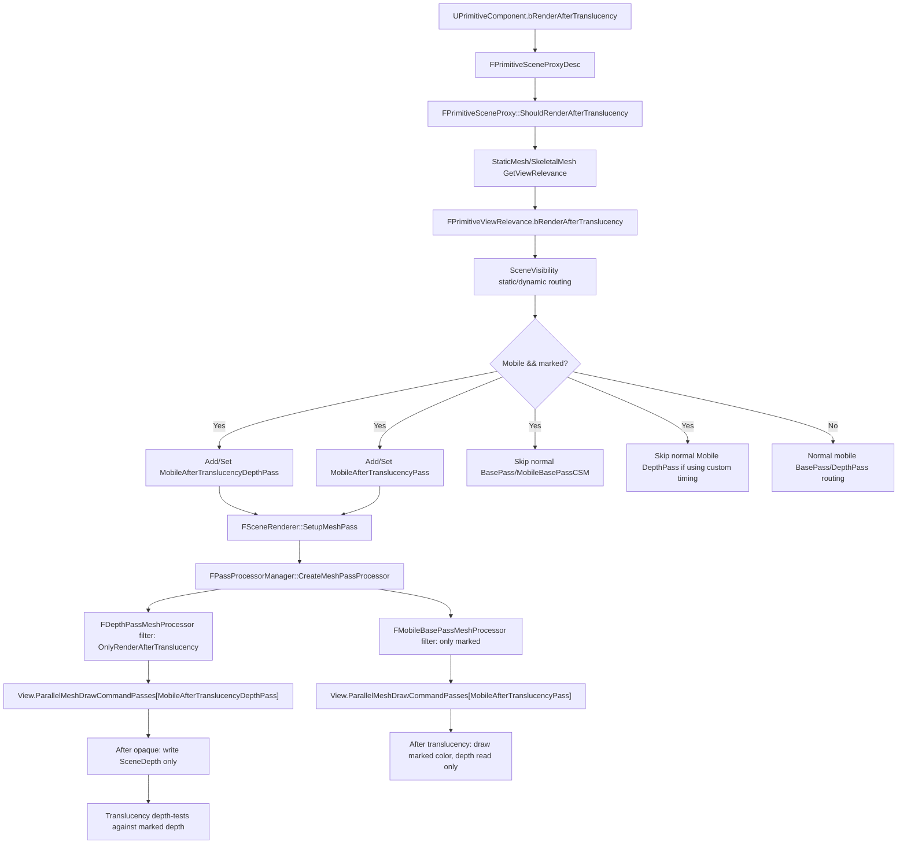

# Mobile Forward 自定义透明后渲染深度方案

基于 `Docs\DepthPass_Analysis_CX_GPT_7_1.md` 与 `Docs\Plan1.md`，并对照当前工程源码后，推荐把需求拆成两个独立 mesh pass：

1. `MobileAfterTranslucencyDepthPass`：只渲染被标记的 opaque/masked 物体，只写 `SceneDepth`，不写颜色。
2. `MobileAfterTranslucencyPass`：透明物体渲染完成后，再渲染被标记物体的颜色，不写深度，只做深度测试。

最终目标顺序是：

```text
普通 opaque base pass，不画被标记物体颜色
-> 被标记物体写 SceneDepth
-> 普通 translucency，透明物体会被被标记物体的深度挡住
-> 被标记物体渲染颜色，不写 depth
```

范围限定：

- 只处理 Mobile Forward。
- 只需要 Static Mesh 和 Skeletal Mesh。
- 不使用 CustomDepth。
- 被标记物体仍建议保持 `bRenderInMainPass=true`，通过新增标记把它们从普通 Mobile BasePass 路由到自定义 pass，而不是让美术或蓝图同时改多个渲染开关。

## 核心结论

`MobileAfterTranslucencyDepthPass` 不应该继续用 `FMobileBasePassMeshProcessor` 伪装。即使设置 `CW_NONE` 禁止颜色写入，它仍会走 Mobile BasePass 的 VS/PS、lightmap policy、local light、skylight 等材质颜色路径，只是不把颜色写出去。更合适的做法是复用 `DepthRendering.cpp` 的 `FDepthPassMeshProcessor`，因为它已经具备：

- `SetupDepthPassState`：`CW_NONE` + depth write。
- position-only shader 优化。
- masked / WPO / pixel depth offset 的深度 shader 选择。
- mobile depth pass stencil 写入逻辑。
- 静态 cached mesh command 与动态 mesh command 的完整支持。

但当前 `FDepthPassMeshProcessor::AddMeshBatch` 是 `final`，不能简单继承后重写过滤。因此有两个实现选择：

1. 推荐：给 `FDepthPassMeshProcessor` 增加一个小的过滤枚举，让同一个 processor 支持 `All`、`OnlyRenderAfterTranslucency`、`ExcludeRenderAfterTranslucency`。
2. 备选：复制一个 `FMobileAfterTranslucencyDepthPassMeshProcessor`，只改过滤。这个方案重复代码多，不建议作为长期实现。

## 原计划需要修正的点

### 1. Depth pass 不要用 MobileBasePass processor

原计划中：

```cpp
PassDrawRenderState.SetBlendState(TStaticBlendStateWriteMask<CW_NONE>::GetRHI());
return new FMobileBasePassMeshProcessor(EMeshPass::MobileAfterTranslucencyDepthPass, ...);
```

这只能禁止颜色输出，不能阻止 MobileBasePass 的 pixel shader 和光照相关 shader 被绑定。正确做法是为 `MobileAfterTranslucencyDepthPass` 注册一个 `FDepthPassMeshProcessor` 变体。

### 2. 透明后颜色 pass 复用 MobileBasePass 是合理的，但要强制 render state

`MobileAfterTranslucencyPass` 需要画 opaque 颜色，可以复用 `FMobileBasePassMeshProcessor`。不过它必须固定为：

- color write：`CW_RGBA`
- depth access：`DepthRead_StencilRead`
- depth state：`TStaticDepthStencilState<false, CF_DepthNearOrEqual>`
- flags：需要带 `ForcePassDrawRenderState`

否则 `FMobileBasePassMeshProcessor::Process` 内部可能根据 masked/full prepass 逻辑改成 `CF_Equal`，或者通过 `MobileBasePass::SetOpaqueRenderState` 又把 depth write 打开。

### 3. 全深度预通道开启时，不能随意在 base pass render pass 内写 depth

当前 `InitRenderTargetBindings_Forward` 中，full depth prepass 开启时 base pass 绑定为：

```cpp
FDepthStencilBinding(SceneDepth, ELoad, ELoad, FExclusiveDepthStencil::DepthRead_StencilWrite)
```

也就是说 base pass render pass 内 depth 是只读的。若把自定义 depth draw 直接插在 `RenderMobileBasePass` 后面，当 full prepass 开启时它没有合法的 depth write attachment。

稳妥方案是：

- 如果要保证所有配置下行为一致，新增一个独立 RDG raster pass，在普通 base pass 之后、translucency 之前绑定 `SceneTextures.Depth.Target` 为 `DepthWrite_StencilWrite`。
- 如果想保留 single-pass/subpass 性能，可以先实现 conservative multi-pass 版本，验证后再做优化：仅在 `!bIsFullDepthPrepassEnabled` 且 base pass depth writable 时，把 depth draw 插在 `RenderForwardSinglePass` 的 `NextSubpass()` 之前。

### 4. `DepthAux` 需要单独关注

硬件 depth test 会看到新写入的 `SceneDepth`。但移动端部分路径通过 `DepthAux` 或 depth resolve 给 shader 采样 SceneDepth。当前 Android/Vulkan/Mobile HDR 路径可能会启用 `bRequiresSceneDepthAux`。

因此如果透明物体或透明后颜色 pass 的材质需要采样被标记物体的深度，需要在自定义 depth pass 后确认：

- `AddResolveSceneDepthPass` 发生在自定义 depth pass 之后。
- 如果当前路径使用 `DepthAux`，需要同步 `DepthAux`，否则 shader 采样的深度可能还是普通 base pass 后的旧值。

最小需求如果只是让透明物体被硬件深度测试挡住，写 `SceneDepth` 本身就够；如果材质要读新深度，必须验证 `SceneDepth`/`DepthAux` 的采样路径。

## 需要新增的渲染标记

### UPrimitiveComponent

文件：

- `Source/Runtime/Engine/Classes/Components/PrimitiveComponent.h`
- `Source/Runtime/Engine/Private/Components/PrimitiveComponent.cpp`

新增字段：

```cpp
UPROPERTY(EditAnywhere, AdvancedDisplay, BlueprintReadOnly, Category = Rendering, meta = (DisplayName = "Render Opaque After Translucency (Mobile)"))
uint8 bRenderAfterTranslucency : 1;
```

构造函数默认：

```cpp
bRenderAfterTranslucency = false;
```

新增 setter：

```cpp
UFUNCTION(BlueprintCallable, Category = "Rendering")
ENGINE_API void SetRenderAfterTranslucency(bool bValue);
```

实现：

```cpp
void UPrimitiveComponent::SetRenderAfterTranslucency(bool bValue)
{
	if (bRenderAfterTranslucency != bValue)
	{
		bRenderAfterTranslucency = bValue;
		MarkRenderStateDirty();
	}
}
```

### FPrimitiveSceneProxy / Desc

文件：

- `Source/Runtime/Engine/Public/PrimitiveSceneProxy.h`
- `Source/Runtime/Engine/Private/PrimitiveSceneProxy.cpp`
- `Source/Runtime/Engine/Public/PrimitiveSceneProxyDesc.h`

在 `FPrimitiveSceneProxyDesc` 中新增 `bRenderAfterTranslucency`，构造默认 false，`InitializeFrom` 从组件拷贝。

在 `FPrimitiveSceneProxy` 中新增 bit，并在构造初始化列表中从 desc 拷贝：

```cpp
inline bool ShouldRenderAfterTranslucency() const { return bRenderAfterTranslucency; }
```

### FPrimitiveViewRelevance

文件：

- `Source/Runtime/Engine/Public/PrimitiveViewRelevance.h`

新增：

```cpp
uint32 bRenderAfterTranslucency : 1;
```

构造函数已经整体 memzero，显式设 false 可读性更好但不是必须。`operator|=` 是按 byte OR 全结构体，新 bit 会自动参与合并。

### StaticMesh / SkeletalMesh relevance

文件：

- `Source/Runtime/Engine/Private/StaticMeshRender.cpp`
- `Source/Runtime/Engine/Private/SkeletalMesh.cpp`

在 `GetViewRelevance` 中加：

```cpp
Result.bRenderAfterTranslucency = ShouldRenderAfterTranslucency();
```

这会覆盖 Static Mesh 的静态/动态路径，也覆盖 Skeletal Mesh 的动态路径。需求只要求 Static Mesh 和 Skeletal Mesh，因此不必改所有 proxy 类型。

## 新增 EMeshPass

文件：

- `Source/Runtime/Renderer/Public/MeshPassProcessor.h`

建议顺序把 depth pass 放在 color pass 前面：

```cpp
MobileAfterTranslucencyDepthPass,
MobileAfterTranslucencyPass,
```

同时更新 `GetMeshPassName`：

```cpp
case EMeshPass::MobileAfterTranslucencyDepthPass: return TEXT("MobileAfterTranslucencyDepthPass");
case EMeshPass::MobileAfterTranslucencyPass: return TEXT("MobileAfterTranslucencyPass");
```

当前非 editor `EMeshPass::Num` 是 32，editor 是 `32 + 4`。新增两个 pass 后：

```cpp
#if WITH_EDITOR
static_assert(EMeshPass::Num == 34 + 4, ...);
#else
static_assert(EMeshPass::Num == 34, ...);
#endif
```

`NumBits = 6` 不需要改，64 个 bit 足够。

## Depth pass processor 方案

文件：

- `Source/Runtime/Renderer/Private/DepthRendering.h`
- `Source/Runtime/Renderer/Private/DepthRendering.cpp`

### 增加过滤枚举

推荐给 `FDepthPassMeshProcessor` 增加一个过滤模式：

```cpp
enum class EDepthPassPrimitiveFilter : uint8
{
	All,
	OnlyRenderAfterTranslucency,
	ExcludeRenderAfterTranslucency
};
```

构造函数新增参数：

```cpp
EDepthPassPrimitiveFilter InPrimitiveFilter = EDepthPassPrimitiveFilter::All
```

成员：

```cpp
const EDepthPassPrimitiveFilter PrimitiveFilter;
```

在 `AddMeshBatch` 开头过滤：

```cpp
if (PrimitiveSceneProxy)
{
	const bool bRenderAfterTranslucency = PrimitiveSceneProxy->ShouldRenderAfterTranslucency();

	if (PrimitiveFilter == EDepthPassPrimitiveFilter::OnlyRenderAfterTranslucency && !bRenderAfterTranslucency)
	{
		return;
	}

	if (PrimitiveFilter == EDepthPassPrimitiveFilter::ExcludeRenderAfterTranslucency && bRenderAfterTranslucency)
	{
		return;
	}
}
else if (PrimitiveFilter == EDepthPassPrimitiveFilter::OnlyRenderAfterTranslucency)
{
	return;
}
```

### 普通 Mobile DepthPass 排除标记物体

把 mobile 注册从共用 `CreateDepthPassProcessor` 改成单独的 `CreateMobileDepthPassProcessor`，避免影响 Deferred：

```cpp
FMeshPassProcessor* CreateMobileDepthPassProcessor(
	ERHIFeatureLevel::Type FeatureLevel,
	const FScene* Scene,
	const FSceneView* InViewIfDynamicMeshCommand,
	FMeshPassDrawListContext* InDrawListContext)
{
	EDepthDrawingMode EarlyZPassMode;
	bool bEarlyZPassMovable;
	FScene::GetEarlyZPassMode(FeatureLevel, EarlyZPassMode, bEarlyZPassMovable);

	FMeshPassProcessorRenderState DepthPassState;
	SetupDepthPassState(DepthPassState);

	return new FDepthPassMeshProcessor(
		EMeshPass::DepthPass,
		Scene,
		FeatureLevel,
		InViewIfDynamicMeshCommand,
		DepthPassState,
		true,
		EarlyZPassMode,
		bEarlyZPassMovable,
		false,
		InDrawListContext,
		false,
		false,
		EDepthPassPrimitiveFilter::ExcludeRenderAfterTranslucency);
}
```

然后：

```cpp
REGISTER_MESHPASSPROCESSOR_AND_PSOCOLLECTOR(
	MobileDepthPass,
	CreateMobileDepthPassProcessor,
	EShadingPath::Mobile,
	EMeshPass::DepthPass,
	EMeshPassFlags::CachedMeshCommands | EMeshPassFlags::MainView);
```

### 新建 MobileAfterTranslucencyDepthPass processor

```cpp
FMeshPassProcessor* CreateMobileAfterTranslucencyDepthPassProcessor(
	ERHIFeatureLevel::Type FeatureLevel,
	const FScene* Scene,
	const FSceneView* InViewIfDynamicMeshCommand,
	FMeshPassDrawListContext* InDrawListContext)
{
	FMeshPassProcessorRenderState DepthPassState;
	SetupDepthPassState(DepthPassState);

	return new FDepthPassMeshProcessor(
		EMeshPass::MobileAfterTranslucencyDepthPass,
		Scene,
		FeatureLevel,
		InViewIfDynamicMeshCommand,
		DepthPassState,
		false,          // 不尊重 UseAsOccluder，标记物体必须写深度
		DDM_AllOpaque,  // opaque + masked 都允许
		true,
		false,
		InDrawListContext,
		false,
		false,
		EDepthPassPrimitiveFilter::OnlyRenderAfterTranslucency);
}
```

注册：

```cpp
REGISTER_MESHPASSPROCESSOR_AND_PSOCOLLECTOR(
	MobileAfterTranslucencyDepthPass,
	CreateMobileAfterTranslucencyDepthPassProcessor,
	EShadingPath::Mobile,
	EMeshPass::MobileAfterTranslucencyDepthPass,
	EMeshPassFlags::CachedMeshCommands | EMeshPassFlags::MainView);
```

这里使用 `CachedMeshCommands | MainView`，这样 Static Mesh 能走 cached draw command，Skeletal Mesh/dynamic mesh 也能每帧构建。

## 透明后颜色 pass processor

文件：

- `Source/Runtime/Renderer/Private/MobileBasePass.cpp`
- `Source/Runtime/Renderer/Private/MobileBasePassRendering.h`

### AddMeshBatch 路由

在 `FMobileBasePassMeshProcessor::AddMeshBatch` 的已有 early return 后加入：

```cpp
const bool bAfterTranslucencyPass = MeshPassType == EMeshPass::MobileAfterTranslucencyPass;
const bool bRenderAfterTranslucency = PrimitiveSceneProxy && PrimitiveSceneProxy->ShouldRenderAfterTranslucency();

if (bAfterTranslucencyPass)
{
	if (!bRenderAfterTranslucency)
	{
		return;
	}
}
else
{
	if (bRenderAfterTranslucency)
	{
		return;
	}
}
```

这会让标记物体不进入普通 `BasePass`、`MobileBasePassCSM`、mobile translucency pass。当前需求只支持 opaque/masked，因此标记到 translucent 材质上不作为支持目标。

### 创建透明后颜色 pass

```cpp
FMeshPassProcessor* CreateMobileAfterTranslucencyPassProcessor(
	ERHIFeatureLevel::Type FeatureLevel,
	const FScene* Scene,
	const FSceneView* InViewIfDynamicMeshCommand,
	FMeshPassDrawListContext* InDrawListContext)
{
	FMeshPassProcessorRenderState PassDrawRenderState;
	PassDrawRenderState.SetBlendState(TStaticBlendStateWriteMask<CW_RGBA>::GetRHI());
	PassDrawRenderState.SetDepthStencilAccess(FExclusiveDepthStencil::DepthRead_StencilRead);
	PassDrawRenderState.SetDepthStencilState(TStaticDepthStencilState<false, CF_DepthNearOrEqual>::GetRHI());

	const FMobileBasePassMeshProcessor::EFlags Flags =
		FMobileBasePassMeshProcessor::EFlags::CanUseDepthStencil |
		FMobileBasePassMeshProcessor::EFlags::ForcePassDrawRenderState;

	return new FMobileBasePassMeshProcessor(
		EMeshPass::MobileAfterTranslucencyPass,
		Scene,
		InViewIfDynamicMeshCommand,
		PassDrawRenderState,
		InDrawListContext,
		Flags);
}
```

注册：

```cpp
REGISTER_MESHPASSPROCESSOR_AND_PSOCOLLECTOR(
	MobileAfterTranslucencyPass,
	CreateMobileAfterTranslucencyPassProcessor,
	EShadingPath::Mobile,
	EMeshPass::MobileAfterTranslucencyPass,
	EMeshPassFlags::CachedMeshCommands | EMeshPassFlags::MainView);
```

注意：不要在 `CollectPSOInitializers` 里直接对这两个新 pass `return`。那会降低 PSO 预缓存覆盖，可能导致运行时 shader/PSO hitch。若后续要做严格 PSO 预缓存，应该把 `bRenderAfterTranslucency` 也传进 `FPSOPrecacheParams`，而不是跳过。

## SceneVisibility 路由

文件：

- `Source/Runtime/Renderer/Private/SceneVisibility.cpp`

### Static Mesh

普通 mobile static material 分发当前逻辑是：

```cpp
if (!StaticMeshRelevance.bUseSkyMaterial)
{
	DrawCommandPacket.AddCommandsForMesh(..., EMeshPass::BasePass);
	if (!bMobileBasePassAlwaysUsesCSM)
	{
		DrawCommandPacket.AddCommandsForMesh(..., EMeshPass::MobileBasePassCSM);
	}
}
```

改成：

```cpp
if (!StaticMeshRelevance.bUseSkyMaterial)
{
	if (ViewRelevance.bRenderAfterTranslucency)
	{
		DrawCommandPacket.AddCommandsForMesh(..., EMeshPass::MobileAfterTranslucencyDepthPass);
		DrawCommandPacket.AddCommandsForMesh(..., EMeshPass::MobileAfterTranslucencyPass);
	}
	else
	{
		DrawCommandPacket.AddCommandsForMesh(..., EMeshPass::BasePass);
		if (!bMobileBasePassAlwaysUsesCSM)
		{
			DrawCommandPacket.AddCommandsForMesh(..., EMeshPass::MobileBasePassCSM);
		}
	}
}
```

同时建议普通 depth prepass static 分发排除标记物体，避免 full prepass 和自定义 depth pass 重复写：

```cpp
if (StaticMeshRelevance.bUseForDepthPass
	&& !ViewRelevance.bRenderAfterTranslucency
	&& (bDrawDepthOnly || (bMobileMaskedInEarlyPass && ViewRelevance.bMasked)))
{
	...
}
```

### Dynamic Mesh

在 `ComputeDynamicMeshRelevance` 中，当前 mobile dynamic 会设置 `DepthPass` 和 `BasePass`。推荐改成：

```cpp
if (ViewRelevance.bDrawRelevance
	&& (ViewRelevance.bRenderInMainPass || ViewRelevance.bRenderCustomDepth || ViewRelevance.bRenderInDepthPass))
{
	if (!(ShadingPath == EShadingPath::Mobile && ViewRelevance.bRenderAfterTranslucency))
	{
		PassMask.Set(EMeshPass::DepthPass);
		View.NumVisibleDynamicMeshElements[EMeshPass::DepthPass] += NumElements;
	}

	if (ViewRelevance.bRenderInMainPass || ViewRelevance.bRenderCustomDepth)
	{
		if (ShadingPath == EShadingPath::Mobile && ViewRelevance.bRenderAfterTranslucency)
		{
			PassMask.Set(EMeshPass::MobileAfterTranslucencyDepthPass);
			View.NumVisibleDynamicMeshElements[EMeshPass::MobileAfterTranslucencyDepthPass] += NumElements;

			PassMask.Set(EMeshPass::MobileAfterTranslucencyPass);
			View.NumVisibleDynamicMeshElements[EMeshPass::MobileAfterTranslucencyPass] += NumElements;
		}
		else
		{
			PassMask.Set(EMeshPass::BasePass);
			View.NumVisibleDynamicMeshElements[EMeshPass::BasePass] += NumElements;

			if (ShadingPath == EShadingPath::Mobile)
			{
				PassMask.Set(EMeshPass::MobileBasePassCSM);
				View.NumVisibleDynamicMeshElements[EMeshPass::MobileBasePassCSM] += NumElements;
			}
		}
	}
}
```

真实修改时不要直接照抄完整块覆盖，应该在当前函数结构内最小改动，保留 sky、anisotropy、custom depth、debug view、velocity 等已有逻辑。核心原则是：

- 标记物体进入 `MobileAfterTranslucencyDepthPass` 与 `MobileAfterTranslucencyPass`。
- 标记物体不进入普通 `BasePass` / `MobileBasePassCSM`。
- 标记物体不进入普通 `DepthPass`，除非你选择让 full prepass 代替自定义 depth pass。

## Mesh pass setup

新增两个 pass 注册 `MainView` 后，`FSceneRenderer::SetupMeshPass` 会自动创建它们的 per-view processor：

```cpp
FPassProcessorManager::CreateMeshPassProcessor(ShadingPath, PassType, ...);
Pass.DispatchPassSetup(...);
```

`SetupMeshPass` 只跳过 mobile 的 `BasePass` 和 `MobileBasePassCSM`。新增的两个 pass 不在跳过列表里，所以会走通用路径。

如果透明后颜色 pass 需要严格复用 mobile CSM 合并逻辑，就不能只靠通用 `SetupMeshPass`；需要像 `SetupMobileBasePassAfterShadowInit` 那样在 shadow init 后单独 setup。当前需求未明确要求 CSM，所以先走通用路径更简单。

## Instance culling draw params

文件：

- `Source/Runtime/Renderer/Private/SceneRendering.h`
- `Source/Runtime/Renderer/Private/MobileShadingRenderer.cpp`

在 `FMobileSceneRenderer` 成员中新增：

```cpp
FInstanceCullingDrawParams AfterTranslucencyDepthInstanceCullingDrawParams;
FInstanceCullingDrawParams AfterTranslucencyInstanceCullingDrawParams;
```

在 `BuildInstanceCullingDrawParams` 中新增：

```cpp
View.ParallelMeshDrawCommandPasses[EMeshPass::MobileAfterTranslucencyDepthPass]
	.BuildRenderingCommands(GraphBuilder, Scene->GPUScene, AfterTranslucencyDepthInstanceCullingDrawParams);

View.ParallelMeshDrawCommandPasses[EMeshPass::MobileAfterTranslucencyPass]
	.BuildRenderingCommands(GraphBuilder, Scene->GPUScene, AfterTranslucencyInstanceCullingDrawParams);
```

如果后续把自定义 depth pass 做成独立 RDG pass，也可以给那个 RDG pass 自己的 `PassParameters->InstanceCullingDrawParams`，避免多 view 下成员参数复用带来的阅读和维护风险。

## 渲染函数

### RHI draw helper

文件：

- `Source/Runtime/Renderer/Private/MobileBasePassRendering.cpp`
- `Source/Runtime/Renderer/Private/SceneRendering.h`

新增两个 RHI 级 draw helper：

```cpp
void FMobileSceneRenderer::RenderMobileAfterTranslucencyDepthPass(
	FRHICommandList& RHICmdList,
	const FViewInfo& View,
	const FInstanceCullingDrawParams* InstanceCullingDrawParams)
{
	checkSlow(RHICmdList.IsInsideRenderPass());
	SCOPED_DRAW_EVENT(RHICmdList, MobileAfterTranslucencyDepthPass);

	SetStereoViewport(RHICmdList, View);
	View.ParallelMeshDrawCommandPasses[EMeshPass::MobileAfterTranslucencyDepthPass]
		.DispatchDraw(nullptr, RHICmdList, InstanceCullingDrawParams);
}

void FMobileSceneRenderer::RenderMobileAfterTranslucencyPass(
	FRHICommandList& RHICmdList,
	const FViewInfo& View,
	const FInstanceCullingDrawParams* InstanceCullingDrawParams)
{
	checkSlow(RHICmdList.IsInsideRenderPass());
	SCOPED_DRAW_EVENT(RHICmdList, MobileAfterTranslucencyPass);

	SetStereoViewport(RHICmdList, View);
	View.ParallelMeshDrawCommandPasses[EMeshPass::MobileAfterTranslucencyPass]
		.DispatchDraw(nullptr, RHICmdList, InstanceCullingDrawParams);
}
```

`SetStereoViewport` 比手动 `SetViewport(View.ViewRect...)` 更贴近现有 `RenderPrePass`，对 VR / instanced stereo 更稳。

### 独立 RDG depth pass

为了避开 full prepass 下 base render pass depth 只读的问题，推荐再封装一个 graph-level depth pass：

```cpp
void FMobileSceneRenderer::RenderMobileAfterTranslucencyDepthPass(
	FRDGBuilder& GraphBuilder,
	FRenderViewContext& ViewContext,
	FSceneTextures& SceneTextures)
{
	FViewInfo& View = *ViewContext.ViewInfo;

	FRenderTargetBindingSlots RenderTargets;
	RenderTargets.DepthStencil = FDepthStencilBinding(
		SceneTextures.Depth.Target,
		ERenderTargetLoadAction::ELoad,
		ERenderTargetLoadAction::ELoad,
		FExclusiveDepthStencil::DepthWrite_StencilWrite);

	auto* PassParameters = GraphBuilder.AllocParameters<FMobileRenderPassParameters>();
	PassParameters->View = View.GetShaderParameters();
	PassParameters->MobileBasePass = CreateMobileBasePassUniformBuffer(
		GraphBuilder,
		View,
		EMobileBasePass::Opaque,
		EMobileSceneTextureSetupMode::None);
	PassParameters->RenderTargets = RenderTargets;

	View.ParallelMeshDrawCommandPasses[EMeshPass::MobileAfterTranslucencyDepthPass]
		.BuildRenderingCommands(GraphBuilder, Scene->GPUScene, PassParameters->InstanceCullingDrawParams);

	GraphBuilder.AddPass(
		RDG_EVENT_NAME("MobileAfterTranslucencyDepthPass"),
		PassParameters,
		ERDGPassFlags::Raster,
		[this, PassParameters, &View](FRHICommandList& RHICmdList)
		{
			RenderMobileAfterTranslucencyDepthPass(RHICmdList, View, &PassParameters->InstanceCullingDrawParams);
		});
}
```

如果采用独立 RDG pass，`BuildInstanceCullingDrawParams` 中可以不再为 depth pass 构建成员级 params，避免重复 build。

## Forward 插入点

文件：

- `Source/Runtime/Renderer/Private/MobileShadingRenderer.cpp`

### 保守方案：强制 multi-pass

这是最稳的第一版。启用功能时，在 `InitViews` 中计算 `bRequiresMultiPass` 的位置，让该功能强制 multi-pass：

```cpp
bRequiresMultiPass = RequiresMultiPass(NumMSAASamples, ShaderPlatform) || bMobileRenderAfterTranslucencyEnabled;
```

其中 `bMobileRenderAfterTranslucencyEnabled` 可以先用 cvar 或项目宏控制。若要做到仅场景里有标记物体才强制 multi-pass，需要更早维护 scene-level primitive count，否则 `bRequiresMultiPass` 的计算早于最终 mesh pass setup。

渲染顺序：

```cpp
// RenderForwardMultiPass 第一段：普通 opaque
RenderMobileBasePass(...);
RenderMobileDebugView(...);
PostRenderBasePass(...);

// 第一段 RDG pass 结束后
RenderMobileAfterTranslucencyDepthPass(GraphBuilder, ViewContext, SceneTextures);

// 然后 resolve depth / DepthAux
AddResolveSceneDepthPass(...);
if (bRequiresSceneDepthAux)
{
	// 注意：这里是否能同步自定义 depth 到 DepthAux 需要验证。
	AddResolveSceneColorPass(GraphBuilder, View, SceneTextures.DepthAux);
}

// 第二段：decals/fog/translucency
RenderTranslucency(...);
RenderMobileAfterTranslucencyPass(...);
```

优点：

- full depth prepass 开/关都安全。
- depth write attachment 明确。
- 自定义 depth 一定发生在 translucency 前。

缺点：

- 会牺牲部分 mobile single-pass/subpass 优化。

### 优化方案：single-pass 内插入

仅当 `!bIsFullDepthPrepassEnabled` 且 base pass depth attachment 是 `DepthWrite_StencilWrite` 时，可以在 `RenderForwardSinglePass` 中：

```cpp
RenderMobileBasePass(RHICmdList, View, &PassParameters->InstanceCullingDrawParams);
RenderMobileAfterTranslucencyDepthPass(RHICmdList, View, &AfterTranslucencyDepthInstanceCullingDrawParams);

RHICmdList.NextSubpass();
...
RenderTranslucency(RHICmdList, View);
RenderMobileAfterTranslucencyPass(RHICmdList, View, &AfterTranslucencyInstanceCullingDrawParams);
```

如果 full prepass 开启，不能走这个路径，因为 base pass depth 是只读。此时要么：

- 使用上面的 multi-pass 独立 depth RDG pass。
- 或者允许标记物体进入普通 full `DepthPass`，不再执行自定义 depth pass。但这会让标记物体的深度在 base pass 前就生效，不再是“opaque 后写入”的统一时机。

## Mermaid 总链路



## 推荐实现顺序

1. 先加 component/proxy/view relevance 标记链路。
2. 加 `EMeshPass` 两个枚举、名称、static assert。
3. 修改 `FDepthPassMeshProcessor` 支持过滤，注册 `CreateMobileDepthPassProcessor` 与 `CreateMobileAfterTranslucencyDepthPassProcessor`。
4. 修改 `FMobileBasePassMeshProcessor::AddMeshBatch` 做普通 base pass 与 after-translucency color pass 的分流。
5. 修改 `SceneVisibility.cpp` 的 static/dynamic 分发，让 marked mesh 进入两个新 pass，不进普通 BasePass。
6. 添加 instance culling draw params 与 RHI draw helper。
7. 第一版用保守 multi-pass：base pass 结束后独立 RDG depth pass，透明 pass 后画颜色。
8. Android VR 真机验证后，再考虑 single-pass 优化路径。

## 验证点

- 标记 StaticMesh：普通 opaque 阶段不输出颜色。
- 标记 SkeletalMesh：动态 mesh path 能进入两个新 pass。
- 透明物体在标记物体后方时被挡住。
- 透明物体在标记物体前方时正常显示在前面。
- 标记物体最终颜色在透明之后绘制。
- 材质里采样 SceneDepth 时，能读到标记物体深度；若读不到，重点检查 `DepthAux` 和 depth resolve 时机。
- full depth prepass 开启和关闭都测试。
- `r.Mobile.EarlyZPass=0/1/2` 都测试。
- Android Vulkan / OpenGL ES 按项目实际 RHI 都测试。
- VR multiview / instanced stereo 下 viewport 正确，建议使用 `SetStereoViewport`。

## 额外风险

- CSM：新增 color pass 走通用 `SetupMeshPass`，不会自动复用 `SetupMobileBasePassAfterShadowInit` 的 BasePass/CSM 合并。如果标记物体必须接收 mobile CSM，需要单独把 after color pass 纳入 shadow init 后 setup。
- Decal/DBuffer/AO/HZB：如果标记物体被排除出普通 full depth prepass，那么在 base pass 前运行的 AO/HZB/DBuffer 不会看到它的深度。当前需求只要求挡透明与透明后读深度，这可以接受。
- PSO：不要为了省事跳过新 pass 的 PSO precache。先保证正确，后续再把 `bRenderAfterTranslucency` 接到 `FPSOPrecacheParams` 做精确预缓存。
- 材质范围：方案针对 opaque/masked。Translucent 材质标记后不保证正确，因为它们本来就走 translucency pass。
