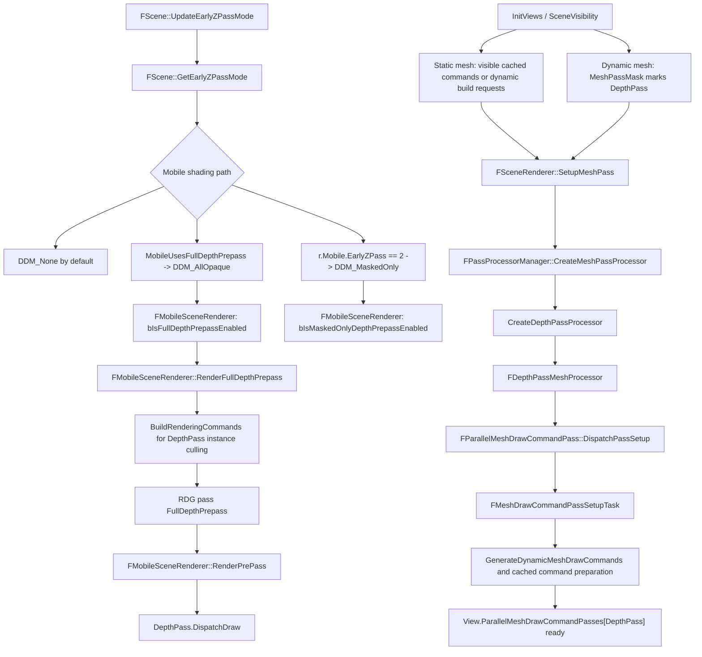
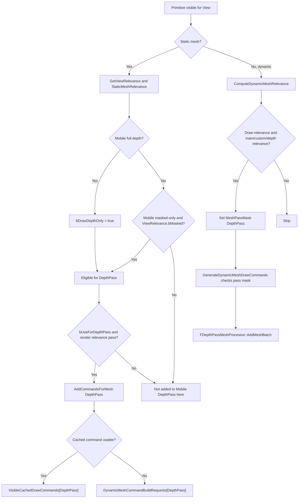
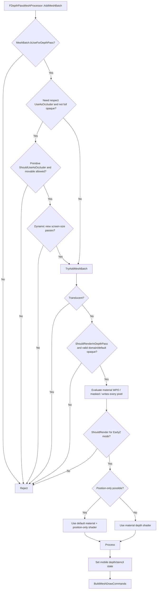
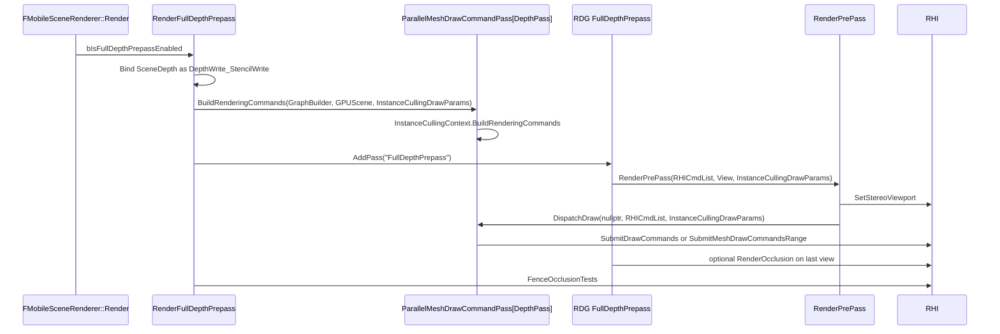
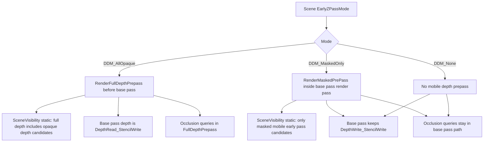

# Mobile Forward DepthPass 链路分析
>Question：找到移动端Forward管线渲染Depth相关逻辑，如何创建MeshProcess，如何在MeshProcess中过滤，如何在
SceneVisibility中进行过滤，找到整条链路，整理Mermaid，针对于Engine/Source/Runtime/Renderer/
Private/MobileShadingRenderer.cpp中RenderFullDepthPrepass中的RenderPrePass(RHICmdList, View,
&PassParameters->InstanceCullingDrawParams);(:836)对于这个Pass的渲染，都做了哪些工作，前因后果
捋清楚，整理Mermaid，将结果存储到Docs\DepthPass_Analysis_CX_GPT_7_1.md

分析目标：`Source/Runtime/Renderer/Private/MobileShadingRenderer.cpp:836` 的
`RenderPrePass(RHICmdList, View, &PassParameters->InstanceCullingDrawParams);`，即 Mobile 全深度预通道
`FullDepthPrepass` 中对 `EMeshPass::DepthPass` 的实际提交。

## 结论

`RenderFullDepthPrepass` 本身不是筛选 Mesh 的地方。它做的是：绑定 depth/stencil RT、为当前 View 构建
`DepthPass` 的 instance-culling draw params、开启一个 RDG raster pass，然后调用 `RenderPrePass` 去 dispatch
已经准备好的 `View.ParallelMeshDrawCommandPasses[EMeshPass::DepthPass]`。

DepthPass 的 Mesh 来源和过滤分三层：

1. `FScene::GetEarlyZPassMode` 决定移动端当前是 `DDM_None`、`DDM_MaskedOnly` 还是 `DDM_AllOpaque`。
2. `SceneVisibility` 决定静态/动态 Mesh 是否进入当前 View 的 `DepthPass` 可见命令或动态构建请求。
3. `FDepthPassMeshProcessor` 再按 `bUseForDepthPass`、occluder、透明/材质域、masked/non-masked、WPO、position-only 等规则生成最终 MeshDrawCommand。

## 入口和模式选择

Mobile Early-Z 模式在 `FScene::GetEarlyZPassMode` 中确定：

- `Source/Runtime/Renderer/Private/RendererScene.cpp:4694` 进入 Mobile 分支，默认 `OutZPassMode = DDM_None`。
- `Source/Runtime/Renderer/Private/RendererScene.cpp:4698` 当 `FReadOnlyCVARCache::MobileEarlyZPass(ShaderPlatform) == 2` 时使用 `DDM_MaskedOnly`。
- `Source/Runtime/Renderer/Private/RendererScene.cpp:4704` 当 `MobileUsesFullDepthPrepass(ShaderPlatform)` 为 true 时覆盖为 `DDM_AllOpaque`。
- `Source/Runtime/RenderCore/Private/RenderUtils.cpp:616` 的 `MobileUsesFullDepthPrepass` 条件是：移动端 shadow mask texture、mobile AO、DBuffer，或 `r.Mobile.EarlyZPass == 1`。

`FMobileSceneRenderer` 构造阶段把模式缓存成两个布尔值：

- `Source/Runtime/Renderer/Private/MobileShadingRenderer.cpp:310`：`bIsFullDepthPrepassEnabled = Scene->EarlyZPassMode == DDM_AllOpaque`
- `Source/Runtime/Renderer/Private/MobileShadingRenderer.cpp:311`：`bIsMaskedOnlyDepthPrepassEnabled = Scene->EarlyZPassMode == DDM_MaskedOnly`

在 `FMobileSceneRenderer::Render` 中：

- 如果 `bIsFullDepthPrepassEnabled` 为 true，先执行 `RenderFullDepthPrepass`。
- 之后 resolve depth，设置 `SceneTextures.MobileSetupMode = SceneDepth`，再跑 shadow projection、HZB、AO、local lights、DBuffer、local fog，最后进入 forward/deferred base pass。
- 如果不是 full prepass，masked-only depth prepass 会被嵌在 base pass 的 render pass 内，由 `RenderMaskedPrePass` 调 `RenderPrePass`。

## 总链路



## MeshProcessor 如何创建

### 注册

`DepthPass` 对 Mobile shading path 的 processor 在 `DepthRendering.cpp` 注册：

- `Source/Runtime/Renderer/Private/DepthRendering.cpp:1230`：`CreateDepthPassProcessor`
- `Source/Runtime/Renderer/Private/DepthRendering.cpp:1234`：重新读取 `FScene::GetEarlyZPassMode`
- `Source/Runtime/Renderer/Private/DepthRendering.cpp:1236`：`SetupDepthPassState`
- `Source/Runtime/Renderer/Private/DepthRendering.cpp:1239`：创建 `FDepthPassMeshProcessor(EMeshPass::DepthPass, ..., true, EarlyZPassMode, bEarlyZPassMovable, ...)`
- `Source/Runtime/Renderer/Private/DepthRendering.cpp:1243`：`REGISTER_MESHPASSPROCESSOR_AND_PSOCOLLECTOR(MobileDepthPass, ..., EShadingPath::Mobile, EMeshPass::DepthPass, CachedMeshCommands | MainView)`

`FPassProcessorManager::CreateMeshPassProcessor` 通过注册表跳转：

- `Source/Runtime/Renderer/Public/MeshPassProcessor.h:2194`：按 `ShadingPath + PassType` 查 `JumpTable`
- `Source/Runtime/Renderer/Public/MeshPassProcessor.h:2201`：调用注册的 create function

### 静态 Mesh 的缓存创建

静态 MeshDrawCommand 通常在 primitive 加入场景或静态 mesh 更新时预缓存：

- `Source/Runtime/Renderer/Private/PrimitiveSceneInfo.cpp:429`：`FPrimitiveSceneInfo::CacheMeshDrawCommands`
- `Source/Runtime/Renderer/Private/PrimitiveSceneInfo.cpp:481`：只处理带 `CachedMeshCommands` 标志的 pass；Mobile `DepthPass` 正好有这个标志。
- `Source/Runtime/Renderer/Private/PrimitiveSceneInfo.cpp:485`：创建 pass processor，此处 `InViewIfDynamicMeshCommand == nullptr`，`DrawListContext` 是 `FCachedPassMeshDrawListContext`。
- `Source/Runtime/Renderer/Private/PrimitiveSceneInfo.cpp:500`：调用 `PassMeshProcessor->AddMeshBatch`
- `Source/Runtime/Renderer/Private/PrimitiveSceneInfo.cpp:502` 后把生成的 command info 写入 `StaticMeshCommandInfos`。

### 每帧 View 上的创建

每帧 `InitViews`/visibility 结束后会 setup 各个 main-view pass：

- `Source/Runtime/Renderer/Private/SceneRendering.cpp:4196`：`FSceneRenderer::SetupMeshPass`
- `Source/Runtime/Renderer/Private/SceneRendering.cpp:4206`：只处理带 `MainView` 标志的 pass。
- `Source/Runtime/Renderer/Private/SceneRendering.cpp:4208`：Mobile 会跳过 `BasePass` 和 `MobileBasePassCSM`，因为它们要等 shadow 初始化后合并排序；`DepthPass` 不跳过。
- `Source/Runtime/Renderer/Private/SceneRendering.cpp:4233`：创建当前 View 的 `FDepthPassMeshProcessor`。
- `Source/Runtime/Renderer/Private/SceneRendering.cpp:4257`：调用 `FParallelMeshDrawCommandPass::DispatchPassSetup`，输入包括动态 Mesh、动态 relevance mask、静态 dynamic build requests，以及 visibility 已选出的 cached commands。

## SceneVisibility 如何过滤

### Static Mesh

`SceneVisibility.cpp` 对静态 Mesh 的关键过滤在 `FRelevancePacket::ComputeRelevance`：

- `Source/Runtime/Renderer/Private/SceneVisibility.cpp:1047`：`FFilterStaticMeshesForViewData` 缓存 view origin、LOD、屏幕半径阈值等。
- `Source/Runtime/Renderer/Private/SceneVisibility.cpp:1057`：`bFullEarlyZPass = ShouldForceFullDepthPass(View.GetShaderPlatform())`。Mobile 下这等价于 `MobileUsesFullDepthPrepass`。
- `Source/Runtime/Renderer/Private/SceneVisibility.cpp:1318`：`bMobileMaskedInEarlyPass = Mobile && Scene.EarlyZPassMode == DDM_MaskedOnly`。
- `Source/Runtime/Renderer/Private/SceneVisibility.cpp:1423`：`bDrawDepthOnly = bFullEarlyZPass || ((ShadingPath != Mobile) && screen-size-test)`。这意味着 Mobile 不走非 full prepass 的屏幕尺寸 depth-only 逻辑；Mobile 要么 full depth，要么 masked-only 特例。
- `Source/Runtime/Renderer/Private/SceneVisibility.cpp:1530`：静态 mesh 只有满足 `StaticMeshRelevance.bUseForDepthPass` 且 `(bDrawDepthOnly || (bMobileMaskedInEarlyPass && ViewRelevance.bMasked))` 才加入 depth pass。
- `Source/Runtime/Renderer/Private/SceneVisibility.cpp:1538`：Mobile 不使用 `SecondStageDepthPass`，即使 relevance 有 second-stage，也落到普通 `DepthPass`。

静态 Mesh 加入 pass 后有两种路径：

- 如果 cached command 可用，`FDrawCommandRelevancePacket::AddCommandsForMesh` 把 `FVisibleMeshDrawCommand` 放进 `VisibleCachedDrawCommands[DepthPass]`。
- 如果不能缓存或需要 view-dependent build，就放进 `DynamicMeshCommandBuildRequests[DepthPass]`，之后在 mesh pass setup task 中由 `FDepthPassMeshProcessor` 构建。

### Dynamic Mesh

动态 Mesh 的 SceneVisibility 主要先标 pass mask：

- `Source/Runtime/Renderer/Private/SceneVisibility.cpp:2186`：`ComputeDynamicMeshRelevance`
- 当 `ViewRelevance.bDrawRelevance` 且 render-in-main/custom-depth/depth-pass 之一为 true 时，动态 mesh 会被考虑。
- 对 Mobile，second-stage depth path 被 `ShadingPath != Mobile` 排除，所以动态 mesh 标记为 `EMeshPass::DepthPass`。
- 之后 `MeshDrawCommands.cpp:616` 在 `GenerateDynamicMeshDrawCommands` 中检查 `DynamicMeshElementsPassRelevance[MeshIndex].Get(PassType)`，通过后才调用 `PassMeshProcessor->AddMeshBatch`。



## MeshProcessor 内部如何过滤

`FDepthPassMeshProcessor` 的过滤入口是 `AddMeshBatch`：

- `Source/Runtime/Renderer/Private/DepthRendering.cpp:1023`：初始条件是 `MeshBatch.bUseForDepthPass`。
- `Source/Runtime/Renderer/Private/DepthRendering.cpp:1028`：当需要尊重 occluder 标志且 `EarlyZPassMode < DDM_AllOpaque` 时，要求 `PrimitiveSceneProxy->ShouldUseAsOccluder()`，并按 movable 策略过滤。
- `Source/Runtime/Renderer/Private/DepthRendering.cpp:1044`：动态命令有 view 时，还会按 `GMinScreenRadiusForDepthPrepass` 做屏幕尺寸过滤。
- `Source/Runtime/Renderer/Private/DepthRendering.cpp:1077`：`DDM_AllOpaqueNoVelocity` 下会避开将在 velocity pass 写 depth 的对象。
- `Source/Runtime/Renderer/Private/DepthRendering.cpp:1091`：通过后进入 `TryAddMeshBatch`。

`TryAddMeshBatch` 和 `ShouldRender` 做材质级过滤：

- `Source/Runtime/Renderer/Private/DepthRendering.cpp:982`：剔除 translucent。
- `Source/Runtime/Renderer/Private/DepthRendering.cpp:983`：要求 `PrimitiveSceneProxy->ShouldRenderInDepthPass()`。
- `Source/Runtime/Renderer/Private/DepthRendering.cpp:985`：要求 material domain 可以进入 mesh pass，且 material 属于默认 opaque pass。
- `Source/Runtime/Renderer/Private/DepthRendering.cpp:939`：`ShouldRender` 决定是否 render、是否用 default material、是否 position-only。
- 非 masked 且不是 `DDM_MaskedOnly` 时可画；masked 且不是 `DDM_NonMaskedOnly` 时可画。
- 非 masked、无 WPO、写满像素、VF 支持 position-only 时，使用 default material + position-only shader，减少 pixel shader 成本。

最终 `Process` 生成 MeshDrawCommand：

- `Source/Runtime/Renderer/Private/DepthRendering.cpp:787`：`FDepthPassMeshProcessor::Process`
- `Source/Runtime/Renderer/Private/DepthRendering.cpp:802`：按 position-only / depth-only 取 depth pass shaders。
- `Source/Runtime/Renderer/Private/DepthRendering.cpp:823`：Mobile ES3.1 路径设置 `SetMobileDepthPassRenderState`。
- `Source/Runtime/Renderer/Private/DepthRendering.cpp:753`：`SetMobileDepthPassRenderState` 使用 depth write、`CF_DepthNearOrEqual`，并写 stencil bit，比如 receive decals、contact shadow、mobile deferred shading model/light channels。
- `Source/Runtime/Renderer/Private/DepthRendering.cpp:846`：`BuildMeshDrawCommands` 写入 draw command list。



## `RenderFullDepthPrepass` 具体做了什么

目标调用所在函数在 `Source/Runtime/Renderer/Private/MobileShadingRenderer.cpp:796`。

按执行顺序：

1. 构造只含 depth/stencil 的 `FRenderTargetBindingSlots`。
   `Source/Runtime/Renderer/Private/MobileShadingRenderer.cpp:799` 绑定 `SceneTextures.Depth.Target`，第一个 view 使用 `EClear`，访问为 `DepthWrite_StencilWrite`。
2. 设置 occlusion query 数量。
   `Source/Runtime/Renderer/Private/MobileShadingRenderer.cpp:800` scene capture 不做 occlusion queries，否则根据 `ComputeNumOcclusionQueriesToBatch` 分配。
3. `GetRenderViews` 只保留 `View.ShouldRenderView()` 的 view。
4. 每个 view 开始时设置 GPU mask 和 draw event；非第一个 view 把 depth/stencil load action 改成 `ELoad`，避免清掉前一个 view 的结果。
5. `View.BeginRenderView()`。
6. 分配 `FMobileRenderPassParameters`，写入 view uniform、mobile base pass uniform、render targets。
7. `Source/Runtime/Renderer/Private/MobileShadingRenderer.cpp:824` 调：
   `View.ParallelMeshDrawCommandPasses[EMeshPass::DepthPass].BuildRenderingCommands(GraphBuilder, Scene->GPUScene, PassParameters->InstanceCullingDrawParams);`
   这里把 mesh pass setup 阶段准备好的 command list 转成 RDG 生命周期内的 instance-culling draw params。
8. 如果是最后一个 view，且 `DoOcclusionQueries()` 为 true，并且不是 scene capture，则本 pass 末尾执行 occlusion queries。
9. `Source/Runtime/Renderer/Private/MobileShadingRenderer.cpp:833` 添加 RDG raster pass：`RDG_EVENT_NAME("FullDepthPrepass")`。
10. `Source/Runtime/Renderer/Private/MobileShadingRenderer.cpp:836` pass lambda 内调用 `RenderPrePass(RHICmdList, View, &PassParameters->InstanceCullingDrawParams)`。
11. `RenderPrePass` 自身在 `Source/Runtime/Renderer/Private/DepthRendering.cpp:666`，只做 render-pass 内检查、统计/event、`SetStereoViewport`，然后：
    `Source/Runtime/Renderer/Private/DepthRendering.cpp:676`：
    `View.ParallelMeshDrawCommandPasses[EMeshPass::DepthPass].DispatchDraw(nullptr, RHICmdList, InstanceCullingDrawParams);`
12. 如果需要 occlusion queries，紧接着 `RenderOcclusion(RHICmdList)`。
13. 函数末尾 `FenceOcclusionTests(GraphBuilder)`。



## `DispatchDraw` 前后发生了什么

`FParallelMeshDrawCommandPass` 的准备和提交分开：

- `Source/Runtime/Renderer/Private/MeshDrawCommands.cpp:581`：`GenerateDynamicMeshDrawCommands` 把 dynamic mesh 和 static dynamic build requests 喂给 processor。
- `Source/Runtime/Renderer/Private/MeshDrawCommands.cpp:616`：动态 mesh 必须通过 `DynamicMeshElementsPassRelevance[MeshIndex].Get(PassType)`。
- `Source/Runtime/Renderer/Private/MeshDrawCommands.cpp:621`：通过后调用 `PassMeshProcessor->AddMeshBatch`。
- `Source/Runtime/Renderer/Private/MeshDrawCommands.cpp:1016`：Mobile 的 `DepthPass` 会更新 mobile pass sort key。
- `Source/Runtime/Renderer/Private/MeshDrawCommands.cpp:1605`：`BuildRenderingCommands` 负责建立 instance-culling 绘制参数。
- `Source/Runtime/Renderer/Private/MeshDrawCommands.cpp:1640`：`DispatchDraw` 根据 instance-culling 参数提交 draw command。GPUScene 路径走 `InstanceCullingContext.SubmitDrawCommands`，否则走普通 `SubmitMeshDrawCommandsRange`。

所以 `RenderPrePass` 看到的是已经按 view visibility、pass relevance、processor filtering、sort、instance culling 准备好的命令。

## FullDepthPrepass 的后续影响

Full depth prepass 完成后，base pass 不再清 depth，而是读已有 depth：

- Forward：`Source/Runtime/Renderer/Private/MobileShadingRenderer.cpp:1494`，`bIsFullDepthPrepassEnabled` 时 base pass depth binding 是 `DepthRead_StencilWrite`，load action 是 `ELoad`。
- Forward base pass uniform：`Source/Runtime/Renderer/Private/MobileShadingRenderer.cpp:1551`，full prepass 时 `SetupMode` 包含 `EMobileSceneTextureSetupMode::SceneDepth`。
- Deferred mobile 也有同样模式：`Source/Runtime/Renderer/Private/MobileShadingRenderer.cpp:1875` 和 `Source/Runtime/Renderer/Private/MobileShadingRenderer.cpp:1921`。

Full prepass 还改变 occlusion query 的位置：

- full prepass 开启时，occlusion query 在 `FullDepthPrepass` 末尾做。
- full prepass 未开启时，occlusion query 在 base pass 或后续 multi-pass 的末尾做。

它也为后续 pass 提供 SceneDepth：

- `AddResolveSceneDepthPass`
- mobile shadow projection / modulated shadow depth read
- HZB
- mobile AO
- mobile local lights buffer
- DBuffer decals
- half-res local fog
- base pass 中的 scene depth 采样

## Full Depth 与 Masked-only 的差异



## 关键判断表

| 层级 | 判断 | 作用 |
| --- | --- | --- |
| EarlyZ mode | `MobileUsesFullDepthPrepass` | 开启 `DDM_AllOpaque`，触发 `RenderFullDepthPrepass` |
| EarlyZ mode | `MobileEarlyZPass == 2` | 开启 `DDM_MaskedOnly`，只提前画 masked |
| SceneVisibility static | `bFullEarlyZPass` | Mobile full depth 时允许 static mesh 加入 DepthPass |
| SceneVisibility static | `bMobileMaskedInEarlyPass && ViewRelevance.bMasked` | Mobile masked-only 的 static mesh 入口 |
| SceneVisibility dynamic | `DynamicMeshElementsPassRelevance.Get(DepthPass)` | dynamic mesh 进入 processor 的第一道门 |
| Processor batch | `MeshBatch.bUseForDepthPass` | mesh batch 是否允许 depth pass |
| Processor occluder | `ShouldUseAsOccluder` / movable / screen size | 非 full opaque 模式下减少 depth prepass 成本 |
| Processor material | 非 translucent、render-in-depth、opaque domain | depth pass 不接收普通 translucent |
| Processor material | masked 与 `EarlyZPassMode` 匹配 | 控制 masked-only / non-masked-only / all-opaque |
| Processor shader | position-only / default material | 优化非 masked、无 WPO、写满像素的深度绘制 |

## 一句话定位目标调用

`MobileShadingRenderer.cpp:836` 这一行只是 `FullDepthPrepass` 的 draw 提交点；它依赖 `InitViews` 阶段已经完成的可见性过滤和 `SetupMeshPass` 阶段已经完成的 `DepthPass` MeshDrawCommand 构建。真正决定“哪些 mesh 进入这个 pass”的核心逻辑在 `SceneVisibility.cpp` 的 depth pass relevance 分发，以及 `DepthRendering.cpp` 的 `FDepthPassMeshProcessor::AddMeshBatch/TryAddMeshBatch/ShouldRender/Process`。

---

## 追加问题：`SetupMobileBasePassAfterShadowInit` 与 `SetupMeshPass`

> `Engine/Source/Runtime/Renderer/Private/MobileShadingRenderer.cpp:377` `SetupMobileBasePassAfterShadowInit` 中
> `FMeshPassProcessor* MeshPassProcessor = FPassProcessorManager::CreateMeshPassProcessor(EShadingPath::Mobile, EMeshPass::BasePass, Scene->GetFeatureLevel(), Scene, &View, nullptr);`
> 和 `Engine/Source/Runtime/Renderer/Private/SceneRendering.cpp:4196` `SetupMeshPass` 中
> `FMeshPassProcessor* MeshPassProcessor = FPassProcessorManager::CreateMeshPassProcessor(ShadingPath, PassType, Scene->GetFeatureLevel(), Scene, &View, nullptr);`
> 的关系？`SceneRendering` 与移动端创建 `MeshPassProcessor` 有关系吗？
> 移动端是如何创建和使用 `DepthPass` 的，自顶向下梳理调用链路，最终整理一份 Mermaid。

### 关系结论

两个调用都走同一个注册表入口：`FPassProcessorManager::CreateMeshPassProcessor`。区别是调用时机和 `PassType`：

- `Source/Runtime/Renderer/Private/SceneRendering.cpp:4196` 的 `FSceneRenderer::SetupMeshPass` 是通用 per-view main pass setup。移动端也会走这里；它通过当前 feature level 得到 `EShadingPath::Mobile`，然后遍历所有带 `EMeshPassFlags::MainView` 的 pass。
- `SetupMeshPass` 在 `Source/Runtime/Renderer/Private/SceneRendering.cpp:4208` 明确跳过移动端 `EMeshPass::BasePass` 和 `EMeshPass::MobileBasePassCSM`。原因是移动端 BasePass/CSM 两套列表要等 shadow 初始化后，根据 CSM 可见性合并和排序。
- `Source/Runtime/Renderer/Private/MobileShadingRenderer.cpp:377` 的 `FMobileSceneRenderer::SetupMobileBasePassAfterShadowInit` 正是补上这个被跳过的移动端 BasePass setup：它创建 `BasePass` 和 `MobileBasePassCSM` 两个 processor，再把二者一起传给 `FParallelMeshDrawCommandPass::DispatchPassSetup`。
- `DepthPass` 不在这个跳过列表里，所以移动端 `DepthPass` 的 per-view processor 是在 `FSceneRenderer::SetupMeshPass` 里创建的。也就是说：`SceneRendering.cpp` 与移动端创建 `MeshPassProcessor` 有直接关系，只是移动端 BasePass 是特殊后置路径。

补充一句：静态 mesh 的 cached draw command 预构建不走 `SetupMeshPass`，而是在 `FPrimitiveSceneInfo::CacheMeshDrawCommands` 中对所有带 `CachedMeshCommands` 标志的 pass 创建 processor。移动端 `DepthPass` 注册了 `CachedMeshCommands | MainView`，所以它既有静态缓存构建路径，也有每帧 view setup 路径。

### 移动端 `DepthPass` 自顶向下链路

```mermaid
flowchart TD
  A["FScene::UpdateEarlyZPassMode"] --> B["FScene::GetEarlyZPassMode"]
  B --> C{"Mobile shading path?"}
  C -->|Yes| D["Default: DDM_None"]
  D --> E{"r.Mobile.EarlyZPass == 2?"}
  E -->|Yes| F["DDM_MaskedOnly"]
  E -->|No| G["Keep current mode"]
  F --> H{"MobileUsesFullDepthPrepass?"}
  G --> H
  H -->|Yes| I["DDM_AllOpaque"]
  H -->|No| J["Scene->EarlyZPassMode finalized"]
  I --> J

  J --> K["FMobileSceneRenderer constructor"]
  K --> L["bIsFullDepthPrepassEnabled = DDM_AllOpaque"]
  K --> M["bIsMaskedOnlyDepthPrepassEnabled = DDM_MaskedOnly"]

  L --> N["FMobileSceneRenderer::Render"]
  M --> N
  N --> O["InitViews"]
  O --> P["VisibilityTaskData->FinishGatherDynamicMeshElements"]
  P --> Q["FVisibilityTaskData::SetupMeshPasses"]
  Q --> R["ComputeDynamicMeshRelevance marks DepthPass"]
  Q --> S["Static visibility has already filled DepthPass cached/build requests"]
  R --> T["FSceneRenderer::SetupMeshPass per view"]
  S --> T

  T --> U{"PassType in MainView loop"}
  U -->|"Mobile BasePass / MobileBasePassCSM"| V["continue: skipped here"]
  U -->|"Mobile DepthPass"| W["CreateMeshPassProcessor(Mobile, DepthPass)"]
  W --> X["FPassProcessorManager jump table"]
  X --> Y["CreateDepthPassProcessor"]
  Y --> Z["new FDepthPassMeshProcessor"]
  Z --> AA["FParallelMeshDrawCommandPass::DispatchPassSetup"]
  AA --> AB["GenerateDynamicMeshDrawCommands / cached commands"]
  AB --> AC["FDepthPassMeshProcessor::AddMeshBatch filters mesh/material"]
  AC --> AD["View.ParallelMeshDrawCommandPasses[DepthPass] ready"]

  V --> AE["InitDynamicShadows / shadow visibility ready"]
  AE --> AF["FMobileSceneRenderer::SetupMobileBasePassAfterShadowInit"]
  AF --> AG["CreateMeshPassProcessor(Mobile, BasePass)"]
  AF --> AH["CreateMeshPassProcessor(Mobile, MobileBasePassCSM)"]
  AG --> AI["BasePass DispatchPassSetup merges/sorts CSM and non-CSM commands"]
  AH --> AI

  AD --> AJ{"Depth prepass mode"}
  AJ -->|"Full: bIsFullDepthPrepassEnabled"| AK["RenderFullDepthPrepass"]
  AK --> AL["BuildRenderingCommands for DepthPass instance culling"]
  AL --> AM["RDG raster pass: FullDepthPrepass"]
  AM --> AN["RenderPrePass"]
  AN --> AO["DepthPass.DispatchDraw"]

  AJ -->|"Masked-only: bIsMaskedOnlyDepthPrepassEnabled"| AP["RenderForward/RenderDeferred base render pass"]
  AP --> AQ["BuildInstanceCullingDrawParams builds DepthPass params when no full prepass"]
  AQ --> AR["RenderMaskedPrePass"]
  AR --> AN

  AI --> AS["RenderMobileBasePass later DispatchDraws BasePass"]
```



### 对两个创建点的精确定位

`SetupMeshPass` 是“通用创建器”：对所有 main-view pass 创建对应 processor，并启动 `DispatchPassSetup`。移动端 `DepthPass` 就是在这里创建的，因为 `DepthRendering.cpp` 注册了：

```cpp
REGISTER_MESHPASSPROCESSOR_AND_PSOCOLLECTOR(
    MobileDepthPass,
    CreateDepthPassProcessor,
    EShadingPath::Mobile,
    EMeshPass::DepthPass,
    EMeshPassFlags::CachedMeshCommands | EMeshPassFlags::MainView);
```

`SetupMobileBasePassAfterShadowInit` 是“移动端 BasePass 特例”：它不是 `DepthPass` 的创建路径，而是因为 `SetupMeshPass` 刻意跳过了移动端 BasePass/CSM，所以等 shadow 初始化完成后再创建 `BasePass` 与 `MobileBasePassCSM` 的 processor，并在 mobile base pass setup task 中合并两套命令。

所以最终判断是：

- 移动端 `DepthPass`：由 `SceneRendering.cpp::SetupMeshPass` 创建 per-view `FDepthPassMeshProcessor`，由 `MobileShadingRenderer.cpp::RenderFullDepthPrepass` 或 `RenderMaskedPrePass` 使用。
- 移动端 `BasePass`：不由 `SetupMeshPass` 创建，而由 `MobileShadingRenderer.cpp::SetupMobileBasePassAfterShadowInit` 在 shadow 初始化后创建。
- 两者共用 `FPassProcessorManager` 注册表机制；差异只在 pass 类型、调用时机，以及是否需要移动端 CSM 合并逻辑。
