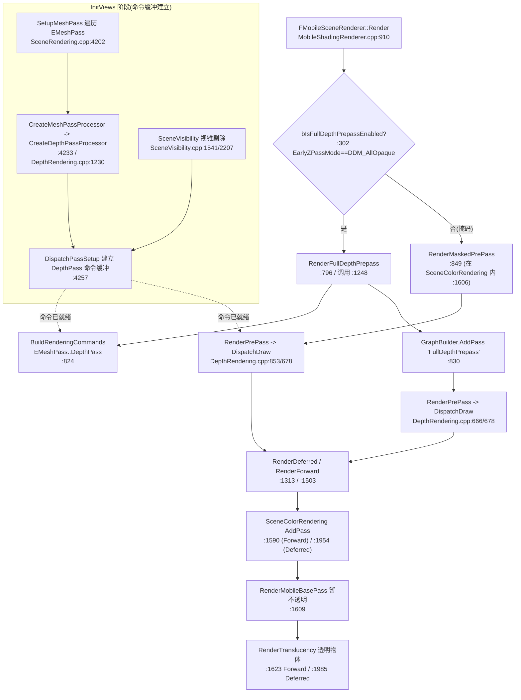
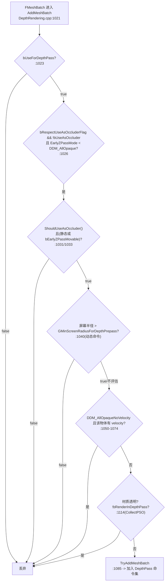
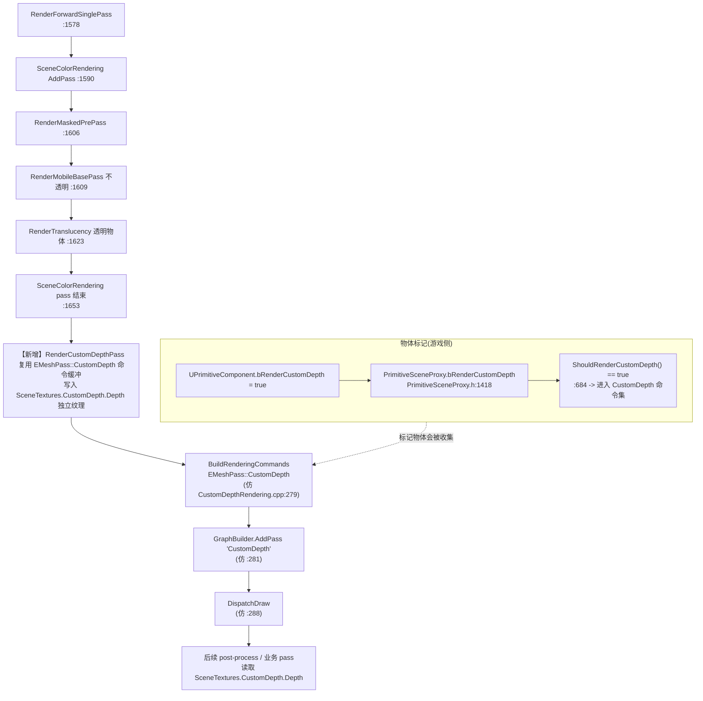

# 移动端 Forward 管线复用延时管线 DepthPass（透明后渲染标记物体深度）

> **问题引用**：
> "调用CodeGraph工具，我现在正在使用移动端Forward渲染管线，我想复用延时管线的DepthPass，在渲染完成透明物体之后渲染我标记的物体的深度留作后续使用，给我梳理移动端延时管线的DepthPass如何调用，如果过滤Mesh，如何添加进渲染队列等等，如果复用我需要做哪些更改，这些要梳理清晰，给出关键代码，并附有行号，最后梳理Mermaid"

---

## 0. 关键结论（先读这段）

1. **UE 中不存在"延时专用 DepthPass"和"移动专用 DepthPass"两套实现**。`EMeshPass::DepthPass` 与 `FDepthPassMeshProcessor` 是一套共享实现，通过 `REGISTER_MESHPASSPROCESSOR_AND_PSOCOLLECTOR` 同时注册到 `EShadingPath::Deferred` 和 `EShadingPath::Mobile`（`DepthRendering.cpp:1242-1243`）。所谓"延时管线的 DepthPass"和移动端用的 DepthPass 是**同一个东西**。

2. 因此"复用延时管线的 DepthPass"在工程上的真实含义是：**复用 `EMeshPass::DepthPass` 的 mesh-draw-command 基础设施**（`FDepthPassMeshProcessor` 处理器 + `ParallelMeshDrawCommandPasses[EMeshPass::DepthPass]` 命令缓冲 + `BuildRenderingCommands`/`DispatchDraw` 派发），而不是另起炉灶。

3. 但 `EMeshPass::DepthPass` 渲染的是**全部不透明/掩码物体的深度**（由 `bUseForDepthPass`/`bUseAsOccluder` 过滤），不是"标记物体"。如果要"只渲染我标记的物体"，正确范式是参照 **`EMeshPass::CustomDepth`（CustomDepth/Stencil）**——它本就是 UE 内置的"渲染被标记物体深度到独立纹理"功能（`CustomDepthRendering.cpp`），完全共用同一套 mesh-pass 注册与派发机制。

4. 用户当前是**移动 Forward** 管线，透明物体渲染位于 `RenderForwardSinglePass` 的 `SceneColorRendering` pass 内（`MobileShadingRenderer.cpp:1623 RenderTranslucency`）。要在"透明物体之后"输出一张供后续使用的标记物体深度图，最佳做法是：**在该 `SceneColorRendering` pass 之后，新增一个独立 RDG pass**，复用 DepthPass 的 RenderState + DispatchDraw 模式，绘制标记物体到一张独立深度纹理。

下文先完整梳理移动端（含延时）DepthPass 的调用链、过滤、入队，再给出复用方案。

---

## 1. DepthPass 架构总览

| 概念 | 位置 | 说明 |
|---|---|---|
| Mesh Pass 类型枚举 | `MeshPassProcessor.h:36` `EMeshPass::DepthPass` | 全局唯一的 DepthPass 类型标识 |
| 处理器类 | `DepthRendering.cpp:1206` `FDepthPassMeshProcessor` | 负责把 `FMeshBatch` 转成 `FMeshDrawCommand` 并过滤 |
| 处理器工厂 | `DepthRendering.cpp:1230` `CreateDepthPassProcessor` | 由 `FPassProcessorManager` 在 SetupMeshPass 时调用 |
| 双注册 | `DepthRendering.cpp:1242-1243` | Deferred + Mobile 共用同一处理器 |
| 渲染状态 | `DepthRendering.cpp:486` `SetupDepthPassState` | 关闭颜色写入、深度测试 NearOrEqual、写深度 |
| 移动端额外状态 | `DepthRendering.cpp:753` `SetMobileDepthPassRenderState` | 写 Stencil（ReceiveDecal/ShadingModel/LightingChannel） |
| 移动派发入口 | `DepthRendering.cpp:666` `FMobileSceneRenderer::RenderPrePass` | 调 `DispatchDraw` |
| 移动全深度 Prepass | `MobileShadingRenderer.cpp:796` `RenderFullDepthPrepass` | RDG AddPass + 调 RenderPrePass |
| 移动掩码 Prepass | `MobileShadingRenderer.cpp:849` `RenderMaskedPrePass` | 仅 DDM_MaskedOnly |
| 延时 RDG Prepass | `DepthRendering.cpp:495` `FDeferredShadingSceneRenderer::RenderPrePass` | 含并行/SecondStage |
| 命令构建 | `MobileShadingRenderer.cpp:824` `BuildRenderingCommands` | 把可见 mesh 转成 draw command |
| 命令派发 | `MobileShadingRenderer.cpp:836` / `DepthRendering.cpp:678` `DispatchDraw` | 真正提交 RHI 绘制 |
| Pass 注册到视图 | `SceneRendering.cpp:4257` `DispatchPassSetup` | InitViews 阶段为每个 EMeshPass 建立命令缓冲 |
| 可见性收集 | `SceneVisibility.cpp:1541/2207` | 视锥剔除后把 mesh 加入 DepthPass 命令集 |

---

## 2. 移动端 DepthPass 如何被调用（调用链 + 行号）

### 2.1 注册：Deferred 与 Mobile 共用同一处理器

```cpp
// DepthRendering.cpp:1242-1243
REGISTER_MESHPASSPROCESSOR_AND_PSOCOLLECTOR(DepthPass,        CreateDepthPassProcessor, EShadingPath::Deferred, EMeshPass::DepthPass, EMeshPassFlags::CachedMeshCommands | EMeshPassFlags::MainView);
REGISTER_MESHPASSPROCESSOR_AND_PSOCOLLECTOR(MobileDepthPass,  CreateDepthPassProcessor, EShadingPath::Mobile,   EMeshPass::DepthPass, EMeshPassFlags::CachedMeshCommands | EMeshPassFlags::MainView);
```

两条注册都用同一个 `CreateDepthPassProcessor`、同一个 `EMeshPass::DepthPass`。这就是"复用"在引擎层面的天然基础——**它们本来就是同一个 pass**。

### 2.2 处理器创建（含 EarlyZ 模式与渲染状态）

```cpp
// DepthRendering.cpp:1230-1240
FMeshPassProcessor* CreateDepthPassProcessor(ERHIFeatureLevel::Type FeatureLevel, const FScene* Scene, const FSceneView* InViewIfDynamicMeshCommand, FMeshPassDrawListContext* InDrawListContext)
{
    EDepthDrawingMode EarlyZPassMode;
    bool bEarlyZPassMovable;
    FScene::GetEarlyZPassMode(FeatureLevel, EarlyZPassMode, bEarlyZPassMovable);

    FMeshPassProcessorRenderState DepthPassState;
    SetupDepthPassState(DepthPassState);   // 见 2.3

    return new FDepthPassMeshProcessor(EMeshPass::DepthPass, Scene, FeatureLevel, InViewIfDynamicMeshCommand, DepthPassState, true/*bRespectUseAsOccluderFlag*/, EarlyZPassMode, bEarlyZPassMovable, false/*bDitheredLODFadingOutMaskPass*/, InDrawListContext);
}
```

### 2.3 渲染状态：关闭颜色、深度 NearOrEqual、写深度

```cpp
// DepthRendering.cpp:486-491
void SetupDepthPassState(FMeshPassProcessorRenderState& DrawRenderState)
{
    // Disable color writes, enable depth tests and writes.
    DrawRenderState.SetBlendState(TStaticBlendState<CW_NONE>::GetRHI());
    DrawRenderState.SetDepthStencilState(TStaticDepthStencilState<true, CF_DepthNearOrEqual>::GetRHI());
}
```

移动端延时额外写 Stencil（用于 Decal/光照模型/光照通道）：

```cpp
// DepthRendering.cpp:753-775（节选）
void SetMobileDepthPassRenderState(const FPrimitiveSceneProxy* RESTRICT PrimitiveSceneProxy, FMeshPassProcessorRenderState& DrawRenderState, const FMeshBatch& RESTRICT MeshBatch, bool bUsesDeferredShading)
{
    DrawRenderState.SetDepthStencilState(TStaticDepthStencilState<
        true, CF_DepthNearOrEqual,
        true, CF_Always, SO_Keep, SO_Keep, SO_Replace, ...>::GetRHI());
    uint8 StencilValue = 0;
    uint8 ReceiveDecals = (PrimitiveSceneProxy && !PrimitiveSceneProxy->ReceivesDecals() ? 0x01 : 0x00);
    StencilValue |= GET_STENCIL_BIT_MASK(RECEIVE_DECAL, ReceiveDecals);
    if (bUsesDeferredShading) {
        uint8 ShadingModel = GetMobileShadingModelStencilValue(MaterialResource.GetShadingModels());
        StencilValue |= GET_STENCIL_MOBILE_SM_MASK(ShadingModel);
        StencilValue |= STENCIL_LIGHTING_CHANNELS_MASK(...);
    }
    ...
}
```

### 2.4 移动端 Prepass 派发入口（DispatchDraw）

```cpp
// DepthRendering.cpp:666-679
void FMobileSceneRenderer::RenderPrePass(FRHICommandList& RHICmdList, const FViewInfo& View, const FInstanceCullingDrawParams* InstanceCullingDrawParams)
{
    checkSlow(RHICmdList.IsInsideRenderPass());
    ...
    SetStereoViewport(RHICmdList, View);
    View.ParallelMeshDrawCommandPasses[EMeshPass::DepthPass].DispatchDraw(nullptr, RHICmdList, InstanceCullingDrawParams);  // 678
}
```

### 2.5 移动端全深度 Prepass：RDG AddPass + BuildRenderingCommands

这是移动端调用 DepthPass 的"完整模板"，也是复用时最该模仿的结构：

```cpp
// MobileShadingRenderer.cpp:796-847（节选）
void FMobileSceneRenderer::RenderFullDepthPrepass(FRDGBuilder& GraphBuilder, TArrayView<FViewInfo> InViews, FSceneTextures& SceneTextures, bool bIsSceneCaptureRenderPass)
{
    FRenderTargetBindingSlots BasePassRenderTargets;
    BasePassRenderTargets.DepthStencil = FDepthStencilBinding(SceneTextures.Depth.Target, ERenderTargetLoadAction::EClear, ERenderTargetLoadAction::EClear, FExclusiveDepthStencil::DepthWrite_StencilWrite);
    ...
    for (FRenderViewContext& ViewContext : RenderViews)
    {
        FViewInfo& View = *ViewContext.ViewInfo;
        ...
        auto* PassParameters = GraphBuilder.AllocParameters<FMobileRenderPassParameters>();
        PassParameters->RenderTargets = BasePassRenderTargets;
        PassParameters->View = View.GetShaderParameters();
        PassParameters->MobileBasePass = CreateMobileBasePassUniformBuffer(GraphBuilder, View, EMobileBasePass::Opaque, EMobileSceneTextureSetupMode::None);

        // ① 构建 mesh draw command（把可见 mesh 转成绘制命令）
        View.ParallelMeshDrawCommandPasses[EMeshPass::DepthPass].BuildRenderingCommands(GraphBuilder, Scene->GPUScene, PassParameters->InstanceCullingDrawParams);  // 824

        bool bDoOcclusionQueries = (ViewContext.bIsLastView && DoOcclusionQueries() && !bIsSceneCaptureRenderPass);

        // ② 注册到渲染队列（RDG AddPass）
        GraphBuilder.AddPass(
            RDG_EVENT_NAME("FullDepthPrepass"),
            PassParameters,
            ERDGPassFlags::Raster,
            [this, PassParameters, &View, bDoOcclusionQueries](FRHICommandList& RHICmdList)
            {
                // ③ 真正派发绘制
                RenderPrePass(RHICmdList, View, &PassParameters->InstanceCullingDrawParams);  // 836
                if (bDoOcclusionQueries) { ... RenderOcclusion(RHICmdList); }
            });
    }
    FenceOcclusionTests(GraphBuilder);
}
```

### 2.6 在移动端 Render 主流程中的调用位置

```cpp
// MobileShadingRenderer.cpp:1246-1248
if (bIsFullDepthPrepassEnabled)
{
    RenderFullDepthPrepass(GraphBuilder, Views, SceneTextures);   // 1248：全深度 Prepass
    ...
}
```

而 `bIsFullDepthPrepassEnabled` 在构造时根据 `EarlyZPassMode` 决定：

```cpp
// MobileShadingRenderer.cpp:302-303
bIsFullDepthPrepassEnabled = Scene->EarlyZPassMode == DDM_AllOpaque;
bIsMaskedOnlyDepthPrepassEnabled = Scene->EarlyZPassMode == DDM_MaskedOnly;
```

> 注意：移动 Forward 在 `SceneColorRendering` 单 pass 内还会做一次 `RenderMaskedPrePass`（`MobileShadingRenderer.cpp:1606`），用于在 BasePass 前补掩码物体的 EarlyZ。这是与延时路径并行的另一处 DepthPass 调用点。

---

## 3. DepthPass 如何过滤 Mesh

### 3.1 处理器构造与过滤入口

```cpp
// DepthRendering.cpp:1206-1228（构造，记录过滤参数）
FDepthPassMeshProcessor::FDepthPassMeshProcessor(
    EMeshPass::Type InMeshPassType, const FScene* Scene, ERHIFeatureLevel::Type FeatureLevel,
    const FSceneView* InViewIfDynamicMeshCommand, const FMeshPassProcessorRenderState& InPassDrawRenderState,
    const bool InbRespectUseAsOccluderFlag, const EDepthDrawingMode InEarlyZPassMode,
    const bool InbEarlyZPassMovable, const bool bDitheredLODFadingOutMaskPass,
    FMeshPassDrawListContext* InDrawListContext, const bool bInShadowProjection, const bool bInSecondStageDepthPass)
    : FMeshPassProcessor(InMeshPassType, Scene, FeatureLevel, InViewIfDynamicMeshCommand, InDrawListContext)
    , bRespectUseAsOccluderFlag(InbRespectUseAsOccluderFlag)
    , EarlyZPassMode(InEarlyZPassMode)
    , bEarlyZPassMovable(InbEarlyZPassMovable)
    ...
```

### 3.2 AddMeshBatch：核心过滤逻辑

```cpp
// DepthRendering.cpp:1021-1094（节选）
void FDepthPassMeshProcessor::AddMeshBatch(const FMeshBatch& RESTRICT MeshBatch, uint64 BatchElementMask, const FPrimitiveSceneProxy* RESTRICT PrimitiveSceneProxy, int32 StaticMeshId)
{
    bool bDraw = MeshBatch.bUseForDepthPass;                                   // 1023：mesh 级开关

    // 过滤 1：occluder 标志 + 静态/可动 + 屏幕半径
    if (bDraw && bRespectUseAsOccluderFlag && !MeshBatch.bUseAsOccluder && EarlyZPassMode < DDM_AllOpaque)
    {
        if (PrimitiveSceneProxy)
        {
            bDraw = PrimitiveSceneProxy->ShouldUseAsOccluder()                 // 1031：只画标记为 occluder 的
                && (!PrimitiveSceneProxy->IsMovable() || bEarlyZPassMovable);  // 1033：默认只画静态

            if (ViewIfDynamicMeshCommand)                                       // 1036：动态命令按屏幕尺寸过滤
            {
                extern float GMinScreenRadiusForDepthPrepass;
                const float LODFactorDistanceSquared = ...;
                bDraw = bDraw && FMath::Square(PrimitiveSceneProxy->GetBounds().SphereRadius) > GMinScreenRadiusForDepthPrepass * ...;  // 1040
            }
        }
        else { bDraw = false; }
    }

    // 过滤 2：DDM_AllOpaqueNoVelocity 时跳过会在 velocity pass 写深度的物体
    if (EarlyZPassMode == DDM_AllOpaqueNoVelocity && PrimitiveSceneProxy) { ... bDraw = false; }  // 1050-1074

    if (bDraw)                                                                   // 1076
    {
        const FMaterialRenderProxy* MaterialRenderProxy = MeshBatch.MaterialRenderProxy;
        while (MaterialRenderProxy)
        {
            const FMaterial* Material = MaterialRenderProxy->GetMaterialNoFallback(FeatureLevel);
            if (Material && Material->GetRenderingThreadShaderMap())
            {
                if (TryAddMeshBatch(MeshBatch, BatchElementMask, PrimitiveSceneProxy, StaticMeshId, *MaterialRenderProxy, *Material))  // 1085
                    break;
            }
            MaterialRenderProxy = MaterialRenderProxy->GetFallback(FeatureLevel);
        }
    }
}
```

### 3.3 材质级过滤：透明与材质域

```cpp
// DepthRendering.cpp:1111-1120（CollectPSOInitializers 中，PSO 收集阶段）
const bool bIsTranslucent = IsTranslucentBlendMode(Material);

// Early out if translucent or material shouldn't be used during this pass
if (bIsTranslucent ||                                            // ① 透明材质不进 DepthPass
    !PreCacheParams.bRenderInDepthPass ||                       // ② 材质声明不渲染深度
    !ShouldIncludeDomainInMeshPass(Material.GetMaterialDomain()) ||
    !ShouldIncludeMaterialInDefaultOpaquePass(Material))
{
    return;
}
```

### 3.4 MeshBatch 上的标志位（标记物料的落点）

```cpp
// StaticMeshBatch.h:74-75
uint8 bUseForDepthPass : 1;  // Whether it can be used in depth pass.
uint8 bUseAsOccluder : 1;    // User hint whether it's a good occluder.
```

> 结论：DepthPass 的过滤是"黑名单式全量"——能进来的默认是不透明/掩码且 `bUseForDepthPass` 为真的物体。它**没有**"只画我标记的物体"这一选项。这正是为何"标记物体深度"要参照 CustomDepth（见第 5 节）。

---

## 4. DepthPass 如何添加进渲染队列

### 4.1 InitViews 阶段：为每个 EMeshPass 建立命令缓冲

```cpp
// SceneRendering.cpp:4202-4268（节选）
const EShadingPath ShadingPath = GetFeatureLevelShadingPath(Scene->GetFeatureLevel());
for (int32 PassIndex = 0; PassIndex < EMeshPass::Num; PassIndex++)
{
    const EMeshPass::Type PassType = (EMeshPass::Type)PassIndex;
    if ((FPassProcessorManager::GetPassFlags(ShadingPath, PassType) & EMeshPassFlags::MainView) != EMeshPassFlags::None)  // 4206
    {
        ...
        // 用注册的工厂创建处理器（DepthPass → CreateDepthPassProcessor）
        FMeshPassProcessor* MeshPassProcessor = FPassProcessorManager::CreateMeshPassProcessor(ShadingPath, PassType, Scene->GetFeatureLevel(), Scene, &View, nullptr);  // 4233

        FParallelMeshDrawCommandPass& Pass = View.ParallelMeshDrawCommandPasses[PassIndex];  // 4235
        ...
        Pass.DispatchPassSetup(                              // 4257：建立命令缓冲
            Scene, View,
            FInstanceCullingContext(PassName, ShaderPlatform, &InstanceCullingManager, ViewIds, View.PrevViewInfo.HZB, InstanceCullingMode, CullingFlags),
            PassType, BasePassDepthStencilAccess, MeshPassProcessor,
            View.DynamicMeshElements, &View.DynamicMeshElementsPassRelevance,
            View.NumVisibleDynamicMeshElements[PassType],
            ViewCommands.DynamicMeshCommandBuildRequests[PassType],
            ViewCommands.DynamicMeshCommandBuildFlags[PassType], ...);
    }
}
```

### 4.2 可见性收集：把可见 mesh 加入 DepthPass 命令集

```cpp
// SceneVisibility.cpp:1541
DrawCommandPacket.AddCommandsForMesh(PrimitiveIndex, PrimitiveSceneInfo, StaticMeshRelevance, StaticMesh, CullingPayloadFlags, Scene, bCanCache, EMeshPass::DepthPass);

// SceneVisibility.cpp:2207-2208
PassMask.Set(EMeshPass::DepthPass);
View.NumVisibleDynamicMeshElements[EMeshPass::DepthPass] += NumElements;
```

### 4.3 渲染阶段：Build → AddPass → DispatchDraw

见 2.5 的三步：
1. `BuildRenderingCommands`（`MobileShadingRenderer.cpp:824`）——把可见 mesh 编译成 `FMeshDrawCommand`；
2. `GraphBuilder.AddPass(..., ERDGPassFlags::Raster, lambda)`（`:830`）——注册到 RDG 渲染队列；
3. `DispatchDraw`（`DepthRendering.cpp:678`，经 `RenderPrePass`）——提交 RHI 绘制。

---

## 5. "标记物体深度"的现成范式：CustomDepth（强烈建议先看）

UE 已内置一个"只画被标记物体、输出到独立深度纹理"的 pass——**CustomDepth**，它和 DepthPass 用的是同一套机制。复用 DepthPass 思路时，CustomDepth 是最直接的参照与可复用对象。

### 5.1 注册（同样双注册 Deferred/Mobile）

```cpp
// CustomDepthRendering.cpp:797-798
REGISTER_MESHPASSPROCESSOR_AND_PSOCOLLECTOR(RegisterCustomDepthPass,      CreateCustomDepthPassProcessor, EShadingPath::Deferred, EMeshPass::CustomDepth, EMeshPassFlags::MainView);
REGISTER_MESHPASSPROCESSOR_AND_PSOCOLLECTOR(RegisterMobileCustomDepthPass, CreateCustomDepthPassProcessor, EShadingPath::Mobile,   EMeshPass::CustomDepth, EMeshPassFlags::MainView);
```

### 5.2 处理器：仅画 `ShouldRenderCustomDepth()` 的物体

```cpp
// CustomDepthRendering.cpp:465-491
FCustomDepthPassMeshProcessor::FCustomDepthPassMeshProcessor(...)
    : FMeshPassProcessor(EMeshPass::CustomDepth, Scene, FeatureLevel, InViewIfDynamicMeshCommand, InDrawListContext)
{
    PassDrawRenderState.SetBlendState(TStaticBlendState<>::GetRHI());                       // 468：注意这里是默认 blend（有颜色），与 DepthPass 的 CW_NONE 不同
    PassDrawRenderState.SetDepthStencilState(TStaticDepthStencilState<true, CF_DepthNearOrEqual>::GetRHI());  // 469
}

void FCustomDepthPassMeshProcessor::AddMeshBatch(const FMeshBatch& RESTRICT MeshBatch, uint64 BatchElementMask, const FPrimitiveSceneProxy* RESTRICT PrimitiveSceneProxy, int32 StaticMeshId)
{
    if (PrimitiveSceneProxy->ShouldRenderCustomDepth())                                       // 474：标记位过滤
    {
        ... TryAddMeshBatch(MeshBatch, BatchElementMask, PrimitiveSceneProxy, StaticMeshId, *MaterialRenderProxy, *Material);  // 482
    }
}
```

### 5.3 标记 API（PrimitiveSceneProxy）

```cpp
// PrimitiveSceneProxy.h:684 / 1418
ENGINE_API bool ShouldRenderCustomDepth() const;   // 由 bRenderCustomDepth 等决定
uint8 bRenderCustomDepth : 1;                      // 1418：UPrimitiveComponent.bRenderCustomDepth 同步过来
inline uint8 GetCustomDepthStencilValue() const;    // 687：自定义 stencil 值
inline EStencilMask GetStencilWriteMask() const;   // 688
```

游戏侧在 `UPrimitiveComponent` 上设 `bRenderCustomDepth = true` 即可标记。

### 5.4 渲染入口：写入独立深度纹理

```cpp
// CustomDepthRendering.cpp:179-290（节选）
bool FSceneRenderer::RenderCustomDepthPass(FRDGBuilder& GraphBuilder, FCustomDepthTextures& CustomDepthTextures, const FSceneTextureShaderParameters& SceneTextures, ...)
{
    if (!CustomDepthTextures.IsValid()) return false;                                        // 186
    ...
    bool bAnyCustomDepth = false;
    for (...) { if (!View.ShouldRenderView() || !View.bHasCustomDepthPrimitives) continue; ... bAnyCustomDepth = true; }  // 213
    if (!bAnyCustomDepth) return false;                                                       // 247

    for (int32 ViewIndex = 0; ViewIndex < Views.Num(); ++ViewIndex)
    {
        FViewInfo& View = Views[ViewIndex];
        if (View.ShouldRenderView() && View.bHasCustomDepthPrimitives)                       // 260
        {
            FCustomDepthPassParameters* PassParameters = GraphBuilder.AllocParameters<FCustomDepthPassParameters>();
            PassParameters->SceneTextures = SceneTextures;
            PassParameters->View = TempViewParams[ViewIndex].ViewParams;

            const ERenderTargetLoadAction DepthLoadAction = GetLoadActionIfProduced(CustomDepthTextures.Depth, CustomDepthTextures.DepthAction);  // 270
            ...
            PassParameters->RenderTargets.DepthStencil = FDepthStencilBinding(               // 273：绑定独立深度纹理
                CustomDepthTextures.Depth, DepthLoadAction, StencilLoadAction,
                FExclusiveDepthStencil::DepthWrite_StencilWrite);

            View.ParallelMeshDrawCommandPasses[EMeshPass::CustomDepth].BuildRenderingCommands(GraphBuilder, Scene->GPUScene, PassParameters->InstanceCullingDrawParams);  // 279

            GraphBuilder.AddPass(
                RDG_EVENT_NAME("CustomDepth"), PassParameters, ERDGPassFlags::Raster,
                [this, &View, PassParameters](FRHICommandList& RHICmdList)
            {
                SetStereoViewport(RHICmdList, View, 1.0f);
                View.ParallelMeshDrawCommandPasses[EMeshPass::CustomDepth].DispatchDraw(nullptr, RHICmdList, &PassParameters->InstanceCullingDrawParams);  // 288
            });
        }
    }
    ...
}
```

移动端在 `Render()` 主流程中的调用点（**注意：在透明之前**）：

```cpp
// MobileShadingRenderer.cpp:1169-1172
// bShouldRenderCustomDepth has been initialized in InitViews on mobile platform
if (bShouldRenderCustomDepth)
{
    RenderCustomDepthPass(GraphBuilder, SceneTextures.CustomDepth, SceneTextures.GetSceneTextureShaderParameters(FeatureLevel), {}, {});  // 1172
}
```

`bShouldRenderCustomDepth` 在 InitViews 里由各 view 的 `bCustomDepthStencilValid` 累加（`MobileShadingRenderer.cpp:649`）。

---

## 6. 复用方案：移动 Forward 透明物体之后渲染标记物体深度

用户在移动 **Forward** 管线，要求"透明物体之后"输出标记物体深度。结合上面分析，推荐两种方案，按改动量从小到大：

### 方案 A（推荐，改动最小）：直接复用 CustomDepth，仅改调用时机

CustomDepth 已满足"标记物体 + 独立深度纹理"全部需求，唯一问题是它在移动端默认**透明之前**调用（`MobileShadingRenderer.cpp:1172`）。只要把它（或其拷贝）挪到透明之后即可。

移动 Forward 透明渲染位于 `RenderForwardSinglePass` 的 `SceneColorRendering` pass 内（`MobileShadingRenderer.cpp:1623`）：

```cpp
// MobileShadingRenderer.cpp:1590-1653（结构示意）
GraphBuilder.AddPass(RDG_EVENT_NAME("SceneColorRendering"), PassParameters, ERDGPassFlags::Raster | ERDGPassFlags::NeverMerge,
[this, PassParameters, ViewContext, bDoOcclusionQueries, &SceneTextures](FRHICommandList& RHICmdList)
{
    ...
    RenderMaskedPrePass(RHICmdList, View);                  // 1606
    RenderMobileBasePass(RHICmdList, View, ...);             // 1609
    ...
    RenderTranslucency(RHICmdList, View);                   // 1623 ← 透明物体渲染在此
    ...
});
// resolve MSAA depth
if (!bIsFullDepthPrepassEnabled) { AddResolveSceneDepthPass(GraphBuilder, *ViewContext.ViewInfo, SceneTextures.Depth); }  // 1656-1658
```

**改动**：在 `RenderForwardSinglePass`（或 `RenderForwardMultiPass:1662`）之后、或 `RenderForward`(`:1503`) 内部追加一个独立 RDG pass，调用 `RenderCustomDepthPass`（或其封装），把 `CustomDepthTextures.Depth` 作为后续 pass 的输入纹理。

伪代码（追加到 `RenderForwardSinglePass` 末尾，`MobileShadingRenderer.cpp:1660` 之前）：

```cpp
// 新增：透明之后渲染标记物体深度，复用 CustomDepth 的处理器与命令缓冲
if (bShouldRenderCustomDepth)
{
    // CustomDepth 命令缓冲已在 InitViews 阶段通过 DispatchPassSetup 建好（SceneRendering.cpp:4257）
    // 这里只需再派发一次到独立纹理（或在已有 RenderCustomDepthPass 调用上调整时机）
    RenderCustomDepthPass(GraphBuilder, SceneTextures.CustomDepth,
        SceneTextures.GetSceneTextureShaderParameters(FeatureLevel), {}, {});
    // 之后即可在后续 pass 中通过 SceneTextures.CustomDepth.Depth 读取该深度图
}
```

> 关键点：`EMeshPass::CustomDepth` 的命令缓冲在 InitViews 已建立（`SceneVisibility.cpp:1601/2236`），无需重建；只是把"派发到独立纹理"这一步从透明前移到透明后。`CustomDepthTextures.Depth` 是独立的 `FRDGTextureRef`，与场景深度 `SceneTextures.Depth` 分离，天然满足"留作后续使用"。

### 方案 B（自定义标记，不复用 CustomDepth 的标记语义）：新增专属 MeshPass

若用户的"标记"不是 `bRenderCustomDepth`，而是自定义标志（例如自定义 PrimitiveSceneProxy 字段 `bRenderMarkedDepth`），则仿照 CustomDepth 新增一个 pass：

1. **新增枚举**：在 `MeshPassProcessor.h:36` 的 `EMeshPass` 中加 `MarkedDepthPass`（紧随 `CustomDepth:56`）。
2. **新增处理器**：在 `CustomDepthRendering.cpp`（或新文件）仿照 `FCustomDepthPassMeshProcessor`(`:418`) 写 `FMarkedDepthPassMeshProcessor`，`AddMeshBatch` 改为判断自定义标记位（参照 `:474`）。
3. **注册**：
   ```cpp
   REGISTER_MESHPASSPROCESSOR_AND_PSOCOLLECTOR(MarkedDepthPass, CreateMarkedDepthPassProcessor, EShadingPath::Mobile, EMeshPass::MarkedDepthPass, EMeshPassFlags::MainView);
   ```
   （参照 `CustomDepthRendering.cpp:798`）
4. **可见性收集**：在 `SceneVisibility.cpp:1601/2236` 旁加 `AddCommandsForMesh(..., EMeshPass::MarkedDepthPass)` 与 `PassMask.Set(EMeshPass::MarkedDepthPass)`。
5. **渲染入口**：仿照 `RenderCustomDepthPass`(`:179`) 写 `RenderMarkedDepthPass`，在透明之后调用；命令缓冲的 Build/Dispatch 沿用 `View.ParallelMeshDrawCommandPasses[EMeshPass::MarkedDepthPass].BuildRenderingCommands/DispatchDraw`（参照 `:279/288`）。

方案 B 改动大、需重新编译 Renderer 模块且要维护新 MeshPass 的 PSO 预收集。**除非确实不能用 CustomDepth 的标记语义，否则优先选方案 A。**

### 方案 A 所需完整更改清单

| # | 文件 | 行号附近 | 改动 |
|---|---|---|---|
| 1 | `MobileShadingRenderer.cpp` | `1170-1172` | 将原有透明前的 `RenderCustomDepthPass` 调用**删除或改为按需延后**（若该 depth 也需被透明材质采样则保留两处） |
| 2 | `MobileShadingRenderer.cpp` | `1623` 之后 / `1653` 之前 | 在 `RenderForwardSinglePass` 内透明之后追加 `RenderCustomDepthPass` 调用（透明后写入 `SceneTextures.CustomDepth.Depth`） |
| 3 | `MobileShadingRenderer.cpp` | `1735`（MultiPass） | 同步在 `RenderForwardMultiPass` 的 `RenderTranslucency`(`:1735`) 之后做同样处理，保证单/多 pass 一致 |
| 4 | 业务代码 | — | 对需渲染深度的 `UPrimitiveComponent` 设 `bRenderCustomDepth = true`（→ `PrimitiveSceneProxy.bRenderCustomDepth`，`PrimitiveSceneProxy.h:1418` → `ShouldRenderCustomDepth()` `:684`） |
| 5 | 后续使用方 | — | 在透明后 pass 中以 `SceneTextures.CustomDepth.Depth` 作为输入纹理读取标记物体深度 |

> 说明：DepthPass 自身（`EMeshPass::DepthPass`/`FDepthPassMeshProcessor`）**无需任何修改**——它本来就是 Deferred 与 Mobile 共用的。所谓"复用延时管线的 DepthPass"在此方案里体现为：复用与 DepthPass 完全同构的 mesh-pass 注册/Build/Dispatch 体系（CustomDepth 就是这一体系的另一个实例）。

---

## 7. 复用要点与注意事项

1. **命令缓冲是一次性建立的**：`EMeshPass::DepthPass` / `EMeshPass::CustomDepth` 的 `FMeshDrawCommand` 在 InitViews 的 `DispatchPassSetup`（`SceneRendering.cpp:4257`）阶段就建好了；渲染阶段只做 `BuildRenderingCommands`（更新实例剔除参数）+ `DispatchDraw`。复用时不要重复 `DispatchPassSetup`。
2. **必须 `BeginRenderView()`**：CustomDepth 在 `:264` 调 `View.BeginRenderView()`，DepthPass 的 `RenderFullDepthPrepass` 在 `:817` 调。新增 pass 前若在 RDG pass lambda 内，需确保 view 状态已初始化。
3. **纹理独立性**：`SceneTextures.Depth`（场景深度，透明前已写）与 `SceneTextures.CustomDepth.Depth`（标记深度）是两张不同纹理。要"留作后续使用"且不被场景深度污染，必须用独立纹理绑定（`CustomDepthRendering.cpp:273` 的 `FDepthStencilBinding`）。
4. **透明后调用对 EarlyZ 的影响**：把深度 pass 挪到透明后不影响 BasePass 的 EarlyZ（BasePass 在透明前）。但若该标记深度用于后续 post-process，需保证它在 post-process 之前完成（移动 Forward 的 post 在 `:1404 AddMobilePostProcessingPasses`，当前插入点在其之前，OK）。
5. **MSAA**：移动 Forward 单 pass 常带 MSAA subpass。独立深度纹理若要采样，需 resolve；可仿照 `AddResolveSceneDepthPass`（`MobileShadingRenderer.cpp:1658`）对 CustomDepth 做 resolve。
6. **Masked Prepass 不受影响**：`RenderMaskedPrePass`（`:849`）仍在 BasePass 前调用，本次改动只动 CustomDepth 的时机。

---

## 8. Mermaid 流程图

### 8.1 移动端 DepthPass 调用链（现有）



### 8.2 Mesh 过滤逻辑（FDepthPassMeshProcessor::AddMeshBatch）



### 8.3 复用方案 A：透明后渲染标记物体深度（目标态）



---

## 附：关键文件与行号速查

| 文件 | 行号 | 内容 |
|---|---|---|
| `MeshPassProcessor.h` | 36 / 56 | `EMeshPass::DepthPass` / `EMeshPass::CustomDepth` |
| `StaticMeshBatch.h` | 74-75 | `bUseForDepthPass` / `bUseAsOccluder` |
| `PrimitiveSceneProxy.h` | 684 / 1418 | `ShouldRenderCustomDepth()` / `bRenderCustomDepth` |
| `DepthRendering.cpp` | 486 | `SetupDepthPassState` |
| `DepthRendering.cpp` | 495 / 513 / 593 | 延时 `RenderPrePass` / `RenderDepthPass` lambda / 调用 |
| `DepthRendering.cpp` | 666 / 678 | 移动 `RenderPrePass` / `DispatchDraw` |
| `DepthRendering.cpp` | 753 | `SetMobileDepthPassRenderState` |
| `DepthRendering.cpp` | 1021-1094 | `FDepthPassMeshProcessor::AddMeshBatch` 过滤 |
| `DepthRendering.cpp` | 1111-1120 | 材质透明/材质域过滤 |
| `DepthRendering.cpp` | 1206 / 1230 / 1242-1243 | 处理器构造 / 工厂 / 双注册 |
| `MobileShadingRenderer.cpp` | 302-303 / 649 / 1170-1172 / 1248 | 开关 / CustomDepth 标志 / CustomDepth 调用 / FullDepthPrepass 调用 |
| `MobileShadingRenderer.cpp` | 796-847 | `RenderFullDepthPrepass`（Build+AddPass+Dispatch 三步模板） |
| `MobileShadingRenderer.cpp` | 849-855 | `RenderMaskedPrePass` |
| `MobileShadingRenderer.cpp` | 1578 / 1606 / 1609 / 1623 | Forward 单 pass / MaskedPre / BasePass / Translucency |
| `MobileShadingRenderer.cpp` | 1947 / 1985 / 1996 / 2068 | Deferred 单 pass / Translucency / Multi pass / Translucency |
| `CustomDepthRendering.cpp` | 179 / 213 / 260 / 273 / 279 / 281 / 288 | `RenderCustomDepthPass` 全流程 |
| `CustomDepthRendering.cpp` | 418 / 465-470 / 472-491 / 794 / 797-798 | 处理器 / 构造 / 过滤 / 工厂 / 双注册 |
| `SceneRendering.cpp` | 4202 / 4218-4219 / 4233 / 4257 | `SetupMeshPass` 循环 / DepthPass+CustomDepth case / 创建处理器 / `DispatchPassSetup` |
| `SceneVisibility.cpp` | 1541 / 2207 / 1601 / 2236 | DepthPass / CustomDepth 可见性收集 |
