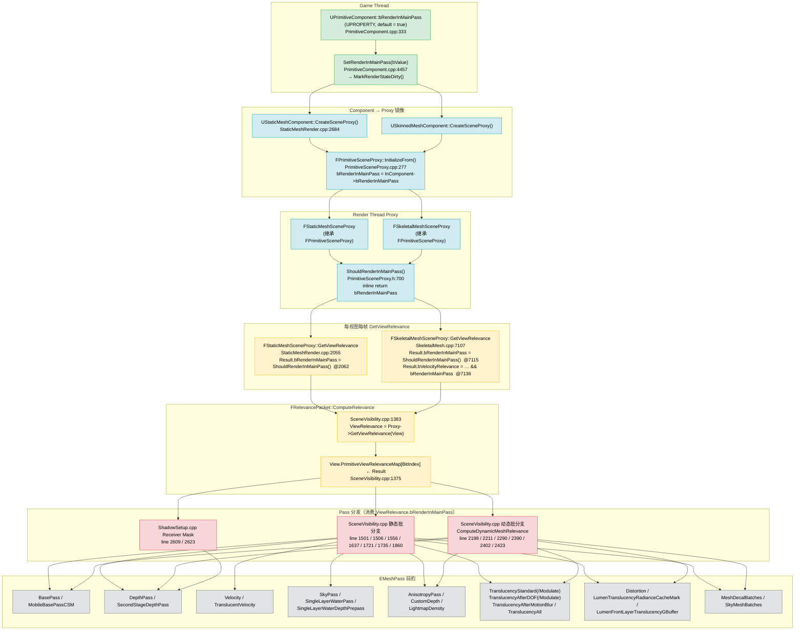
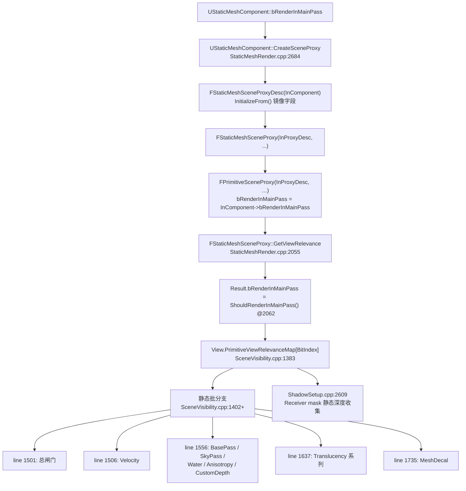
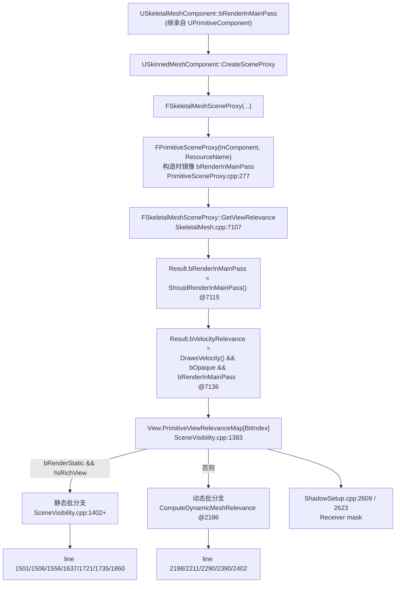
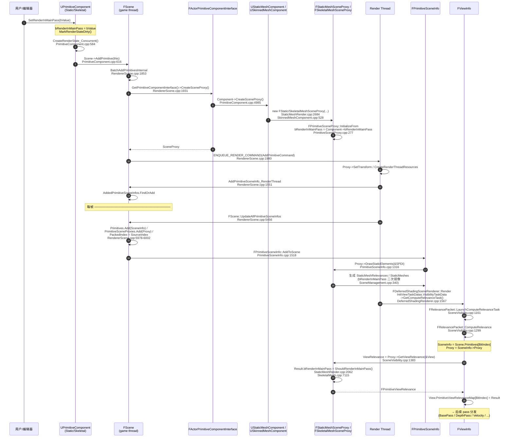
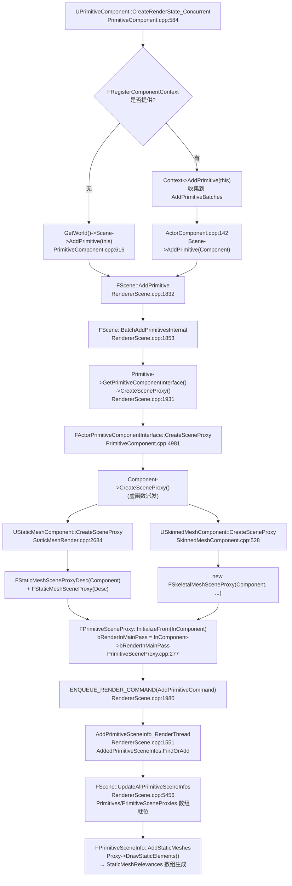
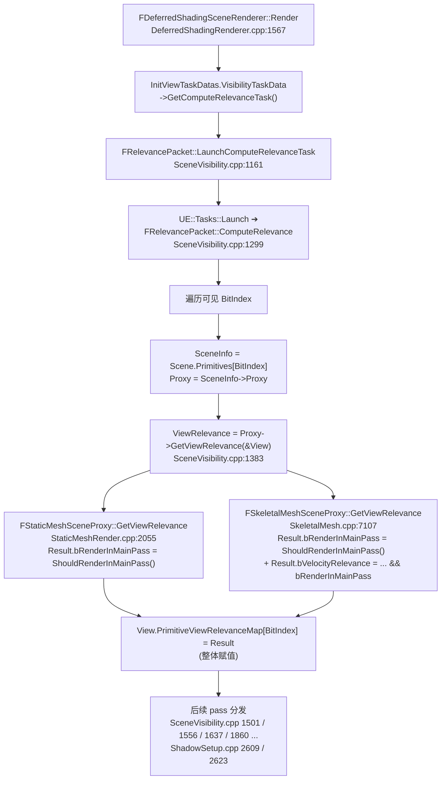

# `FPrimitiveViewRelevance::bRenderInMainPass` 自上向下完整调用链 — StaticMesh & SkeletalMesh

> 目标字段：`FPrimitiveViewRelevance::bRenderInMainPass`（`Engine/Source/Runtime/Engine/Public/PrimitiveViewRelevance.h:54`）
> 关注范围：**仅** `FStaticMeshSceneProxy` 与 `FSkeletalMeshSceneProxy` 相关的数据流
> 引擎版本：UE 5.4（MR01_DaNaoTianGong_Main）

---

## 0. 一句话总览

```
UPrimitiveComponent.bRenderInMainPass (game thread, 用户设置)
        ↓ Component → Proxy 镜像 (CreateSceneProxy / Init)
FPrimitiveSceneProxy.bRenderInMainPass (render thread)
        ↓ ShouldRenderInMainPass() 内联返回
FStaticMeshSceneProxy::GetViewRelevance() / FSkeletalMeshSceneProxy::GetViewRelevance()
        ↓ 每视图每帧调用
FPrimitiveViewRelevance.bRenderInMainPass  ← 本文目标字段
        ↓ 写入 View.PrimitiveViewRelevanceMap[BitIndex]
SceneVisibility.cpp / ShadowSetup.cpp 中作为条件，分配到对应的 EMeshPass
        ↓
EMeshPass::BasePass / DepthPass / Velocity / CustomDepth / Translucency / SkyPass / ...
```

---

## 1. 上游：游戏线程 Component 数据源

### 1.1 `UPrimitiveComponent::bRenderInMainPass`

| 文件:行 | 内容 |
|---------|------|
| `Engine/Source/Runtime/Engine/Classes/Components/PrimitiveComponent.h` | `uint8 bRenderInMainPass:1;`（UPROPERTY，Render 类目下用户可编辑） |
| `Engine/Source/Runtime/Engine/Private/Components/PrimitiveComponent.cpp:333` | `bRenderInMainPass = true;`（构造函数默认值） |
| `Engine/Source/Runtime/Engine/Private/Components/PrimitiveComponent.cpp:4457-4463` | `void UPrimitiveComponent::SetRenderInMainPass(bool bValue)` — 写入字段后调用 `MarkRenderStateDirty()`，从而触发 proxy 重建 |

**适用对象**：
- `UStaticMeshComponent` 继承自 `UMeshComponent` → `UPrimitiveComponent`
- `USkeletalMeshComponent` / `USkinnedMeshComponent` 同样继承自 `UPrimitiveComponent`

二者**共享同一个** `UPrimitiveComponent::bRenderInMainPass` 字段，没有专属覆盖。

### 1.2 PSO 预缓存路径（旁支，仅作记录）

| 文件:行 | 作用 |
|---------|------|
| `Engine/Source/Runtime/Engine/Private/Components/PrimitiveComponent.cpp:4622` | `Params.bRenderInMainPass = bRenderInMainPass;`（写入 `FPSOPrecacheParams`） |
| `Engine/Source/Runtime/Engine/Public/PSOPrecache.h:34` | `FPSOPrecacheParams` 默认 `bRenderInMainPass = true` |

此路径不影响运行时可见性，仅用于 PSO 收集。

---

## 2. 中转：Component → Proxy 字段镜像

### 2.1 `FPrimitiveSceneProxy::bRenderInMainPass`

| 文件:行 | 内容 |
|---------|------|
| `Engine/Source/Runtime/Engine/Public/PrimitiveSceneProxy.h:700` | `inline bool ShouldRenderInMainPass() const { return bRenderInMainPass; }` |
| `Engine/Source/Runtime/Engine/Private/PrimitiveSceneProxy.cpp:277` | `bRenderInMainPass = InComponent->bRenderInMainPass;`（构造时一次性镜像） |

### 2.2 StaticMesh 路径

- `FStaticMeshSceneProxy` 继承 `FPrimitiveSceneProxy`，**不重写** `bRenderInMainPass` 字段。
- 由 `UStaticMeshComponent::CreateSceneProxy()`（`StaticMeshRender.cpp:2684`）经 `FStaticMeshSceneProxyDesc(InComponent)` → `FStaticMeshSceneProxy(...)` → `FPrimitiveSceneProxy(InProxyDesc, ...)` 构造，期间字段已被 `InitializeFrom` 镜像。

### 2.3 SkeletalMesh 路径

- `FSkeletalMeshSceneProxy` 同样继承 `FPrimitiveSceneProxy`，**不重写**该字段。
- 由 `USkinnedMeshComponent::CreateSceneProxy()` 构造，调用基类 `FPrimitiveSceneProxy` 构造函数完成字段镜像。

### 2.4 中转结构（可选）

| 文件:行 | 字段 | 说明 |
|---------|------|------|
| `Engine/Source/Runtime/Engine/Public/PrimitiveSceneProxyDesc.h:25` | `bRenderInMainPass = true;` | `FPrimitiveSceneProxyDesc` 默认值 |
| `Engine/Source/Runtime/Engine/Private/SceneManagement.cpp:340` | `bRenderInMainPass = PrimitiveSceneProxy->ShouldRenderInMainPass();` | `FStaticMeshBatchRelevance` 构造时记录（每个 batch 的 cached 副本） |

---

## 3. 核心生产点：`GetViewRelevance` 写入 `FPrimitiveViewRelevance::bRenderInMainPass`

### 3.1 StaticMesh —— `FStaticMeshSceneProxy::GetViewRelevance`

文件：`Engine/Source/Runtime/Engine/Private/StaticMeshRender.cpp:2055`

```cpp
FPrimitiveViewRelevance FStaticMeshSceneProxy::GetViewRelevance(const FSceneView* View) const
{
    checkSlow(IsInParallelRenderingThread());

    FPrimitiveViewRelevance Result;
    Result.bDrawRelevance      = IsShown(View) && View->Family->EngineShowFlags.StaticMeshes;
    Result.bRenderCustomDepth  = ShouldRenderCustomDepth();
    Result.bRenderInMainPass   = ShouldRenderInMainPass();      // ← 关键赋值（StaticMeshRender.cpp:2062）
    Result.bRenderInDepthPass  = ShouldRenderInDepthPass();
    Result.bUsesLightingChannels = GetLightingChannelMask() != GetDefaultLightingChannelMask();
    Result.bTranslucentSelfShadow = bCastVolumetricTranslucentShadow;
    // ... bDynamicRelevance / bStaticRelevance / MaterialRelevance.SetPrimitiveViewRelevance(Result) ...
    return Result;
}
```

- 取值直接来自 `FPrimitiveSceneProxy::ShouldRenderInMainPass()`，即 proxy 内的 `bRenderInMainPass` 位。
- 在 `Result` 构造后默认就是 `true`（来自 `PrimitiveViewRelevance.h:103`），这里再做一次显式覆盖。
- 末尾 `MaterialRelevance.SetPrimitiveViewRelevance(Result)` 只会 OR 合并其它位（半透明/distortion 等），**不会修改** `bRenderInMainPass`。

### 3.2 SkeletalMesh —— `FSkeletalMeshSceneProxy::GetViewRelevance`

文件：`Engine/Source/Runtime/Engine/Private/SkeletalMesh.cpp:7107`

```cpp
FPrimitiveViewRelevance FSkeletalMeshSceneProxy::GetViewRelevance(const FSceneView* View) const
{
    FPrimitiveViewRelevance Result;
    Result.bDrawRelevance      = IsShown(View) && View->Family->EngineShowFlags.SkeletalMeshes;
    Result.bShadowRelevance    = IsShadowCast(View);
    Result.bStaticRelevance    = bRenderStatic && !IsRichView(*View->Family);
    Result.bDynamicRelevance   = !Result.bStaticRelevance;
    Result.bRenderCustomDepth  = ShouldRenderCustomDepth();
    Result.bRenderInMainPass   = ShouldRenderInMainPass();      // ← 关键赋值（SkeletalMesh.cpp:7115）
    Result.bRenderInDepthPass  = ShouldRenderInDepthPass();
    Result.bUsesLightingChannels = GetLightingChannelMask() != GetDefaultLightingChannelMask();
    Result.bTranslucentSelfShadow = bCastVolumetricTranslucentShadow;

    MaterialRelevance.SetPrimitiveViewRelevance(Result);

#if !UE_BUILD_SHIPPING
    Result.bSeparateTranslucency |= View->Family->EngineShowFlags.Constraints;
#endif

#if WITH_EDITOR
    if (Result.bStaticRelevance)
    {
        Result.bEditorStaticSelectionRelevance = (IsSelected() || IsHovered());
        Result.bEditorVisualizeLevelInstanceRelevance = IsEditingLevelInstanceChild();
    }
#endif

    // 注意：bVelocityRelevance 依赖 bRenderInMainPass — SkeletalMesh 独有
    Result.bVelocityRelevance = DrawsVelocity() && Result.bOpaque && Result.bRenderInMainPass;
    return Result;
}
```

**SkeletalMesh 独有的下游使用**：

```cpp
Result.bVelocityRelevance = DrawsVelocity() && Result.bOpaque && Result.bRenderInMainPass;
```

这是 `bRenderInMainPass` 在生产环节就被消费的**首处下游使用**：若 mesh 不进 BasePass，则不输出 velocity。

### 3.3 `Result` 的默认起点

`Engine/Source/Runtime/Engine/Public/PrimitiveViewRelevance.h:90-104`：

```cpp
FPrimitiveViewRelevance()
{
    uint8 * RESTRICT p = (uint8*)this;
    for(uint32 i = 0; i < sizeof(*this); ++i)
    {
        *p++ = 0;
    }
    bOpaque = true;
    bRenderInMainPass = true;   // ← 默认 true；注释：// without it BSP doesn't render
}
```

---

## 4. 写入 View 缓存：`PrimitiveViewRelevanceMap`

文件：`Engine/Source/Runtime/Renderer/Private/SceneVisibility.cpp:1299`（`FRelevancePacket::ComputeRelevance`）

```cpp
void FRelevancePacket::ComputeRelevance(FDynamicPrimitiveIndexList& DynamicPrimitiveIndexList)
{
    // ... iterate visible primitives ...
    FPrimitiveSceneInfo* PrimitiveSceneInfo = Scene.Primitives[BitIndex];
    FPrimitiveViewRelevance& ViewRelevance =
        const_cast<FPrimitiveViewRelevance&>(View.PrimitiveViewRelevanceMap[BitIndex]);

    const FPrimitiveSceneProxy* PrimitiveSceneProxy = PrimitiveSceneInfo->Proxy;

    FPlatformMisc::Prefetch(PrimitiveSceneInfo->StaticMeshRelevances.GetData());
    FPlatformMisc::Prefetch(PrimitiveSceneInfo->GetSceneData());

    ViewRelevance = PrimitiveSceneProxy->GetViewRelevance(&View);   // ← 调到 §3.1/§3.2
    ViewRelevance.bInitializedThisFrame = true;
    // ...
}
```

- `View.PrimitiveViewRelevanceMap` 是 `FViewInfo` 上每帧、每视图维护的可见性映射，按 primitive 索引存储 `FPrimitiveViewRelevance`。
- 该函数由 `FRelevancePacket::LaunchComputeRelevanceTask()` 在并行任务系统中调度（`SceneVisibility.cpp:1161-1192`），任务名 `ComputeRelevance`，依赖 `FrustumCull`。
- 顶层入口：`FDeferredShadingSceneRenderer::Render` → `InitViewTaskDatas.VisibilityTaskData->GetComputeRelevanceTask()`（`DeferredShadingRenderer.cpp:1567`）。

---

## 5. 下游消费：在 `SceneVisibility.cpp` / `ShadowSetup.cpp` 中决定走哪些 Pass

下面所有引用都是在 `ComputeRelevance` 完成后，循环 visible primitives 时读取 `ViewRelevance.bRenderInMainPass`。
**StaticMesh** 走的是"`bStaticRelevance && (bDrawRelevance || bShadowRelevance)`" 分支（`SceneVisibility.cpp:1402`），**SkeletalMesh** 在 `bStaticRelevance=true` 时也进这条静态分支，否则走 `bDynamicRelevance` 分支（`ComputeDynamicMeshRelevance`）。

### 5.1 静态批 — 主入口（StaticMesh 与 SkeletalMesh `bRenderStatic` 同走）

文件：`Engine/Source/Runtime/Renderer/Private/SceneVisibility.cpp`

| 行号 | 表达式 | 影响的 Pass |
|------|--------|-------------|
| 1501 | `&& (ViewRelevance.bRenderInMainPass \|\| bRenderCustomDepth \|\| bRenderInDepthPass)` | 进入"添加 draw command"大块；这是后续所有静态 pass 分发的总闸门 |
| 1506 | `if (StaticMeshRelevance.bUseForMaterial && ViewRelevance.bRenderInMainPass)` | Velocity / TranslucentVelocity 收集（受 `HasVelocity()`、`bVelocityRelevance`、`bOutputsTranslucentVelocity` 控制） |
| 1556 | `if (StaticMeshRelevance.bUseForMaterial && (bRenderInMainPass \|\| bRenderCustomDepth))` | **核心**：Mobile 分支 → `BasePass` + 可选 `MobileBasePassCSM`；Skydome → `SkyPass`；桌面分支 → `BasePass` + 可选 `SkyPass` / `SingleLayerWaterPass` / `SingleLayerWaterDepthPrepass`；以及 `AnisotropyPass` / `CustomDepth` / `LightmapDensity` |
| 1637 | `&& ViewRelevance.bRenderInMainPass` | 半透明静态批：`TranslucencyStandard` / `TranslucencyStandardModulate` / `TranslucencyAfterDOF`(Modulate) / `TranslucencyAfterMotionBlur` / `TranslucencyAll`；同时收集 `Distortion` / `LumenTranslucencyRadianceCacheMark` 等 |
| 1721 | `BatchAndProxy.bVisibleInMainPass = ViewRelevance.bRenderInMainPass;` | 写入 `View.SkyMeshBatches` 的 `bVisibleInMainPass` 标志 |
| 1735 | `if (ViewRelevance.bRenderInMainPass && bDecal && bUseForMaterial)` | `View.MeshDecalBatches`（注释提醒 ViewRelevance 是 primitive 内所有材质的 OR） |
| 1860 | `if (bTranslucentRelevance && !bEditorRelevance && bRenderInMainPass)` | 统计 `TranslucentPrimCount`（半透明计数器，用于排序与分配） |

### 5.2 动态批 — `ComputeDynamicMeshRelevance`（SkeletalMesh 富视图 / 非静态走此）

文件：`Engine/Source/Runtime/Renderer/Private/SceneVisibility.cpp:2186`

| 行号 | 表达式 | 影响的 Pass |
|------|--------|-------------|
| 2198 | `if (bDrawRelevance && (bRenderInMainPass \|\| bRenderCustomDepth \|\| bRenderInDepthPass))` | 进入深度块：`DepthPass` / `SecondStageDepthPass`（桌面） |
| 2211 | `if (bRenderInMainPass \|\| bRenderCustomDepth)` | `BasePass` + 可选 `SkyPass` / `SingleLayerWaterPass` / `SingleLayerWaterDepthPrepass` / `AnisotropyPass` / `CustomDepth` |
| 2290 | `&& ViewRelevance.bRenderInMainPass` | 半透明动态批：`TranslucencyStandard` / `TranslucencyStandardModulate` / `TranslucencyAfterDOF`(Modulate) / `TranslucencyAfterMotionBlur` / `TranslucencyAll` / `Distortion` / `Lumen*` |
| 2390 | `BatchAndProxy.bVisibleInMainPass = ViewRelevance.bRenderInMainPass;` | 写入 `View.SkyMeshBatches` |
| 2402 | `if (bRenderInMainPass && bDecal)` | `View.MeshDecalBatches` |
| 2423 | `if (HairStrands::IsHairCardsVF(MeshBatch.Mesh) && bRenderInMainPass)` | 与 Hair Strands 相关（cards 形式才进，正好用 `bRenderInMainPass` 兜底；对 SkeletalMesh 路径基本无关，列此供完整性） |

### 5.3 阴影系统 — `ShadowSetup.cpp`

文件：`Engine/Source/Runtime/Renderer/Private/ShadowSetup.cpp`（whole scene shadow / receiver mask 收集）

| 行号 | 表达式 | 影响 |
|------|--------|------|
| 2609 | `if (ViewRelevance.bRenderInMainPass && bStaticRelevance)` | 遍历该 primitive 的 `StaticMeshes`，对受体 mask 静态 mesh 调用 `DepthPassMeshProcessor.AddMeshBatch(...)` |
| 2623 | `if (ViewRelevance.bRenderInMainPass && bDynamicRelevance)` | 同上，但走 `View.DynamicMeshElements` 动态批 |

**对 StaticMesh 与 SkeletalMesh 都成立**——只要该 primitive 进了主 pass，就参与 receiver mask 的深度收集。

---

## 6. SkeletalMesh 路径与 StaticMesh 路径的差异点

| 差异 | StaticMesh | SkeletalMesh |
|------|-----------|--------------|
| `GetViewRelevance` 位置 | `StaticMeshRender.cpp:2055` | `SkeletalMesh.cpp:7107` |
| `bRenderInMainPass` 赋值 | `= ShouldRenderInMainPass()`（line 2062） | `= ShouldRenderInMainPass()`（line 7115） |
| `bRenderInMainPass` 在 `GetViewRelevance` 内部是否被再次消费 | 否 | **是**（line 7136：`bVelocityRelevance = DrawsVelocity() && bOpaque && bRenderInMainPass`） |
| 默认进入"静态批"还是"动态批" | 视 `bDynamicRelevance/bStaticRelevance` 决定，多数静态网格走静态批 | 取决于 `bRenderStatic && !IsRichView`（line 7112）；典型情况下 SkeletalMesh 是动态批，会走 `ComputeDynamicMeshRelevance` 路径 |
| `IsShown` 引用的 ShowFlag | `EngineShowFlags.StaticMeshes` | `EngineShowFlags.SkeletalMeshes` |

> 结论：`bRenderInMainPass` 的**生产代码完全相同**（同为 `= ShouldRenderInMainPass()`），但 SkeletalMesh 在 `GetViewRelevance` 末尾**直接消费**它来计算 `bVelocityRelevance`；下游 SceneVisibility / ShadowSetup 对两者**一视同仁**，只是 SkeletalMesh 更可能走 §5.2 的动态批分支。

---

## 7. 完整调用链（文字版）

```
[Game Thread]
UPrimitiveComponent.bRenderInMainPass = true                  PrimitiveComponent.cpp:333
    │
    ├─ UPrimitiveComponent::SetRenderInMainPass(bValue)       PrimitiveComponent.cpp:4457
    │       └─ bRenderInMainPass = bValue
    │       └─ MarkRenderStateDirty()
    │
    ▼
[Game→Render Thread Construction]
UStaticMeshComponent::CreateSceneProxy()                      StaticMeshRender.cpp:2684
USkinnedMeshComponent::CreateSceneProxy()                     (相应 SkeletalMesh 路径)
    │
    └─ FPrimitiveSceneProxy(FPrimitiveSceneProxyDesc&)
            └─ InitializeFrom(Component)                       PrimitiveSceneProxy.cpp:265
                    └─ bRenderInMainPass = InComponent->bRenderInMainPass    line 277
    │
    ▼
[Render Thread, per-view per-frame]
FRelevancePacket::ComputeRelevance(...)                       SceneVisibility.cpp:1299
    │
    └─ ViewRelevance = PrimitiveSceneProxy->GetViewRelevance(&View)    line 1383
            │
            ├─ FStaticMeshSceneProxy::GetViewRelevance         StaticMeshRender.cpp:2055
            │       └─ Result.bRenderInMainPass = ShouldRenderInMainPass()   line 2062
            │
            └─ FSkeletalMeshSceneProxy::GetViewRelevance       SkeletalMesh.cpp:7107
                    ├─ Result.bRenderInMainPass = ShouldRenderInMainPass()  line 7115
                    └─ Result.bVelocityRelevance =
                           DrawsVelocity() && bOpaque && Result.bRenderInMainPass   line 7136
    │
    ▼
View.PrimitiveViewRelevanceMap[BitIndex] ← Result             SceneVisibility.cpp:1375/1383
    │
    ▼
[Render Thread, pass assignment]
SceneVisibility.cpp 静态批分支:
    line 1501  → 进入深度块（DepthPass / SecondStageDepthPass / Velocity / DitheredLODFadingOutMaskPass）
    line 1506  → Velocity / TranslucentVelocity
    line 1556  → BasePass / MobileBasePassCSM / SkyPass / SingleLayerWaterPass /
                 SingleLayerWaterDepthPrepass / AnisotropyPass / CustomDepth / LightmapDensity
    line 1637  → TranslucencyStandard(/Modulate) / TranslucencyAfterDOF(/Modulate) /
                 TranslucencyAfterMotionBlur / TranslucencyAll / Distortion /
                 LumenTranslucencyRadianceCacheMark / LumenFrontLayerTranslucencyGBuffer
    line 1721  → SkyMeshBatches.bVisibleInMainPass
    line 1735  → MeshDecalBatches
    line 1860  → TranslucentPrimCount 计数

SceneVisibility.cpp 动态批分支:
    ComputeDynamicMeshRelevance (line 2186)
        2198 / 2211 / 2290 / 2390 / 2402 / 2423 → 与静态批一一对应的动态版本

ShadowSetup.cpp 阴影 receiver mask:
    line 2609  → 静态批 receiver depth pass
    line 2623  → 动态批 receiver depth pass
```

---

## 8. Mermaid 图

### 8.1 端到端总图



### 8.2 StaticMesh 单链路细化



### 8.3 SkeletalMesh 单链路细化



---

## 9. 关键观察与修改建议

1. **唯一生产点（针对 StaticMesh / SkeletalMesh）**
   - `StaticMeshRender.cpp:2062` — `Result.bRenderInMainPass = ShouldRenderInMainPass();`
   - `SkeletalMesh.cpp:7115` — `Result.bRenderInMainPass = ShouldRenderInMainPass();`
   只要修改这两处之一（或它们共同依赖的 `ShouldRenderInMainPass()` / `FPrimitiveSceneProxy::bRenderInMainPass`），就能改变 `ViewRelevance.bRenderInMainPass` 的值。

2. **SkeletalMesh 内部即时消费**
   `SkeletalMesh.cpp:7136` 在 `GetViewRelevance` 内部用 `bRenderInMainPass` 计算 `bVelocityRelevance`。如果通过任何旁路（例如 hack 强制 `bRenderInMainPass = false`）让 SkeletalMesh 不进主 pass，**velocity 也会被同步关闭**。

3. **静态批 vs 动态批**
   StaticMesh 多数情况进入 §5.1 静态批；SkeletalMesh 视 `bRenderStatic` 决定，**通常是动态批**走 `ComputeDynamicMeshRelevance`（§5.2）。两条路径都依赖 `bRenderInMainPass`，但代码位置不同——修改 pass 分发逻辑时务必同时考虑两条。

4. **下游 pass 数量众多**
   `bRenderInMainPass` 是一个**总闸门**，它的关闭会同时影响：BasePass / Velocity / 各类 Translucency / SkyPass / Water / Anisotropy / CustomDepth / Decal / Distortion / Lumen 系列 / Shadow Receiver。**不要把它视为只控制 BasePass 的开关**。

5. **如果你的修改意图是"让某些 mesh 跳过主 pass，只渲染某个自定义 pass"**
   不应该直接关 `bRenderInMainPass`（会同时关掉太多东西）；正确做法是新增一个独立的 relevance 位（如 `bRenderInMyCustomPass`），并在材质 / proxy / `GetViewRelevance` / 下游 SceneVisibility 四处同步落地——这与之前对"MobileAfterTranslucencyPass 是否可行"的评估结论一致。

---

## 10. 参考文件索引

| 文件 | 角色 |
|------|------|
| `Engine/Source/Runtime/Engine/Public/PrimitiveViewRelevance.h:54, :103` | 字段声明 + 默认构造 |
| `Engine/Source/Runtime/Engine/Public/PrimitiveSceneProxy.h:700` | `ShouldRenderInMainPass()` 内联 |
| `Engine/Source/Runtime/Engine/Private/PrimitiveSceneProxy.cpp:277, :740` | proxy 字段镜像 + 基类默认 `GetViewRelevance` |
| `Engine/Source/Runtime/Engine/Private/StaticMeshRender.cpp:2055-2062` | **StaticMesh** `GetViewRelevance`，本字段唯一赋值点 |
| `Engine/Source/Runtime/Engine/Private/SkeletalMesh.cpp:7107-7136` | **SkeletalMesh** `GetViewRelevance`，本字段唯一赋值点 + 即时消费 |
| `Engine/Source/Runtime/Engine/Private/Components/PrimitiveComponent.cpp:333, :4457` | Component 字段默认值 / setter |
| `Engine/Source/Runtime/Renderer/Private/SceneVisibility.cpp:1299, :1383` | `ComputeRelevance` 入口 |
| `Engine/Source/Runtime/Renderer/Private/SceneVisibility.cpp:1501-1860` | 静态批分支 7 处消费点 |
| `Engine/Source/Runtime/Renderer/Private/SceneVisibility.cpp:2186-2423` | 动态批分支 6 处消费点 |
| `Engine/Source/Runtime/Renderer/Private/ShadowSetup.cpp:2609, :2623` | Receiver mask 阴影系统消费点 |

---

# 附录 A：`CreateSceneProxy` 触发链 & `PrimitiveViewRelevanceMap` 喂养链

> 本附录回答两个问题：
> 1. `UStaticMeshComponent::CreateSceneProxy()`（`StaticMeshRender.cpp:2684`）/ `USkinnedMeshComponent::CreateSceneProxy()`（`SkinnedMeshComponent.cpp:528`）**究竟在哪里被调到**？
> 2. `SceneVisibility.cpp:1383` 处的 `ViewRelevance = PrimitiveSceneProxy->GetViewRelevance(&View);` **此时 PrimitiveSceneProxy 是从哪里取出来的、`View.PrimitiveViewRelevanceMap` 又是如何被喂数据的**？
>
> 把两个问题拼起来，就是 `bRenderInMainPass` 这个比特从"Component 注册"到"被 SceneVisibility 读出"的**端到端管线**。

---

## A.1 `CreateSceneProxy` 的触发链：注册 → AddPrimitive → 渲染线程提交

### A.1.1 入口：Component 进入"注册"阶段

`UPrimitiveComponent::CreateRenderState_Concurrent`（`PrimitiveComponent.cpp:584`）是注册流程的核心节点。它在以下情况被调用：

- Actor 完成 spawn / `RegisterComponent` 时（由 `UActorComponent::RegisterComponentWithWorld` 触发 `OnRegister` → `CreateRenderState_Concurrent`）。
- `MarkRenderStateDirty()` 触发后，下一个 tick 由 `FActorComponentTickFunction` 重新走注册路径。**这正是 §1.1 的 `SetRenderInMainPass()` 触发重建的入口。**
- World tick 期间 `UWorld::SendAllEndOfFrameUpdates` 批量 flush。

```cpp
// PrimitiveComponent.cpp:584
void UPrimitiveComponent::CreateRenderState_Concurrent(FRegisterComponentContext* Context)
{
    // ... 计算 CachedMaxDrawDistance、UpdateBounds 等 ...

    if (ShouldComponentAddToScene() && SceneProxy == nullptr)
    {
        if (Context != nullptr)
        {
            Context->AddPrimitive(this);                // (a) 批量路径
        }
        else
        {
            GetWorld()->Scene->AddPrimitive(this);      // (b) 单个路径
        }
    }
    // ...
}
```

- **(a) 批量路径**：Actor 注册过程会传一个 `FRegisterComponentContext`，把 `this` 收集到 `AddPrimitiveBatches` 数组。
  最终在 `ActorComponent.cpp:142` 集中调度：
  ```cpp
  Scene->AddPrimitive(Component);
  ```
- **(b) 单个路径**：在没有上下文时（例如 `MarkRenderStateDirty` 之后的非批量回路），直接调用 `FScene::AddPrimitive(UPrimitiveComponent*)`。

> 注意：`InstancedStaticMesh.cpp:2189` 同样直接 `GetWorld()->Scene->AddPrimitive(this);` —— ISM 走的也是这条路径。

### A.1.2 `FScene::AddPrimitive` 调度链

文件：`Engine/Source/Runtime/Renderer/Private/RendererScene.cpp`

```cpp
// RendererScene.cpp:1832
void FScene::AddPrimitive(UPrimitiveComponent* Primitive)
{
    BatchAddPrimitivesInternal(MakeArrayView(&Primitive, 1));
}

// RendererScene.cpp:1842
void FScene::AddPrimitive(FPrimitiveSceneDesc* Primitive)
{
    BatchAddPrimitivesInternal(MakeArrayView(&Primitive, 1));
}

// RendererScene.cpp:1995/2000
void FScene::BatchAddPrimitives(TArrayView<UPrimitiveComponent*> InPrimitives)
{
    BatchAddPrimitivesInternal(InPrimitives);
}
```

所有路径汇入模板函数 `FScene::BatchAddPrimitivesInternal`（`RendererScene.cpp:1853`）。

### A.1.3 `BatchAddPrimitivesInternal` —— `CreateSceneProxy` 真正的调用点

```cpp
// RendererScene.cpp:1853-1992 (节选)
template<class T>
void FScene::BatchAddPrimitivesInternal(TArrayView<T*> InPrimitives)
{
    // ...
    for (T* Primitive : InPrimitives)
    {
        FPrimitiveSceneInfoData& SceneData = Primitive->GetSceneData();
        FPrimitiveSceneProxy* PrimitiveSceneProxy = nullptr;

        if (Primitive->GetPrimitiveComponentInterface())
        {
            checkf(!Primitive->GetSceneProxy(), TEXT("Primitive has already been added to the scene!"));
            PrimitiveSceneProxy = Primitive->GetPrimitiveComponentInterface()
                                           ->CreateSceneProxy();           // ← (★) 此处调用
            check(SceneData.SceneProxy == PrimitiveSceneProxy);
        }
        else
        {
            check(!Primitive->ShouldRecreateProxyOnUpdateTransform());
            PrimitiveSceneProxy = Primitive->GetSceneProxy();
        }

        if (!PrimitiveSceneProxy) { continue; }

        // Create the primitive scene info.
        FPrimitiveSceneInfo* PrimitiveSceneInfo = new FPrimitiveSceneInfo(Primitive, this);
        PrimitiveSceneProxy->PrimitiveSceneInfo = PrimitiveSceneInfo;

        FMatrix RenderMatrix = Primitive->GetRenderMatrix();
        FVector AttachmentRootPosition = Primitive->GetActorPositionForRenderer();

        CreateCommands.Emplace(PrimitiveSceneInfo, PrimitiveSceneProxy, ...);
    }

    if (!CreateCommands.IsEmpty())
    {
        ENQUEUE_RENDER_COMMAND(AddPrimitiveCommand)(
            [Scene, ...](FRHICommandListImmediate& RHICmdList)
            {
                Command.PrimitiveSceneProxy->SetTransform(...);
                Command.PrimitiveSceneProxy->CreateRenderThreadResources(RHICmdList);
                AddPrimitiveSceneInfo_RenderThread(Command.PrimitiveSceneInfo, ...);   // ← (★★)
            });
    }
}
```

**关键中转：`IPrimitiveComponent::CreateSceneProxy`**

```cpp
// PrimitiveComponent.cpp:4981
FPrimitiveSceneProxy* FActorPrimitiveComponentInterface::CreateSceneProxy()
{
    UPrimitiveComponent* Component = UPrimitiveComponent::GetPrimitiveComponent(this);
    check(Component->SceneProxy == nullptr && Component->SceneData.SceneProxy == nullptr);
    FPrimitiveSceneProxy* Proxy = Component->CreateSceneProxy();   // ← (★★★) 派发到具体子类
    Component->SceneData.SceneProxy = Proxy;
    Component->SceneProxy = Proxy;
    return Proxy;
}
```

这一行 `Component->CreateSceneProxy()` **就是虚函数派发到** `UStaticMeshComponent::CreateSceneProxy()` 或 `USkinnedMeshComponent::CreateSceneProxy()` 的入口：

- `UStaticMeshComponent::CreateSceneProxy` —— `StaticMeshRender.cpp:2684`
  → 调用 `CreateStaticMeshSceneProxy(NaniteMaterials, bUseNanite)`
  → 内部构造 `FStaticMeshSceneProxyDesc(InComponent)` →（依次）`FStaticMeshSceneProxy(InProxyDesc, …)` → `FPrimitiveSceneProxy(InProxyDesc, …)`
  → 构造函数链中 `InitializeFrom(InComponent)` 将 `bRenderInMainPass` 镜像写入（见 §2.1）。

- `USkinnedMeshComponent::CreateSceneProxy` —— `SkinnedMeshComponent.cpp:528`
  ```cpp
  if (SkelMeshRenderData && ... && MeshObject)
  {
      Result = ::new FSkeletalMeshSceneProxy(this, SkelMeshRenderData);  // 直接传 Component*
  }
  ```
  → `FSkeletalMeshSceneProxy(...)` 内调用 `FPrimitiveSceneProxy(InComponent, ...)`（`PrimitiveSceneProxy.cpp:393`）→ 委托到 `FPrimitiveSceneProxy(FPrimitiveSceneProxyDesc(InComponent), ...)` → `InitializeFrom` 镜像 `bRenderInMainPass`。

### A.1.4 跨线程提交：`AddPrimitiveSceneInfo_RenderThread` → `UpdateAllPrimitiveSceneInfos`

回到 `BatchAddPrimitivesInternal` 末尾的 `ENQUEUE_RENDER_COMMAND(AddPrimitiveCommand)`，渲染线程做三件事：

1. `Command.PrimitiveSceneProxy->SetTransform(...)` —— 写入 LocalToWorld
2. `Command.PrimitiveSceneProxy->CreateRenderThreadResources(RHICmdList)` —— 创建 RHI 资源
3. `AddPrimitiveSceneInfo_RenderThread(Command.PrimitiveSceneInfo, ...)`（`RendererScene.cpp:1551`）：
   ```cpp
   void FScene::AddPrimitiveSceneInfo_RenderThread(FPrimitiveSceneInfo* PrimitiveSceneInfo, ...)
   {
       check(PrimitiveSceneInfo->PackedIndex == INDEX_NONE);
       AddedPrimitiveSceneInfos.FindOrAdd(PrimitiveSceneInfo);     // 等待集中提交
       // ...
   }
   ```

`AddedPrimitiveSceneInfos` 只是登记，真正"落地"是在每帧渲染前的 `FScene::UpdateAllPrimitiveSceneInfos`（`RendererScene.cpp:5456`），其中（`RendererScene.cpp:5978`）：

```cpp
for (int32 AddIndex = StartIndex; AddIndex < AddedLocalPrimitiveSceneInfos.Num(); AddIndex++)
{
    FPrimitiveSceneInfo* PrimitiveSceneInfo = AddedLocalPrimitiveSceneInfos[AddIndex];
    Primitives.Add(PrimitiveSceneInfo);                              // ← (★) FScene::Primitives 数组
    PrimitiveSceneProxies.Add(PrimitiveSceneInfo->Proxy);            // ← (★) FScene::PrimitiveSceneProxies 数组
    // ... 同步开 PrimitiveBounds/Flags/ComponentIds/OctreeIndex/... ...
    PrimitiveSceneInfo->PackedIndex = SourceIndex;                   // 关键：记下 BitIndex
    // ...
}
// 紧接着：
// RendererScene.cpp:6410
FPrimitiveSceneInfo::AddToScene(this, SceneInfosWithAddToScene);
```

`FPrimitiveSceneInfo::AddToScene`（`PrimitiveSceneInfo.cpp:1518`）随后调用 `FPrimitiveSceneInfo::AddStaticMeshes`（`PrimitiveSceneInfo.cpp:1303`），其中：

```cpp
SceneInfo->Proxy->DrawStaticElements(&BatchingSPDI);
```

`DrawStaticElements` 是 `FStaticMeshSceneProxy::DrawStaticElements`（也是 `FSkeletalMeshSceneProxy::DrawStaticElements` 在 `bRenderStatic` 时）的派发点 —— 这里**生成 `StaticMeshRelevances` / `StaticMeshes` 两个数组**（即 `FStaticMeshBatchRelevance`，其 `bRenderInMainPass` 在 `SceneManagement.cpp:340` 从 proxy 镜像而来）。

---

## A.2 `View.PrimitiveViewRelevanceMap` 的喂养链

### A.2.1 顶层入口：`FDeferredShadingSceneRenderer::Render`

每帧渲染时：

```cpp
// DeferredShadingRenderer.cpp:1567 (节选)
InitViewTaskDatas.VisibilityTaskData->GetComputeRelevanceTask()   // 返回 UE::Tasks::FTask
```

`VisibilityTaskData` 实现于 `SceneVisibilityPrivate.h:539`：

```cpp
UE::Tasks::FTask GetComputeRelevanceTask() const override
{
    return ComputeRelevanceTask;
}
```

任务由 `FRelevancePacket::LaunchComputeRelevanceTask`（`SceneVisibility.cpp:1161-1192`）启动：

```cpp
// SceneVisibility.cpp:1174
ComputeRelevanceTask = UE::Tasks::Launch(UE_SOURCE_LOCATION, [this]
{
    FOptionalTaskTagScope Scope(ETaskTag::EParallelRenderingThread);
    ComputeRelevance(DynamicPrimitiveIndexList);                          // ← (★)
}, Scene.GetCacheMeshDrawCommandsTask(), TaskConfig.Relevance.ComputeRelevanceTaskPriority);
```

### A.2.2 `FRelevancePacket::ComputeRelevance` 内部循环

文件：`Engine/Source/Runtime/Renderer/Private/SceneVisibility.cpp:1299`

```cpp
void FRelevancePacket::ComputeRelevance(FDynamicPrimitiveIndexList& DynamicPrimitiveIndexList)
{
    // 遍历视锥剔除后存活的 primitives
    for (auto BitIndex : InputBits)
    {
        FPrimitiveSceneInfo* PrimitiveSceneInfo = Scene.Primitives[BitIndex];         // ← 来自 §A.1.4 (★)
        FPrimitiveViewRelevance& ViewRelevance =
            const_cast<FPrimitiveViewRelevance&>(View.PrimitiveViewRelevanceMap[BitIndex]);

        const FPrimitiveSceneProxy* PrimitiveSceneProxy = PrimitiveSceneInfo->Proxy;  // ← 来自 §A.1.4 (★)

        FPlatformMisc::Prefetch(PrimitiveSceneInfo->StaticMeshRelevances.GetData());
        FPlatformMisc::Prefetch(PrimitiveSceneInfo->GetSceneData());

        // (★★) 关键调用 —— SceneVisibility.cpp:1383
        ViewRelevance = PrimitiveSceneProxy->GetViewRelevance(&View);
        ViewRelevance.bInitializedThisFrame = true;
        // ... 后续根据 ViewRelevance 派发到各 EMeshPass ...
    }
}
```

### A.2.3 `PrimitiveViewRelevanceMap` 的容器

- `View.PrimitiveViewRelevanceMap` 是 `FViewInfo` 的成员，是一个**按 `BitIndex` 索引**的 `TBitArray`-friendly 容器。
- 它在 `FViewInfo` 构造期间按 `FScene::Primitives.Num()` 预留大小。
- 索引 `BitIndex` 与 `FScene::Primitives` / `FScene::PrimitiveSceneProxies` **完全对齐**（都来自 §A.1.4 的 `PackedIndex`）。
- 每帧 `ComputeRelevance` 把 `Proxy->GetViewRelevance(&View)` 的返回值（一个 `FPrimitiveViewRelevance` 副本）**整体赋值**进去 —— 这就是"填充"。

> 所以 `PrimitiveViewRelevanceMap[BitIndex].bRenderInMainPass` 的真实来源链是：
> `UPrimitiveComponent.bRenderInMainPass`
> → 构造时镜像到 `FPrimitiveSceneProxy.bRenderInMainPass`
> → 每帧 `GetViewRelevance` 写到一个本地 `Result.bRenderInMainPass`
> → 在 `ComputeRelevance` 整体赋值到 `View.PrimitiveViewRelevanceMap[BitIndex]`
> → SceneVisibility.cpp 后续读取 `ViewRelevance.bRenderInMainPass` 分发到 BasePass / Velocity / ...（§5）

---

## A.3 端到端时间线（汇总）

```
[T0] 用户在 Editor / Blueprint 设置 bRenderInMainPass
     UPrimitiveComponent::SetRenderInMainPass(bValue)        PrimitiveComponent.cpp:4457
        └─ bRenderInMainPass = bValue
        └─ MarkRenderStateDirty()                            ← 标记下次注册

[T1] Game thread tick — Component 注册 / 重建
     UPrimitiveComponent::CreateRenderState_Concurrent       PrimitiveComponent.cpp:584
        └─ GetWorld()->Scene->AddPrimitive(this)             PrimitiveComponent.cpp:616
                or  Context->AddPrimitive(this)              批量路径 → ActorComponent.cpp:142

[T2] Game thread — FScene::AddPrimitive 调度
     FScene::AddPrimitive(UPrimitiveComponent*)              RendererScene.cpp:1832
     FScene::BatchAddPrimitivesInternal<UPrimitiveComponent> RendererScene.cpp:1853
        └─ Primitive->GetPrimitiveComponentInterface()
                     ->CreateSceneProxy()                    RendererScene.cpp:1931
              └─ FActorPrimitiveComponentInterface
                     ::CreateSceneProxy()                    PrimitiveComponent.cpp:4981
                    └─ Component->CreateSceneProxy()         ← 虚函数派发
                          ├─ UStaticMeshComponent::CreateSceneProxy()      StaticMeshRender.cpp:2684
                          │     └─ FStaticMeshSceneProxyDesc(InComponent)
                          │           └─ InitializeFrom(InComponent)        StaticMeshRender.cpp:2608
                          │                 └─ FPrimitiveSceneProxyDesc::InitializeFrom(InComponent)
                          │                       └─ bRenderInMainPass = InComponent->bRenderInMainPass   PrimitiveSceneProxy.cpp:277 (镜像点)
                          └─ USkinnedMeshComponent::CreateSceneProxy()     SkinnedMeshComponent.cpp:528
                                └─ new FSkeletalMeshSceneProxy(this, ...)
                                      └─ FPrimitiveSceneProxy(InComponent, ...)
                                            └─ ...同上镜像 bRenderInMainPass

[T3] Game thread — 提交渲染命令
     ENQUEUE_RENDER_COMMAND(AddPrimitiveCommand)             RendererScene.cpp:1980

[T4] Render thread — 接到命令
     Proxy->SetTransform(...)
     Proxy->CreateRenderThreadResources(...)
     FScene::AddPrimitiveSceneInfo_RenderThread              RendererScene.cpp:1551
        └─ AddedPrimitiveSceneInfos.FindOrAdd(...)            (暂存)

[T5] Render thread — 每帧渲染前的批量落地
     FScene::UpdateAllPrimitiveSceneInfos                    RendererScene.cpp:5456
        ├─ Primitives.Add(PrimitiveSceneInfo)                RendererScene.cpp:5978
        ├─ PrimitiveSceneProxies.Add(...)                    RendererScene.cpp:5981
        ├─ PrimitiveSceneInfo->PackedIndex = SourceIndex     RendererScene.cpp:6002
        └─ FPrimitiveSceneInfo::AddToScene(...)              PrimitiveSceneInfo.cpp:1518
              └─ FPrimitiveSceneInfo::AddStaticMeshes(...)   PrimitiveSceneInfo.cpp:1303
                    └─ Proxy->DrawStaticElements(&SPDI)      → 生成 StaticMeshRelevances/StaticMeshes
                          └─ FStaticMeshBatchRelevance       SceneManagement.cpp:340
                                bRenderInMainPass = Proxy->ShouldRenderInMainPass()  (二次镜像)

[T6] Render thread — 每帧 InitViews
     FDeferredShadingSceneRenderer::Render                   DeferredShadingRenderer.cpp:1567
        └─ VisibilityTaskData->GetComputeRelevanceTask()
              └─ FRelevancePacket::LaunchComputeRelevanceTask SceneVisibility.cpp:1161
                    └─ UE::Tasks::Launch( [] { ComputeRelevance(...); } )
                          └─ FRelevancePacket::ComputeRelevance     SceneVisibility.cpp:1299
                                ├─ FPrimitiveSceneInfo* = Scene.Primitives[BitIndex]            (来自 T5)
                                ├─ FPrimitiveSceneProxy* = PrimitiveSceneInfo->Proxy            (来自 T2)
                                └─ View.PrimitiveViewRelevanceMap[BitIndex]
                                     = PrimitiveSceneProxy->GetViewRelevance(&View)             SceneVisibility.cpp:1383
                                       ├─ FStaticMeshSceneProxy::GetViewRelevance               StaticMeshRender.cpp:2055
                                       │     └─ Result.bRenderInMainPass = ShouldRenderInMainPass()
                                       └─ FSkeletalMeshSceneProxy::GetViewRelevance             SkeletalMesh.cpp:7107
                                             └─ Result.bRenderInMainPass = ShouldRenderInMainPass()

[T7] Render thread — pass 分发（消费 §5）
     SceneVisibility.cpp:1501 / 1556 / 1637 / 1860 / 2198 / 2211 / 2290 ...
     ShadowSetup.cpp:2609 / 2623
        → BasePass / DepthPass / Velocity / SkyPass / Translucency / CustomDepth / ...
```

---

## A.4 Mermaid：端到端管线

### A.4.1 总览（注册 → CreateSceneProxy → 渲染线程入场景 → ComputeRelevance）



### A.4.2 注册阶段细化（CreateSceneProxy 派发）



### A.4.3 每帧 ComputeRelevance 阶段细化（PrimitiveViewRelevanceMap 喂养）



---

## A.5 关键链路要点

1. **`CreateSceneProxy` 在游戏线程被调用** —— 由 `FScene::BatchAddPrimitivesInternal` 通过 `IPrimitiveComponent::CreateSceneProxy` 派发到具体子类。**不是渲染线程调用的**——但 proxy 一旦创建，立刻所有权转交给渲染线程，后续只能在渲染线程上访问。

2. **`bRenderInMainPass` 实际有三次"镜像"**：
   - 第一次：`FPrimitiveSceneProxy::InitializeFrom`（`PrimitiveSceneProxy.cpp:277`）—— Component → Proxy。
   - 第二次：`FStaticMeshBatchRelevance` 构造（`SceneManagement.cpp:340`）—— Proxy → 每个静态批的本地 cache。
   - 第三次：每帧 `GetViewRelevance`（`StaticMeshRender.cpp:2062` / `SkeletalMesh.cpp:7115`）—— Proxy → `FPrimitiveViewRelevance`。
   修改 Component 字段需要触发 `MarkRenderStateDirty` 才能让前两次镜像更新；第三次每帧重做，会自动跟上前两次。

3. **`SceneVisibility.cpp:1383` 处 `PrimitiveSceneProxy` 来自 `Scene.Primitives[BitIndex]->Proxy`** —— 这两个数组在 `FScene::UpdateAllPrimitiveSceneInfos`（`RendererScene.cpp:5978/5981`）中**同步 Add**，索引完全对齐。`BitIndex` 就是 `FPrimitiveSceneInfo::PackedIndex`。

4. **`View.PrimitiveViewRelevanceMap[BitIndex]` 是按 primitive 索引存储的** —— 每帧 `ComputeRelevance` 把 `Proxy->GetViewRelevance(&View)` 的整体值赋进去；它不是逐位累计，而是**每帧覆盖式重建**。

5. **若需要让某个 mesh 主 pass 状态"在游戏中动态变化"** —— 三种选择：
   - 改 Component 字段并调 `SetRenderInMainPass(bValue)` → 重建 proxy（开销最大，但语义最清晰）。
   - 直接在自定义 `Proxy::GetViewRelevance` 内根据视图/帧动态决定 `Result.bRenderInMainPass`（每帧生效，无需重建 proxy）。
   - 改 `FStaticMeshBatchRelevance` 静态批 cache（不推荐，需要重新 `AddStaticMeshes`，路径绕）。

---

## A.6 附录文件索引（补充 §10）

| 文件 | 角色 |
|------|------|
| `Engine/Source/Runtime/Engine/Private/Components/PrimitiveComponent.cpp:584` | `CreateRenderState_Concurrent`，注册时调度 `AddPrimitive` |
| `Engine/Source/Runtime/Engine/Private/Components/PrimitiveComponent.cpp:4981` | `FActorPrimitiveComponentInterface::CreateSceneProxy`，跳板到子类 |
| `Engine/Source/Runtime/Engine/Private/Components/ActorComponent.cpp:142` | 批量注册路径 `Scene->AddPrimitive(Component)` |
| `Engine/Source/Runtime/Engine/Private/Components/SkinnedMeshComponent.cpp:528` | SkeletalMesh 子类 `CreateSceneProxy` 实现 |
| `Engine/Source/Runtime/Renderer/Private/RendererScene.cpp:1551` | `AddPrimitiveSceneInfo_RenderThread` 收集 |
| `Engine/Source/Runtime/Renderer/Private/RendererScene.cpp:1832 / :1842 / :1853 / :1931` | `AddPrimitive` 调度链 / `CreateSceneProxy` 真正调用点 |
| `Engine/Source/Runtime/Renderer/Private/RendererScene.cpp:5456` / `:5978` / `:6410` | `UpdateAllPrimitiveSceneInfos` 落地数组并触发 `AddToScene` |
| `Engine/Source/Runtime/Renderer/Private/PrimitiveSceneInfo.cpp:1303 / :1518` | `AddStaticMeshes` / `AddToScene`，生成 `StaticMeshRelevances` |
| `Engine/Source/Runtime/Renderer/Private/SceneVisibility.cpp:1161 / :1299 / :1383` | `LaunchComputeRelevanceTask` / `ComputeRelevance` / 关键调用点 |
| `Engine/Source/Runtime/Renderer/Private/SceneVisibilityPrivate.h:539` | `GetComputeRelevanceTask` 抽象 |
| `Engine/Source/Runtime/Renderer/Private/DeferredShadingRenderer.cpp:1567` | 顶层 `Render` 入口对 `ComputeRelevanceTask` 的引用 |
