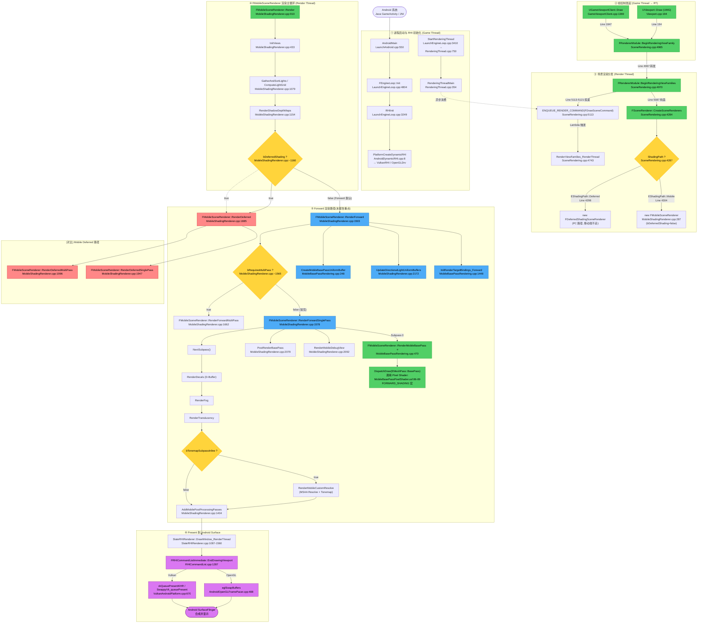

# UE5 Android Forward 渲染调用链(Mermaid)

> 目标平台:Android / UE 5.4.4
> 覆盖范围:从 `UGameViewportClient::Draw` 到 `RenderMobileBasePass` 的完整 Forward 路径
> 图中所有节点均带 `文件:行号` 定位,可点击跳转

---

## 1. 完整调用链(Mermaid)



---

## 2. 关键调用源:`BeginRenderingViewFamily` 入口

`FRendererModule::BeginRenderingViewFamily` 有 **2 个主要调用方**:

| 调用方 | 位置 | 触发场景 |
|--------|------|----------|
| `UGameViewportClient::Draw` | `Source/Runtime/Engine/Private/GameViewportClient.cpp:1847` | 引擎主游戏窗口绘制(主路径) |
| `UViewport::Draw` | `Source/Runtime/UMG/Private/Components/Viewport.cpp:194` | UMG 视口控件内部渲染 |

> **主路径**:`UGameViewportClient::Draw` (Line 1369) → Line 1847 调用 `GetRendererModule().BeginRenderingViewFamily(SceneCanvas, &ViewFamily)`。

---

## 3. 关键决策点一览

| # | 位置 | 决策内容 | Forward 取值 |
|---|------|----------|--------------|
| ① | `SceneRendering.cpp:4287` | `EShadingPath = GetFeatureLevelShadingPath(FeatureLevel)` | ES3_1 → `EShadingPath::Mobile` |
| ② | `MobileShadingRenderer.cpp:290` | `bDeferredShading = IsMobileDeferredShadingEnabled(ShaderPlatform)` | `false`(默认) |
| ③ | `MobileShadingRenderer.cpp:~1160` | `if (bDeferredShading) RenderDeferred else RenderForward` | 走 `RenderForward` |
| ④ | `MobileShadingRenderer.cpp:1565` | `if (bRequiresMultiPass) Multi else Single` | `RenderForwardSinglePass` |
| ⑤ | `MobileShadingRenderer.cpp:1606` | `if (bTonemapSubpassInline) CustomResolve` | 启用 subpass tonemap |

---

## 4. Forward 关键函数速查(7 个核心)

| 函数 | 文件 | 行号 | 职责 |
|------|------|------|------|
| `FRendererModule::BeginRenderingViewFamily` | `SceneRendering.cpp` | 4965 | 入口包装(单 Family) |
| `FSceneRenderer::CreateSceneRenderers` | `SceneRendering.cpp` | 4284 | 决定构造哪种 SceneRenderer |
| `FMobileSceneRenderer::Render` | `MobileShadingRenderer.cpp` | 910 | 渲染主调度 |
| `FMobileSceneRenderer::RenderForward` | `MobileShadingRenderer.cpp` | 1503 | Forward 路径入口 |
| `FMobileSceneRenderer::RenderForwardSinglePass` | `MobileShadingRenderer.cpp` | 1578 | Subpass 0/1/2 调度 |
| `FMobileSceneRenderer::RenderMobileBasePass` | `MobileBasePassRendering.cpp` | 470 | ⭐ Base Pass 绘制(像素着色器计算光照) |
| `FRHICommandListImmediate::EndDrawingViewport` | `RHICommandList.cpp` | 1287 | 触发 eglSwapBuffers / vkQueuePresentKHR |

---

## 5. 调用链简要总结(精简版)

```
[Game Thread]                                            [Render Thread]
UGameViewportClient::Draw (GameViewportClient.cpp:1369)
   └→ BeginRenderingViewFamily (SceneRendering.cpp:4965)            ┐
        └→ BeginRenderingViewFamilies (SceneRendering.cpp:4970)     │
             ├→ CreateSceneRenderers (SceneRendering.cpp:4284)       │
             │    └→ new FMobileSceneRenderer (line 4304)            │
             │         (bDeferredShading=false, line 290)            │
             └→ ENQUEUE_RENDER_COMMAND ──────────────────────────────┤
                                                                       ↓
                              RenderViewFamilies_RenderThread (SceneRendering.cpp:4743)
                                  └→ FMobileSceneRenderer::Render (MobileShadingRenderer.cpp:910)
                                       ├─ InitViews
                                       ├─ GatherAndSortLights
                                       ├─ RenderShadowDepthMaps
                                       └─ ⭐ bDeferredShading=false
                                              └→ RenderForward (MobileShadingRenderer.cpp:1503)
                                                   └→ RenderForwardSinglePass (line 1578)
                                                        ├─ Subpass 0: RenderMobileBasePass (line 470) ⭐
                                                        │       └─ MobileBasePassPixelShader.usf (光照累加 + IBL)
                                                        ├─ Subpass 1: Decals / Fog / Translucency
                                                        └─ Subpass 2: CustomResolve (Tonemap + MSAA Resolve)
                                                                              ↓
                              AddMobilePostProcessingPasses
                                                                              ↓
                              SlateRHIRenderer::DrawWindow_RenderThread
                                  └→ EndDrawingViewport (RHICommandList.cpp:1287)
                                       ├─ OpenGL: eglSwapBuffers
                                       └─ Vulkan: vkQueuePresentKHR / SwappyVk_queuePresent
                                                                              ↓
                                                                 Android SurfaceFlinger → 屏幕
```
