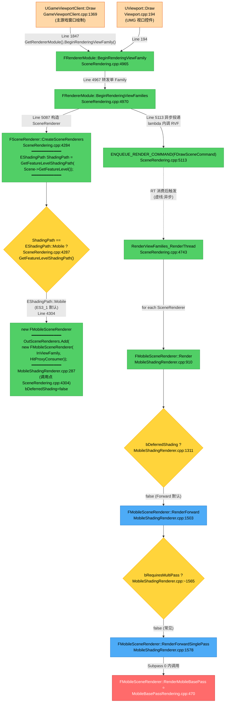

# UE5 Android Forward 渲染调用链 - 指定片段

> 目标平台:Android / UE 5.4.4
> **范围限定**:从 `BeginRenderingViewFamily` 的调用方 → `RenderMobileBasePass`
> 覆盖节点:**11 个函数 + 2 个调用方 + 3 个决策点**

---

## Mermaid 调用链

---

## 节点清单(11 个函数 + 2 调用方 + 3 决策)

| # | 类型 | 名称 | 文件:行号 |
|---|------|------|----------|
| 1 | 调用方 | `UGameViewportClient::Draw` | `GameViewportClient.cpp:1369` (调用 1847) |
| 2 | 调用方 | `UViewport::Draw` | `Viewport.cpp:194` |
| 3 | 入口 | `FRendererModule::BeginRenderingViewFamily` | `SceneRendering.cpp:4965` |
| 4 | 入口 | `FRendererModule::BeginRenderingViewFamilies` | `SceneRendering.cpp:4970` |
| 5 | 入口 | `FSceneRenderer::CreateSceneRenderers` 调用 `OutSceneRenderers.Add(new FMobileSceneRenderer(...))` | `SceneRendering.cpp:4284` (构造语句在 Line 4304) |
| 6 | 构造 | `new FMobileSceneRenderer` `bDeferredShading = IsMobileDeferredShadingEnabled(ShaderPlatform)` | `MobileShadingRenderer.cpp:287` |
| 7 | 入口 | `ENQUEUE_RENDER_COMMAND(FDrawSceneCommand)` | `SceneRendering.cpp:5113` |
| 8 | 入口 | `RenderViewFamilies_RenderThread` | `SceneRendering.cpp:4743` |
| 9 | 入口 | `FMobileSceneRenderer::Render` | `MobileShadingRenderer.cpp:910` |
| 10 | Forward | `FMobileSceneRenderer::RenderForward` | `MobileShadingRenderer.cpp:1503` |
| 11 | Forward | `FMobileSceneRenderer::RenderForwardSinglePass` | `MobileShadingRenderer.cpp:1578` |
| 12 | ⭐ 终点 | `FMobileSceneRenderer::RenderMobileBasePass` | `MobileBasePassRendering.cpp:470` |

| # | 决策点 | 位置 | Forward 取值 |
|---|--------|------|--------------|
| ① | `GetFeatureLevelShadingPath(FeatureLevel)` | `SceneRendering.cpp:4287` | `EShadingPath::Mobile` |
| ② | `if (bDeferredShading)` | `MobileShadingRenderer.cpp:~1160` | `false` |
| ③ | `if (bRequiresMultiPass)` | `MobileShadingRenderer.cpp:~1565` | `false` (走 SinglePass) |

---

## 调用链一句话总结

> `UGameViewportClient::Draw` 在第 1847 行调用 `BeginRenderingViewFamily` → 转发到 `BeginRenderingViewFamilies` → 在第 5087 行通过 `CreateSceneRenderers`(决策 `EShadingPath = GetFeatureLevelShadingPath(FeatureLevel)`,ES3_1 → `Mobile`)→ **在 Line 4304 执行 `OutSceneRenderers.Add(new FMobileSceneRenderer(InViewFamily, HitProxyConsumer))` 构造 `FMobileSceneRenderer`**(构造函数 Line 287,`bDeferredShading = false`)→ 第 5113 行 `ENQUEUE_RENDER_COMMAND` 投递到 RT → RT 消费后调用 `RenderViewFamilies_RenderThread` → `FMobileSceneRenderer::Render` → 决策 `bDeferredShading=false` → 走 `RenderForward` → 决策 `bRequiresMultiPass=false` → 走 `RenderForwardSinglePass` → Subpass 0 中调用 `RenderMobileBasePass` 完成最终像素着色与光照累加。
