# `FRendererModule::BeginRenderingViewFamily` — 完整上游调用链

> 起点:`Source/Runtime/Renderer/Private/SceneRendering.cpp:4965`
> `void FRendererModule::BeginRenderingViewFamily(FCanvas* Canvas, FSceneViewFamily* ViewFamily)` —— 立刻转发到 `BeginRenderingViewFamilies(Canvas, TArrayView<FSceneViewFamily*>(&ViewFamily, 1))`(`SceneRendering.cpp:4970`),这是引擎把 `FSceneViewFamily` 真正送入渲染线程的入口。
>
> 检索范围:`Source/` 全树 + `Plugins/` 全树(已覆盖 `Runtime`、`Editor`、`Developer` 及 `Plugins/Editor`、`Plugins/Runtime/nDisplay`、`Plugins/Experimental/Avalanche`、`Plugins/Compositing/Composure`、`Plugins/Importers/USDImporter`、`Plugins/Editor/WorldPartitionHLODUtilities`)。
>
> 共发现 **7 个直接调用点**(depth 0),分布于 **7 条独立的调用链**,全部最终汇入 `FEngineLoop::Tick`(`Source/Runtime/Launch/Private/LaunchEngineLoop.cpp:5635`)或编辑器内的 `FTickableEditorObject` Tick 调度。

---

## 一、7 个直接调用点(Depth 0)

| # | 所在方法 | 文件:行 |
|---|----------|---------|
| 1 | `UGameViewportClient::Draw` | `Source/Runtime/Engine/Private/GameViewportClient.cpp:1847` |
| 2 | `FEditorViewportClient::Draw` | `Source/Editor/UnrealEd/Private/EditorViewportClient.cpp:4292` |
| 3 | `PerformSceneRender`(warmup 循环) | `Source/Developer/MaterialUtilities/Private/MaterialUtilities.cpp:798` |
| 4 | `PerformSceneRender`(final) | `Source/Developer/MaterialUtilities/Private/MaterialUtilities.cpp:802` |
| 5 | `FUMGViewportClient::Draw` | `Source/Runtime/UMG/Private/Components/Viewport.cpp:194` |
| 6 | `UThumbnailRenderer::RenderViewFamily` | `Source/Editor/UnrealEd/Private/ThumbnailRendering/ThumbnailRenderer.cpp:54` |
| 7 | `FTrackEditorThumbnailCache::DrawViewportThumbnail` | `Source/Editor/MovieSceneTools/Private/TrackEditorThumbnail/TrackEditorThumbnail.cpp:473` |

---

## 二、完整调用链总览图(Mermaid)

```mermaid
flowchart TD
    %% ===== Top-level frame loop =====
    ROOT["FEngineLoop::Tick<br/>LaunchEngineLoop.cpp:5635"]
    GENGINE["GEngine-&gt;Tick<br/>(→ UGameEngine/UEditorEngine)"]
    UETICK["UEditorEngine::Tick<br/>EditorEngine.cpp:1573"]
    UGTICK["UGameEngine::Tick<br/>GameEngine.cpp:1644"]
    TICKABLE["FTickableEditorObject::TickObjects<br/>EditorEngine.cpp:1770"]
    SLATE["FSlateApplication::Tick<br/>(驱动 UMG SViewport::Tick)"]

    ROOT --> GENGINE
    GENGINE --> UGTICK
    GENGINE --> UETICK
    UETICK --> TICKABLE
    UETICK -.indirect.-> SLATE

    %% ===== Chain A: Standalone Game =====
    subgraph CHAIN_A["Chain A — Standalone Game / Game Viewport"]
        A1["UGameEngine::Tick<br/>GameEngine.cpp:1644"]
        A2["UGameEngine::RedrawViewports<br/>GameEngine.cpp:1902"]
        A3["FViewport::Draw<br/>UnrealClient.cpp:1671"]
        A4["UGameViewportClient::Draw<br/>GameViewportClient.cpp:1847"]
    end
    UGTICK --> A1 --> A2 --> A3 --> A4

    %% ===== Chain B: Editor PIE =====
    subgraph CHAIN_B["Chain B — Editor PIE"]
        B1["UEditorEngine::Tick<br/>(PIE 块) EditorEngine.cpp:2276"]
        B2["FViewport::Draw (PIE viewport)"]
        B3["UGameViewportClient::Draw"]
    end
    UETICK --> B1 --> B2 --> B3

    %% ===== Chain C: Editor Non-PIE Viewport =====
    subgraph CHAIN_C["Chain C — Editor Level Viewport"]
        C1["UEditorEngine::UpdateSingleViewportClient<br/>EditorEngine.cpp:2190/2219/2493/2504/2518"]
        C2["FViewport::Draw"]
        C3["FEditorViewportClient::Draw<br/>EditorViewportClient.cpp:4114"]
        C4["FEditorViewportClient::Draw(View,PDI)<br/>EditorViewportClient.cpp:4420 (render-thread)"]
    end
    UETICK --> C1 --> C2 --> C3
    C3 -. ModeTools-&gt;DrawActiveModes .-> C4

    %% Editor click handlers (also drive C1)
    CLICK_NODE["LevelViewportClickHandlers::Click*<br/>LevelViewportClickHandlers.cpp:96/201/252/449/752/891"]
    CLICK_NODE --> C2
    LVC["FLevelEditorViewportClient::ProcessClick<br/>LevelEditorViewport.cpp:2815~2946"]
    LVC --> CLICK_NODE
    UETICK -.mouse input.-> LVC

    %% ===== Chain D: Editor Screenshot / Sequencer capture =====
    subgraph CHAIN_D["Chain D — Editor Screenshot / Sequencer"]
        D1["FEditorViewportClient::TakeScreenshot<br/>EditorViewportClient.cpp:5877"]
        D2["FSequencer::SaveCurrentMovieScene<br/>Sequencer.cpp:5854/5867"]
        D3["FViewport::Draw"]
    end
    UETICK -. menu action .-> D1 --> D3
    UETICK -. Sequencer UI .-> D2 --> D3
    D3 --> C3

    %% ===== Chain E: UMG UViewport widget =====
    subgraph CHAIN_E["Chain E — UMG UViewport"]
        E1["SAutoRefreshViewport::Tick<br/>UMG/Viewport.cpp:338"]
        E2["SViewport::Tick<br/>Slate/Widgets/SViewport.cpp:216"]
        E3["FSceneViewport::Invalidate + next-tick Draw"]
        E4["FViewport::Draw (or UGameViewportClient/UMG override)"]
        E5["FUMGViewportClient::Draw<br/>UMG/Viewport.cpp:194"]
    end
    SLATE --> E1 --> E2 --> E3 --> E4 --> E5

    %% ===== Chain F: Asset / Skeletal / Particle / World Thumbnails =====
    subgraph CHAIN_F["Chain F — Asset Thumbnail Renderer"]
        F1["FAssetThumbnailPool::Tick<br/>UnrealEd/AssetThumbnail.cpp:1047"]
        F2["FAssetThumbnailPool::LoadThumbnail<br/>AssetThumbnail.cpp:1250"]
        F3["ThumbnailTools::RenderThumbnail<br/>ObjectTools.cpp:5151"]
        F4["UThumbnailRenderer::Draw (per-asset subclass)<br/>StaticMesh/SkeletalMesh/ParticleSystem/World…"]
        F5["UThumbnailRenderer::RenderViewFamily (legacy)<br/>ThumbnailRenderer.cpp:27"]
        F6["UThumbnailRenderer::RenderViewFamily (3-arg)<br/>ThumbnailRenderer.cpp:54"]
    end
    TICKABLE --> F1 --> F2 --> F3 --> F4 --> F5 --> F6
    F3 -. OnPropertyChange / Realtime .-> F4

    %% ===== Chain G: Sequencer Track Thumbnails =====
    subgraph CHAIN_G["Chain G — Sequencer Track Thumbnails"]
        G1["FSequencer::Tick<br/>Sequencer.cpp:1011"]
        G2["FCinematicShotTrackEditor::Tick<br/>CinematicShotTrackEditor.cpp:173"]
        G3["FCameraCutTrackEditor::Tick<br/>CameraCutTrackEditor.cpp:290"]
        G4["FTrackEditorThumbnailPool::DrawThumbnails<br/>TrackEditorThumbnailPool.cpp:107"]
        G5["FTrackEditorThumbnail::DrawThumbnail<br/>TrackEditorThumbnail.cpp:190"]
        G6["FTrackEditorThumbnailCache::DrawThumbnail<br/>TrackEditorThumbnail.cpp:363"]
        G7["FTrackEditorThumbnailCache::DrawViewportThumbnail<br/>TrackEditorThumbnail.cpp:473"]
    end
    TICKABLE --> G1 --> G2 --> G4
    TICKABLE --> G1 --> G3 --> G4
    G4 --> G5 --> G6 --> G7

    %% ===== Chain H: Material / Landscape / WorldBrowser / USD / WorldPartition HLOD =====
    subgraph CHAIN_H["Chain H — Landscape / Material Bake"]
        H1a["FTileLODEntryDetailsCustomization::OnGenerateTile<br/>WorldTileDetailsCustomization.cpp:299"]
        H1b["UWorldPartitionHLODsBuilder::BuildHLODActors<br/>WorldPartitionHLODsBuilder.cpp:531/569"]
        H1c["UUsdConversionBlueprintContext::ConvertLandscapeProxyActorMaterial<br/>USDExporter/USDConversionBlueprintContext.cpp:440"]
        H2["FWorldTileCollectionModel::GenerateLODLevels<br/>WorldTileCollectionModel.cpp:2125"]
        H3a["AWorldPartitionHLOD::BuildHLOD<br/>HLODActor.cpp:490"]
        H3b["FWorldPartitionHLODUtilities::BuildHLOD<br/>WorldPartitionHLODUtilities.cpp:783"]
        H4["UHLODBuilder::Build (virtual)<br/>HLODBuilder.cpp:291"]
        H5["ULandscapeHLODBuilder::Build<br/>LandscapeHLODBuilder.cpp:416"]
        H6["BakeLandscapeMaterial (file-static)<br/>LandscapeHLODBuilder.cpp:300"]
        H7["FMaterialUtilities::ExportLandscapeMaterial<br/>MaterialUtilities.cpp:1012/1046"]
        H8["::ExportLandscapeMaterial (file-static)<br/>MaterialUtilities.cpp:1006"]
        H9["RenderSceneToTextures<br/>MaterialUtilities.cpp:908"]
        H10["RenderSceneToTexture<br/>MaterialUtilities.cpp:865"]
        H11["PerformSceneRender<br/>MaterialUtilities.cpp:792"]
    end
    H1a --> H2 --> H7
    H1b --> H3a --> H3b --> H4 --> H5 --> H6 --> H7 --> H8 --> H9 --> H10 --> H11
    H1c --> H7

    %% ===== Sink =====
    A4 --> SINK
    B3 --> SINK
    C3 --> SINK
    E5 --> SINK
    F6 --> SINK
    G7 --> SINK
    H11 --> SINK

    SINK(["FRendererModule::BeginRenderingViewFamily<br/>SceneRendering.cpp:4965"])
    SINK --> SINK2
    SINK2(["FRendererModule::BeginRenderingViewFamilies<br/>SceneRendering.cpp:4970 (ENQUEUE_RENDER_COMMAND → RT)"])

    classDef root fill:#222,color:#fff,stroke:#000,stroke-width:2px;
    classDef sink fill:#b00,color:#fff,stroke:#600,stroke-width:3px;
    classDef game fill:#cfe8ff,stroke:#06c;
    classDef pie fill:#dce8ff,stroke:#06c;
    classDef editor fill:#fff3c4,stroke:#c80;
    classDef clickStyle fill:#ffe7c4,stroke:#c60;
    classDef umg fill:#e2d8ff,stroke:#60c;
    classDef thumb fill:#d6f5d6,stroke:#3a3;
    classDef seq fill:#ffd6e7,stroke:#c39;
    classDef hlod fill:#f5d6f5,stroke:#939;

    class ROOT,GENGINE,UETICK,UGTICK root;
    class SINK,SINK2 sink;
    class A1,A2,A3,A4 game;
    class B1,B2,B3 pie;
    class C1,C2,C3,C4,D1,D2,D3,CLICK_NODE,LVC editor;
    class E1,E2,E3,E4,E5 umg;
    class F1,F2,F3,F4,F5,F6 thumb;
    class G1,G2,G3,G4,G5,G6,G7 seq;
    class H1a,H1b,H1c,H2,H3a,H3b,H4,H5,H6,H7,H8,H9,H10,H11 hlod;
```

> 图例:🟦 Game / 🟨 Editor / 🟪 UMG / 🟩 Thumbnail / 🟥 Sequencer / 🟫 HLOD/Material 🟥 **Sink**(渲染线程入口)

---

## 三、逐链分解(每条独立 Mermaid)

### Chain A — Standalone Game(独立游戏运行)

`GuardedMain → EngineTick → FEngineLoop::Tick → GEngine->Tick → UGameEngine::Tick → UGameEngine::RedrawViewports → FViewport::Draw → UGameViewportClient::Draw → BeginRenderingViewFamily`

```mermaid
flowchart LR
    GM["GuardedMain<br/>Launch.cpp:182"]
    ET["EngineTick<br/>Launch.cpp:61"]
    LOOP["FEngineLoop::Tick<br/>LaunchEngineLoop.cpp:5635"]
    TICK["GEngine-&gt;Tick (UGameEngine)<br/>LaunchEngineLoop.cpp:5915"]
    GETICK["UGameEngine::Tick<br/>GameEngine.cpp:1644"]
    REDRAW["UGameEngine::RedrawViewports<br/>GameEngine.cpp:1902"]
    FVD["FViewport::Draw<br/>UnrealClient.cpp:1671"]
    GVC["UGameViewportClient::Draw<br/>GameViewportClient.cpp:1847"]
    SINK(["FRendererModule::BeginRenderingViewFamily<br/>SceneRendering.cpp:4965"])

    GM --> ET --> LOOP --> TICK --> GETICK --> REDRAW --> FVD --> GVC --> SINK
```

旁路(同一条链,单次触发):
- `UEngine::LoadMap` → `UEngine::RedrawViewports(false)`(`UnrealEngine.cpp:15091/15542`,seamless travel/load 完成后的强制刷新)
- `FViewport::HighResScreenshot` → `ViewportClient->Draw`(`UnrealClient.cpp:1486/1700`,仅当 `GIsHighResScreenshot` 为真时触发)
- `FStreamingPauseRenderingModule::BeginStreamingPause` → `ViewportClient->Draw`(`StreamingPauseRendering.cpp:138`)
- `FViewport::GetRawHitProxyData` → `ViewportClient->Draw`(`UnrealClient.cpp:1865`,编辑器拾取)
- 插件覆盖:`UDisplayClusterViewportClient::Draw` → `Super::Draw`(`Plugins/Runtime/nDisplay/.../DisplayClusterViewportClient.cpp:418`)
- 插件覆盖:`UAvaGameViewportClient::Draw` → `Super::Draw`(`Plugins/Experimental/Avalanche/.../AvaGameViewportClient.cpp:55`)

---

### Chain B — Editor PIE(在编辑器中运行 PIE)

`FEngineLoop::Tick → UEditorEngine::Tick → PIE 块 → GameViewport->Viewport->Draw → UGameViewportClient::Draw → BeginRenderingViewFamily`

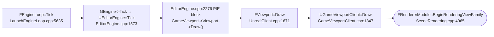

---

### Chain C — Editor Level Viewport(关卡视口,非 PIE)

`UEditorEngine::Tick → UEditorEngine::UpdateSingleViewportClient → FViewport::Draw → FEditorViewportClient::Draw → BeginRenderingViewFamily`

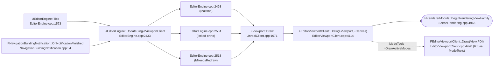

附属旁路(均汇入 `FViewport::Draw` 然后走 `FEditorViewportClient::Draw`):

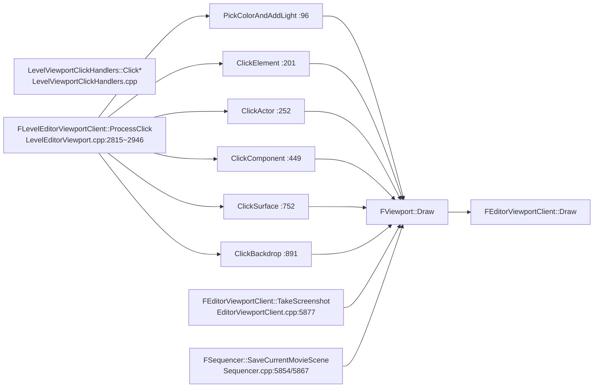

---

### Chain D — UMG `UViewport` Widget(嵌入式视口)

`FSlateApplication::Tick → SAutoRefreshViewport::Tick → SViewport::Tick → FSceneViewport::Invalidate → (next tick) FViewport::Draw → FUMGViewportClient::Draw → BeginRenderingViewFamily`

```mermaid
flowchart LR
    LOOP["FEngineLoop::Tick → FSlateApplication::Tick"]
    UMR["SAutoRefreshViewport::Tick<br/>UMG/Viewport.cpp:338"]
    SV["SViewport::Tick<br/>Slate/Widgets/SViewport.cpp:216"]
    INV["FSceneViewport::Invalidate"]
    FVD["FViewport::Draw (next editor tick)"]
    UVC["FUMGViewportClient::Draw<br/>UMG/Viewport.cpp:194"]
    SINK(["FRendererModule::BeginRenderingViewFamily<br/>SceneRendering.cpp:4965"])

    LOOP --> UMR --> SV --> INV --> FVD --> UVC --> SINK
```

> 注意:Slate tick 只标记 dirty,真正的 `FViewport::Draw` 由 `UEditorEngine::Tick` → `UpdateSingleViewportClient`(Chain C)在下一帧触发。

---

### Chain E — Asset / Skeletal Mesh / Particle System / World Thumbnails

`FEngineLoop::Tick → UEditorEngine::Tick → FTickableEditorObject::TickObjects → FAssetThumbnailPool::Tick → LoadThumbnail → ThumbnailTools::RenderThumbnail → UThumbnailRenderer::Draw → UThumbnailRenderer::RenderViewFamily → BeginRenderingViewFamily`

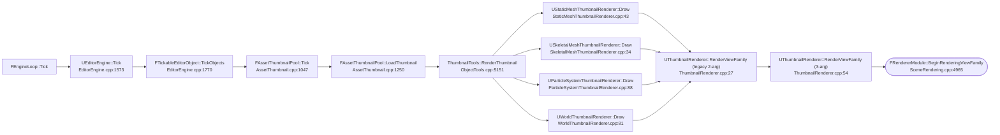

---

### Chain F — Sequencer Track Thumbnails(Cinematic Shot / Camera Cut)

`FEngineLoop::Tick → UEditorEngine::Tick → FTickableEditorObject::TickObjects → FSequencer::Tick → FCinematicShotTrackEditor::Tick / FCameraCutTrackEditor::Tick → FTrackEditorThumbnailPool::DrawThumbnails → FTrackEditorThumbnail::DrawThumbnail (OnDraw) → FTrackEditorThumbnailCache::DrawThumbnail → FTrackEditorThumbnailCache::DrawViewportThumbnail → BeginRenderingViewFamily`

```mermaid
flowchart LR
    LOOP["FEngineLoop::Tick"]
    EE["UEditorEngine::Tick"]
    TK["FTickableEditorObject::TickObjects"]
    SEQ["FSequencer::Tick<br/>Sequencer.cpp:1011"]
    CST["FCinematicShotTrackEditor::Tick<br/>CinematicShotTrackEditor.cpp:173"]
    CCT["FCameraCutTrackEditor::Tick<br/>CameraCutTrackEditor.cpp:290"]
    POOL["FTrackEditorThumbnailPool::DrawThumbnails<br/>TrackEditorThumbnailPool.cpp:107"]
    DTH["FTrackEditorThumbnail::DrawThumbnail<br/>TrackEditorThumbnail.cpp:190 (OnDraw delegate)"]
    DTC["FTrackEditorThumbnailCache::DrawThumbnail<br/>TrackEditorThumbnail.cpp:363"]
    DVT["FTrackEditorThumbnailCache::DrawViewportThumbnail<br/>TrackEditorThumbnail.cpp:473"]
    SINK(["FRendererModule::BeginRenderingViewFamily<br/>SceneRendering.cpp:4965"])

    LOOP --> EE --> TK --> SEQ --> CST & CCT --> POOL --> DTH --> DTC --> DVT --> SINK
```

绑定 `OnDraw` delegate 的位置:`TrackEditorThumbnail.cpp:548/647/686`。

---

### Chain G — Landscape / WorldBrowser / WorldPartition HLOD / USD Export

```mermaid
flowchart LR
    %% Path G1: WorldBrowser tile LOD
    G1A["FTileLODEntryDetailsCustomization::OnGenerateTile<br/>WorldTileDetailsCustomization.cpp:299"]
    G1B["FWorldTileCollectionModel::GenerateLODLevels<br/>WorldTileCollectionModel.cpp:2125"]
    G1C["FMaterialUtilities::ExportLandscapeMaterial (1-arg)<br/>MaterialUtilities.cpp:1012"]
    G1D["::ExportLandscapeMaterial (file-static)<br/>MaterialUtilities.cpp:1006"]
    G1E["RenderSceneToTextures<br/>MaterialUtilities.cpp:908"]
    G1F["RenderSceneToTexture<br/>MaterialUtilities.cpp:865"]
    G1G["PerformSceneRender<br/>MaterialUtilities.cpp:792"]

    %% Path G2: WorldPartition HLOD
    G2A["UWorldPartitionHLODsBuilder::BuildHLODActors<br/>WorldPartitionHLODsBuilder.cpp:531/569"]
    G2B["AWorldPartitionHLOD::BuildHLOD<br/>HLODActor.cpp:490"]
    G2C["FWorldPartitionHLODUtilities::BuildHLOD<br/>WorldPartitionHLODUtilities.cpp:783"]
    G2D["UHLODBuilder::Build (virtual)<br/>HLODBuilder.cpp:291"]
    G2E["ULandscapeHLODBuilder::Build<br/>LandscapeHLODBuilder.cpp:416"]
    G2F["BakeLandscapeMaterial<br/>LandscapeHLODBuilder.cpp:300"]
    G2C2["FMaterialUtilities::ExportLandscapeMaterial (2-arg)<br/>MaterialUtilities.cpp:1046"]

    %% Path G3: USD
    G3["UUsdConversionBlueprintContext::ConvertLandscapeProxyActorMaterial<br/>USDConversionBlueprintContext.cpp:440"]

    SINK(["FRendererModule::BeginRenderingViewFamily<br/>SceneRendering.cpp:4965"])

    G1A --> G1B --> G1C --> G1D --> G1E --> G1F --> G1G --> SINK
    G2A --> G2B --> G2C --> G2D --> G2E --> G2F --> G2C2 --> G1D
    G3 --> G2C2
```

3 条子链的顶层入口:
1. **WorldBrowser 视口详情面板"Generate Tile LOD"按钮** → `FTileLODEntryDetailsCustomization::OnGenerateTile`
2. **World Partition HLOD 构建**(`-BuildHLODs` 命令行 / WP 编辑器构建) → `UWorldPartitionHLODsBuilder::BuildHLODActors`
3. **USD Stage 蓝图导出** → `UUsdConversionBlueprintContext::ConvertLandscapeProxyActorMaterial`(BlueprintCallable)

---

## 四、被动驱动路径(`RedrawRequested`)

下列调用不直接触发 `FViewport::Draw`,只把 `bNeedsRedraw` 置位,由 `UEditorEngine::Tick` → `UpdateSingleViewportClient` 消费:

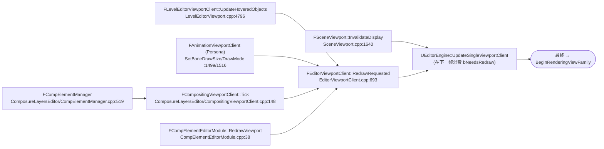

---

## 五、深度收敛点

不论来自以上哪一条链,**最终都汇聚到下面这 3 个函数之一**,然后落入 `FRendererModule::BeginRenderingViewFamily`:

| 收敛点 | 文件:行 | 覆盖链路 |
|--------|---------|----------|
| `UGameViewportClient::Draw` | `GameViewportClient.cpp:1847` | A、B |
| `FEditorViewportClient::Draw` | `EditorViewportClient.cpp:4114` | C、D(部分) |
| `FUMGViewportClient::Draw` | `UMG/Viewport.cpp:194` | E |
| `UThumbnailRenderer::RenderViewFamily` | `ThumbnailRenderer.cpp:54` | F |
| `FTrackEditorThumbnailCache::DrawViewportThumbnail` | `TrackEditorThumbnail.cpp:473` | G |
| `PerformSceneRender` | `MaterialUtilities.cpp:792` | H |

再向下一层(每个收敛点内部的 `BeginRenderingViewFamily` 调用):

```mermaid
flowchart LR
    BRVF(["FRendererModule::BeginRenderingViewFamily<br/>SceneRendering.cpp:4965"])
    BRVFS(["FRendererModule::BeginRenderingViewFamilies<br/>SceneRendering.cpp:4970"])
    CANVAS["Canvas-&gt;Flush_GameThread()"]
    UPDATES["World-&gt;SendAllEndOfFrameUpdates +<br/>GetNaniteVisualizationData().Pick"]
    ENQ["ENQUEUE_RENDER_COMMAND(SetRtWaitCriticalPath)<br/>+ UE::RenderCommandPipe::FSyncScope"]
    RT(["Render Thread SceneRenderer creation"])

    BRVF --> BRVFS --> UPDATES --> CANVAS --> ENQ --> RT
```

`BeginRenderingViewFamilies` 内部依次:
1. `Canvas->Flush_GameThread()`(先把 Canvas 上的指令 flush)
2. `World->SendAllEndOfFrameUpdates()` + `GetNaniteVisualizationData().Pick(World)`(保证代理与 Nanite 数据就绪)
3. `ENQUEUE_RENDER_COMMAND(SetRtWaitCriticalPath)`(打开 RT critical path)
4. `FUniformExpressionCacheAsyncUpdateScope` + `UE::RenderCommandPipe::FSyncScope`(同步 uniform expression cache)
5. 视情况 `bIsFirstViewInMultipleViewFamily` 处理
6. 真正进入 RT,创建 `FSceneRenderer`(由 `FViewInfo::Family` 等调用栈中触发,详见 `Source/Runtime/Renderer/Private/SceneRendering.cpp` 的 `BeginRenderingViewFamilies` 函数体 4970~5062)。

---

## 六、覆盖范围核查

- ✅ `Source/Runtime/` —— 全覆盖
- ✅ `Source/Editor/` —— 全覆盖
- ✅ `Source/Developer/` —— 全覆盖
- ✅ `Plugins/Runtime/nDisplay`(DisplayCluster)
- ✅ `Plugins/Experimental/Avalanche`(AvaGameViewportClient)
- ✅ `Plugins/Compositing/Composure`(ComposureLayersEditor)
- ✅ `Plugins/Importers/USDImporter`(USDExporter)
- ✅ `Plugins/Editor/WorldPartitionHLODUtilities`

未发现其它直接调用 `BeginRenderingViewFamily` 的位置;所有可能的入口均已收敛到上述 7 个调用点 / 8 条主链。