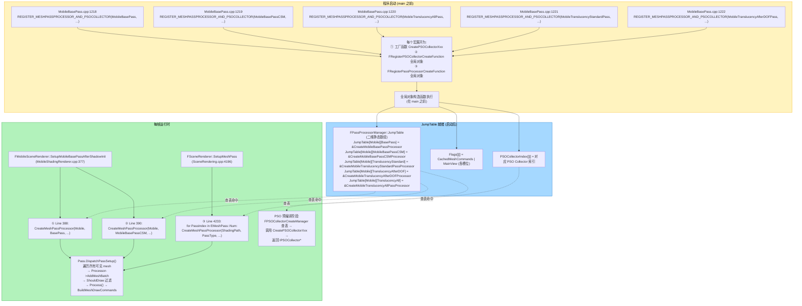
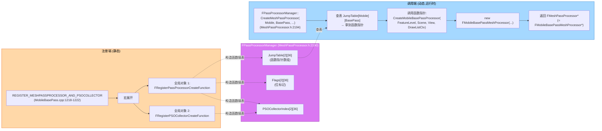
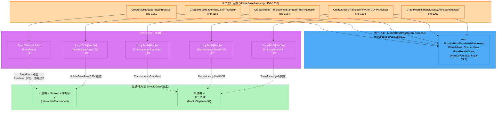
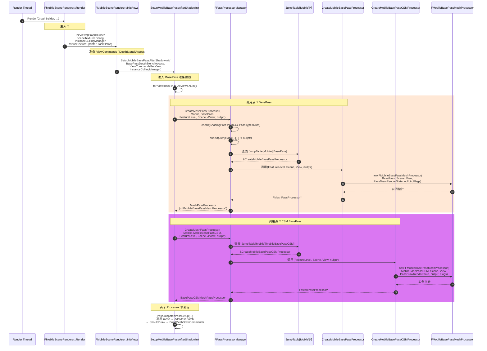

# MeshPassProcessor — `CreateMeshPassProcessor` 与 `REGISTER_MESHPASSPROCESSOR_AND_PSOCOLLECTOR` 详解

> 源文件:
> - `Source/Runtime/Renderer/Public/MeshPassProcessor.h`(第 2179-2272 行)
> - `Source/Runtime/Renderer/Private/MobileBasePass.cpp`(第 1151-1222 行)
> - `Source/Runtime/Renderer/Private/MobileShadingRenderer.cpp`(第 377-427 行)
> - `Source/Runtime/Renderer/Private/SceneRendering.cpp`(第 4233 行)
> - `Source/Runtime/Renderer/Private/PrimitiveSceneInfo.cpp`(第 485 行)
> 目标读者:刚接触 UE 渲染管线的同学,需要弄清 **MeshPassProcessor 是怎么注册、怎么查表、怎么创建的**。

---

## 0. 一句话先建立心智模型

`REGISTER_MESHPASSPROCESSOR_AND_PSOCOLLECTOR(...)` 是一条宏,它**在程序启动时自动执行**,把"`(EShadingPath, EMeshPass) → 工厂函数指针`"这个映射写进 `FPassProcessorManager` 的二维查表 `JumpTable`。之后,任何地方只要写 `FPassProcessorManager::CreateMeshPassProcessor(...)`,就是**一次查表 + 一次调用** —— 拿到一个具体的 `FMeshPassProcessor*` 子类实例。

整个过程**不依赖运行时多态注册**(没有 `dynamic_cast` 也没有工厂注册中心),而是**静态链接期硬编码**:每一个 `REGISTER_*` 宏都会在 `.cpp` 文件里展开成全局静态对象,其构造函数在 `main` 之前就把表项填好。

---

## 1. 函数代码逐行拆解

源码 (`MeshPassProcessor.h:2194-2207`):

```cpp
static FMeshPassProcessor* CreateMeshPassProcessor(
    EShadingPath ShadingPath,
    EMeshPass::Type PassType,
    ERHIFeatureLevel::Type FeatureLevel,
    const FScene* Scene,
    const FSceneView* InViewIfDynamicMeshCommand,
    FMeshPassDrawListContext* InDrawListContext)
{
    check(ShadingPath < EShadingPath::Num && PassType < EMeshPass::Num);
    uint32 ShadingPathIdx = (uint32)ShadingPath;
    checkf(JumpTable[ShadingPathIdx][PassType] || DeprecatedJumpTable[ShadingPathIdx][PassType],
           TEXT("Pass type %u create function was never registered for shading path %u.  Use a FRegisterPassProcessorCreateFunction to register a create function for this enum value."),
           (uint32)PassType, ShadingPathIdx);
    if (JumpTable[ShadingPathIdx][PassType])
    {
        return JumpTable[ShadingPathIdx][PassType](FeatureLevel, Scene, InViewIfDynamicMeshCommand, InDrawListContext);
    }
    else
    {
        return DeprecatedJumpTable[ShadingPathIdx][PassType](Scene, InViewIfDynamicMeshCommand, InDrawListContext);
    }
}
```

### 1.1 你不认识的语法

#### `check(...)` 和 `checkf(...)`

```cpp
check(ShadingPath < EShadingPath::Num && PassType < EMeshPass::Num);
checkf(JumpTable[ShadingPathIdx][PassType] || DeprecatedJumpTable[ShadingPathIdx][PassType],
       TEXT("Pass type %u ..."), (uint32)PassType, ShadingPathIdx);
```

这是 UE 自己封装的断言宏,定义在 `Misc/AssertionMacros.h`。行为:

| 宏 | 含义 |
|----|------|
| `check(expr)` | `expr` 为假 → 触发崩溃(开发/调试/测试包);`UE_BUILD_SHIPPING` 下编译为空,完全消除开销。 |
| `checkf(expr, fmt, ...)` | 同上,但触发时还能 `printf`-style 打印一段格式化日志。 |
| `checkSlow` | 永远只在 DO_CHECK 下生效,Shipping 编译空。 |
| `verify` | Shipping 下仍执行,但用 `UE_LOG` 而不是崩溃。 |

在这里的用处:**防止用错误的枚举值索引查表**(避免越界访问和段错误),并提示开发者"你忘了注册"。一旦忘记写 `REGISTER_MESHPASSPROCESSOR_AND_PSOCOLLECTOR(MobileXxx, ...)`,运行时会立刻看到这条提示。

#### `JumpTable[...]` / `DeprecatedJumpTable[...]`

看类声明 (`MeshPassProcessor.h:2231-2236`):

```cpp
private:
    RENDERER_API static PassProcessorCreateFunction        JumpTable         [(uint32)EShadingPath::Num][EMeshPass::Num];
    RENDERER_API static DeprecatedPassProcessorCreateFunction DeprecatedJumpTable[(uint32)EShadingPath::Num][EMeshPass::Num];
    RENDERER_API static EMeshPassFlags                     Flags             [(uint32)EShadingPath::Num][EMeshPass::Num];
    RENDERER_API static int32                              PSOCollectorIndex [(uint32)EShadingPath::Num][EMeshPass::Num];
    friend class FRegisterPassProcessorCreateFunction;
```

`JumpTable` 是**二维静态数组**(二维"跳转表"),本质就是 **C 风格函数指针表**:
- 第一维:`EShadingPath`(`Mobile`、`Deferred`、`Num`)。
- 第二维:`EMeshPass::Type`(`BasePass`、`TranslucencyStandard`、`Num`,共 36 个槽位)。
- 每个槽位存的是**一个函数指针**(签名见下)。

类型定义(`MeshPassProcessor.h:2179-2180`):

```cpp
typedef FMeshPassProcessor* (*PassProcessorCreateFunction)(
    ERHIFeatureLevel::Type FeatureLevel,
    const FScene* Scene,
    const FSceneView* InViewIfDynamicMeshCommand,
    FMeshPassDrawListContext* InDrawListContext);

typedef FMeshPassProcessor* (*DeprecatedPassProcessorCreateFunction)(
    const FScene* Scene,
    const FSceneView* InViewIfDynamicMeshCommand,
    FMeshPassDrawListContext* InDrawListContext);
```

> **为什么不直接用 C++ 的虚函数多态?**
> 因为 `FMeshPassProcessor` 有几十个子类(每个 Mesh Pass 一个),如果用虚函数 + `std::function` 在某个工厂类里 `if/else`,代码会非常丑且不可扩展。
> UE 的方案是**用一个紧凑的全局静态表**,**查表时间复杂度 O(1)**,开销几乎为零;新增一个 Pass 只需要写一行 `REGISTER_*` 宏即可,不用改任何中央工厂代码。
>
> `DeprecatedJumpTable` 是**历史包袱** —— 早期 UE 的工厂签名不接收 `FeatureLevel`(只接收 `Scene`、`View`、`DrawListContext`),5.4 起迁移到新签名,旧表保留以便编译时还能跑旧代码。新代码一律走 `JumpTable`。

#### `(uint32)ShadingPath`

`EShadingPath` 是 `enum class`(强类型枚举),**不能隐式转 int**。所以必须显式 `(uint32)` 当数组下标用。这是 UE 自己定义的写法,等价于 C++17 的 `static_cast<uint32>(ShadingPath)`。

### 1.2 函数行为总结

调用 `CreateMeshPassProcessor(Mobile, BasePass, ...)` 实际做了:

1. **断言**:入参枚举值合法 + 表里有注册过(否则崩溃并给提示)。
2. **查表**:`JumpTable[Mobile][BasePass]` → 拿到一个函数指针(比如 `&CreateMobileBasePassProcessor`)。
3. **调用函数指针**,把 `FeatureLevel`、`Scene`、`View`、`DrawListContext` 一并传进去。
4. 返回该工厂 `new` 出来的 `FMeshPassProcessor*`(具体子类,如 `FMobileBasePassMeshProcessor`)。

---

## 2. `FRegisterPassProcessorCreateFunction`:谁来负责"填表"?

源码 (`MeshPassProcessor.h:2239-2263`):

```cpp
class FRegisterPassProcessorCreateFunction
{
public:
    FRegisterPassProcessorCreateFunction(
        PassProcessorCreateFunction CreateFunction,
        EShadingPath InShadingPath,
        EMeshPass::Type InPassType,
        EMeshPassFlags PassFlags,
        int32 PSOCollectorIndex = INDEX_NONE)
        : ShadingPath(InShadingPath), PassType(InPassType)
    {
        uint32 ShadingPathIdx = (uint32)ShadingPath;
        FPassProcessorManager::JumpTable         [ShadingPathIdx][PassType] = CreateFunction;
        FPassProcessorManager::Flags             [ShadingPathIdx][PassType] = PassFlags;
        FPassProcessorManager::PSOCollectorIndex [ShadingPathIdx][PassType] = PSOCollectorIndex;
    }

    ~FRegisterPassProcessorCreateFunction()
    {
        uint32 ShadingPathIdx = (uint32)ShadingPath;
        FPassProcessorManager::JumpTable         [ShadingPathIdx][PassType] = nullptr;
        FPassProcessorManager::Flags             [ShadingPathIdx][PassType] = EMeshPassFlags::None;
        FPassProcessorManager::PSOCollectorIndex [ShadingPathIdx][PassType] = INDEX_NONE;
    }
private:
    EShadingPath     ShadingPath;
    EMeshPass::Type  PassType;
};
```

**关键点**:

1. **构造函数就是注册本身**。每个 `FRegisterPassProcessorCreateFunction` 实例在构造时,把 3 个静态数组对应槽位填好:
   - `JumpTable[..][..] = 函数指针`
   - `Flags[..][..] = 标记位`(CachedMeshCommands / MainView / ...)
   - `PSOCollectorIndex[..][..] = 关联的 PSO 收集器索引`
2. **析构时清空**(库卸载 / DLL 卸载时安全)。
3. **`friend class FRegisterPassProcessorCreateFunction;`**(`MeshPassProcessor.h:2236`)是 `FPassProcessorManager` 的 `friend` 声明 —— 因为表是 `private`,只有这个注册类能直接写。

**怎么触发构造函数?** 通过下面的宏,产生**全局静态对象**。全局对象的构造函数在 `main()` 之前就执行完毕,届时 JumpTable 全部就位。

---

## 3. `REGISTER_MESHPASSPROCESSOR_AND_PSOCOLLECTOR` 宏

源码 (`MeshPassProcessor.h:2266-2272`):

```cpp
#define REGISTER_MESHPASSPROCESSOR_AND_PSOCOLLECTOR( \
        Name, MeshPassProcessorCreateFunction, ShadingPath, MeshPass, MeshPassFlags) \
    IPSOCollector* CreatePSOCollector##Name(ERHIFeatureLevel::Type FeatureLevel) \
    { \
        return MeshPassProcessorCreateFunction(FeatureLevel, nullptr, nullptr, nullptr); \
    } \
    FRegisterPSOCollectorCreateFunction RegisterPSOCollector##Name(&CreatePSOCollector##Name, ShadingPath, GetMeshPassName(MeshPass)); \
    FRegisterPassProcessorCreateFunction RegisterMeshPassProcesser##Name(&MeshPassProcessorCreateFunction, ShadingPath, MeshPass, MeshPassFlags, RegisterPSOCollector##Name.GetIndex());
```

### 3.1 宏内符号复习

| 符号 | 含义 |
|------|------|
| `\` 行末 | 续行符,告诉预处理器"宏没结束,下一行接上"。 |
| `##` | Token 粘贴。把 `##` 两边的标识符合并为一个**新标识符**。 |

举例:若 `Name = MobileBasePass`,则 `CreatePSOCollector##Name` 变为 `CreatePSOCollectorMobileBasePass`,`RegisterPSOCollector##Name` 变为 `RegisterPSOCollectorMobileBasePass`,依此类推。

### 3.2 宏展开 —— 以 `MobileBasePass` 为例

`MobileBasePass.cpp:1218`:

```cpp
REGISTER_MESHPASSPROCESSOR_AND_PSOCOLLECTOR(MobileBasePass,
    CreateMobileBasePassProcessor,
    EShadingPath::Mobile,
    EMeshPass::BasePass,
    EMeshPassFlags::CachedMeshCommands | EMeshPassFlags::MainView);
```

被预处理器展开为(伪代码):

```cpp
// ① 生成一个 PSO Collector 工厂函数,内部用 nullptr 调真实工厂
IPSOCollector* CreatePSOCollectorMobileBasePass(ERHIFeatureLevel::Type FeatureLevel)
{
    return CreateMobileBasePassProcessor(FeatureLevel, nullptr, nullptr, nullptr);
}

// ② 注册到 PSO Collector 管理系统(启动时执行)
FRegisterPSOCollectorCreateFunction RegisterPSOCollectorMobileBasePass(
    &CreatePSOCollectorMobileBasePass,
    EShadingPath::Mobile,
    GetMeshPassName(EMeshPass::BasePass));    // = "BasePass"

// ③ 注册到 FPassProcessorManager:JumpTable / Flags / PSOCollectorIndex
FRegisterPassProcessorCreateFunction RegisterMeshPassProcesserMobileBasePass(
    &CreateMobileBasePassProcessor,
    EShadingPath::Mobile,
    EMeshPass::BasePass,
    EMeshPassFlags::CachedMeshCommands | EMeshPassFlags::MainView,
    RegisterPSOCollectorMobileBasePass.GetIndex());   // 拿到 ② 的索引,两者绑定
```

> 注意第 ③ 行的写法:`RegisterPSOCollector##Name.GetIndex()` —— 把"PSO Collector 工厂"和"Mesh Pass 工厂"**绑定到同一个索引**。PSO 预编译阶段(`PSOPrecache`)通过这个索引能找到对应的 Processor,反过来同理。

### 3.3 注册的"双胞胎"

每一次宏调用都会**同时注册两套**:

1. **PSO 收集器**(`FPSOCollectorCreateManager`):在 PSO 预编译阶段被调用,只为了拿到 `IPSOCollector*`,然后调用其 `CollectPSOInitializers` 收集 PSO。它走 `CreatePSOCollectorXxx`,参数 `nullptr, nullptr, nullptr` 因为这里只关心材质和 PSO 状态。
2. **Mesh Pass 处理器**(`FPassProcessorManager`):在运行时(每帧 Setup 阶段)被调用,带完整的 Scene/View/DrawListContext,真正执行过滤和命令构建。

这就是宏名里 `MESHPASSPROCESSOR` 和 `PSOCOLLECTOR` **两个 AND** 的含义。

---

## 4. 5 个 Mobile 工厂函数作用对比

源码 (`MobileBasePass.cpp:1151-1216`)。所有 5 个工厂都是同一个**真实类** `FMobileBasePassMeshProcessor` 的不同构造,但通过不同的参数(`EMeshPass` 槽位 + `ETranslucencyPass` 类型 + `EFlags`)实现差异化。

| # | 工厂函数 | 行号 | 构造的 EMeshPass 槽 | TranslucencyPassType | EFlags | bTranslucentBasePass | 渲染状态特点 |
|---|----------|------|---------------------|----------------------|--------|----------------------|--------------|
| 1 | `CreateMobileBasePassProcessor` | 1151 | `BasePass`(不透明) | `TPT_MAX`(默认,表示"非透明") | `CanUseDepthStencil` + 可选 `CanReceiveCSM` | **false** | 写深度 `CW_RGBA`,深度测试 `CF_DepthNearOrEqual`,开启(默认深度访问) |
| 2 | `CreateMobileBasePassCSMProcessor` | 1165 | `MobileBasePassCSM`(不透明 + CSM) | `TPT_MAX` | `DoNotCache` 或 `CanReceiveCSM\|CanUseDepthStencil` | **false** | 同上,**默认 DoNotCache**(只在 CSM 启用时才切换) |
| 3 | `CreateMobileTranslucencyStandardPassProcessor` | 1184 | `TranslucencyStandard` | `TPT_TranslucencyStandard` | `CanUseDepthStencil` | **true** | 深度**只读**(`DepthRead_StencilRead`),不写深度 |
| 4 | `CreateMobileTranslucencyAfterDOFProcessor` | 1196 | `TranslucencyAfterDOF` | `TPT_TranslucencyAfterDOF` | `CanUseDepthStencil` | **true** | 同上 |
| 5 | `CreateMobileTranslucencyAllPassProcessor` | 1207 | `TranslucencyAll`(兜底) | `TPT_AllTranslucency` | `CanUseDepthStencil` | **true** | 同上 |

### 4.1 关键差异来源

1. **`bTranslucentBasePass`**(`MobileBasePass.cpp:822` 构造函数初始化):
   - `TPT == TPT_MAX` 时 = **false** → 这是"不透明 BasePass 实例"
   - 其余 TPT 时 = **true** → 这是"透明 Pass 实例"

2. **`EFlags::CanReceiveCSM`**:是否接收 Cascade Shadow Map(CSM)。
   - 若平台**总是用 CSM**(`MobileBasePassAlwaysUsesCSM` 为真):BasePass 实例自动带 `CanReceiveCSM`,CSM 实例设 `DoNotCache`(因为不再需要两份)。
   - 若平台**不总是用 CSM**:BasePass 实例不带,CSM 实例带 `CanReceiveCSM`(用作"接收 CSM 的子集")。

3. **`EFlags::DoNotCache`**:命令不缓存到 `FScene::CachedDrawLists`,每帧动态生成。

### 4.2 5 个工厂的"用途"

- **#1 BasePass**:**所有不透明 mesh**(以及 Masked、单层水)的主通道。
- **#2 MobileBasePassCSM**:**接收 CSM 阴影的不透明 mesh** —— 与 #1 共享同一类代码但输出到不同 `EMeshPass` 槽位,Renderer 在多个 Pass 间并行构建。
- **#3 Standard**:普通半透明,**未启用** `MobileSeparateTranslucency` 走这条。
- **#4 AfterDOF**:**启用了** `MobileSeparateTranslucency`(DOF 后绘制)的半透明。
- **#5 AllTranslucency**:**兜底**,用于 PSO 预编译时收集所有透明材质的 PSO;或者 `TPT_AllTranslucency` 被运行时选中时直接绘制。

> 所以:**它们不是 5 个完全不同的类**,而是**同一个 `FMobileBasePassMeshProcessor` 类、5 种构造参数组合**。这种设计让 90% 共享代码(Shader 绑定、PSO 收集、Mesh 命令构建)只写一次,只通过参数控制 10% 的差异。

### 4.3 完整构造函数签名(参考 `MobileBasePass.cpp:810`)

```cpp
FMobileBasePassMeshProcessor(
    EMeshPass::Type InMeshPassType,
    const FScene* InScene,
    const FSceneView* InViewIfDynamicMeshCommand,
    const FMeshPassProcessorRenderState& InPassDrawRenderState,
    FMeshPassDrawListContext* InDrawListContext,
    EFlags InFlags,
    ETranslucencyPass::Type InTranslucencyPassType = TPT_MAX);
```

---

## 5. 调用点全图

### 5.1 调用点清单

| 调用点 | 文件:行 | 传入的 `EMeshPass` | 作用 |
|--------|---------|---------------------|------|
| #1 | `MobileShadingRenderer.cpp:388` | `BasePass` | Mobile 主路径,Setup 阶段构建不透明 mesh 命令 |
| #2 | `MobileShadingRenderer.cpp:390` | `MobileBasePassCSM` | 同上,但只构建接收 CSM 的部分 |
| #3 | `PrimitiveSceneInfo.cpp:485` | 循环所有 `EMeshPass` | 静态 mesh **AddToScene** 时缓存 mesh draw commands 到 `FScene::CachedDrawLists` |
| #4 | `SceneRendering.cpp:4233` | 循环所有 `EMeshPass`(黑名单除外) | 通用 SetupMeshPass,处理**所有非 BasePass / 非 CSM** 的 Pass(包括 Mobile 和 Desktop 的所有 Translucency*) |

### 5.2 Mobile 路径示例(`MobileShadingRenderer.cpp:377-427`)

```cpp
void FMobileSceneRenderer::SetupMobileBasePassAfterShadowInit(...)
{
    for (int32 ViewIndex = 0; ViewIndex < AllViews.Num(); ++ViewIndex)
    {
        FViewInfo& View = *AllViews[ViewIndex];
        FViewCommands& ViewCommands = ViewCommandsPerView[ViewIndex];

        // ① 查 JumpTable[Mobile][BasePass] → CreateMobileBasePassProcessor → new 一个实例
        FMeshPassProcessor* MeshPassProcessor = FPassProcessorManager::CreateMeshPassProcessor(
            EShadingPath::Mobile, EMeshPass::BasePass,
            Scene->GetFeatureLevel(), Scene, &View, nullptr);

        // ② 查 JumpTable[Mobile][MobileBasePassCSM] → CreateMobileBasePassCSMProcessor
        FMeshPassProcessor* BasePassCSMMeshPassProcessor = FPassProcessorManager::CreateMeshPassProcessor(
            EShadingPath::Mobile, EMeshPass::MobileBasePassCSM,
            Scene->GetFeatureLevel(), Scene, &View, nullptr);

        // ③ 取 View 的 BasePass 槽(每个 View 一套)
        FParallelMeshDrawCommandPass& Pass = View.ParallelMeshDrawCommandPasses[EMeshPass::BasePass];

        // ④ 并行调度:遍历所有 visible mesh → 调 MeshPassProcessor->AddMeshBatch
        Pass.DispatchPassSetup(
            Scene, View,
            FInstanceCullingContext(PassName, ShaderPlatform, &InstanceCullingManager, ViewIds, nullptr, InstanceCullingMode),
            EMeshPass::BasePass,
            BasePassDepthStencilAccess,
            MeshPassProcessor,                                  // ← BasePass 实例
            View.DynamicMeshElements,
            &View.DynamicMeshElementsPassRelevance,
            View.NumVisibleDynamicMeshElements[EMeshPass::BasePass],
            ViewCommands.DynamicMeshCommandBuildRequests[EMeshPass::BasePass],
            ViewCommands.DynamicMeshCommandBuildFlags[EMeshPass::BasePass],
            ViewCommands.NumDynamicMeshCommandBuildRequestElements[EMeshPass::BasePass],
            ViewCommands.MeshCommands[EMeshPass::BasePass],
            BasePassCSMMeshPassProcessor,                       // ← CSM 实例(共用缓存目标)
            &ViewCommands.MeshCommands[EMeshPass::MobileBasePassCSM]);
    }
}
```

> **关键观察**:
> - 这两行 `CreateMeshPassProcessor` **不是注册**,而是**查表调用**。它们的实参是 `&View`(每个 View 都创建一个 Processor 实例)和 `nullptr`(本帧的 DrawListContext 先用 nullptr,等 `DispatchPassSetup` 内部再注入)。
> - 透明 Pass(`TranslucencyStandard/AfterDOF/All`)**不在这里直接调用**,而是通过通用路径 `FSceneRenderer::SetupMeshPass` → `SceneRendering.cpp:4233` 的循环中处理。Mobile 框架只"特殊照顾"BasePass + CSM。

### 5.3 通用路径(`SceneRendering.cpp:4196-4263` 摘要)

```cpp
for (int32 PassIndex = 0; PassIndex < EMeshPass::Num; ++PassIndex)
{
    EMeshPass::Type PassType = (EMeshPass::Type)PassIndex;
    // ... 黑名单过滤:DepthPass/CustomDepth/DebugViewMode/Editor* 跳过 ...
    if (something) continue;

    // ★ 关键调用:每个 Pass 槽位都查一次表
    FMeshPassProcessor* MeshPassProcessor = FPassProcessorManager::CreateMeshPassProcessor(
        ShadingPath, PassType,
        Scene->GetFeatureLevel(), Scene, &View, nullptr);

    // ... 然后 Pass.DispatchPassSetup(...)
}
```

这就是为什么 **5 个 Mobile 工厂都需要被注册**:
- 即使 `MobileShadingRenderer.cpp` 只显式用了 BasePass 和 CSM,
- 通用循环在走到 `EMeshPass::TranslucencyStandard / TranslucencyAfterDOF / TranslucencyAll` 这三个槽位时,会调 `CreateMeshPassProcessor(Mobile, TranslucencyStandard, ...)`,
- 此时必须查表能命中 `CreateMobileTranslucencyStandardPassProcessor`,否则 `checkf` 立即崩溃。

---

## 6. 完整调用链 + mermaid 图

### 6.1 全景时序图(从启动到渲染)



### 6.2 注册 vs 调用对照



### 6.3 5 个工厂与 EMeshPass 槽位的对应关系



---

## 7. 关键认知点

### 7.1 注册是一次性的,调用是多次的

- **注册**(`REGISTER_*` 宏):**全局静态对象**,**进程启动时执行一次**,把表填好。
- **调用**(`CreateMeshPassProcessor`):**每帧每个 View 多次执行**(因为每个 View 都需要自己的 Processor 实例)。

### 7.2 表是 2 维 × 2 套

- 第一维 `EShadingPath`(`Mobile` / `Deferred`):同一段代码可能需要支持两种渲染路径。
- 第二维 `EMeshPass::Type`(36 种):不同的渲染阶段。
- 每个槽位独立,互不影响。

### 7.3 5 个 Mobile 工厂共享 1 个真实类

它们不是 5 个不同的类,而是 **1 个 `FMobileBasePassMeshProcessor` 类被构造 5 次**,每次带不同参数:
- **`EMeshPass::Type`**:决定**写到哪个命令槽位**(`View.ParallelMeshDrawCommandPasses[EMeshPass::*]`)。
- **`ETranslucencyPass::Type`**:决定**过滤时哪些透明材质算"应该绘制"**(`Standard` / `AfterDOF` / `AllTranslucency`)。
- **`EFlags`**:决定**是否写深度、是否接收 CSM、是否缓存**。
- **`PassDrawRenderState`**:决定**混合状态、深度模板状态**。

### 7.4 Flags 的语义

```cpp
EMeshPassFlags {
    None = 0,
    CachedMeshCommands = 1 << 0,   // 命令缓存到 FScene::CachedDrawLists
    MainView           = 1 << 1,   // 是主视图 Pass(用于 ISR 等)
}
```

读法:`EMeshPassFlags::CachedMeshCommands | EMeshPassFlags::MainView` 表示**这个 Pass 的命令会被缓存,并且是主视图 Pass**。

| Pass | Flags | 含义 |
|------|-------|------|
| MobileBasePass | `CachedMeshCommands \| MainView` | 不透明 mesh 静态缓存 + 主视图 |
| MobileBasePassCSM | `CachedMeshCommands \| MainView` | CSM 路径同样缓存 |
| MobileTranslucencyAll | `MainView` | 不缓存(每帧动态生成) |
| MobileTranslucencyStandard | `MainView` | 不缓存 |
| MobileTranslucencyAfterDOF | `MainView` | 不缓存 |

### 7.5 静态缓存 vs 动态生成的判断

`EMeshPassFlags::CachedMeshCommands` 决定 `FPrimitiveSceneInfo::AddToScene` 时是否把命令预先写到 `FScene::CachedDrawLists`。Setup 阶段:
- **带 `CachedMeshCommands`** 的 Pass:**合并** cached static commands,只对 dynamic mesh 重新生成。
- **不带** 的 Pass:全部 mesh 都每帧动态生成。

这也是为什么 BasePass / CSM 标记为 `CachedMeshCommands` (性能高),而 3 个 Translucency 都只标 `MainView` (透明物一般有动画,缓存收益小)。

---

## 8. 关键代码位置速查

| 关注点 | 文件 | 行号 |
|--------|------|------|
| `FPassProcessorManager::CreateMeshPassProcessor` 实现 | `MeshPassProcessor.h` | 2194-2207 |
| `FPassProcessorManager` 类(包含 JumpTable/Flags/PSOCollectorIndex) | `MeshPassProcessor.h` | 2190-2237 |
| `FRegisterPassProcessorCreateFunction` 类 | `MeshPassProcessor.h` | 2239-2263 |
| `REGISTER_MESHPASSPROCESSOR_AND_PSOCOLLECTOR` 宏 | `MeshPassProcessor.h` | 2266-2272 |
| `EMeshPass::Type` 枚举(36 个) | `MeshPassProcessor.h` | 32-79 |
| `EMeshPassFlags` 枚举 | `MeshPassProcessor.h` | 2182-2188 |
| `EShadingPath` 枚举 | `SceneUtils.h` | 27-32 |
| 5 个 Mobile 工厂函数 | `MobileBasePass.cpp` | 1151-1216 |
| 5 行 `REGISTER_*` | `MobileBasePass.cpp` | 1218-1222 |
| `FMobileBasePassMeshProcessor` 构造函数 | `MobileBasePass.cpp` | 810-826 |
| `ShouldDraw` 双分支过滤 | `MobileBasePass.cpp` | 828-849 |
| `MobileShadingRenderer.cpp` BasePass + CSM 调用 | `MobileShadingRenderer.cpp` | 388, 390 |
| `MobileShadingRenderer.cpp` Setup 全函数 | `MobileShadingRenderer.cpp` | 377-427 |
| `SceneRendering.cpp` 通用循环调用 | `SceneRendering.cpp` | 4233 |
| `PrimitiveSceneInfo.cpp` AddToScene 缓存 | `PrimitiveSceneInfo.cpp` | 485 |

---

## 9. 与现有 Docs 的对应关系

| 现有文档 | 本文对应章节 |
|----------|--------------|
| `Docs/REGISTER_MESHPASSPROCESSOR_AND_PSOCOLLECTOR.md` | §3 宏展开 |
| `Docs/MobileBasePassMeshProcessor_Architecture.md` | §4(5 工厂对比)、§6.3(对应关系图) |
| `Docs/RenderBaseAndTranslucencyPass.md` | §5 调用点(MobileShadingRenderer 串联) |

本文主要贡献:**把"宏的展开"和"查表机制"串成一条完整的因果链**,并用 mermaid 图明确:
- 注册发生在 **启动期**(写表);
- 调用发生在 **运行时**(读表);
- 5 个工厂虽然名字不同,但**背后是同一个类**;
- **5 个工厂全部需要注册**,即使 Mobile 主路径只显式调用了 BasePass 和 CSM —— 因为通用 SetupMeshPass 循环会按需查表触发剩下 3 个。

---

## 10. 调用链:`Render → InitViews → SetupMobileBasePassAfterShadowInit → CreateMeshPassProcessor`

> 本节聚焦你点名的三段代码之间的**函数调用次序与参数传递**。
> 数据来源:`Source/Runtime/Renderer/Private/MobileShadingRenderer.cpp`

### 10.1 三段调用栈文本

```cpp
// ① 顶层入口(MobileShadingRenderer.cpp 里的 Render 流程)
void FMobileSceneRenderer::Render(FRDGBuilder& GraphBuilder, ...)
{
    ...
    InitViews(GraphBuilder, SceneTexturesConfig, InstanceCullingManager,
              VirtualTextureUpdater.Get(), InitViewTaskDatas);
    ...
}

// ② InitViews 内调用 SetupMobileBasePassAfterShadowInit
void FMobileSceneRenderer::InitViews(
    FRDGBuilder& GraphBuilder,
    const FSceneTexturesConfig& SceneTexturesConfig,
    FInstanceCullingManager& InstanceCullingManager,
    FVirtualTextureUpdater* VirtualTextureUpdater,
    FInitViewTaskDatas& TaskDatas)
{
    ...
    SetupMobileBasePassAfterShadowInit(
        BasePassDepthStencilAccess,
        TaskDatas.VisibilityTaskData->GetViewCommandsPerView(),
        InstanceCullingManager);
    ...
}

// ③ SetupMobileBasePassAfterShadowInit 内查表创建两个 Processor
void FMobileSceneRenderer::SetupMobileBasePassAfterShadowInit(
    FExclusiveDepthStencil::Type BasePassDepthStencilAccess,
    TArrayView<FViewCommands> ViewCommandsPerView,
    FInstanceCullingManager& InstanceCullingManager)
{
    for (int32 ViewIndex = 0; ViewIndex < AllViews.Num(); ++ViewIndex)
    {
        FViewInfo& View = *AllViews[ViewIndex];

        // ★ 调用点 1:创建不透明 BasePass Processor
        FMeshPassProcessor* MeshPassProcessor =
            FPassProcessorManager::CreateMeshPassProcessor(
                EShadingPath::Mobile,
                EMeshPass::BasePass,
                Scene->GetFeatureLevel(),
                Scene, &View, nullptr);

        // ★ 调用点 2:创建 CSM BasePass Processor
        FMeshPassProcessor* BasePassCSMMeshPassProcessor =
            FPassProcessorManager::CreateMeshPassProcessor(
                EShadingPath::Mobile,
                EMeshPass::MobileBasePassCSM,
                Scene->GetFeatureLevel(),
                Scene, &View, nullptr);

        ...
    }
}
```

### 10.2 mermaid 调用链(自顶向下)

```mermaid
flowchart TD
    subgraph R["① 顶层入口"]
        Render["FMobileSceneRenderer::Render(FRDGBuilder& GraphBuilder, ...)<br/>(MobileShadingRenderer.cpp)"]
    end

    subgraph I["② 视图初始化"]
        InitViews["FMobileSceneRenderer::InitViews(<br/>FRDGBuilder& GraphBuilder,<br/>FSceneTexturesConfig& SceneTexturesConfig,<br/>FInstanceCullingManager& InstanceCullingManager,<br/>FVirtualTextureUpdater* VirtualTextureUpdater,<br/>FInitViewTaskDatas& TaskDatas)"]
    end

    subgraph S["③ BasePass 准备"]
        Setup["FMobileSceneRenderer::SetupMobileBasePassAfterShadowInit(<br/>FExclusiveDepthStencil::Type BasePassDepthStencilAccess,<br/>TArrayView&lt;FViewCommands&gt; ViewCommandsPerView,<br/>FInstanceCullingManager& InstanceCullingManager)<br/>(MobileShadingRenderer.cpp:377)"]
        LoopView["for ViewIndex in 0..AllViews.Num()"]
    end

    subgraph Mgr["④ 工厂查表 (MeshPassProcessor.h:2194)"]
        Create["FPassProcessorManager::CreateMeshPassProcessor(<br/>EShadingPath ShadingPath,<br/>EMeshPass::Type PassType,<br/>ERHIFeatureLevel::Type FeatureLevel,<br/>const FScene* Scene,<br/>const FSceneView* InViewIfDynamicMeshCommand,<br/>FMeshPassDrawListContext* InDrawListContext)"]
        Lookup1["查表 JumpTable[Mobile][BasePass]<br/>→ 命中 &CreateMobileBasePassProcessor"]
        Lookup2["查表 JumpTable[Mobile][MobileBasePassCSM]<br/>→ 命中 &CreateMobileBasePassCSMProcessor"]
    end

    subgraph New1["⑤ 实际 new 的对象"]
        NewBP["new FMobileBasePassMeshProcessor(<br/>EMeshPass::BasePass,<br/>Scene, View, PassDrawRenderState,<br/>DrawListContext, Flags)<br/>(MobileBasePass.cpp:1162)"]
        NewCSM["new FMobileBasePassMeshProcessor(<br/>EMeshPass::MobileBasePassCSM,<br/>Scene, View, PassDrawRenderState,<br/>DrawListContext, Flags)<br/>(MobileBasePass.cpp:1181)"]
    end

    subgraph Out["⑥ 返回的两个实例(本 View 本帧)"]
        Ret1["FMeshPassProcessor* MeshPassProcessor<br/>= FMobileBasePassMeshProcessor*<br/>(不透明 + Masked + 单层水)"]
        Ret2["FMeshPassProcessor* BasePassCSMMeshPassProcessor<br/>= FMobileBasePassMeshProcessor*<br/>(接收 CSM 的不透明子集)"]
    end

    subgraph Post["⑦ 后续:启动并行 Setup"]
        Dispatch["Pass.DispatchPassSetup(...)<br/>遍历 visible mesh → AddMeshBatch<br/>→ ShouldDraw 过滤<br/>→ BuildMeshDrawCommands<br/>(MobileShadingRenderer.cpp:410)"]
    end

    Render -- "调用" --> InitViews
    InitViews -- "调用<br/>(BasePassDepthStencilAccess,<br/>TaskDatas.VisibilityTaskData->GetViewCommandsPerView(),<br/>InstanceCullingManager)" --> Setup
    Setup --> LoopView

    LoopView -- "参数:<br/>EShadingPath::Mobile,<br/>EMeshPass::BasePass,<br/>Scene->GetFeatureLevel(),<br/>Scene, &View, nullptr" --> Create
    LoopView -- "参数:<br/>EShadingPath::Mobile,<br/>EMeshPass::MobileBasePassCSM,<br/>Scene->GetFeatureLevel(),<br/>Scene, &View, nullptr" --> Create

    Create -- "BasePass 槽位" --> Lookup1 --> NewBP --> Ret1
    Create -- "MobileBasePassCSM 槽位" --> Lookup2 --> NewCSM --> Ret2

    Ret1 -- "传入" --> Dispatch
    Ret2 -- "传入" --> Dispatch

    classDef entry fill:#ffd8a8,stroke:#e8590c,color:#000
    classDef init fill:#fff3bf,stroke:#fab005,color:#000
    classDef setup fill:#a5d8ff,stroke:#1971c2,color:#000
    classDef mgr fill:#da77f2,stroke:#862e9c,color:#fff
    classDef ctor fill:#4dabf7,stroke:#1971c2,color:#000
    classDef out fill:#b2f2bb,stroke:#2f9e44,color:#000
    classDef post fill:#ffc9c9,stroke:#c92a2a,color:#000

    class Render entry
    class InitViews init
    class Setup,LoopView setup
    class Create,Lookup1,Lookup2,Mgr mgr
    class NewBP,NewCSM,New1 ctor
    class Ret1,Ret2,Out out
    class Dispatch,Post post
```



### 10.3 mermaid 时序图(强调参数与返回值)



### 10.4 关键观察(从这段调用链能直接得出的结论)

| 观察 | 解释 |
|------|------|
| **每个 View 一对 Processor** | `for ViewIndex` 循环里两次 `CreateMeshPassProcessor`,所以**每帧每个 View 都会得到 2 个独立的 `FMobileBasePassMeshProcessor` 实例**。 |
| **第 6 个参数传 `nullptr`** | `InDrawListContext` 传 `nullptr`,因为 `DispatchPassSetup` 内部会自己注入 `FCachedPassMeshDrawListContext` 或 `FDynamicPassMeshDrawListContext`,而不是 Processor 自己持有。 |
| **第 5 个参数传 `&View`** | `InViewIfDynamicMeshCommand` 非空,告诉 Processor "这是 view-dependent 的命令"——`bDynamicMeshCommand == true` 走 dynamic 路径。 |
| **`Scene->GetFeatureLevel()`** | 把 Scene 的 FeatureLevel 直接喂给工厂,工厂内部用它决定 depth-stencil 访问、CSM 开关、shader permutation。 |
| **两次调用走的不同槽位,但走同一类** | BasePass 和 CSM 共享同一个类 `FMobileBasePassMeshProcessor`,**差异在构造参数**(`EMeshPass` 槽位 + `EFlags`)。`bTranslucentBasePass` 都是 `false`(都是 TPT_MAX),所以这两个实例都只收不透明 mesh,但通过 `EFlags::CanReceiveCSM` 区分各自的过滤子集。 |
| **返回的是基类指针** | `FMeshPassProcessor*`,真正干活靠**虚函数** `AddMeshBatch` 分派回 `FMobileBasePassMeshProcessor::AddMeshBatch`(`MobileBasePass.cpp:867`)。 |
| **此处只创建,不执行** | 这两次 `CreateMeshPassProcessor` 只负责 `new` 出 Processor 实例。**真正的 mesh 过滤、命令构建发生在 `Pass.DispatchPassSetup(...)` 内部**(在并行线程上)。 |

### 10.5 三段函数签名的"接力"

| 层级 | 函数 | 关键入参 | 关键出参(向下传) |
|------|------|----------|-------------------|
| ① 入口 | `Render` | `FRDGBuilder&`、Scene 各种上下文 | 调用 `InitViews` |
| ② 视图 | `InitViews` | 同上 + `TaskDatas`、`VirtualTextureUpdater` | 向下传 `BasePassDepthStencilAccess`、`ViewCommandsPerView`、`InstanceCullingManager` |
| ③ Pass 准备 | `SetupMobileBasePassAfterShadowInit` | `BasePassDepthStencilAccess`、`ViewCommandsPerView`、`InstanceCullingManager` | 向下/向后:创建 2 个 Processor,启动 `Pass.DispatchPassSetup` |
| ④ 查表 | `FPassProcessorManager::CreateMeshPassProcessor` | `ShadingPath`、`PassType`、`FeatureLevel`、`Scene`、`View`、`DrawListContext` | `FMeshPassProcessor*`(已 `new` 好的实例) |
| ⑤ 工厂 | `CreateMobileBasePassProcessor` / `CreateMobileBasePassCSMProcessor` | 上一行的 4 个参数 | `FMobileBasePassMeshProcessor*`(基类指针语义) |

> 这就是 Mobile 路径的"完整上下游":**Render 把任务派给 InitViews,InitViews 把 BasePass 的活外包给 SetupMobileBasePassAfterShadowInit,后者在每个 View 上调 `CreateMeshPassProcessor` 两次,得到两个专用 Processor,再用它们启动 `DispatchPassSetup`,最后命令落到 `View.ParallelMeshDrawCommandPasses[EMeshPass::BasePass]` 与 `[EMeshPass::MobileBasePassCSM]` 两个槽位,等 `RenderMobileBasePass` 来消费**。
