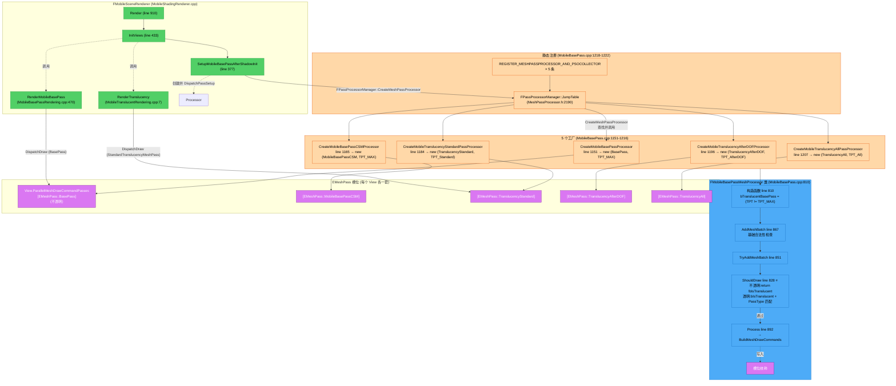
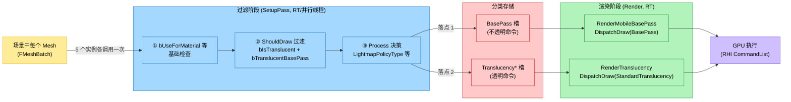
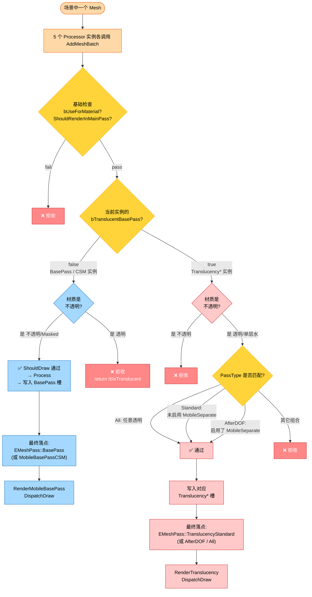
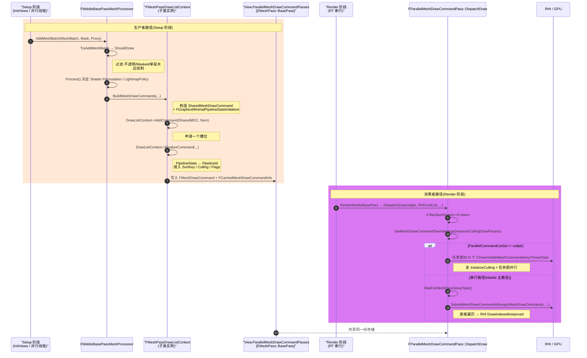
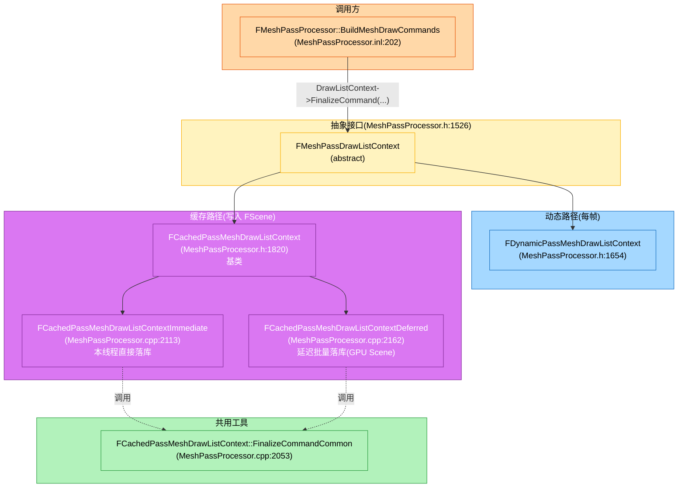
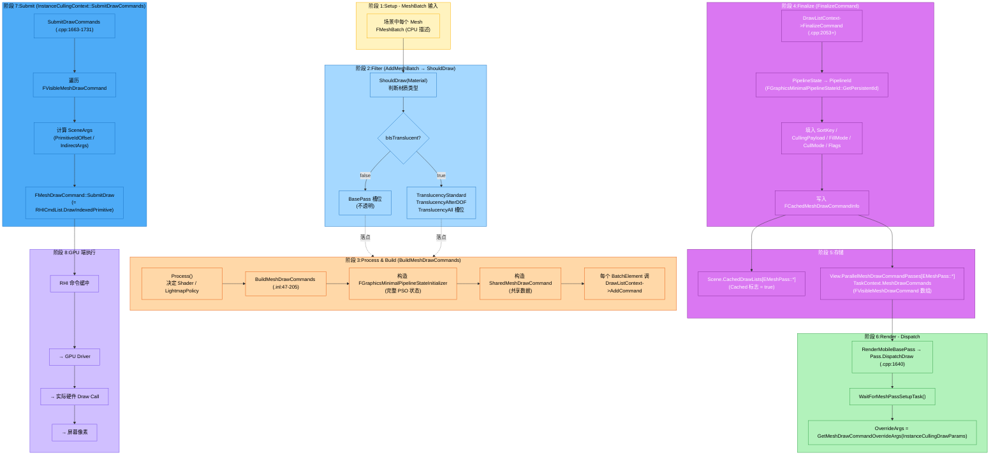

# Mobile BasePass 渲染架构分析(不透明 vs 透明)

> 目标平台:Android / UE 5.4.4
> 重点:`FMobileBasePassMeshProcessor` 与 `MobileBasePassRendering`、`FMobileSceneRenderer` 的关系;`AddMeshBatch` / `ShouldDraw` 的过滤机制;`DispatchDraw` 怎么消费过滤后的命令
> **已验证 `Docs/AddMeshBatch.md` 和 `Docs/ShouldDraw.md` 的关键代码位置**

---

## 0. 颠覆性认知(必读)

> **`FMobileBasePassMeshProcessor` 这个名字是误导性的**。
> 它的真实身份是 "**移动端前向着色 Mesh 处理器**" —— **同一个类被实例化 5 次**,分别挂到 5 个不同的 `EMeshPass` 槽位上:
>
> | 实例 | `EMeshPass` 槽位 | 处理的物体 |
> |------|------------------|-----------|
> | 1 | `EMeshPass::BasePass` | 不透明(写深度) |
> | 2 | `EMeshPass::MobileBasePassCSM` | 不透明(接收 CSM 阴影) |
> | 3 | `EMeshPass::TranslucencyStandard` | 普通半透明 |
> | 4 | `EMeshPass::TranslucencyAfterDOF` | DOF 后半透明(MobileSeparateTranslucency) |
> | 5 | `EMeshPass::TranslucencyAll` | 所有半透明(PSO 预编译兜底) |

区分不透明/透明的核心字段是 `bTranslucentBasePass`(构造函数 `MobileBasePass.cpp:822` 初始化)。

---

## 1. 三组件关系

### 1.1 文件归属

| 组件 | 文件 | 角色 |
|------|------|------|
| `FMobileBasePassMeshProcessor` | `Source/Runtime/Renderer/Private/MobileBasePass.cpp` (实现)<br/>`Source/Runtime/Renderer/Private/MobileBasePassRendering.h:460` (声明) | Mesh 处理器,过滤 + 生成 `FMeshDrawCommand` |
| `FMobileBasePassRendering` 相关文件 | `Source/Runtime/Renderer/Private/MobileBasePassRendering.h`<br/>`Source/Runtime/Renderer/Private/MobileBasePass.cpp` | 参数设置(Uniform Buffer、PSO、Shader Bindings) |
| `FMobileSceneRenderer` | `Source/Runtime/Renderer/Private/MobileShadingRenderer.cpp`<br/>`Source/Runtime/Renderer/Private/MobileBasePassRendering.cpp` | 场景渲染器:创建 Processor、调度渲染、调用 `DispatchDraw` |

### 1.2 关系架构

```
┌─────────────────────────────────────────────────────────────┐
│ FMobileSceneRenderer(MobileShadingRenderer.cpp)             │
│   - 引擎主渲染入口                                           │
│   - 负责:创建 Processor、Setup、Render、Dispatch            │
└──────────────┬──────────────────────────────────────────────┘
               │ 在 InitViews() 阶段(Line 726)
               │ 创建并填充 MeshDrawCommands
               ↓
┌─────────────────────────────────────────────────────────────┐
│ FMobileBasePassMeshProcessor(MobileBasePass.cpp)            │
│   - 实例化 5 次(同一类,不同 EMeshPass 槽位)                │
│   - AddMeshBatch → TryAddMeshBatch → ShouldDraw(过滤)       │
│   - ShouldDraw 通过后,Process() → BuildMeshDrawCommands    │
│   - 命令写入:FParallelMeshDrawCommandPasses[EMeshPass::*]   │
└──────────────┬──────────────────────────────────────────────┘
               │ 命令按 EMeshPass 分类存储
               │ View.ParallelMeshDrawCommandPasses[EMeshPass::BasePass]
               │ View.ParallelMeshDrawCommandPasses[EMeshPass::TranslucencyStandard]
               │ ...
               ↓
┌─────────────────────────────────────────────────────────────┐
│ FParallelMeshDrawCommandPass(各 EMeshPass 一个)            │
│   - 存储 FMeshDrawCommand 列表                              │
│   - 渲染时通过 DispatchDraw() 消费                          │
└─────────────────────────────────────────────────────────────┘
```

---

## 2. 过滤机制详解

### 2.1 三级过滤链路

```
FMobileBasePassMeshProcessor::AddMeshBatch       (MobileBasePass.cpp:867)
   ├─ 第 1 级过滤:基础合法性检查
   │     - MeshBatch.bUseForMaterial == false      → 拒收
   │     - Flags & DoNotCache == DoNotCache         → 拒收
   │     - PrimitiveSceneProxy->ShouldRenderInMainPass() == false → 拒收
   │
   ├─ 第 2 级过滤:TryAddMeshBatch
   │     └─ ShouldDraw(Material) ← 核心过滤
   │           - BasePass 实例:return !bIsTranslucent   (不收透明)
   │           - 透明 Pass 实例:return bIsTranslucent && PassType 匹配
   │
   └─ 第 3 级:ShouldDraw 通过 → Process()
         └─ BuildMeshDrawCommands(写入对应 EMeshPass 槽)
```

### 2.2 关键代码:`ShouldDraw` 的双分支逻辑

`MobileBasePass.cpp:828-849`:
```cpp
bool FMobileBasePassMeshProcessor::ShouldDraw(const FMaterial& Material) const
{
    const FMaterialShadingModelField ShadingModels = Material.GetShadingModels();
    const bool bIsTranslucent = IsTranslucentBlendMode(Material.GetBlendMode()) 
                             || ShadingModels.HasShadingModel(MSM_SingleLayerWater);
    const bool bCanReceiveCSM = (Flags & EFlags::CanReceiveCSM) == EFlags::CanReceiveCSM;
    
    if (bTranslucentBasePass)   // ⭐ 实例是"透明 Pass"吗?
    {
        // ★ 这一支专门给"透明 Pass 实例"用
        bool bShouldDraw = bIsTranslucent                                  // 必须是透明
            && !Material.IsDeferredDecal()                                 // 排除延迟贴花
            && (TranslucencyPassType == TPT_AllTranslucency                // 1) 兜底全收
                || (TranslucencyPassType == TPT_TranslucencyStandard 
                        && !Material.IsMobileSeparateTranslucencyEnabled()) // 2) 标准:未启用"独立透明"
                || (TranslucencyPassType == TPT_TranslucencyAfterDOF 
                        &&  Material.IsMobileSeparateTranslucencyEnabled()));// 3) DOF后:启用了"独立透明"
        return bShouldDraw;
    }
    else
    {
        // ★ 这一支给"BasePass 实例"用:只收非透明
        return !bIsTranslucent;
    }
}
```

### 2.3 过滤结果去向

| 材质类型 | `bTranslucentBasePass=false`<br/>(BasePass 实例) | `bTranslucentBasePass=true`<br/>(Translucency* 实例) | 最终落点 |
|----------|--------------------------------------------------|-----------------------------------------------------|----------|
| **不透明** | ✅ ShouldDraw 通过 → Process() | ❌ ShouldDraw 拒收 | `EMeshPass::BasePass` |
| **Masked** | ✅ ShouldDraw 通过 | ❌ 拒收 | `EMeshPass::BasePass` |
| **半透明(普通)** | ❌ 拒收 | ✅ Standard 实例通过 → Process() | `EMeshPass::TranslucencyStandard` |
| **半透明(MobileSeparate)** | ❌ 拒收 | ✅ AfterDOF 实例通过 → Process() | `EMeshPass::TranslucencyAfterDOF` |
| **单层水** | ❌ 拒收 | ✅ Standard/AfterDOF 视情况 | 对应透明 Pass |

> **关键**:场景中**每个 Mesh 都会被这 5 个 Processor 实例各喂一次**。每个实例只挑选自己感兴趣的那部分 mesh,生成对应的 `FMeshDrawCommand` 存入各自槽位。

---

## 3. `FMobileBasePassMeshProcessor` 创建与调用全链路

### 3.1 创建:5 个工厂 + 静态注册

`MobileBasePass.cpp:1151-1223`:

| 工厂函数 | 行号 | 构造的 EMeshPass | `bTranslucentBasePass` |
|----------|------|------------------|------------------------|
| `CreateMobileBasePassProcessor` | 1151 | `BasePass` | `false` |
| `CreateMobileBasePassCSMProcessor` | 1165 | `MobileBasePassCSM` | `false` |
| `CreateMobileTranslucencyStandardPassProcessor` | 1184 | `TranslucencyStandard` | `true` |
| `CreateMobileTranslucencyAfterDOFProcessor` | 1196 | `TranslucencyAfterDOF` | `true` |
| `CreateMobileTranslucencyAllPassProcessor` | 1207 | `TranslucencyAll` | `true` |

5 个工厂通过宏 `REGISTER_MESHPASSPROCESSOR_AND_PSOCOLLECTOR`(`MobileBasePass.cpp:1218-1222`)注册到 `FPassProcessorManager::JumpTable[ShadingPath][PassType]`。

### 3.2 实例化:`SetupMobileBasePassAfterShadowInit`

`MobileShadingRenderer.cpp:377-427`:

```cpp
void FMobileSceneRenderer::SetupMobileBasePassAfterShadowInit(...)
{
    for (int32 ViewIndex = 0; ViewIndex < AllViews.Num(); ++ViewIndex)
    {
        FViewInfo& View = *AllViews[ViewIndex];
        
        // Line 388: 创建 BasePass Processor(走跳转表 → CreateMobileBasePassProcessor)
        FMeshPassProcessor* MeshPassProcessor = 
            FPassProcessorManager::CreateMeshPassProcessor(
                EShadingPath::Mobile, EMeshPass::BasePass, ...);
        
        // Line 390: 创建 CSM Processor
        FMeshPassProcessor* BasePassCSMMeshPassProcessor = 
            FPassProcessorManager::CreateMeshPassProcessor(
                EShadingPath::Mobile, EMeshPass::MobileBasePassCSM, ...);
        
        // Line 403: 取得 Pass 引用
        FParallelMeshDrawCommandPass& Pass = 
            View.ParallelMeshDrawCommandPasses[EMeshPass::BasePass];
        
        // Line 410-425: 启动并行 Setup(调用 AddMeshBatch)
        Pass.DispatchPassSetup(..., MeshPassProcessor, ..., 
                               BasePassCSMMeshPassProcessor, ...);
    }
}
```

> 注:**只有 BasePass 和 CSM 在这里手动创建并启动 `DispatchPassSetup`**。透明 Pass 走 `FSceneRenderer::SetupMeshPass`(`SceneRendering.cpp:4196`)的通用循环。

### 3.3 `DispatchPassSetup` 内部流程

`MeshDrawCommands.cpp:1334-1453`(`FParallelMeshDrawCommandPass::DispatchPassSetup`):

```
DispatchPassSetup (主线程/并行)
   ├─ 启动并行任务 FMeshDrawCommandPassSetupTask::AnyThreadTask (定义：MeshDrawCommands.cpp:1006，调用：MeshDrawCommands.cpp:1448)
   │     ├─ BasePass 分支 (Line 1019-1044)
   │     │   ├─ MergeMobileBasePassMeshDrawCommands (合并 cached static commands)
   │     │   └─ GenerateMobileBasePassDynamicMeshDrawCommands (定义：MeshDrawCommands.cpp:674，调用：MeshDrawCommands.cpp:1028)
   │     │         ├─ PassMeshProcessor->AddMeshBatch (Line 728 / 769)  ← ★ 调用点 1
   │     │         └─ MobilePassCSMPassMeshProcessor->AddMeshBatch (Line 724 / 764) ← ★ 调用点 2
   │     │
   │     └─ 其它 Pass 分支 (Line 1046-1063)
   │           └─ GenerateDynamicMeshDrawCommands (MeshDrawCommands.cpp:581)
   │                 └─ Processor->AddMeshBatch
   │
   └─ Processor->AddMeshBatch() ⭐ 虚函数调用
         → FMobileBasePassMeshProcessor::AddMeshBatch (MobileBasePass.cpp:867)
              → TryAddMeshBatch (MobileBasePass.cpp:851)
                   → ShouldDraw() ← 过滤 ⭐
                   → Process() → BuildMeshDrawCommands
                        → FMeshDrawCommand 写入 DrawListContext
```

### 3.4 渲染阶段:`DispatchDraw` 消费

`MobileBasePassRendering.cpp:470-491`(`RenderMobileBasePass`):
```cpp
void FMobileSceneRenderer::RenderMobileBasePass(FRHICommandList& RHICmdList, 
    const FViewInfo& View, const FInstanceCullingDrawParams* InstanceCullingDrawParams) 
{
    RHICmdList.SetViewport(...);
    
    // ⭐ 不透明命令:取 BasePass 槽
    View.ParallelMeshDrawCommandPasses[EMeshPass::BasePass]
        .DispatchDraw(nullptr, RHICmdList, InstanceCullingDrawParams);
    
    if (View.Family->EngineShowFlags.Atmosphere) {
        View.ParallelMeshDrawCommandPasses[EMeshPass::SkyPass].DispatchDraw(...);
    }
}
```

`MobileTranslucentRendering.cpp:7-20`(`RenderTranslucency`):
```cpp
void FMobileSceneRenderer::RenderTranslucency(FRHICommandList& RHICmdList, const FViewInfo& View)
{
    const bool bShouldRenderTranslucency = 
        ShouldRenderTranslucency(StandardTranslucencyPass) && ViewFamily.EngineShowFlags.Translucency;
    
    if (bShouldRenderTranslucency) {
        RHICmdList.SetViewport(...);
        // ⭐ 透明命令:取 TranslucencyStandard 槽(由运行时决定)
        View.ParallelMeshDrawCommandPasses[StandardTranslucencyMeshPass]
            .DispatchDraw(nullptr, RHICmdList, &TranslucencyInstanceCullingDrawParams);
    }
}
```

`StandardTranslucencyMeshPass` 由 `MobileShadingRenderer.cpp:307-308` 决定:
```cpp
StandardTranslucencyPass = ViewFamily.AllowTranslucencyAfterDOF() 
                           ? ETranslucencyPass::TPT_TranslucencyStandard 
                           : ETranslucencyPass::TPT_AllTranslucency;
StandardTranslucencyMeshPass = TranslucencyPassToMeshPass(StandardTranslucencyPass);
```

### 3.5 4 个串联点

`MobileShadingRenderer.cpp` 中 4 处固定结构(不透明 → 透明):
- `Line 1609/1623`:`RenderForwardSinglePass` (Forward 路径)
- `Line 1682/1735`:`RenderForwardMultiPass`
- `Line 1968/1985`:`RenderDeferredSinglePass`
- `Line 2011/2068`:`RenderDeferredMultiPass`

每处都按 `RenderMobileBasePass → ... → RenderTranslucency` 顺序执行。

---

## 4. Mermaid 全链路图

### 4.1 三组件关系 + 5 实例化



### 4.2 数据流:从 Mesh 到 GPU



### 4.3 不透明 vs 透明决策树



---

## 5. 关键认知点

### 5.1 `DispatchDraw` 的 `EMeshPass` 参数与过滤结果的关系

| `DispatchDraw` 调用点 | 操作的 `EMeshPass` 槽 | 包含的 mesh 类型(由 ShouldDraw 过滤结果决定) |
|----------------------|----------------------|----------------------------------------------|
| `RenderMobileBasePass` (line 470) | `EMeshPass::BasePass` | 不透明 + Masked + 单层水 ❌ |
| `RenderTranslucency` (MobileTranslucentRendering.cpp:18) | `EMeshPass::TranslucencyStandard` (或 `TranslucencyAll`) | 半透明(标准/独立/DOF后) |

> `DispatchDraw` 不直接做"过滤"——它只是把已经按 `EMeshPass` 分类存储的 `FMeshDrawCommand` 提交到 GPU。**过滤已经由 `ShouldDraw` 在 Setup 阶段完成**。

### 5.2 Processor 的"复用"思想

UE 用一个 `FMobileBasePassMeshProcessor` 类同时服务:
- **3 个不透明相关槽位**(BasePass、CSM、Hidden)
- **3 个透明相关槽位**(Standard、AfterDOF、All)
- **共享 90% 代码**(PSO 收集、Shader 绑定、Mesh 命令构建)
- **10% 差异**通过 `EFlags` + `ETranslucencyPass::Type` + `bTranslucentBasePass` + 渲染状态参数控制

### 5.3 5 个实例被遍历 5 次

**每个 Mesh 在场景里都会被这 5 个 Processor 实例各调用一次 `AddMeshBatch`**:
- 不透明桌子 → 5 个实例都被问,只有 BasePass + CSM 通过 → 命令进 2 个不透明槽
- 普通半透明玻璃 → Standard + All 通过 → 命令进 2 个透明槽
- 独立透明玻璃(带 MobileSeparate)→ AfterDOF + All 通过 → 命令进 2 个透明槽
- 单层水 → 同透明逻辑(因 `HasShadingModel(MSM_SingleLayerWater)`)

### 5.4 Cached vs Dynamic 路径

- **Cached**(静态 mesh):大部分静态 mesh 的 MDC 在 `FPrimitiveSceneInfo::AddToScene` 阶段就缓存,带 `EMeshPassFlags::CachedMeshCommands` 标志。Setup 阶段只合并(`MergeMobileBasePassMeshDrawCommands`)。
- **Dynamic**(动态 mesh 或 CSM 切换):每帧的 View 状态改变时,走 `GenerateMobileBasePassDynamicMeshDrawCommands` 重新生成。

---

## 6. 关键代码位置速查

| 关注点 | 文件 | 行号 |
|--------|------|------|
| 5 个 Processor 工厂 | `MobileBasePass.cpp` | 1151-1216 |
| `REGISTER_*` 宏 | `MobileBasePass.cpp` | 1218-1222 |
| `FMobileBasePassMeshProcessor` 类声明 | `MobileBasePassRendering.h` | 460 |
| 构造函数 + `bTranslucentBasePass` | `MobileBasePass.cpp` | 810-826 |
| `ShouldDraw` 双分支 | `MobileBasePass.cpp` | 828-849 |
| `TryAddMeshBatch` | `MobileBasePass.cpp` | 851-865 |
| `AddMeshBatch` 入口 | `MobileBasePass.cpp` | 867-890 |
| `Process` 核心 | `MobileBasePass.cpp` | 892+ |
| `SetupMobileBasePassAfterShadowInit` | `MobileShadingRenderer.cpp` | 377-427 |
| Processor 创建调用 | `MobileShadingRenderer.cpp` | 388, 390 |
| `DispatchPassSetup` 调用 | `MobileShadingRenderer.cpp` | 410-425 |
| `StandardTranslucencyPass/MeshPass` 决定 | `MobileShadingRenderer.cpp` | 307-308 |
| `RenderMobileBasePass` 派发不透明 | `MobileBasePassRendering.cpp` | 470-491 |
| `RenderTranslucency` 派发透明 | `MobileTranslucentRendering.cpp` | 7-20 |
| 4 处串联(不透明→透明) | `MobileShadingRenderer.cpp` | 1609/1623、1682/1735、1968/1985、2011/2068 |
| `DispatchPassSetup` | `MeshDrawCommands.cpp` | 1334-1453 |
| `GenerateMobileBasePassDynamicMeshDrawCommands` | `MeshDrawCommands.cpp` | 674 |
| `AnyThreadTask` 分发 | `MeshDrawCommands.cpp` | 1006 |
| `FPassProcessorManager::JumpTable` | `MeshPassProcessor.h` | 2190+ |

---

## 7. 与现有 Docs 的对应关系

| 现有文档 | 本文对应章节 |
|----------|--------------|
| `Docs/AddMeshBatch.md` | §3(创建与调用链路)、§6(代码位置) |
| `Docs/ShouldDraw.md` | §2(过滤机制)、§5.3(5 实例遍历) |
| `Docs/RenderBaseAndTranslucencyPass.md` | §3.5(4 处串联点)、§5.1(DispatchDraw 参数) |

本文主要贡献:把**三组件关系**(Processor、Rendering、SceneRenderer)整合到一张图,并明确 `DispatchDraw` 的 `EMeshPass` 参数**不直接过滤**而**消费已分类的过滤结果**这一关键事实。

---

## 8. `BuildMeshDrawCommands` 与 `DispatchDraw` 的"生产者-消费者"关系

> 本节回答三个问题:
> 1. `BuildMeshDrawCommands` 里的 `DrawListContext->FinalizeCommand(...)` 在**构建**什么?
> 2. 它和 `RenderMobileBasePass` 里的 `View.ParallelMeshDrawCommandPasses[EMeshPass::BasePass].DispatchDraw(...)` 是**同一回事**还是**上下游**?
> 3. 一帧之内,完整路径是 `AddMeshBatch → BuildMeshDrawCommands → FinalizeCommand(写命令) → DispatchDraw(读命令提交 GPU)`,各自的角色是什么?

### 8.1 一句话定性

> **`BuildMeshDrawCommands` + `FinalizeCommand` 是"生产者"(Setup 阶段),`DispatchDraw` 是"消费者"(Render 阶段)。**
> **二者**通过 `View.ParallelMeshDrawCommandPasses[EMeshPass::*]` 这个**共享存储**解耦 —— **生产者把 `FMeshDrawCommand` 写进去,消费者把它读出来丢给 GPU**。

```
┌──────────────────────────────────────────────────────────────────┐
│ Setup 阶段(InitViews 内,可能并行)                                │
│   AddMeshBatch                                                  │
│     → TryAddMeshBatch                                           │
│     → ShouldDraw(过滤)                                          │
│     → Process()                                                 │
│     → FMeshPassProcessor::BuildMeshDrawCommands(.inl)           │
│         → DrawListContext->AddCommand(...)(分配槽位)            │
│         → DrawListContext->FinalizeCommand(...)(写 PipelineId)  │
│             → 落点:Scene.CachedDrawLists[EMeshPass::*]          │
│                 或  View.ParallelMeshDrawCommandPasses[].Dynamic │
└──────────────────────────────────────────────────────────────────┘
                          ↓ (共享 View.ParallelMeshDrawCommandPasses[EMeshPass::*])
┌──────────────────────────────────────────────────────────────────┐
│ Render 阶段(RT 串行)                                            │
│   RenderMobileBasePass                                          │
│     → View.ParallelMeshDrawCommandPasses[EMeshPass::BasePass]   │
│       .DispatchDraw(nullptr, RHICmdList, InstanceCullingDrawParams)│
│         → 任务图并行:FDrawVisibleMeshCommandsAnyThreadTask       │
│         → SubmitMeshDrawCommands → RHI DrawIndexedInstanced     │
└──────────────────────────────────────────────────────────────────┘
```

### 8.2 关键代码对照(原文)

#### 8.2.1 生产者端:`MeshPassProcessor.inl:156-204`(`BuildMeshDrawCommands` 内部)

```cpp
// (简化展示,实际 inl 文件第 156-204 行)
for (int32 BatchElementIndex = 0; BatchElementIndex < NumElements; BatchElementIndex++)
{
    if ((1ull << BatchElementIndex) & BatchElementMask)
    {
        const FMeshBatchElement& BatchElement = MeshBatch.Elements[BatchElementIndex];

        // ① 申请一个 FMeshDrawCommand 槽位(浅拷贝共享参数)
        FMeshDrawCommand& MeshDrawCommand = DrawListContext->AddCommand(SharedMeshDrawCommand, NumElements);

        // ② 填充 element-specific 的 Shader 绑定(Vertex / Pixel / Geometry)
        // ... (省略 ~20 行)

        FMeshDrawCommandPrimitiveIdInfo IdInfo = GetDrawCommandPrimitiveId(PrimitiveSceneInfo, BatchElement);

        // ③ 关键:把完整 FMeshDrawCommand + PipelineState 提交到 Context,
        //    Context 内部负责"打包、生成 PipelineId、写入对应槽位"
        DrawListContext->FinalizeCommand(
            MeshBatch, BatchElementIndex, IdInfo,
            MeshFillMode, MeshCullMode, SortKey, Flags,
            PipelineState, &MeshProcessorShaders, MeshDrawCommand);
    }
}
```

> **注意三层结构**:
> - `SharedMeshDrawCommand`:跨 batch element 共享的部分(StencilRef、PrimitiveType、Shader、VertexStreams …),**在 for 外构造一次**。
> - `MeshDrawCommand`:**每个 BatchElement 一份**(`AddCommand` 时 `= SharedMeshDrawCommand`,后续覆盖 element-only 字段)。
> - `PipelineState`:**整次调用一份**,传给 `FinalizeCommand` 用于生成 `PipelineId`。

#### 8.2.2 Context 端的两种实现

`FinalizeCommand` 是 `FMeshPassDrawListContext` 的**虚函数**(`MeshPassProcessor.h:1534-1544`)。UE 提供 3 个实现:

| Context 类 | 文件:行 | 何时使用 | 写入哪里 |
|------------|---------|----------|----------|
| `FDynamicPassMeshDrawListContext` | `MeshPassProcessor.h:1654-1719` | Dynamic 路径(无 Cached 标志) | `MeshDrawCommandStorage`(本帧数组)+ `FVisibleMeshDrawCommand` 数组 |
| `FCachedPassMeshDrawListContextImmediate` | `MeshPassProcessor.cpp:2113-2160` | Cached 路径(本线程直接落库) | `Scene.CachedDrawLists[CurrMeshPass].MeshDrawCommands`(稀疏数组) |
| `FCachedPassMeshDrawListContextDeferred` | `MeshPassProcessor.cpp:2162-…` | Cached 路径(延迟落库,GPU Scene) | `DeferredCommands`(本帧数组),再批量 `AddToScene` |

`FinalizeCommandCommon`(`MeshPassProcessor.cpp:2053-2111`)**共用的核心逻辑**:

```cpp
void FCachedPassMeshDrawListContext::FinalizeCommandCommon(...)
{
    // ① 把 PSO Initializer 哈希成全局唯一的 PipelineId(可能在 PersistentIdTable 注册)
    FGraphicsMinimalPipelineStateId PipelineId =
        FGraphicsMinimalPipelineStateId::GetPersistentId(PipelineState);

    // ② 把 PipelineId 写入 MeshDrawCommand(以后 RHI 只需传 Id,不需要 PSO 全状态)
    MeshDrawCommand.SetDrawParametersAndFinalize(MeshBatch, BatchElementIndex,
                                                 PipelineId, ShadersForDebugging);

    // ③ 打包"可见性"元数据(SortKey、Fill/Cull、Flags、CullingPayload)
    CommandInfo.SortKey = SortKey;
    CommandInfo.CullingPayload = CreateCullingPayload(MeshBatch, ...);
    CommandInfo.MeshFillMode = MeshFillMode;
    CommandInfo.MeshCullMode = MeshCullMode;
    CommandInfo.Flags = Flags;
}
```

> **关键洞见**:`FinalizeCommand` 这一步是"**转换**"——把 `FGraphicsMinimalPipelineStateInitializer`(完整 PSO 状态)变成 `FGraphicsMinimalPipelineStateId`(32-bit id),便于 GPU 端按 id 查 PSO;同时把 `FMeshDrawCommand`(底层数据)和 `FCachedMeshDrawCommandInfo`(上层元数据)配对保存。**没有这一步,Setup 阶段输出的是不可提交的原始数据**。

#### 8.2.3 消费者端:`MeshDrawCommands.cpp:1640-1717`(`FParallelMeshDrawCommandPass::DispatchDraw`)

```cpp
void FParallelMeshDrawCommandPass::DispatchDraw(
    FParallelCommandListSet* ParallelCommandListSet,
    FRHICommandList& RHICmdList,
    const FInstanceCullingDrawParams* InstanceCullingDrawParams) const
{
    if (MaxNumDraws <= 0) return;   // 空 Pass 早退

    // ① 把 InstanceCulling 信息(IndirectArgs)转成 OverrideArgs
    FMeshDrawCommandOverrideArgs OverrideArgs;
    if (InstanceCullingDrawParams)
    {
        OverrideArgs = GetMeshDrawCommandOverrideArgs(*InstanceCullingDrawParams);
    }

    if (ParallelCommandListSet)   // 并行路径(有 ParallelCommandList)
    {
        // 把 Setup task 的 TaskEventRef 当 prereq,
        // 然后按 NumEstimatedDraws 切给若干个 FDrawVisibleMeshCommandsAnyThreadTask
        // 每个任务在 RHIT/RT 线程上:
        //   ① 拿 InstanceCullingContext 算可见实例
        //   ② 调 SubmitMeshDrawCommands → RHI DrawIndexedInstanced
    }
    else                         // 串行路径(Mobile 主路径通常走这里)
    {
        WaitForMeshPassSetupTask();   // 同步等 Setup 完成

        if (TaskContext.bUseGPUScene)
        {
            TaskContext.InstanceCullingContext.SubmitDrawCommands(...);
        }
        else
        {
            SubmitMeshDrawCommandsRange(
                TaskContext.MeshDrawCommands,
                TaskContext.MinimalPipelineStatePassSet,
                SceneArgs, 0,
                TaskContext.bDynamicInstancing,
                0, TaskContext.MeshDrawCommands.Num(),
                TaskContext.InstanceFactor,
                RHICmdList);
        }
    }
}
```

#### 8.2.4 调用点:`MobileBasePassRendering.cpp:470-491`(`RenderMobileBasePass`)

```cpp
void FMobileSceneRenderer::RenderMobileBasePass(
    FRHICommandList& RHICmdList,
    const FViewInfo& View,
    const FInstanceCullingDrawParams* InstanceCullingDrawParams)
{
    // ... 性能计数 / SetViewport ...

    // ★ 这里就是"消费"入口
    View.ParallelMeshDrawCommandPasses[EMeshPass::BasePass]
        .DispatchDraw(nullptr, RHICmdList, InstanceCullingDrawParams);

    if (View.Family->EngineShowFlags.Atmosphere)
    {
        View.ParallelMeshDrawCommandPasses[EMeshPass::SkyPass]
            .DispatchDraw(nullptr, RHICmdList, &SkyPassInstanceCullingDrawParams);
    }

    // editor primitives (用 DrawDynamicMeshPass 走另一条路,不走 Pass slot)
    RenderMobileEditorPrimitives(RHICmdList, View, DrawRenderState, InstanceCullingDrawParams);
}
```

### 8.3 时序图(Setup 与 Render 的分工)



### 8.4 数据流图(从 MeshBatch 到 GPU 指令)

```mermaid
flowchart LR
    subgraph SetupStage["Setup 阶段(生产者)"]
        direction TB
        A1["MeshBatch<br/>(FPrimitiveSceneProxy 提交)"]
        A2["ShouldDraw(Material)<br/>过滤:!bIsTranslucent"]
        A3["Process()<br/>决定 Shader / Lightmap"]
        A4["BuildMeshDrawCommands<br/>(MeshPassProcessor.inl:47-205)"]
        A5["DrawListContext->AddCommand<br/>= SharedMeshDrawCommand"]
        A6["DrawListContext->FinalizeCommand<br/>(MeshPassProcessor.cpp:2053+)"]
        A7["PipelineState → PipelineId<br/>(GetPersistentId 哈希)"]

        A1 --> A2 --> A3 --> A4 --> A5 --> A6 --> A7
    end

    subgraph Storage["共享存储"]
        direction TB
        S1["Scene.CachedDrawLists<br/>[EMeshPass::BasePass]<br/>(Cached 路径)"]
        S2["View.ParallelMeshDrawCommandPasses<br/>[EMeshPass::BasePass]<br/>(Dynamic 路径 + 当前帧可见命令)"]
    end

    subgraph RenderStage["Render 阶段(消费者)"]
        direction TB
        R1["RenderMobileBasePass<br/>(MobileBasePassRendering.cpp:470)"]
        R2["Pass.DispatchDraw<br/>(MeshDrawCommands.cpp:1640)"]
        R3["SubmitMeshDrawCommandsRange<br/>→ RHI DrawIndexedInstanced"]
        R4["GPU 执行"]

        R1 --> R2 --> R3 --> R4
    end

    A7 -- "Cached 标志 = true" --> S1
    A7 -- "Dynamic 或 Setup 合并后" --> S2

    S1 -. "AddToScene 阶段聚合" .-> S2
    S2 -- "按 EMeshPass 槽位读取" --> R1

    classDef producer fill:#ffd8a8,stroke:#e8590c,color:#000
    classDef storage fill:#da77f2,stroke:#862e9c,color:#fff
    classDef consumer fill:#b2f2bb,stroke:#2f9e44,color:#000
    classDef gpu fill:#d0bfff,stroke:#7048e8,color:#000

    class A1,A2,A3,A4,A5,A6,A7,SetupStage producer
    class S1,S2,Storage storage
    class R1,R2,R3,RenderStage consumer
    class R4,GPU gpu
```



### 8.5 类关系图(3 个 Context 子类)



### 8.6 表格总结:Setup vs Render 的对比

| 维度 | 生产者(Setup) | 消费者(Render) |
|------|---------------|----------------|
| **触发函数** | `FMeshPassProcessor::BuildMeshDrawCommands` | `FParallelMeshDrawCommandPass::DispatchDraw` |
| **触发位置** | `Pass.DispatchPassSetup()` 内部,可能并行线程 | `RenderMobileBasePass` / `RenderTranslucency` 内部,RT 串行 |
| **做什么** | 过滤 mesh → 生成 `FMeshDrawCommand` → 生成 `PipelineId` → 写存储 | 读存储 → InstanceCulling → 提交 RHI 绘制 |
| **写入/读取** | 写入 `Scene.CachedDrawLists[EMeshPass::*]` 与 `View.ParallelMeshDrawCommandPasses[EMeshPass::*]` | 读取 `View.ParallelMeshDrawCommandPasses[EMeshPass::*]` |
| **关键虚函数** | `DrawListContext->AddCommand`、`DrawListContext->FinalizeCommand` | `InstanceCullingContext::SubmitDrawCommands`、`SubmitMeshDrawCommandsRange` |
| **粒度** | 一个 mesh batch 一个 mesh batch 推进 | 一个 Pass 一次扫完所有可见命令 |
| **时序** | 在 `InitViews` 之后,`Render` 之前 | 在 `Render` 内部,绘制前 |
| **是否动 GPU** | 否,只在 CPU 上组织数据 | 是,真正发 RHI 指令 |
| **与 EMeshPass 关系** | 过滤后**落点到具体槽位** | **从具体槽位取出**绘制 |
| **和材质类型关系** | **就是生成"不透明/透明"命令的关键节点** —— 5 个 Mobile 工厂的 `ShouldDraw` 决定每个 mesh 落进哪个槽位;落到 BasePass 槽的就是不透明命令,落到 TranslucencyStandard/AfterDOF/All 槽的就是透明命令 | **不区分材质类型** —— 只按槽位取出,逐条执行 `RHI DrawIndexedInstanced` |

### 8.7 透明 vs 不透明命令的"生成位置"vs"提交位置"对照

| 渲染阶段 | 不透明命令 | 透明命令 |
|----------|------------|----------|
| **生成(Setup)** | 由 `FMobileBasePassMeshProcessor`(bTranslucentBasePass=false)经 `BuildMeshDrawCommands` → `FinalizeCommand` 落到 `View.ParallelMeshDrawCommandPasses[EMeshPass::BasePass]`(以及 `MobileBasePassCSM`) | 由 `FMobileBasePassMeshProcessor`(bTranslucentBasePass=true)经同样路径落到 `EMeshPass::TranslucencyStandard` / `TranslucencyAfterDOF` / `TranslucencyAll` |
| **提交(Render)** | `RenderMobileBasePass` → `Passes[BasePass].DispatchDraw(...)` | `RenderTranslucency` → `Passes[StandardTranslucencyMeshPass].DispatchDraw(...)` |
| **同一类?** | **是的** —— 同一类 `FMobileBasePassMeshProcessor`、同一 `BuildMeshDrawCommands` 模板、同一 `FinalizeCommand` 路径,只是构造参数 + 过滤分支不同 | 同左 |

> **结论**:`BuildMeshDrawCommands` 里的 `FinalizeCommand` **不区分"透明/不透明"**,它**只认 `EMeshPass` 槽位**。所谓"透明命令"和"不透明命令"是 **`ShouldDraw` 过滤后落到不同槽位的结果**,在 `BuildMeshDrawCommands` 内部是**同一段代码**。

### 8.8 关键代码位置速查(本节新增)

| 关注点 | 文件 | 行号 |
|--------|------|------|
| `BuildMeshDrawCommands` 完整实现 | `MeshPassProcessor.inl` | 47-205 |
| `BuildMeshDrawCommands` 调 `FinalizeCommand` | `MeshPassProcessor.inl` | 202 |
| `FMeshPassDrawListContext` 抽象基类 | `MeshPassProcessor.h` | 1526-1545 |
| `FDynamicPassMeshDrawListContext` 类 | `MeshPassProcessor.h` | 1654-1719 |
| `FCachedPassMeshDrawListContext` 基类 | `MeshPassProcessor.h` | 1820-1874 |
| `FCachedPassMeshDrawListContextImmediate::FinalizeCommand` | `MeshPassProcessor.cpp` | 2113-2160 |
| `FCachedPassMeshDrawListContextDeferred::FinalizeCommand` | `MeshPassProcessor.cpp` | 2162-… |
| `FinalizeCommandCommon` 公共逻辑 | `MeshPassProcessor.cpp` | 2053-2111 |
| `FParallelMeshDrawCommandPass::DispatchDraw` | `MeshDrawCommands.cpp` | 1640-1717 |
| `RenderMobileBasePass` 调 `DispatchDraw` | `MobileBasePassRendering.cpp` | 478 |
| `RenderTranslucency` 调 `DispatchDraw` | `MobileTranslucentRendering.cpp` | 18 |
| `SubmitMeshDrawCommandsRange` 遍历 + RHI | `MeshDrawCommands.cpp`(外部声明 `MeshPassProcessor.h:2284`) | — |

### 8.9 一句话总结

> **Setup 阶段**:`AddMeshBatch` 过滤 → `Process` 决策 → `BuildMeshDrawCommands` 组装 → `FinalizeCommand` 写 `PipelineId` + 元数据 → 落入 `View.ParallelMeshDrawCommandPasses[EMeshPass::*]`。
> **Render 阶段**:`DispatchDraw` 从同一份 `View.ParallelMeshDrawCommandPasses[EMeshPass::*]` 读出 → InstanceCulling → `RHI DrawIndexedInstanced`。
> **"不透明/透明"的差异发生在 `ShouldDraw` 阶段(过滤落点)**,不在 `BuildMeshDrawCommands` 也不在 `DispatchDraw`,**它俩对透明/不透明一视同仁**。

---

## 9. `SubmitDrawCommands` 内部到底消费了什么、发出了什么

> 本节回应你的问题:
> - `TaskContext.InstanceCullingContext.SubmitDrawCommands(...)` 这 7 个参数**分别是什么、从哪里来**?
> - `RHICmdList` **是干嘛的**,最终**把什么写进 GPU**?
> - `InstanceCullingDrawParams` **是什么类型**,**怎么产生**、**怎么传进来**?
> - 整个一帧的 mesh → GPU 完整路径**最后 5 步**是什么?

### 9.1 先看代码(MeshDrawCommands.cpp:1697-1710)

```cpp
if (TaskContext.bUseGPUScene)
{
    if (TaskContext.MeshDrawCommands.Num() > 0)
    {
        TaskContext.InstanceCullingContext.SubmitDrawCommands(
            TaskContext.MeshDrawCommands,                                  // ① 可见命令数组
            TaskContext.MinimalPipelineStatePassSet,                       // ② PSO 状态集合
            OverrideArgs,                                                 // ③ InstanceCulling 重写参数
            0,                                                            // ④ 起始索引
            TaskContext.MeshDrawCommands.Num(),                           // ⑤ 命令数
            TaskContext.InstanceFactor,                                   // ⑥ 实例倍率(Stereo 翻倍)
            RHICmdList);                                                  // ⑦ RHI 命令列表(发到 GPU)
    }
}
```

### 9.2 7 个参数分别是什么

| # | 参数 | 类型 | **从哪来** | **干什么用** |
|---|------|------|-----------|--------------|
| ① | `TaskContext.MeshDrawCommands` | `FMeshCommandOneFrameArray`(即 `TArray<FVisibleMeshDrawCommand>`) | **Setup 阶段** `AddMeshBatch → BuildMeshDrawCommands → FinalizeCommand` 填入;由 `Pass.DispatchPassSetup` 在并行任务里完成 | 本 Pass 本帧**所有可见 mesh 命令**(已经按 SortKey 排好序) |
| ② | `TaskContext.MinimalPipelineStatePassSet` | `FGraphicsMinimalPipelineStateSet`(哈希集合) | **Setup 阶段** 在 `FinalizeCommandCommon` 里通过 `FGraphicsMinimalPipelineStateId::GetPersistentId(PipelineState)` **注册**所有用到的 PSO | `FGraphicsMinimalPipelineStateId` → `FGraphicsMinimalPipelineStateInitializer` 的反查表,GPU 端按 id 找 PSO |
| ③ | `OverrideArgs` | `FMeshDrawCommandOverrideArgs` | **`DispatchDraw` 第 1648-1652 行** `GetMeshDrawCommandOverrideArgs(*InstanceCullingDrawParams)` | 把"GPU Scene 的 instance 数据"以**重写**方式塞进每条命令 |
| ④ | `0` | `int32` | 写死:从第 0 条开始 | 遍历起点 |
| ⑤ | `TaskContext.MeshDrawCommands.Num()` | `int32` | 写死:全量 | 遍历终点(也可以切片传子集) |
| ⑥ | `TaskContext.InstanceFactor` | `uint32` | **1 或 2**(ISR 立体声时为 2) | DrawIndexedInstanced 的 instance 倍率 |
| ⑦ | `RHICmdList` | `FRHICommandList&` | 由 **RHI 渲染线程的 Pass 执行回调** 注入(`FRDGPass::Execute`) | **真正写入 GPU 命令流的载体** |

### 9.3 三个关键概念深入

#### 9.3.1 `RHICmdList` —— "GPU 指令的写字板"

```cpp
// 简化定义(RHICommandList.h)
class FRHICommandList {
    // 本质:一段"延迟执行的 GPU 命令列表"
    // - 调用 SetViewport / SetGraphicsPipelineState / DrawIndexedInstanced ...
    // - 这些调用不立即下到 GPU,而是把"命令 + 参数"打包成指令
    // - 稍后 Execute() 才把它们一次性推给驱动
};
```

**核心特性**:
- **RHI 抽象层**:`RHICmdList.DrawIndexedInstanced(...)` 写法,**不依赖** D3D12 / Vulkan / Metal,UE 在底层帮你翻译成对应 API 调用。
- **延迟执行**(`RHI_THREAD` 模式):写操作入队,**渲染线程**批量 flush。
- **生命周期**:**与 RDG Pass 绑定** —— Pass 的 `[](FRHICommandList& CmdList) { ... }` 回调被 RDG 调度执行时,`RHICmdList` 才被创建并注入。

> **可以这样理解**:`RHICmdList` 是一支笔,UE 渲染模块在它上面写 "画什么 / 怎么画";Pass 执行完就把笔收回,统一 flush 给 GPU。

#### 9.3.2 `InstanceCullingDrawParams` —— "GPU 端 Instance 剔除的入口参数"

源码定义(`InstanceCullingContext.h:32-40`):

```cpp
BEGIN_SHADER_PARAMETER_STRUCT(FInstanceCullingDrawParams, )
    RDG_BUFFER_ACCESS(DrawIndirectArgsBuffer, ERHIAccess::IndirectArgs)
    RDG_BUFFER_ACCESS(InstanceIdOffsetBuffer, ERHIAccess::VertexOrIndexBuffer)
    SHADER_PARAMETER(uint32, InstanceDataByteOffset)   // offset into per-instance buffer
    SHADER_PARAMETER(uint32, IndirectArgsByteOffset)   // offset into indirect args buffer
    SHADER_PARAMETER_RDG_UNIFORM_BUFFER(FInstanceCullingGlobalUniforms, InstanceCulling)
    SHADER_PARAMETER_RDG_UNIFORM_BUFFER(FSceneUniformParameters, Scene)
    SHADER_PARAMETER_RDG_UNIFORM_BUFFER(FBatchedPrimitiveParameters, BatchedPrimitive)
END_SHADER_PARAMETER_STRUCT()
```

**字段含义**:

| 字段 | 类型 | 含义 |
|------|------|------|
| `DrawIndirectArgsBuffer` | RDG Buffer (IndirectArgs access) | GPU 端 ExecuteIndirect 用的"绘制参数缓冲"(indexCount / instanceCount / startIndex / ...),**由 GPU 剔除阶段填好** |
| `InstanceIdOffsetBuffer` | RDG Buffer (Vertex access) | **每个 instance 的 Id 列表**(决定画哪几个实例) |
| `InstanceDataByteOffset` | uint32 | **per-instance 数据缓冲**里的起点偏移 |
| `IndirectArgsByteOffset` | uint32 | 在 `DrawIndirectArgsBuffer` 里的偏移 |
| `InstanceCulling` | Uniform Buffer | GPU Scene 的 instance/page 元数据 |
| `Scene` | Uniform Buffer | 场景公共参数 |
| `BatchedPrimitive` | Uniform Buffer | 批量 primitive 数据(可选) |

**这个结构**到底是 RDG 资源描述符(标记 Pass 之间的依赖)**+ Shader 参数**的合体 —— 它不持有数据,只**声明** "我需要这些 RDG 缓冲 + UB 才能跑"。

#### 9.3.3 `OverrideArgs` —— "OverrideArgs = InstanceCullingDrawParams 的 RHI 端翻译"

源码(`InstanceCullingContext.cpp:88-96`):

```cpp
FMeshDrawCommandOverrideArgs GetMeshDrawCommandOverrideArgs(const FInstanceCullingDrawParams& InstanceCullingDrawParams)
{
    FMeshDrawCommandOverrideArgs Result;
    Result.InstanceBuffer         = InstanceCullingDrawParams.InstanceIdOffsetBuffer.GetBuffer() != nullptr
        ? InstanceCullingDrawParams.InstanceIdOffsetBuffer.GetBuffer()->GetRHI() : nullptr;
    Result.IndirectArgsBuffer     = InstanceCullingDrawParams.DrawIndirectArgsBuffer.GetBuffer() != nullptr
        ? InstanceCullingDrawParams.DrawIndirectArgsBuffer.GetBuffer()->GetRHI() : nullptr;
    Result.InstanceDataByteOffset = InstanceCullingDrawParams.InstanceDataByteOffset;
    Result.IndirectArgsByteOffset = InstanceCullingDrawParams.IndirectArgsByteOffset;
    return Result;
}
```

**作用**:把"RDG 资源描述"(`FInstanceCullingDrawParams`)转成"RHI 端 raw 指针"(`FMeshDrawCommandOverrideArgs`),以便 `FMeshDrawCommand::SubmitDraw` 这种"靠近 RHI"的代码使用。

### 9.4 `InstanceCullingDrawParams` 从哪里来

**整条链路**:

```cpp
// ① RDG 调度时,为每个 Pass 创建一个参数结构
// MobileShadingRenderer.cpp:1433-1446
void FMobileSceneRenderer::BuildInstanceCullingDrawParams(FRDGBuilder& GraphBuilder, FViewInfo& View, FMobileRenderPassParameters* PassParameters)
{
    if (Scene->GPUScene.IsEnabled())
    {
        // ...
        View.ParallelMeshDrawCommandPasses[EMeshPass::BasePass]
            .BuildRenderingCommands(GraphBuilder, Scene->GPUScene, PassParameters->InstanceCullingDrawParams);
        //                                                                                    ^^^^^^^^^^^^^^^^^^^^^^^^^^^^^^^^
        //                                                                                    ③ 这就是 Source!
        View.ParallelMeshDrawCommandPasses[EMeshPass::SkyPass]
            .BuildRenderingCommands(GraphBuilder, Scene->GPUScene, SkyPassInstanceCullingDrawParams);
        View.ParallelMeshDrawCommandPasses[StandardTranslucencyMeshPass]
            .BuildRenderingCommands(GraphBuilder, Scene->GPUScene, TranslucencyInstanceCullingDrawParams);
    }
}

// ② BuildRenderingCommands 内部,把每个 Pass 关联到 RDG 一个 Pass 节点
//    (InstanceCullingContext.cpp)
//    它把"渲染参数"通过 RDG 的依赖图注册下来:
//    - DrawIndirectArgsBuffer / InstanceIdOffsetBuffer 由前置的 "CullInstances" Pass 产出
//    - InstanceCulling UB / Scene UB / BatchedPrimitive UB 由其他 Pass 写入

// ③ 真正的填值发生在 InitViews 阶段
//    (InitInstanceCulling / FGPUScene::Update...)
//    GPU 端的 Compute Shader 算完 instance culling 后
//    把"哪些 instance 可见"的列表写进 InstanceIdOffsetBuffer
//    把"绘制参数"写进 DrawIndirectArgsBuffer
//    RDG 在 Execute() 时按依赖图把这些 buffer 喂给下游的渲染 Pass
```

**简化时序**:

```
[Setup 阶段 - InitViews]
  Pass1: CullInstances (Compute Shader)
    └─→ 写:InstanceIdOffsetBuffer + DrawIndirectArgsBuffer
  Pass2: 其他前置 Pass
    └─→ 写:InstanceCulling UB / Scene UB
  Pass3: BuildRenderingCommands
    └─→ 把 InstanceCullingDrawParams 绑到渲染 Pass

[Render 阶段 - RDG Execute]
  Pass4: RenderBasePass
    └─→ DispatchDraw 调 InstanceCullingContext.SubmitDrawCommands
        └─→ 用 Pass1/Pass2 的 buffer + UB
        └─→ 转成 OverrideArgs(Buffer RHI 指针)
        └─→ 调 FMeshDrawCommand::SubmitDraw → RHI DrawIndexedInstanced
```

### 9.5 `SubmitDrawCommands` 内部到底做了什么

源码(`InstanceCullingContext.cpp:1663-1731`):

```cpp
void FInstanceCullingContext::SubmitDrawCommands(
    const FMeshCommandOneFrameArray& VisibleMeshDrawCommands,       // ①
    const FGraphicsMinimalPipelineStateSet& GraphicsMinimalPipelineStateSet,  // ②
    const FMeshDrawCommandOverrideArgs& OverrideArgs,              // ③
    int32 StartIndex, int32 NumMeshDrawCommands, uint32 InInstanceFactor,
    FRHICommandList& RHICmdList) const
{
    if (VisibleMeshDrawCommands.Num() == 0) return;

    if (IsEnabled())    // ← GPU Scene 启用时走这条
    {
        // 把 OverrideArgs.InstanceBuffer 等转成 SceneArgs
        FMeshDrawCommandSceneArgs SceneArgs;
        SceneArgs.PrimitiveIdsBuffer = OverrideArgs.InstanceBuffer;
        // ... (BatchedPrimitiveSlot 特殊处理)

        FMeshDrawCommandStateCache StateCache;
        INC_DWORD_STAT_BY(STAT_MeshDrawCalls, NumMeshDrawCommands);

        // 遍历每条 FVisibleMeshDrawCommand
        for (int32 DrawCommandIndex = StartIndex;
             DrawCommandIndex < StartIndex + NumMeshDrawCommands; ++DrawCommandIndex)
        {
            const FVisibleMeshDrawCommand& VisibleMeshDrawCommand = VisibleMeshDrawCommands[DrawCommandIndex];
            const FMeshDrawCommandInfo& DrawCommandInfo = MeshDrawCommandInfos[DrawCommandIndex];

            uint32 InstanceFactor = InInstanceFactor;
            SceneArgs.IndirectArgsByteOffset = 0u;
            SceneArgs.IndirectArgsBuffer = nullptr;

            // 根据是否用 indirect,设置 indirect 参数
            if (DrawCommandInfo.bUseIndirect)
            {
                SceneArgs.IndirectArgsByteOffset = OverrideArgs.IndirectArgsByteOffset
                    + DrawCommandInfo.IndirectArgsOffsetOrNumInstances;
                SceneArgs.IndirectArgsBuffer = OverrideArgs.IndirectArgsBuffer;
            }
            else
            {
                InstanceFactor = InInstanceFactor * DrawCommandInfo.IndirectArgsOffsetOrNumInstances;
            }

            SceneArgs.PrimitiveIdOffset = OverrideArgs.InstanceDataByteOffset
                + DrawCommandInfo.InstanceDataByteOffset;

            // ★ 真正发 RHI 指令
            FMeshDrawCommand::SubmitDraw(
                *VisibleMeshDrawCommand.MeshDrawCommand,    // 前面填好的 FMeshDrawCommand
                GraphicsMinimalPipelineStateSet,            // PSO 反查表
                SceneArgs,                                  // Instance 数据
                InstanceFactor,                             // instance 倍率
                RHICmdList,                                 // RHI 命令列表
                StateCache);                                // 状态缓存(避免冗余 SetPipelineState)

            // 处理 split batch
            for (uint32 BatchIdx = 1; BatchIdx < DrawCommandInfo.NumBatches; ++BatchIdx)
            {
                SceneArgs.PrimitiveIdOffset += DrawCommandInfo.BatchDataStride;
                SceneArgs.IndirectArgsByteOffset += sizeof(FRHIDrawIndexedIndirectParameters);
                FMeshDrawCommand::SubmitDrawEnd(
                    *VisibleMeshDrawCommand.MeshDrawCommand,
                    SceneArgs, InstanceFactor, RHICmdList);
            }
        }
    }
    else
    {
        // 非 GPU Scene 路径:走 SubmitMeshDrawCommandsRange
        SubmitMeshDrawCommandsRange(VisibleMeshDrawCommands, GraphicsMinimalPipelineStateSet,
            FMeshDrawCommandSceneArgs{}, 0, false,
            StartIndex, NumMeshDrawCommands, InInstanceFactor, RHICmdList);
    }
}
```

### 9.6 最后的 RHI 调用:SubmitDraw 拆解

`FMeshDrawCommand::SubmitDraw`(`MeshPassProcessor.cpp:1272-1278` 声明 + 1710+ 实现)分两步:

```cpp
// ① 状态提交(只在 PipelineState 变化时执行)
bool bSubmitted = FMeshDrawCommand::SubmitDrawBegin(
    MeshDrawCommand,                 // PipelineId 已知
    GraphicsMinimalPipelineStateSet, // 反查 PSO Initializer
    SceneArgs, InstanceFactor,
    RHICmdList, StateCache,
    bAllowSkipDrawCommand);
//    └─ 内部分别调:
//       RHICmdList.SetGraphicsPipelineState(...)    ← PSO 绑定(只换管线时触发)
//       MeshDrawCommand.ShaderBindings.SetOnCommandList(...)  ← UB / SRV / Sampler 绑定
//       RHICmdList.SetStencilRef(StencilRef)         ← 模板参考
//       RHICmdList.SetViewport(...)                  ← 视口(只在第一调时)
//       RHICmdList.SetStreamSources(...)             ← 顶点缓冲

// ② Draw 调用(发 RHI 绘制指令)
FMeshDrawCommand::SubmitDrawEnd(MeshDrawCommand, SceneArgs, InstanceFactor, RHICmdList);
//    └─ 内部分别调:
//       if (IndirectArgsBuffer != nullptr)
//           RHICmdList.DrawIndexedPrimitiveIndirect(IndexBuffer, IndirectArgsBuffer, IndirectArgsByteOffset);
//       else
//           RHICmdList.DrawIndexedPrimitive(IndexBuffer, BaseVertexIndex, FirstIndex, NumPrimitives, NumInstances);
//                                                       ↑ 这就是最终 GPU 指令!
```

### 9.7 完整数据流图(从 MeshBatch 到 GPU 字节)



### 9.8 时序图:7 个参数的"生产者"链

```mermaid
sequenceDiagram
    autonumber
    participant R as RDG<br/>(Render Graph)
    participant Cull as Pass1:<br/>CullInstances
    participant Setup as Pass2:<br/>BuildRenderingCommands
    participant Render as Pass3:<br/>RenderBasePass
    participant ICDC as FInstanceCullingContext
    participant MDC as FMeshDrawCommand
    participant RHI as RHICmdList
    participant GPU as GPU

    rect rgb(255, 232, 214)
        Note over R,GPU: ① RDG 资源准备阶段
        R->>Cull: Execute Compute Shader
        Note right of Cull: 写:InstanceIdOffsetBuffer<br/>写:DrawIndirectArgsBuffer
        Cull-->>R: 资源就绪
    end

    rect rgb(218, 119, 242)
        Note over R,GPU: ② Setup 阶段
        Note over Setup: MobileShadingRenderer.cpp:1433<br/>BuildInstanceCullingDrawParams
        Setup->>R: 绑定 FInstanceCullingDrawParams<br/>(Buffer + UB)
        Setup->>R: 调度 BuildRenderingCommands
        R-->>Setup: 记录依赖图
    end

    rect rgb(255, 248, 220)
        Note over R,GPU: ③ Render 阶段
        R->>Render: Execute Render Pass
        Render->>Render: RenderMobileBasePass<br/>(MobileBasePassRendering.cpp:470)
        Render->>Render: Pass.DispatchDraw
        Render->>ICDC: TaskContext.InstanceCullingContext<br/>.SubmitDrawCommands(
        Note right of ICDC: 参数 ① ②<br/>从 TaskContext 来
        Render->>ICDC: OverrideArgs
        Note right of ICDC: 参数 ③<br/>= GetMeshDrawCommandOverrideArgs(InstanceCullingDrawParams)
    end

    rect rgb(173, 216, 230)
        Note over R,GPU: ④ 遍历 + 提交
        loop 每条 FVisibleMeshDrawCommand
            ICDC->>ICDC: 计算 SceneArgs<br/>(PrimitiveIdOffset, IndirectArgsBuffer)
            ICDC->>MDC: FMeshDrawCommand::SubmitDraw
            MDC->>RHI: SetGraphicsPipelineState(...)
            Note right of RHI: PSO 绑定(只换 PSO 时)
            MDC->>RHI: ShaderBindings.SetOnCommandList
            Note right of RHI: UB / SRV / Sampler 绑定
            MDC->>RHI: SetStencilRef / SetViewport / SetStreamSources
            MDC->>RHI: DrawIndexedPrimitive(<br/>IndexBuffer, BaseVertex,<br/>FirstIndex, NumPrimitives, NumInstances)
            Note right of RHI: ★ 最终 RHI 绘制指令
        end
    end

    RHI->>GPU: Execute / Flush
    Note over GPU: GPU 真的画到 framebuffer

    R -. "RDG 资源依赖图" .-> Setup
    Setup -. "声明依赖" .-> Render
```

### 9.9 7 个参数一一对应"谁产生、谁消费"

| # | 参数 | 产生方(写入侧) | 消费方(读取侧) |
|---|------|----------------|----------------|
| ① `TaskContext.MeshDrawCommands` | `Pass.DispatchPassSetup` 内的并行任务(`FMeshDrawCommandPassSetupTask`):遍历 visible mesh → `AddMeshBatch` → `BuildMeshDrawCommands` → `FinalizeCommand` 填入 | `SubmitDrawCommands` 遍历读出 |
| ② `TaskContext.MinimalPipelineStatePassSet` | `FinalizeCommandCommon` 内 `FGraphicsMinimalPipelineStateId::GetPersistentId(PipelineState)` 写入(PSO 持久化表) | `FMeshDrawCommand::SubmitDrawBegin` 通过 `PipelineId` 反查 PSO 状态 |
| ③ `OverrideArgs` | `DispatchDraw` 内 `GetMeshDrawCommandOverrideArgs(*InstanceCullingDrawParams)` 现算 | `SubmitDrawCommands` 算出 `SceneArgs.PrimitiveIdsBuffer` / `IndirectArgsBuffer` 等 |
| ④ `0`(StartIndex) | 写死 | `SubmitDrawCommands` 循环起点 |
| ⑤ `TaskContext.MeshDrawCommands.Num()` | 写死(整批提交) | `SubmitDrawCommands` 循环终点 |
| ⑥ `TaskContext.InstanceFactor` | `DispatchPassSetup` 时根据 `View.IsInstancedStereoPass()` 决定 1 或 2 | `SubmitDrawCommands` 乘到 `InstanceFactor` 上 |
| ⑦ `RHICmdList` | RDG Pass 执行时由 `FRDGPass::Execute(FRHICommandList&)` 注入 | `FRHICommandList::DrawIndexedPrimitive` 真正写 GPU 命令流 |

### 9.10 三个易混点澄清

#### (A) `TaskContext.MeshDrawCommands` ≠ `FVisibleMeshDrawCommand` 的"原始 list"

`FVisibleMeshDrawCommand` 包含:
- `MeshDrawCommand*` — 指向 `FScene::CachedDrawLists` 或本帧动态存储的 `FMeshDrawCommand`(`Setup` 阶段填好的"完整绘制描述");
- `PrimitiveIdInfo` — Scene Primitive Id 信息;
- `StateBucketId` — Dynamic Instancing 用的桶 id(相同桶可以合批);
- `MeshFillMode` / `MeshCullMode` / `Flags` — View 覆盖参数;
- `SortKey` — 排序键(已按 Pass 顺序排好);
- `CullingPayload` — GPU 剔除用的 LOD/ScreenSize 信息;
- `RunArray` / `NumRuns` — Instance runs(可选)。

**`TaskContext.MeshDrawCommands` 是上面这些元素的**有序数组**,已经按 `SortKey` 排序,可以直接按序遍历提交。

#### (B) `OverrideArgs.InstanceBuffer` ≠ `TaskContext.MeshDrawCommands` 里的 "Instance 列表"

- `OverrideArgs.InstanceBuffer`:**GPU 端**剔除后的"哪些 instance 还活着"列表(由 Compute Shader 写,每帧变化)。
- `TaskContext.MeshDrawCommands`:每条**Mesh Draw Command** 对应"一个 mesh 的所有 instance 槽位",**没有剔除信息**。
- 在 `SubmitDraw` 时,这俩**一起**决定"画哪个 mesh 的哪几个 instance"。

#### (C) `RHICmdList` 不是"已经提交给 GPU 的命令"

`RHICmdList` 是一段**延迟执行的命令缓冲**。RHI 有两种执行模式:

| 模式 | 行为 | UE 哪里启用 |
|------|------|-------------|
| **Immediate** | 每次调用直接下到驱动 | 默认 |
| **RHI Thread** | 写操作入队,另开一个 RHI 线程批量 flush | `r.RHICmdBypass=false` 时 |

无论哪种模式,**`RHICmdList` 析构 / Execute 之前,GPU 都没真正开始画**。所以"调用 `SubmitDraw`" ≠ "GPU 画完"。

### 9.11 关键代码位置速查(本节新增)

| 关注点 | 文件 | 行号 |
|--------|------|------|
| `FInstanceCullingDrawParams` 结构 | `InstanceCullingContext.h` | 32-40 |
| `GetMeshDrawCommandOverrideArgs` | `InstanceCullingContext.cpp` | 88-96 |
| `FInstanceCullingContext::SubmitDrawCommands` | `InstanceCullingContext.cpp` | 1663-1731 |
| `FMeshDrawCommand::SubmitDraw` 声明 | `MeshPassProcessor.h` | 1272-1278 |
| `SubmitMeshDrawCommands` 遍历 | `MeshPassProcessor.cpp` | 1710-1753 |
| `SubmitMeshDrawCommandsRange` 遍历 | `MeshPassProcessor.cpp` | 1722-1753 |
| `MobileSceneRenderer::BuildInstanceCullingDrawParams` | `MobileShadingRenderer.cpp` | 1433-1446 |
| `BuildRenderingCommands` 声明 | `InstanceCullingContext.h` | 201, 265 |
| `DispatchDraw` 调 `SubmitDrawCommands` | `MeshDrawCommands.cpp` | 1697-1710 |

### 9.12 一句话总结

> **`InstanceCullingContext::SubmitDrawCommands` 是一个"批量提交器"**:
> - **读** `TaskContext.MeshDrawCommands`(Setup 阶段产出的有序命令数组)
> - **读** `TaskContext.MinimalPipelineStatePassSet`(Setup 阶段注册的 PSO 持久化表)
> - **读** `OverrideArgs`(`InstanceCullingDrawParams` 转出来的 GPU 端 instance 缓冲)
> - **写** `RHICmdList`(把每条命令展开成 `SetPipelineState` / `SetShaderBindings` / `DrawIndexedPrimitive`)
> - **GPU 端**真正执行的指令是 `RHICmdList.DrawIndexedPrimitive(IndexBuffer, BaseVertex, FirstIndex, NumPrimitives, NumInstances)` 或 `DrawIndexedPrimitiveIndirect(...)`,**前者用 CPU 端参数、后者读 GPU 端 DrawIndirectArgsBuffer**。
> **`InstanceCullingDrawParams` 的本质是 RDG 资源依赖描述符**——它不持有数据,只是声明"渲染这个 Pass 需要哪些 RDG 缓冲和 UB";RDG 调度时按这个声明保证"前置 Cull Pass 跑完才跑渲染 Pass"。
