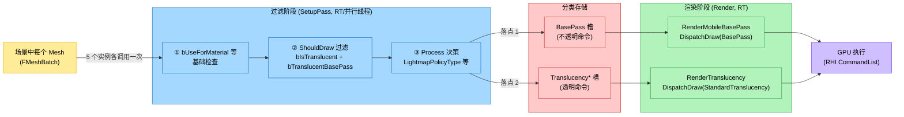

# Mobile BasePass 渲染架构分析(不透明 vs 透明)

> 目标平台:Android / UE 5.4.4
> 重点:`FMobileBasePassMeshProcessor` 与 `MobileBasePassRendering`、`FMobileSceneRenderer` 的关系;`AddMeshBatch` / `ShouldDraw` 的过滤机制;`DispatchDraw` 怎么消费过滤后的命令
> **已验证 `Docs/AddMeshBatch.md` 和 `Docs/ShouldDraw.md` 的关键代码位置**

---

## 0. 颠覆性认知(必读)

> **`FMobileBasePassMeshProcessor` 这个名字是误导性的**。
> 它的真实身份是 "**移动端前向着色 Mesh 处理器**" —— **同一个类被实例化 5 次**,分别挂到 5 个不同的 `EMeshPass` 槽位上:
>
> | 实例 | `EMeshPass` 槽位 | 处理的物体 |
> |------|------------------|-----------|
> | 1 | `EMeshPass::BasePass` | 不透明(写深度) |
> | 2 | `EMeshPass::MobileBasePassCSM` | 不透明(接收 CSM 阴影) |
> | 3 | `EMeshPass::TranslucencyStandard` | 普通半透明 |
> | 4 | `EMeshPass::TranslucencyAfterDOF` | DOF 后半透明(MobileSeparateTranslucency) |
> | 5 | `EMeshPass::TranslucencyAll` | 所有半透明(PSO 预编译兜底) |

区分不透明/透明的核心字段是 `bTranslucentBasePass`(构造函数 `MobileBasePass.cpp:822` 初始化)。

---

## 1. 三组件关系

### 1.1 文件归属

| 组件 | 文件 | 角色 |
|------|------|------|
| `FMobileBasePassMeshProcessor` | `Source/Runtime/Renderer/Private/MobileBasePass.cpp` (实现)<br/>`Source/Runtime/Renderer/Private/MobileBasePassRendering.h:460` (声明) | Mesh 处理器,过滤 + 生成 `FMeshDrawCommand` |
| `FMobileBasePassRendering` 相关文件 | `Source/Runtime/Renderer/Private/MobileBasePassRendering.h`<br/>`Source/Runtime/Renderer/Private/MobileBasePass.cpp` | 参数设置(Uniform Buffer、PSO、Shader Bindings) |
| `FMobileSceneRenderer` | `Source/Runtime/Renderer/Private/MobileShadingRenderer.cpp`<br/>`Source/Runtime/Renderer/Private/MobileBasePassRendering.cpp` | 场景渲染器:创建 Processor、调度渲染、调用 `DispatchDraw` |

### 1.2 关系架构

```
┌─────────────────────────────────────────────────────────────┐
│ FMobileSceneRenderer(MobileShadingRenderer.cpp)             │
│   - 引擎主渲染入口                                           │
│   - 负责:创建 Processor、Setup、Render、Dispatch            │
└──────────────┬──────────────────────────────────────────────┘
               │ 在 InitViews() 阶段(Line 726)
               │ 创建并填充 MeshDrawCommands
               ↓
┌─────────────────────────────────────────────────────────────┐
│ FMobileBasePassMeshProcessor(MobileBasePass.cpp)            │
│   - 实例化 5 次(同一类,不同 EMeshPass 槽位)                │
│   - AddMeshBatch → TryAddMeshBatch → ShouldDraw(过滤)       │
│   - ShouldDraw 通过后,Process() → BuildMeshDrawCommands    │
│   - 命令写入:FParallelMeshDrawCommandPasses[EMeshPass::*]   │
└──────────────┬──────────────────────────────────────────────┘
               │ 命令按 EMeshPass 分类存储
               │ View.ParallelMeshDrawCommandPasses[EMeshPass::BasePass]
               │ View.ParallelMeshDrawCommandPasses[EMeshPass::TranslucencyStandard]
               │ ...
               ↓
┌─────────────────────────────────────────────────────────────┐
│ FParallelMeshDrawCommandPass(各 EMeshPass 一个)            │
│   - 存储 FMeshDrawCommand 列表                              │
│   - 渲染时通过 DispatchDraw() 消费                          │
└─────────────────────────────────────────────────────────────┘
```

---

## 2. 过滤机制详解

### 2.1 三级过滤链路

```
FMobileBasePassMeshProcessor::AddMeshBatch       (MobileBasePass.cpp:867)
   ├─ 第 1 级过滤:基础合法性检查
   │     - MeshBatch.bUseForMaterial == false      → 拒收
   │     - Flags & DoNotCache == DoNotCache         → 拒收
   │     - PrimitiveSceneProxy->ShouldRenderInMainPass() == false → 拒收
   │
   ├─ 第 2 级过滤:TryAddMeshBatch
   │     └─ ShouldDraw(Material) ← 核心过滤
   │           - BasePass 实例:return !bIsTranslucent   (不收透明)
   │           - 透明 Pass 实例:return bIsTranslucent && PassType 匹配
   │
   └─ 第 3 级:ShouldDraw 通过 → Process()
         └─ BuildMeshDrawCommands(写入对应 EMeshPass 槽)
```

### 2.2 关键代码:`ShouldDraw` 的双分支逻辑

`MobileBasePass.cpp:828-849`:
```cpp
bool FMobileBasePassMeshProcessor::ShouldDraw(const FMaterial& Material) const
{
    const FMaterialShadingModelField ShadingModels = Material.GetShadingModels();
    const bool bIsTranslucent = IsTranslucentBlendMode(Material.GetBlendMode()) 
                             || ShadingModels.HasShadingModel(MSM_SingleLayerWater);
    const bool bCanReceiveCSM = (Flags & EFlags::CanReceiveCSM) == EFlags::CanReceiveCSM;
    
    if (bTranslucentBasePass)   // ⭐ 实例是"透明 Pass"吗?
    {
        // ★ 这一支专门给"透明 Pass 实例"用
        bool bShouldDraw = bIsTranslucent                                  // 必须是透明
            && !Material.IsDeferredDecal()                                 // 排除延迟贴花
            && (TranslucencyPassType == TPT_AllTranslucency                // 1) 兜底全收
                || (TranslucencyPassType == TPT_TranslucencyStandard 
                        && !Material.IsMobileSeparateTranslucencyEnabled()) // 2) 标准:未启用"独立透明"
                || (TranslucencyPassType == TPT_TranslucencyAfterDOF 
                        &&  Material.IsMobileSeparateTranslucencyEnabled()));// 3) DOF后:启用了"独立透明"
        return bShouldDraw;
    }
    else
    {
        // ★ 这一支给"BasePass 实例"用:只收非透明
        return !bIsTranslucent;
    }
}
```

### 2.3 过滤结果去向

| 材质类型 | `bTranslucentBasePass=false`<br/>(BasePass 实例) | `bTranslucentBasePass=true`<br/>(Translucency* 实例) | 最终落点 |
|----------|--------------------------------------------------|-----------------------------------------------------|----------|
| **不透明** | ✅ ShouldDraw 通过 → Process() | ❌ ShouldDraw 拒收 | `EMeshPass::BasePass` |
| **Masked** | ✅ ShouldDraw 通过 | ❌ 拒收 | `EMeshPass::BasePass` |
| **半透明(普通)** | ❌ 拒收 | ✅ Standard 实例通过 → Process() | `EMeshPass::TranslucencyStandard` |
| **半透明(MobileSeparate)** | ❌ 拒收 | ✅ AfterDOF 实例通过 → Process() | `EMeshPass::TranslucencyAfterDOF` |
| **单层水** | ❌ 拒收 | ✅ Standard/AfterDOF 视情况 | 对应透明 Pass |

> **关键**:场景中**每个 Mesh 都会被这 5 个 Processor 实例各喂一次**。每个实例只挑选自己感兴趣的那部分 mesh,生成对应的 `FMeshDrawCommand` 存入各自槽位。

---

## 3. `FMobileBasePassMeshProcessor` 创建与调用全链路

### 3.1 创建:5 个工厂 + 静态注册

`MobileBasePass.cpp:1151-1223`:

| 工厂函数 | 行号 | 构造的 EMeshPass | `bTranslucentBasePass` |
|----------|------|------------------|------------------------|
| `CreateMobileBasePassProcessor` | 1151 | `BasePass` | `false` |
| `CreateMobileBasePassCSMProcessor` | 1165 | `MobileBasePassCSM` | `false` |
| `CreateMobileTranslucencyStandardPassProcessor` | 1184 | `TranslucencyStandard` | `true` |
| `CreateMobileTranslucencyAfterDOFProcessor` | 1196 | `TranslucencyAfterDOF` | `true` |
| `CreateMobileTranslucencyAllPassProcessor` | 1207 | `TranslucencyAll` | `true` |

5 个工厂通过宏 `REGISTER_MESHPASSPROCESSOR_AND_PSOCOLLECTOR`(`MobileBasePass.cpp:1218-1222`)注册到 `FPassProcessorManager::JumpTable[ShadingPath][PassType]`。

### 3.2 实例化:`SetupMobileBasePassAfterShadowInit`

`MobileShadingRenderer.cpp:377-427`:

```cpp
void FMobileSceneRenderer::SetupMobileBasePassAfterShadowInit(...)
{
    for (int32 ViewIndex = 0; ViewIndex < AllViews.Num(); ++ViewIndex)
    {
        FViewInfo& View = *AllViews[ViewIndex];
        
        // Line 388: 创建 BasePass Processor(走跳转表 → CreateMobileBasePassProcessor)
        FMeshPassProcessor* MeshPassProcessor = 
            FPassProcessorManager::CreateMeshPassProcessor(
                EShadingPath::Mobile, EMeshPass::BasePass, ...);
        
        // Line 390: 创建 CSM Processor
        FMeshPassProcessor* BasePassCSMMeshPassProcessor = 
            FPassProcessorManager::CreateMeshPassProcessor(
                EShadingPath::Mobile, EMeshPass::MobileBasePassCSM, ...);
        
        // Line 403: 取得 Pass 引用
        FParallelMeshDrawCommandPass& Pass = 
            View.ParallelMeshDrawCommandPasses[EMeshPass::BasePass];
        
        // Line 410-425: 启动并行 Setup(调用 AddMeshBatch)
        Pass.DispatchPassSetup(..., MeshPassProcessor, ..., 
                               BasePassCSMMeshPassProcessor, ...);
    }
}
```

> 注:**只有 BasePass 和 CSM 在这里手动创建并启动 `DispatchPassSetup`**。透明 Pass 走 `FSceneRenderer::SetupMeshPass`(`SceneRendering.cpp:4196`)的通用循环。

### 3.3 `DispatchPassSetup` 内部流程

`MeshDrawCommands.cpp:1334-1453`(`FParallelMeshDrawCommandPass::DispatchPassSetup`):

```
DispatchPassSetup (主线程/并行)
   ├─ 启动并行任务 FMeshDrawCommandPassSetupTask::AnyThreadTask (MeshDrawCommands.cpp:1006)
   │     ├─ BasePass 分支 (Line 1019-1044)
   │     │   ├─ MergeMobileBasePassMeshDrawCommands (合并 cached static commands)
   │     │   └─ GenerateMobileBasePassDynamicMeshDrawCommands (MobileBasePass.cpp:674)
   │     │         ├─ PassMeshProcessor->AddMeshBatch (Line 728 / 769)  ← ★ 调用点 1
   │     │         └─ MobilePassCSMPassMeshProcessor->AddMeshBatch (Line 724 / 764) ← ★ 调用点 2
   │     │
   │     └─ 其它 Pass 分支 (Line 1046-1063)
   │           └─ GenerateDynamicMeshDrawCommands (MeshDrawCommands.cpp:581)
   │                 └─ Processor->AddMeshBatch
   │
   └─ Processor->AddMeshBatch() ⭐ 虚函数调用
         → FMobileBasePassMeshProcessor::AddMeshBatch (MobileBasePass.cpp:867)
              → TryAddMeshBatch (MobileBasePass.cpp:851)
                   → ShouldDraw() ← 过滤 ⭐
                   → Process() → BuildMeshDrawCommands
                        → FMeshDrawCommand 写入 DrawListContext
```

### 3.4 渲染阶段:`DispatchDraw` 消费

`MobileBasePassRendering.cpp:470-491`(`RenderMobileBasePass`):
```cpp
void FMobileSceneRenderer::RenderMobileBasePass(FRHICommandList& RHICmdList, 
    const FViewInfo& View, const FInstanceCullingDrawParams* InstanceCullingDrawParams) 
{
    RHICmdList.SetViewport(...);
    
    // ⭐ 不透明命令:取 BasePass 槽
    View.ParallelMeshDrawCommandPasses[EMeshPass::BasePass]
        .DispatchDraw(nullptr, RHICmdList, InstanceCullingDrawParams);
    
    if (View.Family->EngineShowFlags.Atmosphere) {
        View.ParallelMeshDrawCommandPasses[EMeshPass::SkyPass].DispatchDraw(...);
    }
}
```

`MobileTranslucentRendering.cpp:7-20`(`RenderTranslucency`):
```cpp
void FMobileSceneRenderer::RenderTranslucency(FRHICommandList& RHICmdList, const FViewInfo& View)
{
    const bool bShouldRenderTranslucency = 
        ShouldRenderTranslucency(StandardTranslucencyPass) && ViewFamily.EngineShowFlags.Translucency;
    
    if (bShouldRenderTranslucency) {
        RHICmdList.SetViewport(...);
        // ⭐ 透明命令:取 TranslucencyStandard 槽(由运行时决定)
        View.ParallelMeshDrawCommandPasses[StandardTranslucencyMeshPass]
            .DispatchDraw(nullptr, RHICmdList, &TranslucencyInstanceCullingDrawParams);
    }
}
```

`StandardTranslucencyMeshPass` 由 `MobileShadingRenderer.cpp:307-308` 决定:
```cpp
StandardTranslucencyPass = ViewFamily.AllowTranslucencyAfterDOF() 
                           ? ETranslucencyPass::TPT_TranslucencyStandard 
                           : ETranslucencyPass::TPT_AllTranslucency;
StandardTranslucencyMeshPass = TranslucencyPassToMeshPass(StandardTranslucencyPass);
```

### 3.5 4 个串联点

`MobileShadingRenderer.cpp` 中 4 处固定结构(不透明 → 透明):
- `Line 1609/1623`:`RenderForwardSinglePass` (Forward 路径)
- `Line 1682/1735`:`RenderForwardMultiPass`
- `Line 1968/1985`:`RenderDeferredSinglePass`
- `Line 2011/2068`:`RenderDeferredMultiPass`

每处都按 `RenderMobileBasePass → ... → RenderTranslucency` 顺序执行。

---

## 4. Mermaid 全链路图

### 4.1 三组件关系 + 5 实例化

```mermaid
flowchart TD
    subgraph SR["FMobileSceneRenderer (MobileShadingRenderer.cpp)"]
        Render["Render (line 910)"]
        InitViews["InitViews (line 433)"]
        SetupBP["SetupMobileBasePassAfterShadowInit<br/>(line 377)"]
        RenderBP["RenderMobileBasePass<br/>(MobileBasePassRendering.cpp:470)"]
        RenderTr["RenderTranslucency<br/>(MobileTranslucentRendering.cpp:7)"]
        Render --> InitViews --> SetupBP
        SetupBP -. "创建并 DispatchPassSetup" .-> Processor
        InitViews -. "调用" .-> RenderBP
        InitViews -. "调用" .-> RenderTr
    end

    subgraph BPM["FMobileBasePassMeshProcessor 类 (MobileBasePass.cpp:810)"]
        Ctor["构造函数 line 810<br/>bTranslucentBasePass = (TPT != TPT_MAX)"]
        AddMB["AddMeshBatch line 867<br/>基础合法性检查"]
        TryAdd["TryAddMeshBatch line 851"]
        ShouldDraw["ShouldDraw line 828 ⭐<br/>不透明:return !bIsTranslucent<br/>透明:bIsTranslucent + PassType 匹配"]
        Process["Process line 892<br/>→ BuildMeshDrawCommands"]
        Ctor --> AddMB --> TryAdd --> ShouldDraw
        ShouldDraw -->|通过| Process
        Process -. "写入" .-> Slot
    end

    subgraph Factories["5 个工厂 (MobileBasePass.cpp:1151-1216)"]
        F1["CreateMobileBasePassProcessor<br/>line 1151 → new (BasePass, TPT_MAX)"]
        F2["CreateMobileBasePassCSMProcessor<br/>line 1165 → new (MobileBasePassCSM, TPT_MAX)"]
        F3["CreateMobileTranslucencyStandardPassProcessor<br/>line 1184 → new (TranslucencyStandard, TPT_Standard)"]
        F4["CreateMobileTranslucencyAfterDOFProcessor<br/>line 1196 → new (TranslucencyAfterDOF, TPT_AfterDOF)"]
        F5["CreateMobileTranslucencyAllPassProcessor<br/>line 1207 → new (TranslucencyAll, TPT_All)"]
    end

    subgraph Reg["静态注册 (MobileBasePass.cpp:1218-1222)"]
        JumpTable["FPassProcessorManager::JumpTable<br/>(MeshPassProcessor.h:2190)"]
        Register["REGISTER_MESHPASSPROCESSOR_AND_PSOCOLLECTOR<br/>× 5 条"]
        Register --> JumpTable
    end

    subgraph Slots["EMeshPass 槽位 (每个 View 各一套)"]
        Slot1["View.ParallelMeshDrawCommandPasses<br/>[EMeshPass::BasePass]<br/>(不透明)"]
        Slot2["[EMeshPass::MobileBasePassCSM]"]
        Slot3["[EMeshPass::TranslucencyStandard]"]
        Slot4["[EMeshPass::TranslucencyAfterDOF]"]
        Slot5["[EMeshPass::TranslucencyAll]"]
        Slot[槽位统称]
    end

    Factories --> Ctor
    JumpTable -->|CreateMeshPassProcessor<br/>查找并调用| F1
    JumpTable --> F2
    JumpTable --> F3
    JumpTable --> F4
    JumpTable --> F5
    SetupBP -->|FPassProcessorManager::CreateMeshPassProcessor| JumpTable
    F1 --> Slot1
    F2 --> Slot2
    F3 --> Slot3
    F4 --> Slot4
    F5 --> Slot5

    RenderBP -->|DispatchDraw (BasePass)| Slot1
    RenderTr -->|DispatchDraw (StandardTranslucencyMeshPass)| Slot3

    classDef renderer fill:#51cf66,stroke:#2f9e44,color:#000
    classDef proc fill:#4dabf7,stroke:#1971c2,color:#000
    classDef factory fill:#ffd8a8,stroke:#e8590c,color:#000
    classDef slot fill:#da77f2,stroke:#862e9c,color:#fff
    classDef decision fill:#ffd43b,stroke:#fab005,color:#000

    class Render,InitViews,SetupBP,RenderBP,RenderTr renderer
    class BPM proc
    class Ctor,AddMB,TryAdd,ShouldDraw,Process proc
    class Factories,F1,F2,F3,F4,F5 factory
    class JumpTable,Register,Reg factory
    class Slot1,Slot2,Slot3,Slot4,Slot5,Slot slot
```

### 4.2 数据流:从 Mesh 到 GPU



### 4.3 不透明 vs 透明决策树

```mermaid
flowchart TD
    Start([场景中一个 Mesh]) --> Call1[5 个 Processor 实例各调用 AddMeshBatch]
    Call1 --> F1{基础检查<br/>bUseForMaterial?<br/>ShouldRenderInMainPass?}
    F1 -->|fail| Reject1[❌ 拒收]
    F1 -->|pass| F2{当前实例的<br/>bTranslucentBasePass?}
    
    F2 -->|false<br/>BasePass / CSM 实例| OpaqueCheck{材质是<br/>不透明?}
    OpaqueCheck -->|是 不透明/Masked| OpaquePass[✅ ShouldDraw 通过<br/>→ Process<br/>→ 写入 BasePass 槽]
    OpaqueCheck -->|是 透明| OpaqueReject[❌ 拒收<br/>return !bIsTranslucent]
    
    F2 -->|true<br/>Translucency* 实例| TransCheck{材质是<br/>不透明?}
    TransCheck -->|是 不透明| TransReject[❌ 拒收]
    TransCheck -->|是 透明/单层水| PassTypeCheck{PassType 是否匹配?}
    PassTypeCheck -->|All: 任意透明| TransPass[✅ 通过]
    PassTypeCheck -->|Standard:<br/>未启用 MobileSeparate| TransPass
    PassTypeCheck -->|AfterDOF:<br/>启用了 MobileSeparate| TransPass
    PassTypeCheck -->|其它组合| TransReject2[❌ 拒收]
    TransPass --> WriteSlot[写入对应<br/>Translucency* 槽]
    
    OpaquePass --> FinalSlot1[最终落点:<br/>EMeshPass::BasePass<br/>(或 MobileBasePassCSM)]
    WriteSlot --> FinalSlot2[最终落点:<br/>EMeshPass::TranslucencyStandard<br/>(或 AfterDOF / All)]
    
    FinalSlot1 --> Dispatch1[RenderMobileBasePass<br/>DispatchDraw]
    FinalSlot2 --> Dispatch2[RenderTranslucency<br/>DispatchDraw]
    
    classDef start fill:#ffd8a8,stroke:#e8590c,color:#000
    classDef decision fill:#ffd43b,stroke:#fab005,color:#000
    classDef opaque fill:#a5d8ff,stroke:#1971c2,color:#000
    classDef trans fill:#ffc9c9,stroke:#c92a2a,color:#000
    classDef reject fill:#ff8787,stroke:#c92a2a,color:#fff
    classDef pass fill:#b2f2bb,stroke:#2f9e44,color:#000
    
    class Start,Call1 start
    class F1,F2,OpaqueCheck,TransCheck,PassTypeCheck decision
    class OpaqueCheck,OpaquePass,FinalSlot1,Dispatch1 opaque
    class TransCheck,TransPass,WriteSlot,FinalSlot2,Dispatch2 trans
    class Reject1,OpaqueReject,TransReject,TransReject2 reject
```

---

## 5. 关键认知点

### 5.1 `DispatchDraw` 的 `EMeshPass` 参数与过滤结果的关系

| `DispatchDraw` 调用点 | 操作的 `EMeshPass` 槽 | 包含的 mesh 类型(由 ShouldDraw 过滤结果决定) |
|----------------------|----------------------|----------------------------------------------|
| `RenderMobileBasePass` (line 470) | `EMeshPass::BasePass` | 不透明 + Masked + 单层水 ❌ |
| `RenderTranslucency` (MobileTranslucentRendering.cpp:18) | `EMeshPass::TranslucencyStandard` (或 `TranslucencyAll`) | 半透明(标准/独立/DOF后) |

> `DispatchDraw` 不直接做"过滤"——它只是把已经按 `EMeshPass` 分类存储的 `FMeshDrawCommand` 提交到 GPU。**过滤已经由 `ShouldDraw` 在 Setup 阶段完成**。

### 5.2 Processor 的"复用"思想

UE 用一个 `FMobileBasePassMeshProcessor` 类同时服务:
- **3 个不透明相关槽位**(BasePass、CSM、Hidden)
- **3 个透明相关槽位**(Standard、AfterDOF、All)
- **共享 90% 代码**(PSO 收集、Shader 绑定、Mesh 命令构建)
- **10% 差异**通过 `EFlags` + `ETranslucencyPass::Type` + `bTranslucentBasePass` + 渲染状态参数控制

### 5.3 5 个实例被遍历 5 次

**每个 Mesh 在场景里都会被这 5 个 Processor 实例各调用一次 `AddMeshBatch`**:
- 不透明桌子 → 5 个实例都被问,只有 BasePass + CSM 通过 → 命令进 2 个不透明槽
- 普通半透明玻璃 → Standard + All 通过 → 命令进 2 个透明槽
- 独立透明玻璃(带 MobileSeparate)→ AfterDOF + All 通过 → 命令进 2 个透明槽
- 单层水 → 同透明逻辑(因 `HasShadingModel(MSM_SingleLayerWater)`)

### 5.4 Cached vs Dynamic 路径

- **Cached**(静态 mesh):大部分静态 mesh 的 MDC 在 `FPrimitiveSceneInfo::AddToScene` 阶段就缓存,带 `EMeshPassFlags::CachedMeshCommands` 标志。Setup 阶段只合并(`MergeMobileBasePassMeshDrawCommands`)。
- **Dynamic**(动态 mesh 或 CSM 切换):每帧的 View 状态改变时,走 `GenerateMobileBasePassDynamicMeshDrawCommands` 重新生成。

---

## 6. 关键代码位置速查

| 关注点 | 文件 | 行号 |
|--------|------|------|
| 5 个 Processor 工厂 | `MobileBasePass.cpp` | 1151-1216 |
| `REGISTER_*` 宏 | `MobileBasePass.cpp` | 1218-1222 |
| `FMobileBasePassMeshProcessor` 类声明 | `MobileBasePassRendering.h` | 460 |
| 构造函数 + `bTranslucentBasePass` | `MobileBasePass.cpp` | 810-826 |
| `ShouldDraw` 双分支 | `MobileBasePass.cpp` | 828-849 |
| `TryAddMeshBatch` | `MobileBasePass.cpp` | 851-865 |
| `AddMeshBatch` 入口 | `MobileBasePass.cpp` | 867-890 |
| `Process` 核心 | `MobileBasePass.cpp` | 892+ |
| `SetupMobileBasePassAfterShadowInit` | `MobileShadingRenderer.cpp` | 377-427 |
| Processor 创建调用 | `MobileShadingRenderer.cpp` | 388, 390 |
| `DispatchPassSetup` 调用 | `MobileShadingRenderer.cpp` | 410-425 |
| `StandardTranslucencyPass/MeshPass` 决定 | `MobileShadingRenderer.cpp` | 307-308 |
| `RenderMobileBasePass` 派发不透明 | `MobileBasePassRendering.cpp` | 470-491 |
| `RenderTranslucency` 派发透明 | `MobileTranslucentRendering.cpp` | 7-20 |
| 4 处串联(不透明→透明) | `MobileShadingRenderer.cpp` | 1609/1623、1682/1735、1968/1985、2011/2068 |
| `DispatchPassSetup` | `MeshDrawCommands.cpp` | 1334-1453 |
| `GenerateMobileBasePassDynamicMeshDrawCommands` | `MeshDrawCommands.cpp` | 674 |
| `AnyThreadTask` 分发 | `MeshDrawCommands.cpp` | 1006 |
| `FPassProcessorManager::JumpTable` | `MeshPassProcessor.h` | 2190+ |

---

## 7. 与现有 Docs 的对应关系

| 现有文档 | 本文对应章节 |
|----------|--------------|
| `Docs/AddMeshBatch.md` | §3(创建与调用链路)、§6(代码位置) |
| `Docs/ShouldDraw.md` | §2(过滤机制)、§5.3(5 实例遍历) |
| `Docs/RenderBaseAndTranslucencyPass.md` | §3.5(4 处串联点)、§5.1(DispatchDraw 参数) |

本文主要贡献:把**三组件关系**(Processor、Rendering、SceneRenderer)整合到一张图,并明确 `DispatchDraw` 的 `EMeshPass` 参数**不直接过滤**而**消费已分类的过滤结果**这一关键事实。
