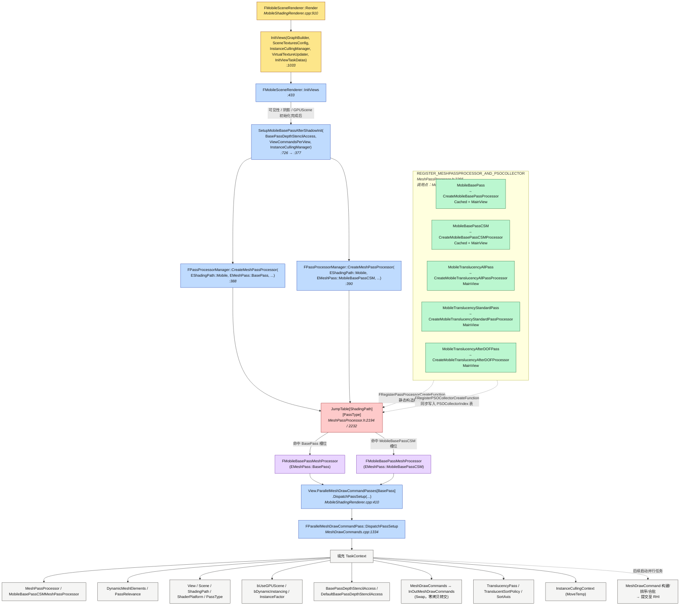

# 移动端 MeshPassProcessor 调用链梳理

> 范围：`EShadingPath::Mobile` 下，`FMobileSceneRenderer` 在 InitViews 阶段如何
> 通过 `FPassProcessorManager` 的注册表（JumpTable）创建对应 Pass 的
> `FMeshPassProcessor`，并通过 `FParallelMeshDrawCommandPass::DispatchPassSetup`
> 将其下发给并行 MeshDrawCommand 构建任务。

---

## 1. 关键代码位置一览

| # | 文件 : 行号 | 角色 |
|---|---|---|
| ① | `Runtime/Renderer/Private/MobileShadingRenderer.cpp:910` | `FMobileSceneRenderer::Render` 帧入口 |
| ② | `Runtime/Renderer/Private/MobileShadingRenderer.cpp:1033` | `Render` 中调用 `InitViews(...)` |
| ③ | `Runtime/Renderer/Private/MobileShadingRenderer.cpp:433` | `FMobileSceneRenderer::InitViews` 定义 |
| ④ | `Runtime/Renderer/Private/MobileShadingRenderer.cpp:726` | `InitViews` 中调用 `SetupMobileBasePassAfterShadowInit(...)` |
| ⑤ | `Runtime/Renderer/Private/MobileShadingRenderer.cpp:377` | `SetupMobileBasePassAfterShadowInit` 定义 |
| ⑥ | `Runtime/Renderer/Private/MobileShadingRenderer.cpp:388` | 通过 `FPassProcessorManager::CreateMeshPassProcessor` 创建 BasePass 的 Processor |
| ⑦ | `Runtime/Renderer/Private/MobileShadingRenderer.cpp:390` | 同上，创建 `MobileBasePassCSM` 的 Processor |
| ⑧ | `Runtime/Renderer/Public/MeshPassProcessor.h:2194` | `FPassProcessorManager::CreateMeshPassProcessor` —— 通过 `JumpTable[ShadingPath][PassType]` 查表 |
| ⑨ | `Runtime/Renderer/Public/MeshPassProcessor.h:2266` | `REGISTER_MESHPASSPROCESSOR_AND_PSOCOLLECTOR` 宏，把 CreateFn 注册进 JumpTable + PSO Collector |
| ⑩ | `Runtime/Renderer/Private/MobileBasePass.cpp:1218`–`1222` | 5 个 Mobile Pass 的注册点（BasePass / BasePassCSM / Translucency *3） |
| ⑪ | `Runtime/Renderer/Private/MobileShadingRenderer.cpp:410` | `Pass.DispatchPassSetup(...)` 把 MeshPassProcessor 下发到并行任务 |
| ⑫ | `Runtime/Renderer/Private/MeshDrawCommands.cpp:1334` | `FParallelMeshDrawCommandPass::DispatchPassSetup`，填充 `TaskContext` |

---

## 2. 注册表（JumpTable）与 Pass 的关系

`FPassProcessorManager` 维护一张二维静态表
`JumpTable[EShadingPath::Num][EMeshPass::Num]`，每个槽位是一个
`PassProcessorCreateFunction` 函数指针。`MobileBasePass.cpp` 末尾通过
`REGISTER_MESHPASSPROCESSOR_AND_PSOCOLLECTOR` 宏在静态构造期把 5 个 Mobile
Pass 的 `Create*Processor` 函数写入 `JumpTable[Mobile][PassType]`，同时把对应的
`PSO Collector` 注册到 `FPSOCollectorCreateManager`，并把它们的 PSOCollectorIndex
回填到 `FPassProcessorManager::PSOCollectorIndex` 表。

| 注册名 (Name) | CreateFunction | EMeshPass | EMeshPassFlags |
|---|---|---|---|
| `MobileBasePass` | `CreateMobileBasePassProcessor` | `BasePass` | `CachedMeshCommands \| MainView` |
| `MobileBasePassCSM` | `CreateMobileBasePassCSMProcessor` | `MobileBasePassCSM` | `CachedMeshCommands \| MainView` |
| `MobileTranslucencyAllPass` | `CreateMobileTranslucencyAllPassProcessor` | `TranslucencyAll` | `MainView` |
| `MobileTranslucencyStandardPass` | `CreateMobileTranslucencyStandardPassProcessor` | `TranslucencyStandard` | `MainView` |
| `MobileTranslucencyAfterDOFPass` | `CreateMobileTranslucencyAfterDOFProcessor` | `TranslucencyAfterDOF` | `MainView` |

> 备注：`TranslucencyAfterDOFModulate` 因为移动端不支持 dual blending，被显式跳过。

---

## 3. 调用链 Mermaid

---

## 4. 关键信息提炼

1. **解耦机制**：`FPassProcessorManager::JumpTable` 是 `[ShadingPath][PassType]` 的
   静态函数指针表。Renderer 在运行期只调用
   `CreateMeshPassProcessor(ShadingPath, PassType, ...)`，**不直接持有任何具体
   `*MeshProcessor` 类型**——所有具体类型在 `MobileBasePass.cpp:1218-1222` 通过
   宏在静态构造期注册进表。
2. **一处注册，三处生效**：宏 `REGISTER_MESHPASSPROCESSOR_AND_PSOCOLLECTOR` 同时
   做三件事——
   - 注册到 `FPassProcessorManager::JumpTable`（运行期创建 Processor）；
   - 注册到 `FPSOCollectorCreateManager`（PSO 预缓存收集器）；
   - 把 `PSOCollectorIndex` 回填到 `FPassProcessorManager::PSOCollectorIndex` 表。
3. **BasePass 的特殊性**：`SetupMeshPass` 通用流程在 mobile 上把 `BasePass` 跳过，
   等到 **InitDynamicShadows / 阴影信息可用之后**，才在
   `SetupMobileBasePassAfterShadowInit` 里专门为 `BasePass` 排序和 dispatch；
   同时配套创建 `MobileBasePassCSM` 的 Processor，作为 BasePass 的 CSM 备选命令
   （见 `DispatchPassSetup` 末尾的 `MobileBasePassCSMMeshDrawCommands` Swap）。
4. **DispatchPassSetup 的本质**：把 *Processor + 视口 + 动态/静态 Mesh 元素 +
   InstanceCulling 上下文 + 透明度排序参数* 一次性灌入 `TaskContext`，并通过
   `Swap`/`MoveTemp` 实现零拷贝所有权转交，**为后续并行 MeshDrawCommand 构建
   线程做好一切准备**——它本身只是 setup，并不真正执行命令构建。
5. **EMeshPassFlags 的两个位**：
   - `CachedMeshCommands`：该 Pass 支持以静态 Mesh 为单位缓存 MeshDrawCommand
     （BasePass / BasePassCSM 启用，Translucency 不启用——透明物体常因排序变化
     而需逐帧重建）。
   - `MainView`：标记为主视口 Pass，在 `DispatchPassSetup` 里影响 ISR
     `InstanceFactor` 是否取 2。
