# 移动端渲染流程 (Mobile Rendering Pipeline)

本文档整理 Unreal Engine 移动端 (Mobile Shading Path) 渲染管线从游戏线程发起绘制到最终 RHI 命令提交的完整调用链。所有行号均对应 `Engine/Source/` 下的源码。

---

## 一、完整调用链

```mermaid
flowchart TD
    subgraph GT["游戏线程 Game Thread"]
        A["UGameViewportClient::Draw()<br/>Runtime/Engine/Private/GameViewportClient.cpp:1369"]
        A --> B["GetRendererModule().BeginRenderingViewFamily<br/>GameViewportClient.cpp:1847"]
    end

    subgraph ENTRY["Renderer 入口（游戏线程侧）"]
        B --> C["FRendererModule::BeginRenderingViewFamily<br/>Runtime/Renderer/Private/SceneRendering.cpp:4965"]
        C --> D["BeginRenderingViewFamilies<br/>SceneRendering.cpp:4967"]
        D --> E["FSceneRenderer::CreateSceneRenderers<br/>SceneRendering.cpp:5087"]
    end

    subgraph FACTORY["场景渲染器工厂 — ShadingPath 分支"]
        E --> F{"ShadingPath == Deferred?<br/>SceneRendering.cpp:4296"}
        F -- Mobile 路径 --> G["new FMobileSceneRenderer<br/>SceneRendering.cpp:4304"]
    end

    subgraph DISPATCH["渲染线程派发 — ENQUEUE_RENDER_COMMAND"]
        G --> H["ENQUEUE_RENDER_COMMAND(FDrawSceneCommand)<br/>SceneRendering.cpp:5113"]
        H --> I["RenderViewFamilies_RenderThread<br/>SceneRendering.cpp:5119"]
    end

    subgraph RT["渲染线程执行 — FMobileSceneRenderer::Render"]
        I --> J["FSceneRenderer::Render(GraphBuilder)<br/>SceneRendering.cpp:4829"]
        J --> K["FMobileSceneRenderer::Render<br/>Runtime/Renderer/Private/MobileShadingRenderer.cpp:910"]
        K --> L{"bDeferredShading?<br/>MobileShadingRenderer.cpp:1311"}
        L -- Forward --> M["RenderForward<br/>MobileShadingRenderer.cpp:1317"]
        M --> N{"bRequiresMultiPass?<br/>MobileShadingRenderer.cpp:1567"}
        N -- SinglePass --> O["RenderForwardSinglePass<br/>MobileShadingRenderer.cpp:1573"]
        N -- MultiPass  --> P["RenderForwardMultiPass<br/>MobileShadingRenderer.cpp:1569"]
        O --> Q["RenderMobileBasePass<br/>MobileShadingRenderer.cpp:1609"]
        P --> Q
    end

    subgraph BASEPASS["BasePass 派发"]
        Q --> R["FMobileSceneRenderer::RenderMobileBasePass<br/>Runtime/Renderer/Private/MobileBasePassRendering.cpp:470"]
        R --> S["ParallelMeshDrawCommandPasses[BasePass].DispatchDraw<br/>MobileBasePassRendering.cpp:478"]
    end

    subgraph SUBMIT["RHI 命令提交"]
        S --> T["FMeshDrawCommandPass::DispatchDraw<br/>Runtime/Renderer/Private/MeshDrawCommands.cpp:1640"]
        T --> U{"bUseGPUScene?<br/>MeshDrawCommands.cpp:1697"}
        U -- Yes --> V["InstanceCullingContext.SubmitDrawCommands<br/>MeshDrawCommands.cpp:1701"<br/>FMeshDrawCommandPassSetupTaskContext <b>TaskContext</b>]
        U -- No  --> W["走传统 CPU MeshDraw 路径<br/>MeshDrawCommands.cpp else 分支"]
    end

    style A fill:#06c562,stroke:#2e7d32
    style V fill:#ff7b72,stroke:#c62828
    style W fill:#ff0a67,stroke:#ef6c00
```

---

## 二、阶段说明

### 阶段 1 — 游戏线程发起绘制
- `UGameViewportClient::Draw()` 是每帧窗口绘制的入口，封装 `FCanvas` 与 `FSceneViewFamily` 后调用 Renderer 模块。
- 调用点：`Runtime/Engine/Private/GameViewportClient.cpp:1847`

### 阶段 2 — Renderer 模块入口
- `FRendererModule::BeginRenderingViewFamily` 立即转发到 `BeginRenderingViewFamilies`（支持多 ViewFamily 批量提交）。
- 入口在 `Runtime/Renderer/Private/SceneRendering.cpp:4965/4967`。

### 阶段 3 — 场景渲染器工厂
- `FSceneRenderer::CreateSceneRenderers` 按 `ShadingPath` 选择具体实现：
  - `EShadingPath::Deferred` → `FDeferredShadingSceneRenderer`
  - `EShadingPath::Mobile`   → `FMobileSceneRenderer`  ← 移动端路径
- 调用点：`SceneRendering.cpp:4296` 判定、`:4304` 实例化。

### 阶段 4 — 跨线程派发
- 通过 `ENQUEUE_RENDER_COMMAND(FDrawSceneCommand)` 将 lambda 派发到渲染线程。
- lambda 内调用 `RenderViewFamilies_RenderThread`，在渲染线程上 `SceneRenderer->Render(GraphBuilder)`。
- 调用点：`SceneRendering.cpp:5113` 入队、`:5119` 执行、`:4829` 触发 Render。

> 该阶段是游戏线程到渲染线程的关键同步点。

### 阶段 5 — FMobileSceneRenderer::Render
- 入口：`MobileShadingRenderer.cpp:910`
- 内部按两条路径分支：
  - `bDeferredShading == true`  → `RenderDeferred`（移动端基本不会走此分支，保留向后兼容）
  - `bDeferredShading == false` → `RenderForward` ← **移动端默认路径**
- `RenderForward` 内再分：
  - `bRequiresMultiPass == true`  → `RenderForwardMultiPass`（不透明/透明分离多 Pass）
  - `bRequiresMultiPass == false` → `RenderForwardSinglePass`（单 Pass 合批）
- 两种路径最终都进入 `RenderMobileBasePass(RHICmdList, View, &PassParameters->InstanceCullingDrawParams)`。
- 调用点：`MobileShadingRenderer.cpp:1311/1317/1567/1573/1609`。

### 阶段 6 — BasePass 派发
- `FMobileSceneRenderer::RenderMobileBasePass` 是 BasePass 的执行入口。
- 通过 `View.ParallelMeshDrawCommandPasses[EMeshPass::BasePass].DispatchDraw(...)` 将所有 BasePass MeshDrawCommand 派发出去。
- 调用点：`MobileBasePassRendering.cpp:470` 入口、`:478` 派发。

### 阶段 7 — MeshDrawCommand 提交
- `FMeshDrawCommandPass::DispatchDraw` 内根据 `bUseGPUScene` 分支：
  - `bUseGPUScene == true`  → `TaskContext.InstanceCullingContext.SubmitDrawCommands(...)` 由 GPU Scene 完成 Instance Culling 后提交。
  - `bUseGPUScene == false` → 走传统 CPU 端 MeshDraw 路径（手动遍历 `MeshDrawCommands` 提交）。
- 调用点：`MeshDrawCommands.cpp:1640/1697/1701`。

---

## 三、关键分支汇总

| 决策点 | 位置 | 取值 | 后续路径 |
| --- | --- | --- | --- |
| `ShadingPath` | `SceneRendering.cpp:4296` | `Deferred` / `Mobile` | 决定 `FDeferredShadingSceneRenderer` 或 `FMobileSceneRenderer` |
| `bDeferredShading` | `MobileShadingRenderer.cpp:1311` | Forward | `RenderForward`（移动端默认） |
| `bRequiresMultiPass` | `MobileShadingRenderer.cpp:1567` | SinglePass / MultiPass | 决定 BasePass 与 Translucency 是否合并 |
| `bUseGPUScene` | `MeshDrawCommands.cpp:1697` | Yes / No | 决定 GPU Instance Culling vs CPU MeshDraw |

---

## 四、涉及源文件

| 文件 | 角色 |
| --- | --- |
| `Runtime/Engine/Private/GameViewportClient.cpp` | 视口绘制入口 |
| `Runtime/Renderer/Private/SceneRendering.cpp` | Renderer 模块、SceneRenderer 工厂、RT 派发 |
| `Runtime/Renderer/Private/MobileShadingRenderer.cpp` | 移动端 SceneRenderer 主实现 |
| `Runtime/Renderer/Private/MobileBasePassRendering.cpp` | BasePass 派发 |
| `Runtime/Renderer/Private/MeshDrawCommands.cpp` | MeshDrawCommand 提交（含 GPU Scene 路径） |
