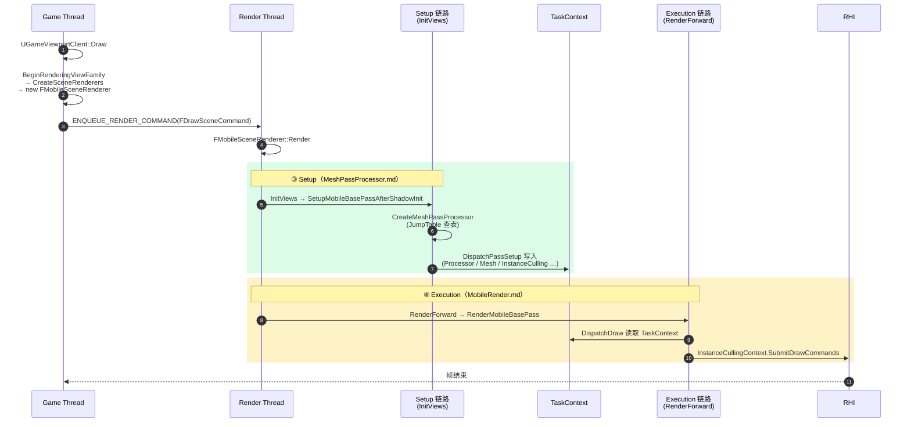

# 移动端渲染完整函数调用链 (Mobile Rendering Full Func Call Chain)

> 本文档把 [`MobileRender.md`](./MobileRender.md) 与 [`MeshPassProcessor.md`](./MeshPassProcessor.md)
> 两份调用链合并为一张端到端图。
>
> - **MobileRender.md** 描述的是**执行链路 (Execution)**：从游戏线程 `Draw()` 一路打到 RHI
>   提交，主体落在 `FMobileSceneRenderer::Render` 的 `RenderForward → RenderMobileBasePass
>   → DispatchDraw` 这一支。
> - **MeshPassProcessor.md** 描述的是**准备链路 (Setup)**：同样从 `FMobileSceneRenderer::Render`
>   出发，但走的是 `InitViews → SetupMobileBasePassAfterShadowInit → CreateMeshPassProcessor →
>   DispatchPassSetup` 这一支，最终把 *Processor + 动态/静态 Mesh + InstanceCulling 上下文* 一次性
>   灌入 `FMeshDrawCommandPassSetupTaskContext`。
>
> 两条链路在 `FMobileSceneRenderer::Render` 内**先后串联**：先 `InitViews` 把 `TaskContext`
> 填好，再到 `RenderMobileBasePass` 时 `DispatchDraw` 取出同一个 `TaskContext` 提交 RHI 命令。
> **`TaskContext` 是这两份调用链之间的核心数据桥梁**。

---

## 一、两份文档的关系定位

| 维度 | `MobileRender.md` | `MeshPassProcessor.md` |
|---|---|---|
| 覆盖阶段 | Render 阶段 (Execution) | InitViews 阶段 (Setup) |
| 核心入口 | `FMobileSceneRenderer::Render` 的 BasePass 提交分支 | `FMobileSceneRenderer::InitViews` 的 BasePass 准备分支 |
| 起点 | 游戏线程 `UGameViewportClient::Draw` | `FMobileSceneRenderer::Render → InitViews` |
| 终点 | `InstanceCullingContext.SubmitDrawCommands` (RHI 提交) | `FParallelMeshDrawCommandPass::DispatchPassSetup` 填充 `TaskContext` |
| 关键决策 | `ShadingPath` / `bDeferredShading` / `bRequiresMultiPass` / `bUseGPUScene` | `JumpTable[ShadingPath][PassType]` 查表命中 |
| 关键产物 | RHI DrawCall | `FMeshDrawCommandPassSetupTaskContext` |
| 桥接对象 | **复用 TaskContext** ←——————— **生成 TaskContext** |

---

## 二、合并调用链 Mermaid

```mermaid
flowchart TD
    %% ============== 游戏线程 ==============
    subgraph GT["① 游戏线程 Game Thread"]
        A1["UGameViewportClient::Draw()<br/><i>GameViewportClient.cpp:1369</i>"]
        A1 --> A2["GetRendererModule().BeginRenderingViewFamily<br/><i>GameViewportClient.cpp:1847</i>"]
        A2 --> A3["FRendererModule::BeginRenderingViewFamily<br/><i>SceneRendering.cpp:4965</i>"]
        A3 --> A4["BeginRenderingViewFamilies<br/><i>SceneRendering.cpp:4967</i>"]
        A4 --> A5["FSceneRenderer::CreateSceneRenderers<br/><i>SceneRendering.cpp:5087</i>"]
        A5 --> A6{"ShadingPath?<br/><i>:4296</i>"}
        A6 -- Mobile --> A7["new FMobileSceneRenderer<br/><i>:4304</i>"]
        A7 --> A8["ENQUEUE_RENDER_COMMAND<br/>(FDrawSceneCommand)<br/><i>:5113</i>"]
    end

    %% ============== 渲染线程 ==============
    A8 ==> B1
    subgraph RT["② 渲染线程 Render Thread"]
        B1["RenderViewFamilies_RenderThread<br/><i>SceneRendering.cpp:5119</i>"]
        B1 --> B2["FSceneRenderer::Render(GraphBuilder)<br/><i>SceneRendering.cpp:4829</i>"]
        B2 --> B3["FMobileSceneRenderer::Render<br/><i>MobileShadingRenderer.cpp:910</i>"]
    end

    %% ============== Setup 链路（来自 MeshPassProcessor.md） ==============
    B3 --> S0
    subgraph SETUP["③ Setup 链路 — InitViews 阶段（MeshPassProcessor.md）"]
        direction TB
        S0["InitViews(GraphBuilder, ...)<br/><i>MobileShadingRenderer.cpp:1033 → :433</i>"]
        S0 --> S1["SetupMobileBasePassAfterShadowInit<br/><i>:726 → :377</i>"]
        S1 --> S2A["FPassProcessorManager::CreateMeshPassProcessor<br/>(Mobile, BasePass, ...)<br/><i>:388</i>"]
        S1 --> S2B["FPassProcessorManager::CreateMeshPassProcessor<br/>(Mobile, MobileBasePassCSM, ...)<br/><i>:390</i>"]

        S2A --> S3["JumpTable[ShadingPath][PassType]<br/><i>MeshPassProcessor.h:2194</i>"]
        S2B --> S3

        subgraph REG["静态构造期注册<br/>REGISTER_MESHPASSPROCESSOR_AND_PSOCOLLECTOR<br/><i>MeshPassProcessor.h:2266</i><br/><i>MobileBasePass.cpp:1218-1222</i>"]
            direction LR
            R1["MobileBasePass<br/>→ CreateMobileBasePassProcessor"]
            R2["MobileBasePassCSM<br/>→ CreateMobileBasePassCSMProcessor"]
            R3["MobileTranslucencyAllPass"]
            R4["MobileTranslucencyStandardPass"]
            R5["MobileTranslucencyAfterDOFPass"]
        end
        REG -. "静态构造期写入" .-> S3

        S3 -->|命中| S4["FMobileBasePassMeshProcessor 实例<br/>(BasePass / MobileBasePassCSM)"]
        S4 --> S5["View.ParallelMeshDrawCommandPasses[BasePass]<br/>.DispatchPassSetup(...)<br/><i>MobileShadingRenderer.cpp:410</i>"]
        S5 --> S6["FParallelMeshDrawCommandPass::DispatchPassSetup<br/><i>MeshDrawCommands.cpp:1334</i>"]

        S6 ==> TC[("FMeshDrawCommandPassSetupTaskContext<br/>━━━━━━━━━━━━━━<br/>• MeshPassProcessor / CSMMeshPassProcessor<br/>• DynamicMeshElements / PassRelevance<br/>• View / Scene / ShadingPath / ShaderPlatform / PassType<br/>• bUseGPUScene / bDynamicInstancing / InstanceFactor<br/>• BasePassDepthStencilAccess<br/>• MeshDrawCommands (Swap 零拷贝)<br/>• InstanceCullingContext (MoveTemp)")]
    end

    %% ============== Execution 链路（来自 MobileRender.md） ==============
    B3 --> E0
    subgraph EXEC["④ Execution 链路 — Render 阶段（MobileRender.md）"]
        direction TB
        E0{"bDeferredShading?<br/><i>MobileShadingRenderer.cpp:1311</i>"}
        E0 -- Forward --> E1["RenderForward<br/><i>:1317</i>"]
        E1 --> E2{"bRequiresMultiPass?<br/><i>:1567</i>"}
        E2 -- SinglePass --> E3A["RenderForwardSinglePass<br/><i>:1573</i>"]
        E2 -- MultiPass  --> E3B["RenderForwardMultiPass<br/><i>:1569</i>"]
        E3A --> E4["RenderMobileBasePass<br/><i>:1609</i>"]
        E3B --> E4
        E4 --> E5["FMobileSceneRenderer::RenderMobileBasePass<br/><i>MobileBasePassRendering.cpp:470</i>"]
        E5 --> E6["ParallelMeshDrawCommandPasses[BasePass]<br/>.DispatchDraw(...)<br/><i>:478</i>"]
        E6 --> E7["FMeshDrawCommandPass::DispatchDraw<br/><i>MeshDrawCommands.cpp:1640</i>"]
        E7 --> E8{"bUseGPUScene?<br/><i>:1697</i>"}
        E8 -- Yes --> E9A["TaskContext.InstanceCullingContext<br/>.SubmitDrawCommands(...)<br/><i>:1701</i>"]
        E8 -- No  --> E9B["传统 CPU MeshDraw 路径"]
    end

    %% ============== TaskContext 桥接：Setup 写、Execution 读 ==============
    TC -. "DispatchDraw 阶段消费<br/>同一个 TaskContext" .-> E7

    %% ============== 终点 ==============
    E9A --> Z["RHI DrawCall 提交"]
    E9B --> Z

    %% ============== 样式 ==============
    classDef gt        fill:#06c562,stroke:#2e7d32,color:#111;
    classDef rt        fill:#bfdbfe,stroke:#1e40af,color:#111;
    classDef setup     fill:#bbf7d0,stroke:#166534,color:#111;
    classDef exec      fill:#fde68a,stroke:#92400e,color:#111;
    classDef table     fill:#fecaca,stroke:#991b1b,color:#111;
    classDef proc      fill:#e9d5ff,stroke:#6b21a8,color:#111;
    classDef ctx       fill:#fef3c7,stroke:#a16207,color:#111;
    classDef submit    fill:#ff7b72,stroke:#c62828,color:#111;
    classDef terminal  fill:#0ea5e9,stroke:#075985,color:#fff;

    class A1,A2,A3,A4,A5,A6,A7,A8 gt;
    class B1,B2,B3 rt;
    class S0,S1,S2A,S2B,S5,S6 setup;
    class S3 table;
    class S4 proc;
    class R1,R2,R3,R4,R5 setup;
    class E0,E1,E2,E3A,E3B,E4,E5,E6,E7,E8 exec;
    class E9A submit;
    class E9B exec;
    class TC ctx;
    class Z terminal;
```

---

## 三、链路串联关键点

### 1. 共同入口：`FMobileSceneRenderer::Render` (`MobileShadingRenderer.cpp:910`)

两条链路都从这里出发，但分别走不同分支：

| 顺序 | 调用 | 文档 | 作用 |
|---|---|---|---|
| 第 1 步 | `InitViews(...)` (`:1033`) | MeshPassProcessor.md | **Setup**：填 `TaskContext` |
| 第 2 步 | `RenderForward / RenderMobileBasePass` (`:1317 / :1609`) | MobileRender.md | **Execution**：消费 `TaskContext` |

`InitViews` 必须在 `RenderForward` 之前完成，这是两条链路天然的时间顺序。

### 2. 数据桥梁：`FMeshDrawCommandPassSetupTaskContext`

它是连接 Setup 与 Execution 的**唯一一份运行期数据**：

- **Setup 端写入**（`MeshDrawCommands.cpp:1334` `DispatchPassSetup`）：
  - `MeshPassProcessor` / `MobileBasePassCSMMeshPassProcessor`
  - `DynamicMeshElements` / `PassRelevance`
  - `View` / `Scene` / `ShadingPath` / `PassType`
  - `bUseGPUScene` / `bDynamicInstancing` / `InstanceFactor`
  - `BasePassDepthStencilAccess`
  - `MeshDrawCommands`（Swap 零拷贝转交）
  - `InstanceCullingContext`（MoveTemp）
- **Execution 端读取**（`MeshDrawCommands.cpp:1640` `DispatchDraw`）：
  - 经 `bUseGPUScene == true` 分支命中 `TaskContext.InstanceCullingContext.SubmitDrawCommands`（`:1701`）。

> 因此即使 `bUseGPUScene` 这个分支决策点出现在 Execution 链路里，它实际是在 Setup 阶段**就已经写入** `TaskContext`，
> 在 Execution 阶段只是被读出并据此分流。

### 3. 静态注册表：`FPassProcessorManager::JumpTable`

- 在程序启动期由 `MobileBasePass.cpp:1218-1222` 通过 `REGISTER_MESHPASSPROCESSOR_AND_PSOCOLLECTOR` 宏写入。
- 在每帧 `InitViews` 阶段被 `CreateMeshPassProcessor` 查询，命中后 new 出 `FMobileBasePassMeshProcessor`。
- Execution 链路并不直接接触这张表 —— 它只通过 `TaskContext.MeshPassProcessor` 间接持有 Setup 阶段创建出的 Processor 实例。

### 4. 关键分支决策

| 分支 | 位置 | 所属链路 | 作用 |
|---|---|---|---|
| `ShadingPath == Mobile` | `SceneRendering.cpp:4296` | 入口 | 工厂选择 `FMobileSceneRenderer` |
| `JumpTable[Mobile][BasePass]` 命中 | `MeshPassProcessor.h:2194` | Setup | 选择 `FMobileBasePassMeshProcessor` |
| `bDeferredShading == false` | `MobileShadingRenderer.cpp:1311` | Execution | 走 `RenderForward` |
| `bRequiresMultiPass` | `MobileShadingRenderer.cpp:1567` | Execution | SinglePass / MultiPass |
| `bUseGPUScene` | `MeshDrawCommands.cpp:1697` | Execution（值由 Setup 写入） | GPU Instance Culling vs CPU MeshDraw |

---

## 四、端到端时序总览

---

## 五、涉及源文件

| 文件 | 涉及链路 | 角色 |
|---|---|---|
| `Runtime/Engine/Private/GameViewportClient.cpp` | Execution | 视口绘制入口 |
| `Runtime/Renderer/Private/SceneRendering.cpp` | Execution | Renderer 模块、SceneRenderer 工厂、RT 派发 |
| `Runtime/Renderer/Private/MobileShadingRenderer.cpp` | Setup + Execution | 移动端 SceneRenderer 主实现（共同入口） |
| `Runtime/Renderer/Public/MeshPassProcessor.h` | Setup | `FPassProcessorManager` / 注册宏 |
| `Runtime/Renderer/Private/MobileBasePass.cpp` | Setup | 5 个 Mobile Pass 的注册点 |
| `Runtime/Renderer/Private/MobileBasePassRendering.cpp` | Execution | BasePass DispatchDraw 入口 |
| `Runtime/Renderer/Private/MeshDrawCommands.cpp` | Setup + Execution | `DispatchPassSetup` 写、`DispatchDraw` 读，`TaskContext` 全程主场 |

---

## 六、原始文档索引

- [MobileRender.md](./MobileRender.md) — 移动端渲染执行链路（GameThread → RHI 提交）
- [MeshPassProcessor.md](./MeshPassProcessor.md) — 移动端 MeshPassProcessor 准备链路（InitViews → TaskContext 填充）
